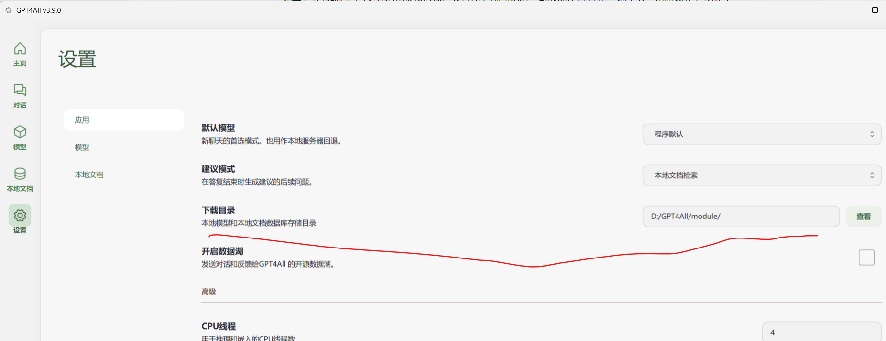
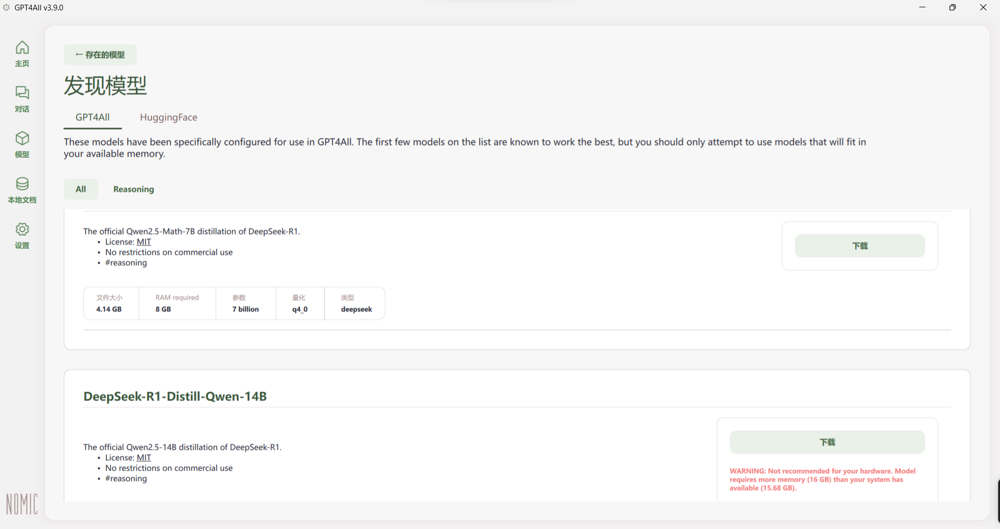
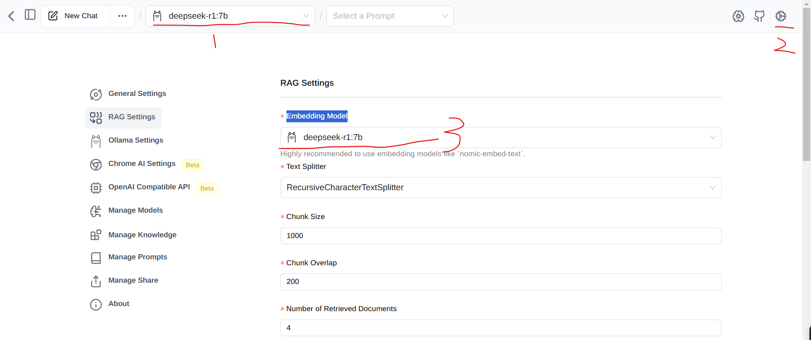
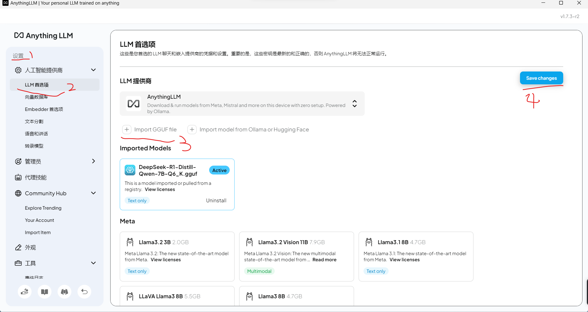
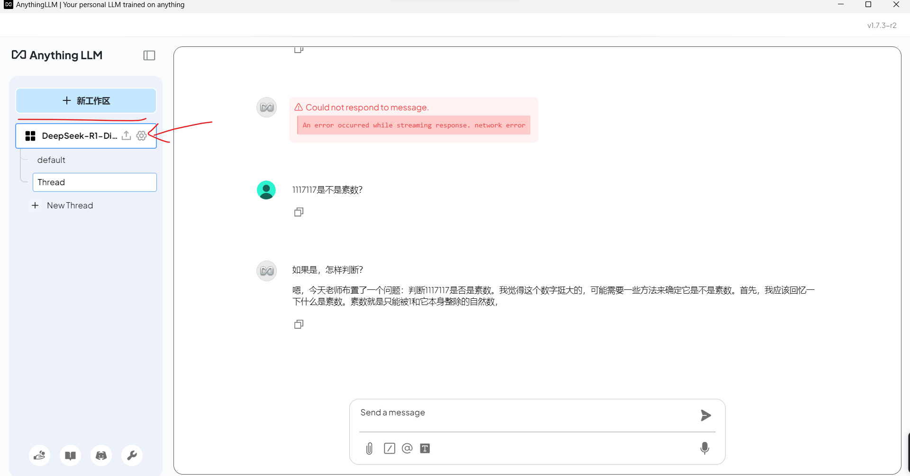
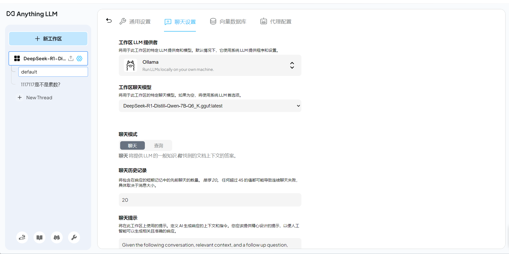

1. 感觉GPT4All用起来比ollama要流畅一些，同时GPT4All在界面的功能比ollama多，因为ollama是命令行工具，图形化界面可以通过page assist来实现的。
2. 使用ai模型推荐GPT4All，如果是开发ai模型推荐ollama
3. GPT4All支持上传文件，但是文件类型有限，仅支持md、图片等少量类型，docx和pdf都不支持；至于page assist就支持的类型最少，但page assist支持联网搜索
4. 下载电脑配置模型的大小的判断标准，主要有两种说法：一种是通过显存判断，7B需要4G的显存，一种是通过RAM+VRAM的大小大于模型文件1到2G即可，如果要高效率的问答则VRAM要大于模型的1到2G
5. 功能上AnythingLLM > GPT4All > ollama  
6. anythingLLM、GPT4All支持gguf文件，ollama可以转换gguf文件为自己支持的二进制文件
7. anythingLLM支持本地知识库，直接在工作区上传文件即可，如果想避免ai出现‘幻觉’，可以选择查询模式

# 通过GPT4All部署deepseek

1. 下载GPT4All。[GPT4All (官网)](https://www.nomic.ai/gpt4all)或[GPT4All(github.com)](https://github.com/nomic-ai/gpt4all)
2. 安装。初始界面时，左下角有一个设置，设置里有一个目录可以改（是关于远程仓库的），他原本是在Cpan，可以清除缓存后改在D盘。
3. 软件的安装目录也可以改在D盘
4. 模型下载方法：
   1. 第一种：在软件内下载
      1. 软件中ai模型的默认安装目录也是在C盘，可以改在D盘。下载目录在软件的设置的应用里面
      2. ai模型可以在模型里面找，软件中会显示不同模型的大小和配置要求，你的电脑配置不足的他会红色提示
      3. 也可以在huggingface里面搜索模型下载。
      4. 但是不知道为什么我在GPT4All中下载模型会自动卡住，下载一点就会自动卡住无法继续下载，要取消下载后关闭GPT4All再重启后，再点击继续下载有才只能下载一点
   2. 第二种：在huggingface官网下载
      1. 所以第二种下载方法，直接在huggingface里面下载，GPT4All支持的ai模型文件格式有gguf，还有没有其他格式我就不太清楚了。[deepseek-r1:7b（huggingface）](https://huggingface.co/bartowski/DeepSeek-R1-Distill-Qwen-7B-GGUF/tree/main)，huggingface在google打开页面格式才是正常的，可以用使用搜索功能
      2. 将下载好的文件放在模型的下载目录即可

# 通过ollama部署deepseek

1. 下载ollama。[Ollama](https://ollama.com/)

2. 安装ollama（会自动安装在c盘，目录：C:\Users\<你的用户名>\ollama）

3. 在命令提示符中输入命令`ollama run deepseek-r1:7b`。因为我下的是deepseek-r1:7b，所以就是这个，如果是下载其他的就换成其他的模型的名称，但要注意自己电脑的显存和运行内存够不够

4. 下载模型时不要开加速器

5. 如果下载到最后百分之几时出现速度很慢只有几十几百KB时，可以选择`Ctrl+c`中断下载，重新输入下载命令，ollama会接着之前的下载进度继续下载同时速度也会恢复正常，只有很小的概率会重新下载（我没遇到，网上有人说遇到了）

6. 因为ollama下载模型时的默认安装路径是C:\Users\<username>\.ollama\models，可以修改模型存放位置

   1. 打开环境变量编辑界面。可以通过以下方式：
      1. 右键点击“此电脑”或“我的电脑”，选择“属性”。

      2. 在系统窗口中选择“高级系统设置”。

      3. 在系统属性窗口中点击“环境变量”按钮。

   2. 在环境变量窗口中，点击“新建”创建一个新的系统变量或用户变量。
      1. 变量名：OLLAMA_MODELS
      2. 变量值：输入你希望设置的新模型存放路径，例如：D:\Ollama\Models
      3. 点击“确定”保存设置。

   3. 重启任何已经打开的Ollama相关应用程序，以便新的路径生效。

7. ollama是命令行的工具，同时可以接入pycharm的插件（codeGPT使用本地ollama中的模型）

8. 因为ollama只有命令行窗口，所以可以通过google的插件page assist实现web ui端窗口。在配置page assist中，除了开始页面要选择对应模型外，在设置的RAG设置的Embedding Model也要选择对应模型

   

9. 将gguf文件导入ollama中：[Ollama手动导入GGUF模型文件_ollama导入gguf模型-CSDN博客](https://blog.csdn.net/weixin_46241866/article/details/144700025)

# 通过AnythingLLM部署deepseek

[AnythingLLM本地知识库避坑指南+配置攻略 - 知乎 (zhihu.com)](https://zhuanlan.zhihu.com/p/21427971294)

1. 下载[AnythingLLM | The all-in-one AI application for everyone](https://anythingllm.com/)，可以安装在D盘。
2. 安装AnythingLLM时，如果没有安装ollama，会下载并安装ollama，此时如果不挂加速器会下载出问题。这时ollama会部署在AnythingLLM软件文件夹里面。也可以先安装ollama后再安装AnythingLLM，那么在安装AnythingLLM时就不会再次下载ollama了，如果没检查到系统下载了ollama，可以手动将ollama下载的窗口关闭。感觉单独下载ollama的情况下，模型的运行效果会好一些
3. 导入模型在设置中按照图片的标号选择，上传文件后一定要点击save changs
4. 进入后创建一个工作区，然后配置工作区，选择聊天设置，LLM提供者选择ollama（我用的时候感觉相同模型下，ollama比AnythingLLM自带的provider部署出来的ai好用），模型选择自己下载的模型（我的模型通过huggingface下载的guff文件，然后放在了AnythingLLM文件夹里面，它自己就扫出来了），配置好后一定要点击最下方的update workspace才能更新配置
5. AnythingLLM的anythingllm-desktop文件夹通常存放与 AnythingLLM 应用相关的信息，而anythingllm-desktop文件夹的默认路径："C:\Users\上善若水\AppData\Roaming\anythingllm-desktop"。
   1. 这些信息可能包括，
      1. **模型文件**：存储所有下载和使用的 AI 模型。
      2. **配置文件**：包含应用的配置和设置，例如模型路径、用户偏好等。
      3. **数据库文件**：存储应用的内部数据，例如用户输入、生成的响应等。
      4. **日志文件**：记录应用的运行日志和调试信息。
   2. 如果想将文件夹移到D盘存储，可以通过下面的操作：
      1. 将anythingllm-desktop文件夹移到D盘目录下"D:\AnythingLLM\anythingllm-desktop"
      2. 通过管理员身份调用命令提示符，输入命令`mklink /D "C:\Users\上善若水\AppData\Roaming\anythingllm-desktop" "D:\AnythingLLM\anythingllm-desktop"`
      3. 该操作建立了一个符号链接
   3. 如果想要还原：
      1. 现在原本的目录中创建一个空的相同命名的文件夹，即在"C:\Users\上善若水\AppData\Roaming"中创建anythingllm-desktop的空文件夹
      2. 输入命令`rmdir "C:\Users\上善若水\AppData\Roaming\anythingllm-desktop"`
      3. 再将原本的anythingllm-desktop文件夹移回原本的目录下"C:\Users\上善若水\AppData\Roaming\anythingllm-desktop"即可。

# chatbox

1. [Chatbox AI官网：办公学习的AI好助手，全平台AI客户端，官方免费下载](https://chatboxai.app/zh)
2. 可以调用api和本地模型，如果是ollama，在选择模型的时候选择ollama即可，他会自动接入找到ollama中的模型。记得运行ollama