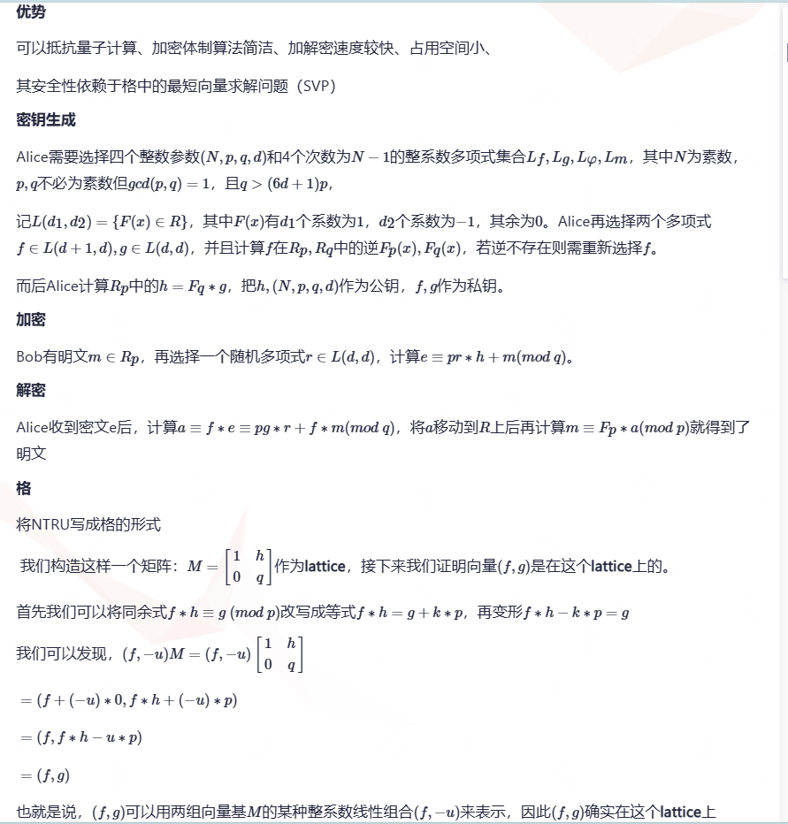
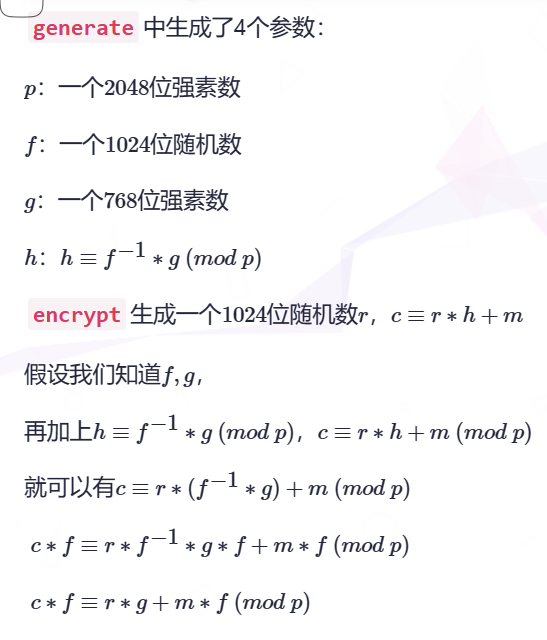
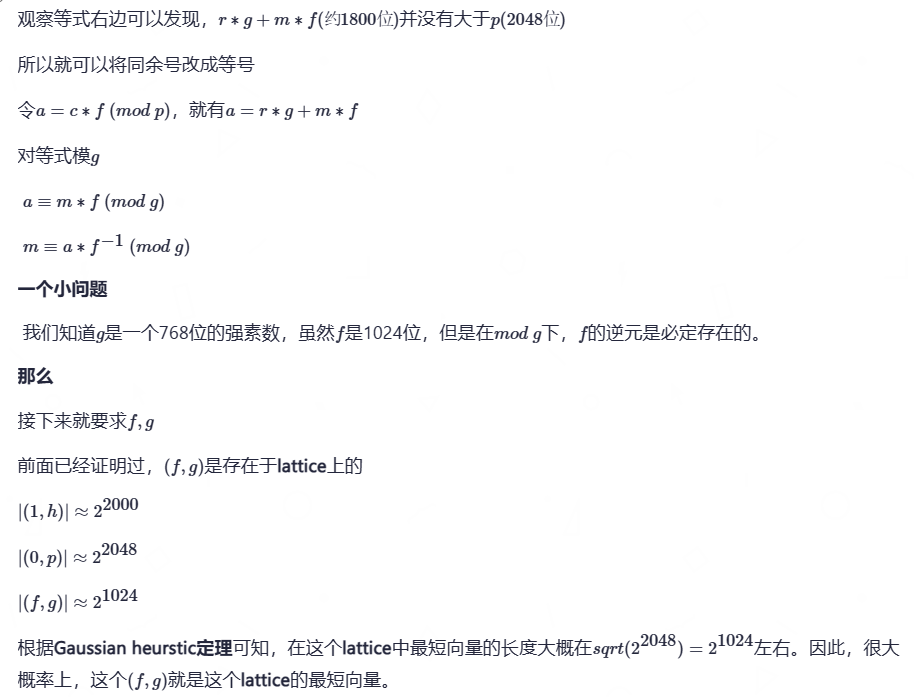

# 一维NTRU格密码

1. 此处是化简形式的NTRU密码，是一维NTRU密码

   1. 参数：$模：p，私钥：(f，g)，公钥：h\equiv f^{-1}g \mod p，临时密钥：r$，其中参数应当满足：$rg+fm<p, m<g$时才能解密
   2. 加密：$c \equiv rh + m \equiv rf^{-1}g + m \pmod{p}$
   3. 解密：$fc \equiv rg + fm \equiv fm \pmod{g}$，最后在乘上一个$f^{-1}$即可得到m
   4. 分析：
      1. 解密时不直接对c模g的原因：因为 $c \equiv rf^{-1}g + m \pmod{p}$，很明显$rf^{-1}g + m > p$（不然加密就没有太大意义，很容易被爆破）。此时对c模g，相当于$((rf^{-1}g + m )\mod{p})\mod{g}$，有信息损失，很明显不等于m
      2. 解密时，可以先乘$f$在模$g$的原因：因为$fc \equiv rg + fm \pmod{p}$，$rg+fm<p$, 所以$(rg+fm)\mod p = rg+fm$是没有信息损失的，可以直接模g得到$rg+fm \equiv fm \pmod g$。因为$m<g$，所以再最后乘一个$f^{-1} \pmod g$即可。

2. 如果从格的方向考虑攻击：

   1. 格$L = \begin{bmatrix} 1 & h \\ 0 & p \end{bmatrix}$，同时由于$h \equiv f^{-1}g \pmod{p}$，所以有$hf+kp=g$
   2. 因为$(f,k)L = (f, fh+pk) = (f,g)$，所以$(f, g)$是格中的一个格点
   3. 更多条件：$f<\frac{1}{2}p^{\frac{1}{2}},g<\frac{1}{2}p^{\frac{1}{2}},m<\frac{1}{4}p^{\frac{1}{2}},r<\frac{1}{2}p^{\frac{1}{2}}$，由此可以发现$||b|| = f^{2} + \sqrt{g^{2}} < \frac{p}{2}$，如果此时的b是格中的最短向量，那么就将这个问题转化成了求格的最短向量问题

3. 例题：

   1. 题目：

      ```python 
      from Crypto.Util.number import *
      
      p = getPrime(1024)
      f = getPrime(400)
      g = getPrime(512)
      r = getPrime(400)
      
      h = inverse(f, p) * g % p
      
      m = b'******'
      m = bytes_to_long(m)
      
      c = (r *  h + m) % p
        
      print(f'p = {p}')
      print(f'h = {h}')
      print(f'c = {c}')
      
      '''
      p = 170990541130074930801165526479429022133700799973347532191727614846803741888876816210632483231997413973919037199883422312436314365293577997262903161076615619596783971730864586404602951191341733308807254112018161897113881363794353050758324742415299277578203838160939521046655099610387485947145087271531951477031
      h = 19027613518333504891337723135627869008620752060390603647368919831595397216728378486716291001290575802095059192000315493444659485043387076261350378464749849058547797538347059869865169867814094180939070464336693973680444770599657132264558273692580535803622882040948521678860110391309880528478220088107038861065
      c = 75639016590286995205676932417759002029770539425113355588948888258962338419567264292295302442895077764630601149285564849867773180066274580635377957966186472159256462169691456995594496690536094824570820527164224000505303071962872595619159691416247971024761571538057932032549611221598273371855762399417419551483
      '''
      ```

   

4. 攻击代码：

   ```sage
   from Crypto.Util.number import *
      
   p = ...
   h = ...
   c = ...
   L = Matrix(ZZ, [[1, h],
                  [0, p]])
      
   f, g = L.LLL()[0]
      
   m = (f * c) % p % g * inverse_mod(f, g) % g
      
   print(long_to_bytes(m))
   ```

5. ZZ：整数域；QQ：有理数域

6. LLL算法（格基规约）：一般最短向量是在LLL算法求出的第一个基上面，所以是`L.LLL()[0]`，有时也会是第二组、第三组……，即`L.LLL()[1]`、`L.LLL()[2]`、……


# NTRU密码

[NTRU格密码](https://www.cnblogs.com/sCh3n/p/15917388.html)，[NTRU学习笔记](https://tover.xyz/p/NTRU/#%E5%A4%9A%E9%A1%B9%E5%BC%8F%E7%8E%AF%E5%92%8C%E5%8F%82%E6%95%B0%E9%80%89%E5%8F%96)

1. 其安全性依赖于格中的最短向量求解问题（SVP）                                                                                                         

1. 例题：newstar2023（babyNTRU）

   1. 题目：

      ```python
      from Crypto.Util.number import *
      import gmpy2
      from flag import flag
      
      
      def generate():
          p = getStrongPrime(2048)
          while True:
              f = getRandomNBitInteger(1024)
              g = getStrongPrime(768)
              h = gmpy2.invert(f, p) * g % p
              return (p, f, g, h)
      
      
      def encrypt(plaintext, p, h):
          m = bytes_to_long(plaintext)
          r = getRandomNBitInteger(1024)
          c = (r * h + m) % p
          return c
      
      
      p, f, g, h = generate()
      c = encrypt(flag, p, h)
      with open("cipher.txt", "w") as f:
          f.write("h = " + str(h) + "\n")
          f.write("p = " + str(p) + "\n")
          f.write("c = " + str(c) + "\n")
      '''
      h = 7257231567493321493497732423756001924698993879741072696808433246581786362611889417289029671240997843541696187487722285762633068287623369923457879458577466240950224087015909821079480431797917376609839097610864517760515986973340148901898582075413756737310797402537478388864632901178463429574227279668004092519322204990617969134092793157225082977967228366838748193084097651575835471869030934527383379794480007872562067799484905159381690179011192017159985260435844246766711550315143517066359521598424992244464723490166447105679062078049379153154659732304112563255058750656946353654402824529058734270363154894216317570784
      p = 23969137365202547728693945383611572667294904799854243194734466236017441545927679469239814785947383727854265554138290421827510545078908517696536495567625593439996528098119344504866817224169113920532528233185011693829122447604993468817512696036673804626830507903206709121383065701222707251053362179946170981868061834734684494881504724254812067180384269711822738708203454131838741703416329765575995359232573740932069147491776326045743679105041246906081872936901848272288949389026129761726749334006319072981386763830897454245553866145620689939497868469730297795063648030738668273210516497399954626983672357236110363894081
      c = 6388077150013017095358415295704360631706672647932184267739118115740221804173068089559645506533240372483689997499821300861865955720630884024099415936433339512125910973936154713306915269365877588850574948033131161679256849814325373882706559635563285860782658950169507940368219930971600522754831612134153314448445006958300840618894359885321144158064446236744722180819829183828290798747455324761671198097712539900569386477647697973195787663298318786718012522378981137877863153067057280649127202971806609339007027052518049995341356359016898069863799529357397514218249272201695539181908803360181347114492616706419618151757
      '''
      ```

   2. 解析：                                                                                                                                            

   3. 解密脚本

   ```python
   h = ...
   p = ...
   c = ...
   
   # Construct lattice.
   v1 = vector(ZZ, [1, h])
   v2 = vector(ZZ, [0, p])
   m = matrix([v1,v2]);
   
   # Solve SVP.
   shortest_vector = m.LLL()[0]
   f, g = shortest_vector
   print(f, g)
   
   # Decrypt.
   a = f*c % p % g
   m = a * inverse_mod(f, g) % g
   print(hex(m).decode('hex'))
   ```

   # NTRU加解密流程
   
   ## 参数选择
   
   NTRU加密系统依赖于三个整数参数（N, p, q）和四个由N-1次整数系数多项式构成的集合$\mathcal{L}_f, \mathcal{L}_g, \mathcal{L}_\phi, \mathcal{L}_m$。注意p和q不必是素数，但$gcd(p, q)=1$，且$q>(6d+1)p$。我们在环$R=Z[X]/(X^N-1)$中进行运算，其中元素$F\in R$既可以表示为多项式，也可以表示为向量:$ F = \sum_{i=0}^{N-1} F_i x^i = [F_0, F_1, \ldots, F_{N-1}]$。
   
   经典参数值：$(N,q,p,d,F(x)) = (251, 256, 3, 72, X^N-1)$，其中d是用来限制非0系数的个数，正整数
   
   ## 密钥生成（pk=h, sk=f）
   
   记$\mathcal{L}{(d_1,d_2)}=\{F(x)\in R\}$，其中$F(x)$有$d_1$个系数为1，$d_2$个系数为−1，其余为0。再选择两个多项式$f\in \mathcal{L}(d+1,d),g\in \mathcal{L}(d,d)$，并且计算$f$在$R_p,R_q$中的逆$F_p(x),F_q(x)$，若逆不存在则需重新选择$f$。最后计算$R_p$中的$h=F_q∗g$，把$h$作为公钥，$f$作为私钥。
   
   
   
   ## 加密
   
   选择明文$m \in R_p$，再选择一个随机多项式$r \in \mathcal{L}(d, d)$, 加密得到$c \equiv pr*h+m \pmod q$
   
   ## 解密
   
   $a \equiv f*c \pmod q$, 得到$m \equiv F_p * a \pmod p$
   
   解密原理：
   $$
   a \equiv f*c \equiv f*pr*h+f*m \pmod q \\
   \equiv f*F_q*g*pr + f*m\equiv g*pr+f*m \pmod q \\
   $$
    因为$g*pr+f*m $有大概率所有系数都在$[-q/2,q/2]$内，所以对$g*pr+f*m $的系数进行模$q$约简至该区间时，可以精确恢复多项式$a=g*pr+f*m$，在环$R=Z[X]/(X^N-1)$中。因此
   $$
   F_p *a \equiv F_p * p * gr + m \pmod p \\
   \equiv m \pmod p
   $$
   成功恢复明文m

# 安全性分析

## 暴力破解攻击

攻击者可以通过遍历所有可能的私钥候选 $f\in \mathcal{L}_f$，并测试$f * h \pmod q$ 的结果是否为“小”系数来恢复私钥；或者通过遍历所有可能的公钥候选$g\in \mathcal{L}_g$，并测试$g* h^{-1} \pmod q$（等价地测试$g* h^{-1}$）的结果是否为“小”系数来恢复私钥。同理，攻击者也可以恢复一条密文所对应的明文消息：遍历所有可能的消息多项式 $r\in \mathcal{L}_r$，并测试$e - r* h \pmod q$是否为“小”系数。从实际情况看，候选空间$\mathcal{L}_g$通常要比$\mathcal{L}_f$小，所以在不考虑中间人攻击的前提下, 密钥安全性由$ \lvert \mathcal{L}_g\rvert $决定，消息安全性由$\lvert \mathcal{L}_r\rvert$决定。然而，正如下一节所述，如果允许足够的存储，就可以进行中间人攻击，使得搜索时间降为通常的平方根量级。因此安全强度（security level）可表示为：
$$
\left(\begin{array}{c}
\text{Key} \\
\text{Security}
\end{array}\right) = \sqrt{\# \mathcal{L}_{g}} = \frac{1}{d_{g}!} \sqrt{\frac{N!}{(N - 2d_{g})!}}
$$

$$
\left(\begin{array}{c}
\text{Message} \\
\text{Security}
\end{array}\right) = \sqrt{\# \mathcal{L}_{\phi}} = \frac{1}{d!} \sqrt{\frac{N!}{(N - 2d)!}}
$$

## 中间人攻击

对密文消息形式$e = r*h + m \bmod q$的分析。Andrew Odlyzko指出，可以针对$r$发起中间人（meet-in-the-middle）攻击。类似地，这种思路也可用于恢复私钥 $f$。简而言之，将 $f$拆分为两部分：$f= f_1 + f_2$。然后在候选空间中分别枚举$f_1*e$和 $-f_2*e$进行匹配，寻找$ (f_1, f_2)$ 使得对应的系数具有近似相同的值。因此，为了达到$2^{80}$ 的安全强度，必须相应地选择 $f,g,r$ 的参数，使得每个集合的候选数量大约为$2^{160}$

## 多重传输攻击

如果使用同一个公钥但每次选用不同的随机多项式$r$将同一条消息$m$重复加密多次，那么攻击者就能恢复消息的大部分内容。简要地说，假设发送了$e_i \equiv r_i \otimes h + m \pmod q,\quad i=1,2,\dots,n$。那么攻击者可以计算$(e_i - e_1)\otimes h^{-1}\pmod q$。从而得到$r_i - r_1 \pmod q$。由于每个$r$的系数都非常小，攻击者实际上能够精确地恢复出$r_i - r_1$（无需模减回归），并据此恢复出$r_1$的许多系数。如果重传次数n为一个适中的大小（例如 4 或 5），攻击者就可以通过对剩余系数进行暴力枚举，完全恢复出$r_1$，进而直接解出$m$。因此，在未对消息做进一步混淆的情况下，不建议多次使用同一个公钥重传同一消息。我们还要指出，即便攻击者用这种方法解出了某一次的消息，也并不会帮助她破解之后的其他重传消息。