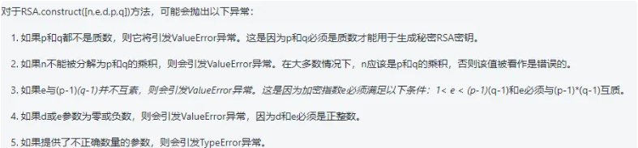
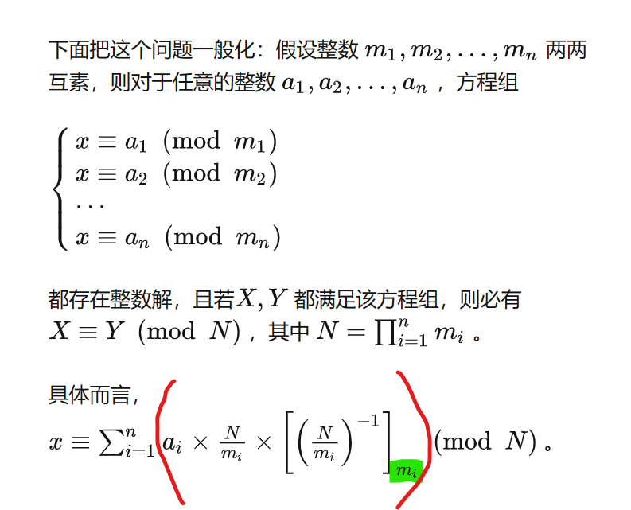
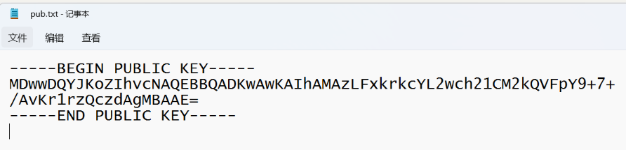
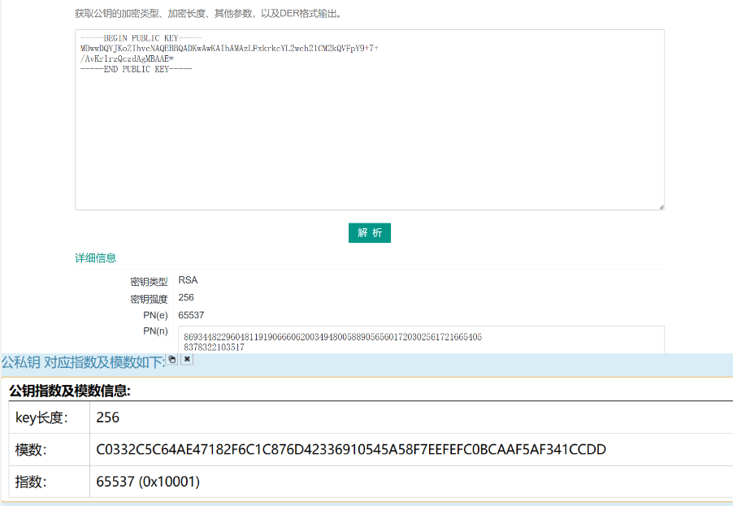
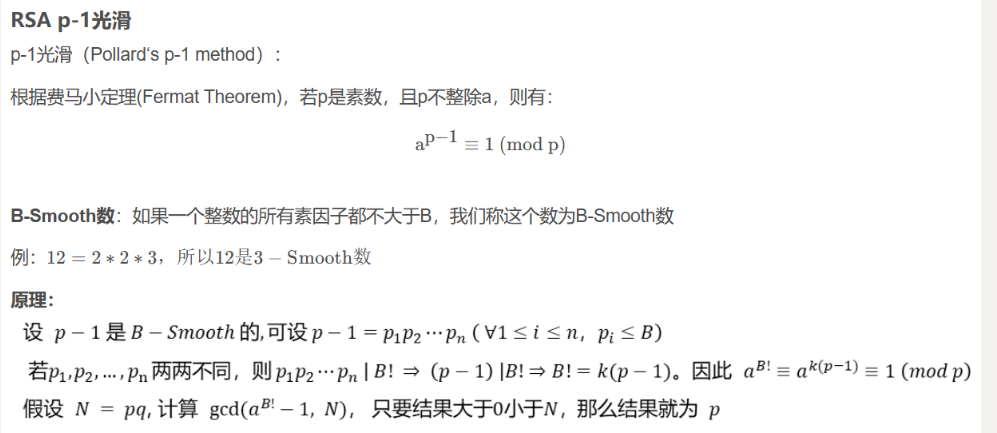
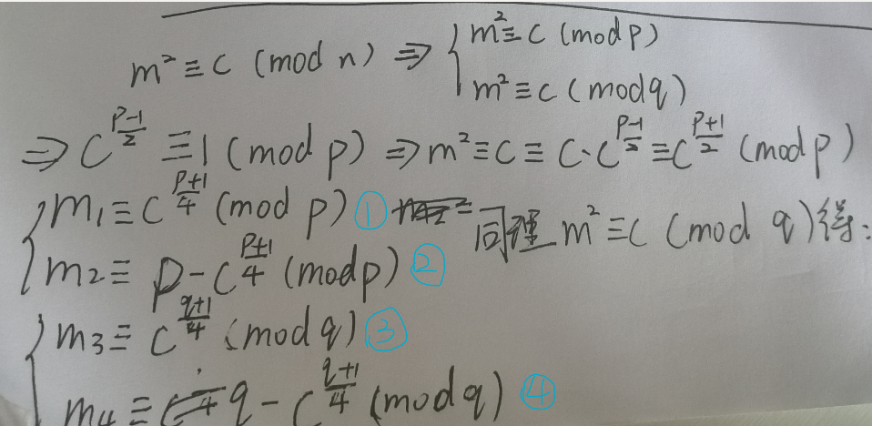

# RSA密码：

1. RSA加密算法是一种非对称加密算法，这种算法非常可靠，密钥越长，它就越难破解。根据已经披露的文献，目前被破解的最长RSA密钥是768个二进制位。
2. 大多数时候e=65537（0x10001）
3. RSA算法1（传统方式）：
   1. RSA都是大整数计算
   2. 任意选取两个不同的大素数p和q计算乘积 $n=pq，\varphi(n)=(p-1)(q-1)$
   3. 任意选取一个大整数e,满足$gcd(e,\varphi(n))=1$，整数e用做加密钥（注意：e的选取是很容易的，例如，所有大于p和q的素数都可用）$gcd()$：求最大公约数。
   4. 确定的解密钥d，满足$(de)\bmod \varphi(n)=1$，即$de=k\varphi(n)+1，k\geq1$（字母之间相乘，乘号省略，eg：de=d*e；d是整数）是一个任意的整数；所以，若知道e和$\varphi(n)$，则很容易计算出d；
      1. 合格的密钥d应与n互质，即gcd（d,n）=1，这是隐含条件，所以可能p、q、n、d、e按照上述方法生成，最终得到的d却不是合格的密钥，不能满足python函数 RSA.construct([n,e,d,p,q]) ，即这组数据的d没有有效性（d和n不互质），p、q不可用。如2023年 ciscn 的badkey一题
      2. python函数 RSA.construct([n,e,d,p,q]) 报错的原因：
         1. d和n不互质
         2. ​               
   5. 公开整数n和e，秘密保存d
   6. 将明文m（m<n是一个整数）加密成密文c，加密算法为c  =  E(m) = m ^ e mod n
   7. 将密文c解密为明文m，解密算法为 m = D(c) = c ^d mod n
4. RSA算法2（中国剩余定理）：
   1. 中国剩余定理：[https://zhuanlan.zhihu.com/p/44591114](https://zhuanlan.zhihu.com/p/44591114)，[https://blog.csdn.net/qq_41115702/article/details/105909120](https://blog.csdn.net/qq_41115702/article/details/105909120)!
   2. 计算dp，使得dp*_e = 1 mod(p-1)，即 dp= (1/e) mod (p-1)_
   3. _计算dq，使得dq*_e = 1 mod(q-1)，即dq = (1/e) mod (q-1)<br />此外需要第三个元素，既q对p的逆元
   4. 计算qInv，使得qInv * q = 1 mod p，即qInv = (1/q) mod p<br />私钥是 (p, q, dp, dq, qInv)
   5. 解密方法：
      1. m1=c^dp mod p
      2. m2=c^dq mod q
      3. h= （qInv*(m1 - m2)） mod p
      4. m = m2 + h*q
      5. m就是明文。
5. 其中在python中有一函数getPrime()用之生成素数，通常会用getPrime(1024)其中这里的1024指的是生成的素数的二进制有1024位，当进行乘法运算时，乘积的位数是两个乘数位数之和（或之和减去1）有些题可以通过推算位数来缩小枚举的范围，减少脚本的运算时间。

# RSA解密常用工具：

1. 常用工具：
   1. linux的openssl
   2. [http://factordb.com/index.php?query=101991809777553253470276751399264740131157682329252673501792154507006158434432009141995367241962525705950046253400188884658262496534706438791515071885860897552736656899566915731297225817250639873643376310103992170646906557242832893914902053581087502512787303322747780420210884852166586717636559058152544979471](http://factordb.com/index.php?query=101991809777553253470276751399264740131157682329252673501792154507006158434432009141995367241962525705950046253400188884658262496534706438791515071885860897552736656899566915731297225817250639873643376310103992170646906557242832893914902053581087502512787303322747780420210884852166586717636559058152544979471)（大整数分解）
2. [https://the-x.cn/cryptography/Rsa.aspx](https://the-x.cn/cryptography/Rsa.aspx)（基本不用）

# 共模攻击

1. 给2个公钥，2个密文：共模攻击（用脚本）：明文m、模数n相同，公钥指数e、密文c不同，gcd（e1，e2）==1也就是e1和e2互质。同一个明文，使用2个不同的公钥加密得到了不同的密文，对同一明文的多次加密使用相同的模数和不同的公钥指数可能导致共模攻击。

2. > 解密证明：m=(c1^s1)*(c2^s2)
   > 带入 c1 = m^e1%n   c2 = m^e2%n  两个公式计算
   > (c1^s1)*(c2^s2)%n=((m^e1%n)^s1*(m^e2%n)^s2)%n
   > =>(c1^s1)*(c2^s2)%n=((m^e1%n)^s1%n*(m^e2%n)^s2%n)%n    #(a*b)%n=(a%n*b%n)%n
   > =>(c1^s1)*(c2^s2)%n=((m^e1)^s1%n*(m^e2)^s2%n)%n    #((a%n)^b)%n=a^b%n     
   > =>(c1^s1)*(c2^s2)%n=((m^e1)^s1*(m^e2)^s2)%n        #((a%p)*(b%p))%p=(a^b)%p
   > =>(c1^s1)*(c2^s2)%n=((m^(e1*s1)*(m^(e2*s2))%n    #幂的乘方，底数不变，指数想乘
   > =>(c1^s1)*(c2^s2)%n=((m^(e1*s1+e2*s2))%n
   > 因为e1*s1+e2*s2=1  得：
   > (c1^s1)*(c2^s2)%n=m^(1)%n
   > (c1^s1)*(c2^s2)%n=m%n
   > (c1^s1)*(c2^s2)=m    #根据等式性质

# 多层模n加密

1. 模n不互素，需要使用欧几里得算法求取模之间的公约数，也可以直接用p = gmpy2.gcd(n1, n2) 这个系统提供的欧几里得封装函数。根据欧几里德算法算出的p之后，再用n除以p即可求出q，由此可以得到的参数有p、q1，q2、n1、n2、e，再使用常规方法计算出d，即可破解密文。（一般会给两个n，两个c，一个e，且n特别大）

# 模n不互素

1. 指解题中RSA类型给了多个模n，且都是2048bit 4096bit等无法正面分解的数，与RSA多层模n加密的区别就是模不互素只用一个n加密，另一个n是给你求公因子而已。

# pem文件格式

1. 给两个文件，一个是flag.enc文件，一个是pub.key文件。pub.key文件提示我们这是公钥，pub对应public。将pub.key文件的后缀名改为txt，会得到一个密文（如果是.pem，.der文件可能也是如此）:
   1. 类似：(这也是pem格式的公钥,私钥类似，将public改为private)
   2. 然后将之用网站解密，得到n和e（[http://www.hiencode.com/pub_asys.html](http://www.hiencode.com/pub_asys.html)，还可以用[http://tool.chacuo.net/cryptrsakeyparse](http://tool.chacuo.net/cryptrsakeyparse)（这个网站貌似有点问题）都是直接将pub.key的内容直接粘贴就行，包括开头和结尾---BEGIN PUBLIC KEY---、---END PUBLIC KEY ----），例如：                                                                 
   3. 其中模数对应的n，后面指数对应的e，其中n是16进制的，所以再将n转换为十进制。
   4. 在用大素数分解，得到q、p（[http://factordb.com/index.php?query=86934482296048119190666062003494800588905656017203025617216654058378322103517](http://factordb.com/index.php?query=86934482296048119190666062003494800588905656017203025617216654058378322103517)）
   5. 最后用脚本解密（将flag.enc文件和脚本放在同一文件夹中）
   6. 这道题还可以试一下linux的命令： openssl rsa -in xxx.pem -inform PEM -text 来打开pem文件

# 只给n、e、c的

1. 例如RSAROLL，前两个是n和e，后面是拆分开的c，每一行c对应一个明文，解密后再将其拼在一起。

# RSA算法3（低加密指数攻击）：

1. 指数e很小（通常e=3），模数n很大

2. 有RSA加密公式： C=M^e % n (C密文，M明文)

3. 当M^e < n 时，C = M^e ，所以对C开方就能得到M；当M^e ＞ n 时，此时用爆破的方法假设我们 Ｍ^e / n 的商为 k 余数为C，则Ｍ^e = kn + C，对K进行爆破，只要k满足 kn + C能够开e次方就可以得明文。根据经验来说e一般不是一个太大的数，输出有很多，从正到负都有，我们想要的就是输出刚刚从负变正的时候对应的e

4. 低加密指数攻击：指数e小（e=3），模数n大，例如dangerous RSA一题，但是此题再给数据的时候有坑，给的 n的16进制的数的末尾多了一个L，可能会导致脚本编译出错。应该是出题的人用的是python2，在python2中用hex函数时，会自动将转换16进制后的数的后面添加一个L

5. 脚本（两个不同，一种不行换另一种）：

   1. python

   ```python
   import gmpy2,libnum
   import rsa
   from gmpy2 import *
   from Crypto.Util.number import *
   # n = 0x52d483c27cd806550fbe0e37a61af2e7cf5e0efb723dfc81174c918a27627779b21fa3c851e9e94188eaee3d5cd6f752406a43fbecb53e80836ff1e185d3ccd7782ea846c2e91a7b0808986666e0bdadbfb7bdd65670a589a4d2478e9adcafe97c6ee23614bcb2ecc23580f4d2e3cc1ecfec25c50da4bc754dde6c8bfd8d1fc16956c74d8e9196046a01dc9f3024e11461c294f29d7421140732fedacac97b8fe50999117d27943c953f18c4ff4f8c258d839764078d4b6ef6e8591e0ff5563b31a39e6374d0d41c8c46921c25e5904a817ef8e39e5c9b71225a83269693e0b7e3218fc5e5a1e8412ba16e588b3d6ac536dce39fcdfce81eec79979ea6872793
   # c = 0x10652cdfaa6b63f6d7bd1109da08181e500e5643f5b240a9024bfa84d5f2cac9310562978347bb232d63e7289283871efab83d84ff5a7b64a94a79d34cfbd4ef121723ba1f663e514f83f6f01492b4e13e1bb4296d96ea5a353d3bf2edd2f449c03c4a3e995237985a596908adc741f32365
   # e = 3
   # n=int(input("请输入n：(16进制)"),16)
   # c=int(input("请输入c：(16进制)"),16)
   # e=int(input("请输入e：(16进制)"),16)
   n = int(input("请输入n："))
   c = int(input("请输入c："))
   e = int(input("请输入e："))
   # n = int(n)
   # c = int(c)
   m1 = gmpy2.iroot(c, e)
   if m1[1]==False:
       k = 1
       m1 = gmpy2.iroot(c + k * n, e)
       while m1[1] == False:
           k = k + 1
           m1 = gmpy2.iroot(c + k * n, e)
   m = long_to_bytes(m1[0])
   flag = m.decode()
   print(flag)
   # flag{25df8caf006ee5db94d48144c33b2c3b}
   ```

   2. sage

   ```sage
   #flag{sm4ll_r00ts_is_brilliant#cc0dac72}
   c = 11188201757361363141578235564807411583085091933389381887827791551369738717117549969067660372214366275040055647621817803877495473068767571465521881010707873686036336475554105314475193676388608812872218943728455841652208711802376453034141883236142677345880594246879967378770573385522326039206400578260353074379
   n = 131889193322687215946601811511407251196213571687093913054335139712633125177496800529685285401802802683116451016274353008428347997732857844896393358010946452397522017632024075459908859131965234835870443110233375074265933004741459359128684375786221535003839961829770182916778717973782408036072622166388614214899
   
   m0 = s2n(b'sm4ll_r00ts_is_brilliant')
   e = 5
   #参数：implementation='NTL'使多项式环的计算更高效，功能更丰富
   R.<x> = PolynomialRing(Zmod(n), implementation='NTL')
   #枚举未知部分的长度
   for i in range(100):
       # m0 * 2 ** (i * 8)：左移i*8位，因为一个字节对应8位二进制
       m = m0 * 2 ** (i * 8) + x 
       f = m **e - c
       f = f.monic()
       y = f.small_roots(X = 2 ** (i * 8))
       if y:
           for k in y:
               m = n2s(int(k))
               print(m)
   
   输出：
   b'#cc0dac72'
   
   ```


# 低加密指数广播攻击(Hastad)：

1. 指解题中RSA类型给了多个n、c、一个e，广播指我们需要将一份明文进行多份加密，但是每份使用不同的密钥，密钥中的模数n不同但指数e相同且很小，我们只要拿到多份密文和对应的n就可以利用中国剩余定理进行解密。

2. 第一种（给e，一般e=65537）：给多组n、c

   1. 代码：（buuctf第2页RSA5）

      ```python
      解密代码
      from Crypto.Util.number import *
      from gmpy2 import *
      e = 65537
      n1 = 20474918894051778533305262345601880928088284471121823754049725354072477155873778848055073843345820697886641086842612486541250183965966001591342031562953561793332341641334302847996108417466360688139866505179689516589305636902137210185624650854906780037204412206309949199080005576922775773722438863762117750429327585792093447423980002401200613302943834212820909269713876683465817369158585822294675056978970612202885426436071950214538262921077409076160417436699836138801162621314845608796870206834704116707763169847387223307828908570944984416973019427529790029089766264949078038669523465243837675263858062854739083634207
      c1 = 974463908243330865728978769213595400782053398596897741316275722596415018912929508637393850919224969271766388710025195039896961956062895570062146947736340342927974992616678893372744261954172873490878805483241196345881721164078651156067119957816422768524442025688079462656755605982104174001635345874022133045402344010045961111720151990412034477755851802769069309069018738541854130183692204758761427121279982002993939745343695671900015296790637464880337375511536424796890996526681200633086841036320395847725935744757993013352804650575068136129295591306569213300156333650910795946800820067494143364885842896291126137320
      
      n2 = 20918819960648891349438263046954902210959146407860980742165930253781318759285692492511475263234242002509419079545644051755251311392635763412553499744506421566074721268822337321637265942226790343839856182100575539845358877493718334237585821263388181126545189723429262149630651289446553402190531135520836104217160268349688525168375213462570213612845898989694324269410202496871688649978370284661017399056903931840656757330859626183773396574056413017367606446540199973155630466239453637232936904063706551160650295031273385619470740593510267285957905801566362502262757750629162937373721291789527659531499435235261620309759
      c2 = 15819636201971185538694880505120469332582151856714070824521803121848292387556864177196229718923770810072104155432038682511434979353089791861087415144087855679134383396897817458726543883093567600325204596156649305930352575274039425470836355002691145864435755333821133969266951545158052745938252574301327696822347115053614052423028835532509220641378760800693351542633860702225772638930501021571415907348128269681224178300248272689705308911282208685459668200507057183420662959113956077584781737983254788703048275698921427029884282557468334399677849962342196140864403989162117738206246183665814938783122909930082802031855
      
      n3 = 25033254625906757272369609119214202033162128625171246436639570615263949157363273213121556825878737923265290579551873824374870957467163989542063489416636713654642486717219231225074115269684119428086352535471683359486248203644461465935500517901513233739152882943010177276545128308412934555830087776128355125932914846459470221102007666912211992310538890654396487111705385730502843589727289829692152177134753098649781412247065660637826282055169991824099110916576856188876975621376606634258927784025787142263367152947108720757222446686415627479703666031871635656314282727051189190889008763055811680040315277078928068816491
      c3 = 4185308529416874005831230781014092407198451385955677399668501833902623478395669279404883990725184332709152443372583701076198786635291739356770857286702107156730020004358955622511061410661058982622055199736820808203841446796305284394651714430918690389486920560834672316158146453183789412140939029029324756035358081754426645160033262924330248675216108270980157049705488620263485129480952814764002865280019185127662449318324279383277766416258142275143923532168798413011028271543085249029048997452212503111742302302065401051458066585395360468447460658672952851643547193822775218387853623453638025492389122204507555908862
      
      n4 = 21206968097314131007183427944486801953583151151443627943113736996776787181111063957960698092696800555044199156765677935373149598221184792286812213294617749834607696302116136745662816658117055427803315230042700695125718401646810484873064775005221089174056824724922160855810527236751389605017579545235876864998419873065217294820244730785120525126565815560229001887622837549118168081685183371092395128598125004730268910276024806808565802081366898904032509920453785997056150497645234925528883879419642189109649009132381586673390027614766605038951015853086721168018787523459264932165046816881682774229243688581614306480751
      c4 = 4521038011044758441891128468467233088493885750850588985708519911154778090597136126150289041893454126674468141393472662337350361712212694867311622970440707727941113263832357173141775855227973742571088974593476302084111770625764222838366277559560887042948859892138551472680654517814916609279748365580610712259856677740518477086531592233107175470068291903607505799432931989663707477017904611426213770238397005743730386080031955694158466558475599751940245039167629126576784024482348452868313417471542956778285567779435940267140679906686531862467627238401003459101637191297209422470388121802536569761414457618258343550613
      
      n5 = 22822039733049388110936778173014765663663303811791283234361230649775805923902173438553927805407463106104699773994158375704033093471761387799852168337898526980521753614307899669015931387819927421875316304591521901592823814417756447695701045846773508629371397013053684553042185725059996791532391626429712416994990889693732805181947970071429309599614973772736556299404246424791660679253884940021728846906344198854779191951739719342908761330661910477119933428550774242910420952496929605686154799487839923424336353747442153571678064520763149793294360787821751703543288696726923909670396821551053048035619499706391118145067
      c5 = 15406498580761780108625891878008526815145372096234083936681442225155097299264808624358826686906535594853622687379268969468433072388149786607395396424104318820879443743112358706546753935215756078345959375299650718555759698887852318017597503074317356745122514481807843745626429797861463012940172797612589031686718185390345389295851075279278516147076602270178540690147808314172798987497259330037810328523464851895621851859027823681655934104713689539848047163088666896473665500158179046196538210778897730209572708430067658411755959866033531700460551556380993982706171848970460224304996455600503982223448904878212849412357
      
      n6 = 21574139855341432908474064784318462018475296809327285532337706940126942575349507668289214078026102682252713757703081553093108823214063791518482289846780197329821139507974763780260290309600884920811959842925540583967085670848765317877441480914852329276375776405689784571404635852204097622600656222714808541872252335877037561388406257181715278766652824786376262249274960467193961956690974853679795249158751078422296580367506219719738762159965958877806187461070689071290948181949561254144310776943334859775121650186245846031720507944987838489723127897223416802436021278671237227993686791944711422345000479751187704426369
      c6 = 20366856150710305124583065375297661819795242238376485264951185336996083744604593418983336285185491197426018595031444652123288461491879021096028203694136683203441692987069563513026001861435722117985559909692670907347563594578265880806540396777223906955491026286843168637367593400342814725694366078337030937104035993569672959361347287894143027186846856772983058328919716702982222142848848117768499996617588305301483085428547267337070998767412540225911508196842253134355901263861121500650240296746702967594224401650220168780537141654489215019142122284308116284129004257364769474080721001708734051264841350424152506027932
      
      n7 = 25360227412666612490102161131174584819240931803196448481224305250583841439581008528535930814167338381983764991296575637231916547647970573758269411168219302370541684789125112505021148506809643081950237623703181025696585998044695691322012183660424636496897073045557400768745943787342548267386564625462143150176113656264450210023925571945961405709276631990731602198104287528528055650050486159837612279600415259486306154947514005408907590083747758953115486124865486720633820559135063440942528031402951958557630833503775112010715604278114325528993771081233535247118481765852273252404963430792898948219539473312462979849137
      c7 = 19892772524651452341027595619482734356243435671592398172680379981502759695784087900669089919987705675899945658648623800090272599154590123082189645021800958076861518397325439521139995652026377132368232502108620033400051346127757698623886142621793423225749240286511666556091787851683978017506983310073524398287279737680091787333547538239920607761080988243639547570818363788673249582783015475682109984715293163137324439862838574460108793714172603672477766831356411304446881998674779501188163600664488032943639694828698984739492200699684462748922883550002652913518229322945040819064133350314536378694523704793396169065179
      
      n8 = 22726855244632356029159691753451822163331519237547639938779517751496498713174588935566576167329576494790219360727877166074136496129927296296996970048082870488804456564986667129388136556137013346228118981936899510687589585286517151323048293150257036847475424044378109168179412287889340596394755257704938006162677656581509375471102546261355748251869048003600520034656264521931808651038524134185732929570384705918563982065684145766427962502261522481994191989820110575981906998431553107525542001187655703534683231777988419268338249547641335718393312295800044734534761692799403469497954062897856299031257454735945867491191
      c8 = 6040119795175856407541082360023532204614723858688636724822712717572759793960246341800308149739809871234313049629732934797569781053000686185666374833978403290525072598774001731350244744590772795701065129561898116576499984185920661271123665356132719193665474235596884239108030605882777868856122378222681140570519180321286976947154042272622411303981011302586225630859892731724640574658125478287115198406253847367979883768000812605395482952698689604477719478947595442185921480652637868335673233200662100621025061500895729605305665864693122952557361871523165300206070325660353095592778037767395360329231331322823610060006
      
      n9 = 23297333791443053297363000786835336095252290818461950054542658327484507406594632785712767459958917943095522594228205423428207345128899745800927319147257669773812669542782839237744305180098276578841929496345963997512244219376701787616046235397139381894837435562662591060768476997333538748065294033141610502252325292801816812268934171361934399951548627267791401089703937389012586581080223313060159456238857080740699528666411303029934807011214953984169785844714159627792016926490955282697877141614638806397689306795328344778478692084754216753425842557818899467945102646776342655167655384224860504086083147841252232760941
      c9 = 5418120301208378713115889465579964257871814114515046096090960159737859076829258516920361577853903925954198406843757303687557848302302200229295916902430205737843601806700738234756698575708612424928480440868739120075888681672062206529156566421276611107802917418993625029690627196813830326369874249777619239603300605876865967515719079797115910578653562787899019310139945904958024882417833736304894765433489476234575356755275147256577387022873348906900149634940747104513850154118106991137072643308620284663108283052245750945228995387803432128842152251549292698947407663643895853432650029352092018372834457054271102816934
      
      n10 = 28873667904715682722987234293493200306976947898711255064125115933666968678742598858722431426218914462903521596341771131695619382266194233561677824357379805303885993804266436810606263022097900266975250431575654686915049693091467864820512767070713267708993899899011156106766178906700336111712803362113039613548672937053397875663144794018087017731949087794894903737682383916173267421403408140967713071026001874733487295007501068871044649170615709891451856792232315526696220161842742664778581287321318748202431466508948902745314372299799561625186955234673012098210919745879882268512656931714326782335211089576897310591491
      c10 = 9919880463786836684987957979091527477471444996392375244075527841865509160181666543016317634963512437510324198702416322841377489417029572388474450075801462996825244657530286107428186354172836716502817609070590929769261932324275353289939302536440310628698349244872064005700644520223727670950787924296004296883032978941200883362653993351638545860207179022472492671256630427228461852668118035317021428675954874947015197745916918197725121122236369382741533983023462255913924692806249387449016629865823316402366017657844166919846683497851842388058283856219900535567427103603869955066193425501385255322097901531402103883869
      
      n11 = 22324685947539653722499932469409607533065419157347813961958075689047690465266404384199483683908594787312445528159635527833904475801890381455653807265501217328757871352731293000303438205315816792663917579066674842307743845261771032363928568844669895768092515658328756229245837025261744260614860746997931503548788509983868038349720225305730985576293675269073709022350700836510054067641753713212999954307022524495885583361707378513742162566339010134354907863733205921845038918224463903789841881400814074587261720283879760122070901466517118265422863420376921536734845502100251460872499122236686832189549698020737176683019
      c11 = 1491527050203294989882829248560395184804977277747126143103957219164624187528441047837351263580440686474767380464005540264627910126483129930668344095814547592115061057843470131498075060420395111008619027199037019925701236660166563068245683975787762804359520164701691690916482591026138582705558246869496162759780878437137960823000043988227303003876410503121370163303711603359430764539337597866862508451528158285103251810058741879687875218384160282506172706613359477657215420734816049393339593755489218588796607060261897905233453268671411610631047340459487937479511933450369462213795738933019001471803157607791738538467
      
      n12 = 27646746423759020111007828653264027999257847645666129907789026054594393648800236117046769112762641778865620892443423100189619327585811384883515424918752749559627553637785037359639801125213256163008431942593727931931898199727552768626775618479833029101249692573716030706695702510982283555740851047022672485743432464647772882314215176114732257497240284164016914018689044557218920300262234652840632406067273375269301008409860193180822366735877288205783314326102263756503786736122321348320031950012144905869556204017430593656052867939493633163499580242224763404338807022510136217187779084917996171602737036564991036724299
      c12 = 21991524128957260536043771284854920393105808126700128222125856775506885721971193109361315961129190814674647136464887087893990660894961612838205086401018885457667488911898654270235561980111174603323721280911197488286585269356849579263043456316319476495888696219344219866516861187654180509247881251251278919346267129904739277386289240394384575124331135655943513831009934023397457082184699737734388823763306805326430395849935770213817533387235486307008892410920611669932693018165569417445885810825749609388627231235840912644654685819620931663346297596334834498661789016450371769203650109994771872404185770230172934013971
      
      n13 = 20545487405816928731738988374475012686827933709789784391855706835136270270933401203019329136937650878386117187776530639342572123237188053978622697282521473917978282830432161153221216194169879669541998840691383025487220850872075436064308499924958517979727954402965612196081404341651517326364041519250125036424822634354268773895465698920883439222996581226358595873993976604699830613932320720554130011671297944433515047180565484495191003887599891289037982010216357831078328159028953222056918189365840711588671093333013117454034313622855082795813122338562446223041211192277089225078324682108033843023903550172891959673551
      c13 = 14227439188191029461250476692790539654619199888487319429114414557975376308688908028140817157205579804059783807641305577385724758530138514972962209062230576107406142402603484375626077345190883094097636019771377866339531511965136650567412363889183159616188449263752475328663245311059988337996047359263288837436305588848044572937759424466586870280512424336807064729894515840552404756879590698797046333336445465120445087587621743906624279621779634772378802959109714400516183718323267273824736540168545946444437586299214110424738159957388350785999348535171553569373088251552712391288365295267665691357719616011613628772175
      
      n14 = 27359727711584277234897157724055852794019216845229798938655814269460046384353568138598567755392559653460949444557879120040796798142218939251844762461270251672399546774067275348291003962551964648742053215424620256999345448398805278592777049668281558312871773979931343097806878701114056030041506690476954254006592555275342579529625231194321357904668512121539514880704046969974898412095675082585315458267591016734924646294357666924293908418345508902112711075232047998775303603175363964055048589769318562104883659754974955561725694779754279606726358588862479198815999276839234952142017210593887371950645418417355912567987
      c14 = 3788529784248255027081674540877016372807848222776887920453488878247137930578296797437647922494510483767651150492933356093288965943741570268943861987024276610712717409139946409513963043114463933146088430004237747163422802959250296602570649363016151581364006795894226599584708072582696996740518887606785460775851029814280359385763091078902301957226484620428513604630585131511167015763190591225884202772840456563643159507805711004113901417503751181050823638207803533111429510911616160851391754754434764819568054850823810901159821297849790005646102129354035735350124476838786661542089045509656910348676742844957008857457
      
      n15 = 27545937603751737248785220891735796468973329738076209144079921449967292572349424539010502287564030116831261268197384650511043068738911429169730640135947800885987171539267214611907687570587001933829208655100828045651391618089603288456570334500533178695238407684702251252671579371018651675054368606282524673369983034682330578308769886456335818733827237294570476853673552685361689144261552895758266522393004116017849397346259119221063821663280935820440671825601452417487330105280889520007917979115568067161590058277418371493228631232457972494285014767469893647892888681433965857496916110704944758070268626897045014782837
      c15 = 14069112970608895732417039977542732665796601893762401500878786871680645798754783315693511261740059725171342404186571066972546332813667711135661176659424619936101038903439144294886379322591635766682645179888058617577572409307484708171144488708410543462972008179994594087473935638026612679389759756811490524127195628741262871304427908481214992471182859308828778119005750928935764927967212343526503410515793717201360360437981322576798056276657140363332700714732224848346808963992302409037706094588964170239521193589470070839790404597252990818583717869140229811712295005710540476356743378906642267045723633874011649259842
      
      n16 = 25746162075697911560263181791216433062574178572424600336856278176112733054431463253903433128232709054141607100891177804285813783247735063753406524678030561284491481221681954564804141454666928657549670266775659862814924386584148785453647316864935942772919140563506305666207816897601862713092809234429096584753263707828899780979223118181009293655563146526792388913462557306433664296966331469906428665127438829399703002867800269947855869262036714256550075520193125987011945192273531732276641728008406855871598678936585324782438668746810516660152018244253008092470066555687277138937298747951929576231036251316270602513451
      c16 = 17344284860275489477491525819922855326792275128719709401292545608122859829827462088390044612234967551682879954301458425842831995513832410355328065562098763660326163262033200347338773439095709944202252494552172589503915965931524326523663289777583152664722241920800537867331030623906674081852296232306336271542832728410803631170229642717524942332390842467035143631504401140727083270732464237443915263865880580308776111219718961746378842924644142127243573824972533819479079381023103585862099063382129757560124074676150622288706094110075567706403442920696472627797607697962873026112240527498308535903232663939028587036724
      
      n17 = 23288486934117120315036919418588136227028485494137930196323715336208849327833965693894670567217971727921243839129969128783853015760155446770590696037582684845937132790047363216362087277861336964760890214059732779383020349204803205725870225429985939570141508220041286857810048164696707018663758416807708910671477407366098883430811861933014973409390179948577712579749352299440310543689035651465399867908428885541237776143404376333442949397063249223702355051571790555151203866821867908531733788784978667478707672984539512431549558672467752712004519300318999208102076732501412589104904734983789895358753664077486894529499
      c17 = 10738254418114076548071448844964046468141621740603214384986354189105236977071001429271560636428075970459890958274941762528116445171161040040833357876134689749846940052619392750394683504816081193432350669452446113285638982551762586656329109007214019944975816434827768882704630460001209452239162896576191876324662333153835533956600295255158377025198426950944040643235430211011063586032467724329735785947372051759042138171054165854842472990583800899984893232549092766400510300083585513014171220423103452292891496141806956300396540682381668367564569427813092064053993103537635994311143010708814851867239706492577203899024
      
      n18 = 19591441383958529435598729113936346657001352578357909347657257239777540424811749817783061233235817916560689138344041497732749011519736303038986277394036718790971374656832741054547056417771501234494768509780369075443550907847298246275717420562375114406055733620258777905222169702036494045086017381084272496162770259955811174440490126514747876661317750649488774992348005044389081101686016446219264069971370646319546429782904810063020324704138495608761532563310699753322444871060383693044481932265801505819646998535192083036872551683405766123968487907648980900712118052346174533513978009131757167547595857552370586353973
      c18 = 3834917098887202931981968704659119341624432294759361919553937551053499607440333234018189141970246302299385742548278589896033282894981200353270637127213483172182529890495903425649116755901631101665876301799865612717750360089085179142750664603454193642053016384714515855868368723508922271767190285521137785688075622832924829248362774476456232826885801046969384519549385428259591566716890844604696258783639390854153039329480726205147199247183621535172450825979047132495439603840806501254997167051142427157381799890725323765558803808030109468048682252028720241357478614704610089120810367192414352034177484688502364022887
      
      n19 = 19254242571588430171308191757871261075358521158624745702744057556054652332495961196795369630484782930292003238730267396462491733557715379956969694238267908985251699834707734400775311452868924330866502429576951934279223234676654749272932769107390976321208605516299532560054081301829440688796904635446986081691156842271268059970762004259219036753174909942343204432795076377432107630203621754552804124408792358220071862369443201584155711893388877350138023238624566616551246804054720492816226651467017802504094070614892556444425915920269485861799532473383304622064493223627552558344088839860178294589481899206318863310603
      c19 = 6790553533991297205804561991225493105312398825187682250780197510784765226429663284220400480563039341938599783346724051076211265663468643826430109013245014035811178295081939958687087477312867720289964506097819762095244479129359998867671811819738196687884696680463458661374310994610760009474264115750204920875527434486437536623589684519411519100170291423367424938566820315486507444202022408003879118465761273916755290898112991525546114191064022991329724370064632569903856189236177894007766690782630247443895358893983735822824243487181851098787271270256780891094405121947631088729917398317652320497765101790132679171889
      
      n20 = 26809700251171279102974962949184411136459372267620535198421449833298448092580497485301953796619185339316064387798092220298630428207556482805739803420279056191194360049651767412572609187680508073074653291350998253938793269214230457117194434853888765303403385824786231859450351212449404870776320297419712486574804794325602760347306432927281716160368830187944940128907971027838510079519466846176106565164730963988892400240063089397720414921398936399927948235195085202171264728816184532651138221862240969655185596628285814057082448321749567943946273776184657698104465062749244327092588237927996419620170254423837876806659
      c20 = 386213556608434013769864727123879412041991271528990528548507451210692618986652870424632219424601677524265011043146748309774067894985069288067952546139416819404039688454756044862784630882833496090822568580572859029800646671301748901528132153712913301179254879877441322285914544974519727307311002330350534857867516466612474769753577858660075830592891403551867246057397839688329172530177187042229028685862036140779065771061933528137423019407311473581832405899089709251747002788032002094495379614686544672969073249309703482556386024622814731015767810042969813752548617464974915714425595351940266077021672409858645427346
      for i in range(1, 21):
          for j in range(i + 1, 21):
              ni = eval("n" + str(i))
              nj = eval("n" + str(j))
              p = gcd(ni, nj)
              if p > 1:
                  c = eval("c" + str(i))
                  q = ni // p
                  d = invert(e, (p - 1) * (q - 1))
                  flag = long_to_bytes(pow(c, d, ni))
                  print(flag)
                  break
      
      ```

3. 第二种（没给e，爆破e，一般e很小，e可能取值3，10，17，）：题中给了多组n、c（一般3组）

   1. 代码（buuctf第2页RSA4）

      ```python
      from gmpy2 import *
      from Crypto.Util.number import *
      
      
      def rsa(n1, c1, n2, c2, n3, c3):
          M1 = n2 * n3
          M2 = n1 * n3
          M3 = n1 * n2
          m_e = (c1 * M1 * invert(M1, n1) + c2 * M2 * invert(M2, n2) + c3 * M3 * invert(M3, n3)) % (n1 * n2 * n3)
          for e in range(1, 10):
              m = iroot(m_e, e)
              if m[1]:
                  print(long_to_bytes(m[0]))
      
      
      
      n1 = 331310324212000030020214312244232222400142410423413104441140203003243002104333214202031202212403400220031202142322434104143104244241214204444443323000244130122022422310201104411044030113302323014101331214303223312402430402404413033243132101010422240133122211400434023222214231402403403200012221023341333340042343122302113410210110221233241303024431330001303404020104442443120130000334110042432010203401440404010003442001223042211442001413004
      c1 = 310020004234033304244200421414413320341301002123030311202340222410301423440312412440240244110200112141140201224032402232131204213012303204422003300004011434102141321223311243242010014140422411342304322201241112402132203101131221223004022003120002110230023341143201404311340311134230140231412201333333142402423134333211302102413111111424430032440123340034044314223400401224111323000242234420441240411021023100222003123214343030122032301042243
      
      n2 = 302240000040421410144422133334143140011011044322223144412002220243001141141114123223331331304421113021231204322233120121444434210041232214144413244434424302311222143224402302432102242132244032010020113224011121043232143221203424243134044314022212024343100042342002432331144300214212414033414120004344211330224020301223033334324244031204240122301242232011303211220044222411134403012132420311110302442344021122101224411230002203344140143044114
      c2 = 112200203404013430330214124004404423210041321043000303233141423344144222343401042200334033203124030011440014210112103234440312134032123400444344144233020130110134042102220302002413321102022414130443041144240310121020100310104334204234412411424420321211112232031121330310333414423433343322024400121200333330432223421433344122023012440013041401423202210124024431040013414313121123433424113113414422043330422002314144111134142044333404112240344
      
      n3 = 332200324410041111434222123043121331442103233332422341041340412034230003314420311333101344231212130200312041044324431141033004333110021013020140020011222012300020041342040004002220210223122111314112124333211132230332124022423141214031303144444134403024420111423244424030030003340213032121303213343020401304243330001314023030121034113334404440421242240113103203013341231330004332040302440011324004130324034323430143102401440130242321424020323
      c3 = 10013444120141130322433204124002242224332334011124210012440241402342100410331131441303242011002101323040403311120421304422222200324402244243322422444414043342130111111330022213203030324422101133032212042042243101434342203204121042113212104212423330331134311311114143200011240002111312122234340003403312040401043021433112031334324322123304112340014030132021432101130211241134422413442312013042141212003102211300321404043012124332013240431242
      
      n1 = int(str(n1), 5)
      c1 = int(str(c1), 5)
      
      n2 = int(str(n2), 5)
      c2 = int(str(c2), 5)
      
      n3 = int(str(n3), 5)
      c3 = int(str(c3), 5)
      
      rsa(n1, c1, n2, c2, n3, c3)
      
      
      
      
      
      ```

   2. [https://blog.csdn.net/jianpanliu/article/details/106588963](https://blog.csdn.net/jianpanliu/article/details/106588963)

   3. 这个代码中的n、c是5进制数

4. 以上两道题的wp[https://blog.csdn.net/m0_51507437/article/details/122745627](https://blog.csdn.net/m0_51507437/article/details/122745627)

5. 这种类型题目的wp：[https://blog.csdn.net/shuaicenglou3032/article/details/119930783](https://blog.csdn.net/shuaicenglou3032/article/details/119930783)

# n很大

1. n很大时，可以尝试m = iroot(c,e)，当m^e<n时 c=m^e,也可以再尝试一下m =iroot(c+k*n,e)

# p、q相邻：

1. p给很大，q是p的下一个素数：p = getPrime(2048)，q = next_prime(p)，n = p * q，此时可以对n开根，p、q分别是比开根结果大、小的素数
1. 求p、q的代码

```python
pq = gmpy2.iroot(n,2)
p = gmpy2.next_prime(pq[0])
q = n // p
```

# phi是e的倍数（例如当p-1是e的倍数时）：

1. 将c = m^e % n同时模q，c % q = m^e % n % q，因为n = p * q，所以c % q = m^e % q = c1，此时将q看成n，phi=q-1, d*e%phi=1, m = c1 ^d % q

```python
import gmpy2
from Crypto.Util.number import long_to_bytes
import hashlib

c = 63388263723813143290256836284084914544524440253054612802424934400854921660916379284754467427040180660945667733359330988361620691457570947823206385692232584893511398038141442606303536260023122774682805630913037113541880875125504376791939861734613177272270414287306054553288162010873808058776206524782351475805
e = 65537
q = 11727544912613560398705401423145382428897876620077115390278679983274961030035884083100580422155496261311510530671232666801444557695190734596546855494472819
p = 6853495238262155391975011057929314523706159020478084061020122347902601182448091015650787022962180599741651597328364289413042032923330906135304995252477571
print(gmpy2.gcd(e,p-1))
c1 = c % q
phi = q-1
d = gmpy2.invert(e,phi)
m = gmpy2.powmod(c1,d,q)
print(long_to_bytes(m))
```


# 构造p-1或p+1光滑数来求p，以此攻击

1. p-1                                                                                                      

```python
from gmpy2 import *
a = 2
n = 2
while True:
    a = powmod(a, n, N)
    res = gcd(a-1, N)
    if res != 1 and res != N:
        q = N // res
        print("p=",res)
        print("q=",q)
        break
    n += 1

```

2. p+1(类似p-1)

```python
def mlucas(v, a, n):
    """ Helper function for williams_pp1().  Multiplies along a Lucas sequence modulo n. """
    v1, v2 = v, (v**2 - 2) % n
    for bit in bin(a)[3:]: v1, v2 = ((v1**2 - 2) % n, (v1*v2 - v) % n) if bit == "0" else ((v1*v2 - v) % n, (v2**2 - 2) % n)
    return v1

for v in count(1):
    for p in primegen():
        e = ilog(isqrt(n), p)
        if e == 0: break
        for _ in xrange(e): v = mlucas(v, p, n)
        g = gcd(v-2, n)
        if 1 < g < n: return g # g|n
        if g == n: break


```

# RSA之光滑数：

1. 当p或q的是光滑数时

   1. 生成光滑数的代码

      ```python
      def uniPrime(bits):
        while True:
            n = 2
            while n.bit_length() < bits:
                n *= choice(sieve_base)
            if isPrime(n + 1):
                return n + 1
      
      
      p = uniPrime(512)
      q = uniPrime(512)
      ```

2. 分解代码

```python
当rsa中n=p*q,p或q是光滑数的时候，分解n的代码
# !python2
# -*- coding: utf-8 -*-
# @Time : 2020/9/8 20:54
# @Author : A.James
# @FileName: exp.py
import gmpy2
from Crypto.Util.number import *


def Pollards_p_1(N):
    a = 2
    n = 2
    while True:
        a = pow(a, n, N)
        res = gmpy2.gcd(a - 1, N)
        if res != 1 and res != N:
            print('n =', n)
            print('p =', res)
            return res
        n += 1

n = 3326716005321175474866311915397401254111950808705576293932345690533263108414883877530294339294274914837424580618375346509555627578734883357652996005817766370804842161603027636393776079113035745495508839749006773483720698066943577445977551268093247748313691392265332970992500440422951173889419377779135952537088733
e = 196608
p = Pollards_p_1(n)
q = n // p
```


# d低位攻击

1. 题目：

   ```python
   n=92896523979616431783569762645945918751162321185159790302085768095763248357146198882641160678623069857011832929179987623492267852304178894461486295864091871341339490870689110279720283415976342208476126414933914026436666789270209690168581379143120688241413470569887426810705898518783625903350928784794371176183
   e=3
   m=random.getrandbits(512)
   c=pow(m,e,n)=56164378185049402404287763972280630295410174183649054805947329504892979921131852321281317326306506444145699012788547718091371389698969718830761120076359634262880912417797038049510647237337251037070369278596191506725812511682495575589039521646062521091457438869068866365907962691742604895495670783101319608530
   d&((1<<512)-1)=787673996295376297668171075170955852109814939442242049800811601753001897317556022653997651874897208487913321031340711138331360350633965420642045383644955
   
   ```

2. 题目分析：

   1. 必备知识：python中 & 为 符号与，即符号左右两边都为真，结果才为真eg:   1 & 1 = 1，1 & 0 = 0，0 & 1 = 0，0 & 0 = 0，1 << 512 - 1 = 512 个 1 组合在一起。d & (1 << 512 - 1) = d_low（d的最后512位字节）

   2. 分析推导
      $$
      e*d=k\varphi(N)+1,设s=p+q，则e*d=k(n-s+1)+1\\
      再设d的低位(最后512位字节)为d_0，与n^{\frac{1}{2}}约为一个长度，设d_0长度为L=512,所以n的bit长度为2L\\
      此时引入一个知识点：a \% 2^{n}得到的结果是a的低位（最后n位字节）的值\\
      所以: e*d \equiv e*d_0 \pmod{2^L} => k(n-s+1)+1\equiv e*d_0 \pmod{2^L}\\
      此时我们需要消元，将未知量s消去，因为s由两个未知量构成，我们想要简化使之只有一个未知量构成\\
      因为有p^2-sp+n=p^2-p^2-pq+n=0，所以:\\
      ed_0p\equiv knp-ksp+kp+p \pmod{2^L} \\ 
      =>ed_0p \equiv knp-ksp+kp+p-k(p^2-sp+n) \pmod{2^L} \\
      =>ed_0p \equiv knp+kp+p-kp^2-kn \pmod{2^L},此时就只有未知数p了\\
      可以通过解同余方程，得到p\pmod{2^L}的解，即得到p的低位(最后L=512位的字节)的值p_0\\
      不过此时还不知道k的值，但由于:e*d=k*\varphi(N)+1,d<\varphi(N),所以e>k\\
      因为e较小，所以可以直接爆破k来求得p的低位p_0。\\
      情况1:如果已知p是512位，则可以直接得到p=p_0。\\
      情况2:如果p的长度未知且大于512，则用p_0通过coppersmith求p(使用场景:求模\ n的某个因子b\ 的解)
      $$
      
      >$$
      >a \% {2^{n}}得到的结果是a的低位（最后n位字节）的值a_0,证明如下:\\
      >假设a的长度为m位，a的二进制表现形式: a=\sum_{i=0}^{m-1}k_i*2^{i},k_i \in\{0,1\}\\
      >因为\{2^{i}\}满足:\sum_{i=0}^h2^i=2^{h+1}-1<2^{h+1},是超递增序列。所以:\sum_{i=0}^hk_i2^i<2^{h+1},k_i \in\{0,1\}\\
      >所以: a\%{2^{n}}=(k_02^0+k_12^1+\dots+k_{n-1}2^{n-1}+k_{n}2^{n}+k_{n+1}2^{n+1}+\dots+k_{m-1}2^{m-1})\% {2^n} \\
      >=(k_02^0+k_12^1+\dots+k_{n-1}2^{n-1}) \% 2^n，k_i \in\{0,1\}，因为\sum_{i=0}^{n-1}k_i2^i<2^{n},k_i \in\{0,1\} \\
      >所以a \% 2^n = (\sum_{i=0}^{n-1}k_i2^i) \% 2^n=a_0\%2^n,k_i \in\{0,1\}
      >$$

3. 代码：

   1. `solve_mod`使用方法：

      ```
      X = var('X')
      results = solve_mod([X**2 == 2+X], 5)
      print(results)
      输出：[(2,), (4,)]
      #其中x^2=2+x的解为2和-1
      ```

   2. 情况1

      ```sage
      from Crypto.Util.number import *
      import gmpy2
      
      def find_p_low(d_low, e, n):
          X = var('X')
          for k in range(1, e+1):
              results = solve_mod([e*d_low*X == k*n*X + k*X + X-k*X**2 - k*n], 2^512)
              for x in results:
                  p = ZZ(x[0])
                  if gcd(p,n) == p:
                      print(p)
                      return p
      
      
      n = ...
      c = ...
      d_low = ...
      e = 3
      p = find_p_low(d_low, e, n)
      q = n // p
      phi = (p-1)*(q-1)
      d = gmpy2.invert(e,phi)
      print(long_to_bytes(gmpy2.powmod(c,d,n)))
      ```

   3. 情况2

      ```
      from Crypto.Util.number import *
      import gmpy2
      def get_full_p(p_low, n,d_low):
          PR.<x> = PolynomialRing(Zmod(n))
          d_lowbits = 512
          nbits = n.nbits() #1024
          p_lowbits = 512
          f = 2^p_lowbits*x + p_low 
          f = f.monic()
          #p和q的大小位数相近，所以p的大小约为nbits//2
          roots = f.small_roots(X=2^(nbits//2-p_lowbits), beta=0.4) 
          if roots:
              x0 = roots[0]
              p = gcd(2^p_lowbits*x0 + p_low, n)
              return ZZ(p)
      
      
      def find_p_low(d_low, e, n):
          X = var('X')
          for k in range(1, e+1):
              results = solve_mod([e*d_low*X == k*n*X + k*X + X-k*X**2 - k*n], 2^512)
              for x in results:
                  p_low = ZZ(x[0])
                  p = get_full_p(p_low, n,d_low)
                  if p and p != 1:
                      return p
      
      
      n = ...
      c = ...
      d_low = ...
      e = 3
      p = find_p_low(d_low, e, n) 
      q = n // p
      phi = (p-1)*(q-1)
      d = gmpy2.invert(e,phi)
      print(long_to_bytes(gmpy2.powmod(c,d,n)))
      ```


# d高位攻击

1. 题目

   ```python
   from secret import m1
   def task1():
       e = 3
       p = getPrime(512)
       q = getPrime(512)
       n = p * q
       d = inverse(e,(p-1)*(q-1))
       return (pow(m1, e, n), d >> 222 << 222, n)
       
   c1, leak1, n1 = task1()
   print(c1, leak1, n1)
   # (56164378185049402404287763972280630295410174183649054805947329504892979921131852321281317326306506444145699012788547718091371389698969718830761120076359634262880912417797038049510647237337251037070369278596191506725812511682495575589039521646062521091457438869068866365907962691742604895495670783101319608530, 61931015986410954522379841763963945834108214123439860201390512063842165571430799255094107119082046571341221952786658415661511901536119262974324197242727901361853519060099176095718398341546521709753140715090423775413590463159715914497625346360422097545270090556193154415617671492043341953646447072227197190144, 92896523979616431783569762645945918751162321185159790302085768095763248357146198882641160678623069857011832929179987623492267852304178894461486295864091871341339490870689110279720283415976342208476126414933914026436666789270209690168581379143120688241413470569887426810705898518783625903350928784794371176183)
   
   ```

2. 题目分析

   1. 背景知识：在解方程式时，一个未知量，若方程式中除未知量外还有一个数只知道高位，那么解出来的未知量的值在对应的高位上将基本是准确的，会有些误差（后面可能会因进位产生误差，不过影响不大）。（从二进制表示的方向去想：二进制表示的$\{2^{i}\}$是一个超递增序列，所以第${i}$位的代表的值也大于或远大于$0$到$i-1$位所代表的值，所以不知道低位时，相对而言影响不大；另外可以我们可以从简化的方程式中去看$A+B=C,A*B=C$，$A$是未知量，$B$已知高位，当我们以二进制的方式进行计算时，因为$B$的低位未知，我们用$0$来代替，此时$A$的低位在计算时也将受到$0$的影响，而高位相对而言收到的影响较小）

   2. 分析推导：
      $$
      由d低位攻击的推导公式中可以得到:edp = knp+kp+p-kp^2-kn\\
      假设d_{high} = d>>222<<222，方法和低位攻击差不多，不过不需要模2^L\\
      用RealField(1000)建立一个精度为1000位的实数环，解方程式ed_{high}p \approx knp+kp+p-kp^2-kn\\
      解出来的p与实际p的误差，和d_{high} 与实际d之间的误差相当\\
      故解出来的p的高位是准确的，高位可能会因进位产生误差，不过影响不大，低位有1和0不同于d，但不准确\\
      之后p高位攻击求解的时候把最大限制位数上调几位就行
      $$

3. 代码

   ```sage
   from Crypto.Util.number import *
   import gmpy2
   def get_full_p(p_high, n, d_high, bits):
       PR.<x> = PolynomialRing(Zmod(n))    
       f = x + p_high
       f = f.monic()
       roots = f.small_roots(X=2^(bits + 4), beta=0.4)  
       if roots:
           x0 = roots[0]
           p = gcd(x0 + p_high, n)
           return ZZ(p)
   
   
   def find_p_high(d_high, e, n, bits):
       PR.<X> = PolynomialRing(RealField(1000))
       for k in range(1, e+1):
           f=e * d_high * X - (k*n*X + k*X + X-k*X**2 - k*n)
           results = f.roots()
           if results:
               for x in results:
                   p_high = int(x[0])
                   p = get_full_p(p_high, n, d_high, bits)
                   if p and p != 1:
                       return p
   
   
   c1 = ...
   leak1 = ...
   n1 = ...
   e1 = 3
   p1 = find_p_high(leak1, e1, n1, 222)
   q1 = n1 // p1
   d1 = gmpy2.invert(e1,(p1 - 1) * (q1 - 1))
   m1 = gmpy2.powmod(c1,d1,n1)
   print(long_to_bytes(m1))
   ```

# RSA之rabin：

1. rsa的rabin攻击原理，e=2。利用了中国剩余定理和二次剩余：
   1. 然后用四次中国剩余定理：（1）与（3）；（1）与（4）；（2）与（3）；（2）与（4)分别得到m1,m2,m3,m4，明文为四个里的其中一个。
2. [RSA攻击之Rabin密码体制_rsa rabin-CSDN博客](https://blog.csdn.net/jcbx_/article/details/101066670?utm_medium=distribute.wap_relevant.none-task-blog-2~default~baidujs_baidulandingword~default-0-101066670-blog-127040655.237^v3^wap_relevant_t0_download&spm=1001.2101.3001.4242.1)
3. 代码

```
import itertools
import string

import gmpy2
from Crypto.Util.number import *

e = 2
p = 13934102561950901579
q = 14450452739004884887
n = p*q
c = 20442989381348880630046435751193745753

c1=gmpy2.powmod(c,(p+1)//4,p)
c2=gmpy2.powmod(c,(q+1)//4,q)
cp1=p-c1
cp2=q-c2
t1=gmpy2.invert(p,q)#p的模q逆元
t2=gmpy2.invert(q,p)#q的模p逆元

m1=(q*c1*t2+p*c2*t1)%n
m2=(q*c1*t2+p*cp2*t1)%n # or m2=n-m1
m3=(q*cp1*t2+p*c2*t1)%n
m4=(q*cp1*t2+p*cp2*t1)%n # or m4=n-m3

for i in(m1,m2,m3,m4):
    print(long_to_bytes(i))
```

# 其他

1. 有些时候，出题人会在最后结果那儿做一些手脚，再通过计算得到十进制的m后，在转文字时，会不是转bytes类型，而是转ascii（ascii的方式解得，flag需要是可见字符，所以不存在1开头的十位数，所以1开头的肯定是100以上的三位数，非1开头的是两位数）或者其他解密。eg：buu的SameMod