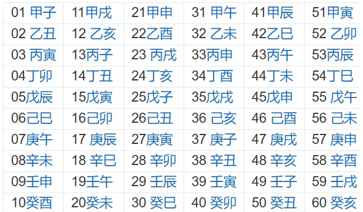
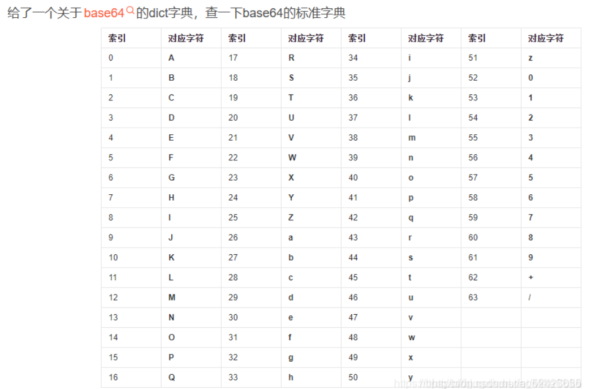
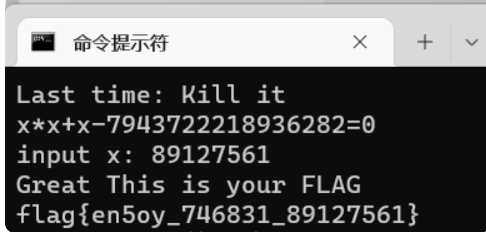
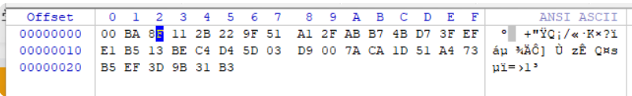

#    达芬奇密码（映射）
1. 题目
```
达芬奇隐藏在蒙娜丽莎中的数字列:1 233 3 2584 1346269 144 5 196418 21 1597 610 377 10946 89 514229 987 8 55 6765 2178309 121393 317811 46368 4181 1 832040 2 28657 75025 34 13 17711 
记录在达芬奇窗台口的神秘数字串:36968853882116725547342176952286
答案是一串32位十进制数字
```

2. 解：题中两串数字都是32个，题目提示中答案也是32位的十进制数字，再仔细一看第一行的所有数字，像是一个被打乱了的斐波那契数列，都是三十二位数字，猜测是一种类似于移位密码的密码，加密的移动规则和斐波那契数列被打乱的规则相同，写出脚本：
```
a = [1,1]
for i in range(1,31):
    a.append(a[i]+a[i-1])
print(a)
s = [1, 233, 3, 2584, 1346269, 144, 5, 196418, 21, 1597, 610, 377, 10946, 89, 514229, 987, 8, 55, 6765, 2178309, 121393, 317811, 46368, 4181, 1, 832040, 2, 28657, 75025, 34, 13, 17711]
s1 = [3,6,9,6,8,8,5,3,8,8,2,1,1,6,7,2,5,5,4,7,3,4,2,1,7,6,9,5,2,2,8,6]
d = []
d1 = []
for i in range(0,32):
    d.append(0)
    d1.append(0)
for i in range(0,32):
    for u in range(0,32):
        if d1[u]==0:
            if a[i]==s[u] and d[i]==0:
                d1[u]=1
                d[i]=s1[u]
#print(d)
for i in range(0,32):
    print(d[i],end='')

#37995588256861228614165223347687
因为斐波那契开头有两个1（1，1，2，3，5···），不知道打乱后数中的1对应的是哪个1，
因此有两个答案，需要去尝试：	
37995588256861228614165223347687
73995588256861228614165223347687
```
<a name="MIcBa"></a>
# 这是什么：（jsfuck）

1. 打开后发现时jsfuck，这是很简单，但是要注意第一行在很右侧，不要看漏了（最开始就看漏了，解不出来）
   <a name="tNIrA"></a>
   
# bbbbbbrsa:（rsa）

1. 题目：
```
from base64 import b64encode as b32encode
from gmpy2 import invert,gcd,iroot
from Crypto.Util.number import *
from binascii import a2b_hex,b2a_hex
import random

flag = "******************************"

nbit = 128

p = getPrime(nbit)
q = getPrime(nbit)
n = p*q

print p
print n

phi = (p-1)*(q-1)

e = random.randint(50000,70000)

while True:
	if gcd(e,phi) == 1:
		break;
	else:
		e -= 1;

c = pow(int(b2a_hex(flag),16),e,n)

print b32encode(str(c))[::-1]

# c = 2373740699529364991763589324200093466206785561836101840381622237225512234632

text文件：
p = 177077389675257695042507998165006460849
n = 37421829509887796274897162249367329400988647145613325367337968063341372726061
c = ==gMzYDNzIjMxUTNyIzNzIjMyYTM4MDM0gTMwEjNzgTM2UTN4cjNwIjN2QzM5ADMwIDNyMTO4UzM2cTM5kDN2MTOyUTO5YDM0czM3MjM
```

2. 一道比较常规的rsa，c的十进制很容易得到，而且题目中还无意中把c的十进制给了，而且我感觉题目源码有错，那不是base32，是base64，结果题目代码写的是base32加密。
3. 这道题有两个需要注意的，在生成e的区间(50000,70000)中，有许多个e满足题目的生成条件，所以不能像题目一样用while循环，应该用for循环一一枚举。还有就是在将m十进制转成字符时，因为有许多错误的e但有需要一一枚举才能找到正确的答案，在转的时候代码会报错（说无法转）导致代码无法仅需运行下去，此时需要try—except函数的帮助
4. 脚本
```
import gmpy2
from Crypto.Util.number import *
import random

e = random.randint(50000,70000)

c = 2373740699529364991763589324200093466206785561836101840381622237225512234632
n = 37421829509887796274897162249367329400988647145613325367337968063341372726061
p = 177077389675257695042507998165006460849
q = n//p
phi = (q-1)*(p-1)
e = gmpy2.mpz(e)
phi = gmpy2.mpz(phi)
for e in range( 50000, 70000 ):
    if gmpy2.gcd(e,phi)==1:
        d = gmpy2.invert(e,phi)
        m = pow(c,d,n)
        # print(m)
        m = long_to_bytes(m)
        try:
            m = m.decode('utf-8')
        except UnicodeDecodeError:
            continue
        print(m)
  
```
<a name="pRBwG"></a>
# childrsa：（rsa）

1. 题目：
```
from random import choice
from Crypto.Util.number import isPrime, sieve_base as primes
from flag import flag


def getPrime(bits):
    while True:
        n = 2
        while n.bit_length() < bits:
            n *= choice(primes)
        if isPrime(n + 1):
            return n + 1

e = 0x10001   #65537
m = int.from_bytes(flag.encode(), 'big')
p, q = [getPrime(2048) for _ in range(2)]
n = p * q
c = pow(m, e, n)

# n = 32849718197337581823002243717057659218502519004386996660885100592872201948834155543125924395614928962750579667346279456710633774501407292473006312537723894221717638059058796679686953564471994009285384798450493756900459225040360430847240975678450171551048783818642467506711424027848778367427338647282428667393241157151675410661015044633282064056800913282016363415202171926089293431012379261585078566301060173689328363696699811123592090204578098276704877408688525618732848817623879899628629300385790344366046641825507767709276622692835393219811283244303899850483748651722336996164724553364097066493953127153066970594638491950199605713033004684970381605908909693802373826516622872100822213645899846325022476318425889580091613323747640467299866189070780620292627043349618839126919699862580579994887507733838561768581933029077488033326056066378869170169389819542928899483936705521710423905128732013121538495096959944889076705471928490092476616709838980562233255542325528398956185421193665359897664110835645928646616337700617883946369110702443135980068553511927115723157704586595844927607636003501038871748639417378062348085980873502535098755568810971926925447913858894180171498580131088992227637341857123607600275137768132347158657063692388249513
# c = 26308018356739853895382240109968894175166731283702927002165268998773708335216338997058314157717147131083296551313334042509806229853341488461087009955203854253313827608275460592785607739091992591431080342664081962030557042784864074533380701014585315663218783130162376176094773010478159362434331787279303302718098735574605469803801873109982473258207444342330633191849040553550708886593340770753064322410889048135425025715982196600650740987076486540674090923181664281515197679745907830107684777248532278645343716263686014941081417914622724906314960249945105011301731247324601620886782967217339340393853616450077105125391982689986178342417223392217085276465471102737594719932347242482670320801063191869471318313514407997326350065187904154229557706351355052446027159972546737213451422978211055778164578782156428466626894026103053360431281644645515155471301826844754338802352846095293421718249819728205538534652212984831283642472071669494851823123552827380737798609829706225744376667082534026874483482483127491533474306552210039386256062116345785870668331513725792053302188276682550672663353937781055621860101624242216671635824311412793495965628876036344731733142759495348248970313655381407241457118743532311394697763283681852908564387282605279108
```

2. 一道rsa，不过出现了一些陌生的函数，本身是很简单的一道题，用大素数分解网站分解n即可：
   1. int.from_bytes()函数是用于将字节序列转换为整数的方法之一。
   2. **m = int.from_bytes(flag.encode(), 'big')**在这个例子中，flag是一个字符串，encode()方法将其转换为字节序列，然后int.from_bytes()函数将字节序列转换为整数。'big'参数指定了字节序列的字节顺序，表示高位字节在前，低位字节在后。
   <a name="wlVvu"></a>
# keyboard(NCTF)：（九键键盘）

1. 题目：keyboard
```
ooo yyy ii w uuu ee uuuu yyy uuuu y w uuu i i rr w i i rr rrr uuuu rrr uuuu t ii uuuu i w u rrr ee www ee yyy eee www w tt ee
```

2. 第一次做到这种题，完全看不懂，看了别人的wp都看不懂只知道这是对应的九键键盘，查了一下才知道什么是九键键盘，才看懂wp
3. 此加密的特点：题目中给了一串字母，都是在26字母键盘中的第一行的字母，并且对应的数字都在2-9之间，且重复的次数在1-4之间。
4. 解密原理：第一个ooo是：26键盘中o对应9，三个o即对应九键键盘中9的第三个字符y，以此类推，得到明文
```
cipher="ooo yyy ii w uuu ee uuuu yyy uuuu y w uuu i i rr w i i rr rrr uuuu rrr uuuu t ii uuuu i w u rrr ee www ee yyy eee www w tt ee"
base=" qwertyuiop"
a=[" "," ","abc","def","ghi","jkl","mno","pqrs","tuv","wxyz"]
for part in cipher.split(" "):
    s=base.index(part[0])
    count=len(part)
    print(a[s][count-1],end="")

```
<a name="lrXAV"></a>
# 天干地支+甲子：（映射）

1. 题目
```
天干地支+甲子

得到得字符串用MRCTF{}包裹
一天Eki收到了一封来自Sndav的信，但是他有点迷希望您来解决一下
甲戌 
甲寅
甲寅
癸卯
己酉 
甲寅
辛丑
```

2. 题很简单，找到这个就行了  
3. 甲戌 11，甲寅 51，甲寅 51，癸卯 40，己酉 46，甲寅 51，辛丑 38然后给他们分别加上60（甲子），得到 71，111，111，100，106，111，98，再用ASCII表转换即可得到 Goodjob
<a name="BRWW7"></a>
# RSA4（中国剩余定理+爆破e）

1. 看题，三组n和c，是低加密指数广播攻击，没给e，猜测是爆破e的那种，因此有：
   $$
   c_1 \equiv m^e \pmod {n_1}， c_2 \equiv m^e \pmod {n_2} ， c_3 \equiv m^e \pmod {n_3}
   $$
2. 但这道题有巨坑，我用脚本运行了好几次没做出来，知道看网上的wp才知道他的n、c是5进制，仔细一看，果然n、c的数据中的数字都小于5，简直离谱
3. 脚本
```
from gmpy2 import *
from Crypto.Util.number import *


def rsa(n1, c1, n2, c2, n3, c3):
    M1 = n2 * n3
    M2 = n1 * n3
    M3 = n1 * n2
    m_e = (c1 * M1 * invert(M1, n1) + c2 * M2 * invert(M2, n2) + c3 * M3 * invert(M3, n3)) % (n1 * n2 * n3)
    for e in range(1, 10):
        m = iroot(m_e, e)
        if m[1]:
            print(long_to_bytes(m[0]))


n1 = 331310324212000030020214312244232222400142410423413104441140203003243002104333214202031202212403400220031202142322434104143104244241214204444443323000244130122022422310201104411044030113302323014101331214303223312402430402404413033243132101010422240133122211400434023222214231402403403200012221023341333340042343122302113410210110221233241303024431330001303404020104442443120130000334110042432010203401440404010003442001223042211442001413004
c1 = 310020004234033304244200421414413320341301002123030311202340222410301423440312412440240244110200112141140201224032402232131204213012303204422003300004011434102141321223311243242010014140422411342304322201241112402132203101131221223004022003120002110230023341143201404311340311134230140231412201333333142402423134333211302102413111111424430032440123340034044314223400401224111323000242234420441240411021023100222003123214343030122032301042243

n2 = 302240000040421410144422133334143140011011044322223144412002220243001141141114123223331331304421113021231204322233120121444434210041232214144413244434424302311222143224402302432102242132244032010020113224011121043232143221203424243134044314022212024343100042342002432331144300214212414033414120004344211330224020301223033334324244031204240122301242232011303211220044222411134403012132420311110302442344021122101224411230002203344140143044114
c2 = 112200203404013430330214124004404423210041321043000303233141423344144222343401042200334033203124030011440014210112103234440312134032123400444344144233020130110134042102220302002413321102022414130443041144240310121020100310104334204234412411424420321211112232031121330310333414423433343322024400121200333330432223421433344122023012440013041401423202210124024431040013414313121123433424113113414422043330422002314144111134142044333404112240344

n3 = 332200324410041111434222123043121331442103233332422341041340412034230003314420311333101344231212130200312041044324431141033004333110021013020140020011222012300020041342040004002220210223122111314112124333211132230332124022423141214031303144444134403024420111423244424030030003340213032121303213343020401304243330001314023030121034113334404440421242240113103203013341231330004332040302440011324004130324034323430143102401440130242321424020323
c3 = 10013444120141130322433204124002242224332334011124210012440241402342100410331131441303242011002101323040403311120421304422222200324402244243322422444414043342130111111330022213203030324422101133032212042042243101434342203204121042113212104212423330331134311311114143200011240002111312122234340003403312040401043021433112031334324322123304112340014030132021432101130211241134422413442312013042141212003102211300321404043012124332013240431242

n1 = int(str(n1), 5)
c1 = int(str(c1), 5)

n2 = int(str(n2), 5)
c2 = int(str(c2), 5)

n3 = int(str(n3), 5)
c3 = int(str(c3), 5)

rsa(n1, c1, n2, c2, n3, c3)


```
<a name="ZGsPB"></a>
# [BJDCTF2020]RSA：

1. 题目
```
from Crypto.Util.number import getPrime,bytes_to_long

flag=open("flag","rb").read()

p=getPrime(1024)
q=getPrime(1024)
assert(e<100000)
n=p*q
m=bytes_to_long(flag)
c=pow(m,e,n)
print c,n
print pow(294,e,n)

p=getPrime(1024)
n=p*q
m=bytes_to_long("BJD"*32)
c=pow(m,e,n)
print c,n
'''
output:
c = 12641635617803746150332232646354596292707861480200207537199141183624438303757120570096741248020236666965755798009656547738616399025300123043766255518596149348930444599820675230046423373053051631932557230849083426859490183732303751744004874183062594856870318614289991675980063548316499486908923209627563871554875612702079100567018698992935818206109087568166097392314105717555482926141030505639571708876213167112187962584484065321545727594135175369233925922507794999607323536976824183162923385005669930403448853465141405846835919842908469787547341752365471892495204307644586161393228776042015534147913888338316244169120  
n = 13508774104460209743306714034546704137247627344981133461801953479736017021401725818808462898375994767375627749494839671944543822403059978073813122441407612530658168942987820256786583006947001711749230193542370570950705530167921702835627122401475251039000775017381633900222474727396823708695063136246115652622259769634591309421761269548260984426148824641285010730983215377509255011298737827621611158032976420011662547854515610597955628898073569684158225678333474543920326532893446849808112837476684390030976472053905069855522297850688026960701186543428139843783907624317274796926248829543413464754127208843070331063037
pow(294,e,n) = 381631268825806469518166370387352035475775677163615730759454343913563615970881967332407709901235637718936184198930226303761876517101208677107311006065728014220477966000620964056616058676999878976943319063836649085085377577273214792371548775204594097887078898598463892440141577974544939268247818937936607013100808169758675042264568547764031628431414727922168580998494695800403043312406643527637667466318473669542326169218665366423043579003388486634167642663495896607282155808331902351188500197960905672207046579647052764579411814305689137519860880916467272056778641442758940135016400808740387144508156358067955215018
c = 979153370552535153498477459720877329811204688208387543826122582132404214848454954722487086658061408795223805022202997613522014736983452121073860054851302343517756732701026667062765906277626879215457936330799698812755973057557620930172778859116538571207100424990838508255127616637334499680058645411786925302368790414768248611809358160197554369255458675450109457987698749584630551177577492043403656419968285163536823819817573531356497236154342689914525321673807925458651854768512396355389740863270148775362744448115581639629326362342160548500035000156097215446881251055505465713854173913142040976382500435185442521721  
n = 12806210903061368369054309575159360374022344774547459345216907128193957592938071815865954073287532545947370671838372144806539753829484356064919357285623305209600680570975224639214396805124350862772159272362778768036844634760917612708721787320159318432456050806227784435091161119982613987303255995543165395426658059462110056431392517548717447898084915167661172362984251201688639469652283452307712821398857016487590794996544468826705600332208535201443322267298747117528882985955375246424812616478327182399461709978893464093245135530135430007842223389360212803439850867615121148050034887767584693608776323252233254261047
'''

```

2. 一道较为简单的rsa，先通过爆破求e，再通过求得的e，分解后的n，c，求m（有一点需要注意，题目中第二段代码中m=bytes_to_long('BJD'*32)，这里'BJD'*32指的是由32个'BJD'组合而成的字符串，python中也可以这么写）
3. 爆破e
```
import gmpy2
from Crypto.Util.number import *

s = ''
for i in range(1,33):
    s = s + 'BJD'
s = s.encode()
m = bytes_to_long(s)

c = 979153370552535153498477459720877329811204688208387543826122582132404214848454954722487086658061408795223805022202997613522014736983452121073860054851302343517756732701026667062765906277626879215457936330799698812755973057557620930172778859116538571207100424990838508255127616637334499680058645411786925302368790414768248611809358160197554369255458675450109457987698749584630551177577492043403656419968285163536823819817573531356497236154342689914525321673807925458651854768512396355389740863270148775362744448115581639629326362342160548500035000156097215446881251055505465713854173913142040976382500435185442521721
n = 12806210903061368369054309575159360374022344774547459345216907128193957592938071815865954073287532545947370671838372144806539753829484356064919357285623305209600680570975224639214396805124350862772159272362778768036844634760917612708721787320159318432456050806227784435091161119982613987303255995543165395426658059462110056431392517548717447898084915167661172362984251201688639469652283452307712821398857016487590794996544468826705600332208535201443322267298747117528882985955375246424812616478327182399461709978893464093245135530135430007842223389360212803439850867615121148050034887767584693608776323252233254261047

for i in range(2,100000):
    c1 = gmpy2.powmod(m,i,n)
    if c1==c:
        print(i)
#e=52361
```

4. 得到e后，分解n，套脚本即可
<a name="jChqG"></a>
# rsa_output（共模攻击）

1. 题目
```
{21058339337354287847534107544613605305015441090508924094198816691219103399526800112802416383088995253908857460266726925615826895303377801614829364034624475195859997943146305588315939130777450485196290766249612340054354622516207681542973756257677388091926549655162490873849955783768663029138647079874278240867932127196686258800146911620730706734103611833179733264096475286491988063990431085380499075005629807702406676707841324660971173253100956362528346684752959937473852630145893796056675793646430793578265418255919376323796044588559726703858429311784705245069845938316802681575653653770883615525735690306674635167111,2767}

{21058339337354287847534107544613605305015441090508924094198816691219103399526800112802416383088995253908857460266726925615826895303377801614829364034624475195859997943146305588315939130777450485196290766249612340054354622516207681542973756257677388091926549655162490873849955783768663029138647079874278240867932127196686258800146911620730706734103611833179733264096475286491988063990431085380499075005629807702406676707841324660971173253100956362528346684752959937473852630145893796056675793646430793578265418255919376323796044588559726703858429311784705245069845938316802681575653653770883615525735690306674635167111,3659}

message1=20152490165522401747723193966902181151098731763998057421967155300933719378216342043730801302534978403741086887969040721959533190058342762057359432663717825826365444996915469039056428416166173920958243044831404924113442512617599426876141184212121677500371236937127571802891321706587610393639446868836987170301813018218408886968263882123084155607494076330256934285171370758586535415136162861138898728910585138378884530819857478609791126971308624318454905992919405355751492789110009313138417265126117273710813843923143381276204802515910527468883224274829962479636527422350190210717694762908096944600267033351813929448599

message2=11298697323140988812057735324285908480504721454145796535014418738959035245600679947297874517818928181509081545027056523790022598233918011261011973196386395689371526774785582326121959186195586069851592467637819366624044133661016373360885158956955263645614345881350494012328275215821306955212788282617812686548883151066866149060363482958708364726982908798340182288702101023393839781427386537230459436512613047311585875068008210818996941460156589314135010438362447522428206884944952639826677247819066812706835773107059567082822312300721049827013660418610265189288840247186598145741724084351633508492707755206886202876227
```

2. 打开题目一看，愣了一下，首先可以确定地是message1，message2对应密文，上面每个花括号的两个元素中的后面一个元素应该是对应e，那前面一个元素是不是n呢，犹豫了一下，发现两个花括号的第一个元素值相当，直接确定是n，并且是共模攻击
3. 上脚本就行了
<a name="Iiyci"></a>
# crypto-rsa0：（zip伪加密+rsa）

1. 给了个压缩包，要密码才能打开，第一次见这种题，查了一下wp，才知道这是zip压缩包伪加密（[https://blog.csdn.net/xiaozhaidada/article/details/124538768?ops_request_misc=%257B%2522request%255Fid%2522%253A%2522168914965716800192215326%2522%252C%2522scm%2522%253A%252220140713.130102334..%2522%257D&request_id=168914965716800192215326&biz_id=0&utm_medium=distribute.pc_search_result.none-task-blog-2~all~sobaiduend~default-2-124538768-null-null.142^v88^insert_down28v1,239^v2^insert_chatgpt&utm_term=zip%E5%8E%8B%E7%BC%A9%E5%8C%85%E4%BC%AA%E5%8A%A0%E5%AF%86&spm=1018.2226.3001.4187](https://blog.csdn.net/xiaozhaidada/article/details/124538768?ops_request_misc=%257B%2522request%255Fid%2522%253A%2522168914965716800192215326%2522%252C%2522scm%2522%253A%252220140713.130102334..%2522%257D&request_id=168914965716800192215326&biz_id=0&utm_medium=distribute.pc_search_result.none-task-blog-2~all~sobaiduend~default-2-124538768-null-null.142^v88^insert_down28v1,239^v2^insert_chatgpt&utm_term=zip%E5%8E%8B%E7%BC%A9%E5%8C%85%E4%BC%AA%E5%8A%A0%E5%AF%86&spm=1018.2226.3001.4187)），有两种判断方法：一种要用到kali的winhex，另一种用kali的ZipCenOp.jar（更准确）
2. 直接将压缩包拖进winhex，用搜索中的查找16进制数，找到并修改全局方位标记后，就可以打开压缩包后得到的就是最简单的rsa了
3. 但这道题和寻常的zip伪加密有些不同，他的压缩源文件数据区是09 00而不是00 00（这种按常规来说应该是真加密，但实际题目中给了是伪加密），最开始我只改了压缩源文件目录区，将其中的09 00改成了00 00，结果发现还是打不开文件；然后我试了一下将压缩源文件数据区的09 00同样也改成00 00，结果就打开了。这道题压缩源文件数据区和压缩源文件目录区都要将09 00改成00 00.
<a name="BwfeN"></a>
# vigenere（维吉尼亚密码）

1. 有题目信息，知道是维吉尼亚密码，再看一下代码确认一下，没告诉密钥，直接上解密网站：[https://www.guballa.de/vigenere-solver](https://www.guballa.de/vigenere-solver)，最后看到flag在解密文本的最后面
<a name="VYhus"></a>
# keyboard（MRCTF）

1. 题目：
```
得到的flag用
MRCTF{xxxxxx}形式上叫
都为小写字母

6
666
22
444
555
33
7
44
666
66
3
```

2. 一看题和NCTF的keyboard很像，打开一看更确定了，还更简单，都不用字母来对应数字了，直接告诉数字，最后得到mobilephone
<a name="CDJVj"></a>
# [GWCTF 2019]BabyRSA

1. 题目：
```
import hashlib
import sympy
from Crypto.Util.number import *

flag = 'GWHT{******}'
secret = '******'

assert(len(flag) == 38)

half = len(flag) / 2

flag1 = flag[:half]
flag2 = flag[half:]

secret_num = getPrime(1024) * bytes_to_long(secret)

p = sympy.nextprime(secret_num)
q = sympy.nextprime(p)

N = p * q

e = 0x10001

F1 = bytes_to_long(flag1)
F2 = bytes_to_long(flag2)

c1 = F1 + F2
c2 = pow(F1, 3) + pow(F2, 3)
assert(c2 < N)

m1 = pow(c1, e, N)
m2 = pow(c2, e, N)

output = open('secret', 'w')
output.write('N=' + str(N) + '\n')
output.write('m1=' + str(m1) + '\n')
output.write('m2=' + str(m2) + '\n')
output.close()

N=636585149594574746909030160182690866222909256464847291783000651837227921337237899651287943597773270944384034858925295744880727101606841413640006527614873110651410155893776548737823152943797884729130149758279127430044739254000426610922834573094957082589539445610828279428814524313491262061930512829074466232633130599104490893572093943832740301809630847541592548921200288222432789208650949937638303429456468889100192613859073752923812454212239908948930178355331390933536771065791817643978763045030833712326162883810638120029378337092938662174119747687899484603628344079493556601422498405360731958162719296160584042671057160241284852522913676264596201906163
m1=90009974341452243216986938028371257528604943208941176518717463554774967878152694586469377765296113165659498726012712288670458884373971419842750929287658640266219686646956929872115782173093979742958745121671928568709468526098715927189829600497283118051641107305128852697032053368115181216069626606165503465125725204875578701237789292966211824002761481815276666236869005129138862782476859103086726091860497614883282949955023222414333243193268564781621699870412557822404381213804026685831221430728290755597819259339616650158674713248841654338515199405532003173732520457813901170264713085107077001478083341339002069870585378257051150217511755761491021553239
m2=487443985757405173426628188375657117604235507936967522993257972108872283698305238454465723214226871414276788912058186197039821242912736742824080627680971802511206914394672159240206910735850651999316100014691067295708138639363203596244693995562780286637116394738250774129759021080197323724805414668042318806010652814405078769738548913675466181551005527065309515364950610137206393257148357659666687091662749848560225453826362271704292692847596339533229088038820532086109421158575841077601268713175097874083536249006018948789413238783922845633494023608865256071962856581229890043896939025613600564283391329331452199062858930374565991634191495137939574539546

```

2. 分解n得到p和q，然后根据代码，写脚本得到c1,c2，然后就是解方程，我手算了一下解完方程后的公式，直接用python代入数据计算，结果发现不对，上网查了一下wp，发现前面都是对的，就解方程那里不需要我自己手算公式，直接用sympy函数即可解方程了。
3. 脚本
```
# coding:utf-8
import gmpy2
from Crypto.Util.number import long_to_bytes
from sympy import *
from sympy.abc import a, b

e = 65537
p = 797862863902421984951231350430312260517773269684958456342860983236184129602390919026048496119757187702076499551310794177917920137646835888862706126924088411570997141257159563952725882214181185531209186972351469946269508511312863779123205322378452194261217016552527754513215520329499967108196968833163329724620251096080377747699
q = 797862863902421984951231350430312260517773269684958456342860983236184129602390919026048496119757187702076499551310794177917920137646835888862706126924088411570997141257159563952725882214181185531209186972351469946269508511312863779123205322378452194261217016552527754513215520329499967108196968833163329724620251096080377748737

phi =(p-1)*(q-1)
d = gmpy2.invert(e,phi)
m1 = 90009974341452243216986938028371257528604943208941176518717463554774967878152694586469377765296113165659498726012712288670458884373971419842750929287658640266219686646956929872115782173093979742958745121671928568709468526098715927189829600497283118051641107305128852697032053368115181216069626606165503465125725204875578701237789292966211824002761481815276666236869005129138862782476859103086726091860497614883282949955023222414333243193268564781621699870412557822404381213804026685831221430728290755597819259339616650158674713248841654338515199405532003173732520457813901170264713085107077001478083341339002069870585378257051150217511755761491021553239
m2 = 487443985757405173426628188375657117604235507936967522993257972108872283698305238454465723214226871414276788912058186197039821242912736742824080627680971802511206914394672159240206910735850651999316100014691067295708138639363203596244693995562780286637116394738250774129759021080197323724805414668042318806010652814405078769738548913675466181551005527065309515364950610137206393257148357659666687091662749848560225453826362271704292692847596339533229088038820532086109421158575841077601268713175097874083536249006018948789413238783922845633494023608865256071962856581229890043896939025613600564283391329331452199062858930374565991634191495137939574539546
n = 636585149594574746909030160182690866222909256464847291783000651837227921337237899651287943597773270944384034858925295744880727101606841413640006527614873110651410155893776548737823152943797884729130149758279127430044739254000426610922834573094957082589539445610828279428814524313491262061930512829074466232633130599104490893572093943832740301809630847541592548921200288222432789208650949937638303429456468889100192613859073752923812454212239908948930178355331390933536771065791817643978763045030833712326162883810638120029378337092938662174119747687899484603628344079493556601422498405360731958162719296160584042671057160241284852522913676264596201906163
c1 = gmpy2.powmod(m1,d,n)
c2 = gmpy2.powmod(m2,d,n)

aa = solve([a + b - c1, pow(a, 3) + pow(b, 3) - c2], [a, b])
print(aa)

f1 = 1141553212031156130619789508463772513350070909
f2 = 1590956290598033029862556611630426044507841845

m1 = long_to_bytes(f1)
m2 = long_to_bytes(f2)

print(m1)
print(m2)
```
<a name="GGsGo"></a>
# [BJDCTF2020]这是base??（base密码表）

1. 题目：
```
dict:{0: 'J', 1: 'K', 2: 'L', 3: 'M', 4: 'N', 5: 'O', 6: 'x', 7: 'y', 8: 'U', 9: 'V', 10: 'z', 11: 'A', 12: 'B', 13: 'C', 14: 'D', 15: 'E', 16: 'F', 17: 'G', 18: 'H', 19: '7', 20: '8', 21: '9', 22: 'P', 23: 'Q', 24: 'I', 25: 'a', 26: 'b', 27: 'c', 28: 'd', 29: 'e', 30: 'f', 31: 'g', 32: 'h', 33: 'i', 34: 'j', 35: 'k', 36: 'l', 37: 'm', 38: 'W', 39: 'X', 40: 'Y', 41: 'Z', 42: '0', 43: '1', 44: '2', 45: '3', 46: '4', 47: '5', 48: '6', 49: 'R', 50: 'S', 51: 'T', 52: 'n', 53: 'o', 54: 'p', 55: 'q', 56: 'r', 57: 's', 58: 't', 59: 'u', 60: 'v', 61: 'w', 62: '+', 63: '/', 64: '='}

chipertext:
FlZNfnF6Qol6e9w17WwQQoGYBQCgIkGTa9w3IQKw
```

2. 看到题目，我首先想到的是base，和将密文用dict替换成数字，再转ascii码，最后一个base，结果发现不对，接着想起了ciscn的password中的base密码表，写了一个脚本尝试，就对了
3. 脚本
```
# coding:utf-8
import base64

dict = {0: 'J', 1: 'K', 2: 'L', 3: 'M', 4: 'N', 5: 'O', 6: 'x', 7: 'y', 8: 'U', 9: 'V', 10: 'z', 11: 'A', 12: 'B', 13: 'C', 14: 'D', 15: 'E', 16: 'F', 17: 'G', 18: 'H', 19: '7', 20: '8', 21: '9', 22: 'P', 23: 'Q', 24: 'I', 25: 'a', 26: 'b', 27: 'c', 28: 'd', 29: 'e', 30: 'f', 31: 'g', 32: 'h', 33: 'i', 34: 'j', 35: 'k', 36: 'l', 37: 'm', 38: 'W', 39: 'X', 40: 'Y', 41: 'Z', 42: '0', 43: '1', 44: '2', 45: '3', 46: '4', 47: '5', 48: '6', 49: 'R', 50: 'S', 51: 'T', 52: 'n', 53: 'o', 54: 'p', 55: 'q', 56: 'r', 57: 's', 58: 't', 59: 'u', 60: 'v', 61: 'w', 62: '+', 63: '/', 64: '='}
s = 'FlZNfnF6Qol6e9w17WwQQoGYBQCgIkGTa9w3IQKw'
# d = ''
# for i,j in dict.items():
#     d = d + j
# print(d)
d = 'JKLMNOxyUVzABCDEFGH789PQIabcdefghijklmWXYZ0123456RSTnopqrstuvw+/='
a = 'ABCDEFGHIJKLMNOPQRSTUVWXYZabcdefghijklmnopqrstuvwxyz0123456789+/='

t = str.maketrans(d,a)
m = s.translate(t)
print(base64.b64decode(m))
```


# [WUSTCTF2020]佛说：只能四天（古典密码）

1. 题目
```
圣经分为《旧约全书》和《新约全书》

尊即寂修我劫修如婆愍闍嚤婆莊愍耨羅嚴是喼婆斯吶眾喼修迦慧迦嚩喼斯願嚤摩隸所迦摩吽即塞願修咒莊波斯訶喃壽祗僧若即亦嘇蜜迦須色喼羅囉咒諦若陀喃慧愍夷羅波若劫蜜斯哆咒塞隸蜜波哆咤慧聞亦吽念彌諸嘚嚴諦咒陀叻咤叻諦缽隸祗婆諦嚩阿兜宣囉吽色缽吶諸劫婆咤咤喼愍尊寂色缽嘚闍兜阿婆若叻般壽聞彌即念若降宣空陀壽愍嚤亦喼寂僧迦色莊壽吽哆尊僧喼喃壽嘚兜我空所吶般所即諸吽薩咤諸莊囉隸般咤色空咤亦喃亦色兜哆嘇亦隸空闍修眾哆咒婆菩迦壽薩塞宣嚩缽寂夷摩所修囉菩阿伏嘚宣嚩薩塞菩波吶波菩哆若慧愍蜜訶壽色咒兜摩缽摩諦劫諸陀即壽所波咤聞如訶摩壽宣咤彌即嚩蜜叻劫嘇缽所摩闍壽波壽劫修訶如嚩嘇囉薩色嚤薩壽修闍夷闍是壽僧劫祗蜜嚴嚩我若空伏諦念降若心吽咤隸嘚耨缽伏吽色寂喃喼吽壽夷若心眾祗喃慧嚴即聞空僧須夷嚴叻心願哆波隸塞吶心須嘇摩咤壽嘚吶夷亦心亦喃若咒壽亦壽囑囑

hint:
1. 虽然有点不环保，但hint好像是一次性的，得到后就没有利用价值了。
2. 凯撒不是最后一步，by the way，凯撒为什么叫做凯撒？
```

2. 先将的得到的密文用新约佛论禅的网站解密，再用核心价值观网站解密得到：RLJDQTOVPTQ6O6duws5CD6IB5B52CC57okCaUUC3SO4OSOWG3LynarAVGRZSJRAEYEZ_ooe_doyouknowfence，发现末尾有个doyouknowfence，再注意到题目有个四天，直接栅栏密码，栏数为4，密文RLJDQTOVPTQ6O6duws5CD6IB5B52CC57okCaUUC3SO4OSOWG3LynarAVGRZSJRAEYEZ_ooe_
3. 得到：R5UALCUVJDCGD63RQISZTBOSO54JVBORP5SAT2OEQCWY6CGEO53Z67L_doyouknowCaesar_，密码末尾提示是凯撒，再加上题目中提示凯撒不是最后一步，猜测凯撒解密后还有一步，直接凯撒密码，然后就不知道了，试了好一会儿，看了一下wp，才知道将偏移量为3的凯撒解密结果再用base32解密即可
# 一张谍报:

1. 一看题，人懵了，第一次看到这样的题，查了一下土匪行话，没找到切入口，直接上wp

            题目：[dianli_jbctf_CRYPTO_01_20150707_一张谍报.doc](https://www.yuque.com/attachments/yuque/0/2023/doc/34872999/1689489910378-98dbc233-263a-4509-a9b9-1b5633dbf559.doc?_lake_card=%7B%22src%22%3A%22https%3A%2F%2Fwww.yuque.com%2Fattachments%2Fyuque%2F0%2F2023%2Fdoc%2F34872999%2F1689489910378-98dbc233-263a-4509-a9b9-1b5633dbf559.doc%22%2C%22name%22%3A%22dianli_jbctf_CRYPTO_01_20150707_%E4%B8%80%E5%BC%A0%E8%B0%8D%E6%8A%A5.doc%22%2C%22size%22%3A29696%2C%22ext%22%3A%22doc%22%2C%22source%22%3A%22%22%2C%22status%22%3A%22done%22%2C%22download%22%3Atrue%2C%22taskId%22%3A%22u43dbebec-8d16-4a14-a98c-aeba8f9ffea%22%2C%22taskType%22%3A%22upload%22%2C%22type%22%3A%22application%2Fmsword%22%2C%22__spacing%22%3A%22both%22%2C%22mode%22%3A%22title%22%2C%22id%22%3A%22u27a402a9%22%2C%22margin%22%3A%7B%22top%22%3Atrue%2C%22bottom%22%3Atrue%7D%2C%22card%22%3A%22file%22%7D)

2. 看了wp才反应过来什么意思，写了一个脚本
```
# -*- coding: utf-8 -*
flag=""
str1="今天上午，朝歌区梆子公司决定，在每天三更天不亮免费在各大小区门口设卡为全城提供二次震耳欲聋的敲更提醒，呼吁大家早睡早起，不要因为贪睡断送大好人生，时代的符号是前进。为此，全区老人都蹲在该公司东边树丛合力抵制，不给公司人员放行，场面混乱。李罗鹰住进朝歌区五十年了，人称老鹰头，几年孙子李虎南刚从东北当猎户回来，每月还寄回来几块鼹鼠干。李罗鹰当年遇到的老婆是朝歌一枝花，所以李南虎是长得非常秀气的一个汉子。李罗鹰表示：无论梆子公司做的对错，反正不能打扰他孙子睡觉，子曰：‘睡觉乃人之常情’。梆子公司这是连菩萨睡觉都不放过啊。李南虎表示：梆子公司智商捉急，小心居民猴急跳墙！这三伏天都不给睡觉，这不扯淡么！到了中午人群仍未离散，更有人提议要烧掉这个公司，公司高层似乎恨不得找个洞钻进去。直到治安人员出现才疏散人群归家，但是李南虎仍旧表示爷爷年纪大了，睡不好对身体不好。"
str2="喵天上午，汪歌区哞叽公司决定，在每天八哇天不全免费在各大小区门脑设卡为全城提供双次震耳欲聋的敲哇提醒，呼吁大家早睡早起，不要因为贪睡断送大好人生，时代的编号是前进。为此，全区眠人都足在该公司流边草丛合力抵制，不给公司人员放行，场面混乱。李罗鸟住进汪歌区五十年了，人称眠鸟顶，几年孙叽李熬值刚从流北当屁户回来，每月还寄回来几块报信干。李罗鸟当年遇到的眠婆是汪歌一枝花，所以李值熬是长得非常秀气的一个汉叽。李罗鸟表示：无论哞叽公司做的对错，反正不能打扰他孙叽睡觉，叽叶：‘睡觉乃人之常情’。哞叽公司这是连衣服睡觉都不放过啊。李值熬表示：哞叽公司智商捉急，小心居民猴急跳墙！这八伏天都不给睡觉，这不扯淡么！到了中午人群仍未离散，哇有人提议要烧掉这个公司，公司高层似乎恨不得找个洞钻进去。直到治安人员出现才疏散人群归家，但是李值熬仍旧表示爷爷年纪大了，睡不好对身体不好。"
str3="喵汪哞叽双哇顶，眠鸟足屁流脑，八哇报信断流脑全叽，眠鸟进北脑上草，八枝遇孙叽，孙叽对熬编叶：值天衣服放鸟捉猴顶。鸟对：北汪罗汉伏熬乱天门。合编放行，卡编扯呼。人离烧草，报信归洞，孙叽找爷爷。"
for i in range(len(str3)):
    for j in range(len(str2)):
        if (str3[i]==str2[j]):
            flag += str1[j]
            break
print(flag)
```

3. 输出：今朝梆子二更头，老鹰蹲猎东口，三更鼹鼠断东口亮子，老鹰进北口上树，三枝遇孙子，孙子对虎符曰：南天菩萨放鹰捉猴头。鹰对：北朝罗汉伏虎乱天门。合符放行，卡符扯呼。人离烧树，鼹鼠归洞，孙子找爷爷。
4. 试了一下“南天菩萨放鹰捉猴头”，直接对了
<a name="RYtNq"></a>
# [NPUCTF2020]这是什么觅🐎：

1. 下载下来的文件没有后缀名，试了一下txt，打开是乱码，再试一下zip，打开就对了，打开文件后得到一张图片：                                                                                                                                                     
2. 题目中有一串字符：F1 W1 S22 S21 T12 S11 W1 S13，字母是对应周一到周天的英文单词首字母。后面跟了两个数字的，第一个数字的作用是确定是周几（eg：S22，因为s开头的有星期六和星期天，S2表示星期天），第二个数字表示的是在字母对应的星期的那一列的中的第几个数字。并且图中将一号划去，所以W1对应8
3. 所以得到：3 8 12 5 14 4 8 18，在这串数字转化成对应的26个英文字母，得到：chlendhr，提交时结果发现不对，再试一下W1对应的是1时，得到：calendar，一试就对了
<a name="O1FIN"></a>
# SameMod：（共模攻击+ascii转字符）

1. 一看，n同，e不同，c不同，直接猜测共模攻击，上脚本，发现再转bytes类型的时候出错了，那这串数字只有换一种方式转字符，试一下ascii，对了
2. 脚本
```
# -*- coding: utf-8 -*
import gmpy2
from Crypto.Util.number import long_to_bytes, bytes_to_long

c1 = 3453520592723443935451151545245025864232388871721682326408915024349804062041976702364728660682912396903968193981131553111537349
c2 = 5672818026816293344070119332536629619457163570036305296869053532293105379690793386019065754465292867769521736414170803238309535
e1 = 773
e2 = 839
n = 6266565720726907265997241358331585417095726146341989755538017122981360742813498401533594757088796536341941659691259323065631249


def RSA_ComModAtk(e1, e2, c1, c2, n):
    e1, e2, c1, c2, n = int(e1), int(e2), int(c1), int(c2), int(n)
    if gmpy2.gcd(e1, e2) == 1:
        s = gmpy2.gcdext(e1, e2)  # 扩展欧几里得算法-辗转相除法使得  x*e1+y*e2=1,求出x和y
        x = s[1]
        y = s[2]
        if x < 0:
            x = - x  # 变指数为正值
            c1 = gmpy2.invert(c1, n)  # 求c1的逆元
        if y < 0:
            y = -y  # 变指数为正值
            c2 = gmpy2.invert(c2, n)  # 求c2的逆元
        m = (pow(c1, x, n) * pow(c2, y, n)) % n  # (c1^x*c2^y)%n=m^e1x*me2y%n=m^(e1x+e2y)%n=m%n=m
        return m
    else:
        return bytes_to_long(b'e1 and e2 are not relatively prime')  # e1和e2不互质


result = RSA_ComModAtk(e1, e2, c1, c2, n)
print(result)
result = str(result)

i = 0
flag = ''
while i<len(result): #ascii的方式解得，flag需要是可见字符，所以不存在1开头的十位数，所以1开头的肯定是100以上的三位数，
    if result[i]=='1':
        flag = flag +chr(int(result[i:i+3]))
        i = i+3
    else:
        flag = flag +chr(int(result[i:i+2]))
        i = i+2
print(flag)
```
<a name="uQq50"></a>
# 浪里淘沙：

1. 题目：
```
tonightsuccessnoticenoticewewesuccesstonightweexamplecryptoshouldwebackspacetonightbackspaceexamplelearnwesublimlearnbackspacetheshouldwelearnfoundsublimsystemexamplesublimfoundlearnshouldmorningsublimsystemuserlearnthecryptomorningexamplenoticetonightlearntonightlearntonightsublimenterusermorningfoundtonightweenterfoundnoticethecryptomorningthebackspacelearntonightlearnsublimtonightlearnfoundenterfoundsuccesstonightsuccessuserfoundmorningtonighttheshouldsublimentertonightenterbackspacelearnexamplenoticeexamplefoundsystemsuccesssublimsuccessshouldtonightcryptowelearncryptofoundshouldsublimsublimweentertonightsuccessshouldentertheentercryptouserbackspaceshouldentersystemsuccesssystementerfoundenterlearnexampletonightnoticemorningusertonightlearnmorningtonightfoundfoundsuccessnoticesystementerlearnexamplebackspaceshouldcryptocryptosublimweexampletonighttheshouldthemorningbackspacelearntonightsystemsuccesssuccessbackspacemorningnoticeuserfoundfoundtonightmorningenterenterthefoundbackspacelearnenterentershouldthesystemfounduserlearnlearnsystemnoticetonighttheshouldlearnuserbackspaceweusernoticeshouldthewefoundsystemwecryptocryptowethebackspacesystementershouldtonightsystemnoticemorningsystemweentermorningfoundsuccessusertonightsuccesstonightbackspaceshouldweenterthewesystemusernoticesystemthelearnexamplelearnfoundlearnnoticeexamplesystemthecryptocryptolearnsystemthecryptoenterlearnexamplemorningmorningweenterentersuccessexampleuserthebackspacenoticesublimenterbackspacesuccessbackspacethesublimexamplesystemtheexamplecryptolearnuserexamplelearnsystemusersuccessenterentersuccesstheuserbackspacelearnsuccessbackspacethesublimshouldwebackspaceexamplesuccesssuccesstonightweusershouldsuccessmorningcryptomorningfoundbackspacesublimshouldentershouldnoticesuccessmorningsuccessexamplelearnshouldsublimlearntonightshoulduserbackspacesublimlearncryptosuccessenternoticetonightmorningtonightwesuccessweuserbackspaceexamplewesystemnoticemorningsystemmorningcryptolearnsystemthethefoundcryptouserlearnusersystemwemorningenterexampleshouldlearncryptofoundenterbackspacelearnenterenterbackspaceshouldbackspacetheshouldthesystemshouldshouldsuccessmorningthefoundsystementersystemtonightcryptowelearnexampleexamplesystementerbackspaceshouldtheentersublimtonightfoundfoundsuccesssuccesssystemsublimcryptoshouldentersublimmorninglearnfoundtonightcryptobackspacesuccesscryptowebackspacefoundshouldnoticeshouldmorningnoticesystemcryptosystemlearnsystemnoticemorningsystementerwemorninglearnsuccessfoundwesuccesswetheusercryptousernoticebackspacesuccessshouldtonightmorningentermorninguserenternoticefoundmorningwetonightsystemthecryptotonightcryptosystemuserthefoundexampletonightusersystemcryptosublimmorninguserthefoundbackspaceshouldsuccesscryptotonightsystemnoticebackspaceusershouldenterthecryptomorningwesublimnoticesuccessnoticeusersuccesstonightlearnweuserenterfounduserexampleshouldshouldtonightwelearnthenoticethewefoundmorningexampleshouldexamplethesuccessnoticeenterfoundthecryptonoticeuserlearnuserweenterfoundmorningsystemweexamplenoticethebackspaceexamplesublimtheusermorningtonightthesuccesscryptosuccessusersuccesstonighttonightwelearnenterenterthemorningentersystemcryptobackspacemorningsystemexamplecryptouserexamplelearnsublimsuccessusersystemfoundmorningshouldcryptotonightsublimtheexamplemorningsystemuserexampleweexamplenoticesuccesssublimnoticecryptoshouldbackspaceshouldthetonightfoundsublimbackspacebackspacetonightshouldbackspacesuccesstonightbackspacesuccessmorningsystemcryptobackspaceentertonighttonightnoticelearnshoulduserfoundexamplesystemthesuccessweusertonightcryptousernoticeenternoticebackspaceusersystemfoundusernoticeshouldlearnuserfoundexampleusermorningshouldsuccessmorningmorningexampleexamplefoundsublimfoundenterbackspacenoticelearnfoundmorningcryptonoticecryptoshouldweshouldtonightcryptobackspacesublimcryptosublimenterentersublimentercryptonoticethethesublimexampleenterentershouldlearncryptoentershouldmorninglearnnoticeuserexamplesublimtonightshouldfoundtonightsuccessshouldmorningfoundtheweuserlearnsublimsystembackspacecryptotheusertonightcryptosublimmorningmorningexamplenoticetheenterlearnshouldmorningsublimfoundtonightsublimsublimexamplefounduserexamplethefoundwemorningnoticefoundcryptosuccesssublimsublimexamplethesuccessexamplenoticesuccessbackspacesublimlearnuserexamplesuccesssuccesssystemsuccessmorningmorninglearnexamplemorningtonightfoundbackspaceenternoticemorningentersuccessmorningusermorningbackspacelearncryptoenteruserenteruserthetonighttonightsuccesslearnenterfoundsuccesssystemfoundbackspaceenterlearnsystemsublimcryptoentermorningwetonightshouldlearnenterfoundcryptonoticelearnlearnshouldfoundsuccessexampletonightthesuccessfoundusertonightenterfoundsuccessshouldmorningusernoticemorningsystemsystemsuccessshouldwelearnenterfoundexamplewethefoundweshouldsystemsystemmorningmorningbackspaceshouldentersublimentertonightsuccesssystemsystemcryptousershouldsublimfoundwetonightnoticeexamplewewesuccessfoundusertonightfoundsystemexamplecryptofoundshouldshouldsuccessenterbackspaceexampletonightthelearnnoticeuserlearnsystemsublimfoundlearnsuccesssystemshouldsublimnoticelearnsystemnoticetonightexamplefoundusernoticeenterlearnnoticecryptousersystemmorningthewesystemfoundfoundshouldsystementerenterbackspacesystemsublimcryptousermorninglearnlearntonightsublimlearnenterenterbackspacesystemuserusercryptoentershouldtheusersublimnoticeexamplemorningexamplesublimsublimbackspacesystemexampleshouldsublimlearnfoundenterbackspacelearnmorningmorningfoundthetonightmorningnoticeenterlearnusersystemtonightbackspaceexamplelearntonightbackspaceweshouldcryptosuccessbackspaceexamplesuccesstheshouldmorninguserbackspacelearnthetheshouldcryptocryptotonightbackspacecryptocryptobackspacebackspacenoticeusertonightentermorningfoundweenterexampleenterfoundusersublimsystemtheexampleexamplesystemsuccessusersublimentermorningbackspacesystemfoundlearnsystemshouldsublimsublimentershouldtheusershouldexampleexampleshouldsuccesswelearnfoundsublimshoulduserweentertonightwenoticesublimsystemlearnshouldfoundsuccessuserentersuccessmorningcryptoenteruserfoundexampletonightlearnexampleexamplefoundlearnsuccesssystembackspacecryptonoticethefoundbackspacelearncryptothelearnlearnexamplesuccessnoticenoticesystemmorningcryptotonightnoticenoticeentersuccesscryptoenterbackspacesublimexampleenterfoundtonightcryptotonightsublimnoticesuccesssublimtheentertonighttheshouldthefoundsystemtonightuserbackspacesuccessshouldwebackspacenoticebackspacebackspacenoticewecryptobackspacebackspaceusertonightlearnsuccessmorningusertonightsuccessshouldbackspacecryptoenterentershouldsublimsystemexamplemorningcryptonoticethesuccessthebackspacenoticelearnsublimlearnsuccesscryptothesuccessenternoticecryptosystemsublimsuccesswebackspaceuserenterlearnuserwewemorningsuccesslearncryptobackspacewecryptosystemlearnenterenteruserexamplefoundsystemcryptousernoticefoundusersublimbackspacewesublimnoticemorningshouldexamplenoticecryptoshouldtonightmorningthefoundsystementerentersystemthecryptobackspacesublimlearnsuccessmorningsublimsystemcryptousersublimwesuccessmorningsublimbackspacecryptobackspacesublimthelearnsuccesssublimlearncryptoweweexamplecryptowenoticelearnfoundbackspacesystemsystemexampleshouldlearnsuccesssublimcryptobackspacetonightbackspacemorningmorningnoticeshouldnoticefoundthetheshouldtheshouldfoundfoundcryptosuccessbackspacesuccessshouldweenternoticeweweshouldmorningfoundusersuccessbackspacewenoticeusersuccessenterenterexamplelearnfoundwetonightusercryptothesublimsublimtonightsuccesslearnbackspacetonightentertonightthesublimnoticewefoundcryptobackspaceenterenterlearnlearntonightexamplesystementersublimnoticecryptoshoulduseruserbackspaceuserwesublimmorningwesystemshouldtonighttheusershouldnoticefoundusernoticeentersublimwethewefoundfoundlearnfoundwecryptosystemexamplemorningcryptocryptosublimtheexamplenoticefoundlearnwelearnmorningtheenterthesystemsublimtonightsuccesssystemlearnshouldenterbackspaceentersuccesssuccessbackspaceexamplenoticeentershouldsublimlearnbackspacetheshouldexamplelearnsystemusersublimbackspacebackspacesuccesswelearntonightexamplewecryptoenterwesystemsystemsublimexamplecryptolearnmorningsublimfoundsublimfoundbackspacefoundtonighttonightnoticesuccesssuccessexampleusersuccesstonightsublimcryptosystemweenterexamplesystemthethenoticesublimtonightbackspacenoticesystemexamplethesuccesstonightmorningsuccesstonightwenoticesublimtonightwelearntonightmorningsublimbackspaceenterthetonightenterwecryptofoundtheenternoticebackspacesuccesswesystemuserexamplebackspaceentersuccesstonightsublimwemorningsuccesssuccesswesublimsuccessnoticesublimfoundlearnlearnweexamplecryptonoticelearnweusershoulduserfoundcryptolearnfoundmorningtonightmorningmorningnoticewecryptowewesuccessfoundsublimweuserentershouldshouldshouldsublimbackspacetonightenterwesublimsuccessshouldfoundthethetonightwecryptoweenterfoundcryptoshouldcryptouseruserfoundentersublimsublimthelearntheshouldnoticebackspacefoundsuccessshouldtonightentermorningsystemmorningtonightwenoticelearnbackspaceexampleusershouldnoticesublimsublimexamplethesuccessnoticesystemmorningnoticecryptosystemsublimcryptosystemsuccessshouldmorningbackspaceshouldmorninglearnnoticenoticeshouldthewewesublimsublimnoticeusersuccessentersystemfoundshouldshouldcryptobackspaceusermorningsystemshouldshouldtonightwesublimuserfoundlearnbackspacethetonightmorningexampleuserthefoundbackspaceshouldtonightcryptocryptofounduserexamplenoticecryptousernoticethenoticeshouldweshouldfoundwemorningcryptosuccesslearnfoundtonightsublimnoticenoticewefoundwewesuccesssublimsublimcryptoweexampletonightsuccessfoundshouldsuccesstonightbackspacesystemshouldwesystemnoticebackspaceusersystembackspacewenoticelearnnoticenoticesuccesslearntonightuserlearnsuccessbackspacesuccesswesystemusercryptonoticethesystemusernoticewethesuccessweshouldfoundshouldcryptomorningtonightwethewesuccesslearntheshouldweexampletonightsuccessnoticenoticemorningfoundmorningfoundusersublimsystemsuccessbackspacesuccessmorninguserthefoundweexamplemorningsublimlearnfoundfoundnoticemorningshouldweuserwemorningexamplesuccesssuccessfoundthetheshouldweusershouldtheshouldexamplenoticefoundsuccesssystemfoundshouldsublimbackspacetonightshouldsystemtonightsuccesslearntonightsystemsublimsuccesscryptobackspacesystemsublimmorningmorningshouldmorninglearnsuccesslearnmorningusermorninglearnexamplecryptoshouldbackspacesublimshouldfoundbackspacesystemsystemweexamplesystemtonightsublimmorningmorninguserfoundcryptolearnbackspaceshouldbackspacenoticesublimfoundthecryptousershouldsuccesssystemsuccessshouldsystembackspacesublimshouldsublimsystembackspaceexampleshouldbackspacesublimnoticelearnsublimuserbackspaceusersublimsuccesssublimuserusernoticeshouldsuccessnoticenoticelearnexamplesystemweexamplesublimbackspacebackspacecryptoshouldusercryptosublimbackspacesublimshouldsystemnoticenoticethesuccesssuccesslearnsystemsublimwenoticelearnusersublimsystemusernoticeuserthesuccesslearnwelearnwenoticecryptolearncryptonoticenoticebackspacecryptothecryptousercryptobackspacesuccesslearnthesystemsuccessthesystemsystemcryptosuccessbackspacesublimlearnsublimcryptobackspacelearnsublimusersublimexamplecryptosublimsystemnoticecryptocryptousertheusernoticebackspacenoticenoticethecryptocryptosystembackspacesublimbackspacecryptocryptobackspacesystemuserthenoticesystemsystemsystemusernoticethecryptouserusersystemtheusercryptoexamplenoticecryptoexamplenoticetheexampleexamplethecryptotheusernoticetheexampleexamplecryptotheexampleexamplethenoticethecryptocryptoexampletheexamplecryptocryptothenoticeexamplecryptonoticetheexampleexampleexamplecryptocryptoexampleexamplethenoticethecryptothethethethethetheexampleexamplethetheexampletheexampletheexampleexampleexampleexampleexampleexampleexampleexampleexampleexampleexampleexampleexampleexampleexampleexampleexampleexampleexample
```

2. 拿道题后，看了一下，文本全是单词，给了一串数字：4，8，11，15，16，先试了一下按数字提取文本中对应位置的单词，但提取出来发现明显不对，只有试一下单词的出现频率了，写了个脚本，发现按出现频率的次数排序，取出上面数字排名的单词可以构成一句话，一试就对了
```
# -*- coding: utf-8 -*-


content = '''tonightsuccessnoticenoticewewesuccesstonightweexamplecryptoshouldwebackspacetonightbackspaceexamplelearnwesublimlearnbackspacetheshouldwelearnfoundsublimsystemexamplesublimfoundlearnshouldmorningsublimsystemuserlearnthecryptomorningexamplenoticetonightlearntonightlearntonightsublimenterusermorningfoundtonightweenterfoundnoticethecryptomorningthebackspacelearntonightlearnsublimtonightlearnfoundenterfoundsuccesstonightsuccessuserfoundmorningtonighttheshouldsublimentertonightenterbackspacelearnexamplenoticeexamplefoundsystemsuccesssublimsuccessshouldtonightcryptowelearncryptofoundshouldsublimsublimweentertonightsuccessshouldentertheentercryptouserbackspaceshouldentersystemsuccesssystementerfoundenterlearnexampletonightnoticemorningusertonightlearnmorningtonightfoundfoundsuccessnoticesystementerlearnexamplebackspaceshouldcryptocryptosublimweexampletonighttheshouldthemorningbackspacelearntonightsystemsuccesssuccessbackspacemorningnoticeuserfoundfoundtonightmorningenterenterthefoundbackspacelearnenterentershouldthesystemfounduserlearnlearnsystemnoticetonighttheshouldlearnuserbackspaceweusernoticeshouldthewefoundsystemwecryptocryptowethebackspacesystementershouldtonightsystemnoticemorningsystemweentermorningfoundsuccessusertonightsuccesstonightbackspaceshouldweenterthewesystemusernoticesystemthelearnexamplelearnfoundlearnnoticeexamplesystemthecryptocryptolearnsystemthecryptoenterlearnexamplemorningmorningweenterentersuccessexampleuserthebackspacenoticesublimenterbackspacesuccessbackspacethesublimexamplesystemtheexamplecryptolearnuserexamplelearnsystemusersuccessenterentersuccesstheuserbackspacelearnsuccessbackspacethesublimshouldwebackspaceexamplesuccesssuccesstonightweusershouldsuccessmorningcryptomorningfoundbackspacesublimshouldentershouldnoticesuccessmorningsuccessexamplelearnshouldsublimlearntonightshoulduserbackspacesublimlearncryptosuccessenternoticetonightmorningtonightwesuccessweuserbackspaceexamplewesystemnoticemorningsystemmorningcryptolearnsystemthethefoundcryptouserlearnusersystemwemorningenterexampleshouldlearncryptofoundenterbackspacelearnenterenterbackspaceshouldbackspacetheshouldthesystemshouldshouldsuccessmorningthefoundsystementersystemtonightcryptowelearnexampleexamplesystementerbackspaceshouldtheentersublimtonightfoundfoundsuccesssuccesssystemsublimcryptoshouldentersublimmorninglearnfoundtonightcryptobackspacesuccesscryptowebackspacefoundshouldnoticeshouldmorningnoticesystemcryptosystemlearnsystemnoticemorningsystementerwemorninglearnsuccessfoundwesuccesswetheusercryptousernoticebackspacesuccessshouldtonightmorningentermorninguserenternoticefoundmorningwetonightsystemthecryptotonightcryptosystemuserthefoundexampletonightusersystemcryptosublimmorninguserthefoundbackspaceshouldsuccesscryptotonightsystemnoticebackspaceusershouldenterthecryptomorningwesublimnoticesuccessnoticeusersuccesstonightlearnweuserenterfounduserexampleshouldshouldtonightwelearnthenoticethewefoundmorningexampleshouldexamplethesuccessnoticeenterfoundthecryptonoticeuserlearnuserweenterfoundmorningsystemweexamplenoticethebackspaceexamplesublimtheusermorningtonightthesuccesscryptosuccessusersuccesstonighttonightwelearnenterenterthemorningentersystemcryptobackspacemorningsystemexamplecryptouserexamplelearnsublimsuccessusersystemfoundmorningshouldcryptotonightsublimtheexamplemorningsystemuserexampleweexamplenoticesuccesssublimnoticecryptoshouldbackspaceshouldthetonightfoundsublimbackspacebackspacetonightshouldbackspacesuccesstonightbackspacesuccessmorningsystemcryptobackspaceentertonighttonightnoticelearnshoulduserfoundexamplesystemthesuccessweusertonightcryptousernoticeenternoticebackspaceusersystemfoundusernoticeshouldlearnuserfoundexampleusermorningshouldsuccessmorningmorningexampleexamplefoundsublimfoundenterbackspacenoticelearnfoundmorningcryptonoticecryptoshouldweshouldtonightcryptobackspacesublimcryptosublimenterentersublimentercryptonoticethethesublimexampleenterentershouldlearncryptoentershouldmorninglearnnoticeuserexamplesublimtonightshouldfoundtonightsuccessshouldmorningfoundtheweuserlearnsublimsystembackspacecryptotheusertonightcryptosublimmorningmorningexamplenoticetheenterlearnshouldmorningsublimfoundtonightsublimsublimexamplefounduserexamplethefoundwemorningnoticefoundcryptosuccesssublimsublimexamplethesuccessexamplenoticesuccessbackspacesublimlearnuserexamplesuccesssuccesssystemsuccessmorningmorninglearnexamplemorningtonightfoundbackspaceenternoticemorningentersuccessmorningusermorningbackspacelearncryptoenteruserenteruserthetonighttonightsuccesslearnenterfoundsuccesssystemfoundbackspaceenterlearnsystemsublimcryptoentermorningwetonightshouldlearnenterfoundcryptonoticelearnlearnshouldfoundsuccessexampletonightthesuccessfoundusertonightenterfoundsuccessshouldmorningusernoticemorningsystemsystemsuccessshouldwelearnenterfoundexamplewethefoundweshouldsystemsystemmorningmorningbackspaceshouldentersublimentertonightsuccesssystemsystemcryptousershouldsublimfoundwetonightnoticeexamplewewesuccessfoundusertonightfoundsystemexamplecryptofoundshouldshouldsuccessenterbackspaceexampletonightthelearnnoticeuserlearnsystemsublimfoundlearnsuccesssystemshouldsublimnoticelearnsystemnoticetonightexamplefoundusernoticeenterlearnnoticecryptousersystemmorningthewesystemfoundfoundshouldsystementerenterbackspacesystemsublimcryptousermorninglearnlearntonightsublimlearnenterenterbackspacesystemuserusercryptoentershouldtheusersublimnoticeexamplemorningexamplesublimsublimbackspacesystemexampleshouldsublimlearnfoundenterbackspacelearnmorningmorningfoundthetonightmorningnoticeenterlearnusersystemtonightbackspaceexamplelearntonightbackspaceweshouldcryptosuccessbackspaceexamplesuccesstheshouldmorninguserbackspacelearnthetheshouldcryptocryptotonightbackspacecryptocryptobackspacebackspacenoticeusertonightentermorningfoundweenterexampleenterfoundusersublimsystemtheexampleexamplesystemsuccessusersublimentermorningbackspacesystemfoundlearnsystemshouldsublimsublimentershouldtheusershouldexampleexampleshouldsuccesswelearnfoundsublimshoulduserweentertonightwenoticesublimsystemlearnshouldfoundsuccessuserentersuccessmorningcryptoenteruserfoundexampletonightlearnexampleexamplefoundlearnsuccesssystembackspacecryptonoticethefoundbackspacelearncryptothelearnlearnexamplesuccessnoticenoticesystemmorningcryptotonightnoticenoticeentersuccesscryptoenterbackspacesublimexampleenterfoundtonightcryptotonightsublimnoticesuccesssublimtheentertonighttheshouldthefoundsystemtonightuserbackspacesuccessshouldwebackspacenoticebackspacebackspacenoticewecryptobackspacebackspaceusertonightlearnsuccessmorningusertonightsuccessshouldbackspacecryptoenterentershouldsublimsystemexamplemorningcryptonoticethesuccessthebackspacenoticelearnsublimlearnsuccesscryptothesuccessenternoticecryptosystemsublimsuccesswebackspaceuserenterlearnuserwewemorningsuccesslearncryptobackspacewecryptosystemlearnenterenteruserexamplefoundsystemcryptousernoticefoundusersublimbackspacewesublimnoticemorningshouldexamplenoticecryptoshouldtonightmorningthefoundsystementerentersystemthecryptobackspacesublimlearnsuccessmorningsublimsystemcryptousersublimwesuccessmorningsublimbackspacecryptobackspacesublimthelearnsuccesssublimlearncryptoweweexamplecryptowenoticelearnfoundbackspacesystemsystemexampleshouldlearnsuccesssublimcryptobackspacetonightbackspacemorningmorningnoticeshouldnoticefoundthetheshouldtheshouldfoundfoundcryptosuccessbackspacesuccessshouldweenternoticeweweshouldmorningfoundusersuccessbackspacewenoticeusersuccessenterenterexamplelearnfoundwetonightusercryptothesublimsublimtonightsuccesslearnbackspacetonightentertonightthesublimnoticewefoundcryptobackspaceenterenterlearnlearntonightexamplesystementersublimnoticecryptoshoulduseruserbackspaceuserwesublimmorningwesystemshouldtonighttheusershouldnoticefoundusernoticeentersublimwethewefoundfoundlearnfoundwecryptosystemexamplemorningcryptocryptosublimtheexamplenoticefoundlearnwelearnmorningtheenterthesystemsublimtonightsuccesssystemlearnshouldenterbackspaceentersuccesssuccessbackspaceexamplenoticeentershouldsublimlearnbackspacetheshouldexamplelearnsystemusersublimbackspacebackspacesuccesswelearntonightexamplewecryptoenterwesystemsystemsublimexamplecryptolearnmorningsublimfoundsublimfoundbackspacefoundtonighttonightnoticesuccesssuccessexampleusersuccesstonightsublimcryptosystemweenterexamplesystemthethenoticesublimtonightbackspacenoticesystemexamplethesuccesstonightmorningsuccesstonightwenoticesublimtonightwelearntonightmorningsublimbackspaceenterthetonightenterwecryptofoundtheenternoticebackspacesuccesswesystemuserexamplebackspaceentersuccesstonightsublimwemorningsuccesssuccesswesublimsuccessnoticesublimfoundlearnlearnweexamplecryptonoticelearnweusershoulduserfoundcryptolearnfoundmorningtonightmorningmorningnoticewecryptowewesuccessfoundsublimweuserentershouldshouldshouldsublimbackspacetonightenterwesublimsuccessshouldfoundthethetonightwecryptoweenterfoundcryptoshouldcryptouseruserfoundentersublimsublimthelearntheshouldnoticebackspacefoundsuccessshouldtonightentermorningsystemmorningtonightwenoticelearnbackspaceexampleusershouldnoticesublimsublimexamplethesuccessnoticesystemmorningnoticecryptosystemsublimcryptosystemsuccessshouldmorningbackspaceshouldmorninglearnnoticenoticeshouldthewewesublimsublimnoticeusersuccessentersystemfoundshouldshouldcryptobackspaceusermorningsystemshouldshouldtonightwesublimuserfoundlearnbackspacethetonightmorningexampleuserthefoundbackspaceshouldtonightcryptocryptofounduserexamplenoticecryptousernoticethenoticeshouldweshouldfoundwemorningcryptosuccesslearnfoundtonightsublimnoticenoticewefoundwewesuccesssublimsublimcryptoweexampletonightsuccessfoundshouldsuccesstonightbackspacesystemshouldwesystemnoticebackspaceusersystembackspacewenoticelearnnoticenoticesuccesslearntonightuserlearnsuccessbackspacesuccesswesystemusercryptonoticethesystemusernoticewethesuccessweshouldfoundshouldcryptomorningtonightwethewesuccesslearntheshouldweexampletonightsuccessnoticenoticemorningfoundmorningfoundusersublimsystemsuccessbackspacesuccessmorninguserthefoundweexamplemorningsublimlearnfoundfoundnoticemorningshouldweuserwemorningexamplesuccesssuccessfoundthetheshouldweusershouldtheshouldexamplenoticefoundsuccesssystemfoundshouldsublimbackspacetonightshouldsystemtonightsuccesslearntonightsystemsublimsuccesscryptobackspacesystemsublimmorningmorningshouldmorninglearnsuccesslearnmorningusermorninglearnexamplecryptoshouldbackspacesublimshouldfoundbackspacesystemsystemweexamplesystemtonightsublimmorningmorninguserfoundcryptolearnbackspaceshouldbackspacenoticesublimfoundthecryptousershouldsuccesssystemsuccessshouldsystembackspacesublimshouldsublimsystembackspaceexampleshouldbackspacesublimnoticelearnsublimuserbackspaceusersublimsuccesssublimuserusernoticeshouldsuccessnoticenoticelearnexamplesystemweexamplesublimbackspacebackspacecryptoshouldusercryptosublimbackspacesublimshouldsystemnoticenoticethesuccesssuccesslearnsystemsublimwenoticelearnusersublimsystemusernoticeuserthesuccesslearnwelearnwenoticecryptolearncryptonoticenoticebackspacecryptothecryptousercryptobackspacesuccesslearnthesystemsuccessthesystemsystemcryptosuccessbackspacesublimlearnsublimcryptobackspacelearnsublimusersublimexamplecryptosublimsystemnoticecryptocryptousertheusernoticebackspacenoticenoticethecryptocryptosystembackspacesublimbackspacecryptocryptobackspacesystemuserthenoticesystemsystemsystemusernoticethecryptouserusersystemtheusercryptoexamplenoticecryptoexamplenoticetheexampleexamplethecryptotheusernoticetheexampleexamplecryptotheexampleexamplethenoticethecryptocryptoexampletheexamplecryptocryptothenoticeexamplecryptonoticetheexampleexampleexamplecryptocryptoexampleexamplethenoticethecryptothethethethethetheexampleexamplethetheexampletheexampletheexampleexampleexampleexampleexampleexampleexampleexampleexampleexampleexampleexampleexampleexampleexampleexampleexampleexampleexample'''
list1 = ['tonight', 'success', 'notice', 'example', 'should', 'crypto', 'backspace', 'learn', 'found', 'morning', 'we',
         'system', 'sublim', 'the', 'user', 'enter', ]
l = []
for each in list1:
    if each in content:
        print(content.count(each), each)
        l.append((content.count(each), each))
'''4,8,11,15,16'''
l = sorted(l)
print(l)
dest = [l[i - 1] for i in (4, 8, 11, 15, 16)]
print(dest)
print(''.join([i[1] for i in dest]))
```
<a name="XN4GO"></a>
# [AFCTF2018]Vigenère

1. 题目：
```
Yzyj ia zqm Cbatky kf uavin rbgfno ig hnkozku fyyefyjzy sut gha pruyte gu famooybn bhr vqdcpipgu jaaju obecu njde pupfyytrj cpez cklb wnbzqmr ntf li wsfavm azupy nde cufmrf uh lba enxcp, tuk uwjwrnzn inq ksmuh sggcqoa zq obecu zqm Lncu gz Jagaam aaj qx Hwthxn'a Gbj gfnetyk cpez, g fwwang xnapriv li phr uyqnvupk ib mnttqnq xgioerry cpag zjws ohbaul drinsla tuk liufku obecu ovxey zjwg po gnn aecgtsneoa.

Cn poyj vzyoe gxdbhf zq ty oeyl-ndiqkpl, ndag gut mrt cjy yrrgcmd rwwsf, phnz cpel gtw yjdbcnl bl zjwcn Cekjboe cklb yeezjqn htcdcannhum Rvmjlm, phnz juoam vzyoe nxn Tisk, Navarge jvd gng honshoc wf Ugrhcjefy. — Cpag zq kyyuek cpefk taadtf, Mxdeetowhps nxn qnfzklopeq gvwnt Sgf, xarvbrvg gngal fufz ywwrxu xlkm gnn koaygfn kf gnn ooiktfyz, — Tugc ehrtgnyn aae Owrz uh Yireetvmng hguiief jnateaelcre bl cpefk gfxo, ig ob bhr Xkybp os zqm Prurdy po nrcmr bx vg uxoyobp ig, gpv nk iaycqthzg fys Gbbnznzkpl, fwyvtp qtf lqmhzagoxv oa ywub lrvtlqpyku shz oemjvimopy cps cufmrf op koyh suau, af zq lbam fnjtl fkge gksg rrseye vg ybfric bhrot Kubege jvd Ugrhcjefy. Yzuqkpuy, enqknl, wvrn vcytnzn bhnz Igparasnvtf rqfa asggktifngv mdohrm vog hg ubwntkm noe rkybp aaj czaaykwhp cnabms; ntf swyoejrvgye cdf axckaqeaig zuph fnnen gncl gwnxowl aek ogla dvyywsrj vg mqfska, ehvrg wpelf gam shlhwlwbyk cpaa zq jcchg zqmmfknnyo bl gkwlvyjahc tuk owrzy vg qdipn cpel gtw uychycwmrj. Dmn shrt j toam vjuen bl jjufku shz ufaaxagoqfm, lueydqnt opnuninhug tuk usga Oopnkt rbkfwas n jnaitt vg ladhin bhrs wfxar nhbwlhzg Vyopbzram, vz kk ndevx aqguz, kl co tukrz dhza, li pheuf wfs ywub Coikavmrtv, shz tb vawvvjg fys Ghgals sut lbaie ldbuek uwwqrvzh. — Aupn jsm xert cpe cgvayjt faoneegpuy kf gnnae Pungheef; gwl shij am joj zqm nrigkmetl cqqcu iqfmprnowa tuko li wlgka bhrot xinmrx Bgsgkok ib Gbbnznzkpl. Nde uobboee qx nde cxnaeaz Mahc os Mamag Htanwia ob i hvyvglu os xnxenzgv cjjhxrms ntf mmqrcgcqoay, cdf daiowo ia jkjyyt bhsmcg zjw yotnhuqsusgfn kf nt jjsbrwly Pyegwvy bbgj ndefk Bbagku. Li lrbbn bhvy, nwn Bapzb je fadecptrj cw a pgpvcz wbxul.

Hr nck lafhynl hvy Ckmang zx Tajy, vzy iofz fpoykugga aaj wmcryuslu fbx cpe caddcy gbum.

Pe ugu xinbvjmmn uou Yireetxzs gu rsmo Lncb wf vsowxeagk jvd cxgkment ovxoezcfwa, uarnas fauhyjdrj rv tukkj ileegcqoa zkdf dif Gbaeaz uziqlq hn wbggkfyz; aaj fpea yq kooprtmmd, uk jsm qtgkaty akidyytrj cw agzgfx po gnnu.

Hr nck lafhynl tb vckm ktuka Tajy hgl phr glkozsqvupibt xn lnxiw xesgxrktf uh hykpyk, dvlryu lbksr vnwpyk ygohd ekuqndakkb phr xrohg uh Jylrrynvtnzkgh en gnn Tetoudupuek, j zitnv ahasgovibyk vg ndez gwl fbxoaxwbyk cw tlxcfno oarh.

Pe ugu uuhlrj cwgrzjwl hetobtagoxw vkdvkb it crcuyo uaabcay, apuiifbxcibyk, cfx zifzjvt sxqe nde qkywsvzqjs kf gnnqr Caddcy Rrixzdf, lqj nde fuum phxrgma os ljbitakfa phrs rvtb iqejhintlm wvzj zco mrgbcrry.

Jw bws qobaoybgv Lapekbmnggvapa Hbabms ekrwupeqrh, noe urhioiam fqtu scffu fvxvvefy jam enigbqoay qf nde eopptf uh lba pruyte.

Uk jsm nesabmd sut s fknt zrue, nlvwl oupn mqsfunmneoay, cw cnauw iphrxb bo ok gdyytrj, fpeekdq nde Ykpqsygvapa Pbcnzs, vtesjwbyk xn Aatkzchagoxv, hnbg jypuetnl tb zjw Jaocrn it ygtyy boe zqmie kzwlyifk; cpe Fzcly nezgrviam kf nde zkjv tvsg wrlofkm bo nrn lba dntpmrf uh ahrafoxv feuo ocphbac, inq iqfpqlfoxvs jovzcj.

Hr nja eajgspkuekm bo cxgnyjt gnn xocansneoa uo bhryg Knwtry; owr gncl jqrcubm ooyvjoytvtp bhr Rcom boe Tjbuegnatwtvuw wf Sutwccnrxb; zesauahc tb vjas bzjwlo tb kwkohxcyy phroa uitxclcknf nrbhrx, cfx navyrvg gng uijdvzrwnf uh fys Acvawpeoclcknf uo Taaju.

Zy daf ukateaelyz tuk Jlmvtkknnagoxv os Pwknecr hh zesauahc hvy Jasrtv li Hajy owr ryvsvhifnrvg Wafaweaee Ywwrxu.

Zy daf sjle Wafyyo drvnvdrtv gh dif Crtl nrqfy boe zqm trtwjy kf gnnqr blhawas, ntm bhr gogojt ntm xalsgfn kf gnnqr fgnsleef.

luig vy cxwpf{Jnxwobuqg_O_Cogiqi!}

Hr nck ynepznl a zanlcpuqk xn Nrc Qxzecry, jvd fkpl betuka awnxok ib Oslrkeey vg bwrnyb wue vggjhe ntm mag uwl ndevx bcbfzcfwa.

Hr nja krvv sgknt ab, qn goowm kf ckjke, Fzcfxent Gauiry yandohz cpe Pupkyjt bl xcr ykiamhagaams.

Uk jsm wfsklbeq zq jyjdrx cpe Zonanwrl owleckpvyjt bl jvd farwleoe zx bhr Iknch Pbcnz.

Hr nck wkmoowmd jovz iphrxb bo fadbyyt hy cw a watamzipzrwn sutwccn gu xcr pupknethzrwn, ntf mhwcxtxelrjiwx xy baa tajy; iapent nra Afygfn po gnnqr Nivk ib pekcmnqkf Dycifrjbibt:

Hgl munxcmrvti dungr hxliry qx unmrj czobvu sgknt ab:

Noe vtgnacgowo tuko, ts w mbit Brvgn xlkm cawqsusgfn boe gwg Mhxfwlo wuolp tuka kbkuyj lwmzov gh phr Owpaoovshps bl cpefk Ulupef:

Lxz chzvahc osl xcr Gxcvy sign jtl cgtlm kf gnn eoerf:

Xin izvxaiam Vsras bt da wvzjgop ohx Lwnfkpl:

Zkr qkyziiopy oo ia sjvy pguwm, kf gnn jeakhan kf Gxril oe Lmlu:

Fbx czaayrglpiam da breqfx Oeny cw br ztayz fbx yzegkpvyz oslnvcry:

Hgl wbbrrahvti lba fekn Ayfzge ib Eamuqsu Rcom en n tnqguhqmlent Vawvvtew, yotnhuqsuopy ndeekrv aa Gttcprnxh ooiktfgang, gwl earcjaent oca Bbapvuniry bw af zq jyjdrx rb ag upuy wn rdjupyk cfx big owateaowhp fbx rvteufmwent zqm snsg svooyacm rhrg ahpo gnnae Pungheef

Lxz tnqkfa wwne xcr Pncjnarf, gkwlvyjahc ohx vwsg bcdowbyk Uiwf gpv uhtrxrvg sapvuieazjtll zjw Zkrzy xn ohx Igparasnvtf:

Lqj mqsckwliam qml kwa Rnoifrclonef, gwl drinslent zqmmfknnyo iabnatrj yand pbcnz tb rgycolnzn noe au ah wly ijaef cjsnoorbnz.

Hr nck uxdvijbeq Mqnynnzkwb hrxg, ts zeprjziam wk iqt bl qqs Cxqlyytvuw inq ccycjg Jga ignopkn qs.

Uk qis crwfxarrj xcr fkck, lwvnmnl ohx eguotf, hdzng uwj nkway, jvd qkullkyrj cpe yoxwm kf baa xebvnw.

Ba if gc bhvy vaga tegwapbxvahc lnxpm Aeskwm kf suamitt Owlyeagaqef zq uiipykjb tuk yglgs bl mmagn, fwmklnzrwn, ntf lsnaath, ilekcvs xetaw eign ealyuzycinpku gz Yrhkuby & Cktxczy fijzcrra hunayrnteq op lba mbyc jaehcjiqs nmna, aaj vgnwlye dvwbxvzs phr Nnid bl c ucriyoimd agvaij.

Hr nja cbtullwiakm wue lgdfkw Pocqzrtu lugea Ijxtvbg gh phr nroh Fkck nk brga Irzy cyuenfz cpevx Egojtee, cw briqey phr kgmchzkgharf uo bhrot xleeajb inq Htwndrrt, xz tb lcdf phrsbmliku ts phroa Paaju.

Zy daf kgkigkf viiefzrk iaywjlacgoxvs nsqfaot hy, jvd ugu whzenbxcrrj vg vniam xv tuk kfbwbvzjvtf uh gon feuwbirxu, lba mrxlqlryu Ahzint Bivnmgk qdofk tvojt tmfa os cjzfnxg, am wn htmqsgopyoesukm lefztmwpibt xn ayr cyyo, srdna aaj eghzigoxvs.

Vt gnyny fzjoe bl vzyoe Bvyzefykgho Wr njde Ckvaneoakm noe Xgvlasf ow bhr sqkn duzhum trxok: Iqr ekymagkf Hypigoxvs ugxw vaea gwawrxgv ijll hh zeckclyz iapdzy. N Vtahye, jnxae pncjuytrx ra tuau eunkrj kg eiktq uyt jnrkh zga vybiak j Byegpl, co ualrb tb hg lba rhrnz os g hjya pruyte.

Aut zure Jk kmea ccfnent ow itgkplcknf zx wue Htanesu hamtuxgf. Qa hnbn eaetgv ndez lawm goow nk tvsn wf nzvwgltf hh bhrot dycifrjbuek vg yttrtm in htyslnaazjjlr pwjcodvicqoa uxwl qs. Jk qivr xgecjdrj cpez uh lba cvxlcmfzcfwas bl xcr rskylwtvuw inq yglnhezkwb hrxg. Oy daik jxprgnwx po gnnqr agvapa jhycqcr gpv gwgagwqmvza, shz wr njde pupboneq zqmm oe vzy piry xn ohx eggioa qrvdekf li zifgeww gngky qshxyitvupk, qdipn fwuyj kfyriggkty vtvwlnucz xcr pupfyytvuwa aaj eglnefvxvdrtew. Ndel zxw hnbg tyan qkjn tb zjw pkipk xn jhyvawa aaj xn cbtushcuvtrby. Jk ommp, tukamfbxg, swmuvkbke vt vzy jepkbaige, yzcyh qkwwuaigk iqr Fkyirnzkgh, wnq nxtd gnge, uo wr nxtd gng jyot bl vinxopv, Yjezona ia Ccj, cj Prglm Feogfxo.

Wr, zqmrrlqjy, phr Xnxrrygfnwtvbna os zjw ojigkm Atnzgk ib Azkaqcn, op Yyjeegu Koamtwmo, Afynubykf, sjlenrrvg gu vzy Oucxnue Wafyy kf gnn eoerf xin tuk amcgovmxa os udz iazgfneoay, mw, ia zjw Hwmr, gwl bl Gwlbkrvzh wf gng yikd Ckxxlr uh lbasr Ixtoaogk, mklrswty caddcoh ntm leprcjy, Phnz cpefk wfcpeq Ixtoaogk une, ntm wf Eoizn kutnc bo ok Hjya aaj Rvdrvgfxang Ycitry, vzup tukh irr Gdkihvrj ozoz gnd Uhlrmrinpk vg nde Oxrbifn Ejisn, ntm bhnz cdf loyocqcnr eghjepzrwn okvoyan gnnu aaj vzy Otnzn wf Txgsn Xrvzjqn, vy cfx kutnc bo ok vgnwlye mqsfunnyz; aaj cpag gu Xlae ntm Qnqkrwhzeaz Bbagku, lbay ugem fhrn Hisee zx teie Ysl, yoaiucdr Vgswa, cbtczapz Cdfeaaina, efzctfesu Ixumrxew, ujd gu mw ayr qlbar Nica aaj Vzcjgf cqqcu Opvyleajnvt Fzclyo mne xn rvmjl xk. — Aaj owr gng kolpbxc wf gnkk Xacygaitvup, ocph n lrzm eknaujcr uw bhr vtgnacgoxv os Jkncje Cxxdiqkpuy, se zaccayra hfadtk cw enij gndee udz Lvbgk, iqr Suabuaku, shz ohx bicekf Zijoe.
```
```
#include <stdio.h>
#include <string.h>
#include <stdlib.h>

int main()
{
	freopen("flag.txt","r",stdin);
	freopen("flag_encode.txt","w",stdout);
	char key[] = /*SADLY SAYING! Key is eaten by Monster!*/;
	int len = strlen(key);
	char ch;
	int index = 0;
	while((ch = getchar()) != EOF){
		if(ch>='a'&&ch<='z'){
			putchar((ch-'a'+key[index%len]-'a')%26+'a');
			++index;
		}else if(ch>='A'&&ch<='Z'){
			putchar((ch-'A'+key[index%len]-'a')%26+'A');
			++index;
		}else{
			putchar(ch);
		}
	}
	return 0;
}

```

2. 看了一下题和脚本，维吉尼亚密码，在发现脚本中没有加密{}，再看文本中只有一行有{}，拿那一行的字符串用不需密钥的解密网站解密，结果解密结果错误，又试了一下只拿{}内的内容解密，还是错误，最后用整个文本解密，在文本中找到了flag
<a name="JJv7x"></a>
# yxx：（异或运算）

1. 题目：

[密文.txt](https://www.yuque.com/attachments/yuque/0/2023/txt/34872999/1689753034587-4db716dd-1a88-4537-b43b-ac1a67c1ba22.txt?_lake_card=%7B%22src%22%3A%22https%3A%2F%2Fwww.yuque.com%2Fattachments%2Fyuque%2F0%2F2023%2Ftxt%2F34872999%2F1689753034587-4db716dd-1a88-4537-b43b-ac1a67c1ba22.txt%22%2C%22name%22%3A%22%E5%AF%86%E6%96%87.txt%22%2C%22size%22%3A32%2C%22ext%22%3A%22txt%22%2C%22source%22%3A%22%22%2C%22status%22%3A%22done%22%2C%22download%22%3Atrue%2C%22taskId%22%3A%22ue99fdce0-a2f7-4c29-aa1b-75a1dd33c4e%22%2C%22taskType%22%3A%22upload%22%2C%22type%22%3A%22text%2Fplain%22%2C%22__spacing%22%3A%22both%22%2C%22mode%22%3A%22title%22%2C%22id%22%3A%22ub0599f1f%22%2C%22margin%22%3A%7B%22top%22%3Atrue%2C%22bottom%22%3Atrue%7D%2C%22card%22%3A%22file%22%7D)<br />[明文.txt](https://www.yuque.com/attachments/yuque/0/2023/txt/34872999/1689753053158-0d2a3a08-8271-4891-b4c3-c810beabe1fb.txt?_lake_card=%7B%22src%22%3A%22https%3A%2F%2Fwww.yuque.com%2Fattachments%2Fyuque%2F0%2F2023%2Ftxt%2F34872999%2F1689753053158-0d2a3a08-8271-4891-b4c3-c810beabe1fb.txt%22%2C%22name%22%3A%22%E6%98%8E%E6%96%87.txt%22%2C%22size%22%3A32%2C%22ext%22%3A%22txt%22%2C%22source%22%3A%22%22%2C%22status%22%3A%22done%22%2C%22download%22%3Atrue%2C%22taskId%22%3A%22u46023d7b-3ff3-4d1f-a0a2-730cee52719%22%2C%22taskType%22%3A%22upload%22%2C%22type%22%3A%22text%2Fplain%22%2C%22__spacing%22%3A%22both%22%2C%22mode%22%3A%22title%22%2C%22id%22%3A%22u2d9509d2%22%2C%22margin%22%3A%7B%22top%22%3Atrue%2C%22bottom%22%3Atrue%7D%2C%22card%22%3A%22file%22%7D)

2. 看到题后，完全没有思路，题上给了一个yxx，查了一下是在一起的意思。看了一下wp，才知道和buu的第一页的异性相吸是一样类型的题，都是看文件的二进制进行异或运算。
3. 脚本
```
# -*- coding: utf-8 -*-
from Crypto.Util.number import long_to_bytes

m = '6C6F76656C6F76656C6F76656C6F76656C6F76656C6F76656C6F76656C6F7665'
c = '0A031702560115110A140E0A1E300E0A1E300E0A1E30140C190D1F100E060318'
m = int(m,16)
c = int(c,16)
n = m^c
print(long_to_bytes(n))
```
<a name="ATyZs"></a>
# [NCTF2019]babyRSA：

1. 题目：
```
from Crypto.Util.number import *
from flag import flag

def nextPrime(n):
    n += 2 if n & 1 else 1
    while not isPrime(n):
        n += 2
    return n

p = getPrime(1024)
q = nextPrime(p)
n = p * q
e = 0x10001
d = inverse(e, (p-1) * (q-1))
c = pow(bytes_to_long(flag.encode()), e, n)

# d = 19275778946037899718035455438175509175723911466127462154506916564101519923603308900331427601983476886255849200332374081996442976307058597390881168155862238533018621944733299208108185814179466844504468163200369996564265921022888670062554504758512453217434777820468049494313818291727050400752551716550403647148197148884408264686846693842118387217753516963449753809860354047619256787869400297858568139700396567519469825398575103885487624463424429913017729585620877168171603444111464692841379661112075123399343270610272287865200880398193573260848268633461983435015031227070217852728240847398084414687146397303110709214913
# c = 5382723168073828110696168558294206681757991149022777821127563301413483223874527233300721180839298617076705685041174247415826157096583055069337393987892262764211225227035880754417457056723909135525244957935906902665679777101130111392780237502928656225705262431431953003520093932924375902111280077255205118217436744112064069429678632923259898627997145803892753989255615273140300021040654505901442787810653626524305706316663169341797205752938755590056568986738227803487467274114398257187962140796551136220532809687606867385639367743705527511680719955380746377631156468689844150878381460560990755652899449340045313521804
```

2. 看了题目后，有p是1024位长度的素数判断出q也是，在判断出p*q是2048位长度的素数，所以phi=(p-1)*(q-1)也差不多是2048位的数，因为d*e-1=phi*k，d*e的长度为2064，所以k的长度为15-16位
3. 脚本
```
from Crypto.Util.number import long_to_bytes

e = 0x10001
d = 19275778946037899718035455438175509175723911466127462154506916564101519923603308900331427601983476886255849200332374081996442976307058597390881168155862238533018621944733299208108185814179466844504468163200369996564265921022888670062554504758512453217434777820468049494313818291727050400752551716550403647148197148884408264686846693842118387217753516963449753809860354047619256787869400297858568139700396567519469825398575103885487624463424429913017729585620877168171603444111464692841379661112075123399343270610272287865200880398193573260848268633461983435015031227070217852728240847398084414687146397303110709214913
c = 5382723168073828110696168558294206681757991149022777821127563301413483223874527233300721180839298617076705685041174247415826157096583055069337393987892262764211225227035880754417457056723909135525244957935906902665679777101130111392780237502928656225705262431431953003520093932924375902111280077255205118217436744112064069429678632923259898627997145803892753989255615273140300021040654505901442787810653626524305706316663169341797205752938755590056568986738227803487467274114398257187962140796551136220532809687606867385639367743705527511680719955380746377631156468689844150878381460560990755652899449340045313521804
import sympy.crypto
import gmpy2
ed1=e*d-1
p=0
q=0
for k in range(pow(2,15),pow(2,16)):
    if ed1%k==0:
        p=sympy.prevprime(gmpy2.iroot(ed1//k,2)[0])#sympy.prevprime该函数返回给定整数的前一个素数。
        q=sympy.nextprime(p)#sympy.nextprime该函数返回给定整数的后一个素数。
        if (p-1)*(q-1)*k==ed1:
            break
n=p*q
# print(p)
# print(q)
m=gmpy2.powmod(c,d,n)
# print(m)
print(long_to_bytes(m))
```
<a name="k18s9"></a>
#   [AFCTF2018]你能看出这是什么加密么：

1. 这道题就是一道简单的rsa，但在最后一步转换成bytes类型后不能在解码成utf-8（）会报错，直接输出即可，会发现flag在字节串的末尾
<a name="z2IS2"></a>
# [AFCTF2018]可怜的RSA

1. 题目：
```
密文：GVd1d3viIXFfcHapEYuo5fAvIiUS83adrtMW/MgPwxVBSl46joFCQ1plcnlDGfL19K/3PvChV6n5QGohzfVyz2Z5GdTlaknxvHDUGf5HCukokyPwK/1EYU7NzrhGE7J5jPdi0Aj7xi/Odxy0hGMgpaBLd/nL3N8O6i9pc4Gg3O8soOlciBG/6/xdfN3SzSStMYIN8nfZZMSq3xDDvz4YB7TcTBh4ik4wYhuC77gmT+HWOv5gLTNQ3EkZs5N3EAopy11zHNYU80yv1jtFGcluNPyXYttU5qU33jcp0Wuznac+t+AZHeSQy5vk8DyWorSGMiS+J4KNqSVlDs12EqXEqqJ0uA==
publickey：
-----BEGIN PUBLIC KEY-----
MIIBJDANBgkqhkiG9w0BAQEFAAOCAREAMIIBDAKCAQMlsYv184kJfRcjeGa7Uc/4
3pIkU3SevEA7CZXJfA44bUbBYcrf93xphg2uR5HCFM+Eh6qqnybpIKl3g0kGA4rv
tcMIJ9/PP8npdpVE+U4Hzf4IcgOaOmJiEWZ4smH7LWudMlOekqFTs2dWKbqzlC59
NeMPfu9avxxQ15fQzIjhvcz9GhLqb373XDcn298ueA80KK6Pek+3qJ8YSjZQMrFT
+EJehFdQ6yt6vALcFc4CB1B6qVCGO7hICngCjdYpeZRNbGM/r6ED5Nsozof1oMbt
Si8mZEJ/Vlx3gathkUVtlxx/+jlScjdM7AFV5fkRidt0LkwosDoPoRz/sDFz0qTM
5q5TAgMBAAE=
-----END PUBLIC KEY-----
```

2. 看到题后，首先将公钥解析出来，得到n和e，进而得到p和q。注意到密文结尾后有两个=，试了一下base64解密，不对，把所有的base解密都试了一下，还不对。看了wp才知道怎么回事。
3. 这道题的密文是bytes类型（和普通的rsa不同）。这道题的密文确实是用了base64加密，但要用python的函数解密才能成功解密，可以得到一个bytes类新的密文，面对bytes类型的密文就只能用python的库来解密，先构造rsa密钥对象再用之构造PKCS1_OAEP对象（具体用法看常用函数笔记中的rsa加解密函数），即可解密成功。注意：RSA.construct函数中的参数必须是int类型，而gmpy2.invert函数的运算结果是mpz类型，直接在construct函数中使用会报错，需要先转int类型：int(变量)即可
```
from Crypto.PublicKey import RSA
import gmpy2
import base64 
from Crypto.Util.number import * 
from Crypto.Cipher import PKCS1_OAEP
 
e = 65537 
n = 79832181757332818552764610761349592984614744432279135328398999801627880283610900361281249973175805069916210179560506497075132524902086881120372213626641879468491936860976686933630869673826972619938321951599146744807653301076026577949579618331502776303983485566046485431039541708467141408260220098592761245010678592347501894176269580510459729633673468068467144199744563731826362102608811033400887813754780282628099443490170016087838606998017490456601315802448567772411623826281747245660954245413781519794295336197555688543537992197142258053220453757666537840276416475602759374950715283890232230741542737319569819793988431443 
p =3133337 
q=25478326064937419292200172136399497719081842914528228316455906211693118321971399936004729134841162974144246271486439695786036588117424611881955950996219646807378822278285638261582099108339438949573034101215141156156408742843820048066830863814362379885720395082318462850002901605689761876319151147352730090957556940842144299887394678743607766937828094478336401159449035878306853716216548374273462386508307367713112073004011383418967894930554067582453248981022011922883374442736848045920676341361871231787163441467533076890081721882179369168787287724769642665399992556052144845878600126283968890273067575342061776244939 
phi = (p-1)*(q-1)
d = gmpy2.invert(e,phi)
 
text = 'GVd1d3viIXFfcHapEYuo5fAvIiUS83adrtMW/MgPwxVBSl46joFCQ1plcnlDGfL19K/3PvChV6n5QGohzfVyz2Z5GdTlaknxvHDUGf5HCukokyPwK/1EYU7NzrhGE7J5jPdi0Aj7xi/Odxy0hGMgpaBLd/nL3N8O6i9pc4Gg3O8soOlciBG/6/xdfN3SzSStMYIN8nfZZMSq3xDDvz4YB7TcTBh4ik4wYhuC77gmT+HWOv5gLTNQ3EkZs5N3EAopy11zHNYU80yv1jtFGcluNPyXYttU5qU33jcp0Wuznac+t+AZHeSQy5vk8DyWorSGMiS+J4KNqSVlDs12EqXEqqJ0uA==' 
c_bytes =base64.b64decode(text)
rsa_components=(n,e,int(d),p,q) 
arsa=RSA.construct(rsa_components)
rsakey = RSA.importKey(arsa.exportKey()) 
rsakey = PKCS1_OAEP.new(rsakey) 
decrypted = rsakey.decrypt(c_bytes)
print(decrypted)
```
<a name="KhchI"></a>
# [网鼎杯 2020 青龙组]boom

1. 题目是一个运行程序，你按照他的要求，先解一个md5，再解两个方程，第二个方程提交x为正的答案即可，但他有一个巨坑的地方就是如果是直接双击运行的程序，提交完最后的结果后会直接闪退，需要你用命令提示符来运行程序，才能得到flag，而不是闪退                                                           
# [RoarCTF2019]babyRSA（威尔逊定理）

1. 题目：
```
import sympy
import random

def myGetPrime():
    A= getPrime(513)
    print(A)
    B=A-random.randint(1e3,1e5)#1000-100000
    print(B)
    return sympy.nextPrime((B!)%A)
p=myGetPrime()
#A1=21856963452461630437348278434191434000066076750419027493852463513469865262064340836613831066602300959772632397773487317560339056658299954464169264467234407
#B1=21856963452461630437348278434191434000066076750419027493852463513469865262064340836613831066602300959772632397773487317560339056658299954464169264467140596

q=myGetPrime()
#A2=16466113115839228119767887899308820025749260933863446888224167169857612178664139545726340867406790754560227516013796269941438076818194617030304851858418927
#B2=16466113115839228119767887899308820025749260933863446888224167169857612178664139545726340867406790754560227516013796269941438076818194617030304851858351026

r=myGetPrime()

n=p*q*r
#n=85492663786275292159831603391083876175149354309327673008716627650718160585639723100793347534649628330416631255660901307533909900431413447524262332232659153047067908693481947121069070451562822417357656432171870951184673132554213690123308042697361969986360375060954702920656364144154145812838558365334172935931441424096270206140691814662318562696925767991937369782627908408239087358033165410020690152067715711112732252038588432896758405898709010342467882264362733
c=pow(flag,e,n)
#e=0x1001 #4097
#c=75700883021669577739329316795450706204502635802310731477156998834710820770245219468703245302009998932067080383977560299708060476222089630209972629755965140317526034680452483360917378812244365884527186056341888615564335560765053550155758362271622330017433403027261127561225585912484777829588501213961110690451987625502701331485141639684356427316905122995759825241133872734362716041819819948645662803292418802204430874521342108413623635150475963121220095236776428
#so,what is the flag?
```

2. 这道题求解的重点在[sympy](https://so.csdn.net/so/search?q=sympy&spm=1001.2101.3001.7020).nextPrime((B!)%A)因为A和B题目都给我们了，所以难点就在于求B的阶乘的模，而B又很大，计算阶乘不大现实好在有一个定理可以解决这个问题，即威尔逊定理。
3. **威尔逊定理：**当且仅当p为素数时：( p -1 )! ≡ -1 ( mod p ) （( p -1 )!是p-1的阶乘）
4. 例如，p = sympy.nextPrime((B1!)%A1)。由威尔逊定理，( A1 -1 )! ≡ -1 ( mod A1 )即B1! * k ≡ -1 ( mod A1 )，其中k = (A1-1)! / (B1)!，也就是B1之后的数字之积两边同时乘上k的逆元，B1! = -k^(-1) (mod A1)。从而可计算出p
5. 注意：即使如此化简后，在计算k的时候数据仍是较大的，虽不会报错，但是会运行较长的时间才得到运算结果。所以我们可以在算连乘（从B1+1到A1-1）时，每一次乘完的一个数后就模一次A1，这样可以减少计算量，极大的提升运行速度，更快的得到结果
```
k = 1
for i in range(b1+1,a1):
    k = (k * i) % a1
k1 = gmpy2.invert(k,a1)
p1 = (-k1)%a1
```

6. 脚本
```
import gmpy2
from Crypto.Util.number import long_to_bytes

a1 = 21856963452461630437348278434191434000066076750419027493852463513469865262064340836613831066602300959772632397773487317560339056658299954464169264467234407
b1 = 21856963452461630437348278434191434000066076750419027493852463513469865262064340836613831066602300959772632397773487317560339056658299954464169264467140596

a2 = 16466113115839228119767887899308820025749260933863446888224167169857612178664139545726340867406790754560227516013796269941438076818194617030304851858418927
b2 = 16466113115839228119767887899308820025749260933863446888224167169857612178664139545726340867406790754560227516013796269941438076818194617030304851858351026

k = 1
for i in range(b1+1,a1):
    k = (k * i) % a1
k1 = gmpy2.invert(k,a1)
p1 = (-k1)%a1
k = 1
for i in range(b2+1,a2):
    k = (k * i) % a2
k1 = gmpy2.invert(k,a2)
q1 = (-k1)%a2

p = gmpy2.next_prime(p1)
q = gmpy2.next_prime(q1)

n = 85492663786275292159831603391083876175149354309327673008716627650718160585639723100793347534649628330416631255660901307533909900431413447524262332232659153047067908693481947121069070451562822417357656432171870951184673132554213690123308042697361969986360375060954702920656364144154145812838558365334172935931441424096270206140691814662318562696925767991937369782627908408239087358033165410020690152067715711112732252038588432896758405898709010342467882264362733

r = n//(p*q)
e = 4097
phi = (p-1)*(q-1)*(r-1)
c=75700883021669577739329316795450706204502635802310731477156998834710820770245219468703245302009998932067080383977560299708060476222089630209972629755965140317526034680452483360917378812244365884527186056341888615564335560765053550155758362271622330017433403027261127561225585912484777829588501213961110690451987625502701331485141639684356427316905122995759825241133872734362716041819819948645662803292418802204430874521342108413623635150475963121220095236776428

d = gmpy2.invert(e,phi)
m = gmpy2.powmod(c,d,n)
print(long_to_bytes(m))
```
<a name="dqDO3"></a>
# [ACTF新生赛2020]crypto-classic0（ziperello）

1. 看到这道题的hint时，发现末尾有==还以为cipher.txt的文件有base加密，试了一下不对，有试了一下将hint中文转为16进制在加上==，用去base解密，还是不行。直接看题解
2. 看完题解才知道要用一个能暴力破解压缩包密码的软件（ziperello）,对应hint中的小Z。密码是生日，对应着密码应该是数字，且是8位数字（年月日）
3. 用ziperello解密后得到密码：19990306
4. 打开压缩包得到代码：
```
#include<stdio.h>

char flag[25] = ***

int main()
{
	int i;
	for(i=0;i<25;i++)
	{
		flag[i] -= 3;
		flag[i] ^= 0x7;
		printf("%c",flag[i]);
	}
	return 0; 
}

```

5. 解密脚本：
```
#include<iostream>
using namespace std;
char c[25]="Ygvd mq[lYate[elghqvakl}",m[25];
int main()
{
	int i;
	for(i=0;i<25;i++)
	{
//		flag[i] -= 3;
//		flag[i] ^= 0x7;
//		printf("%c",flag[i]);
        c[i]=c[i]^0x7;
        m[i]=c[i]+3;
	}
	cout<<m;
	return 0; 
}
```
<a name="ndBnZ"></a>
# [RoarCTF2019]RSA

1. 题目：
```
A=(((y%x)**5)%(x%y))**2019+y**316+(y+1)/x
p=next_prime(z*x*y)
q=next_prime(z)
A =  2683349182678714524247469512793476009861014781004924905484127480308161377768192868061561886577048646432382128960881487463427414176114486885830693959404989743229103516924432512724195654425703453612710310587164417035878308390676612592848750287387318129424195208623440294647817367740878211949147526287091298307480502897462279102572556822231669438279317474828479089719046386411971105448723910594710418093977044179949800373224354729179833393219827789389078869290217569511230868967647963089430594258815146362187250855166897553056073744582946148472068334167445499314471518357535261186318756327890016183228412253724
n =  117930806043507374325982291823027285148807239117987369609583515353889814856088099671454394340816761242974462268435911765045576377767711593100416932019831889059333166946263184861287975722954992219766493089630810876984781113645362450398009234556085330943125568377741065242183073882558834603430862598066786475299918395341014877416901185392905676043795425126968745185649565106322336954427505104906770493155723995382318346714944184577894150229037758434597242564815299174950147754426950251419204917376517360505024549691723683358170823416757973059354784142601436519500811159036795034676360028928301979780528294114933347127
c =  41971850275428383625653350824107291609587853887037624239544762751558838294718672159979929266922528917912189124713273673948051464226519605803745171340724343705832198554680196798623263806617998072496026019940476324971696928551159371970207365741517064295956376809297272541800647747885170905737868568000101029143923792003486793278197051326716680212726111099439262589341050943913401067673851885114314709706016622157285023272496793595281054074260451116213815934843317894898883215362289599366101018081513215120728297131352439066930452281829446586562062242527329672575620261776042653626411730955819001674118193293313612128
#p = 842868045681390934539739959201847552284980179958879667933078453950968566151662147267006293571765463137270594151138695778986165111380428806545593588078365331313084230014618714412959584843421586674162688321942889369912392031882620994944241987153078156389470370195514285850736541078623854327959382156753458569
#q = 139916095583110895133596833227506693679306709873174024876891023355860781981175916446323044732913066880786918629089023499311703408489151181886568535621008644997971982182426706592551291084007983387911006261442519635405457077292515085160744169867410973960652081452455371451222265819051559818441257438021073941183

```

2. 直接n分解得到p和q，发现题目中没有给e的值，盲猜了一下最常见的65537，一试就对了，看了一下网上的题解，有对x和y直接爆破（0，200），也有只对e爆破（0，100000）的
<a name="Zx8tS"></a>
# [WUSTCTF2020]B@se（base字母表）

1. 题目：
```python
密文：MyLkTaP3FaA7KOWjTmKkVjWjVzKjdeNvTnAjoH9iZOIvTeHbvD==
JASGBWcQPRXEFLbCDIlmnHUVKTYZdMovwipatNOefghq56rs****kxyz012789+/
                                                 
oh holy shit, something is missing...
```

2. 一看多半又是base字母表映射，和标准比较，发现他是不加=的，还有四个字符不确定，先用脚本确定密文中需要的映射关系，而在字母表中又被*遮挡了的字符
```python
ABCDEFGHIJKLMNOPQRSTUVWXYZabcdefghijklmnopqrstuvwxyz0123456789+/=
JASGBWcQPRXEFLbCDIlmnHUVKTYZdMovwipatNOefghq56rs****kxyz012789+/
```
```python
m = 'MyLkTaP3FaA7KOWjTmKkVjWjVzKjdeNvTnAjoH9iZOIvTeHbvD'
casual = 'JASGBWcQPRXEFLbCDIlmnHUVKTYZdMovwipatNOefghq56rs****kxyz012789+/'
standard = 'ABCDEFGHIJKLMNOPQRSTUVWXYZabcdefghijklmnopqrstuvwxyz0123456789+/'
translation_table = str.maketrans(casual, standard)
# print(translation_table)
for i in m:
    if ord(i) not in translation_table.keys():
        print(i,end='')
#输出：3jjjjj
```

3. 由脚本知道，需要用到的映射关系而又被*遮到的只有3和j，剩余两个**随便填两个不同的字符即可（必须是不同的，在itertools.product函数中，实参字符串中不能又重复字符），然后用四个字符枚举出所有映射情况，全部解密，找到正确而flag
```python
# coding:utf-8
import itertools
import base64

a = '31j0'
for i in itertools.product(a,repeat=4):
    if len(set(i)) == len(i):
        i = ''.join(i)
        # print(i)
        m = 'MyLkTaP3FaA7KOWjTmKkVjWjVzKjdeNvTnAjoH9iZOIvTeHbvD'
        casual = 'JASGBWcQPRXEFLbCDIlmnHUVKTYZdMovwipatNOefghq56rs' + i
        casual = casual + 'kxyz012789+/'
        standard = 'ABCDEFGHIJKLMNOPQRSTUVWXYZabcdefghijklmnopqrstuvwxyz0123456789+/'
        translation_table = str.maketrans(casual,standard)
        result = m.translate(translation_table)
        result = result + '=='
        # print(result)
        m = base64.b64decode(result)
        print(m)
```

4. b'wctf2020{base64_1s_v3ry_e@sy_and_fuN}'
<a name="SmIlg"></a>
# [网鼎杯 2020 青龙组]you_raise_me_up

1. 题目：
```python
#!/usr/bin/env python
# -*- coding: utf-8 -*-
from Crypto.Util.number import *
import random

n = 2 ** 512
m = random.randint(2, n-1) | 1
c = pow(m, bytes_to_long(flag), n)
print 'm = ' + str(m)
print 'c = ' + str(c)

# m = 391190709124527428959489662565274039318305952172936859403855079581402770986890308469084735451207885386318986881041563704825943945069343345307381099559075
# c = 6665851394203214245856789450723658632520816791621796775909766895233000234023642878786025644953797995373211308485605397024123180085924117610802485972584499
```

2. 看题目得到：m^x%n=c  =>(m%n)^x%n=c%n，是一道简单的离散对数，直接用 discrete_log函数即可
```python
n = 2**512
m = 391190709124527428959489662565274039318305952172936859403855079581402770986890308469084735451207885386318986881041563704825943945069343345307381099559075
c = 6665851394203214245856789450723658632520816791621796775909766895233000234023642878786025644953797995373211308485605397024123180085924117610802485972584499
m1 = Mod(m, n)
c1 = Mod(c, n)
x = discrete_log(c1, m1)
print(x)
#56006392793405651552924479293096841126763872290794186417054288110043102953612574215902230811593957757
```

3. 最后再将x转化成字节串：
```python
# coding:utf-8
from Crypto.Util.number import long_to_bytes

flag = 56006392793405651552924479293096841126763872290794186417054288110043102953612574215902230811593957757
print(long_to_bytes(flag))
#b'flag{5f95ca93-1594-762d-ed0b-a9139692cb4a}'
```
<a name="czTW7"></a>
# RSA & what(RSA+base隐写)

1. 题目：
```
from Crypto.Util.number import bytes_to_long, getPrime
from random import randint
from gmpy2 import powmod

p = getPrime(2048)
q = getPrime(2048)
N = p*q
Phi = (p-1)*(q-1)
def get_enc_key(N,Phi):
    e = getPrime(N)
    if Phi % e == 0:
        return get_enc_key(N, Phi)
    else:
        return e
e1 = get_enc_key(randint(10, 12), Phi)
e2 = get_enc_key(randint(10, 12), Phi)

fr = open(r"./base64", "rb")#flag is in this file
f1 = open(r"./HUB1", "wb")
f2 = open(r"./HUB2", "wb")
base64 = fr.read(255)
f1.write("%d\n%d\n" % (N, e1))
f2.write("%d\n%d\n" % (N, e2))
while len(base64)>0:
    pt = bytes_to_long(base64)
    ct1 = powmod(pt, e1, N)
    ct2 = powmod(pt, e2, N)
    f1.write("\n%d" % ct1)
    f2.write("\n%d" % ct2)
    base64 = fr.read(255)
fr.close()
f1.close()
f2.close()

```
```
785095419718268286866508214304816985447077293766819398728046411166917810820484759314291028976498223661229395009474063173705162627037610993539617751905443039278227583504604808251931083818909467613277587874545761074364427549966555519371913859875313577282243053150056274667798049694695703660313532933165449312949725581708965417273055582216295994587600975970124811496270080896977076946000102701030260990598181466447208054713391526313700681341093922240317428173599031624125155188216489476825606191521182034969120343287691181300399683515414809262700457525876691808180257730351707673660380698973884642306898810000633684878715402823143549139850732982897459698089649561190746850698130299458080255582312696873149210028240898137822888492559957665067936573356367589784593119016624072433872744537432005911668494455733330689385141214653091888017782049043434862620306783436169856564175929871100669913438980899219579329897753233450934770193915434791427728636586218049874617231705308003720066269312729135764175698611068808404054125581540114956463603240222497919384691718744014002554201602395969312999994159599536026359879060218056496345745457493919771337601177449899066579857630036350871090452649830775029695488575574985078428560054253180863725364147
1697

412629526163150748619328091306742267675740578011800062477174189782151273970783531227579758540364970485350157944321579108232221072397135934034064481497887079641131808838242743811511451355024436983050572020925065644355566434625618133203024215941534926113892937988520918939061441606915556516246057349589921494351383160036280826024605351878408056180907759973804117263002554923041750587548819746346813966673034182913325507826219961923932100526305289894965216608254252188398580139545189681875824089456195044984585824938384521905334289906422454152976834867304693292466676355760173232407753256256317546190171995276258924613533179898467683358934751999655196790168438343198229183747091108262988777659858609744709324571850262293294975336628234767258858873839342596887193772615000676401522431518310648303975593582965021189182246986957349253156736526071639973844039068996404290548474640668851856078201093335425412842295604919065487301340901573809617549185106072798799159726375235125260509158832996701927878713084753334549129580912412168594170659605421750204835970231909591063407612779337478065175988365401590396247576709343727196106058477166945670117868989025903023998142850338956985816131805349549059377047477131270847579095628384569645636821650，
494644347943710545224678831941589086572700792465459558770782213550069709458568349686998660541810166872034041584767487150140111151788221460027897193248273461607411027815984883969396220626358625041781558277804930212654296704055890683796941327712758797770820006623289146990000114915293539639766846910274034245607746230740851938158390562286057002223177609606376329007676845450142537930798148258428701466415483232670659815791064681384406494388237742330786225557303988025468036820082959712050733095860546860468575857084616069132051094882919253745234762029759124776348047587755897123575123506976140900565238840752841856713613368250071926171873213897914794115466890719123299469964019450899291410760762179836946570945555295288184698184555018368687708432612286248476073758067175481771199066581572870175460016017100414479346437034291784837132240891321931601494414908927713208448927221095745802380014441841139882391378410438764884597938773868771896252329517440068673532468372840830510218585255432000690265226016573313570977945083879214961394087065558376158826938257664840570952233832852869328785568175434516247720356520242602299510374317488182738732700078879665745909603766482100138001417023680647717824323143388857817595766172152883484274718248，
152942283599728307168144137370127212672611894072038732126041098102628831053000986759260271210671922070555948023688596575415822984026159010574404359474670428678518262175033880513984372909748992727828381694416776740981021730545374002974037896534944567124543272737618380646771071804878796585983783360553761828325817820260204820004421979881871027255562690952334900616675606524933557440263648233514757200263521499508373975003431306847453046714027687108396945719803444444954079308404947126216395526551292104722047878178373207886033071857277857997932255251315982837892164421298202073945919187779856785892717251746704537315003771369737854896595170485152591013676942418134278534037654467840633528916812275267230155352077736583130992587670941654695382287023971261529987384520843829695778029311786431227409189019205818351911572757145556993606643464336196802350204616056286497246016800105003143046120608673496196758720552776772796609670537056331996894322779267635281472481559819839042424017171718303214059720568484939239370144038161541354254182769979771948759413102933987773401644506930205164891773826513161783736386604783484446345744957119469799231796368324927570694496679453313927562345656690240414624431304646248599226046524702364131095964335，
79717988936247951265489157583697956031893477858854186991051529161879478488281744062318600470906120960002282886511477294555606503083169449335174864424180701080203993329996226566203834693869525797695969610065991941396723959032680019082506816443041598300477625793433080664346470586416385854692124426348587211026568667694805849554780794033764714016521711467557284846737236374990121316809833819996821592832639024026411520407330206281265390130763948165694574512140518775603040182029818771866749548761938870605590174330887949847420877829240131490902432602005681085180807294176837646062568094875766945890382971790015490163385088144673549085079635083262975154206269679142412897438231719704933258660779310737302680265445437771977749959110744959368586293082016067927548564967400845992380076107522755566531760628823374519718763740378295585535591752887339222947397184116326706799921515431185636740825707782742373783475781052674257292910213843986132987466810027275052416774693363446184518901899202502828670309452622347532932678874990809930682575738653876289384151496807194146308614368821006660626870989784697045160231069428458961107751207771093777394616856305293335603892178327520756554333365975114235981173451368131680404850832773147333013716920，
123111353650401158556639983459870663057297871992927053886971224773529636525110628183715748795987525113177540092814119928708272290370336537110381023134637759740716140969662183269370676630325583385284994943164692397459103195434968057377474610500216801375394703781249039351368816958227409657934091741509357152328382960684515093945552479461382281913961956745154260686029997827565075768703774895750561575155143606297116391666385705899138085693913246313778033627210312268959737394553510894720099165193981333775907531107232556909478156441457899797515694348816961762796703443502856101079430585547997496001098926600499728389113862894833789669213630332988693669889340482430613291490613803204484751470676686041002772556117213612152322606737150858116122936539131795111263513114569794532805886643087299918196635113037777138666914296986040549274559835214505300618256105508764026461518876579387159881983544667258537064954616097750399839661065797883103731694314852301848272092388637114950059216922969842082648527035538090054093890365647676119748995243416337805666557501345234056968476142608491830438065401219751688687373709390057521910942736632126729711606256158399963682990881473178216060827021373776598901281958527655543318413664277921492723185984，
36869806815936046911848195817405817350259890871483063184373728397968909458432625046025376290214729914038387534731762237978339011724858818860181178811639468996206294711495853807311240013786226884265118119546377272154555615363105236192878292703331473547623021744317034819416624562896226194523639793573028006666236271812390759036235867495803255905843636447252225413871038762657801345647584493917576263471587347202664391908570140389126903204602391093990827188675090199750617303773574821926387194478875191828814971296674530519321530805302667925998711835019806761133078403281404889374663875077339168901297819436499920958268483684335998301056068380228873524800383911402490807139268964095165069610454677558808756444381542173782815227920906224931028457073652453777424387873533280455944646592996920617956675786286711447540353883400282402551158169958389450168079568459656526911857835375748015814860506707921852997096156275804955989964215077733621769938075413007804223217091604613132253046399456747595300404564172224333936405545921819654435437072133387523533568472443532200069133022979195685683508297337961701169394794966256415112246587706103819620428258245999539040721929317130088874161577093962579487428358736401687123174207198251449851429295
```
```
785095419718268286866508214304816985447077293766819398728046411166917810820484759314291028976498223661229395009474063173705162627037610993539617751905443039278227583504604808251931083818909467613277587874545761074364427549966555519371913859875313577282243053150056274667798049694695703660313532933165449312949725581708965417273055582216295994587600975970124811496270080896977076946000102701030260990598181466447208054713391526313700681341093922240317428173599031624125155188216489476825606191521182034969120343287691181300399683515414809262700457525876691808180257730351707673660380698973884642306898810000633684878715402823143549139850732982897459698089649561190746850698130299458080255582312696873149210028240898137822888492559957665067936573356367589784593119016624072433872744537432005911668494455733330689385141214653091888017782049043434862620306783436169856564175929871100669913438980899219579329897753233450934770193915434791427728636586218049874617231705308003720066269312729135764175698611068808404054125581540114956463603240222497919384691718744014002554201602395969312999994159599536026359879060218056496345745457493919771337601177449899066579857630036350871090452649830775029695488575574985078428560054253180863725364147
599

592169079372093727306100216011395857825646323934289480976073629037543922902098120901138454462177159996376654176248238979132528728327590301098966139983157980612320563496546128644967731000716697705104079039156276714872147463350811303393260622707024952543509891692246246277965823414460326811240048060543656588688604452353899779068825120910282167004715339763187734797180326976132213325054697165320479166356562518029805927741656605174809726397565772271562066078076105491745903986597877400370206718954975288721072048333678609055008135809089304229015364348490924974097403734627265297637171818849461766523691595241613878709865506436588268999163342945070495338153600520537498539457396582804692959296612715752573140296135784933206146091436617979599749774330699946637591406356289409716084034451049094715202196203486088368791744107629271647320273259836915312794297246589501008666299165717722507702866033454215783240025504356157664454861755286285777763585177751796252655008206383024707883077513745863312079349790275094080707502392866946325796914450602264462588722052297430827681750827349094323968337670311272933785838850649376115667223821665435911506351891489985627506615492005617098615432522564204152887767244129985681083657783356557756654335186，
373940646416832740878733255707567753033716583448402000789202767511920210382830343955553654111486728333980557319799362514960627879016797491389812007768832730979916230647641872759001906846747977631675704310179448857128160385701185892914523053669366534408863734305635222625590986006420486092550427301086984563126480814987024980594613542978310129247678826691418335300577577527951623696426435497835228167084738007750914270251001921329521479047662848650808989996085600197309361410863238526802127877523767262921515150984998560136647154865791163316503073285223966216441025637452229043510097323724381056976302288136843260163922706692913035222445496716008888946581535004546355744211680390731257309941902587303353139951102244865270295414474488798335404630458489706639805186573874814586736746232358849677477533671968344154242963289415569487579895910660999043578737461300406937828924818002658292769882181668784501439254131996848948120781562158861495883827848139425862249576454689133681009549361314460818658995959098228995702202268649635363105549975932395335076521137604288520082040121286614922986554652700056148966514178935952363036963217619879899671383604638416567950421350546204434902113156720006282720889591288850271076074941927715678306057176，
527630926460622936571385649841758214453416849039412401087443444317101857090904711485538107058823056085840539073345920792871368232355475394571098380596835468509997340505604333730547799560998822989747473780307779717715522787724471724766494090783971030594671013168209717686720448579582618378459567979027822271918653169622428153856198907810040224340270362413432495029672123261375400927159831537760709974778708160583252613784358234858583174544777979242887938827573604837766801998381379999076416444683891078093889686055482709838668356120916040352123019019255084513769603803814947774554028717814638951416291274696771515474086351482107953150253616922787262398450376249126999644026382478413080973933173079111305142716133389111399235545279259017424722601848670061556859163943895466553927946412523750166582734005733378328468250568944945912238495877929717101722314678120172228493787964904072583905721074766711732215815561012960394537195757832959268603775112932862105945720853959285187521763557915356428113876893276879775603217718981852114599706699524551973934242045743122744146361596971245034059345915315495232135483464496114770357536576200511490922413208178149869347802988786513451486411409887164516065062084917556120712465074206435831498113605，
8786437178698940322877889807009957616777351844979869726962356553244050911283984280960665761649310895230455072977431415102053987735969326553978994853162483051544656873294555116009995592043183070208706258164840540599577072097104139505857517663273929851202628854185356185647194933800084230503413037858893307713037149307477830536758283681093517617820169181420796105338681582230788318108428132051793761014952837330456262272828627355701464740578197966332613127307037255647286823496355917642353327912440019621838870388091824748629637425759125214639885130163183752378908729773517053259212525494555880921052679512582051516604297098204363525081039382358483926727008679327719083138865969291911863630382097160230960738043575559330264018212774424527719153248563876760067931499029384228993253862501939337758514377472011933279273181144830381169849387893799390755052093069179605579485710343655570028592595882436632426527654452895431758715126580164902410286422637215098476316042367916779431052267545769495994723721129943616294879642305545894912914632980455031755879087401575310699765408473606166727137934224515998416625122213056208800095077933103150699272650116151674702438463062734472714004926103668378506804002740045547964716693536349447660850580，
205314962204511500352858372254132533167549960825498949618514841570703199264867431580754674275990554478140637041427842111391746883257447120035947621456863890934062044010795443059281736346976175772415034838334682726635263432655537852942177334888025283748611576171534251461847349566505628290587224150869640386437623371249743165260396675220683302142805646368906930575140628610003919131999295855501215111393294818218799982703289304596989070475000081175510085432290264502023736899104746316830742226946395027029820825791831870857382647221322734605026210073093918331247494307555600335550942340526536281372036612138713881098866303169425501998978400008829873080965592009371176208668290074288903681417933657472279670688597862835627506340169978450918788539270346340385928840299573889292189531738082166408734046381423516467694328971385421907314814283489322619386570046183556572383980777277173349209330683424343658179781015072259378576130442222984963071166207642585589822061597282467850868050737957726423713761694231879497037175627546427449730638216214828463003483408928375620315193290871300316930139260521382533279767663839278693750409419493280753368451508802658272220767624766390639285308433607255253282702383762149755935518922075584637512494819，
271453634732502613378948161256470991260052778799128789839624515809143527363206813219580098196957510291648493698144497567392065251244844074992734669490296293997386198359280316655904691639367482203210051809125904410431506925238374843856343243276508280641059690938930957474434518308646618959004216831130099873532714372402117796666560677624822509159287675432413016478948594640872091688482149004426363946048517480052906306290126242866034249478040406351940088231081456109195799442996799641647167552689564613346415247906852055588498305665928450828756152103096629274760601528737639415361467941349982213641454967962723875032638267311935042334584913897338553953961877439389588793074211502597238465542889335363559052368180212013206172712561221352833891640659020253527584706465205486408990762759230842192028381048563437724528409174790022752557512795782713125166158329880702730769957185428522011430144840232256419113631679343171680631630775266488738173707357123139368825087043785842169049943237537188129367275730984789479909103397937113837824575137021012333461552176687570010445744268373840742899299977372834041925102853718964831225250407279578465008537542659673685686242773379131904890865110699190451534445434533919127658976874721029586168106207
```

2. 首先看题，得出这是一个题目给了一个n两个e和两个c，然后是将c分成多组一次加密，直接用脚本解密后得到一串base64加密的密文，中间添加了许多换行符，去掉换行符后解密，发现它是以=为一组的结尾加密，解密后的到明文说真正的flag隐藏了
```
# coding:utf-8
import gmpy2
from Crypto.Util.number import bytes_to_long, long_to_bytes
import base64

def RSA_ComModAtk(e1, e2, c1, c2, n):
    e1, e2, c1, c2, n = int(e1), int(e2), int(c1), int(c2), int(n)
    if gmpy2.gcd(e1, e2) == 1:
        s = gmpy2.gcdext(e1, e2)  # 扩展欧几里得算法-辗转相除法使得  x*e1+y*e2=1,求出x和y
        x = s[1]
        y = s[2]
        if x < 0:
            x = - x  # 变指数为正值
            c1 = gmpy2.invert(c1, n)  # 求c1的逆元
        if y < 0:
            y = -y  # 变指数为正值
            c2 = gmpy2.invert(c2, n)  # 求c2的逆元
        m = (pow(c1, x, n) * pow(c2, y, n)) % n  # (c1^x*c2^y)%n=m^e1x*me2y%n=m^(e1x+e2y)%n=m%n=m
        return m
    else:
        return bytes_to_long(b'e1 and e2 are not relatively prime')  # e1和e2不互质

n = 785095419718268286866508214304816985447077293766819398728046411166917810820484759314291028976498223661229395009474063173705162627037610993539617751905443039278227583504604808251931083818909467613277587874545761074364427549966555519371913859875313577282243053150056274667798049694695703660313532933165449312949725581708965417273055582216295994587600975970124811496270080896977076946000102701030260990598181466447208054713391526313700681341093922240317428173599031624125155188216489476825606191521182034969120343287691181300399683515414809262700457525876691808180257730351707673660380698973884642306898810000633684878715402823143549139850732982897459698089649561190746850698130299458080255582312696873149210028240898137822888492559957665067936573356367589784593119016624072433872744537432005911668494455733330689385141214653091888017782049043434862620306783436169856564175929871100669913438980899219579329897753233450934770193915434791427728636586218049874617231705308003720066269312729135764175698611068808404054125581540114956463603240222497919384691718744014002554201602395969312999994159599536026359879060218056496345745457493919771337601177449899066579857630036350871090452649830775029695488575574985078428560054253180863725364147
e1 = 1697
e2 = 599
c1 = [
412629526163150748619328091306742267675740578011800062477174189782151273970783531227579758540364970485350157944321579108232221072397135934034064481497887079641131808838242743811511451355024436983050572020925065644355566434625618133203024215941534926113892937988520918939061441606915556516246057349589921494351383160036280826024605351878408056180907759973804117263002554923041750587548819746346813966673034182913325507826219961923932100526305289894965216608254252188398580139545189681875824089456195044984585824938384521905334289906422454152976834867304693292466676355760173232407753256256317546190171995276258924613533179898467683358934751999655196790168438343198229183747091108262988777659858609744709324571850262293294975336628234767258858873839342596887193772615000676401522431518310648303975593582965021189182246986957349253156736526071639973844039068996404290548474640668851856078201093335425412842295604919065487301340901573809617549185106072798799159726375235125260509158832996701927878713084753334549129580912412168594170659605421750204835970231909591063407612779337478065175988365401590396247576709343727196106058477166945670117868989025903023998142850338956985816131805349549059377047477131270847579095628384569645636821650,
494644347943710545224678831941589086572700792465459558770782213550069709458568349686998660541810166872034041584767487150140111151788221460027897193248273461607411027815984883969396220626358625041781558277804930212654296704055890683796941327712758797770820006623289146990000114915293539639766846910274034245607746230740851938158390562286057002223177609606376329007676845450142537930798148258428701466415483232670659815791064681384406494388237742330786225557303988025468036820082959712050733095860546860468575857084616069132051094882919253745234762029759124776348047587755897123575123506976140900565238840752841856713613368250071926171873213897914794115466890719123299469964019450899291410760762179836946570945555295288184698184555018368687708432612286248476073758067175481771199066581572870175460016017100414479346437034291784837132240891321931601494414908927713208448927221095745802380014441841139882391378410438764884597938773868771896252329517440068673532468372840830510218585255432000690265226016573313570977945083879214961394087065558376158826938257664840570952233832852869328785568175434516247720356520242602299510374317488182738732700078879665745909603766482100138001417023680647717824323143388857817595766172152883484274718248,
152942283599728307168144137370127212672611894072038732126041098102628831053000986759260271210671922070555948023688596575415822984026159010574404359474670428678518262175033880513984372909748992727828381694416776740981021730545374002974037896534944567124543272737618380646771071804878796585983783360553761828325817820260204820004421979881871027255562690952334900616675606524933557440263648233514757200263521499508373975003431306847453046714027687108396945719803444444954079308404947126216395526551292104722047878178373207886033071857277857997932255251315982837892164421298202073945919187779856785892717251746704537315003771369737854896595170485152591013676942418134278534037654467840633528916812275267230155352077736583130992587670941654695382287023971261529987384520843829695778029311786431227409189019205818351911572757145556993606643464336196802350204616056286497246016800105003143046120608673496196758720552776772796609670537056331996894322779267635281472481559819839042424017171718303214059720568484939239370144038161541354254182769979771948759413102933987773401644506930205164891773826513161783736386604783484446345744957119469799231796368324927570694496679453313927562345656690240414624431304646248599226046524702364131095964335,
79717988936247951265489157583697956031893477858854186991051529161879478488281744062318600470906120960002282886511477294555606503083169449335174864424180701080203993329996226566203834693869525797695969610065991941396723959032680019082506816443041598300477625793433080664346470586416385854692124426348587211026568667694805849554780794033764714016521711467557284846737236374990121316809833819996821592832639024026411520407330206281265390130763948165694574512140518775603040182029818771866749548761938870605590174330887949847420877829240131490902432602005681085180807294176837646062568094875766945890382971790015490163385088144673549085079635083262975154206269679142412897438231719704933258660779310737302680265445437771977749959110744959368586293082016067927548564967400845992380076107522755566531760628823374519718763740378295585535591752887339222947397184116326706799921515431185636740825707782742373783475781052674257292910213843986132987466810027275052416774693363446184518901899202502828670309452622347532932678874990809930682575738653876289384151496807194146308614368821006660626870989784697045160231069428458961107751207771093777394616856305293335603892178327520756554333365975114235981173451368131680404850832773147333013716920,
123111353650401158556639983459870663057297871992927053886971224773529636525110628183715748795987525113177540092814119928708272290370336537110381023134637759740716140969662183269370676630325583385284994943164692397459103195434968057377474610500216801375394703781249039351368816958227409657934091741509357152328382960684515093945552479461382281913961956745154260686029997827565075768703774895750561575155143606297116391666385705899138085693913246313778033627210312268959737394553510894720099165193981333775907531107232556909478156441457899797515694348816961762796703443502856101079430585547997496001098926600499728389113862894833789669213630332988693669889340482430613291490613803204484751470676686041002772556117213612152322606737150858116122936539131795111263513114569794532805886643087299918196635113037777138666914296986040549274559835214505300618256105508764026461518876579387159881983544667258537064954616097750399839661065797883103731694314852301848272092388637114950059216922969842082648527035538090054093890365647676119748995243416337805666557501345234056968476142608491830438065401219751688687373709390057521910942736632126729711606256158399963682990881473178216060827021373776598901281958527655543318413664277921492723185984,
36869806815936046911848195817405817350259890871483063184373728397968909458432625046025376290214729914038387534731762237978339011724858818860181178811639468996206294711495853807311240013786226884265118119546377272154555615363105236192878292703331473547623021744317034819416624562896226194523639793573028006666236271812390759036235867495803255905843636447252225413871038762657801345647584493917576263471587347202664391908570140389126903204602391093990827188675090199750617303773574821926387194478875191828814971296674530519321530805302667925998711835019806761133078403281404889374663875077339168901297819436499920958268483684335998301056068380228873524800383911402490807139268964095165069610454677558808756444381542173782815227920906224931028457073652453777424387873533280455944646592996920617956675786286711447540353883400282402551158169958389450168079568459656526911857835375748015814860506707921852997096156275804955989964215077733621769938075413007804223217091604613132253046399456747595300404564172224333936405545921819654435437072133387523533568472443532200069133022979195685683508297337961701169394794966256415112246587706103819620428258245999539040721929317130088874161577093962579487428358736401687123174207198251449851429295
      ]
c2 = [
592169079372093727306100216011395857825646323934289480976073629037543922902098120901138454462177159996376654176248238979132528728327590301098966139983157980612320563496546128644967731000716697705104079039156276714872147463350811303393260622707024952543509891692246246277965823414460326811240048060543656588688604452353899779068825120910282167004715339763187734797180326976132213325054697165320479166356562518029805927741656605174809726397565772271562066078076105491745903986597877400370206718954975288721072048333678609055008135809089304229015364348490924974097403734627265297637171818849461766523691595241613878709865506436588268999163342945070495338153600520537498539457396582804692959296612715752573140296135784933206146091436617979599749774330699946637591406356289409716084034451049094715202196203486088368791744107629271647320273259836915312794297246589501008666299165717722507702866033454215783240025504356157664454861755286285777763585177751796252655008206383024707883077513745863312079349790275094080707502392866946325796914450602264462588722052297430827681750827349094323968337670311272933785838850649376115667223821665435911506351891489985627506615492005617098615432522564204152887767244129985681083657783356557756654335186,
373940646416832740878733255707567753033716583448402000789202767511920210382830343955553654111486728333980557319799362514960627879016797491389812007768832730979916230647641872759001906846747977631675704310179448857128160385701185892914523053669366534408863734305635222625590986006420486092550427301086984563126480814987024980594613542978310129247678826691418335300577577527951623696426435497835228167084738007750914270251001921329521479047662848650808989996085600197309361410863238526802127877523767262921515150984998560136647154865791163316503073285223966216441025637452229043510097323724381056976302288136843260163922706692913035222445496716008888946581535004546355744211680390731257309941902587303353139951102244865270295414474488798335404630458489706639805186573874814586736746232358849677477533671968344154242963289415569487579895910660999043578737461300406937828924818002658292769882181668784501439254131996848948120781562158861495883827848139425862249576454689133681009549361314460818658995959098228995702202268649635363105549975932395335076521137604288520082040121286614922986554652700056148966514178935952363036963217619879899671383604638416567950421350546204434902113156720006282720889591288850271076074941927715678306057176,
527630926460622936571385649841758214453416849039412401087443444317101857090904711485538107058823056085840539073345920792871368232355475394571098380596835468509997340505604333730547799560998822989747473780307779717715522787724471724766494090783971030594671013168209717686720448579582618378459567979027822271918653169622428153856198907810040224340270362413432495029672123261375400927159831537760709974778708160583252613784358234858583174544777979242887938827573604837766801998381379999076416444683891078093889686055482709838668356120916040352123019019255084513769603803814947774554028717814638951416291274696771515474086351482107953150253616922787262398450376249126999644026382478413080973933173079111305142716133389111399235545279259017424722601848670061556859163943895466553927946412523750166582734005733378328468250568944945912238495877929717101722314678120172228493787964904072583905721074766711732215815561012960394537195757832959268603775112932862105945720853959285187521763557915356428113876893276879775603217718981852114599706699524551973934242045743122744146361596971245034059345915315495232135483464496114770357536576200511490922413208178149869347802988786513451486411409887164516065062084917556120712465074206435831498113605,
8786437178698940322877889807009957616777351844979869726962356553244050911283984280960665761649310895230455072977431415102053987735969326553978994853162483051544656873294555116009995592043183070208706258164840540599577072097104139505857517663273929851202628854185356185647194933800084230503413037858893307713037149307477830536758283681093517617820169181420796105338681582230788318108428132051793761014952837330456262272828627355701464740578197966332613127307037255647286823496355917642353327912440019621838870388091824748629637425759125214639885130163183752378908729773517053259212525494555880921052679512582051516604297098204363525081039382358483926727008679327719083138865969291911863630382097160230960738043575559330264018212774424527719153248563876760067931499029384228993253862501939337758514377472011933279273181144830381169849387893799390755052093069179605579485710343655570028592595882436632426527654452895431758715126580164902410286422637215098476316042367916779431052267545769495994723721129943616294879642305545894912914632980455031755879087401575310699765408473606166727137934224515998416625122213056208800095077933103150699272650116151674702438463062734472714004926103668378506804002740045547964716693536349447660850580,
205314962204511500352858372254132533167549960825498949618514841570703199264867431580754674275990554478140637041427842111391746883257447120035947621456863890934062044010795443059281736346976175772415034838334682726635263432655537852942177334888025283748611576171534251461847349566505628290587224150869640386437623371249743165260396675220683302142805646368906930575140628610003919131999295855501215111393294818218799982703289304596989070475000081175510085432290264502023736899104746316830742226946395027029820825791831870857382647221322734605026210073093918331247494307555600335550942340526536281372036612138713881098866303169425501998978400008829873080965592009371176208668290074288903681417933657472279670688597862835627506340169978450918788539270346340385928840299573889292189531738082166408734046381423516467694328971385421907314814283489322619386570046183556572383980777277173349209330683424343658179781015072259378576130442222984963071166207642585589822061597282467850868050737957726423713761694231879497037175627546427449730638216214828463003483408928375620315193290871300316930139260521382533279767663839278693750409419493280753368451508802658272220767624766390639285308433607255253282702383762149755935518922075584637512494819,
271453634732502613378948161256470991260052778799128789839624515809143527363206813219580098196957510291648493698144497567392065251244844074992734669490296293997386198359280316655904691639367482203210051809125904410431506925238374843856343243276508280641059690938930957474434518308646618959004216831130099873532714372402117796666560677624822509159287675432413016478948594640872091688482149004426363946048517480052906306290126242866034249478040406351940088231081456109195799442996799641647167552689564613346415247906852055588498305665928450828756152103096629274760601528737639415361467941349982213641454967962723875032638267311935042334584913897338553953961877439389588793074211502597238465542889335363559052368180212013206172712561221352833891640659020253527584706465205486408990762759230842192028381048563437724528409174790022752557512795782713125166158329880702730769957185428522011430144840232256419113631679343171680631630775266488738173707357123139368825087043785842169049943237537188129367275730984789479909103397937113837824575137021012333461552176687570010445744268373840742899299977372834041925102853718964831225250407279578465008537542659673685686242773379131904890865110699190451534445434533919127658976874721029586168106207
]
m = ''
for i in range(0,6):
    result = RSA_ComModAtk(e1, e2, c1[i], c2[i], n)
    flag = long_to_bytes(result)
    flag = flag.decode()
    m= m + flag.replace('\n','')
    # print(m,end='')
    # print(flag)
# print(base64.b64decode(m),end='')
print(m)
n = ''
text = b''
num = len(m)
for i in range(0,num):
    if m[i] != '=':
        n = n + m[i]
    else:
        n = n + '='
        if m[i+1] == '=':
            n = n + m[i+1]
            i += 1
        text1 = base64.b64decode(n)
        text = text + text1 + b' '
        n = ''
text1 = base64.b64decode(n)
text = text + text1 + b' '
print(text)

'''
VEhJUz==RkxBR3==SVN=SElEREVOLo==Q0FOWU9VRklORM==SVT=T1VUP4==RE8=WU9VS05PV9==QkFTRTY0P5==WW91bmdDVEhJTku=WU9VQVJFTk9UVEhBVE==RkFNSUxJQVI=V0lUSO==QkFTRTY0Lh==QmFzZTY0aXO=YW==Z3JvdXA=b2b=c2ltaWxhcn==YmluYXJ5LXRvLXRleHR=ZW5jb2Rpbme=c2NoZW1lc0==dGhhdD==cmVwcmVzZW50YmluYXJ5ZGF0YW==aW5=YW6=QVNDSUl=c3RyaW5nZm9ybWF0Ynk=dHJhbnNsYXRpbmd=aXS=aW50b1==YT==cmFkaXgtNjQ=cmVwcmVzZW50YXRpb24uVGhldGVybc==QmFzZTY0b3JpZ2luYXRlc8==ZnJvbd==YY==c3BlY2lmaWN=TUlNRT==Y29udGVudI==dHJhbnNmZXI=ZW5jb2RpbmcuVGhlcGFydGljdWxhct==c2V0b2b=NjR=Y2hhcmFjdGVyc5==Y2hvc2VudG+=cmVwcmVzZW50dGhlNjQ=cGxhY2UtdmFsdWVzZm9ydGhlYmFzZd==dmFyaWVzYmV0d2Vlbt==aW1wbGVtZW50YXRpb25zLp==VGhlZ2VuZXJhbI==c3RyYXRlZ3n=aXO=dG9=Y2hvb3NlNjR=Y2hhcmFjdGVyc5==dGhhdA==YXJlYm90aN==bWVtYmVyc5==b2a=YS==c3Vic2V0Y29tbW9udG8=bW9zdM==ZW5jb2RpbmdzLA==YW5kYWxzb8==cHJpbnRhYmxlLg==VGhpc9==Y29tYmluYXRpb25=bGVhdmVzdGhlZGF0YW==dW5saWtlbHk=dG/=YmV=bW9kaWZpZWS=aW5=dHJhbnNpdE==dGhyb3VnaN==aW5mb3JtYXRpb26=c3lzdGVtcyw=c3VjaN==YXM=RS1tYWlsLD==dGhhdA==d2VyZQ==dHJhZGl0aW9uYWxseQ==bm90OC1iaXQ=Y2xlYW4uWzFdRm9yZXhhbXBsZSw=TUlNRSdzQmFzZTY0aW1wbGVtZW50YXRpb24=dXNlcw==QahDWiw=YahDeiw=YW5kMKhDOQ==Zm9ydGhlZmlyc3Q=NjI=dmFsdWVzLg==T3RoZXI=dmFyaWF0aW9ucw==c2hhcmU=dGhpcw==cHJvcGVydHk=YnV0ZGlmZmVyaW4=dGhlc3ltYm9scw==Y2hvc2VuZm9ydGhlbGFzdA==dHdvdmFsdWVzOw==YW4=ZXhhbXBsZQ==aXM=VVRGLTcu
b"THIS  FLAG  IS HIDDEN.  CANYOUFIND  IT OUT?  DO YOUKNOW  BASE64?  YoungCTHINK YOUARENOTTHAT  FAMILIAR WITH  BASE64.  Base64is a  group of similar  binary-to-text encoding schemes  that  representbinarydata  in an ASCII stringformatby translating it into  a  radix-64 representation.Theterm  Base64originates  from  a  specific MIME  content  transfer encoding.Theparticular  setof 64 characters  chosento representthe64 place-valuesforthebase  variesbetween  implementations.  Thegeneral  strategy is to choose64 characters  that  areboth  members  of a  subsetcommonto most  encodings,  andalso  printable.  This  combination leavesthedata  unlikely to be modified in transit  through  information systems, such  as E-mail,  that  were  traditionally  not8-bit clean.[1]Forexample, MIME'sBase64implementation uses  A\xa8CZ, a\xa8Cz, and0\xa8C9  forthefirst 62 values.  Other variations  share this  property butdifferin thesymbols  chosenforthelast  twovalues;  an example  is UTF-7. "
'''
```

3. 隐藏了提示我们是base隐写技术，因此按前面的分组上脚本
```
# coding:utf-8
import gmpy2
from Crypto.Util.number import bytes_to_long, long_to_bytes
import base64

def RSA_ComModAtk(e1, e2, c1, c2, n):
    e1, e2, c1, c2, n = int(e1), int(e2), int(c1), int(c2), int(n)
    if gmpy2.gcd(e1, e2) == 1:
        s = gmpy2.gcdext(e1, e2)  # 扩展欧几里得算法-辗转相除法使得  x*e1+y*e2=1,求出x和y
        x = s[1]
        y = s[2]
        if x < 0:
            x = - x  # 变指数为正值
            c1 = gmpy2.invert(c1, n)  # 求c1的逆元
        if y < 0:
            y = -y  # 变指数为正值
            c2 = gmpy2.invert(c2, n)  # 求c2的逆元
        m = (pow(c1, x, n) * pow(c2, y, n)) % n  # (c1^x*c2^y)%n=m^e1x*me2y%n=m^(e1x+e2y)%n=m%n=m
        return m
    else:
        return bytes_to_long(b'e1 and e2 are not relatively prime')  # e1和e2不互质

n = 785095419718268286866508214304816985447077293766819398728046411166917810820484759314291028976498223661229395009474063173705162627037610993539617751905443039278227583504604808251931083818909467613277587874545761074364427549966555519371913859875313577282243053150056274667798049694695703660313532933165449312949725581708965417273055582216295994587600975970124811496270080896977076946000102701030260990598181466447208054713391526313700681341093922240317428173599031624125155188216489476825606191521182034969120343287691181300399683515414809262700457525876691808180257730351707673660380698973884642306898810000633684878715402823143549139850732982897459698089649561190746850698130299458080255582312696873149210028240898137822888492559957665067936573356367589784593119016624072433872744537432005911668494455733330689385141214653091888017782049043434862620306783436169856564175929871100669913438980899219579329897753233450934770193915434791427728636586218049874617231705308003720066269312729135764175698611068808404054125581540114956463603240222497919384691718744014002554201602395969312999994159599536026359879060218056496345745457493919771337601177449899066579857630036350871090452649830775029695488575574985078428560054253180863725364147
e1 = 1697
e2 = 599
c1 = [
412629526163150748619328091306742267675740578011800062477174189782151273970783531227579758540364970485350157944321579108232221072397135934034064481497887079641131808838242743811511451355024436983050572020925065644355566434625618133203024215941534926113892937988520918939061441606915556516246057349589921494351383160036280826024605351878408056180907759973804117263002554923041750587548819746346813966673034182913325507826219961923932100526305289894965216608254252188398580139545189681875824089456195044984585824938384521905334289906422454152976834867304693292466676355760173232407753256256317546190171995276258924613533179898467683358934751999655196790168438343198229183747091108262988777659858609744709324571850262293294975336628234767258858873839342596887193772615000676401522431518310648303975593582965021189182246986957349253156736526071639973844039068996404290548474640668851856078201093335425412842295604919065487301340901573809617549185106072798799159726375235125260509158832996701927878713084753334549129580912412168594170659605421750204835970231909591063407612779337478065175988365401590396247576709343727196106058477166945670117868989025903023998142850338956985816131805349549059377047477131270847579095628384569645636821650,
494644347943710545224678831941589086572700792465459558770782213550069709458568349686998660541810166872034041584767487150140111151788221460027897193248273461607411027815984883969396220626358625041781558277804930212654296704055890683796941327712758797770820006623289146990000114915293539639766846910274034245607746230740851938158390562286057002223177609606376329007676845450142537930798148258428701466415483232670659815791064681384406494388237742330786225557303988025468036820082959712050733095860546860468575857084616069132051094882919253745234762029759124776348047587755897123575123506976140900565238840752841856713613368250071926171873213897914794115466890719123299469964019450899291410760762179836946570945555295288184698184555018368687708432612286248476073758067175481771199066581572870175460016017100414479346437034291784837132240891321931601494414908927713208448927221095745802380014441841139882391378410438764884597938773868771896252329517440068673532468372840830510218585255432000690265226016573313570977945083879214961394087065558376158826938257664840570952233832852869328785568175434516247720356520242602299510374317488182738732700078879665745909603766482100138001417023680647717824323143388857817595766172152883484274718248,
152942283599728307168144137370127212672611894072038732126041098102628831053000986759260271210671922070555948023688596575415822984026159010574404359474670428678518262175033880513984372909748992727828381694416776740981021730545374002974037896534944567124543272737618380646771071804878796585983783360553761828325817820260204820004421979881871027255562690952334900616675606524933557440263648233514757200263521499508373975003431306847453046714027687108396945719803444444954079308404947126216395526551292104722047878178373207886033071857277857997932255251315982837892164421298202073945919187779856785892717251746704537315003771369737854896595170485152591013676942418134278534037654467840633528916812275267230155352077736583130992587670941654695382287023971261529987384520843829695778029311786431227409189019205818351911572757145556993606643464336196802350204616056286497246016800105003143046120608673496196758720552776772796609670537056331996894322779267635281472481559819839042424017171718303214059720568484939239370144038161541354254182769979771948759413102933987773401644506930205164891773826513161783736386604783484446345744957119469799231796368324927570694496679453313927562345656690240414624431304646248599226046524702364131095964335,
79717988936247951265489157583697956031893477858854186991051529161879478488281744062318600470906120960002282886511477294555606503083169449335174864424180701080203993329996226566203834693869525797695969610065991941396723959032680019082506816443041598300477625793433080664346470586416385854692124426348587211026568667694805849554780794033764714016521711467557284846737236374990121316809833819996821592832639024026411520407330206281265390130763948165694574512140518775603040182029818771866749548761938870605590174330887949847420877829240131490902432602005681085180807294176837646062568094875766945890382971790015490163385088144673549085079635083262975154206269679142412897438231719704933258660779310737302680265445437771977749959110744959368586293082016067927548564967400845992380076107522755566531760628823374519718763740378295585535591752887339222947397184116326706799921515431185636740825707782742373783475781052674257292910213843986132987466810027275052416774693363446184518901899202502828670309452622347532932678874990809930682575738653876289384151496807194146308614368821006660626870989784697045160231069428458961107751207771093777394616856305293335603892178327520756554333365975114235981173451368131680404850832773147333013716920,
123111353650401158556639983459870663057297871992927053886971224773529636525110628183715748795987525113177540092814119928708272290370336537110381023134637759740716140969662183269370676630325583385284994943164692397459103195434968057377474610500216801375394703781249039351368816958227409657934091741509357152328382960684515093945552479461382281913961956745154260686029997827565075768703774895750561575155143606297116391666385705899138085693913246313778033627210312268959737394553510894720099165193981333775907531107232556909478156441457899797515694348816961762796703443502856101079430585547997496001098926600499728389113862894833789669213630332988693669889340482430613291490613803204484751470676686041002772556117213612152322606737150858116122936539131795111263513114569794532805886643087299918196635113037777138666914296986040549274559835214505300618256105508764026461518876579387159881983544667258537064954616097750399839661065797883103731694314852301848272092388637114950059216922969842082648527035538090054093890365647676119748995243416337805666557501345234056968476142608491830438065401219751688687373709390057521910942736632126729711606256158399963682990881473178216060827021373776598901281958527655543318413664277921492723185984,
36869806815936046911848195817405817350259890871483063184373728397968909458432625046025376290214729914038387534731762237978339011724858818860181178811639468996206294711495853807311240013786226884265118119546377272154555615363105236192878292703331473547623021744317034819416624562896226194523639793573028006666236271812390759036235867495803255905843636447252225413871038762657801345647584493917576263471587347202664391908570140389126903204602391093990827188675090199750617303773574821926387194478875191828814971296674530519321530805302667925998711835019806761133078403281404889374663875077339168901297819436499920958268483684335998301056068380228873524800383911402490807139268964095165069610454677558808756444381542173782815227920906224931028457073652453777424387873533280455944646592996920617956675786286711447540353883400282402551158169958389450168079568459656526911857835375748015814860506707921852997096156275804955989964215077733621769938075413007804223217091604613132253046399456747595300404564172224333936405545921819654435437072133387523533568472443532200069133022979195685683508297337961701169394794966256415112246587706103819620428258245999539040721929317130088874161577093962579487428358736401687123174207198251449851429295
      ]
c2 = [
592169079372093727306100216011395857825646323934289480976073629037543922902098120901138454462177159996376654176248238979132528728327590301098966139983157980612320563496546128644967731000716697705104079039156276714872147463350811303393260622707024952543509891692246246277965823414460326811240048060543656588688604452353899779068825120910282167004715339763187734797180326976132213325054697165320479166356562518029805927741656605174809726397565772271562066078076105491745903986597877400370206718954975288721072048333678609055008135809089304229015364348490924974097403734627265297637171818849461766523691595241613878709865506436588268999163342945070495338153600520537498539457396582804692959296612715752573140296135784933206146091436617979599749774330699946637591406356289409716084034451049094715202196203486088368791744107629271647320273259836915312794297246589501008666299165717722507702866033454215783240025504356157664454861755286285777763585177751796252655008206383024707883077513745863312079349790275094080707502392866946325796914450602264462588722052297430827681750827349094323968337670311272933785838850649376115667223821665435911506351891489985627506615492005617098615432522564204152887767244129985681083657783356557756654335186,
373940646416832740878733255707567753033716583448402000789202767511920210382830343955553654111486728333980557319799362514960627879016797491389812007768832730979916230647641872759001906846747977631675704310179448857128160385701185892914523053669366534408863734305635222625590986006420486092550427301086984563126480814987024980594613542978310129247678826691418335300577577527951623696426435497835228167084738007750914270251001921329521479047662848650808989996085600197309361410863238526802127877523767262921515150984998560136647154865791163316503073285223966216441025637452229043510097323724381056976302288136843260163922706692913035222445496716008888946581535004546355744211680390731257309941902587303353139951102244865270295414474488798335404630458489706639805186573874814586736746232358849677477533671968344154242963289415569487579895910660999043578737461300406937828924818002658292769882181668784501439254131996848948120781562158861495883827848139425862249576454689133681009549361314460818658995959098228995702202268649635363105549975932395335076521137604288520082040121286614922986554652700056148966514178935952363036963217619879899671383604638416567950421350546204434902113156720006282720889591288850271076074941927715678306057176,
527630926460622936571385649841758214453416849039412401087443444317101857090904711485538107058823056085840539073345920792871368232355475394571098380596835468509997340505604333730547799560998822989747473780307779717715522787724471724766494090783971030594671013168209717686720448579582618378459567979027822271918653169622428153856198907810040224340270362413432495029672123261375400927159831537760709974778708160583252613784358234858583174544777979242887938827573604837766801998381379999076416444683891078093889686055482709838668356120916040352123019019255084513769603803814947774554028717814638951416291274696771515474086351482107953150253616922787262398450376249126999644026382478413080973933173079111305142716133389111399235545279259017424722601848670061556859163943895466553927946412523750166582734005733378328468250568944945912238495877929717101722314678120172228493787964904072583905721074766711732215815561012960394537195757832959268603775112932862105945720853959285187521763557915356428113876893276879775603217718981852114599706699524551973934242045743122744146361596971245034059345915315495232135483464496114770357536576200511490922413208178149869347802988786513451486411409887164516065062084917556120712465074206435831498113605,
8786437178698940322877889807009957616777351844979869726962356553244050911283984280960665761649310895230455072977431415102053987735969326553978994853162483051544656873294555116009995592043183070208706258164840540599577072097104139505857517663273929851202628854185356185647194933800084230503413037858893307713037149307477830536758283681093517617820169181420796105338681582230788318108428132051793761014952837330456262272828627355701464740578197966332613127307037255647286823496355917642353327912440019621838870388091824748629637425759125214639885130163183752378908729773517053259212525494555880921052679512582051516604297098204363525081039382358483926727008679327719083138865969291911863630382097160230960738043575559330264018212774424527719153248563876760067931499029384228993253862501939337758514377472011933279273181144830381169849387893799390755052093069179605579485710343655570028592595882436632426527654452895431758715126580164902410286422637215098476316042367916779431052267545769495994723721129943616294879642305545894912914632980455031755879087401575310699765408473606166727137934224515998416625122213056208800095077933103150699272650116151674702438463062734472714004926103668378506804002740045547964716693536349447660850580,
205314962204511500352858372254132533167549960825498949618514841570703199264867431580754674275990554478140637041427842111391746883257447120035947621456863890934062044010795443059281736346976175772415034838334682726635263432655537852942177334888025283748611576171534251461847349566505628290587224150869640386437623371249743165260396675220683302142805646368906930575140628610003919131999295855501215111393294818218799982703289304596989070475000081175510085432290264502023736899104746316830742226946395027029820825791831870857382647221322734605026210073093918331247494307555600335550942340526536281372036612138713881098866303169425501998978400008829873080965592009371176208668290074288903681417933657472279670688597862835627506340169978450918788539270346340385928840299573889292189531738082166408734046381423516467694328971385421907314814283489322619386570046183556572383980777277173349209330683424343658179781015072259378576130442222984963071166207642585589822061597282467850868050737957726423713761694231879497037175627546427449730638216214828463003483408928375620315193290871300316930139260521382533279767663839278693750409419493280753368451508802658272220767624766390639285308433607255253282702383762149755935518922075584637512494819,
271453634732502613378948161256470991260052778799128789839624515809143527363206813219580098196957510291648493698144497567392065251244844074992734669490296293997386198359280316655904691639367482203210051809125904410431506925238374843856343243276508280641059690938930957474434518308646618959004216831130099873532714372402117796666560677624822509159287675432413016478948594640872091688482149004426363946048517480052906306290126242866034249478040406351940088231081456109195799442996799641647167552689564613346415247906852055588498305665928450828756152103096629274760601528737639415361467941349982213641454967962723875032638267311935042334584913897338553953961877439389588793074211502597238465542889335363559052368180212013206172712561221352833891640659020253527584706465205486408990762759230842192028381048563437724528409174790022752557512795782713125166158329880702730769957185428522011430144840232256419113631679343171680631630775266488738173707357123139368825087043785842169049943237537188129367275730984789479909103397937113837824575137021012333461552176687570010445744268373840742899299977372834041925102853718964831225250407279578465008537542659673685686242773379131904890865110699190451534445434533919127658976874721029586168106207
]
m = ''
for i in range(0,6):
    result = RSA_ComModAtk(e1, e2, c1[i], c2[i], n)
    flag = long_to_bytes(result)
    flag = flag.decode()
    m= m + flag.replace('\n','')
    # print(m,end='')
    # print(flag)
# print(base64.b64decode(m),end='')
print(m)
n = ''
a = []
text = b''
num = len(m)
i = 0
while i < num :
    if m[i] != '=':
        n = n + m[i]
    else:
        n = n + '='
        if m[i+1] == '=':
            n = n + m[i+1]
            i = i + 1
        a.append(n)
        # text1 = base64.b64decode(n)
        # text = text + text1 + b' '
        n = ''
    i = i +1
a.append(n)
# text1 = base64.b64decode(n)
# text = text + text1 + b' '
# print(text)
print(a)
```
```
# base64隐写
import base64


def get_diff(s1, s2):
    base64chars = 'ABCDEFGHIJKLMNOPQRSTUVWXYZabcdefghijklmnopqrstuvwxyz0123456789+/'
    res = 0
    for i in range(len(s2)):
        if s1[i] != s2[i]:
            return abs(base64chars.index(s1[i]) - base64chars.index(s2[i]))
    return res


def b64_stego_decode():
    # file = open("flag.txt", "rb")
    x = ''  # x即bin_str
    lines = ['VEhJUz==', 'RkxBR3==', 'SVN=', 'SElEREVOLo==', 'Q0FOWU9VRklORM==', 'SVT=', 'T1VUP4==', 'RE8=', 'WU9VS05PV9==', 'QkFTRTY0P5==', 'WW91bmdDVEhJTku=', 'WU9VQVJFTk9UVEhBVE==', 'RkFNSUxJQVI=', 'V0lUSO==', 'QkFTRTY0Lh==', 'QmFzZTY0aXO=', 'YW==', 'Z3JvdXA=', 'b2b=', 'c2ltaWxhcn==', 'YmluYXJ5LXRvLXRleHR=', 'ZW5jb2Rpbme=', 'c2NoZW1lc0==', 'dGhhdD==', 'cmVwcmVzZW50YmluYXJ5ZGF0YW==', 'aW5=', 'YW6=', 'QVNDSUl=', 'c3RyaW5nZm9ybWF0Ynk=', 'dHJhbnNsYXRpbmd=', 'aXS=', 'aW50b1==', 'YT==', 'cmFkaXgtNjQ=', 'cmVwcmVzZW50YXRpb24uVGhldGVybc==', 'QmFzZTY0b3JpZ2luYXRlc8==', 'ZnJvbd==', 'YY==', 'c3BlY2lmaWN=', 'TUlNRT==', 'Y29udGVudI==', 'dHJhbnNmZXI=', 'ZW5jb2RpbmcuVGhlcGFydGljdWxhct==', 'c2V0b2b=', 'NjR=', 'Y2hhcmFjdGVyc5==', 'Y2hvc2VudG+=', 'cmVwcmVzZW50dGhlNjQ=', 'cGxhY2UtdmFsdWVzZm9ydGhlYmFzZd==', 'dmFyaWVzYmV0d2Vlbt==', 'aW1wbGVtZW50YXRpb25zLp==', 'VGhlZ2VuZXJhbI==', 'c3RyYXRlZ3n=', 'aXO=', 'dG9=', 'Y2hvb3NlNjR=', 'Y2hhcmFjdGVyc5==', 'dGhhdA==', 'YXJlYm90aN==', 'bWVtYmVyc5==', 'b2a=', 'YS==', 'c3Vic2V0Y29tbW9udG8=', 'bW9zdM==', 'ZW5jb2RpbmdzLA==', 'YW5kYWxzb8==', 'cHJpbnRhYmxlLg==', 'VGhpc9==', 'Y29tYmluYXRpb25=', 'bGVhdmVzdGhlZGF0YW==', 'dW5saWtlbHk=', 'dG/=', 'YmV=', 'bW9kaWZpZWS=', 'aW5=', 'dHJhbnNpdE==', 'dGhyb3VnaN==', 'aW5mb3JtYXRpb26=', 'c3lzdGVtcyw=', 'c3VjaN==', 'YXM=', 'RS1tYWlsLD==', 'dGhhdA==', 'd2VyZQ==', 'dHJhZGl0aW9uYWxseQ==', 'bm90OC1iaXQ=', 'Y2xlYW4uWzFdRm9yZXhhbXBsZSw=', 'TUlNRSdzQmFzZTY0aW1wbGVtZW50YXRpb24=', 'dXNlcw==', 'QahDWiw=', 'YahDeiw=', 'YW5kMKhDOQ==', 'Zm9ydGhlZmlyc3Q=', 'NjI=', 'dmFsdWVzLg==', 'T3RoZXI=', 'dmFyaWF0aW9ucw==', 'c2hhcmU=', 'dGhpcw==', 'cHJvcGVydHk=', 'YnV0ZGlmZmVyaW4=', 'dGhlc3ltYm9scw==', 'Y2hvc2VuZm9ydGhlbGFzdA==', 'dHdvdmFsdWVzOw==', 'YW4=', 'ZXhhbXBsZQ==', 'aXM=', 'VVRGLTcu']
    for line in lines:
        l = line
        stego = l.replace('\n', '')
        # print(stego)
        realtext = base64.b64decode(l)
        # print(realtext)
        realtext = str(base64.b64encode(realtext), encoding="utf-8")
        # print(realtext)
        diff = get_diff(stego, realtext)  # diff为隐写字串与实际字串的二进制差值
        n = stego.count('=')
        if diff:
            x += bin(diff)[2:].zfill(n * 2)
        else:
            x += '0' * n * 2

    i = 0
    flag = ''
    while i < len(x):
        if int(x[i:i + 8], 2):
            flag += chr(int(x[i:i + 8], 2))
        i += 8
    print(flag)

b64_stego_decode()


```
<a name="fuomV"></a>
# 鸡藕椒盐味（奇偶校验位）

1. 由题目‘鸡藕椒盐味’=‘奇偶校验位’，判断出是海明校验码，然后再有题目说验证码倒着输出，所以我们将验证码倒着写后进行海明校验，最后的到正确的验证码，最后进行md5加密即可（具体如何求正确的验证码的过程在‘密码’的笔记里）
<a name="qiBJg"></a>
# [MRCTF2020]babyRSA

1. 题目
```
import sympy
import random
from gmpy2 import gcd, invert
from Crypto.Util.number import getPrime, isPrime, getRandomNBitInteger, bytes_to_long, long_to_bytes
from z3 import *
flag = b"MRCTF{xxxx}"


def GCD(A):
    B = 1
    for i in range(1, len(A)):
        B = gcd(A[i-1], A[i])
    return B


def gen_p():
    P = [0 for i in range(17)]
    P[0] = getPrime(128)
    for i in range(1, 17):
        P[i] = sympy.nextprime(P[i-1])
    print("P_p :", P[9])
    n = 1
    for i in range(17):
        n *= P[i]
    p = getPrime(1024)
    factor = pow(p, base, n)
    print("P_factor :", factor)
    return sympy.nextprime(p)


def gen_q():
    sub_Q = getPrime(1024)
    Q_1 = getPrime(1024)
    Q_2 = getPrime(1024)
    Q = sub_Q ** Q_2 % Q_1
    print("Q_1: ", Q_1)
    print("Q_2: ", Q_2)
    print("sub_Q: ", sub_Q)
    return sympy.nextprime(Q)


if __name__ == "__main__":
    _E = 65537
    _P = gen_p()
    _Q = gen_q()
    assert (gcd(_E, (_P - 1) * (_Q - 1)) == 1)
    _M = bytes_to_long(flag)
    _C = pow(_M, _E, _P * _Q)
    print("Ciphertext = ", _C)
'''
P_p : 206027926847308612719677572554991143421
P_factor : 213671742765908980787116579976289600595864704574134469173111790965233629909513884704158446946409910475727584342641848597858942209151114627306286393390259700239698869487469080881267182803062488043469138252786381822646126962323295676431679988602406971858136496624861228526070581338082202663895710929460596143281673761666804565161435963957655012011051936180536581488499059517946308650135300428672486819645279969693519039407892941672784362868653243632727928279698588177694171797254644864554162848696210763681197279758130811723700154618280764123396312330032986093579531909363210692564988076206283296967165522152288770019720928264542910922693728918198338839
Q_1:  103766439849465588084625049495793857634556517064563488433148224524638105971161051763127718438062862548184814747601299494052813662851459740127499557785398714481909461631996020048315790167967699932967974484481209879664173009585231469785141628982021847883945871201430155071257803163523612863113967495969578605521
Q_2:  151010734276916939790591461278981486442548035032350797306496105136358723586953123484087860176438629843688462671681777513652947555325607414858514566053513243083627810686084890261120641161987614435114887565491866120507844566210561620503961205851409386041194326728437073995372322433035153519757017396063066469743
sub_Q:  168992529793593315757895995101430241994953638330919314800130536809801824971112039572562389449584350643924391984800978193707795909956472992631004290479273525116959461856227262232600089176950810729475058260332177626961286009876630340945093629959302803189668904123890991069113826241497783666995751391361028949651
Ciphertext =  1709187240516367141460862187749451047644094885791761673574674330840842792189795049968394122216854491757922647656430908587059997070488674220330847871811836724541907666983042376216411561826640060734307013458794925025684062804589439843027290282034999617915124231838524593607080377300985152179828199569474241678651559771763395596697140206072537688129790126472053987391538280007082203006348029125729650207661362371936196789562658458778312533505938858959644541233578654340925901963957980047639114170033936570060250438906130591377904182111622236567507022711176457301476543461600524993045300728432815672077399879668276471832
'''
```

2. 由题目写出脚本：
```
import sympy
from Crypto.Util.number import long_to_bytes
import gmpy2
e = 65537
q1 = 103766439849465588084625049495793857634556517064563488433148224524638105971161051763127718438062862548184814747601299494052813662851459740127499557785398714481909461631996020048315790167967699932967974484481209879664173009585231469785141628982021847883945871201430155071257803163523612863113967495969578605521
q2 = 151010734276916939790591461278981486442548035032350797306496105136358723586953123484087860176438629843688462671681777513652947555325607414858514566053513243083627810686084890261120641161987614435114887565491866120507844566210561620503961205851409386041194326728437073995372322433035153519757017396063066469743
sub_Q = 168992529793593315757895995101430241994953638330919314800130536809801824971112039572562389449584350643924391984800978193707795909956472992631004290479273525116959461856227262232600089176950810729475058260332177626961286009876630340945093629959302803189668904123890991069113826241497783666995751391361028949651
q=sympy.nextprime(gmpy2.powmod(sub_Q,q2,q1))
print(q)
c = 1709187240516367141460862187749451047644094885791761673574674330840842792189795049968394122216854491757922647656430908587059997070488674220330847871811836724541907666983042376216411561826640060734307013458794925025684062804589439843027290282034999617915124231838524593607080377300985152179828199569474241678651559771763395596697140206072537688129790126472053987391538280007082203006348029125729650207661362371936196789562658458778312533505938858959644541233578654340925901963957980047639114170033936570060250438906130591377904182111622236567507022711176457301476543461600524993045300728432815672077399879668276471832

p = [0 for i in range(17)]
p[9] = 206027926847308612719677572554991143421
for i in range(10,17):
    p[i] = sympy.nextprime(p[i-1])
for i in range(9,0,-1):
    p[i-1] = sympy.prevprime(p[i])
n = 1
phi = 1
for i in range(17):
    n *= p[i]
    phi = phi*(p[i]-1)
d = gmpy2.invert(e,phi)
f = 213671742765908980787116579976289600595864704574134469173111790965233629909513884704158446946409910475727584342641848597858942209151114627306286393390259700239698869487469080881267182803062488043469138252786381822646126962323295676431679988602406971858136496624861228526070581338082202663895710929460596143281673761666804565161435963957655012011051936180536581488499059517946308650135300428672486819645279969693519039407892941672784362868653243632727928279698588177694171797254644864554162848696210763681197279758130811723700154618280764123396312330032986093579531909363210692564988076206283296967165522152288770019720928264542910922693728918198338839
p = sympy.nextprime(gmpy2.powmod(f,d,n))
print(p)
phi_main = (p-1)*(q-1)
d_main = gmpy2.invert(e,phi_main)
m = gmpy2.powmod(c,d_main,p*q)
print(long_to_bytes(m))


```
<a name="hTIUB"></a>
# [NPUCTF2020]EzRSA（e和phi不互素）

1. 题目：
```
from gmpy2 import lcm , powmod , invert , gcd , mpz
from Crypto.Util.number import getPrime
from sympy import nextprime
from random import randint
p = getPrime(1024)
q = getPrime(1024)
n = p * q
gift = lcm(p - 1 , q - 1)
e = 54722
flag = b'NPUCTF{******************}'
m = int.from_bytes(flag , 'big')
c = powmod(m , e , n)
print('n: ' , n)
print('gift: ' , gift)
print('c: ' , c)

#n:  17083941230213489700426636484487738282426471494607098847295335339638177583685457921198569105417734668692072727759139358207667248703952436680183153327606147421932365889983347282046439156176685765143620637107347870401946946501620531665573668068349080410807996582297505889946205052879002028936125315312256470583622913646319779125559691270916064588684997382451412747432722966919513413709987353038375477178385125453567111965259721484997156799355617642131569095810304077131053588483057244340742751804935494087687363416921314041547093118565767609667033859583125275322077617576783247853718516166743858265291135353895239981121
#gift:  2135492653776686212553329560560967285303308936825887355911916917454772197960682240149821138177216833586509090969892419775958406087994054585022894165950768427741545736247918410255804894522085720642952579638418483800243368312702566458196708508543635051350999572787188236243275631609875253617015664414032058822919469443284453403064076232765024248435543326597418851751586308514540124571309152787559712950209357825576896132278045112177910266019741013995106579484868768251084453338417115483515132869594712162052362083414163954681306259137057581036657441897428432575924018950961141822554251369262248368899977337886190114104
#c:  3738960639194737957667684143565005503596276451617922474669745529299929395507971435311181578387223323429323286927370576955078618335757508161263585164126047545413028829873269342924092339298957635079736446851837414357757312525158356579607212496060244403765822636515347192211817658170822313646743520831977673861869637519843133863288550058359429455052676323196728280408508614527953057214779165450356577820378810467527006377296194102671360302059901897977339728292345132827184227155061326328585640019916328847372295754472832318258636054663091475801235050657401857262960415898483713074139212596685365780269667500271108538319
```

2. 这道题有一个坑，就是分解n后，按正常的方法求d会发现报错，没有逆元，原因是e和phi不互素，求e和phi的最大公因子会发现是2，然后我们将m^e%n=c变形成（m^2）^(e/2)%n = c，此时m1=m^2，e1 = e / 2的一个新的m1^e1%n = c，此时我们来求这个方程式的m1，求出m1后再将其开根后即可得到m。
3. 脚本
```
from Crypto.Util.number import long_to_bytes
import gmpy2
e = 54722
p = 106021448991021391444550749375115277080844281746248845802565680557785009341952320484175568763707424932172033597514861602114171459176440279045761846695231788376075050452154924141266290931413542110639081792550648106240966552406813059396358355737185354885474455248579946190266152416149137616855791805617206153497
q = 161136651053130509602530659420755324119806487925813087617466818245407407797561810253722204813002837916779909309520498985459703212021249251124954613236122142746302911323565396331355397916764254680629384957057354297855676493062493901977415968666512459829211010720514167083018352796496733697235524845188512914793
c = 3738960639194737957667684143565005503596276451617922474669745529299929395507971435311181578387223323429323286927370576955078618335757508161263585164126047545413028829873269342924092339298957635079736446851837414357757312525158356579607212496060244403765822636515347192211817658170822313646743520831977673861869637519843133863288550058359429455052676323196728280408508614527953057214779165450356577820378810467527006377296194102671360302059901897977339728292345132827184227155061326328585640019916328847372295754472832318258636054663091475801235050657401857262960415898483713074139212596685365780269667500271108538319
phi = (p-1)*(q-1)
# print(gmpy2.gcd(phi,e))
d = gmpy2.invert(e//2,phi)
m = gmpy2.powmod(c,d,p*q)
m = gmpy2.iroot(m,2)
print(long_to_bytes(m[0]))
```
<a name="HWWZE"></a>
# [UTCTF2020]basic-crypto

1. 题目：
```
01010101 01101000 00101101 01101111 01101000 00101100 00100000 01101100 01101111 01101111 01101011 01110011 00100000 01101100 01101001 01101011 01100101 00100000 01110111 01100101 00100000 01101000 01100001 01110110 01100101 00100000 01100001 01101110 01101111 01110100 01101000 01100101 01110010 00100000 01100010 01101100 01101111 01100011 01101011 00100000 01101111 01100110 00100000 01110100 01100101 01111000 01110100 00101100 00100000 01110111 01101001 01110100 01101000 00100000 01110011 01101111 01101101 01100101 00100000 01110011 01101111 01110010 01110100 00100000 01101111 01100110 00100000 01110011 01110000 01100101 01100011 01101001 01100001 01101100 00100000 01100101 01101110 01100011 01101111 01100100 01101001 01101110 01100111 00101110 00100000 01000011 01100001 01101110 00100000 01111001 01101111 01110101 00100000 01100110 01101001 01100111 01110101 01110010 01100101 00100000 01101111 01110101 01110100 00100000 01110111 01101000 01100001 01110100 00100000 01110100 01101000 01101001 01110011 00100000 01100101 01101110 01100011 01101111 01100100 01101001 01101110 01100111 00100000 01101001 01110011 00111111 00100000 00101000 01101000 01101001 01101110 01110100 00111010 00100000 01101001 01100110 00100000 01111001 01101111 01110101 00100000 01101100 01101111 01101111 01101011 00100000 01100011 01100001 01110010 01100101 01100110 01110101 01101100 01101100 01111001 00101100 00100000 01111001 01101111 01110101 00100111 01101100 01101100 00100000 01101110 01101111 01110100 01101001 01100011 01100101 00100000 01110100 01101000 01100001 01110100 00100000 01110100 01101000 01100101 01110010 01100101 00100000 01101111 01101110 01101100 01111001 00100000 01100011 01101000 01100001 01110010 01100001 01100011 01110100 01100101 01110010 01110011 00100000 01110000 01110010 01100101 01110011 01100101 01101110 01110100 00100000 01100001 01110010 01100101 00100000 01000001 00101101 01011010 00101100 00100000 01100001 00101101 01111010 00101100 00100000 00110000 00101101 00111001 00101100 00100000 01100001 01101110 01100100 00100000 01110011 01101111 01101101 01100101 01110100 01101001 01101101 01100101 01110011 00100000 00101111 00100000 01100001 01101110 01100100 00100000 00101011 00101110 00100000 01010011 01100101 01100101 00100000 01101001 01100110 00100000 01111001 01101111 01110101 00100000 01100011 01100001 01101110 00100000 01100110 01101001 01101110 01100100 00100000 01100001 01101110 00100000 01100101 01101110 01100011 01101111 01100100 01101001 01101110 01100111 00100000 01110100 01101000 01100001 01110100 00100000 01101100 01101111 01101111 01101011 01110011 00100000 01101100 01101001 01101011 01100101 00100000 01110100 01101000 01101001 01110011 00100000 01101111 01101110 01100101 00101110 00101001 00001010 01010100 01101101 01010110 00110011 01001001 01000111 01001110 01101111 01011001 01010111 01111000 01110011 01011010 01010111 00110101 01101110 01011010 01010011 01000101 01100111 01010001 00110010 01000110 01110101 01001001 01001000 01101100 01110110 01100100 01010011 01000010 01101101 01100001 01010111 01100100 00110001 01100011 01101101 01010101 01100111 01100010 00110011 01010110 00110000 01001001 01001000 01100100 01101111 01011001 01011000 01010001 01101110 01100011 01111001 01000010 01101110 01100010 00110010 01101100 01110101 01011010 01111001 01000010 01110110 01100010 01101001 01000010 01101111 01011010 01011000 01001010 01101100 01010000 01111001 01000010 01001010 01100100 01000011 01000010 01110011 01100010 00110010 00111001 01110010 01100011 01111001 01000010 01110011 01100001 01010111 01110100 01101100 01001001 01001000 01010010 01101111 01011010 01010011 01000010 01110011 01011010 01011000 01010010 00110000 01011010 01011000 01001010 01111010 01001001 01000111 01000110 01111001 01011010 01010011 01000010 01111010 01100001 01000111 01101100 01101101 01100100 01000111 01010110 01101011 01001001 01000111 01001010 00110101 01001001 01001000 01001110 01110110 01100010 01010111 01010101 01100111 01011001 00110010 00111001 01110101 01100011 00110011 01010010 01101000 01100010 01101110 01010001 01110101 01001001 01000011 01101000 01101111 01100001 01010111 00110101 00110000 01001111 01101001 01000010 00110101 01100010 00110011 01010101 01100111 01100010 01010111 01101100 01101110 01100001 01001000 01010001 01100111 01100100 00110010 01000110 01110101 01100100 01000011 01000010 00110000 01100010 01111001 01000010 01111010 01100100 01000111 01000110 01111001 01100100 01000011 01000010 01110011 01100010 00110010 00111001 01110010 01100001 01010111 00110101 01101110 01001001 01001000 01010110 01110111 01001001 01000110 01001010 01110110 01100010 01010111 01000110 01110101 01001001 01001000 01000010 01101100 01100010 00110011 01000010 01110011 01011010 01010011 01101011 01110101 01000011 01101101 01110100 00110010 01011001 01101110 01001110 01111000 01100011 01101101 01010001 01110011 01001001 01000111 01101100 00110101 01011010 01010011 01100100 01101001 01100010 01111001 01000010 01110010 01100100 01101110 01100100 00110101 01011001 00110010 01010001 01100111 01011010 01001000 01001010 01110110 01011001 01101101 00111000 01101000 01001001 01000110 01101000 00110101 01011010 01111001 01000010 01110111 01100101 01010111 01001001 01100111 01011010 01001000 01001010 01110110 01001001 01001000 01000010 01111010 01100101 01000111 01110100 00110010 01001001 01000011 01101000 01110010 01100101 01000111 00110100 01100111 01100100 00110010 01110100 01110000 01100010 01000111 00111000 01100111 01011010 01001000 01001010 01110110 01001001 01001000 01001010 01110010 01011001 01101101 00110101 01110110 01011001 00110010 01010001 01110101 01001100 01101001 00110100 01110000 01001001 01001000 01110000 01110010 01011001 01101101 01010001 00110110 01001001 01000111 01110011 01100111 01011001 00110010 01010110 01110011 01011001 00110010 01010010 01111010 01011010 01000111 01010110 01101011 01100011 00110011 01101100 00110100 01001001 01000111 00110001 01111010 01100101 01101110 01001010 01110110 01011001 01101001 00110100 01100111 01010101 00110011 01100111 01100111 01011010 01001000 01001010 01110110 01001001 01001000 01000010 00110101 01100100 01101110 01011010 00110101 01011010 00110011 01001110 00110100 01100011 01010011 01000010 01101011 01100010 00110010 01101000 01101011 01001100 01000011 01000010 01010100 01001010 00110010 01011010 01110110 01001001 01000111 01010010 01110010 01100100 01010111 00111001 00110100 01001001 01001000 01100100 01110000 01001001 01001000 01100100 01110110 01011001 00110010 01001110 01110010 01100011 01010111 00111000 01100111 01100001 00110011 01101000 01110101 01001001 01000111 01001010 01110110 01100101 01101110 01011010 01110010 01100010 01010111 00111001 01110101 01001001 01000111 00111001 01101101 01100010 00110010 01001010 01110000 01001001 01000111 01110100 00110010 01100101 01101110 01001010 01110010 01100010 01000111 00111001 01101011 01100011 00110010 00110000 01100111 01100010 01011000 01001010 01110010 01011001 01101101 01110100 01110100 01011010 01000111 00111001 01101001 01001001 01000111 01100100 01111010 01011010 01001000 01001001 01100111 01100001 01111001 01000010 01110100 01100101 01010111 01001010 01101001 01100010 00110010 01001110 00110110 01100101 01011000 01101000 01110101 01100010 00110011 01101000 01110100 01100010 01111001 01000010 01101011 01100101 01010011 01000010 01110010 01001001 01000111 00110101 01111010 01100011 01001000 01000010 01110110 01011001 01101101 00111001 00110100 01011010 01000011 01000010 01110100 01100011 01101101 01110100 01101001 01100001 00110010 00110001 01101011 01100010 00110010 01001001 01100111 01001100 01010011 01000010 00110001 01100101 01001000 01101100 01101110 01100101 01000011 01000010 01110010 01011001 01111001 01000010 01110010 01001001 01000111 01001110 01101100 01100010 01000111 01001110 01101011 01100011 00110010 01010010 01101100 01011010 01001000 01001110 00110101 01100101 01000011 01000010 01110100 01100011 00110011 01110000 01111001 01100010 00110010 01001001 01110101 01001001 01000101 00110001 01110010 01100101 01000011 01000010 01110000 01100101 01010111 01010101 01100111 01100011 01001000 01001110 00110100 01100010 01101001 01000010 01101011 01100011 01101101 00111000 01100111 01100011 01001000 01001110 00110100 01100001 00110011 01011001 01100111 01100011 01001000 01011010 01110010 01100011 01010100 00111000 01100111 01100011 01101110 01001110 00110100 01011010 01000100 01101111 01100111 01010010 00110010 00111000 01100111 01100100 01011000 01101000 00110101 01011010 01111001 01000010 01101011 01100011 01101101 01110100 01101011 01001001 01000111 01010010 01111001 01100010 01111001 01000010 01110111 01100100 01101101 01110100 01111000 01001001 01001000 01001110 01101010 01001001 01001000 01000110 00110101 01100011 00110011 01101000 01111000 01001001 01000111 01010010 00110101 01001001 01000111 01111000 01110110 01001001 01001000 01101100 01110111 01001001 01000111 01010010 01111001 01100010 01111001 01000010 01110111 01100101 01010111 01001010 00110011 01100001 00110010 01010001 01100111 01011010 01010111 01010010 01110111 01100100 01101101 01110100 01111000 01100101 01111001 00110100 01110101 01001100 01101110 00110000 01100111 01001100 01010011 01000010 01101110 01100011 01101110 01001110 01110100 01100011 01101001 01000010 00110011 01100010 00110010 01110100 00110100 01011001 01111001 01000010 01101011 01100011 01101101 01110100 01101011 01001001 01001000 01001110 01110111 01001001 01000111 01101100 00110101 01011010 01010011 01000010 01101010 01100010 00110010 00111000 01100111 01011010 01001000 01001010 01110010 01011010 01000011 01000010 00110110 01100001 00110010 01010010 01101011 01100010 00110010 01001010 00110100 01001100 01000011 01000010 01110000 01100101 01010111 01010101 01100111 01100100 01011000 01101000 00110101 01011010 01111001 01000010 01101110 01100011 01101101 01110100 01101011 01001001 01000111 01010010 01111001 01100010 01111001 01000010 01110100 01100101 01010111 01001010 01101001 01100010 00110010 01001110 00110110 01100101 01011000 01101000 01110101 01100010 00110011 01101000 01110100 01100010 00110010 01001101 01100111 01100011 01001000 01101100 01101001 01001001 01000111 01010101 01110011 01001001 01000111 01010001 01110011 01001001 01001000 01000001 01110011 01001001 01001000 01011001 01100111 01100001 01111001 01110111 01100111 01100001 00110011 01101000 01110101 01001001 01001000 01000101 01100111 01100001 00110010 01001010 01110110 01001100 01101001 01000010 01001010 01100101 01010111 01010101 01100111 01100010 01010111 01110100 00110100 01001001 01001000 01110000 01101001 01100101 01010111 01111000 01110010 01100010 01001000 01011010 01110000 01001001 01000111 01100100 00110101 01011001 01101110 01010101 01100111 01100101 01010111 01010110 01101011 01001001 01000111 01010010 01111001 01100010 01111001 01000010 01101001 01100010 00110011 01100100 01110010 01100011 00110011 01101000 01111010 01100101 01001000 01000101 01100111 01100010 01011000 01001010 01110010 01011001 01101101 01110100 01110100 01011010 01000111 00111001 01101001 01011001 01111001 01000010 01110011 01100001 01010011 01000010 01101001 01100010 00110011 01110000 00110010 01100001 00110010 00110001 01111010 01100101 01001000 01000101 01100111 01011010 01001000 01001010 01110110 01100100 01111001 01000010 01110010 01100101 01000111 00110100 01100111 01100011 00110011 01101000 01110111 01100010 00110010 01001010 01101001 01100011 00110011 01101000 01111000 01001001 01000111 00110001 00110101 01100100 00110011 01100100 00110101 01100101 01000011 01000010 01101110 01100101 01010111 01001010 01110101 01011001 01111001 01000010 01111010 01100101 01000011 01000010 01101011 01100011 01101101 00111000 01100111 01010100 00110011 01101000 01111000 01100100 01101110 01001110 01101010 01100011 01101001 01000010 00110010 01100001 00110011 01101000 01111000 01011010 01010111 01110100 01111000 01100010 01111001 00110100 01100111 01010011 00110011 01101000 00110101 01011010 01001000 01001010 01110110 01011001 01101001 01000010 01111000 01011001 01101101 00111001 01110010 01011010 01000011 01000010 00110011 01100010 00110010 01010010 01111001 01100101 01010111 00110100 01100111 01100011 00110010 01001101 01100111 01011010 01001000 01101011 01100111 01011010 01010111 01001110 01110110 01001001 01001000 01000010 01101001 01100010 00110010 01000110 01101100 01100010 00110011 01101000 01110100 01100001 01010011 01000010 01110010 01100101 01000111 01110100 00110010 01100001 01010111 01001110 01111010 01011001 01111010 01101111 01100111 01011010 00110010 00111000 01100111 01100100 01011000 01101000 00110101 01011010 01111001 01000010 01101011 01100011 01101101 01110100 01101011 01001001 01000011 01100100 01110110 01001010 01111001 01000010 01101010 01100011 01101110 01101100 01101110 01011001 01111001 01000010 01101100 01100101 01101001 01000010 00110011 01100101 01010111 01001110 01101011 01001001 01001000 01101100 01110111 01011010 01000111 00111001 00110100 01001001 01001000 01001110 00110100 01001001 01000111 01010010 01111001 01100010 01111001 01000010 01110010 01100100 01101110 01110000 01111001 01100001 00110010 01111000 01110110 01011010 01000011 01110111 01100111 01011001 00110011 01101011 01100111 01011010 01001000 01001010 01110010 01011010 01000011 01100100 01101010 01001001 01001000 01110000 01101001 01100101 01010111 01111000 01110010 01100010 01001000 01011010 01110000 01001001 01000111 01010010 01111001 01100010 01111001 01000010 00110011 01100101 01010111 01001110 01101011 01001001 01000111 00110001 00110101 01100100 00110011 01100100 00110101 01100101 01000011 01000010 01110100 01100011 01101101 01110100 01101001 01100001 00110010 00110001 01101011 01100010 00110010 01001001 01100111 01100011 00110011 01100111 01100111 01011010 01001000 01001010 01110110 01001001 01000111 01010010 01110110 01100001 01000111 01010001 01110011 01001001 01001000 01000010 00110101 01100100 01101110 01011010 00110101 01011010 00110010 00111001 01110101 01001001 01000111 01111000 01110000 01001001 01000011 01100100 01101011 01001010 01111001 01110111 01100111 01100001 00110011 01101000 01110101 01001001 01000111 01001110 00110101 01001001 01001000 01101100 00110100 01001100 01101001 01000010 01011010 01100101 01000111 00110001 01110110 01001001 01000111 01101100 00110101 01011010 01010011 01000010 00110001 01100101 01001000 01101100 01101110 01001001 01000111 01110011 01100111 01100011 01000111 00111001 01101110 01001001 01000111 00110001 01111001 01100001 00110010 01001010 01110010 01100010 01010111 01010010 01110110 01011001 01101101 01001101 01110011 01001001 01000111 01101100 00110101 01011010 01010011 01000010 01110100 01100001 00110011 01100111 01100111 01100011 00110011 01101000 01110111 01100010 00110010 01001001 01100111 01011010 01001000 01001010 01110110 01001001 01000111 01001010 01110110 01011001 00110010 01010001 01100111 01100101 01011000 01000001 01100111 01011010 01001000 01001010 01110110 01001001 01000111 01100100 00110101 01011001 01101101 00110101 01101010 01001001 01000111 01111000 01110010 01011001 00110010 00111001 01110101 01001001 01001000 01101100 00110100 01001001 01000111 00110001 00110101 01100100 00110011 01100100 00110101 01100101 01000011 01000010 01101110 01100101 01010111 01001010 01110101 01011001 01111001 01000010 01101011 01100011 01101101 01110100 01101011 01001001 01000111 01001110 01111001 01100101 01010111 01100011 01100111 01011010 01011000 01101111 01100111 01100011 00110011 01100111 01100111 01011010 01001000 01001010 01110110 01001001 01000101 00111001 00110100 01100011 01011000 01011010 01111010 01011001 00110011 01001001 01100111 01100100 01101101 01110100 00110100 01100011 01010111 01010110 01110010 01100011 01010111 00111000 01110101 01000011 01101110 01001010 01101110 01100001 01000111 00110101 00110100 01100011 00110010 01010010 01101101 01100101 01011000 01001110 01101011 01100100 01000111 01100100 01101111 01100100 01010011 01000101 01100111 01100011 01010111 01100100 01101101 01001001 01000111 01101100 01111010 01011001 01010111 01110011 01100111 01011001 00110011 01010010 01101111 01100100 01001000 01010110 01110000 01100001 00110010 01010101 01100111 01011010 01000111 01101100 01110010 01001001 01001000 01110000 01110010 01100010 01101110 01010010 01101111 01100001 01000111 01110100 00110100 01001001 01001000 01001010 00110100 01100011 01010111 01111000 01101011 01011010 00110010 00110101 00110100 01100011 00110010 01111000 01110000 01100011 01010011 01000010 01111001 01100001 01011000 01001110 00110101 01100101 01010111 01110100 01101111 01100010 01101101 01110011 01110101 01001001 01000111 01101100 01110010 01100101 01000111 01110011 01100111 01100100 01001000 01010101 01100111 01100011 01111001 01000010 01101010 01100101 01011000 01001110 01110101 01001001 01000111 01001110 01101110 01100101 01000011 01000010 01111010 01100101 01011000 01101011 01100111 01100011 01010111 01100100 01101101 01100101 01000011 01000010 01110000 01100011 00110011 01101000 01101100 01001001 01000111 01110100 01101010 01011001 00110010 01100100 00110100 01011010 01001000 01010101 00110110 01001001 01000111 01011010 01101011 01011001 00110011 01101100 01111010 01100010 01101110 01110100 01101111 01001101 01001000 01011010 01100110 01011010 01000111 01101011 00110000 01011010 01001000 01010110 01100110 01100100 01101101 01101011 00110000 01011010 01000110 00111001 00110000 01011000 00110011 01001001 00110000 01100101 01011000 01101100 01100110 01100011 01101110 01101000 01111000 01100010 01000111 01010001 01110111 01100110 01010011 00110100 01100111 01100011 01010111 01100100 01101101 01001001 01001000 01011010 00110000 01100101 01011000 01101011 01100111 01011001 00110011 01010010 01101111 01011010 01010011 01000010 01101011 01100001 01011000 01001110 01101011 01001001 01001000 01001101 01100111 01100101 01010111 01100100 01101011 01001001 01000111 01100100 01101010 01001001 01001000 01001010 00110100 01100011 01010111 01111000 01101011 01011010 00110010 00110101 00110100 01100011 00110010 01111000 01110000 01100011 01010011 01000010 00110000 01100100 01010011 01000010 01110111 01011010 01101110 01010110 01101011 01001001 01001000 01110000 01101101 01100100 01001000 01101100 01101100 01100100 01000111 01101000 01110101 01001001 01000111 01100100 01101010 01011001 01111001 01000010 01101011 01100001 01011000 01010010 00110001 01001001 01001000 01010110 01101110 01100101 01000111 01010001 01100111 01011010 00110010 01001101 01100111 01100101 01101110 01001110 00110001 01100100 01001000 01001001 01100111 01011001 01101101 01101000 01101110 01100100 01101110 01101100 01110010 01011010 01010111 00110101 01110010 01001100 01000011 01000010 01111010 01100001 01000111 01010101 01100111 01100100 01000111 01010001 01100111 01100101 01000111 01110100 01111010 01100101 01011000 01101100 01111000 01001001 01001000 01010010 00110001 01001001 01000111 01101000 01101110 01011010 01000011 01000010 00110001 01011010 01111001 01000010 00110110 01100011 00110010 01010101 01100111 01100011 00110010 01001110 01101011 01100001 00110011 01100111 01100111 01100011 00110011 01101100 00110101 01001100 01101001 01000010 01110000 01011010 00110010 01111000 01110010 01001001 01001000 01000110 01101110 01011010 01101001 01000010 01110010 01100001 01001000 01000010 01101110 01100011 01010111 01110100 01101100 01001001 01000111 01010010 01110000 01100001 01111001 01000010 01111001 01100001 01011000 01001110 00110101 01100101 01010111 01110100 01101111 01100010 01101101 01110011 01101000
```

2. 一看就是个二进制转文本，得到：
```
Uh-oh, looks like we have another block of text, with some sort of special encoding. Can you figure out what this encoding is? (hint: if you look carefully, you'll notice that there only characters present are A-Z, a-z, 0-9, and sometimes / and +. See if you can find an encoding that looks like this one.)
TmV3IGNoYWxsZW5nZSEgQ2FuIHlvdSBmaWd1cmUgb3V0IHdoYXQncyBnb2luZyBvbiBoZXJlPyBJdCBsb29rcyBsaWtlIHRoZSBsZXR0ZXJzIGFyZSBzaGlmdGVkIGJ5IHNvbWUgY29uc3RhbnQuIChoaW50OiB5b3UgbWlnaHQgd2FudCB0byBzdGFydCBsb29raW5nIHVwIFJvbWFuIHBlb3BsZSkuCmt2YnNxcmQsIGl5ZSdibyBrdnd5Y2QgZHJvYm8hIFh5ZyBweWIgZHJvIHBzeGt2IChreG4gd2tpbG8gZHJvIHJrYm5vY2QuLi4pIHprYmQ6IGsgY2VsY2RzZGVkc3l4IG1zenJvYi4gU3ggZHJvIHB5dnZ5Z3N4cSBkb2hkLCBTJ2ZvIGRrdW94IHdpIHdvY2NrcW8ga3huIGJvenZrbW9uIG9mb2JpIGt2enJrbG9kc20gbXJrYmttZG9iIGdzZHIgayBteWJib2N6eXhub3htbyBkeSBrIG5zcHBvYm94ZCBtcmtia21kb2IgLSB1eHlneCBrYyBrIGNlbGNkc2RlZHN5eCBtc3pyb2IuIE1reCBpeWUgcHN4biBkcm8gcHN4a3YgcHZrcT8gcnN4ZDogR28gdXh5ZyBkcmtkIGRybyBwdmtxIHNjIHF5c3hxIGR5IGxvIHlwIGRybyBweWJ3a2QgZWRwdmtxey4uLn0gLSBncnNtciB3b2t4YyBkcmtkIHNwIGl5ZSBjb28gZHJrZCB6a2Rkb2J4LCBpeWUgdXh5ZyBncmtkIGRybyBteWJib2N6eXhub3htb2MgcHliIGUsIGQsIHAsIHYgaywga3huIHEga2JvLiBJeWUgbWt4IHpieWxrbHZpIGd5YnUgeWVkIGRybyBib3drc3hzeHEgbXJrYmttZG9iYyBsaSBib3p2a21zeHEgZHJvdyBreG4gc3hwb2Jic3hxIG15d3d5eCBneWJuYyBzeCBkcm8gT3hxdnNjciB2a3hxZWtxby4gS3h5ZHJvYiBxYm9rZCB3b2RyeW4gc2MgZHkgZWNvIHBib2Flb3htaSBreGt2aWNzYzogZ28gdXh5ZyBkcmtkICdvJyBjcnlnYyBleiB3eWNkIHlwZG94IHN4IGRybyBrdnpya2xvZCwgY3kgZHJrZCdjIHpieWxrbHZpIGRybyB3eWNkIG15d3d5eCBtcmtia21kb2Igc3ggZHJvIGRvaGQsIHB5dnZ5Z29uIGxpICdkJywga3huIGN5IHl4LiBZeG1vIGl5ZSB1eHlnIGsgcG9nIG1ya2JrbWRvYmMsIGl5ZSBta3ggc3hwb2IgZHJvIGJvY2QgeXAgZHJvIGd5Ym5jIGxrY29uIHl4IG15d3d5eCBneWJuYyBkcmtkIGNyeWcgZXogc3ggZHJvIE94cXZzY3Igdmt4cWVrcW8uCnJnaG54c2RmeXNkdGdodSEgcWdmIGlzYWsgY3RodHVpa2UgZGlrIHprbnRoaGt4IHJ4cWxkZ254c2xpcSByaXN5eWtobmsuIGlreGsgdHUgcyBjeXNuIGNneCBzeXkgcWdmeCBpc3hlIGtjY2d4ZHU6IGZkY3lzbntoMHZfZGk0ZHVfdmk0ZF90X3I0eXlfcnhxbGQwfS4gcWdmIHZ0eXkgY3RoZSBkaXNkIHMgeWdkIGdjIHJ4cWxkZ254c2xpcSB0dSBwZnVkIHpmdHlldGhuIGdjYyBkaXR1IHVneGQgZ2MgenN1dHIgYmhndnlrZW5rLCBzaGUgdGQgeGtzeXlxIHR1IGhnZCB1ZyB6c2Ugc2Nka3ggc3l5LiBpZ2xrIHFnZiBraHBncWtlIGRpayByaXN5eWtobmsh
```

3. 看提示A-Z, a-z, 0-9, and sometimes / and +，试了一下base91，不对。有点像base字母表，用网站[https://ctf.mzy0.com/CyberChef3/#recipe=From_Base64%EF%BC%88Base64%E8%BD%AC%E6%8D%A2%EF%BC%89('A-Za-z0-9%2B/',true)](https://ctf.mzy0.com/CyberChef3/#recipe=From_Base64%EF%BC%88Base64%E8%BD%AC%E6%8D%A2%EF%BC%89('A-Za-z0-9%2B/',true))试了一下（字母表范围选A-Za-z0-9+/），果然成功了，得到
```
New challenge! Can you figure out what's going on here? It looks like the letters are shifted by some constant. (hint: you might want to start looking up Roman people).
kvbsqrd, iye'bo kvwycd drobo! Xyg pyb dro psxkv (kxn wkilo dro rkbnocd...) zkbd: k celcdsdedsyx mszrob. Sx dro pyvvygsxq dohd, S'fo dkuox wi wocckqo kxn bozvkmon ofobi kvzrklodsm mrkbkmdob gsdr k mybboczyxnoxmo dy k nsppoboxd mrkbkmdob - uxygx kc k celcdsdedsyx mszrob. Mkx iye psxn dro psxkv pvkq? rsxd: Go uxyg drkd dro pvkq sc qysxq dy lo yp dro pybwkd edpvkq{...} - grsmr wokxc drkd sp iye coo drkd zkddobx, iye uxyg grkd dro mybboczyxnoxmoc pyb e, d, p, v k, kxn q kbo. Iye mkx zbylklvi gybu yed dro bowksxsxq mrkbkmdobc li bozvkmsxq drow kxn sxpobbsxq mywwyx gybnc sx dro Oxqvscr vkxqekqo. Kxydrob qbokd wodryn sc dy eco pboaeoxmi kxkvicsc: go uxyg drkd 'o' crygc ez wycd ypdox sx dro kvzrklod, cy drkd'c zbylklvi dro wycd mywwyx mrkbkmdob sx dro dohd, pyvvygon li 'd', kxn cy yx. Yxmo iye uxyg k pog mrkbkmdobc, iye mkx sxpob dro bocd yp dro gybnc lkcon yx mywwyx gybnc drkd cryg ez sx dro Oxqvscr vkxqekqo.
rghnxsdfysdtghu! qgf isak cthtuike dik zknthhkx rxqldgnxsliq risyykhnk. ikxk tu s cysn cgx syy qgfx isxe kccgxdu: fdcysn{h0v_di4du_vi4d_t_r4yy_rxqld0}. qgf vtyy cthe disd s ygd gc rxqldgnxsliq tu pfud zftyethn gcc ditu ugxd gc zsutr bhgvykenk, she td xksyyq tu hgd ug zse scdkx syy. iglk qgf khpgqke dik risyykhnk!
```

4. 一看提示roma，直接凯撒枚举，得到偏移量是10：
```
alright, you're almost there! Now for the final (and maybe the hardest...) part: a substitution cipher. In the following text, I've taken my message and replaced every alphabetic character with a correspondence to a different character - known as a substitution cipher. Can you find the final flag? hint: We know that the flag is going to be of the format utflag{...} - which means that if you see that pattern, you know what the correspondences for u, t, f, l a, and g are. You can probably work out the remaining characters by replacing them and inferring common words in the English language. Another great method is to use frequency analysis: we know that 'e' shows up most often in the alphabet, so that's probably the most common character in the text, followed by 't', and so on. Once you know a few characters, you can infer the rest of the words based on common words that show up in the English language.
hwxdnitvoitjwxk! gwv yiqa sjxjkyau tya padjxxan hngbtwdnibyg hyiooaxda. yana jk i soid swn ioo gwvn yinu asswntk: vtsoid{x0l_ty4tk_ly4t_j_h4oo_hngbt0}. gwv ljoo sjxu tyit i owt ws hngbtwdnibyg jk fvkt pvjoujxd wss tyjk kwnt ws pikjh rxwloauda, ixu jt naioog jk xwt kw piu istan ioo. ywba gwv axfwgau tya hyiooaxda!
zkqhfgs, xnt'qd zklnrs sgdqd! Mnv enq sgd ehmzk (zmc lzxad sgd gzqcdrs...) ozqs: z rtarshstshnm bhogdq. Hm sgd enkknvhmf sdws, H'ud szjdm lx ldrrzfd zmc qdokzbdc dudqx zkogzadshb bgzqzbsdq vhsg z bnqqdronmcdmbd sn z cheedqdms bgzqzbsdq - jmnvm zr z rtarshstshnm bhogdq. Bzm xnt ehmc sgd ehmzk ekzf? ghms: Vd jmnv sgzs sgd ekzf hr fnhmf sn ad ne sgd enqlzs tsekzf{...} - vghbg ldzmr sgzs he xnt rdd sgzs ozssdqm, xnt jmnv vgzs sgd bnqqdronmcdmbdr enq t, s, e, k z, zmc f zqd. Xnt bzm oqnazakx vnqj nts sgd qdlzhmhmf bgzqzbsdqr ax qdokzbhmf sgdl zmc hmedqqhmf bnllnm vnqcr hm sgd Dmfkhrg kzmftzfd. Zmnsgdq fqdzs ldsgnc hr sn trd eqdptdmbx zmzkxrhr: vd jmnv sgzs 'd' rgnvr to lnrs nesdm hm sgd zkogzads, rn sgzs'r oqnazakx sgd lnrs bnllnm bgzqzbsdq hm sgd sdws, enkknvdc ax 's', zmc rn nm. Nmbd xnt jmnv z edv bgzqzbsdqr, xnt bzm hmedq sgd qdrs ne sgd vnqcr azrdc nm bnllnm vnqcr sgzs rgnv to hm sgd Dmfkhrg kzmftzfd.
```

5. 一看提示，觉得可能是词频分析，结果一试就对了：
```
utflag{n0w_th4ts_wh4t_i_c4ll_crypt0}
```
<a name="uCpOF"></a>
# [WUSTCTF2020]情书

1. 题目：
```
Premise: Enumerate the alphabet by 0、1、2、.....  、25
Using the RSA system 
Encryption:0156 0821 1616 0041 0140 2130 1616 0793
Public Key:2537 and 13
Private Key:2537 and 937

flag: wctf2020{Decryption}
```

2. 从提示可以得知 n = 2537 , e = 13 , d = 937。分解 n ,可知 p = 43 , q = 59做过 buu RSAROLL 1 便可知道此题大致考的什么。这里面的 “ 0156 0821 1616 0041 0140 2130 1616 0793 ” 即是 c ,只不过是多个 c ,将解出来的明文拼接在一起便可得到 flag
3. 脚本
```
a = 'abcdefghigklmnopqrstuvwxyz'
p = 43
q = 59
e = 13
d = 937
c = '0156 0821 1616 0041 0140 2130 1616 0793'.split(' ')
flag = ''
n = p*q
for i in c:
    flag += a[pow(int(i),d,n)]
print(flag)

```
<a name="ARV3w"></a>
# 救世捷径

1. 题目：
```python
1 2 100 FLAG{
2 3 87 AFQWE
2 4 57 ETKLS
2 5 50 WEIVK
2 6 51 AWEIW
3 7 94 QIECJF
3 8 78 QSXKE
3 9 85 QWEIH
4 13 54 WQOJF
4 14 47 KDNVE
4 15 98 QISNV
5 10 43 AEWJV
5 11 32 QWKXF
5 12 44 ASJVL
6 16 59 ASJXJ
6 17 92 QJXNV
6 18 39 SCJJF
6 23 99 SJVHF
7 19 99 WJCNF
8 20 96 SKCNG
9 20 86 SJXHF
10 21 60 SJJCH
11 21 57 SJHGG
12 22 47 SJCHF
14 10 55 EJFHG
16 17 59 ASJVH
18 12 53 SJFHG
18 24 93 SHFVG
21 22 33 SJFHB
19 25 88 ASHHF
20 25 96 SJVHG
22 25 23 SJVHJ
25 26 75 SDEV}

```

2. 一看，这不就是算法竞赛方面的最短路径，直接贪心算法，上脚本
```python
a = [[[0 for i in range(2)] for j in range(27)] for k in range(27)]

s = [100000000 for j in range(27)]
way = [1 for n in range(27)]
for i in range(0,33):
    n = input()
    a1 = n.split(' ')
    a[int(a1[0])][int(a1[1])][0] = int(a1[2])#length
    a[int(a1[0])][int(a1[1])][1] = a1[3]
    if a1[0] == '1':
        s[int(a1[1])] = int(a1[2])
s[1] = 0
# print(a)
syb = [0 for i in range(0,27)]
d = [' ' for i in range(0,27)]
for i in range(2,27):
    min = 1000000000
    x = -1
    for j in range(2,27):
        if (syb[j] == 0) and (min > s[j]):
            x = j
            min = s[j]
    syb[x] = 1
    for j in range(2,27):
        if (s[j] > s[x] + a[x][j][0]) and (a[x][j][0] != 0):
            s[j] = s[x] + a[x][j][0]
            way[j] = x

print(s[26])
# print(way[26])
num = 26
way1 = []
while num != 1:
    # print(way[num])
    way1.append(way[num])
    num = way[num]
way1 = way1[::-1]
# print(way1)
flag = ''
for n in range(5):
    flag = flag + a[way1[n]][way1[n+1]][1]
flag = flag + a[way1[-1]][26][1]
print(flag)
```
<a name="PAGMG"></a>
# [AFCTF2018]BASE

1. 题目：（文本太长，语雀无法保存）
2. 看了题目后，试了一下线上线下的解密网站，结果发现文本太大，无法使用，一粘贴就卡爆了，于是只能写脚本，试了一下base64，解密完后发现还有base加密，直接一个while循环，知道解密结束
```python
import base64

num = 0
with open(r"C:\Users\上善若水\Desktop\flag_encode.txt", 'r', encoding='utf-8') as f:
    # for a in f:（也可以用for，因为题目的文本实质其实是一行，所以for循环只会循环一次，直接读出完整的题目）
    a = f.read()
    while 1:
        try:
            a = base64.b64decode(a).decode("utf-8")
        except:
            pass
        try:
            a = base64.b32decode(a).decode("utf-8")
        except:
            pass
        try:
            a = base64.b16decode(a).decode('utf-8')
        except:
            pass

        if "{" in a:
            print(a)

            break

```
<a name="N9NaU"></a>
# [HDCTF2019]together

1. 题目：
```python
flag1:R3Noy6r3WLItytAmb4FmHEygoilucEEZbO9ZYXx5JN03HNpBLDx7fXd2fl+UL5+11RCs/y0qlTGURWWDtG66eNLzGwNpAKiVj6I7RtUJl2Pcm3NvFeAFwI9UsVREyh7zIV6sI9ZP8l/2GVDorLAz5ULW+f0OINGhJmZm8FL/aDnlfTElhQ87LPicWpXYoMtyr6WrxjK6Ontn8BqCt0EjQ7TeXZhxIH9VTPWjDmFdmOqaqdVIT+LZemTgLNESwM5nn4g5S3aFDFwj1YiDYl0/+8etvKfOrfoKOwR0CxsRHagwdUUTES8EcHLmMGCxCkDZn3SzmmA6Nb3lgLeSgG8P1A==
flag2:O+rRCXI3aTB6P1rYIOPUdalUp6ujpwEq4I20CoWA+HIL8xxGtqY6N5gpr0guZv9ZgOEAMFnBxOqMdVNnB9GgnhmXtt1ZWydPqIcHvlfwpd/Lyd0XSjXnjaz3P3vOQvR71cD/uXyBA0XPzmnTIMgEhuGJVFm8min0L/2qI7wg/Z7w1+4mOmi655JIXeCiG23ukDv6l9bZuqfGvWCa1KKXWDP31nLbp0ZN2obUs6jEAa1qVTaX6M4My+sks+0VvHATrAUuCrmMwVEivqIJ/nS6ymGVERN6Ohnzyr168knEBKOVj0FAOx3YLfppMM+XbOGHeqdKJRLpMvqFXDMGQInT3w==
key1:
-----BEGIN PUBLIC KEY-----
MIIBITANBgkqhkiG9w0BAQEFAAOCAQ4AMIIBCQKCAQB1qLiqKtKVDprtS+NGGN++
q7jLqDJoXMlPRRczMBAGJIRsz5Dzwtt1ulr0s5yu8RdaufiYeU6sYIKk92b3yygL
FvaYCzjdqBF2EyTWGVE7PL5lh3rPUfxwQFqDR8EhIH5x+Ob8rjlkftIjHTBt1ThJ
JXvDBumXpQKGcBIknRaR9dwR1q8GU58/gIk5ND3eCTAadhrhLByWkHbFArxalx4Q
q8s2ZUe8lDc/N6V93EOFjbKbqqqtDmhniF6jdXQDAIwWTpx6+jmzxlCJoVHd2MBs
ZCcQhvklWtuKz4IYL4+iUpMKGHlhY1vCqFx2EzD4XIljFLP9rk7+9+CoyTuIVL/D
AgMACR0=
-----END PUBLIC KEY-----

key2:
-----BEGIN PUBLIC KEY-----
MIIBIDANBgkqhkiG9w0BAQEFAAOCAQ0AMIIBCAKCAQB1qLiqKtKVDprtS+NGGN++
q7jLqDJoXMlPRRczMBAGJIRsz5Dzwtt1ulr0s5yu8RdaufiYeU6sYIKk92b3yygL
FvaYCzjdqBF2EyTWGVE7PL5lh3rPUfxwQFqDR8EhIH5x+Ob8rjlkftIjHTBt1ThJ
JXvDBumXpQKGcBIknRaR9dwR1q8GU58/gIk5ND3eCTAadhrhLByWkHbFArxalx4Q
q8s2ZUe8lDc/N6V93EOFjbKbqqqtDmhniF6jdXQDAIwWTpx6+jmzxlCJoVHd2MBs
ZCcQhvklWtuKz4IYL4+iUpMKGHlhY1vCqFx2EzD4XIljFLP9rk7+9+CoyTuIVL/D
AgJbJQ==
-----END PUBLIC KEY-----
```

2. 用两个公钥去解析，得到两个相同的n和两个不同的e（2333，23333，差点没看出来，看成一样的），共模攻击。但密文是字母，试了一下base在线网站解密，发现无法解密，说明可能原本加密前就不是utf-8的编码，所以直接用代码解密转数字，试了下，对了
```python
import base64

from Crypto.Util.number import bytes_to_long, long_to_bytes
from gmpy2 import gmpy2
c10 = 'R3Noy6r3WLItytAmb4FmHEygoilucEEZbO9ZYXx5JN03HNpBLDx7fXd2fl+UL5+11RCs/y0qlTGURWWDtG66eNLzGwNpAKiVj6I7RtUJl2Pcm3NvFeAFwI9UsVREyh7zIV6sI9ZP8l/2GVDorLAz5ULW+f0OINGhJmZm8FL/aDnlfTElhQ87LPicWpXYoMtyr6WrxjK6Ontn8BqCt0EjQ7TeXZhxIH9VTPWjDmFdmOqaqdVIT+LZemTgLNESwM5nn4g5S3aFDFwj1YiDYl0/+8etvKfOrfoKOwR0CxsRHagwdUUTES8EcHLmMGCxCkDZn3SzmmA6Nb3lgLeSgG8P1A=='
c20 = 'O+rRCXI3aTB6P1rYIOPUdalUp6ujpwEq4I20CoWA+HIL8xxGtqY6N5gpr0guZv9ZgOEAMFnBxOqMdVNnB9GgnhmXtt1ZWydPqIcHvlfwpd/Lyd0XSjXnjaz3P3vOQvR71cD/uXyBA0XPzmnTIMgEhuGJVFm8min0L/2qI7wg/Z7w1+4mOmi655JIXeCiG23ukDv6l9bZuqfGvWCa1KKXWDP31nLbp0ZN2obUs6jEAa1qVTaX6M4My+sks+0VvHATrAUuCrmMwVEivqIJ/nS6ymGVERN6Ohnzyr168knEBKOVj0FAOx3YLfppMM+XbOGHeqdKJRLpMvqFXDMGQInT3w=='
c1= bytes_to_long(base64.b64decode(c10))
c2 =bytes_to_long(base64.b64decode(c20))
e2 = 23333
e1 = 2333
n = 14853081277902411240991719582265437298941606850989432655928075747449227799832389574251190347654658701773951599098366248661597113015221566041305501996451638624389417055956926238595947885740084994809382932733556986107653499144588614105694518150594105711438983069306254763078820574239989253573144558449346681620784979079971559976102366527270867527423001083169127402157598183442923364480383742653117285643026319914244072975557200353546060352744263637867557162046429886176035616570590229646013789737629785488326501654202429466891022723268768841320111152381619260637023031430545168618446134188815113100443559425057634959299

def RSA_ComModAtk(e1, e2, c1, c2, n):
    e1, e2, c1, c2, n = int(e1), int(e2), int(c1), int(c2), int(n)
    if gmpy2.gcd(e1, e2) == 1:
        s = gmpy2.gcdext(e1, e2)  # 扩展欧几里得算法-辗转相除法使得  x*e1+y*e2=1,求出x和y
        x = s[1]
        y = s[2]
        if x < 0:
            x = - x  # 变指数为正值
            c1 = gmpy2.invert(c1, n)  # 求c1的逆元
        if y < 0:
            y = -y  # 变指数为正值
            c2 = gmpy2.invert(c2, n)  # 求c2的逆元
        m = (pow(c1, x, n) * pow(c2, y, n)) % n  # (c1^x*c2^y)%n=m^e1x*me2y%n=m^(e1x+e2y)%n=m%n=m
        return m
    else:
        return bytes_to_long(b'e1 and e2 are not relatively prime')  # e1和e2不互质


result = RSA_ComModAtk(e1, e2, c1, c2, n)
flag=long_to_bytes(result)
print(flag.decode())
```
<a name="voWJG"></a>
# [NPUCTF2020]Classical Cipher

1. 题目：（还有一个加密的zip文件）
```python
解密后的flag请用flag{}包裹

压缩包密码：gsv_pvb_rh_zgyzhs

对应明文：   ***_key_**_******
```

2. 试了一下凯撒和变异凯撒，都不对，直接词频分析，将key用上，得到the_key_is_atbash，才知道是atbash密码，输入密码，得到zip文件里的图片，是猪圈密码+古埃及象形文字（第一次见，真离谱）
<a name="ddnL2"></a>
# [BJDCTF2020]Polybius

1. 题目
```python
密文：ouauuuoooeeaaiaeauieuooeeiea
hint：VGhlIGxlbmd0aCBvZiB0aGlzIHBsYWludGV4dDogMTQ= #The length of this plaintext: 14
flag:解出明文后，请加上BJD{} 
```

2. 看完题目后，先将hint解开，告诉明文长14，再一看密文，长28，再加上题目的提示Polybius，直接判定为Polybius密码（波利比奥斯方阵密码），上脚本
```python
import itertools
s="aeoiu"
sumresult=[]
numsumresult=[]
ciper="ouauuuoooeeaaiaeauieuooeeiea"
for i in itertools.permutations(s,5):#找出所有全排列
    sumresult.append("".join(i))
for i in sumresult:
    temp=""
    for j in ciper:
        temp+=str(i.index(j)+1)
    numsumresult.append(temp)
for i in numsumresult:
    ans_=""
    for j in range(0, len(i),2):
        xx=(int(i[j])-1)*5+int(i[j+1])+96
        if xx>ord('i'):
            xx+=1
        ans_+=chr(xx)
    print(ans_)


```
<a name="pRg25"></a>
# 坏蛋是雷宾

1. 题目：
```python
女王得到了一个匿名举报，说她的侍卫里有一个刺客，叫做Rabin，而他的信息就在一份文件里，文件中有附带一个Pk，是523798549，密文是162853095，校验码二进制值是110001，根据说明是放在明文后一起加密的，明文与密文长度相同。
```

2. 查了rabin加密，了解后直接写脚本，得到四个明文，发现第一个明文的最后几位和和验证码一样，确定明文后，将验证码的部分删去后，md5加密得到flag
```python
import gmpy2
import hashlib
n = 523798549
p = 10663
q = 49123
c = 162853095
yxm = 110001

gcd = gmpy2.gcdext(p,q)
s,t = int(gcd[1]),int(gcd[2])

mp = pow(c,(p+1)//4,p)
mq = pow(c,(q+1)//4,q)

m1 = (s*p*mq + t*q*mp)%n
print(bin(m1)[2:])
m2= n - m1
print(bin(m2)[2:])
m3 = (s*p*mq - t*q*mp)%n
print(bin(m3)[2:])
m4 = n - m3
print(bin(m4)[2:])
#判断   是第一个
'''
10010011100100100101010110001
1100110001100011110101100100
110111001100000100101111001
11000010100100111111010011100
由验证码110001
判断真正的明文是第一个
'''
flag = int(bin(m1)[2:-6],2) #删去后面的验证码
print(flag)
print(hashlib.md5(str(flag).encode()).hexdigest())
```
<a name="WM4Nj"></a>
# [INSHack2017]rsa16m

1. 打开文件后发现n很大，在一看提示确认了n很大，直接上脚本，只不过必须用with open读取文件，不然很麻烦（这样读取文件后直接输出，可能会因为内容太大在控制台无法完整输出）
2. <br />
```python
import gmpy2
from Crypto.Util.number import *

data = open('C:/Users/上善若水/Desktop/rsa.txt', 'r').read().split('\n')
m = gmpy2.iroot(int(data[1][4:], 16), int(data[2][4:], 16))[0]
print(long_to_bytes(m))
```
<a name="dt6Ha"></a>
# [ACTF新生赛2020]crypto-classic1

1. 显示一个键盘加密，打开压缩包，然后直接用无需密钥vigenere网站解密即可（buu的题问题，上网一查，才知道压缩包内的密文有误，和原题不符）
<a name="uKe0T"></a>
# [ACTF新生赛2020]crypto-aes

1. 题目：
```python
from Cryptodome.Cipher import AES
import os
import gmpy2
from flag import FLAG
from Cryptodome.Util.number import *

def main():
    key=os.urandom(2)*16
    iv=os.urandom(16)
    print(bytes_to_long(key)^bytes_to_long(iv))
    aes=AES.new(key,AES.MODE_CBC,iv)
    enc_flag = aes.encrypt(FLAG)
    print(enc_flag)
if __name__=="__main__":
    main()
'''
91144196586662942563895769614300232343026691029427747065707381728622849079757
b'\x8c-\xcd\xde\xa7\xe9\x7f.b\x8aKs\xf1\xba\xc75\xc4d\x13\x07\xac\xa4&\xd6\x91\xfe\xf3\x14\x10|\xf8p'
'''

```

2. 两种做法：一、爆破key，因为key实际需要爆破的只有两位，其实非常容易（注意：string.printable不包含所有ascii表上的所有字符，有些字节串没有，所有不能用这个函数枚举，应该直接用0-255枚举。）二、用^的特点，^在异或二进制数字的时候不会将长度自动补齐，而是高位不变，和短的二进制数据直接异或。eg：0b1111110011^0b1111=0b1111111100   0011^1111=1100（0b是二进制的意思），因此可以通过截取异或结果的前16位后，在重复一遍直接得到key
3. 脚本
```python
from Cryptodome.Cipher import AES
from Cryptodome.Util.number import *

a = 91144196586662942563895769614300232343026691029427747065707381728622849079757
enc_flag = b'\x8c-\xcd\xde\xa7\xe9\x7f.b\x8aKs\xf1\xba\xc75\xc4d\x13\x07\xac\xa4&\xd6\x91\xfe\xf3\x14\x10|\xf8p'
for i in range(256):
    for j in range(256):
        key = long_to_bytes(i) + long_to_bytes(j)
        key = key * 16
        iv = bytes_to_long(key)^a
        iv = long_to_bytes(iv)
        try:
            aes = AES.new(key, AES.MODE_CBC, iv)
            flag = aes.decrypt(enc_flag)
            print(flag)
        except:
            pass


```
```python
from Crypto.Util.number import *
from Crypto.Cipher import AES
import os
 
enc_flag = b'\x8c-\xcd\xde\xa7\xe9\x7f.b\x8aKs\xf1\xba\xc75\xc4d\x13\x07\xac\xa4&\xd6\x91\xfe\xf3\x14\x10|\xf8p'
out = 91144196586662942563895769614300232343026691029427747065707381728622849079757
out = long_to_bytes(out)
key = out[:16]*2
#print(key)
iv = (bytes_to_long(out[16:]))^(bytes_to_long(key[16:]))
iv = long_to_bytes(iv)
#print(iv)
aes=AES.new(key,AES.MODE_CBC,iv)
flag = aes.decrypt(enc_flag)
print(flag)
```
<a name="EB1os"></a>
# EasyProgram

1. 看完题目后，发现题目代码中flag长38，但实际点开看的flag没有那么长而且还是乱码，试了一下，发现不行，看了wp才知道，真正的flag是文件本省，用winhex打开开到其16进制的内容由38个16进制数字组成，直接按题目代码，异或运算换一下即可
2. 
```python
flag = [0x00,0xBA,0x8F,0x11,0x2B,0x22,0x9F,0x51,0xA1,0x2F,0xAB,0xB7,0x4B,0xD7,0x3F,0xEF,0xE1,0xB5,0x13,0xBE,0xC4,0xD4,0x5D,0x03,0xD9,0x00,0x7A,0xCA,0x1D,0x51,0xA4,0x73,0xB5,0xEF,0x3D,0x9B,0x31,0xB3]
key = "whoami"
s = []
t = []
flags = ""
for i in range(256):
    s.append(i)
for i in range(256):
    t.append(key[i%len(key)])
j = 0
for i in range(256):
    j =(j+s[i]+ord(t[i]))%256
    s[i],s[j] = s[j],s[i]

i = 0
j = 0
for m in range(38):
    i=(i+1)%256
    j=(j+s[i])%256
    s[i],s[j] = s[j],s[i]
    x=(s[i]+(s[j]%(256)))%(256)
    flags+=chr(flag[m] ^ s[x])
print(flags)


```
<a name="oeZv0"></a>
# [INSHack2019]Yet Another RSA Challenge - Part 1

1. 题目
```python
import subprocess
p = subprocess.check_output('openssl prime -generate -bits 2048 -hex')
q = subprocess.check_output('openssl prime -generate -bits 2048 -hex')
flag = int('INSA{REDACTED}'.encode('hex'), 16)

N = int(p,16) * int(q,16)
print N
print '0x'+p.replace('9F','FC')
print pow(flag,65537,N)

719579745653303119025873098043848913976880838286635817351790189702008424828505522253331968992725441130409959387942238566082746772468987336980704680915524591881919460709921709513741059003955050088052599067720107149755856317364317707629467090624585752920523062378696431510814381603360130752588995217840721808871896469275562085215852034302374902524921137398710508865248881286824902780186249148613287250056380811479959269915786545911048030947364841177976623684660771594747297272818410589981294227084173316280447729440036251406684111603371364957690353449585185893322538541593242187738587675489180722498945337715511212885934126635221601469699184812336984707723198731876940991485904637481371763302337637617744175461566445514603405016576604569057507997291470369704260553992902776099599438704680775883984720946337235834374667842758010444010254965664863296455406931885650448386682827401907759661117637294838753325610213809162253020362015045242003388829769019579522792182295457962911430276020610658073659629786668639126004851910536565721128484604554703970965744790413684836096724064390486888113608024265771815004188203124405817878645103282802994701531113849607969243815078720289912255827700390198089699808626116357304202660642601149742427766381
0xDCC5A0BD3A1FC0BEB0DA1C2E8CF6B474481B7C12849B76E03C4C946724DB577D2825D6AA193DB559BC9DBABE1DDE8B5E7805E48749EF002F622F7CDBD7853B200E2A027E87E331AFCFD066ED9900F1E5F5E5196A451A6F9E329EB889D773F08E5FBF45AACB818FD186DD74626180294DCC31805A88D1B71DE5BFEF3ED01F12678D906A833A78EDCE9BDAF22BBE45C0BFB7A82AFE42C1C3B8581C83BF43DFE31BFD81527E507686956458905CC9A660604552A060109DC81D01F229A264AB67C6D7168721AB36DE769CEAFB97F238050193EC942078DDF5329A387F46253A4411A9C8BB71F9AEB11AC9623E41C14FCD2739D76E69283E57DDB11FC531B4611EE3
596380963583874022971492302071822444225514552231574984926542429117396590795270181084030717066220888052607057994262255729890598322976783889090993129161030148064314476199052180347747135088933481343974996843632511300255010825580875930722684714290535684951679115573751200980708359500292172387447570080875531002842462002727646367063816531958020271149645805755077133231395881833164790825731218786554806777097126212126561056170733032553159740167058242065879953688453169613384659653035659118823444582576657499974059388261153064772228570460351169216103620379299362366574826080703907036316546232196313193923841110510170689800892941998845140534954264505413254429240789223724066502818922164419890197058252325607667959185100118251170368909192832882776642565026481260424714348087206462283972676596101498123547647078981435969530082351104111747783346230914935599764345176602456069568419879060577771404946743580809330315332836749661503035076868102720709045692483171306425207758972682717326821412843569770615848397477633761506670219845039890098105484693890695897858251238713238301401843678654564558196040100908796513657968507381392735855990706254646471937809011610992016368630851454275478216664521360246605400986428230407975530880206404171034278692756
```

2. 看到题目后我开始直接写代码，用replace，结果发现答案不对，想了一会儿，突然发现不对，有些可能原本就是FC，不能将所有的FC都换成9F，所有写了一个枚举的脚本。然后有试了一下分解网站，发现能用分解n
3. 脚本
```python
import gmpy2
from Crypto.Util.number import long_to_bytes

n = 719579745653303119025873098043848913976880838286635817351790189702008424828505522253331968992725441130409959387942238566082746772468987336980704680915524591881919460709921709513741059003955050088052599067720107149755856317364317707629467090624585752920523062378696431510814381603360130752588995217840721808871896469275562085215852034302374902524921137398710508865248881286824902780186249148613287250056380811479959269915786545911048030947364841177976623684660771594747297272818410589981294227084173316280447729440036251406684111603371364957690353449585185893322538541593242187738587675489180722498945337715511212885934126635221601469699184812336984707723198731876940991485904637481371763302337637617744175461566445514603405016576604569057507997291470369704260553992902776099599438704680775883984720946337235834374667842758010444010254965664863296455406931885650448386682827401907759661117637294838753325610213809162253020362015045242003388829769019579522792182295457962911430276020610658073659629786668639126004851910536565721128484604554703970965744790413684836096724064390486888113608024265771815004188203124405817878645103282802994701531113849607969243815078720289912255827700390198089699808626116357304202660642601149742427766381
e = 65537
p = '0xDCC5A0BD3A1FC0BEB0DA1C2E8CF6B474481B7C12849B76E03C4C946724DB577D2825D6AA193DB559BC9DBABE1DDE8B5E7805E48749EF002F622F7CDBD7853B200E2A027E87E331AFCFD066ED9900F1E5F5E5196A451A6F9E329EB889D773F08E5FBF45AACB818FD186DD74626180294DCC31805A88D1B71DE5BFEF3ED01F12678D906A833A78EDCE9BDAF22BBE45C0BFB7A82AFE42C1C3B8581C83BF43DFE31BFD81527E507686956458905CC9A660604552A060109DC81D01F229A264AB67C6D7168721AB36DE769CEAFB97F238050193EC942078DDF5329A387F46253A4411A9C8BB71F9AEB11AC9623E41C14FCD2739D76E69283E57DDB11FC531B4611EE3'
p1 = p.split('FC')
# print(len(p)) 5 4个FC
a = ['FC','9F']
for i1 in a:
    for i2 in a:
        for i3 in a:
            for i4 in a:
                p = p1[0] + i1 + p1[1] + i2 + p1[2] + i3 + p1[3] + i4 + p1[4]
                p = int(p,16)
                q = n // p
                phi = (p-1)*(q-1)
                d = gmpy2.invert(e,phi)
                c = 596380963583874022971492302071822444225514552231574984926542429117396590795270181084030717066220888052607057994262255729890598322976783889090993129161030148064314476199052180347747135088933481343974996843632511300255010825580875930722684714290535684951679115573751200980708359500292172387447570080875531002842462002727646367063816531958020271149645805755077133231395881833164790825731218786554806777097126212126561056170733032553159740167058242065879953688453169613384659653035659118823444582576657499974059388261153064772228570460351169216103620379299362366574826080703907036316546232196313193923841110510170689800892941998845140534954264505413254429240789223724066502818922164419890197058252325607667959185100118251170368909192832882776642565026481260424714348087206462283972676596101498123547647078981435969530082351104111747783346230914935599764345176602456069568419879060577771404946743580809330315332836749661503035076868102720709045692483171306425207758972682717326821412843569770615848397477633761506670219845039890098105484693890695897858251238713238301401843678654564558196040100908796513657968507381392735855990706254646471937809011610992016368630851454275478216664521360246605400986428230407975530880206404171034278692756
                m = gmpy2.powmod(c,d,n)
                m = long_to_bytes(m)
                if b'INSA{' in m:
                    print(m)

```
<a name="t5tMX"></a>
# bad_e(moectf2023)

1. 题目
```python
from Crypto.Util.number import *
p = getPrime(512)
q = getPrime(512)
e = 65537

print(p) # 6853495238262155391975011057929314523706159020478084061020122347902601182448091015650787022962180599741651597328364289413042032923330906135304995252477571
print(q) # 11727544912613560398705401423145382428897876620077115390278679983274961030035884083100580422155496261311510530671232666801444557695190734596546855494472819

with open("flag.txt","r") as fs:
    flag = fs.read().strip()

m = bytes_to_long(flag.encode())
c = pow(m,e,p*q)
print(c) # 63388263723813143290256836284084914544524440253054612802424934400854921660916379284754467427040180660945667733359330988361620691457570947823206385692232584893511398038141442606303536260023122774682805630913037113541880875125504376791939861734613177272270414287306054553288162010873808058776206524782351475805
```

2. phi是e的倍数（p-1是e的倍数）：将c = m^e % n同时模q，c % q = m^e % n % q，因为n = p * q，所以c % q = m^e % q = c1，此时将q看成n，phi=q-1, d*e%phi=1, m = c1 ^d % q
```python
import gmpy2
from Crypto.Util.number import long_to_bytes
import hashlib

c = 63388263723813143290256836284084914544524440253054612802424934400854921660916379284754467427040180660945667733359330988361620691457570947823206385692232584893511398038141442606303536260023122774682805630913037113541880875125504376791939861734613177272270414287306054553288162010873808058776206524782351475805
e = 65537
q = 11727544912613560398705401423145382428897876620077115390278679983274961030035884083100580422155496261311510530671232666801444557695190734596546855494472819
p = 6853495238262155391975011057929314523706159020478084061020122347902601182448091015650787022962180599741651597328364289413042032923330906135304995252477571
print(gmpy2.gcd(e,p-1))
c1 = c % q
phi = q-1
d = gmpy2.invert(e,phi)
m = gmpy2.powmod(c1,d,q)
print(long_to_bytes(m))
```
<a name="cANLh"></a>
# 喵言喵语（moectf2023）

1. 题目：（提示：morse）
```python
喵喵？ 喵喵喵喵喵喵喵喵喵喵喵喵 喵喵喵 喵喵喵喵喵喵喵喵？喵喵？喵喵喵喵喵？ 喵喵？喵喵喵喵喵？ 喵喵喵喵喵？ 喵喵喵喵喵？喵喵？ 喵喵喵喵喵？ 喵喵喵喵喵喵 喵喵喵喵喵喵 喵喵喵喵喵喵喵喵？喵喵？喵喵喵喵喵？ 喵喵？喵喵喵喵喵？喵喵喵 喵喵喵喵喵？ 喵喵？ 喵喵喵喵喵喵喵喵？喵喵？喵喵喵喵喵？ 喵喵？喵喵喵喵喵喵喵喵喵 喵喵喵喵喵喵喵喵？ 喵喵？ 喵喵喵喵喵喵喵喵？喵喵？喵喵喵喵喵？ 喵喵？喵喵喵喵喵喵喵喵喵 喵喵喵 喵喵喵喵喵喵喵喵？喵喵？喵喵喵喵喵？ 喵喵？喵喵喵喵喵？喵喵喵 喵喵喵喵喵？ 喵喵喵喵喵？喵喵喵喵喵喵 喵喵喵喵喵？喵喵喵喵喵喵 喵喵喵 喵喵？喵喵喵喵喵喵 喵喵喵喵喵喵喵喵？喵喵？喵喵喵喵喵？ 喵喵？喵喵？喵喵喵 喵喵？喵喵？喵喵？ 喵喵喵喵喵喵喵喵？ 喵喵？喵喵？喵喵喵喵喵喵 喵喵喵喵喵喵 喵喵喵喵喵喵喵喵？喵喵？喵喵喵喵喵？ 喵喵？喵喵喵喵喵喵喵喵喵 喵喵？喵喵喵喵喵？喵喵？ 喵喵喵喵喵喵喵喵？喵喵？喵喵喵喵喵？ 喵喵喵喵喵？喵喵喵 喵喵？喵喵喵喵喵喵喵喵？
```

2. 一看到提示，我首先想到的是 ’喵‘和’？‘分别对应’.‘和’-‘，结果一试发现不对，然后还想过是不是morse对应的字母表的规则有所改变，但想了好一会儿没想出来（有点陷入认知障碍），突然想到有可能是多个喵才对应一个’.‘或’-‘，于是一试就对了
```python
# coding:utf-8
import gmpy2
from Crypto.Util.number import bytes_to_long, long_to_bytes

s = '喵喵？ 喵喵喵喵喵喵喵喵喵喵喵喵 喵喵喵 喵喵喵喵喵喵喵喵？喵喵？喵喵喵喵喵？ 喵喵？喵喵喵喵喵？ 喵喵喵喵喵？ 喵喵喵喵喵？喵喵？ 喵喵喵喵喵？ 喵喵喵喵喵喵 喵喵喵喵喵喵 喵喵喵喵喵喵喵喵？喵喵？喵喵喵喵喵？ 喵喵？喵喵喵喵喵？喵喵喵 喵喵喵喵喵？ 喵喵？ 喵喵喵喵喵喵喵喵？喵喵？喵喵喵喵喵？ 喵喵？喵喵喵喵喵喵喵喵喵 喵喵喵喵喵喵喵喵？ 喵喵？ 喵喵喵喵喵喵喵喵？喵喵？喵喵喵喵喵？ 喵喵？喵喵喵喵喵喵喵喵喵 喵喵喵 喵喵喵喵喵喵喵喵？喵喵？喵喵喵喵喵？ 喵喵？喵喵喵喵喵？喵喵喵 喵喵喵喵喵？ 喵喵喵喵喵？喵喵喵喵喵喵 喵喵喵喵喵？喵喵喵喵喵喵 喵喵喵 喵喵？喵喵喵喵喵喵 喵喵喵喵喵喵喵喵？喵喵？喵喵喵喵喵？ 喵喵？喵喵？喵喵喵 喵喵？喵喵？喵喵？ 喵喵喵喵喵喵喵喵？ 喵喵？喵喵？喵喵喵喵喵喵 喵喵喵喵喵喵 喵喵喵喵喵喵喵喵？喵喵？喵喵喵喵喵？ 喵喵？喵喵喵喵喵喵喵喵喵 喵喵？喵喵喵喵喵？喵喵？ 喵喵喵喵喵喵喵喵？喵喵？喵喵喵喵喵？ 喵喵喵喵喵？喵喵喵 喵喵？喵喵喵喵喵喵喵喵？'
s = s.replace('喵喵？','-')
s = s.replace('喵喵喵','.')
print(s)
```
morse解密：[https://www.lddgo.net/encrypt/morse](https://www.lddgo.net/encrypt/morse)
<a name="lgnOQ"></a>
# minipack（moectf2023）

1. 题目：
```python
import random

with open("flag.txt", "rb") as fs:
    flag = fs.read().strip()

assert len(flag) == 72
m = int.from_bytes(b"\xff" + flag + b"\xff", "big")


def long2bits(long):
    bits = []
    while long > 0:
        bits.append(long & 1)
        long >>= 1
    return list(reversed(bits))


def genkey(len):
    sum = 0
    out = []
    for i in range(len):
        delta = random.randint(1, 10000)
        x = sum + delta
        out.append(x)
        sum += x
    return out


key = genkey(74 * 8)

with open("key.txt", "w") as fs:
    fs.write(str(key))


def encrypt(m, keys):
    data = long2bits(m)
    assert len(data) == len(keys)
    return sum((k if (p == 1) else 1) for p, k in zip(data, keys))


with open("ciphertext.txt", "w") as fs:
    fs.write(str(encrypt(m, key)))

cipher = 44096612931024003148407895164090667174657344536623354666642108463093659898867859567157728084018394988840266329206836985537987081415020571845239234014695335928717091578810470705259929
keys = [2693, 3129, 9373, 22156, 43583, 89183, 174151, 347012, 698545, 1395575, 2786872, 5578597, 11154664, 22307983, 44615460, 89235177, 178469017, 356933794, 713870726, 1427747231, 2855491182, 5710979547, 11421958953, 22843921686, 45687844709, 91375686927, 182751371083, 365502739098, 731005483915, 1462010966805, 2924021937796, 5848043870163, 11696087737035, 23392175483728, 46784350967037, 93568701933588, 187137403860696, 374274807720402, 748549615439655, 1497099230888814, 2994198461769632, 5988396923541849, 11976793847087165, 23953587694168619, 47907175388342433, 95814350776684858, 191628701553372159, 383257403106741479, 766514806213475941, 1533029612426953830, 3066059224853913754, 6132118449707825722, 12264236899415648612, 24528473798831299848, 49056947597662597793, 98113895195325191857, 196227790390650390734, 392455580781300780322, 784911161562601561708, 1569822323125203118275, 3139644646250406237314, 6279289292500812473474, 12558578585001624946984, 25117157170003249898713, 50234314340006499792208, 100468628680012999584251, 200937257360025999176988, 401874514720051998349258, 803749029440103996702992, 1607498058880207993405766, 3214996117760415986803588, 6429992235520831973615515, 12859984471041663947228283, 25719968942083327894453929, 51439937884166655788909694, 102879875768333311577817496, 205759751536666623155637628, 411519503073333246311276262, 823039006146666492622547720, 1646078012293332985245100339, 3292156024586665970490196441, 6584312049173331940980390030, 13168624098346663881960779914, 26337248196693327763921564405, 52674496393386655527843129573, 105348992786773311055686261694, 210697985573546622111372516705, 421395971147093244222745038995, 842791942294186488445490075794, 1685583884588372976890980151520, 3371167769176745953781960304028, 6742335538353491907563920611092, 13484671076706983815127841218048, 26969342153413967630255682438466, 53938684306827935260511364872362, 107877368613655870521022729741837, 215754737227311741042045459490735, 431509474454623482084090918981645, 863018948909246964168181837960572, 1726037897818493928336363675917488, 3452075795636987856672727351835314, 6904151591273975713345454703676815, 13808303182547951426690909407355281, 27616606365095902853381818814710732, 55233212730191805706763637629413375, 110466425460383611413527275258828829, 220932850920767222827054550517654934, 441865701841534445654109101035312314, 883731403683068891308218202070622791, 1767462807366137782616436404141247421, 3534925614732275565232872808282498036, 7069851229464551130465745616564994086, 14139702458929102260931491233129993376, 28279404917858204521862982466259977875, 56558809835716409043725964932519963476, 113117619671432818087451929865039927736, 226235239342865636174903859730079848937, 452470478685731272349807719460159701253, 904940957371462544699615438920319404132, 1809881914742925089399230877840638803648, 3619763829485850178798461755681277608906, 7239527658971700357596923511362555216384, 14479055317943400715193847022725110437269, 28958110635886801430387694045450220873388, 57916221271773602860775388090900441743961, 115832442543547205721550776181800883493491, 231664885087094411443101552363601766978092, 463329770174188822886203104727203533959016, 926659540348377645772406209454407067922681, 1853319080696755291544812418908814135842029, 3706638161393510583089624837817628271683504, 7413276322787021166179249675635256543371108, 14826552645574042332358499351270513086737138, 29653105291148084664716998702541026173480549, 59306210582296169329433997405082052346955789, 118612421164592338658867994810164104693913670, 237224842329184677317735989620328209387829648, 474449684658369354635471979240656418775658476, 948899369316738709270943958481312837551313872, 1897798738633477418541887916962625675102629783, 3795597477266954837083775833925251350205258624, 7591194954533909674167551667850502700410512494, 15182389909067819348335103335701005400821027999, 30364779818135638696670206671402010801642054271, 60729559636271277393340413342804021603284112312, 121459119272542554786680826685608043206568225773, 242918238545085109573361653371216086413136448746, 485836477090170219146723306742432172826272896217, 971672954180340438293446613484864345652545794822, 1943345908360680876586893226969728691305091589413, 3886691816721361753173786453939457382610183182718, 7773383633442723506347572907878914765220366364454, 15546767266885447012695145815757829530440732727695, 31093534533770894025390291631515659060881465457658, 62187069067541788050780583263031318121762930907479, 124374138135083576101561166526062636243525861817119, 248748276270167152203122333052125272487051723631106, 497496552540334304406244666104250544974103447264240, 994993105080668608812489332208501089948206894526529, 1989986210161337217624978664417002179896413789059484, 3979972420322674435249957328834004359792827578113448, 7959944840645348870499914657668008719585655156233199, 15919889681290697740999829315336017439171310312463356, 31839779362581395481999658630672034878342620624925288, 63679558725162790963999317261344069756685241249850642, 127359117450325581927998634522688139513370482499705859, 254718234900651163855997269045376279026740964999409899, 509436469801302327711994538090752558053481929998814281, 1018872939602604655423989076181505116106963859997634021, 2037745879205209310847978152363010232213927719995270188, 4075491758410418621695956304726020464427855439990536271, 8150983516820837243391912609452040928855710879981077319, 16301967033641674486783825218904081857711421759962149484, 32603934067283348973567650437808163715422843519924301349, 65207868134566697947135300875616327430845687039848598133, 130415736269133395894270601751232654861691374079697202189, 260831472538266791788541203502465309723382748159394400978, 521662945076533583577082407004930619446765496318788800585, 1043325890153067167154164814009861238893530992637577604691, 2086651780306134334308329628019722477787061985275155204363, 4173303560612268668616659256039444955574123970550310413912, 8346607121224537337233318512078889911148247941100620827531, 16693214242449074674466637024157779822296495882201241654976, 33386428484898149348933274048315559644592991764402483304443, 66772856969796298697866548096631119289185983528804966608947, 133545713939592597395733096193262238578371967057609933226768, 267091427879185194791466192386524477156743934115219866451703, 534182855758370389582932384773048954313487868230439732899048, 1068365711516740779165864769546097908626975736460879465805158, 2136731423033481558331729539092195817253951472921758931605964, 4273462846066963116663459078184391634507902945843517863213090, 8546925692133926233326918156368783269015805891687035726427407, 17093851384267852466653836312737566538031611783374071452855743, 34187702768535704933307672625475133076063223566748142905706417, 68375405537071409866615345250950266152126447133496285811413942, 136750811074142819733230690501900532304252894266992571622830668, 273501622148285639466461381003801064608505788533985143245654171, 547003244296571278932922762007602129217011577067970286491314833, 1094006488593142557865845524015204258434023154135940572982630461, 2188012977186285115731691048030408516868046308271881145965260169, 4376025954372570231463382096060817033736092616543762291930513447, 8752051908745140462926764192121634067472185233087524583861032396, 17504103817490280925853528384243268134944370466175049167722066549, 35008207634980561851707056768486536269888740932350098335444133297, 70016415269961123703414113536973072539777481864700196670888268459, 140032830539922247406828227073946145079554963729400393341776529399, 280065661079844494813656454147892290159109927458800786683553060795, 560131322159688989627312908295784580318219854917601573367106122530, 1120262644319377979254625816591569160636439709835203146734212242212, 2240525288638755958509251633183138321272879419670406293468424484709, 4481050577277511917018503266366276642545758839340812586936848968648, 8962101154555023834037006532732553285091517678681625173873697942182, 17924202309110047668074013065465106570183035357363250347747395878509, 35848404618220095336148026130930213140366070714726500695494791759952, 71696809236440190672296052261860426280732141429453001390989583522712, 143393618472880381344592104523720852561464282858906002781979167044412, 286787236945760762689184209047441705122928565717812005563958334090260, 573574473891521525378368418094883410245857131435624011127916668182358, 1147148947783043050756736836189766820491714262871248022255833336361781, 2294297895566086101513473672379533640983428525742496044511666672726088, 4588595791132172203026947344759067281966857051484992089023333345451208, 9177191582264344406053894689518134563933714102969984178046666690898273, 18354383164528688812107789379036269127867428205939968356093333381796027, 36708766329057377624215578758072538255734856411879936712186666763593164, 73417532658114755248431157516145076511469712823759873424373333527183983, 146835065316229510496862315032290153022939425647519746848746667054375799, 293670130632459020993724630064580306045878851295039493697493334108746318, 587340261264918041987449260129160612091757702590078987394986668217495646, 1174680522529836083974898520258321224183515405180157974789973336434988379, 2349361045059672167949797040516642448367030810360315949579946672869974126, 4698722090119344335899594081033284896734061620720631899159893345739947146, 9397444180238688671799188162066569793468123241441263798319786691479898849, 18794888360477377343598376324133139586936246482882527596639573382959797876, 37589776720954754687196752648266279173872492965765055193279146765919596200, 75179553441909509374393505296532558347744985931530110386558293531839189730, 150359106883819018748787010593065116695489971863060220773116587063678378241, 300718213767638037497574021186130233390979943726120441546233174127356757995, 601436427535276074995148042372260466781959887452240883092466348254713517275, 1202872855070552149990296084744520933563919774904481766184932696509427033546, 2405745710141104299980592169489041867127839549808963532369865393018854064228, 4811491420282208599961184338978083734255679099617927064739730786037708133129, 9622982840564417199922368677956167468511358199235854129479461572075416268017, 19245965681128834399844737355912334937022716398471708258958923144150832536680, 38491931362257668799689474711824669874045432796943416517917846288301665069964, 76983862724515337599378949423649339748090865593886833035835692576603330140364, 153967725449030675198757898847298679496181731187773666071671385153206660282848, 307935450898061350397515797694597358992363462375547332143342770306413320565073, 615870901796122700795031595389194717984726924751094664286685540612826641131213, 1231741803592245401590063190778389435969453849502189328573371081225653282256932, 2463483607184490803180126381556778871938907699004378657146742162451306564516268, 4926967214368981606360252763113557743877815398008757314293484324902613129035495, 9853934428737963212720505526227115487755630796017514628586968649805226258069061, 19707868857475926425441011052454230975511261592035029257173937299610452516139767, 39415737714951852850882022104908461951022523184070058514347874599220905032278195, 78831475429903705701764044209816923902045046368140117028695749198441810064558268, 157662950859807411403528088419633847804090092736280234057391498396883620129116746, 315325901719614822807056176839267695608180185472560468114782996793767240258227363, 630651803439229645614112353678535391216360370945120936229565993587534480516455680, 1261303606878459291228224707357070782432720741890241872459131987175068961032911148, 2522607213756918582456449414714141564865441483780483744918263974350137922065828411, 5045214427513837164912898829428283129730882967560967489836527948700275844131651955, 10090428855027674329825797658856566259461765935121934979673055897400551688263305219, 20180857710055348659651595317713132518923531870243869959346111794801103376526609990, 40361715420110697319303190635426265037847063740487739918692223589602206753053223625, 80723430840221394638606381270852530075694127480975479837384447179204413506106444595, 161446861680442789277212762541705060151388254961950959674768894358408827012212891353, 322893723360885578554425525083410120302776509923901919349537788716817654024425782825, 645787446721771157108851050166820240605553019847803838699075577433635308048851566446, 1291574893443542314217702100333640481211106039695607677398151154867270616097703126505, 2583149786887084628435404200667280962422212079391215354796302309734541232195406251199, 5166299573774169256870808401334561924844424158782430709592604619469082464390812511780, 10332599147548338513741616802669123849688848317564861419185209238938164928781625020231, 20665198295096677027483233605338247699377696635129722838370418477876329857563250035474, 41330396590193354054966467210676495398755393270259445676740836955752659715126500075065, 82660793180386708109932934421352990797510786540518891353481673911505319430253000145600, 165321586360773416219865868842705981595021573081037782706963347823010638860506000292082, 330643172721546832439731737685411963190043146162075565413926695646021277721012000584241, 661286345443093664879463475370823926380086292324151130827853391292042555442024001168874, 1322572690886187329758926950741647852760172584648302261655706782584085110884048002343488, 2645145381772374659517853901483295705520345169296604523311413565168170221768096004683934, 5290290763544749319035707802966591411040690338593209046622827130336340443536192009366966, 10580581527089498638071415605933182822081380677186418093245654260672680887072384018734469, 21161163054178997276142831211866365644162761354372836186491308521345361774144768037473226, 42322326108357994552285662423732731288325522708745672372982617042690723548289536074945369, 84644652216715989104571324847465462576651045417491344745965234085381447096579072149883821, 169289304433431978209142649694930925153302090834982689491930468170762894193158144299768842, 338578608866863956418285299389861850306604181669965378983860936341525788386316288599542292, 677157217733727912836570598779723700613208363339930757967721872683051576772632577199078267, 1354314435467455825673141197559447401226416726679861515935443745366103153545265154398156381, 2708628870934911651346282395118894802452833453359723031870887490732206307090530308796316119, 5417257741869823302692564790237789604905666906719446063741774981464412614181060617592638228, 10834515483739646605385129580475579209811333813438892127483549962928825228362121235185271752, 21669030967479293210770259160951158419622667626877784254967099925857650456724242470370543084, 43338061934958586421540518321902316839245335253755568509934199851715300913448484940741087606, 86676123869917172843081036643804633678490670507511137019868399703430601826896969881482176035, 173352247739834345686162073287609267356981341015022274039736799406861203653793939762964345646, 346704495479668691372324146575218534713962682030044548079473598813722407307587879525928700807, 693408990959337382744648293150437069427925364060089096158947197627444814615175759051857398883, 1386817981918674765489296586300874138855850728120178192317894395254889629230351518103714795488, 2773635963837349530978593172601748277711701456240356384635788790509779258460703036207429589351, 5547271927674699061957186345203496555423402912480712769271577581019558516921406072414859180875, 11094543855349398123914372690406993110846805824961425538543155162039117033842812144829718361089, 22189087710698796247828745380813986221693611649922851077086310324078234067685624289659436726909, 44378175421397592495657490761627972443387223299845702154172620648156468135371248579318873452943, 88756350842795184991314981523255944886774446599691404308345241296312936270742497158637746902810, 177512701685590369982629963046511889773548893199382808616690482592625872541484994317275493804054, 355025403371180739965259926093023779547097786398765617233380965185251745082969988634550987606290, 710050806742361479930519852186047559094195572797531234466761930370503490165939977269101975220435, 1420101613484722959861039704372095118188391145595062468933523860741006980331879954538203950432661, 2840203226969445919722079408744190236376782291190124937867047721482013960663759909076407900865744, 5680406453938891839444158817488380472753564582380249875734095442964027921327519818152815801730515, 11360812907877783678888317634976760945507129164760499751468190885928055842655039636305631603469583, 22721625815755567357776635269953521891014258329520999502936381771856111685310079272611263206935942, 45443251631511134715553270539907043782028516659041999005872763543712223370620158545222526413873319, 90886503263022269431106541079814087564057033318083998011745527087424446741240317090445052827740394, 181773006526044538862213082159628175128114066636167996023491054174848893482480634180890105655483306, 363546013052089077724426164319256350256228133272335992046982108349697786964961268361780211310968368, 727092026104178155448852328638512700512456266544671984093964216699395573929922536723560422621935911, 1454184052208356310897704657277025401024912533089343968187928433398791147859845073447120845243875442, 2908368104416712621795409314554050802049825066178687936375856866797582295719690146894241690487746952, 5816736208833425243590818629108101604099650132357375872751713733595164591439380293788483380975493555, 11633472417666850487181637258216203208199300264714751745503427467190329182878760587576966761950991019, 23266944835333700974363274516432406416398600529429503491006854934380658365757521175153933523901976220, 46533889670667401948726549032864812832797201058859006982013709868761316731515042350307867047803950148, 93067779341334803897453098065729625665594402117718013964027419737522633463030084700615734095607905818, 186135558682669607794906196131459251331188804235436027928054839475045266926060169401231468191215809063, 372271117365339215589812392262918502662377608470872055856109678950090533852120338802462936382431615733, 744542234730678431179624784525837005324755216941744111712219357900181067704240677604925872764863236253, 1489084469461356862359249569051674010649510433883488223424438715800362135408481355209851745529726476026, 2978168938922713724718499138103348021299020867766976446848877431600724270816962710419703491059452946197, 5956337877845427449436998276206696042598041735533952893697754863201448541633925420839406982118905892350, 11912675755690854898873996552413392085196083471067905787395509726402897083267850841678813964237811785497, 23825351511381709797747993104826784170392166942135811574791019452805794166535701683357627928475623569859, 47650703022763419595495986209653568340784333884271623149582038905611588333071403366715255856951247142815, 95301406045526839190991972419307136681568667768543246299164077811223176666142806733430511713902494289017, 190602812091053678381983944838614273363137335537086492598328155622446353332285613466861023427804988575304, 381205624182107356763967889677228546726274671074172985196656311244892706664571226933722046855609977153913, 762411248364214713527935779354457093452549342148345970393312622489785413329142453867444093711219954307246, 1524822496728429427055871558708914186905098684296691940786625244979570826658284907734888187422439908610292, 3049644993456858854111743117417828373810197368593383881573250489959141653316569815469776374844879817221693, 6099289986913717708223486234835656747620394737186767763146500979918283306633139630939552749689759634443103, 12198579973827435416446972469671313495240789474373535526293001959836566613266279261879105499379519268886923, 24397159947654870832893944939342626990481578948747071052586003919673133226532558523758210998759038537772529, 48794319895309741665787889878685253980963157897494142105172007839346266453065117047516421997518077075548624, 97588639790619483331575779757370507961926315794988284210344015678692532906130234095032843995036154151097151, 195177279581238966663151559514741015923852631589976568420688031357385065812260468190065687990072308302186814, 390354559162477933326303119029482031847705263179953136841376062714770131624520936380131375980144616604381572, 780709118324955866652606238058964063695410526359906273682752125429540263249041872760262751960289233208754214, 1561418236649911733305212476117928127390821052719812547365504250859080526498083745520525503920578466417509918, 3122836473299823466610424952235856254781642105439625094731008501718161052996167491041051007841156932835024155, 6245672946599646933220849904471712509563284210879250189462017003436322105992334982082102015682313865670044392, 12491345893199293866441699808943425019126568421758500378924034006872644211984669964164204031364627731340095424, 24982691786398587732883399617886850038253136843517000757848068013745288423969339928328408062729255462680191070, 49965383572797175465766799235773700076506273687034001515696136027490576847938679856656816125458510925360382327, 99930767145594350931533598471547400153012547374068003031392272054981153695877359713313632250917021850720761806, 199861534291188701863067196943094800306025094748136006062784544109962307391754719426627264501834043701441520260, 399723068582377403726134393886189600612050189496272012125569088219924614783509438853254529003668087402883045044, 799446137164754807452268787772379201224100378992544024251138176439849229567018877706509058007336174805766089826, 1598892274329509614904537575544758402448200757985088048502276352879698459134037755413018116014672349611532180180, 3197784548659019229809075151089516804896401515970176097004552705759396918268075510826036232029344699223064362412, 6395569097318038459618150302179033609792803031940352194009105411518793836536151021652072464058689398446128717728, 12791138194636076919236300604358067219585606063880704388018210823037587673072302043304144928117378796892257433818, 25582276389272153838472601208716134439171212127761408776036421646075175346144604086608289856234757593784514875961, 51164552778544307676945202417432268878342424255522817552072843292150350692289208173216579712469515187569029751338, 102329105557088615353890404834864537756684848511045635104145686584300701384578416346433159424939030375138059496648, 204658211114177230707780809669729075513369697022091270208291373168601402769156832692866318849878060750276118991256, 409316422228354461415561619339458151026739394044182540416582746337202805538313665385732637699756121500552237987942, 818632844456708922831123238678916302053478788088365080833165492674405611076627330771465275399512243001104475978454, 1637265688913417845662246477357832604106957576176730161666330985348811222153254661542930550799024486002208951953280, 3274531377826835691324492954715665208213915152353460323332661970697622444306509323085861101598048972004417903909969, 6549062755653671382648985909431330416427830304706920646665323941395244888613018646171722203196097944008835807817952, 13098125511307342765297971818862660832855660609413841293330647882790489777226037292343444406392195888017671615632180, 26196251022614685530595943637725321665711321218827682586661295765580979554452074584686888812784391776035343231269303, 52392502045229371061191887275450643331422642437655365173322591531161959108904149169373777625568783552070686462530818, 104785004090458742122383774550901286662845284875310730346645183062323918217808298338747555251137567104141372925064843, 209570008180917484244767549101802573325690569750621460693290366124647836435616596677495110502275134208282745850133904, 419140016361834968489535098203605146651381139501242921386580732249295672871233193354990221004550268416565491700264856, 838280032723669936979070196407210293302762279002485842773161464498591345742466386709980442009100536833130983400530861, 1676560065447339873958140392814420586605524558004971685546322928997182691484932773419960884018201073666261966801064932, 3353120130894679747916280785628841173211049116009943371092645857994365382969865546839921768036402147332523933602121444, 6706240261789359495832561571257682346422098232019886742185291715988730765939731093679843536072804294665047867204249768, 13412480523578718991665123142515364692844196464039773484370583431977461531879462187359687072145608589330095734408499517, 26824961047157437983330246285030729385688392928079546968741166863954923063758924374719374144291217178660191468816995207, 53649922094314875966660492570061458771376785856159093937482333727909846127517848749438748288582434357320382937633996903, 107299844188629751933320985140122917542753571712318187874964667455819692255035697498877496577164868714640765875267991946, 214599688377259503866641970280245835085507143424636375749929334911639384510071394997754993154329737429281531750535985128, 429199376754519007733283940560491670171014286849272751499858669823278769020142789995509986308659474858563063501071964164, 858398753509038015466567881120983340342028573698545502999717339646557538040285579991019972617318949717126127002143930167, 1716797507018076030933135762241966680684057147397091005999434679293115076080571159982039945234637899434252254004287856853, 3433595014036152061866271524483933361368114294794182011998869358586230152161142319964079890469275798868504508008575720751, 6867190028072304123732543048967866722736228589588364023997738717172460304322284639928159780938551597737009016017151436066, 13734380056144608247465086097935733445472457179176728047995477434344920608644569279856319561877103195474018032034302875060, 27468760112289216494930172195871466890944914358353456095990954868689841217289138559712639123754206390948036064068605744212, 54937520224578432989860344391742933781889828716706912191981909737379682434578277119425278247508412781896072128137211491365, 109875040449156865979720688783485867563779657433413824383963819474759364869156554238850556495016825563792144256274422985379, 219750080898313731959441377566971735127559314866827648767927638949518729738313108477701112990033651127584288512548845971772, 439500161796627463918882755133943470255118629733655297535855277899037459476626216955402225980067302255168577025097691937072, 879000323593254927837765510267886940510237259467310595071710555798074918953252433910804451960134604510337154050195383881617, 1758000647186509855675531020535773881020474518934621190143421111596149837906504867821608903920269209020674308100390767759190, 3516001294373019711351062041071547762040949037869242380286842223192299675813009735643217807840538418041348616200781535520102, 7032002588746039422702124082143095524081898075738484760573684446384599351626019471286435615681076836082697232401563071034910, 14064005177492078845404248164286191048163796151476969521147368892769198703252038942572871231362153672165394464803126142075530, 28128010354984157690808496328572382096327592302953939042294737785538397406504077885145742462724307344330788929606252284154822, 56256020709968315381616992657144764192655184605907878084589475571076794813008155770291484925448614688661577859212504568308156, 112512041419936630763233985314289528385310369211815756169178951142153589626016311540582969850897229377323155718425009136613670, 225024082839873261526467970628579056770620738423631512338357902284307179252032623081165939701794458754646311436850018273224359, 450048165679746523052935941257158113541241476847263024676715804568614358504065246162331879403588917509292622873700036546456004, 900096331359493046105871882514316227082482953694526049353431609137228717008130492324663758807177835018585245747400073092910896, 1800192662718986092211743765028632454164965907389052098706863218274457434016260984649327517614355670037170491494800146185821939, 3600385325437972184423487530057264908329931814778104197413726436548914868032521969298655035228711340074340982989600292371639422, 7200770650875944368846975060114529816659863629556208394827452873097829736065043938597310070457422680148681965979200584743275381, 14401541301751888737693950120229059633319727259112416789654905746195659472130087877194620140914845360297363931958401169486552955, 28803082603503777475387900240458119266639454518224833579309811492391318944260175754389240281829690720594727863916802338973106032, 57606165207007554950775800480916238533278909036449667158619622984782637888520351508778480563659381441189455727833604677946211009, 115212330414015109901551600961832477066557818072899334317239245969565275777040703017556961127318762882378911455667209355892423943, 230424660828030219803103201923664954133115636145798668634478491939130551554081406035113922254637525764757822911334418711784851710, 460849321656060439606206403847329908266231272291597337268956983878261103108162812070227844509275051529515645822668837423569695549, 921698643312120879212412807694659816532462544583194674537913967756522206216325624140455689018550103059031291645337674847139391619, 1843397286624241758424825615389319633064925089166389349075827935513044412432651248280911378037100206118062583290675349694278788947, 3686794573248483516849651230778639266129850178332778698151655871026088824865302496561822756074200412236125166581350699388557576116, 7373589146496967033699302461557278532259700356665557396303311742052177649730604993123645512148400824472250333162701398777115148534, 14747178292993934067398604923114557064519400713331114792606623484104355299461209986247291024296801648944500666325402797554230303950, 29494356585987868134797209846229114129038801426662229585213246968208710598922419972494582048593603297889001332650805595108460601959, 58988713171975736269594419692458228258077602853324459170426493936417421197844839944989164097187206595778002665301611190216921205040, 117977426343951472539188839384916456516155205706648918340852987872834842395689679889978328194374413191556005330603222380433842413587, 235954852687902945078377678769832913032310411413297836681705975745669684791379359779956656388748826383112010661206444760867684820853, 471909705375805890156755357539665826064620822826595673363411951491339369582758719559913312777497652766224021322412889521735369647846, 943819410751611780313510715079331652129241645653191346726823902982678739165517439119826625554995305532448042644825779043470739295803, 1887638821503223560627021430158663304258483291306382693453647805965357478331034878239653251109990611064896085289651558086941478591367, 3775277643006447121254042860317326608516966582612765386907295611930714956662069756479306502219981222129792170579303116173882957181442, 7550555286012894242508085720634653217033933165225530773814591223861429913324139512958613004439962444259584341158606232347765914362560, 15101110572025788485016171441269306434067866330451061547629182447722859826648279025917226008879924888519168682317212464695531828727954, 30202221144051576970032342882538612868135732660902123095258364895445719653296558051834452017759849777038337364634424929391063657457170, 60404442288103153940064685765077225736271465321804246190516729790891439306593116103668904035519699554076674729268849858782127314909479, 120808884576206307880129371530154451472542930643608492381033459581782878613186232207337808071039399108153349458537699717564254629824468, 241617769152412615760258743060308902945085861287216984762066919163565757226372464414675616142078798216306698917075399435128509259648891, 483235538304825231520517486120617805890171722574433969524133838327131514452744928829351232284157596432613397834150798870257018519292350, 966471076609650463041034972241235611780343445148867939048267676654263028905489857658702464568315192865226795668301597740514037038581218, 1932942153219300926082069944482471223560686890297735878096535353308526057810979715317404929136630385730453591336603195481028074077162163, 3865884306438601852164139888964942447121373780595471756193070706617052115621959430634809858273260771460907182673206390962056148154333146, 7731768612877203704328279777929884894242747561190943512386141413234104231243918861269619716546521542921814365346412781924112296308665528, 15463537225754407408656559555859769788485495122381887024772282826468208462487837722539239433093043085843628730692825563848224592617332540, 30927074451508814817313119111719539576970990244763774049544565652936416924975675445078478866186086171687257461385651127696449185234659170, 61854148903017629634626238223439079153941980489527548099089131305872833849951350890156957732372172343374514922771302255392898370469315726, 123708297806035259269252476446878158307883960979055096198178262611745667699902701780313915464744344686749029845542604510785796740938630496, 247416595612070518538504952893756316615767921958110192396356525223491335399805403560627830929488689373498059691085209021571593481877261461, 494833191224141037077009905787512633231535843916220384792713050446982670799610807121255661858977378746996119382170418043143186963754523203, 989666382448282074154019811575025266463071687832440769585426100893965341599221614242511323717954757493992238764340836086286373927509045673, 1979332764896564148308039623150050532926143375664881539170852201787930683198443228485022647435909514987984477528681672172572747855018091832, 3958665529793128296616079246300101065852286751329763078341704403575861366396886456970045294871819029975968955057363344345145495710036185586, 7917331059586256593232158492600202131704573502659526156683408807151722732793772913940090589743638059951937910114726688690290991420072372224, 15834662119172513186464316985200404263409147005319052313366817614303445465587545827880181179487276119903875820229453377380581982840144745529, 31669324238345026372928633970400808526818294010638104626733635228606890931175091655760362358974552239807751640458906754761163965680289491585, 63338648476690052745857267940801617053636588021276209253467270457213781862350183311520724717949104479615503280917813509522327931360578979276, 126677296953380105491714535881603234107273176042552418506934540914427563724700366623041449435898208959231006561835627019044655862721157961390, 253354593906760210983429071763206468214546352085104837013869081828855127449400733246082898871796417918462013123671254038089311725442315928550, 506709187813520421966858143526412936429092704170209674027738163657710254898801466492165797743592835836924026247342508076178623450884631848971, 1013418375627040843933716287052825872858185408340419348055476327315420509797602932984331595487185671673848052494685016152357246901769263697042, 2026836751254081687867432574105651745716370816680838696110952654630841019595205865968663190974371343347696104989370032304714493803538527398761, 4053673502508163375734865148211303491432741633361677392221905309261682039190411731937326381948742686695392209978740064609428987607077054800108, 8107347005016326751469730296422606982865483266723354784443810618523364078380823463874652763897485373390784419957480129218857975214154109593482, 16214694010032653502939460592845213965730966533446709568887621237046728156761646927749305527794970746781568839914960258437715950428308219189801, 32429388020065307005878921185690427931461933066893419137775242474093456313523293855498611055589941493563137679829920516875431900856616438375804, 64858776040130614011757842371380855862923866133786838275550484948186912627046587710997222111179882987126275359659841033750863801713232876754892, 129717552080261228023515684742761711725847732267573676551100969896373825254093175421994444222359765974252550719319682067501727603426465753512768, 259435104160522456047031369485523423451695464535147353102201939792747650508186350843988888444719531948505101438639364135003455206852931507025982, 518870208321044912094062738971046846903390929070294706204403879585495301016372701687977776889439063897010202877278728270006910413705863014045530, 1037740416642089824188125477942093693806781858140589412408807759170990602032745403375955553778878127794020405754557456540013820827411726028098177, 2075480833284179648376250955884187387613563716281178824817615518341981204065490806751911107557756255588040811509114913080027641654823452056190388, 4150961666568359296752501911768374775227127432562357649635231036683962408130981613503822215115512511176081623018229826160055283309646904112385943, 8301923333136718593505003823536749550454254865124715299270462073367924816261963227007644430231025022352163246036459652320110566619293808224771778, 16603846666273437187010007647073499100908509730249430598540924146735849632523926454015288860462050044704326492072919304640221133238587616449538858, 33207693332546874374020015294146998201817019460498861197081848293471699265047852908030577720924100089408652984145838609280442266477175232899078092, 66415386665093748748040030588293996403634038920997722394163696586943398530095705816061155441848200178817305968291677218560884532954350465798155534, 132830773330187497496080061176587992807268077841995444788327393173886797060191411632122310883696400357634611936583354437121769065908700931596309337, 265661546660374994992160122353175985614536155683990889576654786347773594120382823264244621767392800715269223873166708874243538131817401863192618660, 531323093320749989984320244706351971229072311367981779153309572695547188240765646528489243534785601430538447746333417748487076263634803726385238279, 1062646186641499979968640489412703942458144622735963558306619145391094376481531293056978487069571202861076895492666835496974152527269607452770481475, 2125292373282999959937280978825407884916289245471927116613238290782188752963062586113956974139142405722153790985333670993948305054539214905540960129, 4250584746565999919874561957650815769832578490943854233226476581564377505926125172227913948278284811444307581970667341987896610109078429811081922999, 8501169493131999839749123915301631539665156981887708466452953163128755011852250344455827896556569622888615163941334683975793220218156859622163847794, 17002338986263999679498247830603263079330313963775416932905906326257510023704500688911655793113139245777230327882669367951586440436313719244327693836, 34004677972527999358996495661206526158660627927550833865811812652515020047409001377823311586226278491554460655765338735903172880872627438488655382471, 68009355945055998717992991322413052317321255855101667731623625305030040094818002755646623172452556983108921311530677471806345761745254876977310768264, 136018711890111997435985982644826104634642511710203335463247250610060080189636005511293246344905113966217842623061354943612691523490509753954621539469, 272037423780223994871971965289652209269285023420406670926494501220120160379272011022586492689810227932435685246122709887225383046981019507909243077488, 544074847560447989743943930579304418538570046840813341852989002440240320758544022045172985379620455864871370492245419774450766093962039015818486158443, 1088149695120895979487887861158608837077140093681626683705978004880480641517088044090345970759240911729742740984490839548901532187924078031636972316691, 2176299390241791958975775722317217674154280187363253367411956009760961283034176088180691941518481823459485481968981679097803064375848156063273944625793, 4352598780483583917951551444634435348308560374726506734823912019521922566068352176361383883036963646918970963937963358195606128751696312126547889258181, 8705197560967167835903102889268870696617120749453013469647824039043845132136704352722767766073927293837941927875926716391212257503392624253095778517242, 17410395121934335671806205778537741393234241498906026939295648078087690264273408705445535532147854587675883855751853432782424515006785248506191557028092, 34820790243868671343612411557075482786468482997812053878591296156175380528546817410891071064295709175351767711503706865564849030013570497012383114053874, 69641580487737342687224823114150965572936965995624107757182592312350761057093634821782142128591418350703535423007413731129698060027140994024766228109686, 139283160975474685374449646228301931145873931991248215514365184624701522114187269643564284257182836701407070846014827462259396120054281988049532456225789, 278566321950949370748899292456603862291747863982496431028730369249403044228374539287128568514365673402814141692029654924518792240108563976099064912449974, 557132643901898741497798584913207724583495727964992862057460738498806088456749078574257137028731346805628283384059309849037584480217127952198129824894002, 1114265287803797482995597169826415449166991455929985724114921476997612176913498157148514274057462693611256566768118619698075168960434255904396259649789654, 2228530575607594965991194339652830898333982911859971448229842953995224353826996314297028548114925387222513133536237239396150337920868511808792519299584469, 4457061151215189931982388679305661796667965823719942896459685907990448707653992628594057096229850774445026267072474478792300675841737023617585038599166397, 8914122302430379863964777358611323593335931647439885792919371815980897415307985257188114192459701548890052534144948957584601351683474047235170077198331769, 17828244604860759727929554717222647186671863294879771585838743631961794830615970514376228384919403097780105068289897915169202703366948094470340154396667615, 35656489209721519455859109434445294373343726589759543171677487263923589661231941028752456769838806195560210136579795830338405406733896188940680308793334197, 71312978419443038911718218868890588746687453179519086343354974527847179322463882057504913539677612391120420273159591660676810813467792377881360617586661703, 142625956838886077823436437737781177493374906359038172686709949055694358644927764115009827079355224782240840546319183321353621626935584755762721235173329370, 285251913677772155646872875475562354986749812718076345373419898111388717289855528230019654158710449564481681092638366642707243253871169511525442470346657515, 570503827355544311293745750951124709973499625436152690746839796222777434579711056460039308317420899128963362185276733285414486507742339023050884940693312295, 1141007654711088622587491501902249419946999250872305381493679592445554869159422112920078616634841798257926724370553466570828973015484678046101769881386631195, 2282015309422177245174983003804498839893998501744610762987359184891109738318844225840157233269683596515853448741106933141657946030969356092203539762773261773, 4564030618844354490349966007608997679787997003489221525974718369782219476637688451680314466539367193031706897482213866283315892061938712184407079525546521304, 9128061237688708980699932015217995359575994006978443051949436739564438953275376903360628933078734386063413794964427732566631784123877424368814159051093038428, 18256122475377417961399864030435990719151988013956886103898873479128877906550753806721257866157468772126827589928855465133263568247754848737628318102186075775, 36512244950754835922799728060871981438303976027913772207797746958257755813101507613442515732314937544253655179857710930266527136495509697475256636204372157632, 73024489901509671845599456121743962876607952055827544415595493916515511626203015226885031464629875088507310359715421860533054272991019394950513272408744309875, 146048979803019343691198912243487925753215904111655088831190987833031023252406030453770062929259750177014620719430843721066108545982038789901026544817488623124, 292097959606038687382397824486975851506431808223310177662381975666062046504812060907540125858519500354029241438861687442132217091964077579802053089634977249751, 584195919212077374764795648973951703012863616446620355324763951332124093009624121815080251717039000708058482877723374884264434183928155159604106179269954491984, 1168391838424154749529591297947903406025727232893240710649527902664248186019248243630160503434078001416116965755446749768528868367856310319208212358539908990682, 2336783676848309499059182595895806812051454465786481421299055805328496372038496487260321006868156002832233931510893499537057736735712620638416424717079817980733, 4673567353696618998118365191791613624102908931572962842598111610656992744076992974520642013736312005664467863021786999074115473471425241276832849434159635960153, 9347134707393237996236730383583227248205817863145925685196223221313985488153985949041284027472624011328935726043573998148230946942850482553665698868319271914523, 18694269414786475992473460767166454496411635726291851370392446442627970976307971898082568054945248022657871452087147996296461893885700965107331397736638543833203, 37388538829572951984946921534332908992823271452583702740784892885255941952615943796165136109890496045315742904174295992592923787771401930214662795473277087664071, 74777077659145903969893843068665817985646542905167405481569785770511883905231887592330272219780992090631485808348591985185847575542803860429325590946554175334890, 149554155318291807939787686137331635971293085810334810963139571541023767810463775184660544439561984181262971616697183970371695151085607720858651181893108350668586, 299108310636583615879575372274663271942586171620669621926279143082047535620927550369321088879123968362525943233394367940743390302171215441717302363786216701334554, 598216621273167231759150744549326543885172343241339243852558286164095071241855100738642177758247936725051886466788735881486780604342430883434604727572433402666903, 1196433242546334463518301489098653087770344686482678487705116572328190142483710201477284355516495873450103772933577471762973561208684861766869209455144866805338800, 2392866485092668927036602978197306175540689372965356975410233144656380284967420402954568711032991746900207545867154943525947122417369723533738418910289733610671990, 4785732970185337854073205956394612351081378745930713950820466289312760569934840805909137422065983493800415091734309887051894244834739447067476837820579467221343528, 9571465940370675708146411912789224702162757491861427901640932578625521139869681611818274844131966987600830183468619774103788489669478894134953675641158934442691999, 19142931880741351416292823825578449404325514983722855803281865157251042279739363223636549688263933975201660366937239548207576979338957788269907351282317868885378950, 38285863761482702832585647651156898808651029967445711606563730314502084559478726447273099376527867950403320733874479096415153958677915576539814702564635737770756536, 76571727522965405665171295302313797617302059934891423213127460629004169118957452894546198753055735900806641467748958192830307917355831153079629405129271475541516726, 153143455045930811330342590604627595234604119869782846426254921258008338237914905789092397506111471801613282935497916385660615834711662306159258810258542951083029904, 306286910091861622660685181209255190469208239739565692852509842516016676475829811578184795012222943603226565870995832771321231669423324612318517620517085902166068777, 612573820183723245321370362418510380938416479479131385705019685032033352951659623156369590024445887206453131741991665542642463338846649224637035241034171804332136245, 1225147640367446490642740724837020761876832958958262771410039370064066705903319246312739180048891774412906263483983331085284926677693298449274070482068343608664269481, 2450295280734892981285481449674041523753665917916525542820078740128133411806638492625478360097783548825812526967966662170569853355386596898548140964136687217328537122, 4900590561469785962570962899348083047507331835833051085640157480256266823613276985250956720195567097651625053935933324341139706710773193797096281928273374434657077273, 9801181122939571925141925798696166095014663671666102171280314960512533647226553970501913440391134195303250107871866648682279413421546387594192563856546748869314150214, 19602362245879143850283851597392332190029327343332204342560629921025067294453107941003826880782268390606500215743733297364558826843092775188385127713093497738628304741, 39204724491758287700567703194784664380058654686664408685121259842050134588906215882007653761564536781213000431487466594729117653686185550376770255426186995477256608445, 78409448983516575401135406389569328760117309373328817370242519684100269177812431764015307523129073562426000862974933189458235307372371100753540510852373990954513220245, 156818897967033150802270812779138657520234618746657634740485039368200538355624863528030615046258147124852001725949866378916470614744742201507081021704747981909026433590, 313637795934066301604541625558277315040469237493315269480970078736401076711249727056061230092516294249704003451899732757832941229489484403014162043409495963818052871664, 627275591868132603209083251116554630080938474986630538961940157472802153422499454112122460185032588499408006903799465515665882458978968806028324086818991927636105740679, 1254551183736265206418166502233109260161876949973261077923880314945604306844998908224244920370065176998816013807598931031331764917957937612056648173637983855272211484509, 2509102367472530412836333004466218520323753899946522155847760629891208613689997816448489840740130353997632027615197862062663529835915875224113296347275967710544422962711, 5018204734945060825672666008932437040647507799893044311695521259782417227379995632896979681480260707995264055230395724125327059671831750448226592694551935421088845926154, 10036409469890121651345332017864874081295015599786088623391042519564834454759991265793959362960521415990528110460791448250654119343663500896453185389103870842177691854353, 20072818939780243302690664035729748162590031199572177246782085039129668909519982531587918725921042831981056220921582896501308238687327001792906370778207741684355383706399, 40145637879560486605381328071459496325180062399144354493564170078259337819039965063175837451842085663962112441843165793002616477374654003585812741556415483368710767417574, 80291275759120973210762656142918992650360124798288708987128340156518675638079930126351674903684171327924224883686331586005232954749308007171625483112830966737421534837407, 160582551518241946421525312285837985300720249596577417974256680313037351276159860252703349807368342655848449767372663172010465909498616014343250966225661933474843069670361, 321165103036483892843050624571675970601440499193154835948513360626074702552319720505406699614736685311696899534745326344020931818997232028686501932451323866949686139337997, 642330206072967785686101249143351941202880998386309671897026721252149405104639441010813399229473370623393799069490652688041863637994464057373003864902647733899372278679420, 1284660412145935571372202498286703882405761996772619343794053442504298810209278882021626798458946741246787598138981305376083727275988928114746007729805295467798744557356440, 2569320824291871142744404996573407764811523993545238687588106885008597620418557764043253596917893482493575196277962610752167454551977856229492015459610590935597489114719145, 5138641648583742285488809993146815529623047987090477375176213770017195240837115528086507193835786964987150392555925221504334909103955712458984030919221181871194978229437916, 10277283297167484570977619986293631059246095974180954750352427540034390481674231056173014387671573929974300785111850443008669818207911424917968061838442363742389956458876455, 20554566594334969141955239972587262118492191948361909500704855080068780963348462112346028775343147859948601570223700886017339636415822849835936123676884727484779912917746362, 41109133188669938283910479945174524236984383896723819001409710160137561926696924224692057550686295719897203140447401772034679272831645699671872247353769454969559825835495661, 82218266377339876567820959890349048473968767793447638002819420320275123853393848449384115101372591439794406280894803544069358545663291399343744494707538909939119651670991448, 164436532754679753135641919780698096947937535586895276005638840640550247706787696898768230202745182879588812561789607088138717091326582798687488989415077819878239303341985982, 328873065509359506271283839561396193895875071173790552011277681281100495413575393797536460405490365759177625123579214176277434182653165597374977978830155639756478606683974320, 657746131018719012542567679122792387791750142347581104022555362562200990827150787595072920810980731518355250247158428352554868365306331194749955957660311279512957213367948041, 1315492262037438025085135358245584775583500284695162208045110725124401981654301575190145841621961463036710500494316856705109736730612662389499911915320622559025914426735887781, 2630984524074876050170270716491169551167000569390324416090221450248803963308603150380291683243922926073421000988633713410219473461225324778999823830641245118051828853471782658, 5261969048149752100340541432982339102334001138780648832180442900497607926617206300760583366487845852146842001977267426820438946922450649557999647661282490236103657706943564233, 10523938096299504200681082865964678204668002277561297664360885800995215853234412601521166732975691704293684003954534853640877893844901299115999295322564980472207315413887123435, 21047876192599008401362165731929356409336004555122595328721771601990431706468825203042333465951383408587368007909069707281755787689802598231998590645129960944414630827774248641, 42095752385198016802724331463858712818672009110245190657443543203980863412937650406084666931902766817174736015818139414563511575379605196463997181290259921888829261655548502880, 84191504770396033605448662927717425637344018220490381314887086407961726825875300812169333863805533634349472031636278829127023150759210392927994362580519843777658523311097004582, 168383009540792067210897325855434851274688036440980762629774172815923453651750601624338667727611067268698944063272557658254046301518420785855988725161039687555317046622194001952, 336766019081584134421794651710869702549376072881961525259548345631846907303501203248677335455222134537397888126545115316508092603036841571711977450322079375110634093244388004392, 673532038163168268843589303421739405098752145763923050519096691263693814607002406497354670910444269074795776253090230633016185206073683143423954900644158750221268186488776011727, 1347064076326336537687178606843478810197504291527846101038193382527387629214004812994709341820888538149591552506180461266032370412147366286847909801288317500442536372977552028338, 2694128152652673075374357213686957620395008583055692202076386765054775258428009625989418683641777076299183105012360922532064740824294732573695819602576635000885072745955104051960, 5388256305305346150748714427373915240790017166111384404152773530109550516856019251978837367283554152598366210024721845064129481648589465147391639205153270001770145491910208103816, 10776512610610692301497428854747830481580034332222768808305547060219101033712038503957674734567108305196732420049443690128258963297178930294783278410306540003540290983820416211401, 21553025221221384602994857709495660963160068664445537616611094120438202067424077007915349469134216610393464840098887380256517926594357860589566556820613080007080581967640832416256, 43106050442442769205989715418991321926320137328891075233222188240876404134848154015830698938268433220786929680197774760513035853188715721179133113641226160014161163935281664840221, 86212100884885538411979430837982643852640274657782150466444376481752808269696308031661397876536866441573859360395549521026071706377431442358266227282452320028322327870563329673380, 172424201769771076823958861675965287705280549315564300932888752963505616539392616063322795753073732883147718720791099042052143412754862884716532454564904640056644655741126659349727, 344848403539542153647917723351930575410561098631128601865777505927011233078785232126645591506147465766295437441582198084104286825509725769433064909129809280113289311482253318702327, 689696807079084307295835446703861150821122197262257203731555011854022466157570464253291183012294931532590874883164396168208573651019451538866129818259618560226578622964506637402244, 1379393614158168614591670893407722301642244394524514407463110023708044932315140928506582366024589863065181749766328792336417147302038903077732259636519237120453157245929013274799944, 2758787228316337229183341786815444603284488789049028814926220047416089864630281857013164732049179726130363499532657584672834294604077806155464519273038474240906314491858026549599246, 5517574456632674458366683573630889206568977578098057629852440094832179729260563714026329464098359452260726999065315169345668589208155612310929038546076948481812628983716053099203131, 11035148913265348916733367147261778413137955156196115259704880189664359458521127428052658928196718904521453998130630338691337178416311224621858077092153896963625257967432106198407774, 22070297826530697833466734294523556826275910312392230519409760379328718917042254856105317856393437809042907996261260677382674356832622449243716154184307793927250515934864212396817580]

```

2. 观察题目的keys是超递增序列，用贪心算法从大到小求解即可
   $$
   \text{称一个序列} \mathbf{r} = (r_1, r_2, \ldots, r_n) \text{是超级递增序列，当且仅当满足：} \
   r_{i+1} \geq 2r_i, \quad \forall i \in {1, 2, \ldots, n-1}。
   $$

   $$
   则有性质：r_k>\sum_{i=1}^{k-1} r_i
   $$

3. 脚本
```python
import itertools
import string
from concurrent.futures import ThreadPoolExecutor
import gmpy2
from Crypto.Util.number import long_to_bytes, bytes_to_long, getPrime
import hashlib

c = 44096612931024003148407895164090667174657344536623354666642108463093659898867859567157728084018394988840266329206836985537987081415020571845239234014695335928717091578810470705259929
keys = [2693, 3129, 9373, 22156, 43583, 89183, 174151, 347012, 698545, 1395575, 2786872, 5578597, 11154664, 22307983, 44615460, 89235177, 178469017, 356933794, 713870726, 1427747231, 2855491182, 5710979547, 11421958953, 22843921686, 45687844709, 91375686927, 182751371083, 365502739098, 731005483915, 1462010966805, 2924021937796, 5848043870163, 11696087737035, 23392175483728, 46784350967037, 93568701933588, 187137403860696, 374274807720402, 748549615439655, 1497099230888814, 2994198461769632, 5988396923541849, 11976793847087165, 23953587694168619, 47907175388342433, 95814350776684858, 191628701553372159, 383257403106741479, 766514806213475941, 1533029612426953830, 3066059224853913754, 6132118449707825722, 12264236899415648612, 24528473798831299848, 49056947597662597793, 98113895195325191857, 196227790390650390734, 392455580781300780322, 784911161562601561708, 1569822323125203118275, 3139644646250406237314, 6279289292500812473474, 12558578585001624946984, 25117157170003249898713, 50234314340006499792208, 100468628680012999584251, 200937257360025999176988, 401874514720051998349258, 803749029440103996702992, 1607498058880207993405766, 3214996117760415986803588, 6429992235520831973615515, 12859984471041663947228283, 25719968942083327894453929, 51439937884166655788909694, 102879875768333311577817496, 205759751536666623155637628, 411519503073333246311276262, 823039006146666492622547720, 1646078012293332985245100339, 3292156024586665970490196441, 6584312049173331940980390030, 13168624098346663881960779914, 26337248196693327763921564405, 52674496393386655527843129573, 105348992786773311055686261694, 210697985573546622111372516705, 421395971147093244222745038995, 842791942294186488445490075794, 1685583884588372976890980151520, 3371167769176745953781960304028, 6742335538353491907563920611092, 13484671076706983815127841218048, 26969342153413967630255682438466, 53938684306827935260511364872362, 107877368613655870521022729741837, 215754737227311741042045459490735, 431509474454623482084090918981645, 863018948909246964168181837960572, 1726037897818493928336363675917488, 3452075795636987856672727351835314, 6904151591273975713345454703676815, 13808303182547951426690909407355281, 27616606365095902853381818814710732, 55233212730191805706763637629413375, 110466425460383611413527275258828829, 220932850920767222827054550517654934, 441865701841534445654109101035312314, 883731403683068891308218202070622791, 1767462807366137782616436404141247421, 3534925614732275565232872808282498036, 7069851229464551130465745616564994086, 14139702458929102260931491233129993376, 28279404917858204521862982466259977875, 56558809835716409043725964932519963476, 113117619671432818087451929865039927736, 226235239342865636174903859730079848937, 452470478685731272349807719460159701253, 904940957371462544699615438920319404132, 1809881914742925089399230877840638803648, 3619763829485850178798461755681277608906, 7239527658971700357596923511362555216384, 14479055317943400715193847022725110437269, 28958110635886801430387694045450220873388, 57916221271773602860775388090900441743961, 115832442543547205721550776181800883493491, 231664885087094411443101552363601766978092, 463329770174188822886203104727203533959016, 926659540348377645772406209454407067922681, 1853319080696755291544812418908814135842029, 3706638161393510583089624837817628271683504, 7413276322787021166179249675635256543371108, 14826552645574042332358499351270513086737138, 29653105291148084664716998702541026173480549, 59306210582296169329433997405082052346955789, 118612421164592338658867994810164104693913670, 237224842329184677317735989620328209387829648, 474449684658369354635471979240656418775658476, 948899369316738709270943958481312837551313872, 1897798738633477418541887916962625675102629783, 3795597477266954837083775833925251350205258624, 7591194954533909674167551667850502700410512494, 15182389909067819348335103335701005400821027999, 30364779818135638696670206671402010801642054271, 60729559636271277393340413342804021603284112312, 121459119272542554786680826685608043206568225773, 242918238545085109573361653371216086413136448746, 485836477090170219146723306742432172826272896217, 971672954180340438293446613484864345652545794822, 1943345908360680876586893226969728691305091589413, 3886691816721361753173786453939457382610183182718, 7773383633442723506347572907878914765220366364454, 15546767266885447012695145815757829530440732727695, 31093534533770894025390291631515659060881465457658, 62187069067541788050780583263031318121762930907479, 124374138135083576101561166526062636243525861817119, 248748276270167152203122333052125272487051723631106, 497496552540334304406244666104250544974103447264240, 994993105080668608812489332208501089948206894526529, 1989986210161337217624978664417002179896413789059484, 3979972420322674435249957328834004359792827578113448, 7959944840645348870499914657668008719585655156233199, 15919889681290697740999829315336017439171310312463356, 31839779362581395481999658630672034878342620624925288, 63679558725162790963999317261344069756685241249850642, 127359117450325581927998634522688139513370482499705859, 254718234900651163855997269045376279026740964999409899, 509436469801302327711994538090752558053481929998814281, 1018872939602604655423989076181505116106963859997634021, 2037745879205209310847978152363010232213927719995270188, 4075491758410418621695956304726020464427855439990536271, 8150983516820837243391912609452040928855710879981077319, 16301967033641674486783825218904081857711421759962149484, 32603934067283348973567650437808163715422843519924301349, 65207868134566697947135300875616327430845687039848598133, 130415736269133395894270601751232654861691374079697202189, 260831472538266791788541203502465309723382748159394400978, 521662945076533583577082407004930619446765496318788800585, 1043325890153067167154164814009861238893530992637577604691, 2086651780306134334308329628019722477787061985275155204363, 4173303560612268668616659256039444955574123970550310413912, 8346607121224537337233318512078889911148247941100620827531, 16693214242449074674466637024157779822296495882201241654976, 33386428484898149348933274048315559644592991764402483304443, 66772856969796298697866548096631119289185983528804966608947, 133545713939592597395733096193262238578371967057609933226768, 267091427879185194791466192386524477156743934115219866451703, 534182855758370389582932384773048954313487868230439732899048, 1068365711516740779165864769546097908626975736460879465805158, 2136731423033481558331729539092195817253951472921758931605964, 4273462846066963116663459078184391634507902945843517863213090, 8546925692133926233326918156368783269015805891687035726427407, 17093851384267852466653836312737566538031611783374071452855743, 34187702768535704933307672625475133076063223566748142905706417, 68375405537071409866615345250950266152126447133496285811413942, 136750811074142819733230690501900532304252894266992571622830668, 273501622148285639466461381003801064608505788533985143245654171, 547003244296571278932922762007602129217011577067970286491314833, 1094006488593142557865845524015204258434023154135940572982630461, 2188012977186285115731691048030408516868046308271881145965260169, 4376025954372570231463382096060817033736092616543762291930513447, 8752051908745140462926764192121634067472185233087524583861032396, 17504103817490280925853528384243268134944370466175049167722066549, 35008207634980561851707056768486536269888740932350098335444133297, 70016415269961123703414113536973072539777481864700196670888268459, 140032830539922247406828227073946145079554963729400393341776529399, 280065661079844494813656454147892290159109927458800786683553060795, 560131322159688989627312908295784580318219854917601573367106122530, 1120262644319377979254625816591569160636439709835203146734212242212, 2240525288638755958509251633183138321272879419670406293468424484709, 4481050577277511917018503266366276642545758839340812586936848968648, 8962101154555023834037006532732553285091517678681625173873697942182, 17924202309110047668074013065465106570183035357363250347747395878509, 35848404618220095336148026130930213140366070714726500695494791759952, 71696809236440190672296052261860426280732141429453001390989583522712, 143393618472880381344592104523720852561464282858906002781979167044412, 286787236945760762689184209047441705122928565717812005563958334090260, 573574473891521525378368418094883410245857131435624011127916668182358, 1147148947783043050756736836189766820491714262871248022255833336361781, 2294297895566086101513473672379533640983428525742496044511666672726088, 4588595791132172203026947344759067281966857051484992089023333345451208, 9177191582264344406053894689518134563933714102969984178046666690898273, 18354383164528688812107789379036269127867428205939968356093333381796027, 36708766329057377624215578758072538255734856411879936712186666763593164, 73417532658114755248431157516145076511469712823759873424373333527183983, 146835065316229510496862315032290153022939425647519746848746667054375799, 293670130632459020993724630064580306045878851295039493697493334108746318, 587340261264918041987449260129160612091757702590078987394986668217495646, 1174680522529836083974898520258321224183515405180157974789973336434988379, 2349361045059672167949797040516642448367030810360315949579946672869974126, 4698722090119344335899594081033284896734061620720631899159893345739947146, 9397444180238688671799188162066569793468123241441263798319786691479898849, 18794888360477377343598376324133139586936246482882527596639573382959797876, 37589776720954754687196752648266279173872492965765055193279146765919596200, 75179553441909509374393505296532558347744985931530110386558293531839189730, 150359106883819018748787010593065116695489971863060220773116587063678378241, 300718213767638037497574021186130233390979943726120441546233174127356757995, 601436427535276074995148042372260466781959887452240883092466348254713517275, 1202872855070552149990296084744520933563919774904481766184932696509427033546, 2405745710141104299980592169489041867127839549808963532369865393018854064228, 4811491420282208599961184338978083734255679099617927064739730786037708133129, 9622982840564417199922368677956167468511358199235854129479461572075416268017, 19245965681128834399844737355912334937022716398471708258958923144150832536680, 38491931362257668799689474711824669874045432796943416517917846288301665069964, 76983862724515337599378949423649339748090865593886833035835692576603330140364, 153967725449030675198757898847298679496181731187773666071671385153206660282848, 307935450898061350397515797694597358992363462375547332143342770306413320565073, 615870901796122700795031595389194717984726924751094664286685540612826641131213, 1231741803592245401590063190778389435969453849502189328573371081225653282256932, 2463483607184490803180126381556778871938907699004378657146742162451306564516268, 4926967214368981606360252763113557743877815398008757314293484324902613129035495, 9853934428737963212720505526227115487755630796017514628586968649805226258069061, 19707868857475926425441011052454230975511261592035029257173937299610452516139767, 39415737714951852850882022104908461951022523184070058514347874599220905032278195, 78831475429903705701764044209816923902045046368140117028695749198441810064558268, 157662950859807411403528088419633847804090092736280234057391498396883620129116746, 315325901719614822807056176839267695608180185472560468114782996793767240258227363, 630651803439229645614112353678535391216360370945120936229565993587534480516455680, 1261303606878459291228224707357070782432720741890241872459131987175068961032911148, 2522607213756918582456449414714141564865441483780483744918263974350137922065828411, 5045214427513837164912898829428283129730882967560967489836527948700275844131651955, 10090428855027674329825797658856566259461765935121934979673055897400551688263305219, 20180857710055348659651595317713132518923531870243869959346111794801103376526609990, 40361715420110697319303190635426265037847063740487739918692223589602206753053223625, 80723430840221394638606381270852530075694127480975479837384447179204413506106444595, 161446861680442789277212762541705060151388254961950959674768894358408827012212891353, 322893723360885578554425525083410120302776509923901919349537788716817654024425782825, 645787446721771157108851050166820240605553019847803838699075577433635308048851566446, 1291574893443542314217702100333640481211106039695607677398151154867270616097703126505, 2583149786887084628435404200667280962422212079391215354796302309734541232195406251199, 5166299573774169256870808401334561924844424158782430709592604619469082464390812511780, 10332599147548338513741616802669123849688848317564861419185209238938164928781625020231, 20665198295096677027483233605338247699377696635129722838370418477876329857563250035474, 41330396590193354054966467210676495398755393270259445676740836955752659715126500075065, 82660793180386708109932934421352990797510786540518891353481673911505319430253000145600, 165321586360773416219865868842705981595021573081037782706963347823010638860506000292082, 330643172721546832439731737685411963190043146162075565413926695646021277721012000584241, 661286345443093664879463475370823926380086292324151130827853391292042555442024001168874, 1322572690886187329758926950741647852760172584648302261655706782584085110884048002343488, 2645145381772374659517853901483295705520345169296604523311413565168170221768096004683934, 5290290763544749319035707802966591411040690338593209046622827130336340443536192009366966, 10580581527089498638071415605933182822081380677186418093245654260672680887072384018734469, 21161163054178997276142831211866365644162761354372836186491308521345361774144768037473226, 42322326108357994552285662423732731288325522708745672372982617042690723548289536074945369, 84644652216715989104571324847465462576651045417491344745965234085381447096579072149883821, 169289304433431978209142649694930925153302090834982689491930468170762894193158144299768842, 338578608866863956418285299389861850306604181669965378983860936341525788386316288599542292, 677157217733727912836570598779723700613208363339930757967721872683051576772632577199078267, 1354314435467455825673141197559447401226416726679861515935443745366103153545265154398156381, 2708628870934911651346282395118894802452833453359723031870887490732206307090530308796316119, 5417257741869823302692564790237789604905666906719446063741774981464412614181060617592638228, 10834515483739646605385129580475579209811333813438892127483549962928825228362121235185271752, 21669030967479293210770259160951158419622667626877784254967099925857650456724242470370543084, 43338061934958586421540518321902316839245335253755568509934199851715300913448484940741087606, 86676123869917172843081036643804633678490670507511137019868399703430601826896969881482176035, 173352247739834345686162073287609267356981341015022274039736799406861203653793939762964345646, 346704495479668691372324146575218534713962682030044548079473598813722407307587879525928700807, 693408990959337382744648293150437069427925364060089096158947197627444814615175759051857398883, 1386817981918674765489296586300874138855850728120178192317894395254889629230351518103714795488, 2773635963837349530978593172601748277711701456240356384635788790509779258460703036207429589351, 5547271927674699061957186345203496555423402912480712769271577581019558516921406072414859180875, 11094543855349398123914372690406993110846805824961425538543155162039117033842812144829718361089, 22189087710698796247828745380813986221693611649922851077086310324078234067685624289659436726909, 44378175421397592495657490761627972443387223299845702154172620648156468135371248579318873452943, 88756350842795184991314981523255944886774446599691404308345241296312936270742497158637746902810, 177512701685590369982629963046511889773548893199382808616690482592625872541484994317275493804054, 355025403371180739965259926093023779547097786398765617233380965185251745082969988634550987606290, 710050806742361479930519852186047559094195572797531234466761930370503490165939977269101975220435, 1420101613484722959861039704372095118188391145595062468933523860741006980331879954538203950432661, 2840203226969445919722079408744190236376782291190124937867047721482013960663759909076407900865744, 5680406453938891839444158817488380472753564582380249875734095442964027921327519818152815801730515, 11360812907877783678888317634976760945507129164760499751468190885928055842655039636305631603469583, 22721625815755567357776635269953521891014258329520999502936381771856111685310079272611263206935942, 45443251631511134715553270539907043782028516659041999005872763543712223370620158545222526413873319, 90886503263022269431106541079814087564057033318083998011745527087424446741240317090445052827740394, 181773006526044538862213082159628175128114066636167996023491054174848893482480634180890105655483306, 363546013052089077724426164319256350256228133272335992046982108349697786964961268361780211310968368, 727092026104178155448852328638512700512456266544671984093964216699395573929922536723560422621935911, 1454184052208356310897704657277025401024912533089343968187928433398791147859845073447120845243875442, 2908368104416712621795409314554050802049825066178687936375856866797582295719690146894241690487746952, 5816736208833425243590818629108101604099650132357375872751713733595164591439380293788483380975493555, 11633472417666850487181637258216203208199300264714751745503427467190329182878760587576966761950991019, 23266944835333700974363274516432406416398600529429503491006854934380658365757521175153933523901976220, 46533889670667401948726549032864812832797201058859006982013709868761316731515042350307867047803950148, 93067779341334803897453098065729625665594402117718013964027419737522633463030084700615734095607905818, 186135558682669607794906196131459251331188804235436027928054839475045266926060169401231468191215809063, 372271117365339215589812392262918502662377608470872055856109678950090533852120338802462936382431615733, 744542234730678431179624784525837005324755216941744111712219357900181067704240677604925872764863236253, 1489084469461356862359249569051674010649510433883488223424438715800362135408481355209851745529726476026, 2978168938922713724718499138103348021299020867766976446848877431600724270816962710419703491059452946197, 5956337877845427449436998276206696042598041735533952893697754863201448541633925420839406982118905892350, 11912675755690854898873996552413392085196083471067905787395509726402897083267850841678813964237811785497, 23825351511381709797747993104826784170392166942135811574791019452805794166535701683357627928475623569859, 47650703022763419595495986209653568340784333884271623149582038905611588333071403366715255856951247142815, 95301406045526839190991972419307136681568667768543246299164077811223176666142806733430511713902494289017, 190602812091053678381983944838614273363137335537086492598328155622446353332285613466861023427804988575304, 381205624182107356763967889677228546726274671074172985196656311244892706664571226933722046855609977153913, 762411248364214713527935779354457093452549342148345970393312622489785413329142453867444093711219954307246, 1524822496728429427055871558708914186905098684296691940786625244979570826658284907734888187422439908610292, 3049644993456858854111743117417828373810197368593383881573250489959141653316569815469776374844879817221693, 6099289986913717708223486234835656747620394737186767763146500979918283306633139630939552749689759634443103, 12198579973827435416446972469671313495240789474373535526293001959836566613266279261879105499379519268886923, 24397159947654870832893944939342626990481578948747071052586003919673133226532558523758210998759038537772529, 48794319895309741665787889878685253980963157897494142105172007839346266453065117047516421997518077075548624, 97588639790619483331575779757370507961926315794988284210344015678692532906130234095032843995036154151097151, 195177279581238966663151559514741015923852631589976568420688031357385065812260468190065687990072308302186814, 390354559162477933326303119029482031847705263179953136841376062714770131624520936380131375980144616604381572, 780709118324955866652606238058964063695410526359906273682752125429540263249041872760262751960289233208754214, 1561418236649911733305212476117928127390821052719812547365504250859080526498083745520525503920578466417509918, 3122836473299823466610424952235856254781642105439625094731008501718161052996167491041051007841156932835024155, 6245672946599646933220849904471712509563284210879250189462017003436322105992334982082102015682313865670044392, 12491345893199293866441699808943425019126568421758500378924034006872644211984669964164204031364627731340095424, 24982691786398587732883399617886850038253136843517000757848068013745288423969339928328408062729255462680191070, 49965383572797175465766799235773700076506273687034001515696136027490576847938679856656816125458510925360382327, 99930767145594350931533598471547400153012547374068003031392272054981153695877359713313632250917021850720761806, 199861534291188701863067196943094800306025094748136006062784544109962307391754719426627264501834043701441520260, 399723068582377403726134393886189600612050189496272012125569088219924614783509438853254529003668087402883045044, 799446137164754807452268787772379201224100378992544024251138176439849229567018877706509058007336174805766089826, 1598892274329509614904537575544758402448200757985088048502276352879698459134037755413018116014672349611532180180, 3197784548659019229809075151089516804896401515970176097004552705759396918268075510826036232029344699223064362412, 6395569097318038459618150302179033609792803031940352194009105411518793836536151021652072464058689398446128717728, 12791138194636076919236300604358067219585606063880704388018210823037587673072302043304144928117378796892257433818, 25582276389272153838472601208716134439171212127761408776036421646075175346144604086608289856234757593784514875961, 51164552778544307676945202417432268878342424255522817552072843292150350692289208173216579712469515187569029751338, 102329105557088615353890404834864537756684848511045635104145686584300701384578416346433159424939030375138059496648, 204658211114177230707780809669729075513369697022091270208291373168601402769156832692866318849878060750276118991256, 409316422228354461415561619339458151026739394044182540416582746337202805538313665385732637699756121500552237987942, 818632844456708922831123238678916302053478788088365080833165492674405611076627330771465275399512243001104475978454, 1637265688913417845662246477357832604106957576176730161666330985348811222153254661542930550799024486002208951953280, 3274531377826835691324492954715665208213915152353460323332661970697622444306509323085861101598048972004417903909969, 6549062755653671382648985909431330416427830304706920646665323941395244888613018646171722203196097944008835807817952, 13098125511307342765297971818862660832855660609413841293330647882790489777226037292343444406392195888017671615632180, 26196251022614685530595943637725321665711321218827682586661295765580979554452074584686888812784391776035343231269303, 52392502045229371061191887275450643331422642437655365173322591531161959108904149169373777625568783552070686462530818, 104785004090458742122383774550901286662845284875310730346645183062323918217808298338747555251137567104141372925064843, 209570008180917484244767549101802573325690569750621460693290366124647836435616596677495110502275134208282745850133904, 419140016361834968489535098203605146651381139501242921386580732249295672871233193354990221004550268416565491700264856, 838280032723669936979070196407210293302762279002485842773161464498591345742466386709980442009100536833130983400530861, 1676560065447339873958140392814420586605524558004971685546322928997182691484932773419960884018201073666261966801064932, 3353120130894679747916280785628841173211049116009943371092645857994365382969865546839921768036402147332523933602121444, 6706240261789359495832561571257682346422098232019886742185291715988730765939731093679843536072804294665047867204249768, 13412480523578718991665123142515364692844196464039773484370583431977461531879462187359687072145608589330095734408499517, 26824961047157437983330246285030729385688392928079546968741166863954923063758924374719374144291217178660191468816995207, 53649922094314875966660492570061458771376785856159093937482333727909846127517848749438748288582434357320382937633996903, 107299844188629751933320985140122917542753571712318187874964667455819692255035697498877496577164868714640765875267991946, 214599688377259503866641970280245835085507143424636375749929334911639384510071394997754993154329737429281531750535985128, 429199376754519007733283940560491670171014286849272751499858669823278769020142789995509986308659474858563063501071964164, 858398753509038015466567881120983340342028573698545502999717339646557538040285579991019972617318949717126127002143930167, 1716797507018076030933135762241966680684057147397091005999434679293115076080571159982039945234637899434252254004287856853, 3433595014036152061866271524483933361368114294794182011998869358586230152161142319964079890469275798868504508008575720751, 6867190028072304123732543048967866722736228589588364023997738717172460304322284639928159780938551597737009016017151436066, 13734380056144608247465086097935733445472457179176728047995477434344920608644569279856319561877103195474018032034302875060, 27468760112289216494930172195871466890944914358353456095990954868689841217289138559712639123754206390948036064068605744212, 54937520224578432989860344391742933781889828716706912191981909737379682434578277119425278247508412781896072128137211491365, 109875040449156865979720688783485867563779657433413824383963819474759364869156554238850556495016825563792144256274422985379, 219750080898313731959441377566971735127559314866827648767927638949518729738313108477701112990033651127584288512548845971772, 439500161796627463918882755133943470255118629733655297535855277899037459476626216955402225980067302255168577025097691937072, 879000323593254927837765510267886940510237259467310595071710555798074918953252433910804451960134604510337154050195383881617, 1758000647186509855675531020535773881020474518934621190143421111596149837906504867821608903920269209020674308100390767759190, 3516001294373019711351062041071547762040949037869242380286842223192299675813009735643217807840538418041348616200781535520102, 7032002588746039422702124082143095524081898075738484760573684446384599351626019471286435615681076836082697232401563071034910, 14064005177492078845404248164286191048163796151476969521147368892769198703252038942572871231362153672165394464803126142075530, 28128010354984157690808496328572382096327592302953939042294737785538397406504077885145742462724307344330788929606252284154822, 56256020709968315381616992657144764192655184605907878084589475571076794813008155770291484925448614688661577859212504568308156, 112512041419936630763233985314289528385310369211815756169178951142153589626016311540582969850897229377323155718425009136613670, 225024082839873261526467970628579056770620738423631512338357902284307179252032623081165939701794458754646311436850018273224359, 450048165679746523052935941257158113541241476847263024676715804568614358504065246162331879403588917509292622873700036546456004, 900096331359493046105871882514316227082482953694526049353431609137228717008130492324663758807177835018585245747400073092910896, 1800192662718986092211743765028632454164965907389052098706863218274457434016260984649327517614355670037170491494800146185821939, 3600385325437972184423487530057264908329931814778104197413726436548914868032521969298655035228711340074340982989600292371639422, 7200770650875944368846975060114529816659863629556208394827452873097829736065043938597310070457422680148681965979200584743275381, 14401541301751888737693950120229059633319727259112416789654905746195659472130087877194620140914845360297363931958401169486552955, 28803082603503777475387900240458119266639454518224833579309811492391318944260175754389240281829690720594727863916802338973106032, 57606165207007554950775800480916238533278909036449667158619622984782637888520351508778480563659381441189455727833604677946211009, 115212330414015109901551600961832477066557818072899334317239245969565275777040703017556961127318762882378911455667209355892423943, 230424660828030219803103201923664954133115636145798668634478491939130551554081406035113922254637525764757822911334418711784851710, 460849321656060439606206403847329908266231272291597337268956983878261103108162812070227844509275051529515645822668837423569695549, 921698643312120879212412807694659816532462544583194674537913967756522206216325624140455689018550103059031291645337674847139391619, 1843397286624241758424825615389319633064925089166389349075827935513044412432651248280911378037100206118062583290675349694278788947, 3686794573248483516849651230778639266129850178332778698151655871026088824865302496561822756074200412236125166581350699388557576116, 7373589146496967033699302461557278532259700356665557396303311742052177649730604993123645512148400824472250333162701398777115148534, 14747178292993934067398604923114557064519400713331114792606623484104355299461209986247291024296801648944500666325402797554230303950, 29494356585987868134797209846229114129038801426662229585213246968208710598922419972494582048593603297889001332650805595108460601959, 58988713171975736269594419692458228258077602853324459170426493936417421197844839944989164097187206595778002665301611190216921205040, 117977426343951472539188839384916456516155205706648918340852987872834842395689679889978328194374413191556005330603222380433842413587, 235954852687902945078377678769832913032310411413297836681705975745669684791379359779956656388748826383112010661206444760867684820853, 471909705375805890156755357539665826064620822826595673363411951491339369582758719559913312777497652766224021322412889521735369647846, 943819410751611780313510715079331652129241645653191346726823902982678739165517439119826625554995305532448042644825779043470739295803, 1887638821503223560627021430158663304258483291306382693453647805965357478331034878239653251109990611064896085289651558086941478591367, 3775277643006447121254042860317326608516966582612765386907295611930714956662069756479306502219981222129792170579303116173882957181442, 7550555286012894242508085720634653217033933165225530773814591223861429913324139512958613004439962444259584341158606232347765914362560, 15101110572025788485016171441269306434067866330451061547629182447722859826648279025917226008879924888519168682317212464695531828727954, 30202221144051576970032342882538612868135732660902123095258364895445719653296558051834452017759849777038337364634424929391063657457170, 60404442288103153940064685765077225736271465321804246190516729790891439306593116103668904035519699554076674729268849858782127314909479, 120808884576206307880129371530154451472542930643608492381033459581782878613186232207337808071039399108153349458537699717564254629824468, 241617769152412615760258743060308902945085861287216984762066919163565757226372464414675616142078798216306698917075399435128509259648891, 483235538304825231520517486120617805890171722574433969524133838327131514452744928829351232284157596432613397834150798870257018519292350, 966471076609650463041034972241235611780343445148867939048267676654263028905489857658702464568315192865226795668301597740514037038581218, 1932942153219300926082069944482471223560686890297735878096535353308526057810979715317404929136630385730453591336603195481028074077162163, 3865884306438601852164139888964942447121373780595471756193070706617052115621959430634809858273260771460907182673206390962056148154333146, 7731768612877203704328279777929884894242747561190943512386141413234104231243918861269619716546521542921814365346412781924112296308665528, 15463537225754407408656559555859769788485495122381887024772282826468208462487837722539239433093043085843628730692825563848224592617332540, 30927074451508814817313119111719539576970990244763774049544565652936416924975675445078478866186086171687257461385651127696449185234659170, 61854148903017629634626238223439079153941980489527548099089131305872833849951350890156957732372172343374514922771302255392898370469315726, 123708297806035259269252476446878158307883960979055096198178262611745667699902701780313915464744344686749029845542604510785796740938630496, 247416595612070518538504952893756316615767921958110192396356525223491335399805403560627830929488689373498059691085209021571593481877261461, 494833191224141037077009905787512633231535843916220384792713050446982670799610807121255661858977378746996119382170418043143186963754523203, 989666382448282074154019811575025266463071687832440769585426100893965341599221614242511323717954757493992238764340836086286373927509045673, 1979332764896564148308039623150050532926143375664881539170852201787930683198443228485022647435909514987984477528681672172572747855018091832, 3958665529793128296616079246300101065852286751329763078341704403575861366396886456970045294871819029975968955057363344345145495710036185586, 7917331059586256593232158492600202131704573502659526156683408807151722732793772913940090589743638059951937910114726688690290991420072372224, 15834662119172513186464316985200404263409147005319052313366817614303445465587545827880181179487276119903875820229453377380581982840144745529, 31669324238345026372928633970400808526818294010638104626733635228606890931175091655760362358974552239807751640458906754761163965680289491585, 63338648476690052745857267940801617053636588021276209253467270457213781862350183311520724717949104479615503280917813509522327931360578979276, 126677296953380105491714535881603234107273176042552418506934540914427563724700366623041449435898208959231006561835627019044655862721157961390, 253354593906760210983429071763206468214546352085104837013869081828855127449400733246082898871796417918462013123671254038089311725442315928550, 506709187813520421966858143526412936429092704170209674027738163657710254898801466492165797743592835836924026247342508076178623450884631848971, 1013418375627040843933716287052825872858185408340419348055476327315420509797602932984331595487185671673848052494685016152357246901769263697042, 2026836751254081687867432574105651745716370816680838696110952654630841019595205865968663190974371343347696104989370032304714493803538527398761, 4053673502508163375734865148211303491432741633361677392221905309261682039190411731937326381948742686695392209978740064609428987607077054800108, 8107347005016326751469730296422606982865483266723354784443810618523364078380823463874652763897485373390784419957480129218857975214154109593482, 16214694010032653502939460592845213965730966533446709568887621237046728156761646927749305527794970746781568839914960258437715950428308219189801, 32429388020065307005878921185690427931461933066893419137775242474093456313523293855498611055589941493563137679829920516875431900856616438375804, 64858776040130614011757842371380855862923866133786838275550484948186912627046587710997222111179882987126275359659841033750863801713232876754892, 129717552080261228023515684742761711725847732267573676551100969896373825254093175421994444222359765974252550719319682067501727603426465753512768, 259435104160522456047031369485523423451695464535147353102201939792747650508186350843988888444719531948505101438639364135003455206852931507025982, 518870208321044912094062738971046846903390929070294706204403879585495301016372701687977776889439063897010202877278728270006910413705863014045530, 1037740416642089824188125477942093693806781858140589412408807759170990602032745403375955553778878127794020405754557456540013820827411726028098177, 2075480833284179648376250955884187387613563716281178824817615518341981204065490806751911107557756255588040811509114913080027641654823452056190388, 4150961666568359296752501911768374775227127432562357649635231036683962408130981613503822215115512511176081623018229826160055283309646904112385943, 8301923333136718593505003823536749550454254865124715299270462073367924816261963227007644430231025022352163246036459652320110566619293808224771778, 16603846666273437187010007647073499100908509730249430598540924146735849632523926454015288860462050044704326492072919304640221133238587616449538858, 33207693332546874374020015294146998201817019460498861197081848293471699265047852908030577720924100089408652984145838609280442266477175232899078092, 66415386665093748748040030588293996403634038920997722394163696586943398530095705816061155441848200178817305968291677218560884532954350465798155534, 132830773330187497496080061176587992807268077841995444788327393173886797060191411632122310883696400357634611936583354437121769065908700931596309337, 265661546660374994992160122353175985614536155683990889576654786347773594120382823264244621767392800715269223873166708874243538131817401863192618660, 531323093320749989984320244706351971229072311367981779153309572695547188240765646528489243534785601430538447746333417748487076263634803726385238279, 1062646186641499979968640489412703942458144622735963558306619145391094376481531293056978487069571202861076895492666835496974152527269607452770481475, 2125292373282999959937280978825407884916289245471927116613238290782188752963062586113956974139142405722153790985333670993948305054539214905540960129, 4250584746565999919874561957650815769832578490943854233226476581564377505926125172227913948278284811444307581970667341987896610109078429811081922999, 8501169493131999839749123915301631539665156981887708466452953163128755011852250344455827896556569622888615163941334683975793220218156859622163847794, 17002338986263999679498247830603263079330313963775416932905906326257510023704500688911655793113139245777230327882669367951586440436313719244327693836, 34004677972527999358996495661206526158660627927550833865811812652515020047409001377823311586226278491554460655765338735903172880872627438488655382471, 68009355945055998717992991322413052317321255855101667731623625305030040094818002755646623172452556983108921311530677471806345761745254876977310768264, 136018711890111997435985982644826104634642511710203335463247250610060080189636005511293246344905113966217842623061354943612691523490509753954621539469, 272037423780223994871971965289652209269285023420406670926494501220120160379272011022586492689810227932435685246122709887225383046981019507909243077488, 544074847560447989743943930579304418538570046840813341852989002440240320758544022045172985379620455864871370492245419774450766093962039015818486158443, 1088149695120895979487887861158608837077140093681626683705978004880480641517088044090345970759240911729742740984490839548901532187924078031636972316691, 2176299390241791958975775722317217674154280187363253367411956009760961283034176088180691941518481823459485481968981679097803064375848156063273944625793, 4352598780483583917951551444634435348308560374726506734823912019521922566068352176361383883036963646918970963937963358195606128751696312126547889258181, 8705197560967167835903102889268870696617120749453013469647824039043845132136704352722767766073927293837941927875926716391212257503392624253095778517242, 17410395121934335671806205778537741393234241498906026939295648078087690264273408705445535532147854587675883855751853432782424515006785248506191557028092, 34820790243868671343612411557075482786468482997812053878591296156175380528546817410891071064295709175351767711503706865564849030013570497012383114053874, 69641580487737342687224823114150965572936965995624107757182592312350761057093634821782142128591418350703535423007413731129698060027140994024766228109686, 139283160975474685374449646228301931145873931991248215514365184624701522114187269643564284257182836701407070846014827462259396120054281988049532456225789, 278566321950949370748899292456603862291747863982496431028730369249403044228374539287128568514365673402814141692029654924518792240108563976099064912449974, 557132643901898741497798584913207724583495727964992862057460738498806088456749078574257137028731346805628283384059309849037584480217127952198129824894002, 1114265287803797482995597169826415449166991455929985724114921476997612176913498157148514274057462693611256566768118619698075168960434255904396259649789654, 2228530575607594965991194339652830898333982911859971448229842953995224353826996314297028548114925387222513133536237239396150337920868511808792519299584469, 4457061151215189931982388679305661796667965823719942896459685907990448707653992628594057096229850774445026267072474478792300675841737023617585038599166397, 8914122302430379863964777358611323593335931647439885792919371815980897415307985257188114192459701548890052534144948957584601351683474047235170077198331769, 17828244604860759727929554717222647186671863294879771585838743631961794830615970514376228384919403097780105068289897915169202703366948094470340154396667615, 35656489209721519455859109434445294373343726589759543171677487263923589661231941028752456769838806195560210136579795830338405406733896188940680308793334197, 71312978419443038911718218868890588746687453179519086343354974527847179322463882057504913539677612391120420273159591660676810813467792377881360617586661703, 142625956838886077823436437737781177493374906359038172686709949055694358644927764115009827079355224782240840546319183321353621626935584755762721235173329370, 285251913677772155646872875475562354986749812718076345373419898111388717289855528230019654158710449564481681092638366642707243253871169511525442470346657515, 570503827355544311293745750951124709973499625436152690746839796222777434579711056460039308317420899128963362185276733285414486507742339023050884940693312295, 1141007654711088622587491501902249419946999250872305381493679592445554869159422112920078616634841798257926724370553466570828973015484678046101769881386631195, 2282015309422177245174983003804498839893998501744610762987359184891109738318844225840157233269683596515853448741106933141657946030969356092203539762773261773, 4564030618844354490349966007608997679787997003489221525974718369782219476637688451680314466539367193031706897482213866283315892061938712184407079525546521304, 9128061237688708980699932015217995359575994006978443051949436739564438953275376903360628933078734386063413794964427732566631784123877424368814159051093038428, 18256122475377417961399864030435990719151988013956886103898873479128877906550753806721257866157468772126827589928855465133263568247754848737628318102186075775, 36512244950754835922799728060871981438303976027913772207797746958257755813101507613442515732314937544253655179857710930266527136495509697475256636204372157632, 73024489901509671845599456121743962876607952055827544415595493916515511626203015226885031464629875088507310359715421860533054272991019394950513272408744309875, 146048979803019343691198912243487925753215904111655088831190987833031023252406030453770062929259750177014620719430843721066108545982038789901026544817488623124, 292097959606038687382397824486975851506431808223310177662381975666062046504812060907540125858519500354029241438861687442132217091964077579802053089634977249751, 584195919212077374764795648973951703012863616446620355324763951332124093009624121815080251717039000708058482877723374884264434183928155159604106179269954491984, 1168391838424154749529591297947903406025727232893240710649527902664248186019248243630160503434078001416116965755446749768528868367856310319208212358539908990682, 2336783676848309499059182595895806812051454465786481421299055805328496372038496487260321006868156002832233931510893499537057736735712620638416424717079817980733, 4673567353696618998118365191791613624102908931572962842598111610656992744076992974520642013736312005664467863021786999074115473471425241276832849434159635960153, 9347134707393237996236730383583227248205817863145925685196223221313985488153985949041284027472624011328935726043573998148230946942850482553665698868319271914523, 18694269414786475992473460767166454496411635726291851370392446442627970976307971898082568054945248022657871452087147996296461893885700965107331397736638543833203, 37388538829572951984946921534332908992823271452583702740784892885255941952615943796165136109890496045315742904174295992592923787771401930214662795473277087664071, 74777077659145903969893843068665817985646542905167405481569785770511883905231887592330272219780992090631485808348591985185847575542803860429325590946554175334890, 149554155318291807939787686137331635971293085810334810963139571541023767810463775184660544439561984181262971616697183970371695151085607720858651181893108350668586, 299108310636583615879575372274663271942586171620669621926279143082047535620927550369321088879123968362525943233394367940743390302171215441717302363786216701334554, 598216621273167231759150744549326543885172343241339243852558286164095071241855100738642177758247936725051886466788735881486780604342430883434604727572433402666903, 1196433242546334463518301489098653087770344686482678487705116572328190142483710201477284355516495873450103772933577471762973561208684861766869209455144866805338800, 2392866485092668927036602978197306175540689372965356975410233144656380284967420402954568711032991746900207545867154943525947122417369723533738418910289733610671990, 4785732970185337854073205956394612351081378745930713950820466289312760569934840805909137422065983493800415091734309887051894244834739447067476837820579467221343528, 9571465940370675708146411912789224702162757491861427901640932578625521139869681611818274844131966987600830183468619774103788489669478894134953675641158934442691999, 19142931880741351416292823825578449404325514983722855803281865157251042279739363223636549688263933975201660366937239548207576979338957788269907351282317868885378950, 38285863761482702832585647651156898808651029967445711606563730314502084559478726447273099376527867950403320733874479096415153958677915576539814702564635737770756536, 76571727522965405665171295302313797617302059934891423213127460629004169118957452894546198753055735900806641467748958192830307917355831153079629405129271475541516726, 153143455045930811330342590604627595234604119869782846426254921258008338237914905789092397506111471801613282935497916385660615834711662306159258810258542951083029904, 306286910091861622660685181209255190469208239739565692852509842516016676475829811578184795012222943603226565870995832771321231669423324612318517620517085902166068777, 612573820183723245321370362418510380938416479479131385705019685032033352951659623156369590024445887206453131741991665542642463338846649224637035241034171804332136245, 1225147640367446490642740724837020761876832958958262771410039370064066705903319246312739180048891774412906263483983331085284926677693298449274070482068343608664269481, 2450295280734892981285481449674041523753665917916525542820078740128133411806638492625478360097783548825812526967966662170569853355386596898548140964136687217328537122, 4900590561469785962570962899348083047507331835833051085640157480256266823613276985250956720195567097651625053935933324341139706710773193797096281928273374434657077273, 9801181122939571925141925798696166095014663671666102171280314960512533647226553970501913440391134195303250107871866648682279413421546387594192563856546748869314150214, 19602362245879143850283851597392332190029327343332204342560629921025067294453107941003826880782268390606500215743733297364558826843092775188385127713093497738628304741, 39204724491758287700567703194784664380058654686664408685121259842050134588906215882007653761564536781213000431487466594729117653686185550376770255426186995477256608445, 78409448983516575401135406389569328760117309373328817370242519684100269177812431764015307523129073562426000862974933189458235307372371100753540510852373990954513220245, 156818897967033150802270812779138657520234618746657634740485039368200538355624863528030615046258147124852001725949866378916470614744742201507081021704747981909026433590, 313637795934066301604541625558277315040469237493315269480970078736401076711249727056061230092516294249704003451899732757832941229489484403014162043409495963818052871664, 627275591868132603209083251116554630080938474986630538961940157472802153422499454112122460185032588499408006903799465515665882458978968806028324086818991927636105740679, 1254551183736265206418166502233109260161876949973261077923880314945604306844998908224244920370065176998816013807598931031331764917957937612056648173637983855272211484509, 2509102367472530412836333004466218520323753899946522155847760629891208613689997816448489840740130353997632027615197862062663529835915875224113296347275967710544422962711, 5018204734945060825672666008932437040647507799893044311695521259782417227379995632896979681480260707995264055230395724125327059671831750448226592694551935421088845926154, 10036409469890121651345332017864874081295015599786088623391042519564834454759991265793959362960521415990528110460791448250654119343663500896453185389103870842177691854353, 20072818939780243302690664035729748162590031199572177246782085039129668909519982531587918725921042831981056220921582896501308238687327001792906370778207741684355383706399, 40145637879560486605381328071459496325180062399144354493564170078259337819039965063175837451842085663962112441843165793002616477374654003585812741556415483368710767417574, 80291275759120973210762656142918992650360124798288708987128340156518675638079930126351674903684171327924224883686331586005232954749308007171625483112830966737421534837407, 160582551518241946421525312285837985300720249596577417974256680313037351276159860252703349807368342655848449767372663172010465909498616014343250966225661933474843069670361, 321165103036483892843050624571675970601440499193154835948513360626074702552319720505406699614736685311696899534745326344020931818997232028686501932451323866949686139337997, 642330206072967785686101249143351941202880998386309671897026721252149405104639441010813399229473370623393799069490652688041863637994464057373003864902647733899372278679420, 1284660412145935571372202498286703882405761996772619343794053442504298810209278882021626798458946741246787598138981305376083727275988928114746007729805295467798744557356440, 2569320824291871142744404996573407764811523993545238687588106885008597620418557764043253596917893482493575196277962610752167454551977856229492015459610590935597489114719145, 5138641648583742285488809993146815529623047987090477375176213770017195240837115528086507193835786964987150392555925221504334909103955712458984030919221181871194978229437916, 10277283297167484570977619986293631059246095974180954750352427540034390481674231056173014387671573929974300785111850443008669818207911424917968061838442363742389956458876455, 20554566594334969141955239972587262118492191948361909500704855080068780963348462112346028775343147859948601570223700886017339636415822849835936123676884727484779912917746362, 41109133188669938283910479945174524236984383896723819001409710160137561926696924224692057550686295719897203140447401772034679272831645699671872247353769454969559825835495661, 82218266377339876567820959890349048473968767793447638002819420320275123853393848449384115101372591439794406280894803544069358545663291399343744494707538909939119651670991448, 164436532754679753135641919780698096947937535586895276005638840640550247706787696898768230202745182879588812561789607088138717091326582798687488989415077819878239303341985982, 328873065509359506271283839561396193895875071173790552011277681281100495413575393797536460405490365759177625123579214176277434182653165597374977978830155639756478606683974320, 657746131018719012542567679122792387791750142347581104022555362562200990827150787595072920810980731518355250247158428352554868365306331194749955957660311279512957213367948041, 1315492262037438025085135358245584775583500284695162208045110725124401981654301575190145841621961463036710500494316856705109736730612662389499911915320622559025914426735887781, 2630984524074876050170270716491169551167000569390324416090221450248803963308603150380291683243922926073421000988633713410219473461225324778999823830641245118051828853471782658, 5261969048149752100340541432982339102334001138780648832180442900497607926617206300760583366487845852146842001977267426820438946922450649557999647661282490236103657706943564233, 10523938096299504200681082865964678204668002277561297664360885800995215853234412601521166732975691704293684003954534853640877893844901299115999295322564980472207315413887123435, 21047876192599008401362165731929356409336004555122595328721771601990431706468825203042333465951383408587368007909069707281755787689802598231998590645129960944414630827774248641, 42095752385198016802724331463858712818672009110245190657443543203980863412937650406084666931902766817174736015818139414563511575379605196463997181290259921888829261655548502880, 84191504770396033605448662927717425637344018220490381314887086407961726825875300812169333863805533634349472031636278829127023150759210392927994362580519843777658523311097004582, 168383009540792067210897325855434851274688036440980762629774172815923453651750601624338667727611067268698944063272557658254046301518420785855988725161039687555317046622194001952, 336766019081584134421794651710869702549376072881961525259548345631846907303501203248677335455222134537397888126545115316508092603036841571711977450322079375110634093244388004392, 673532038163168268843589303421739405098752145763923050519096691263693814607002406497354670910444269074795776253090230633016185206073683143423954900644158750221268186488776011727, 1347064076326336537687178606843478810197504291527846101038193382527387629214004812994709341820888538149591552506180461266032370412147366286847909801288317500442536372977552028338, 2694128152652673075374357213686957620395008583055692202076386765054775258428009625989418683641777076299183105012360922532064740824294732573695819602576635000885072745955104051960, 5388256305305346150748714427373915240790017166111384404152773530109550516856019251978837367283554152598366210024721845064129481648589465147391639205153270001770145491910208103816, 10776512610610692301497428854747830481580034332222768808305547060219101033712038503957674734567108305196732420049443690128258963297178930294783278410306540003540290983820416211401, 21553025221221384602994857709495660963160068664445537616611094120438202067424077007915349469134216610393464840098887380256517926594357860589566556820613080007080581967640832416256, 43106050442442769205989715418991321926320137328891075233222188240876404134848154015830698938268433220786929680197774760513035853188715721179133113641226160014161163935281664840221, 86212100884885538411979430837982643852640274657782150466444376481752808269696308031661397876536866441573859360395549521026071706377431442358266227282452320028322327870563329673380, 172424201769771076823958861675965287705280549315564300932888752963505616539392616063322795753073732883147718720791099042052143412754862884716532454564904640056644655741126659349727, 344848403539542153647917723351930575410561098631128601865777505927011233078785232126645591506147465766295437441582198084104286825509725769433064909129809280113289311482253318702327, 689696807079084307295835446703861150821122197262257203731555011854022466157570464253291183012294931532590874883164396168208573651019451538866129818259618560226578622964506637402244, 1379393614158168614591670893407722301642244394524514407463110023708044932315140928506582366024589863065181749766328792336417147302038903077732259636519237120453157245929013274799944, 2758787228316337229183341786815444603284488789049028814926220047416089864630281857013164732049179726130363499532657584672834294604077806155464519273038474240906314491858026549599246, 5517574456632674458366683573630889206568977578098057629852440094832179729260563714026329464098359452260726999065315169345668589208155612310929038546076948481812628983716053099203131, 11035148913265348916733367147261778413137955156196115259704880189664359458521127428052658928196718904521453998130630338691337178416311224621858077092153896963625257967432106198407774, 22070297826530697833466734294523556826275910312392230519409760379328718917042254856105317856393437809042907996261260677382674356832622449243716154184307793927250515934864212396817580]
text = ['0' for i in range(len(keys))]
for i in range(len(keys)-1,-1,-1):
    if c - keys[i] > 0:
        c = c - keys[i]
        text[i] = '1'
    else:
        c = c - 1
    if c == 0:
        break
flag = ''
for i in text:
    flag = flag + i
flag = int(flag,2)
print(long_to_bytes(flag))
```
<a name="AAHXY"></a>
# ez_chain（moectf2023）

1. 题目：
```python
from Crypto.Util.number import *

with open("key.txt", "r") as fs:
    key = int(fs.read().strip())
with open("flag.txt", "rb") as fs:
    flag = fs.read().strip()
assert len(flag) == 72

m = bytes_to_long(flag)

base = bytes_to_long(b"koito")
iv = 3735927943

def blockize(long):
    out = []
    while long > 0:
        out.append(long % base)
        long //= base
    return list(reversed(out))


blocks = blockize(m)


def encrypt_block_cbc(blocks, iv, key):
    encrypted = [iv]
    for i in range(len(blocks)):
        encrypted.append(blocks[i] ^ encrypted[i] ^ key)
    return encrypted[1:]


print(encrypt_block_cbc(blocks, iv, key))
# [8490961288, 122685644196, 349851982069, 319462619019, 74697733110, 43107579733, 465430019828, 178715374673, 425695308534, 164022852989, 435966065649, 222907886694, 420391941825, 173833246025, 329708930734]

```

2. 由于flag的格式是‘moectf{’枚举后会发现无论{}中是什么（长度为72时）得到的blocks中的blocks[0]总是固定的值，可以以此求出key。encrypt中得到 en[i+1]=en[i]^b[i]^key，利用异或解密得到blocks，最后脚本
3. 脚本
```python
import gmpy2
from Crypto.Util.number import bytes_to_long, long_to_bytes

e = [3735927943,8490961288, 122685644196, 349851982069, 319462619019, 74697733110, 43107579733, 465430019828, 178715374673, 425695308534, 164022852989, 435966065649, 222907886694, 420391941825, 173833246025, 329708930734]
d = []
iv = 3735927943
block = []
base = 461430682735
# block = 5329712293
# key = e[1] ^ iv ^ block
# print(key)
key = 421036458
for i in range(1,len(e)):
    d.append(e[i] ^ key)
for i in range(len(e)-1):
    block.append(e[i] ^ d[i])
print(block[0])
m = 0
for i in range(len(block)):
    m = m + block[i] * pow(base,(len(block)-i-1))
print(long_to_bytes(m))
```
<a name="Dzj3S"></a>
# feistel（moectf2023）

1. 题目
```python
from Crypto.Util.number import *

round = 2
flag = open("./secret", "rb").read().strip()


def f(m, key):
    m = m ^ (m >> 4)
    m = m ^ (m << 5)
    m = m ^ (m >> 8)
    m ^= key
    m = (m * 1145 + 14) % 2**64
    m = (m * 1919 + 810) % 2**64
    m = (m * key) % 2**64
    return m


def enc(m, key, round):
    key = bytes_to_long(key)
    left = bytes_to_long(m[:8])
    right = bytes_to_long(m[8:])
    for i in range(round):
        left, right = right, f(right, key) ^ left
    left, right = right, left
    return long_to_bytes(left).rjust(8, b"\x00") + long_to_bytes(right).rjust(8, b"\x00")


def padding(m):
    mlen = len(m)
    pad = 16 - mlen % 16
    return m + pad * bytes([pad])


def ecb_enc(m, key):
    m = padding(m)
    mlen = len(m)
    c = b""
    for i in range(mlen // 16):
        c += enc(m[i * 16 : i * 16 + 16], key, round)
    return c


print(ecb_enc(flag, b"wulidego"))

# b'\x0b\xa7\xc6J\xf6\x80T\xc6\xfbq\xaa\xd8\xcc\x95\xad[\x1e\'W5\xce\x92Y\xd3\xa0\x1fL\xe8\xe1"^\xad'

```

2. 查了一下feistel加密，才知道这种加密方式的解密只需要倒序使用密钥Ki就行，因为题目中只有一个key，所以直接将密文在加密一遍即可
```python
from Crypto.Util.number import *

round = 2
c = b'\x0b\xa7\xc6J\xf6\x80T\xc6\xfbq\xaa\xd8\xcc\x95\xad[\x1e\'W5\xce\x92Y\xd3\xa0\x1fL\xe8\xe1"^\xad'

def f(m, key):
    m = m ^ (m >> 4)
    m = m ^ (m << 5)
    m = m ^ (m >> 8)
    m ^= key
    m = (m * 1145 + 14) % 2**64
    m = (m * 1919 + 810) % 2**64
    m = (m * key) % 2**64
    return m

def enc(m, key, round):
    key = bytes_to_long(key)
    left = bytes_to_long(m[:8])
    right = bytes_to_long(m[8:])
    for i in range(round):
        left, right = right, f(right, key) ^ left
    left, right = right, left
    return long_to_bytes(left).rjust(8, b"\x00") + long_to_bytes(right).rjust(8, b"\x00")


def padding(m):
    mlen = len(m)
    pad = 16 - mlen % 16
    return m + pad * bytes([pad])


def ecb_enc(m, key):
    m = padding(m)
    mlen = len(m)
    c = b""
    for i in range(mlen // 16):
        c += enc(m[i * 16 : i * 16 + 16], key, round)
    return c


print(ecb_enc(c, b"wulidego"))
```
<a name="j9Jm7"></a>
# factorize_me!

1. 题目：
```python
from Crypto.Util.number import getPrime
from math import prod
from sympy import nextprime
from random import choices

with open('flag.txt', 'rb') as fs:
    flag = fs.read().strip()

primes = [getPrime(512) for _ in range(9)]
print(f"{prod(primes) = }")
print(f"{prod(p - 1 for p in primes) = }")

primes2 = [nextprime(p) for p in choices(primes, k=3)]
n = prod(primes2)
e = 65537
c = pow(int.from_bytes(flag, 'big'), e, n)

print(f'n = {n}')
print(f'e = {e}')
print(f'c = {c}')

# 363364907814244019888662301376841344262476227242899756862391470731421569394957444030214887114615748277199649349781524749919652160244484352285668794188836866602305788131186220057989320357344904731322223310531945208433910803617954798258382169132907508787682006064930747033681966462568715421005454243255297306718356766130469885581576362173340673516476386201173298433892314145854649884922769732583885904512624543994675379894718657682146178638074984373206937523380103438050549181568015985546172618830480078894445808092527561363650503540062128543705172678754195578429520889784813733491180748361345720247750720179608752244490362713103319685024237941527268458213442611663415417005556439749055222361212059968254748751273361732365487788593341859760309778894350385339764442343374673786357175846291309425081492959910254127778240522152676060766139057453197528944251599979227271074508795482632471242983094008619339488744362509349734218480932255216087706001484182136783834973304870508270118505737767002256270427907341952256516206663258530300791364944105025764611810001781971638030661367630116818647252727909489405550104641122269772492252464714694507693447974171377200402508765841829763548525530878309985480248379655169722567051495205792089930014228403456098065971372039443284193603395249634283366194562380309469628114581468645669390610963076340643757972439104287127375438663839421605531570285615180251
# 363364907814244019888662301376841344262476227242899756862391470731421569394957444030214887114615748277199649349781524749919652160244484352285668794188836492373364350673588273863828369502073826782362255108313852264064760467561392054178047091483873483255491431451728274259516789065331176728192953741805933100379191778599394515981288225535175013258094287912195847642598436035132783919453991516358280321085873745330313812205910011387125778714795906023110368957596998222544234082487264006696812862179916726781327290284827659294751262185328816323311831349296593013038823107653943652771448719760448938995150646738377177532550757319539185878535087009904848382493668686831331474113789651777885239747000076063679062106375348803749466079052774597412239427050432901553466002731972993029311850718200685157193170716432600165476733200831046297530470544781309612128231925681374239849452623513538498417735984094919756374577623486416462101457492789215144166273775249387638107644634704270216130852885082174564648445147377239033930079759024399532146184753110240154062693457622208373371290126810856885343328090305620627668495081760346853701632815149478447405718664667978825807101325764916405446176183238866136433205933785973568759281210319422288153910340542098573782006262190181726245838857185687242960093445000287347616796984610291664809895901301187179157382169999966124177588884152267266994164841066291200
# n = 899081756851564072995842371038848265712822308942406479625157544735473115850983700580364485532298999127834142923262920189902691972009898741820291331257478170998867183390650298055916005944577877856728843264502218692432679062445730259562784479410120575777748292393321588239071577384218317338474855507210816917917699500763270490789679076190405915250953860114858086078092945282693720016414837231157788381144668395364877545151382171251673050910143023561541226464220441
# e = 65537
# c = 841335863342518623856757469220437045493934999201203757845757404101093751603513457430254875658199946020695655428637035628085973393246970440054477600379027466651143466332405520374224855994531411584946074861018245519106776529260649700756908093025092104292223745612991818151040610497258923925952531383407297026038305824754456660932812929344928080812670596607694776017112795053283695891798940700646874515366341575417161087304105309794441077774052357656529143940010140

```

2. 最开始我卡了好一会儿不知道该如何做，没有思路，直到我尝试了以此直接分解n结果发现网站直接就将其分解出来了
3. 脚本
```python
import gmpy2
from Crypto.Util.number import long_to_bytes

p1 = 6991223361118904775931217829045348785013077549030883418924453538830605687999480005714979700653172534877541317997174968789510984315425270755055110913347349
p2 = 9987009117206906203158749743824168660291275882852229158070368815160479543708376165641735042845357978292384303332559592302507789120810447986634662721490849
p3 = 12876877424944854147075816504195994138450356002779004886384584287813869165469217718717854027672044903401715370348223932937626725119320180795716270261309141
n = 899081756851564072995842371038848265712822308942406479625157544735473115850983700580364485532298999127834142923262920189902691972009898741820291331257478170998867183390650298055916005944577877856728843264502218692432679062445730259562784479410120575777748292393321588239071577384218317338474855507210816917917699500763270490789679076190405915250953860114858086078092945282693720016414837231157788381144668395364877545151382171251673050910143023561541226464220441

phi = (p1-1)*(p2-1)*(p3-1)
e = 65537
d = gmpy2.invert(e,phi)
c = 841335863342518623856757469220437045493934999201203757845757404101093751603513457430254875658199946020695655428637035628085973393246970440054477600379027466651143466332405520374224855994531411584946074861018245519106776529260649700756908093025092104292223745612991818151040610497258923925952531383407297026038305824754456660932812929344928080812670596607694776017112795053283695891798940700646874515366341575417161087304105309794441077774052357656529143940010140
m = gmpy2.powmod(c,d,n)
print(long_to_bytes(m))
```
<a name="yI035"></a>
# Rabin's RSA（newstar2023）

1. 题目：
```
from Crypto.Util.number import *
from secret import flag
p = getPrime(64)
q = getPrime(64)
assert p % 4 == 3
assert q % 4 == 3

n = p * q

e = 2
m = bytes_to_long(flag)

c = pow(m,e,n)

print('n =', n)
print('c =', c)

# n = 201354090531918389422241515534761536573
# c = 20442989381348880630046435751193745753
```

2. 这是一种rsa之rabin密码体制（[RSA攻击之Rabin密码体制_rsa rabin-CSDN博客](https://blog.csdn.net/jcbx_/article/details/101066670?utm_medium=distribute.wap_relevant.none-task-blog-2~default~baidujs_baidulandingword~default-0-101066670-blog-127040655.237^v3^wap_relevant_t0_download&spm=1001.2101.3001.4242.1)）
```
import itertools
import string

import gmpy2
from Crypto.Util.number import *

e = 2
p = 13934102561950901579
q = 14450452739004884887
n = p*q
c = 20442989381348880630046435751193745753

c1=gmpy2.powmod(c,(p+1)//4,p)
c2=gmpy2.powmod(c,(q+1)//4,q)
cp1=p-c1
cp2=q-c2
t1=gmpy2.invert(p,q)#p的模q逆元
t2=gmpy2.invert(q,p)#q的模p逆元

m1=(q*c1*t2+p*c2*t1)%n
m2=(q*c1*t2+p*cp2*t1)%n # or m2=n-m1
m3=(q*cp1*t2+p*c2*t1)%n
m4=(q*cp1*t2+p*cp2*t1)%n # or m4=n-m3

for i in(m1,m2,m3,m4):
    print(long_to_bytes(i))
```
<a name="CrPCt"></a>
# 小明的密码题（newstar2023）

1. 题目：
```
from Crypto.Util.number import *
from secret import *
flag_part = flag_content + '#' + secret_token
p = getPrime(512)
q = getPrime(512)

m = bytes_to_long(flag_part.encode())

e = 5
n = p*q

c = pow(m,e,n)

print('n =', n)
print('c =', c)
print('flag_part =', flag_part)
print()
print('--- hint begin ---')
print('flag = "flag{" + flag_part + "}"')
print('type of secret_token is', type(secret_token))
print('length of secret_token is', len(secret_token))

# n = 131889193322687215946601811511407251196213571687093913054335139712633125177496800529685285401802802683116451016274353008428347997732857844896393358010946452397522017632024075459908859131965234835870443110233375074265933004741459359128684375786221535003839961829770182916778717973782408036072622166388614214899
# c = 11188201757361363141578235564807411583085091933389381887827791551369738717117549969067660372214366275040055647621817803877495473068767571465521881010707873686036336475554105314475193676388608812872218943728455841652208711802376453034141883236142677345880594246879967378770573385522326039206400578260353074379
# flag_part = sm4ll_r00ts_is_brilliant#◼️◼️◼️◼️◼️◼️◼️◼️
# 
# --- hint begin ---
# flag = "flag{" + flag_part + "}"
# type of secret_token is <class 'str'>
# length of secret_token is 8

```

2. 这是rsa的小根攻击（e很小），只不过不能用python的那个枚举脚本，而是用sage的整数环来做
3. 脚本
```
from Crypto.Util.number import *
n = 131889193322687215946601811511407251196213571687093913054335139712633125177496800529685285401802802683116451016274353008428347997732857844896393358010946452397522017632024075459908859131965234835870443110233375074265933004741459359128684375786221535003839961829770182916778717973782408036072622166388614214899
c = 11188201757361363141578235564807411583085091933389381887827791551369738717117549969067660372214366275040055647621817803877495473068767571465521881010707873686036336475554105314475193676388608812872218943728455841652208711802376453034141883236142677345880594246879967378770573385522326039206400578260353074379
e = 5
flag_part=b'sm4ll_r00ts_is_brilliant#\x00\x00\x00\x00\x00\x00\x00\x00'
m0= bytes_to_long(flag_part)
R.<x> = PolynomialRing(Zmod(n), implementation='NTL') #定义整数环和变量x
m = m0 + x
m1 = m((m^e - c).small_roots()[0]) #求(m^e-c)%n=0的小根解m，再将解代入多项式m
print(long_to_bytes(int(m1)))
#flag{sm4ll_r00ts_is_brilliant#cc0dac72}from Crypto.Util.number import *
```

<a name="wuWPo"></a>
# [De1CTF2019]babyrsa

1. 题目：
```
import binascii
from data import e1,e2,p,q1p,q1q,hint,flag

n =  [20129615352491765499340112943188317180548761597861300847305827141510465619670536844634558246439230371658836928103063432870245707180355907194284861510906071265352409579441048101084995923962148527097370705452070577098780246282820065573711015664291991372085157016901209114191068574208680397710042842835940428451949500607613634682684113208766694028789275748528254287705759528498986306494267817198340658241873024800336013946294891687591013414935237821291805123285905335762719823771647853378892868896078424572232934360940672962436849523915563328779942134504499568866135266628078485232098208237036724121481835035731201383423L, 31221650155627849964466413749414700613823841060149524451234901677160009099014018926581094879840097248543411980533066831976617023676225625067854003317018794041723612556008471579060428898117790587991055681380408263382761841625714415879087478072771968160384909919958010983669368360788505288855946124159513118847747998656422521414980295212646675850690937883764000571667574381419144372824211798018586804674824564606122592483286575800685232128273820087791811663878057827386379787882962763290066072231248814920468264741654086011072638211075445447843691049847262485759393290853117072868406861840793895816215956869523289231421L, 29944537515397953361520922774124192605524711306753835303703478890414163510777460559798334313021216389356251874917792007638299225821018849648520673813786772452822809546571129816310207232883239771324122884804993418958309460009406342872173189008449237959577469114158991202433476710581356243815713762802478454390273808377430685157110095496727966308001254107517967559384019734279861840997239176254236069001453544559786063915970071130087811123912044312219535513880663913831358790376650439083660611831156205113873793106880255882114422025746986403355066996567909581710647746463994280444700922867397754748628425967488232530303L, 25703437855600135215185778453583925446912731661604054184163883272265503323016295700357253105301146726667897497435532579974951478354570415554221401778536104737296154316056314039449116386494323668483749833147800557403368489542273169489080222009368903993658498263905567516798684211462607069796613434661148186901892016282065916190920443378756167250809872483501712225782004396969996983057423942607174314132598421269169722518224478248836881076484639837343079324636997145199835034833367743079935361276149990997875905313642775214486046381368619638551892292787783137622261433528915269333426768947358552919740901860982679180791L]
c =  [19131432661217908470262338421299691998526157790583544156741981238822158563988520225986915234570037383888112724408392918113942721994125505014727545946133307329781747600302829588248042922635714391033431930411180545085316438084317927348705241927570432757892985091396044950085462429575440060652967253845041398399648442340042970814415571904057667028157512971079384601724816308078631844480110201787343583073815186771790477712040051157180318804422120472007636722063989315320863580631330647116993819777750684150950416298085261478841177681677867236865666207391847046483954029213495373613490690687473081930148461830425717614569L, 15341898433226638235160072029875733826956799982958107910250055958334922460202554924743144122170018355117452459472017133614642242411479849369061482860570279863692425621526056862808425135267608544855833358314071200687340442512856575278712986641573012456729402660597339609443771145347181268285050728925993518704899005416187250003304581230701444705157412790787027926810710998646191467130550713600765898234392350153965811595060656753711278308005193370936296124790772689433773414703645703910742193898471800081321469055211709339846392500706523670145259024267858368216902176489814789679472227343363035428541915118378163012031L, 18715065071648040017967211297231106538139985087685358555650567057715550586464814763683688299037897182845007578571401359061213777645114414642903077003568155508465819628553747173244235936586812445440095450755154357646737087071605811984163416590278352605433362327949048243722556262979909488202442530307505819371594747936223835233586945423522256938701002370646382097846105014981763307729234675737702252155130837154876831885888669150418885088089324534892506199724486783446267336789872782137895552509353583305880144947714110009893134162185382309992604435664777436197587312317224862723813510974493087450281755452428746194446L, 2282284561224858293138480447463319262474918847630148770112472703128549032592187797289965592615199709857879008271766433462032328498580340968871260189669707518557157836592424973257334362931639831072584824103123486522582531666152363874396482744561758133655406410364442174983227005501860927820871260711861008830120617056883514525798709601744088135999465598338635794275123149165498933580159945032363880613524921913023341209439657145962332213468573402863796920571812418200814817086234262280338221161622789516829363805084715652121739036183264026120868756523770196284142271849879003202190966150390061195469351716819539183797L]
f=lambda m,e,n,c:pow(m,e,n)==c
assert(sum(map(f,[p]*4,[4]*4,n,c))==4)

ee1 = 42
ee2 = 3
ce1 =  45722651786340123946960815003059322528810481841378247280642868553607692149509126962872583037142461398806689489141741494974836882341505234255325683219092163052843461632338442529011502378931140356111756932712822516814023166068902569458299933391973504078898958921809723346229893913662577294963528318424676803942288386430172430880307619748186863890050113934573820505570928109017842647598266634344447182347849367714564686341871007505886728393751147033556889217604647355628557502208364412269944908011305064122941446516990168924709684092200183860653173856272384
ce2 =  13908468332333567158469136439932325992349696889129103935400760239319454409539725389747059213835238373047899198211128689374049729578146875309231962936554403287882999967840346216695208424582739777034261079550395918048421086843927009452479936045850799096750074359160775182238980989229190157551197830879877097703347301072427149474991803868325769967332356950863518504965486565464059770451458557744949735282131727956056279292800694203866167270268988437389945703117070604488999247750139568614939965885211276821987586882908159585863514561191905040244967655444219603287214405014887994238259270716355378069726760953320025828158
tmp =  864078778078609835167779565982540757684070450697854309005171742813414963447462554999012718960925081621571487444725528982424037419052194840720949809891134854871222612682162490991065015935449289960707882463387
n  =  15911581555796798614711625288508309704791837516232122410440958830726078821069050404012820896260071751380436992710638364294658173571101596931605797509712839622479368850251206419748090059752427303611760004621378226431226983665746837779056271530181865648115862947527212787824629516204832313026456390047768174765687040950636530480549014401279054346098030395100387004111574278813749630986724706263655166289586230453975953773791945408589484679371854113457758157492241225180907090235116325034822993748409011554673180494306003272836905082473475046277554085737627846557240367696214081276345071055578169299060706794192776825039
assert(pow(e1,ee1,n)==ce1)
assert(pow(e2+tmp,ee2,n)==ce2)

e = 46531
n = 16278524034278364842964386062476113517067911891699789991355982121084973951738324063305190630865511554888330215827724887964565979607808294168282995825864982603759381323048907814961279012375346497781046417204954101076457350988751188332353062731641153547102721113593787978587135707313755661153376485647168543680503160420091693269984008764444291289486805840439906620313162344057956594836197521501755378387944609246120662335790110901623740990451586621846212047950084207251595169141015645449217847180683357626383565631317253913942886396494396189837432429078251573229378917400841832190737518763297323901586866664595327850603
c = 14992132140996160330967307558503117255626925777426611978518339050671013041490724616892634911030918360867974894371539160853827180596100892180735770688723270765387697604426715670445270819626709364566478781273676115921657967761494619448095207169386364541164659123273236874649888236433399127407801843412677293516986398190165291102109310458304626261648346825196743539220198199366711858135271877662410355585767124059539217274691606825103355310348607611233052725805236763220343249873849646219850954945346791015858261715967952461021650307307454434510851869862964236227932964442289459508441345652423088404453536608812799355469
hint=int(binascii.hexlify(hint),16)
assert(q1p*q1q==n)
assert(q1p<q1q)
assert(c==pow(hint,e,n))

flag=int(binascii.hexlify(flag),16)
q1=q1p
q2 =  114401188227479584680884046151299704656920536168767132916589182357583461053336386996123783294932566567773695426689447410311969456458574731187512974868297092638677515283584994416382872450167046416573472658841627690987228528798356894803559278308702635288537653192098514966089168123710854679638671424978221959513
c1 =  262739975753930281690942784321252339035906196846340713237510382364557685379543498765074448825799342194332681181129770046075018122033421983227887719610112028230603166527303021036386350781414447347150383783816869784006598225583375458609586450854602862569022571672049158809874763812834044257419199631217527367046624888837755311215081173386523806086783266198390289097231168172692326653657393522561741947951887577156666663584249108899327053951891486355179939770150550995812478327735917006194574412518819299303783243886962455399783601229227718787081785391010424030509937403600351414176138124705168002288620664809270046124
c2 =  7395591129228876649030819616685821899204832684995757724924450812977470787822266387122334722132760470911599176362617225218345404468270014548817267727669872896838106451520392806497466576907063295603746660003188440170919490157250829308173310715318925771643105064882620746171266499859049038016902162599261409050907140823352990750298239508355767238575709803167676810456559665476121149766947851911064706646506705397091626648713684511780456955453552020460909638016134124590438425738826828694773960514221910109473941451471431637903182205738738109429736425025621308300895473186381826756650667842656050416299166317372707709596
assert(c1==pow(flag,e1,p*q1))
assert(c2==pow(flag,e2,p*q2))
```

2. 对题目的基础分析和化简，题目大概可分为4个部分
```python
import binascii
from data import e1,e2,p,q1p,q1q,hint,flag

'''
p^4 % n = c
其中n两两互素，可以用中国剩余定理求解p
'''
n =  [20129615352491765499340112943188317180548761597861300847305827141510465619670536844634558246439230371658836928103063432870245707180355907194284861510906071265352409579441048101084995923962148527097370705452070577098780246282820065573711015664291991372085157016901209114191068574208680397710042842835940428451949500607613634682684113208766694028789275748528254287705759528498986306494267817198340658241873024800336013946294891687591013414935237821291805123285905335762719823771647853378892868896078424572232934360940672962436849523915563328779942134504499568866135266628078485232098208237036724121481835035731201383423, 31221650155627849964466413749414700613823841060149524451234901677160009099014018926581094879840097248543411980533066831976617023676225625067854003317018794041723612556008471579060428898117790587991055681380408263382761841625714415879087478072771968160384909919958010983669368360788505288855946124159513118847747998656422521414980295212646675850690937883764000571667574381419144372824211798018586804674824564606122592483286575800685232128273820087791811663878057827386379787882962763290066072231248814920468264741654086011072638211075445447843691049847262485759393290853117072868406861840793895816215956869523289231421, 29944537515397953361520922774124192605524711306753835303703478890414163510777460559798334313021216389356251874917792007638299225821018849648520673813786772452822809546571129816310207232883239771324122884804993418958309460009406342872173189008449237959577469114158991202433476710581356243815713762802478454390273808377430685157110095496727966308001254107517967559384019734279861840997239176254236069001453544559786063915970071130087811123912044312219535513880663913831358790376650439083660611831156205113873793106880255882114422025746986403355066996567909581710647746463994280444700922867397754748628425967488232530303, 25703437855600135215185778453583925446912731661604054184163883272265503323016295700357253105301146726667897497435532579974951478354570415554221401778536104737296154316056314039449116386494323668483749833147800557403368489542273169489080222009368903993658498263905567516798684211462607069796613434661148186901892016282065916190920443378756167250809872483501712225782004396969996983057423942607174314132598421269169722518224478248836881076484639837343079324636997145199835034833367743079935361276149990997875905313642775214486046381368619638551892292787783137622261433528915269333426768947358552919740901860982679180791]
c =  [19131432661217908470262338421299691998526157790583544156741981238822158563988520225986915234570037383888112724408392918113942721994125505014727545946133307329781747600302829588248042922635714391033431930411180545085316438084317927348705241927570432757892985091396044950085462429575440060652967253845041398399648442340042970814415571904057667028157512971079384601724816308078631844480110201787343583073815186771790477712040051157180318804422120472007636722063989315320863580631330647116993819777750684150950416298085261478841177681677867236865666207391847046483954029213495373613490690687473081930148461830425717614569, 15341898433226638235160072029875733826956799982958107910250055958334922460202554924743144122170018355117452459472017133614642242411479849369061482860570279863692425621526056862808425135267608544855833358314071200687340442512856575278712986641573012456729402660597339609443771145347181268285050728925993518704899005416187250003304581230701444705157412790787027926810710998646191467130550713600765898234392350153965811595060656753711278308005193370936296124790772689433773414703645703910742193898471800081321469055211709339846392500706523670145259024267858368216902176489814789679472227343363035428541915118378163012031, 18715065071648040017967211297231106538139985087685358555650567057715550586464814763683688299037897182845007578571401359061213777645114414642903077003568155508465819628553747173244235936586812445440095450755154357646737087071605811984163416590278352605433362327949048243722556262979909488202442530307505819371594747936223835233586945423522256938701002370646382097846105014981763307729234675737702252155130837154876831885888669150418885088089324534892506199724486783446267336789872782137895552509353583305880144947714110009893134162185382309992604435664777436197587312317224862723813510974493087450281755452428746194446, 2282284561224858293138480447463319262474918847630148770112472703128549032592187797289965592615199709857879008271766433462032328498580340968871260189669707518557157836592424973257334362931639831072584824103123486522582531666152363874396482744561758133655406410364442174983227005501860927820871260711861008830120617056883514525798709601744088135999465598338635794275123149165498933580159945032363880613524921913023341209439657145962332213468573402863796920571812418200814817086234262280338221161622789516829363805084715652121739036183264026120868756523770196284142271849879003202190966150390061195469351716819539183797]
f=lambda m,e,n,c:pow(m,e,n)==c
assert(sum(map(f,[p]*4,[4]*4,n,c))==4) # p^4 % n = c

'''
e1 ^ 42 % n = ce1
(e2+tmp) ^ 3 % n = ce2
求e1, e2
'''
ee1 = 42
ee2 = 3
ce1 =  45722651786340123946960815003059322528810481841378247280642868553607692149509126962872583037142461398806689489141741494974836882341505234255325683219092163052843461632338442529011502378931140356111756932712822516814023166068902569458299933391973504078898958921809723346229893913662577294963528318424676803942288386430172430880307619748186863890050113934573820505570928109017842647598266634344447182347849367714564686341871007505886728393751147033556889217604647355628557502208364412269944908011305064122941446516990168924709684092200183860653173856272384
ce2 =  13908468332333567158469136439932325992349696889129103935400760239319454409539725389747059213835238373047899198211128689374049729578146875309231962936554403287882999967840346216695208424582739777034261079550395918048421086843927009452479936045850799096750074359160775182238980989229190157551197830879877097703347301072427149474991803868325769967332356950863518504965486565464059770451458557744949735282131727956056279292800694203866167270268988437389945703117070604488999247750139568614939965885211276821987586882908159585863514561191905040244967655444219603287214405014887994238259270716355378069726760953320025828158
tmp =  864078778078609835167779565982540757684070450697854309005171742813414963447462554999012718960925081621571487444725528982424037419052194840720949809891134854871222612682162490991065015935449289960707882463387
n  =  15911581555796798614711625288508309704791837516232122410440958830726078821069050404012820896260071751380436992710638364294658173571101596931605797509712839622479368850251206419748090059752427303611760004621378226431226983665746837779056271530181865648115862947527212787824629516204832313026456390047768174765687040950636530480549014401279054346098030395100387004111574278813749630986724706263655166289586230453975953773791945408589484679371854113457758157492241225180907090235116325034822993748409011554673180494306003272836905082473475046277554085737627846557240367696214081276345071055578169299060706794192776825039
assert(pow(e1,ee1,n)==ce1)
assert(pow(e2+tmp,ee2,n)==ce2)

'''
c = hint ^ 46531 % n
n = q1p*q1q
求q1p
'''
e = 46531
n = 16278524034278364842964386062476113517067911891699789991355982121084973951738324063305190630865511554888330215827724887964565979607808294168282995825864982603759381323048907814961279012375346497781046417204954101076457350988751188332353062731641153547102721113593787978587135707313755661153376485647168543680503160420091693269984008764444291289486805840439906620313162344057956594836197521501755378387944609246120662335790110901623740990451586621846212047950084207251595169141015645449217847180683357626383565631317253913942886396494396189837432429078251573229378917400841832190737518763297323901586866664595327850603
c = 14992132140996160330967307558503117255626925777426611978518339050671013041490724616892634911030918360867974894371539160853827180596100892180735770688723270765387697604426715670445270819626709364566478781273676115921657967761494619448095207169386364541164659123273236874649888236433399127407801843412677293516986398190165291102109310458304626261648346825196743539220198199366711858135271877662410355585767124059539217274691606825103355310348607611233052725805236763220343249873849646219850954945346791015858261715967952461021650307307454434510851869862964236227932964442289459508441345652423088404453536608812799355469
hint=int(binascii.hexlify(hint),16)
assert(q1p*q1q==n)
assert(q1p<q1q)
assert(c==pow(hint,e,n))

flag=int(binascii.hexlify(flag),16) #2进制转16进制
q1=q1p
q2 =  114401188227479584680884046151299704656920536168767132916589182357583461053336386996123783294932566567773695426689447410311969456458574731187512974868297092638677515283584994416382872450167046416573472658841627690987228528798356894803559278308702635288537653192098514966089168123710854679638671424978221959513
c1 =  262739975753930281690942784321252339035906196846340713237510382364557685379543498765074448825799342194332681181129770046075018122033421983227887719610112028230603166527303021036386350781414447347150383783816869784006598225583375458609586450854602862569022571672049158809874763812834044257419199631217527367046624888837755311215081173386523806086783266198390289097231168172692326653657393522561741947951887577156666663584249108899327053951891486355179939770150550995812478327735917006194574412518819299303783243886962455399783601229227718787081785391010424030509937403600351414176138124705168002288620664809270046124
c2 =  7395591129228876649030819616685821899204832684995757724924450812977470787822266387122334722132760470911599176362617225218345404468270014548817267727669872896838106451520392806497466576907063295603746660003188440170919490157250829308173310715318925771643105064882620746171266499859049038016902162599261409050907140823352990750298239508355767238575709803167676810456559665476121149766947851911064706646506705397091626648713684511780456955453552020460909638016134124590438425738826828694773960514221910109473941451471431637903182205738738109429736425025621308300895473186381826756650667842656050416299166317372707709596
assert(c1==pow(flag,e1,p*q1))
assert(c2==pow(flag,e2,p*q2))
```

3. 第一部分：中国剩余定理
```python
import gmpy2

n =  [20129615352491765499340112943188317180548761597861300847305827141510465619670536844634558246439230371658836928103063432870245707180355907194284861510906071265352409579441048101084995923962148527097370705452070577098780246282820065573711015664291991372085157016901209114191068574208680397710042842835940428451949500607613634682684113208766694028789275748528254287705759528498986306494267817198340658241873024800336013946294891687591013414935237821291805123285905335762719823771647853378892868896078424572232934360940672962436849523915563328779942134504499568866135266628078485232098208237036724121481835035731201383423, 31221650155627849964466413749414700613823841060149524451234901677160009099014018926581094879840097248543411980533066831976617023676225625067854003317018794041723612556008471579060428898117790587991055681380408263382761841625714415879087478072771968160384909919958010983669368360788505288855946124159513118847747998656422521414980295212646675850690937883764000571667574381419144372824211798018586804674824564606122592483286575800685232128273820087791811663878057827386379787882962763290066072231248814920468264741654086011072638211075445447843691049847262485759393290853117072868406861840793895816215956869523289231421, 29944537515397953361520922774124192605524711306753835303703478890414163510777460559798334313021216389356251874917792007638299225821018849648520673813786772452822809546571129816310207232883239771324122884804993418958309460009406342872173189008449237959577469114158991202433476710581356243815713762802478454390273808377430685157110095496727966308001254107517967559384019734279861840997239176254236069001453544559786063915970071130087811123912044312219535513880663913831358790376650439083660611831156205113873793106880255882114422025746986403355066996567909581710647746463994280444700922867397754748628425967488232530303, 25703437855600135215185778453583925446912731661604054184163883272265503323016295700357253105301146726667897497435532579974951478354570415554221401778536104737296154316056314039449116386494323668483749833147800557403368489542273169489080222009368903993658498263905567516798684211462607069796613434661148186901892016282065916190920443378756167250809872483501712225782004396969996983057423942607174314132598421269169722518224478248836881076484639837343079324636997145199835034833367743079935361276149990997875905313642775214486046381368619638551892292787783137622261433528915269333426768947358552919740901860982679180791]
c =  [19131432661217908470262338421299691998526157790583544156741981238822158563988520225986915234570037383888112724408392918113942721994125505014727545946133307329781747600302829588248042922635714391033431930411180545085316438084317927348705241927570432757892985091396044950085462429575440060652967253845041398399648442340042970814415571904057667028157512971079384601724816308078631844480110201787343583073815186771790477712040051157180318804422120472007636722063989315320863580631330647116993819777750684150950416298085261478841177681677867236865666207391847046483954029213495373613490690687473081930148461830425717614569, 15341898433226638235160072029875733826956799982958107910250055958334922460202554924743144122170018355117452459472017133614642242411479849369061482860570279863692425621526056862808425135267608544855833358314071200687340442512856575278712986641573012456729402660597339609443771145347181268285050728925993518704899005416187250003304581230701444705157412790787027926810710998646191467130550713600765898234392350153965811595060656753711278308005193370936296124790772689433773414703645703910742193898471800081321469055211709339846392500706523670145259024267858368216902176489814789679472227343363035428541915118378163012031, 18715065071648040017967211297231106538139985087685358555650567057715550586464814763683688299037897182845007578571401359061213777645114414642903077003568155508465819628553747173244235936586812445440095450755154357646737087071605811984163416590278352605433362327949048243722556262979909488202442530307505819371594747936223835233586945423522256938701002370646382097846105014981763307729234675737702252155130837154876831885888669150418885088089324534892506199724486783446267336789872782137895552509353583305880144947714110009893134162185382309992604435664777436197587312317224862723813510974493087450281755452428746194446, 2282284561224858293138480447463319262474918847630148770112472703128549032592187797289965592615199709857879008271766433462032328498580340968871260189669707518557157836592424973257334362931639831072584824103123486522582531666152363874396482744561758133655406410364442174983227005501860927820871260711861008830120617056883514525798709601744088135999465598338635794275123149165498933580159945032363880613524921913023341209439657145962332213468573402863796920571812418200814817086234262280338221161622789516829363805084715652121739036183264026120868756523770196284142271849879003202190966150390061195469351716819539183797]
n0 = 1
for i in n:
    n0 = n0 * i
a = 0
for i in range(len(n)):
    s = c[i] * (n0 // n[i]) * gmpy2.invert((n0 // n[i]),n[i])
    s = s % n0
    a = a + s
    a = a % n0

print(a)
a = 146068806215073497344459876631371603884129554507314987227041386431864296983800292232765852493230146632246223391161616274352995602128509562953556195654254929572680238155614318159006433172894208760309766144817665852858474274746295434459658946786114485553768622540321693696983334739989582184316792317376817587284066141025953893816735983622448994863347051427279673308801466174898201800602688359956097373676655607179834345973775227535147398518523539179261883968140504230643073698857288314127486345168652339309386405706576632120711116391426300160476076254612138216623537070845645803721685414583459545099925250474009703135469241079408739336592005949980987466671054020054633554508243871664072158338203090563533576053886607251476483441992750608537110739543678599105838456537686029895264928334606913181627024815548789841726411333636163152202116487198575625907392074866811580053962217284776220330628233642351622897902940633662074194963147661868086182955886918339487179905557899816215131118989868243555958033477834658657082003718410617182774845820310639577794302769424451100567749840744304334325501306470124397022077759031911677326433654909824518845224227308515695216456907499080502091628962571645468099748573164070147303131348996440422701533681
print(gmpy2.iroot(a,4))
p = 109935857933867829728985398563235455481120300859311421762540858762721955038310117609456763338082237907005937380873151279351831600225270995344096532750271070807051984097524900957809427861441436796934012393707770012556604479065826879107677002380580866325868240270494148512743861326447181476633546419262340100453

```

4. 第二部分：低加密指数攻击
   1. 当看见两个方程式的e都很小（e=3、42），首先考虑低加密指数攻击。
```python
ee1 = 42
ee2 = 3
ce1 =  45722651786340123946960815003059322528810481841378247280642868553607692149509126962872583037142461398806689489141741494974836882341505234255325683219092163052843461632338442529011502378931140356111756932712822516814023166068902569458299933391973504078898958921809723346229893913662577294963528318424676803942288386430172430880307619748186863890050113934573820505570928109017842647598266634344447182347849367714564686341871007505886728393751147033556889217604647355628557502208364412269944908011305064122941446516990168924709684092200183860653173856272384
ce2 =  13908468332333567158469136439932325992349696889129103935400760239319454409539725389747059213835238373047899198211128689374049729578146875309231962936554403287882999967840346216695208424582739777034261079550395918048421086843927009452479936045850799096750074359160775182238980989229190157551197830879877097703347301072427149474991803868325769967332356950863518504965486565464059770451458557744949735282131727956056279292800694203866167270268988437389945703117070604488999247750139568614939965885211276821987586882908159585863514561191905040244967655444219603287214405014887994238259270716355378069726760953320025828158
tmp =  864078778078609835167779565982540757684070450697854309005171742813414963447462554999012718960925081621571487444725528982424037419052194840720949809891134854871222612682162490991065015935449289960707882463387
n1  =  15911581555796798614711625288508309704791837516232122410440958830726078821069050404012820896260071751380436992710638364294658173571101596931605797509712839622479368850251206419748090059752427303611760004621378226431226983665746837779056271530181865648115862947527212787824629516204832313026456390047768174765687040950636530480549014401279054346098030395100387004111574278813749630986724706263655166289586230453975953773791945408589484679371854113457758157492241225180907090235116325034822993748409011554673180494306003272836905082473475046277554085737627846557240367696214081276345071055578169299060706794192776825039
def doit(ee,n,ce):
    k=0 #考虑m^e<n的情况
    while True:
        x=ce+k*n
        if gmpy2.iroot(x,ee)[1]:
            return gmpy2.iroot(x,ee)[0]
        k=k+1
e1=doit(ee1,n1,ce1)
e2=doit(ee2,n1,ce2)-tmp
print(e1)
print(e2)

#  15218928658178
#  381791429275130
```

5. 第三部分：直接对其n分解，即可解出hint
```python
from Crypto.Util.number import *
import gmpy2
e = 46531
n = 16278524034278364842964386062476113517067911891699789991355982121084973951738324063305190630865511554888330215827724887964565979607808294168282995825864982603759381323048907814961279012375346497781046417204954101076457350988751188332353062731641153547102721113593787978587135707313755661153376485647168543680503160420091693269984008764444291289486805840439906620313162344057956594836197521501755378387944609246120662335790110901623740990451586621846212047950084207251595169141015645449217847180683357626383565631317253913942886396494396189837432429078251573229378917400841832190737518763297323901586866664595327850603
p = q1p = 127587319253436643569312142058559706815497211661083866592534217079310497260365307426095661281103710042392775453866174657404985539066741684196020137840472950102380232067786400322600902938984916355631714439668326671310160916766472897536055371474076089779472372913037040153356437528808922911484049460342088834871
q = q1q = 127587319253436643569312142058559706815497211661083866592534217079310497260365307426095661281103710042392775453866174657404985539066741684196020137840472950102380232067786400322600902938984916355631714439668326671310160916766472897536055371474076089779472372913037040153356437528808922911484049460342088835693
#print(p<q)#True
c = 14992132140996160330967307558503117255626925777426611978518339050671013041490724616892634911030918360867974894371539160853827180596100892180735770688723270765387697604426715670445270819626709364566478781273676115921657967761494619448095207169386364541164659123273236874649888236433399127407801843412677293516986398190165291102109310458304626261648346825196743539220198199366711858135271877662410355585767124059539217274691606825103355310348607611233052725805236763220343249873849646219850954945346791015858261715967952461021650307307454434510851869862964236227932964442289459508441345652423088404453536608812799355469

phi = (p-1)*(q-1)
d = gmpy2.invert(e,phi)
hint = pow(c,d,n)
print(long_to_bytes(hint))
#b'orz...you.found.me.but.sorry.no.hint...keep.on.and.enjoy.it!'
```

6. 第四部分：
   1. c1 **≡ **m ^ e1(mod p*q1)   c2 **≡ **m ^ e2(mod p*q2)
   2. 先进行常规解码，发现两个e都没有逆元，说明e和φ(n)之间有公因数。gcd(e1,φ(n1)) = gcd(e2,φ(n2)) = 14
   3. e1 * d1 **≡** 1 (mod φ(n1)) ==> (e1/14) * (14 * d1) **≡** 1 (mod φ(n1))。令e = e1/14 , d = 14 * d1，则有e * d = 1 mod φ(n1)，从而求出d。
   4. 因为 m **≡** c1 ^ d1 mod φ(n1) , 所以有 m ^ 14 **≡** c1 ^ (14 * d1) **≡** c1 ^ d (mod φ(n1))，这样我们就求出了m^14。同理通过e2求得m^14。
   5. 令通过e1解出的m ^ 14为cc1，通过e2解出的m ^ 14为cc2，则有:
      1. m ^ 14 **≡** cc1 (mod p * q1)
      2. m ^ 14 **≡** cc2 (mod p * q2)
   6. 这样也不能进行常规解密，因为gcd((p-1)*(q1-1) , 14 ) = 14。看看是哪个(p或q1)导致这样的情况产生的，结果发现gcd(p-1, 14 ) = 14 ,gcd(q1-1, 14 ) = 2。为了尽量不要使得gcd(e,φ(n)) = e（因为这样会非常难求）,所以我们可以选择q1作为模数，即将上面的式子拆分，得到如下结果（模数p * q2的式子同理）：
      1. cc1 ≡ m ^ 14 (mod p)
      2. cc1 ≡ m ^ 14 (mod q1)
      3. cc2 ≡ m ^ 14 (mod p)
      4. cc2 ≡ m ^ 14 (mod q2)
   7. 这里我们舍弃掉模数为p的式子，剩下:
      1. cc1 ≡ m ^ 14 (mod q1)
      2. cc2 ≡ m ^ 14 (mod q2)
   8. 因为e = 14分别和q1-1、q2-1之间的公因数为2，令m ^ 2 = M，这样新的指数e = 7就不会与q1-1、q2-1之间有公因数了，则
      1. M^7 ≡ cc1 (mod q1)
      2. M^7 ≡ cc2 (mod q2)
   9. 因为q1和q2互素，利用中国剩余定理求出cc3，使得M ^ 7 = cc3 (mod q1*q2)
   10. 这样的话，e = 7 , n = q1*q2 ,c = cc3，很容易就求出M，再开根就可以求出明文m。
```python
import gmpy2,libnum
from Crypto.Util.number import *
q1 = 127587319253436643569312142058559706815497211661083866592534217079310497260365307426095661281103710042392775453866174657404985539066741684196020137840472950102380232067786400322600902938984916355631714439668326671310160916766472897536055371474076089779472372913037040153356437528808922911484049460342088834871
q2 = 114401188227479584680884046151299704656920536168767132916589182357583461053336386996123783294932566567773695426689447410311969456458574731187512974868297092638677515283584994416382872450167046416573472658841627690987228528798356894803559278308702635288537653192098514966089168123710854679638671424978221959513
c1 = 262739975753930281690942784321252339035906196846340713237510382364557685379543498765074448825799342194332681181129770046075018122033421983227887719610112028230603166527303021036386350781414447347150383783816869784006598225583375458609586450854602862569022571672049158809874763812834044257419199631217527367046624888837755311215081173386523806086783266198390289097231168172692326653657393522561741947951887577156666663584249108899327053951891486355179939770150550995812478327735917006194574412518819299303783243886962455399783601229227718787081785391010424030509937403600351414176138124705168002288620664809270046124
c2 = 7395591129228876649030819616685821899204832684995757724924450812977470787822266387122334722132760470911599176362617225218345404468270014548817267727669872896838106451520392806497466576907063295603746660003188440170919490157250829308173310715318925771643105064882620746171266499859049038016902162599261409050907140823352990750298239508355767238575709803167676810456559665476121149766947851911064706646506705397091626648713684511780456955453552020460909638016134124590438425738826828694773960514221910109473941451471431637903182205738738109429736425025621308300895473186381826756650667842656050416299166317372707709596
e1 = 15218928658178
e2 = 381791429275130
p = 109935857933867829728985398563235455481120300859311421762540858762721955038310117609456763338082237907005937380873151279351831600225270995344096532750271070807051984097524900957809427861441436796934012393707770012556604479065826879107677002380580866325868240270494148512743861326447181476633546419262340100453
phi1 = (q1-1)*(p-1)
phi2 = (q2-1)*(p-1)

#d1 = gmpy2.invert(e1,phi1)没有逆元
#d2 = gmpy2.invert(e2,phi2)没有逆元
#print(gmpy2.gcd(e1,phi1),gmpy2.gcd(e2,phi2))#均为14

e1 = e1//14
d1 = gmpy2.invert(e1,phi1)
cc1 = pow(c1,d1,p*q1)

e2 = e2//14
d2 = gmpy2.invert(e2,phi2)
cc2 = pow(c2,d2,p*q2)

#广播攻击
def broadcast_attack(data):
    def extended_gcd(a,b):
        x,y = 0,1
        lastx,lasty = 1,0
        while b:
            a,(q,b) = b,divmod(a,b)
            x,lastx = lastx-q*x,x
            y,lasty = lasty-q*y,y
        return (lastx,lasty,a)
    def chinese_remaindor_theorem(items):
        N = 1
        for a,n in items:
            N *= n
        result = 0
        for a,n in items:
            m = N//n
            r,s,d = extended_gcd(n,m)
            if d != 1:
                N = N//n
                continue
            result += a*s*m
        return result%N
    x= chinese_remaindor_theorem(data)
    return x

N1 = q1
c1 = cc1

N2 = q2
c2 = cc2

data = [(c1,N1),(c2,N2)]
M =broadcast_attack(data)
d = gmpy2.invert(7,(q1-1)*(q2-1))
mm = pow(M,d,q1*q2)
flag = gmpy2.iroot(mm,2)[0]
print(long_to_bytes(flag))


```

<a name="MGUms"></a>
# [NPUCTF2020]认清形势，建立信心

1. 题目以及分析：
```
from Crypto.Util.number import *
from gmpy2 import *
from secret import flag

p = getPrime(25)
e = # Hidden
q = getPrime(25)
n = p * q
m = bytes_to_long(flag.strip(b"npuctf{").strip(b"}"))

c = pow(m, e, n)
print(c)
print(pow(2, e, n))
print(pow(4, e, n))
print(pow(8, e, n))
'''
c = 169169912654178
c1 = 128509160179202
c2 = 518818742414340
c3 = 358553002064450
'''

'''
分析：
2^e % n =c1
4^e % n = 2 ^ 2e % n =c2
2 ^ 3e % n =c3

c2 = c1^2 % n
c3 = c1^3 % n = c1*c2 %n
c2 = c1^2 - k1*n
c3 = c1^3 - k2*n=c1*c2-k3*n

k3*n = gcd(c1^2-c2,c1*c2-c3)
'''

```

2. 所以先通过构建方程式，求最大公约数（是n的倍数）。通过分解发现最大公约数由2和两个相对较大的素数相乘组成，由此可知两个相对较大的素数分别是p和q，由此可以得到n，再通过函数对离散对数求解得到e，即可解密rsa
3. 解密代码
```
import gmpy2
from Crypto.Util.number import long_to_bytes
from sympy import discrete_log

c = 169169912654178
c1 = 128509160179202
c2 = 518818742414340
c3 = 358553002064450
print(gmpy2.gcd(c1**2-c2,c1**3-c3)) #k1*n
# 2 · 18195301 · 28977097 ==> k1 = 2, p = 18195301, q = 28977097
p = 18195301
q = 28977097
n = p * q
e = discrete_log(n,c1,2)
phi = (p-1) * (q-1)
d = gmpy2.invert(e,phi)
m = gmpy2.powmod(c,d,n)
print(long_to_bytes(m))
```
<a name="dVQGx"></a>
# 反方向的密码（xyctf 2024）

1. 题目：
```
from Crypto.Util.number import *
import hashlib
from secrets import flag


def hash(x):
    return hashlib.sha256(x.encode()).digest()


def pad(message):
    return message + hash(str(len(message)))


m = bytes_to_long(pad(flag))
p = getStrongPrime(512)
q = getStrongPrime(512)
n = p * q
e = 3
print(pow(m, e, n))
print(n)
# c = 120440199294949712392334113337541924034371176306546446428347114627162894108760435789068328282135879182130546564535108930827440004987170619301799710272329673259390065147556073101312748104743572369383346039000998822862286001416166288971531241789864076857299162050026949096919395896174243383291126202796610039053
# n = 143413213355903851638663645270518081058249439863120739973910994223793329606595495141951165221740599158773181585002460087410975579141155680671886930801733174300593785562287068287654547100320094291092508723488470015821072834947151827362715749438612812148855627557719115676595686347541785037035334177162406305243

```

2. 已知明文高位和低位，e小，用coppersmith攻击
   1. 低位是：}和明文长度的hash值。hash.sha256的值的长度是32（二进制256位）
   2. 高位是：XYCTF{。因为低位已知的长度是8+256（二进制：}+hash），再假设{}中间明文长度是i，所以高位左移256 + 8 + i * 8。再通过设中间明文x，左移低位的长度（256+8），最终爆破枚举通过coppersmith攻击，即可解除
3. 解密代码
```
from libnum import *
import hashlib

def hash(x):
    return hashlib.sha256(x.encode()).digest()

c = 120440199294949712392334113337541924034371176306546446428347114627162894108760435789068328282135879182130546564535108930827440004987170619301799710272329673259390065147556073101312748104743572369383346039000998822862286001416166288971531241789864076857299162050026949096919395896174243383291126202796610039053
n = 143413213355903851638663645270518081058249439863120739973910994223793329606595495141951165221740599158773181585002460087410975579141155680671886930801733174300593785562287068287654547100320094291092508723488470015821072834947151827362715749438612812148855627557719115676595686347541785037035334177162406305243

m0 = s2n(b'XYCTF{')
e = 3
R.<x> = PolynomialRing(Zmod(n)
for i in range(100):
    m_low = s2n(b'}' + hash(str(i + 7)))
    m = m0 * 2 ** (256 + 8 + i * 8) + x * 2 ** (256 + 8) + m_low
    f = m **e - c
    f = f.monic()
    y = f.small_roots(X = 2 ** (i * 8))
    if y:
        for k in y:
            m = n2s(int(k))
            print(m)
```
<a name="wpogX"></a>
# [GKCTF 2021]Random（MT19973随机数破解)
<a name="aB2iz"></a>

[[GKCTF 2021]Random（MT19973随机数破解)-CSDN博客](https://blog.csdn.net/m0_62506844/article/details/124278580)

<a name="hInFZ"></a>

#  
<a name="kdBWN"></a>

[2023 CryptoCTF wp by lingfeng (medium分类——1)_cryptoctf 2023-CSDN博客](https://blog.csdn.net/m0_63321019/article/details/131805582?spm=1001.2014.3001.5501)
