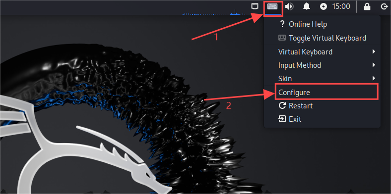
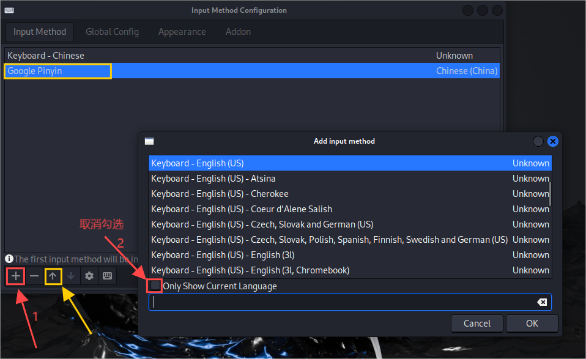
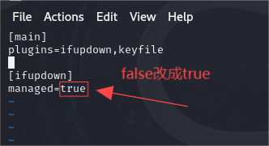
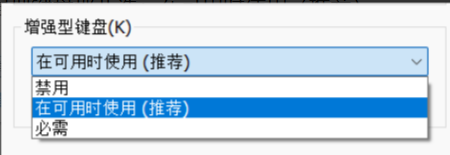

# 安装kali

## 创建新的kali虚拟机：【VMware虚拟机安装Kali Linux系统】

1. [https://www.bilibili.com/video/BV1U34y1f75H?vd_source=e29383d3d6a18f42292eb9de9bd159f9](https://www.bilibili.com/video/BV1U34y1f75H?vd_source=e29383d3d6a18f42292eb9de9bd159f9)
2. [【2024版】最新Kali Linux安装教程（非常详细）从零基础入门到精通，看完这一篇就够了（附安装包）-CSDN博客](https://blog.csdn.net/Javachichi/article/details/134087232)
3. [kali linux 安装教程（最新）_虚拟机安装kali-CSDN博客](https://blog.csdn.net/2301_80128805/article/details/136720113)

## 无法输入中文

1. 进入管理员下的控制台

2. 输入命令

   ```
   apt install fcitx
   apt-get install fcitx-googlepinyin
   ```

3. 重启kali

4. 重启后可以看到右上角多了一个小键盘的图标，点击后选择“配置”。

5. 在弹出的页面内可以看到多出了“Google拼音”汉语输入法。如果没有，则只需要点击左下角的红色标注的“+”并取消红色标注的显示通用语言勾选，然后搜索“google”，添加即可。最后点击google，点击下面花色标注的箭头，将之置于第一输入。                                               

6. 默认**Ctrl+Space** 切换输入法，我们可以在Global Config

## 无法联网

1. 进入root账号

2. 输入命令，修改配置，将`false`改成`true`。其中按`i`键进入插入模式，按`esc`键退出插入模式返回普通模式，在普通模式输入`:wq`保存并退出文件

   ```
   vim /etc/NetworkManager/NetworkManager.conf
   ```

   

3. 再输入命令，进入插入模式：

   ```
   vim /etc/network/interfaces
   ```

4. 在文件中添加代码，保存并退出：

   ```
   auto eth0
   iface eth0 inet dhcp
   ```

5. 回到终端界面，输入：

   ```
   systemctl restart networking
   ```

## 常规更新系统

```
apt-get update   apt-get upgrade -y   
或者   
apt-get dist-upgrade -y 
```

>upgrade和dist-upgrade的区别在于，前者会保留软件之前的配置，而后者覆盖配置。

# 键盘无法输入

1. 有些时候kali的虚拟机会出现键盘无法输入的情况：
   1. D关机后
   2. 点击“编辑虚拟机设置”
   3. 点选项
   4. 点常规
   5. 在右下角增强型键盘那儿选：在可用时使用（推荐）                                   即使本身就选的这个选项，也重复再选一遍，再开机即可
   6. 在删除虚拟机所在文件夹的.vmdk.lck的文件或文件夹

# 磁盘不足扩容

1. [记一次kali linux虚拟机VMware磁盘不足的扩容_vmware kail无法修改内存-CSDN博客](https://blog.csdn.net/weixin_43825028/article/details/119776202)
