# 其他 
1. 密码可分为古典密码和现代密码。
2. 古典密码基本可分为两类，替换密码和移位密码。替代密码又可以分为单表替代密码，多表替代密码。
3. 古典密码中有凯撒密码，栅栏密码，摩斯密码，培根密码，维吉尼亚密码，经典单表替代密码等。
4. 基本的移位密码：曲路密码，云影密码，栅栏密码····
5. 基本的替换密码:
   1. 单表替代密码：凯撒密码，摩斯密码，培根密码，仿射密码···
   2. 多表替代密码：棋盘密码，维吉尼亚密码···
6. 替换密码+词频分析:[https://quipqiup.com/](https://quipqiup.com/)
7. 看到*****，**@**，**#**等符号可以想到单表替换密码或者移位密码
8. 看到%且后面有两个字符，字母或者数字（16进制）可以想到url编码
9. 在用解密网站的时候，注意有些时候多了空格或换行就会出现解密失败，最好解密时将多的换行和空格去掉
10. 做题时，可能给你一个名字叫zip的文件，点开发现是乱码（buuctf的大帝的秘码武器一题）。解题思路：文件名zip，提示我们这是一个zip文件，再看文件扩展名，没有。于是我们自己添加一个文件名，把zip变成文件扩展名。
11. 题目中说是古典密码时，可能时多个密码同时使用，例如 传统知识+古典密码：先是利用天干地支对应的年数算出数值，再以此找ASCII中对应的字母，在进行栅栏密码解密，解密后用凯撒密码解密。
12. 下发容器类的ctf的题目：题中给：nc 114.116.54.89 10001
    1. 其中nc 114.116.54.89是ip地址，10001是端口值
    2. 在[Linux](https://so.csdn.net/so/search?q=Linux&spm=1001.2101.3001.7020)里面运行输入命令 nc 114.116.54.89 10001，如果是‘ node4.buuoj.cn:26400 ’，就是nc node4.buuoj.cn 26400
    3. 例如：[https://blog.csdn.net/qq_42777804/article/details/92599480](https://blog.csdn.net/qq_42777804/article/details/92599480)
    4. 用python的IDLE，输入代码
```
# nc 114.116.54.89 10001
from pwn import *
p=connect('nc 114.116.54.89',10001)
p.sendline(b'内容')
print(p.recv())
p.interactive()
```
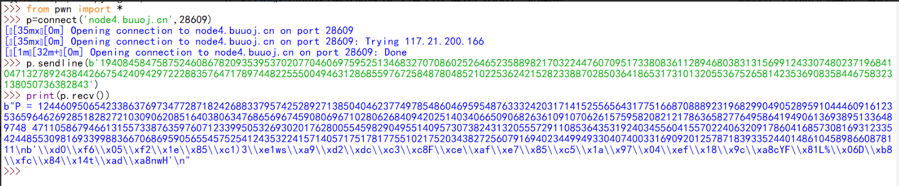

13. 但只有一串数字时，有两种较大的可能性：
    1. 整数转字符串（转成16进制再由ascii转，用函数long_to_bytes即可）
    2. 直接对10进制整数分割转字符（由可见字符的范围分割）
```
# -*- coding: utf-8 -*
i = 0
result = input('十进制数字')
flag = ''
while i<len(result): #ascii的方式解得，flag需要是可见字符，所以不存在1开头的十位数，所以1开头的肯定是100以上的三位数，
    if result[i]=='1':
        flag = flag +chr(int(result[i:i+3]))
        i = i+3
    else:
        flag = flag +chr(int(result[i:i+2]))
        i = i+2
print(flag)
```

14. 枚举函数：itertools.product()
```
a = string.printable[:62]  #生成只含且包含所有并且不重复的数字和大小写字母的字符串
for i in itertools.product(a,repeat=4): #遍历由a字符串中所含的字符构成所有可能的长度为4的字符串
		i ="".join(i)  #因为此时i是元组的形式，每个元素是一个字符。所以需要将列表i中的所有元素合并为一个字符串。

枚举字符不重复的字符串
a = string.printable[:62] 
for i in itertools.product(a,repeat=4):
  	if len(set(i)) == len(i):
				i ="".join(i)

```

注意：在itertools.product()函数中的str类型的实参中不能有重复的字符，即eg中的变量a中不能有重复字符


# base64：

1. [http://www.metools.info/code/c20.html](http://www.metools.info/code/c20.html)
2. [https://ctf.mzy0.com/CyberChef3/#recipe=From_Base64%EF%BC%88Base64%E8%BD%AC%E6%8D%A2%EF%BC%89('GHI3KLMNJOPQRSTUb%3DcdefghijklmnopWXYZ/12%2B406789VaqrstuvwxyzABCDEF5',true)&input=ajJyWGp4OHlqZD1ZUlpXeVRJdXdSZGJ5UWRicVIzUjlpWm1zU2N1dGoyaXFqMy90aWRqMWpkPUQzMQ](https://ctf.mzy0.com/CyberChef3/#recipe=From_Base64%EF%BC%88Base64%E8%BD%AC%E6%8D%A2%EF%BC%89('GHI3KLMNJOPQRSTUb%3DcdefghijklmnopWXYZ/12%2B406789VaqrstuvwxyzABCDEF5',true)&input=ajJyWGp4OHlqZD1ZUlpXeVRJdXdSZGJ5UWRicVIzUjlpWm1zU2N1dGoyaXFqMy90aWRqMWpkPUQzMQ)（在不知道具体的字母表只知道范围的时候也可以用这个）
3. 标准的base64只有64个字符（英文大小写、数字和+、/）以及后缀等号。
4. 密文末尾有“**=**”，且如果有=，则必须在末尾。
5. 编码后字符串的长度一定会被4整除（包括用作后缀的等号）。
6. 添加等号的数目只能是0，1，2。   
7. 加密代码中含有0xF、0x3F、0x3等符号。
8. 加密解密函数：

   1. `encoded_data = base64.b64encode(decoded_data)`
   2. `decoded_data = base64.b64decode(encoded_data)`
9. base64变种考法（更换base64的码表，即在添加一个 替换密码）：

   1. 可能题中给两行字符串，其中一行是密文，另一行字符串有64或65个字符，包含A-Z、a-z、0-9、+、/、=，可能会没有等号。这是base64密码表，其中有64或65个字符的字符串是对应“ABCDEFGHIJKLMNOPQRSTUVWXYZabcdefghijklmnopqrstuvwxyz0123456789+/=“（如果前面的字符串是长为64，则此字符串没有=），先按着对应规则进行替换密码解密，再进行base64解密!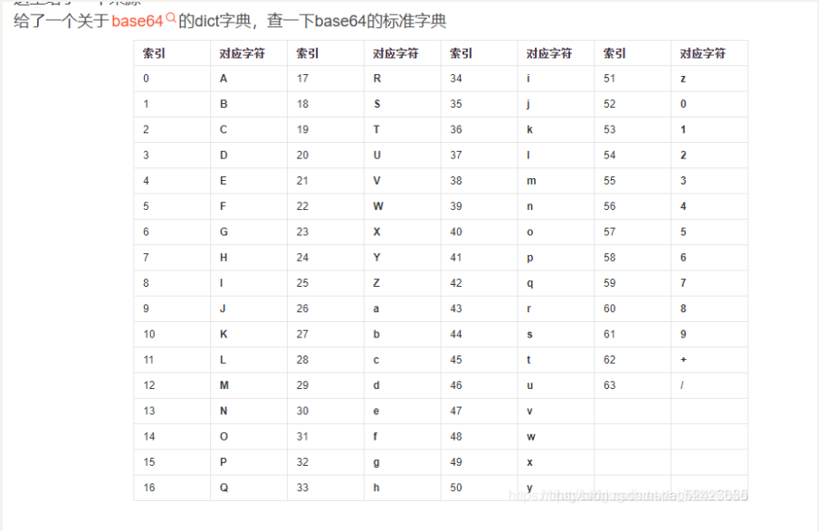
      1. 此时需要python函数：str.maketrans函数(见常用函数) 
         1. `translation_table = str.maketrans(custom_alphabet, standard_alphabet)`
            `output_string = input_string.translate(translation_table)`
         2. `custom_alphabet`: 自定义字母表（字符串），即源字符集。你想要被替换的字符集。
         3. `standard_alphabet`: 标准字母表（字符串），即目标字符集。你想要替换成的字符集。
         4. `custom_alphabet->standard_alphabet`,将字符串中的字母按此规则一一替换。

   2. 也可以用网站[https://ctf.mzy0.com/CyberChef3/#recipe=From_Base64%EF%BC%88Base64%E8%BD%AC%E6%8D%A2%EF%BC%89('GHI3KLMNJOPQRSTUb%3DcdefghijklmnopWXYZ/12%2B406789VaqrstuvwxyzABCDEF5',true)&input=ajJyWGp4OHlqZD1ZUlpXeVRJdXdSZGJ5UWRicVIzUjlpWm1zU2N1dGoyaXFqMy90aWRqMWpkPUQzMQ](https://ctf.mzy0.com/CyberChef3/#recipe=From_Base64%EF%BC%88Base64%E8%BD%AC%E6%8D%A2%EF%BC%89('GHI3KLMNJOPQRSTUb%3DcdefghijklmnopWXYZ/12%2B406789VaqrstuvwxyzABCDEF5',true)&input=ajJyWGp4OHlqZD1ZUlpXeVRJdXdSZGJ5UWRicVIzUjlpWm1zU2N1dGoyaXFqMy90aWRqMWpkPUQzMQ)

   2. 列题：CISCN2023WP中的sign in passwd

10. base64加密方法：

    1. 编码时，将要编码的内容转换为二进制数据（一个字符对应8位二进制），每6位作为一组，从索引表中找到对应的字符

       1. 编码的文本字节数是3的倍数时，刚好可以编码成4个字符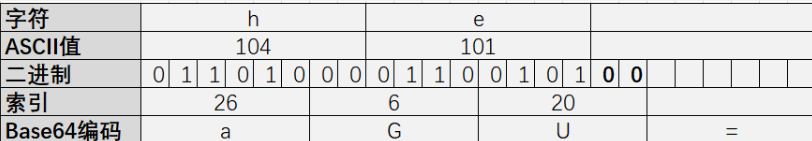
       1. 编码的文本字节数是3的倍数时，刚好可以编码成4个字符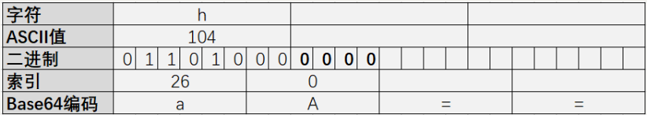
       1. 编码的文本字节数不是3的倍数时，剩下2个字符时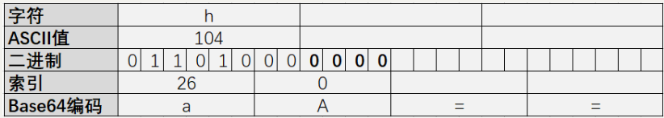

    2. 解码：

       1. 首先把填充字符=去掉

       2. 每个字符查表转换为对应的6位索引，得到一串二进制字符串

       3. 接着从左到右，每8位一组，多余位丢掉，转为对应的字符

11. baee64隐写技术：

    1. [https://blog.csdn.net/Sanctuary1307/article/details/113836907](https://blog.csdn.net/Sanctuary1307/article/details/113836907)

    2. 隐写原理：base64之所以可以隐藏信息，便是在于在解密过程中,在解码的第3步中，会有部分数据被丢弃（即不会影响解码结果），这些数据正是在编码过程中补的0。也就是说，如果在编码过程中不全用0填充，而是用其他的数据填充，仍然可以正常编码解码，因此这些位置可以用于隐写。解开隐写的方法就是将这些不影响解码结果的位提取出来组成二进制串（一行 base64 最多有 2 个等号。），然后转换成ASCII字符串。这就是为什么出base64隐写时会有很多大段 base64 的原因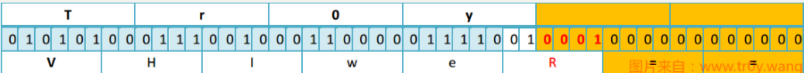

    3. 需要注意的是等号的那部分 0 不能用于隐写，因为修改那里的二进制值会导致等号数量变化, 解码的第 1 步会受影响. 自然也就破坏了源字符串。

# base32：

1. [http://www.hiencode.com/base64.html](http://www.hiencode.com/base64.html)
2. 也用**=**做填充字符，最多6个
3. 使用32个可打印字符（大写字母，和数字2-7，**没有小写字母**）
4. 编码后的字符串不用区分大小写并派出了容易混淆的字符
5. 密文一般比base64长
# base16（又叫HEX编码，和HEX编码的唯一差别是在密文的大小写上）：

1. [https://ctf.bugku.com/tool/base16](https://ctf.bugku.com/tool/base16)
2. 一般密文开头是0x后面是一串数字和字母（0x意思是16进制）
3. 无**=**
4. 由数字0-9和字母A-F组成
5. 数字多余字母
6. 转码规则相当于将明文对应的ASCII值转成16进制
7. 一般base16的密文长度为2的倍数
# HEX编码：

1. [https://www.107000.com/T-Hex/](https://www.107000.com/T-Hex/)
# base36：

1. [http://ctf.ssleye.com/base64.html](http://ctf.ssleye.com/base64.html)
2. 密文由16个字符（0-9,A-F）组成
# base58的特征：

1. [http://www.hiencode.com/base58w.html](http://www.hiencode.com/base58w.html)
2. base58不使用数字0，字母大写O，字母大写I，字母小写l以及+，/
3. 字母多于数字
4. 结尾没有**=**
# base62：

1. [https://ctf.bugku.com/tool/base62](https://ctf.bugku.com/tool/base62)
2. 密文由62字符（0-9，a-z，A-Z）组成
# base85：

1. **=**出现在字符串中间
2. 奇怪的字符比较多
# base91：

1. [https://ctf.bugku.com/tool/base91](https://ctf.bugku.com/tool/base91)
2. 密文由91个字符（**0-9**，**a-z**，**A-Z **, **!#$%&()*+,./:;<=>?@[]^_`{|}~”**）组成
# base100：

1. 密文由emoji表情组成
# ASCII编码：

1. [http://www.hiencode.com/cencode.html](http://www.hiencode.com/cencode.html)
2. 密文是0-9组成，是十进制，当然也可能是8或16进制的ASCII
# Escape()编码：

1. [http://www.hiencode.com/escape.html](http://www.hiencode.com/escape.html)
2. 如果密文中有“%”，形式为“%xx”和“%uxxxx”
3. 字符范围是16进制的“0-F”
# Jother编码：

1. jother直接在浏览器(IE可以)的控制台里输入密文即可执行解密
2. 密文由8个字符“**[]**,**()**,**{}**,**+**,**!**”字符组成的编码，比jsfuck编码多了**{}**
# JSfuck编码：

1. [http://codertab.com/JsUnFuck](http://codertab.com/JsUnFuck)
2. 用6 个字符 **( ) [ ] !+** 来对JavaScript进行编码
# Brainfuck：

1. [https://copy.sh/brainfuck/text.html](https://copy.sh/brainfuck/text.html)
2. 仅由 **<>+-.[]** 组成，大量的 **+-** 符号。
# 凯撒密码（caesar，凯撒密码在历史上最初的偏移量是3）：

1. [https://ctf.bugku.com/tool/caesar](https://ctf.bugku.com/tool/caesar)
2. 一般正常的凯撒密码只会在26个字母里替换，所以如果密文中由{}可能是凯撒
3. 出题时，偏移量可能是不变的；也可能时随着字母向后推移，偏移量递增或递减等。
4. 有些时候，出题人没告诉凯撒密码的偏移量，而解密后还有其他加密的时候可以首先用偏移量为3的解密结果去试其他加密。如：[WUSTCTF2020]佛说：只能四天
5. 根据偏移量不同还存在    若干特定的凯撒密码名称：
   1. 偏移量为10：Avocat
   2. 偏移量为13：ROT13
   3. 偏移量为-5：Cassis（K6）
   4. 偏移量为-6：Cassette(K7)
# ROT密码(凯撒密码的变式):

1. [https://www.qqxiuzi.cn/bianma/rot5-13-18-47.php](https://www.qqxiuzi.cn/bianma/rot5-13-18-47.php)
2. ROT5：
   1. [https://www.jisuan.mobi/p3Bu6zmuzmzNuyXQ.html](https://www.jisuan.mobi/p3Bu6zmuzmzNuyXQ.html)
   2. 只对数字进行编码，用当前数字往前数的第5个数字替换当前数字，例如当前为0，编码后变成5，当前为1，编码后变成6，以此类推顺序循环。
   3. 只有数字构成
3. ROT13(只说rot，很可能默认是rot13)：
   1. [https://www.jisuan.mobi/puzzm6z1B1HH6yXW.html](https://www.jisuan.mobi/puzzm6z1B1HH6yXW.html)
   2. 只对字母进行编码，用当前字母往前数的第13个字母替换当前字母，例如当前为A，编码后变成N，当前为B，编码后变成O，以此类推顺序循环
   3. 只有字母构成
4. ROT18：
   1. [https://www.jisuan.mobi/pbH1zHNNNHHuHyXS.html](https://www.jisuan.mobi/pbH1zHNNNHHuHyXS.html)
   2. 这是一个异类，本来没有，它是将ROT5和ROT13组合在一起，为了好称呼，将其命名为ROT18。
   3. 由数字和字母构成
5. ROT47：
   1. [https://www.jisuan.mobi/puu3uummu313myXP.html](https://www.jisuan.mobi/puu3uummu313myXP.html)
   2. 对数字、字母、常用符号进行编码，按照它们的ASCII值进行位置替换，用当前字符ASCII值往前数的第47位对应字符替换当前字符，例如当前为小写字母z，编码后变成大写字母K，当前为数字0，编码后变成符号_。用于ROT47编码的字符其ASCII33－126，具体可参考ASCII编码。
   3. 有各种字符构成，当什么奇怪的字符都有的时候，可以考虑。
# 维吉尼亚密码（vigenere）：

1. [http://www.hiencode.com/vigenere.html](http://www.hiencode.com/vigenere.html)（解密网站，需要密钥）
2. [https://www.guballa.de/vigenere-solver](https://www.guballa.de/vigenere-solver)（解密网站，不需要密钥，一般密文较长）
3. [https://zhuanlan.zhihu.com/p/552942664](https://zhuanlan.zhihu.com/p/552942664)，[https://www.jianshu.com/p/2b69dde012e3](https://www.jianshu.com/p/2b69dde012e3)（维吉尼亚密码解析）
4. 维吉尼亚密码原理：                                                                                          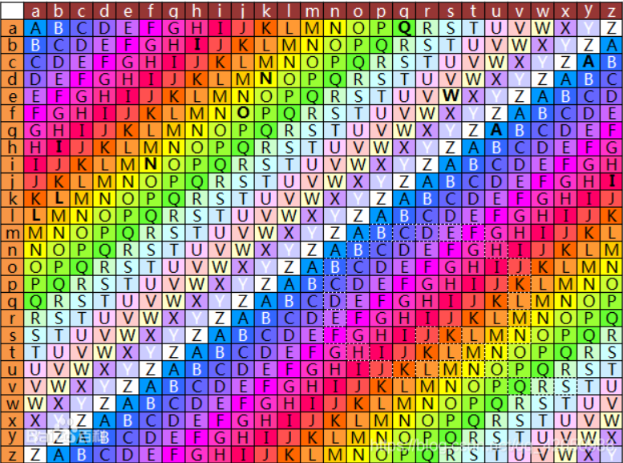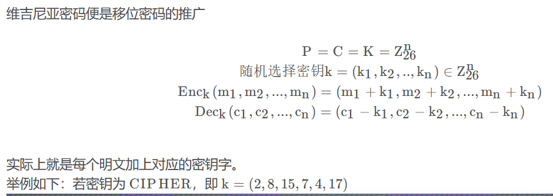

5. 解密思路：因此在破译维吉尼亚密码时候重要的是要知道秘钥的长度，因为只要确定了秘钥长度，对维吉尼亚密码进行分解，分解后得到的便是多组凯撒密码。
   1. 以下例子来自limisky博客：如密文为：ABCDEFGHIJKLMN
   2. 如果我们知道密钥长度为3，就可将其分解为三组：组1：A D G J N；组2：B E H K；组3：C F I M分解后每组就是一个凯撒密码，即组内的位移量是一致的，对每一组即可用频度分析法来解密。所以破解维吉尼亚密码的关键就是确定密钥的长度。
# 经典单表替换密码：

1. [https://quipqiup.com/](https://quipqiup.com/)
   1. 在使用这个网页时，他会自动将非字母的字符省略
   2. 解密出来的明文会自动的加上空格，所以需要将空格去掉
2. 由26个字母组成
3. 无规律的替换
# atbash（阿特巴希密码）：

1. [http://www.metools.info/code/atbash209.html](http://www.metools.info/code/atbash209.html)
2. 简单的替换密码（特殊的仿射密码）
3. 替换原则：它将字母表中的每个字母都替换成相反顺序的字母，即’A’与’Z’替换，'B’与’Y’替换，以此类推。
4. 阿特巴希密码其实可以看作一种特殊的仿射密码。如果你定义首个字母为0，第二个字母为1等字母直到字母表的最后一个字母为字母数-1，然后阿特巴希密码将可使用仿射密码来加密与解密：f(x) = (ax + b) mod m 。阿特巴希密码的算式为：a = b = m - 1，其中m是字母表中的字母数（m = 26)。
# 云影密码（又称01248密码）：

1. 0用于分割，其他数字用于做加和操作之后转明文，加和的数字即为字符下标。
2. 云影密码：若密文中只有数字，且仅包含01248，则很可能是云影密码。
3. 解密脚本：
```
a='8842101220480224404014224202480122'.split('0')
flag=""
for i in a:
    tmp=0
    for j in i:
        tmp+=int(j)
    flag+=chr(tmp+64)
print(flag)
————————
flag是：WELLDONE
```
# 栅栏密码（fence）： 

1. [https://ctf.bugku.com/tool/railfence](https://ctf.bugku.com/tool/railfence)和python脚本
2. 介绍+解密：[https://blog.csdn.net/qq_26131031/article/details/123735156](https://blog.csdn.net/qq_26131031/article/details/123735156)
3. 加密：把明文分为n个一组，然后把每组的第一个字符连起来，形成一段无规律的字符。
4. 特征：密钥是数字，密文不会太长，一般不超过30个。
5. 密文中直接包含明文中的所有字符，只是顺序打乱，所以如果包含flag{}格式中的{}，和f、l、a、g字符，则考虑栅栏密码解密。
6. 栅栏密码还可以以加密的形式来作为解密求出明文。eg：buuctf中篱笆墙的影子一题，就是将给出的密文进行栅栏密码加密可以得到最终的flag
7. w型栅栏密码：
   1. [https://blog.csdn.net/YUK_103/article/details/98163062](https://blog.csdn.net/YUK_103/article/details/98163062)   
   2. 解密网站：[http://www.atoolbox.net/Tool.php?Id=777](http://www.atoolbox.net/Tool.php?Id=777
# 培根密码：

1. [http://www.hiencode.com/baconian.html](http://www.hiencode.com/baconian.html)
2. 密文仅有a、b两种字符（或仅有两种字符，不一定是a、b），则考虑培根密码。
# url编码：

1. [http://www.mxcz.net/tools/Url.aspx](http://www.mxcz.net/tools/Url.aspx)
2. url=%+hex（hex的密文两个两个的取）
3. 有许多“**%**”
4. 每个“**%**”后面有两个字符，字母或者数字
5. 解密url编码时，一般用encodeURIComponent函数
6. url编码是基于unicode/GBK等编码的一种编码方式
7. url编码的转码结果基本是和hex编码的结果相同，不同的是当你用url编码网址时是不会把http、https关键字和/、？、&、=等连接符进行编码的，而hex编码则全部转化。
# MD5密码是一种被广泛使用的密码散列函数，可以产生一个128位的散列值。其特点为：

1. [https://www.somd5.com/](https://www.somd5.com/)
2. [https://www.cmd5m/](https://www.cmd5.com/)（可能要付费）
3. MD5是hash算法的一种
4. 长度固定，总是16个字节，32位的字符串 
5. 一般为16位或32位大小写字母数字混合字符串
6. 解密可能出现33位字符串，应判断多余字符，将其去掉
7. 也可能给你很长的一个字符串让你判断，选出其中正确的字符串。例如buuctf中windows系统密码一题：
   1. 仔细看冒号给出的规律，我们可以发现由5个字符串，其中每个字符串的长度均为32，又是hash算法，因此我们可以判断很可能是MD5
   2. 我们在一次用这五个字符串去尝试，就可找出正解
8. 表现形式很可能是：**Administrator:500: **xxxxxx（一串32位或16位字符串）**: **xxxxxx（一串32位或16位字 符串）**:::**（可能不是‘administrator’‘500’而是其他字符串和数字，但格式是如此）
9. windows密码一般是MD5加密
10. python加密
```
import hashlib

text = "Hello, world!"
encrypted_text = hashlib.md5(text.encode('utf-8')).hexdigest()
print(encrypted_text)
```
# 莫尔斯电码（摩尔斯、Morse或摩斯电码）：

1. [http://www.zhongguosou.com/zonghe/moErSiCodeConverter.aspx](http://www.zhongguosou.com/zonghe/moErSiCodeConverter.aspx)和python脚本
2. 由 "**."**、"**-**"组成，可能会有"**/**"（它的变式同样可能用其他字符替代 . 和 - ）
3. 会用空格或斜杠来分割密文
4. 编码不区分大小写
5. 做题时，可能会出现摩尔斯电码和其他编码混合出现的情况：摩尔斯编码+hex编码（buuctf中的[AFCTF2018]Morsee一题）
# quoted-printable编码：

1. [http://www.mxcz.net/tools/QuotedPrintable.aspx/](http://www.mxcz.net/tools/QuotedPrintable.aspx/)
2. 任何一个8位的字节值可编码为3个字符：一个等号”=”后跟随两个十六进制数字(0–9或A–F)表示该字节的数值，和url很类似
3. quoted-printable编码的数据的每行长度不能超过76个字符. 为满足此要求又不改变被编码文本，在QP编码结果的每行末尾加上软换行(soft line break). 即在每行末尾加上一个”=”, 但并不会出现在解码得到的文本中
4. quoted-printable编码中会出现许多‘**=**’
# rabbit高速流密码：

1. 以U2FsdGVkX1开头
2. 可能以‘**=**’结尾
3. 组成：26个大小写英文字母、=、/、+
# AES密码：

1. [http://www.hiencode.com/caes.html](http://www.hiencode.com/caes.html)
# SHA系列：

1. [https://www.cmd5.com/](https://www.cmd5.com/)
2. SHA-1：字母（a-f）和数字（0-9）混合，固定位数 40 位
3. SHA-224/SHA3-224：字母（a-f）和数字（0-9）混合，固定位数 56 位
4. SHA-256/SHA3-256：字母（a-f）和数字（0-9）混合，固定位数 64 位
5. SHA-384/SHA3-384：字母（a-f）和数字（0-9）混合，固定位数 96 位
6. SHA-512/SHA3-512：字母（a-f）和数字（0-9）混合，固定位数 128 位

# 中文电码：

1. [http://code.mcdvisa.com/](http://code.mcdvisa.com/)
2. 密文以四位（0-9）为一组的数字表示，一组数字对应一个中文，所以其密文长度一定是4的倍数。

# 猪圈密码：

1. [http://www.hiencode.com/pigpen.html](http://www.hiencode.com/pigpen.html)
2. 由一些奇怪的符号构成：                                                                                    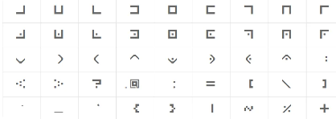或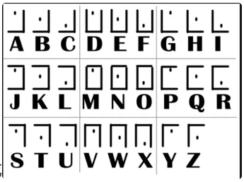 

#  古埃及象形文字：

1.                                                                                             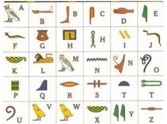                                       

# 圣堂武士密码：

1. 有奇怪的图案构成：

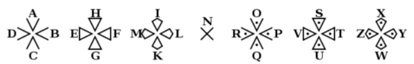


# 标准银河密码：

1. 由一些奇怪的图案构成：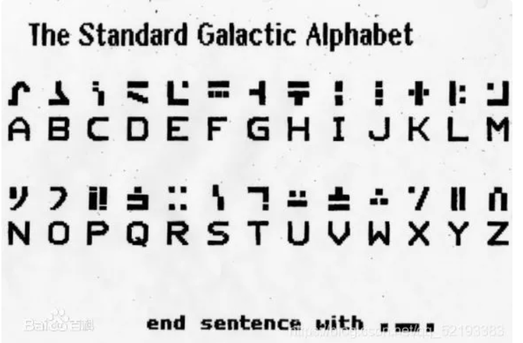
   

# 仿射密码：

1. 为便于计算，将26个英文字母用数字表示：a=0,b=1,…,z=25
2. 仿射加密的密钥有两个：a和b，取值范围都是[0,25]。
3. a要求与26互质
4. x是明文，y是密文加密公式：y=(a*x+b)%26（0=<x,y<=25）解密：y≡(a*x+b)(mod26) => (y-b)≡(a*x)(mod26) =>(y-b)*a^(-1)≡x(mod26) => x = [(y-b)*a^(-1)]%26
# 曼切斯特编码：

1. 每个周期都一定会跳变
2. 标准曼彻斯特
   1. G. E. Thomas, Andrew S. Tanenbaum1949年提出的，它规定0是由低-高的电平跳变表示，1是高-低的电平跳变
   2. 编码0101（即0x5），表示原数据为00
   3. 编码1001（0x9）表示10
   4. 编码0110（0x6）表示01
   5. 编码1010（0xA）表示11
   6. 括号内是16进制的表示，原编码是2进制的表示
3. 802.3曼彻斯特
   1. IEEE 802.4（令牌总线）和低速版的IEEE 802.3（以太网）中规定, 按照这样的说法, 低-高电平跳变表示1, 高-低的电平跳变表示0。
   2. 编码0101（0x5）表示11；
   3. 编码1001（0x9）表示01；
   4. 编码0110（0x6）表示10；
   5. 编码1010（0xA）表示00；
   6. 括号内是16进制的表示，原编码是2进制的表示
4. 差分曼彻斯特
   1. 相较于其他曼彻斯特编码而言，密文开头多了3E作为区别
   2. 在最初信号的时候，即第一个信号时：如果中间位电平从低到高，则表示0；如果中间位电平从高到低，则表示1。
   3. 后面的信号（从第二个开始）就看每个信号位开始时有没有跳变来决定：在信号  位开始时改变信号极性，表示逻辑"0"；在信号位开始时不改变信号极性，表示 辑"1"。
5. 一般来说曼彻斯特有5、6、9、A构成，也可能使有0、1构成。
6. 一般题名叫传感器的题很可能是曼彻斯特编码，题目中给的ID是一部分flag
# Unicode编码：

1. [https://ctf.bugku.com/tool/uuencode](https://ctf.bugku.com/tool/uuencode)
2. 一般以\u、&#或&#x开头，后面是数字加字母组合
   1. \u和&#x开头是一样的，都是16进制unicode字符的不同写法
   2. &#开头则是unicode字符10进制的写法
   3. &#、&#x开头的也被称为HTML字符实体转换
3. 用一个字节以上表示的字符，假设是N个字节表示这个字符：则该字符第一个字节的前N位都为1，第N+1位为0，剩下的N-1个字节的前两位都设为10，剩下没有主动设值的位置则使用这个字符的Unicode二进制代码点从低位到高位填充，不够用0补足。
4. 首先“罗”对应了unicode中的U+7F57，对应编码表中第三行，也就是用3个字节来表示的字符，把7F57的二进制111 1111 0101 0111‬从低位对应补足到1110xxxx 10xxxxxx 10xxxxxx(从低位)，最后成为11100111 10111101 10010111即十六进制E7BD97。
5. 编码对照表如下：
| <br />1.  Unicode字符集范围（十六进制） | UTF-8编码（二进制） |
| --- | --- |
|  0000 0000 - 0000 007F |  0xxxxxxx |
|  0000 0080 - 0000 07FF |  110xxxxx 10xxxxxx |
|  0000 0800 - 0000 FFFF |  1110xxxx 10xxxxxx 10xxxxxx |
|  0001 0000 - 0010 FFFF |  11110xxx 10xxxxxx 10xxxxxx 10xxxxxx |

# UUencode编码：

1. Uuencode将输入资料以每三个字节为单位进行编码，如此重复进行。如果最后剩下的资料少于三个字节，不够的部份用零补齐。这三个字节共有24个Bit，以6-bit为单位分为4个群组，每个群组以十进制来表示所出现的数值只会落在0到63之间。将每个数加上32，所产生的结果刚好落在ASCII字符集中可打印字符（32-空白…95-底线）的范围之中。
2. 每60个编码输出（相当于45个输入字节）将输出为独立的一行，每行的开头会加上**长度字符**，除了最后一行之外，**长度字符都应该是’M'这个ASCII字符**（77=32+**45**），最后一行的长度字符为**32+剩下的字节数目**这个ASCII字符。
3. 密文特征，每行开头应该为**M**
4. 编码原理类似与于base64
# aaencode编码：

1. [https://utf-8.jp/public/aaencode.html](https://utf-8.jp/public/aaencode.html)
2. 是js加密，可以把文字加密成表情。
3. 仅由日式表情符号组成
# jjencode：

1. [http://www.hiencode.com/jjencode.html](http://www.hiencode.com/jjencode.html)
2. 大量** $**、**_ **符号、大量重复的自定义变量；
3. 仅由 18 个符号组成：**[]()!+,\"$.:;_{}~=**
# 当铺密码：

1. 根据汉字有多少笔画出头，对应的明文就是数字几
# 与佛论禅：

1. [https://ctf.bugku.com/tool/todousharp](https://ctf.bugku.com/tool/todousharp)（多的空格和换行会影响解密，导致解密失败）
2. 开头是佛曰
# 新约佛论禅：

1. [http://hi.pcmoe.net/buddha.html](http://hi.pcmoe.net/buddha.html)
2. 开头是新佛曰
# 跳舞小人：

1. 一串跳舞小人图案组成的密文：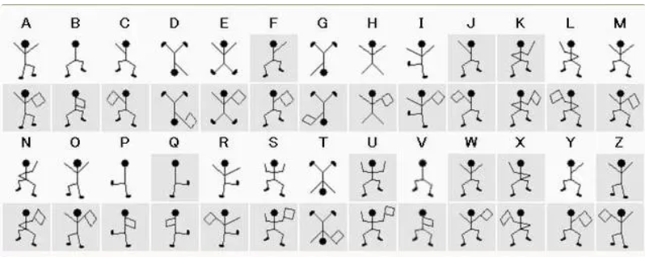

# 四方密码：

1. [http://www.online.crypto-it.net/eng/four-square.html](http://www.online.crypto-it.net/eng/four-square.html)
2. 四方密码用4个5×5的矩阵来加密。每个矩阵都有25个字母（通常会取消Q或将I,J视作同一样，或改进为6×6的矩阵，加入10个数字）。
3. 加密步骤：
   1. 把字符串按两个字母一组分开
   2. 找第一组第一个字母在左上角矩阵的位置
   3. 找第一组第二个字母在右下角矩阵的位置
   4. 先找和一个字母同行的，和第二个字母同列的：                                         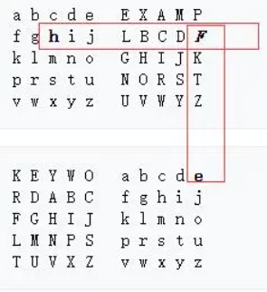

   5. 第一个字母同列，第二个字母同行的：                                                                         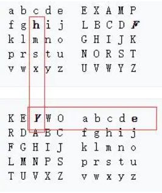

   6. 得到he加密后为FY
4. 通常在题目中会给定2个密钥（通常是单词），一般我们将q或z删去，或者把I和J当成一个。秘钥中重复的字母去掉只留一个，然后再在单词后面按字母表顺序添加字母，密钥中出现过的字母不写，补充成5*5的矩阵。                                                                            （eg: information——>informatbcdeghjklpsuvwxyz）
# 波利比奥斯密码（Polybius Square Cipher）：

1. 解题脚本
2. 波利比奥斯方阵密码（Polybius Square Cipher或称波利比奥斯棋盘）是棋盘密码的一种，是利用波利比奥斯方阵进行加密的密码方式。
3. 简单的来说就是把字母排列好，用坐标(行列)的形式表现出来。字母是明文，密文便是字母的坐标(数字也可以用字母代替），即：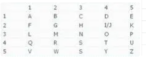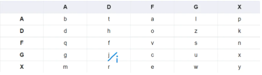

      ​        表格里的26个字母的顺序不影响，因为在解密的时候会爆破枚举，所以更改顺序并不会影响最终结果。
# 希尔密码(Hill Cipher)：

1. [http://www.metools.info/code/hillcipher243.html](http://www.metools.info/code/hillcipher243.html)
2. 提示词可能是山（hill）

# 普莱费尔（Playfair Cipher）加密解密：

1. [http://www.metools.info/code/playfair_186.html](http://www.metools.info/code/playfair_186.html)
2. 可能会说公平的玩之类的提示密钥（加密普莱费尔加密，是密钥：playfair）

# 异或运算：

1. a，b不同，异或结果为1；a，b相同，异或结果为0。python的异或运算符：^
2. 一般是将两个数的值转化为二进制，再进行异或运算，最后得到的值就是异或运算的结果的二进制形式。      
3. 异或运算的性质：a异或b=c，则a异或c=b；b异或c=a
4. ^异或时不会自动补全，低位异或，高位不变。如：
```python
n1 = b'ab'
n2 = b'a'
c = bytes_to_long(n1) ^ bytes_to_long(n2)
print((long_to_bytes(c))[:1])
# b'a'
print((long_to_bytes(c))[1:])
# b'\x03'
print(long_to_bytes(bytes_to_long(b'a') ^ bytes_to_long(b'b')))
# b'\x03'
```

5. 在两个长度不同的字节串进行异或运算的时候，可以通过重复短的字节串自身来填充短的字节串，直到长度与长字节串一致。
```python
#len(a)>len(key)
complete_key = (key * (len(a)//len(key)+1))[:len(a)]
#[:len(a)],将长度限制在len(a)
```

6. xor函数能自动补全短字节的字节串，原理同 5 。
```python
from pwn import xor

a = '0e0b213f26041e480b26217f27342e175d0e070a3c5b103e2526217f27342e175d0e077e263451150104'
a = bytes.fromhex(a)
key = b'myXORkey'
print(xor(a,key))
```
# Brainfuck编码：

1. [https://tool.bugku.com/brainfuck/?wafcloud=1](https://tool.bugku.com/brainfuck/?wafcloud=1)
2. 有’**<‘ ’>‘ ’+‘ ’-‘ ’.‘ ’，‘ ’[‘ ’]‘**八种符号来替换C语言的各种语法和命令
# Ook密码：

1. [https://tool.bugku.com/brainfuck/?wafcloud=1](https://tool.bugku.com/brainfuck/?wafcloud=1)
2. ook密码中有大量ook，加上一些符号
# 格雷编码：

1. [http://www.ab126.com/system/2780.html](http://www.ab126.com/system/2780.html)
2. 密文由0、1构成
# 字母表编码：

1. [http://ctf.ssleye.com/a1z26.html](http://ctf.ssleye.com/a1z26.html)
2. 用数字1-26或者0-25来编码范围为A-Z/a-z字母字符，字母不区分大小写。
# 进制编码：

1. [https://tool.oschina.net/hexconvert](https://tool.oschina.net/hexconvert)
2. 主要是各进制之间的转换
3. 二进制数，只有01两个字符 
4. 八进制数，0开头，用[0-7] 8个字符表示 
5. 十六进制数，0x开头，[0-9，a-f ]等十六个个字符表示 
# GBK/GBK2312编码：

1. [http://www.mytju.com/classcode/tools/encode_gb2312.asp](http://www.mytju.com/classcode/tools/encode_gb2312.asp)
2. 用2个字节16比特的16进制数表示来编码中文字符集，其中GBK是GBK2312的扩展字符集编码，包含简体、繁体中文、日语、韩语等。比如斗哥斗对应的GBK和GBK2312为B6B7。
# 列移位密码：

1. 列移位密码(Columnar Transposition Cipher)是一种比较简单，易于实现的换位密码，通过一个简单的规则将明文打乱混合成密文。
2. 以明文 The quick brown fox jumps over the lazy dog，以 how are u为例： 填入5行7列表(事先约定填充的行列数，如果明文不能填充完表格可以约定使用某个字母进行填充)                                          
3. how are u 按how are u在字母表中的出现的先后顺序进行编号，我们就有a为1,e为2，h为3，o为4，r为5，u为6，w为7，所以先写出a列，其次e列，以此类推写出的结果便是密文： 密文：qoury inpho Tkool hbxva uwmtd cfseg erjez<br />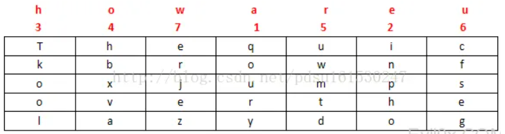

# 卡尔达诺栅格码：

1. [https://www.spammimic.com/](https://www.spammimic.com/)
2. 把明文伪装成垃圾邮件
# 百家姓暗号：

1. [https://api.dujin.org/baijiaxing/](https://api.dujin.org/baijiaxing/)（密文转换成明文时，会多一串字符：**magnet:?xt=urn:btih:**）
2. 密文由百家姓组成
# 文本加密：

1. [https://www.qqxiuzi.cn/bianma/wenbenjiami.php](https://www.qqxiuzi.cn/bianma/wenbenjiami.php)
2. 可以加密为汉字、数字、音乐符号、字母等，加密完后会有**==**最为结尾，和base64类似
# 键盘密码：

1. 应该不算是一种加密算法，但是一种有趣的设置密码方式。他就是a-z(A-Z)对应成键盘上的字母，把键盘字母一行一行的对应即可。包围的键就是要找的值。每个围起来的圈之间通常会有明显的间隔，比如空格。如：r5yG lp9I BjM tFhB T6uh y7iJ QsZ bhM
# block cipher(分组密码)：

1. [https://blog.csdn.net/qq_34266854/article/details/108152492](https://blog.csdn.net/qq_34266854/article/details/108152492)（讲解）

# 核心价值观编码：

1. [https://ctf.bugku.com/tool/cvecode](https://ctf.bugku.com/tool/cvecode)
2. 由 自由，友善，公正等构成。

# zip压缩包伪加密：

1. [https://blog.csdn.net/xiaozhaidada/article/details/124538768?ops_request_misc=%257B%2522request%255Fid%2522%253A%2522168914965716800192215326%2522%252C%2522scm%2522%253A%252220140713.130102334..%2522%257D&request_id=168914965716800192215326&biz_id=0&utm_medium=distribute.pc_search_result.none-task-blog-2~all~sobaiduend~default-2-124538768-null-null.142^v88^insert_down28v1,239^v2^insert_chatgpt&utm_term=zip%E5%8E%8B%E7%BC%A9%E5%8C%85%E4%BC%AA%E5%8A%A0%E5%AF%86&spm=1018.2226.3001.4187](https://blog.csdn.net/xiaozhaidada/article/details/124538768?ops_request_misc=%257B%2522request%255Fid%2522%253A%2522168914965716800192215326%2522%252C%2522scm%2522%253A%252220140713.130102334..%2522%257D&request_id=168914965716800192215326&biz_id=0&utm_medium=distribute.pc_search_result.none-task-blog-2~all~sobaiduend~default-2-124538768-null-null.142^v88^insert_down28v1,239^v2^insert_chatgpt&utm_term=zip%E5%8E%8B%E7%BC%A9%E5%8C%85%E4%BC%AA%E5%8A%A0%E5%AF%86&spm=1018.2226.3001.4187)

# 海明校验码：

1. 将有效信息按某种规律分成若干组，每组安排一个校验位（奇偶校验位，海明校验码的特点），做奇偶测试，就能提供多位检错信息，以指出最大可能是哪位出错，从而将其纠正。实质上，海明校验是一种多重校验。
2. 因此如果在奇偶校验的基础上增加校验位的位数，构成多组奇偶校验，就能够发现更多位的错误并可自动纠正错误。 这就是**海明校验码** (Hamming Code)的实质所在。
   1. 奇偶校验位：数据位和校验位一共含有奇数个1，称为奇校验。数据位和校验位一共含有偶数个1，称为偶校。
   2. 注：数据传输过程一般是出现一位错误，而奇偶校验码能发现奇数个错误
   3. 数据位个数+校验位个数=总的验证码个数
   4. 校验位一般在2^n的位置
3. 海明校验码的使用方法：（举例，来源于buu的鸡藕椒盐味 ）
   1. 题目：验证码：0000 0101 0011（此验证有误），数据位有8个，通过海明校验码来获得正确的验证码
   2. 因为验证码有12个、数据位有8个，所以校验位有4个（分别设为r1,r2,r3,r4）得到，而校验位在2^n的位置，所以共有4位校验码在1，2，4，8位置                                                                                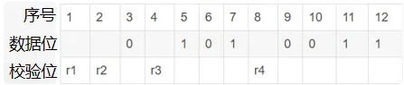
   3. 求校验码r1、r2、r3、r4的值： 
      1. 首先列表：                                                                                                                       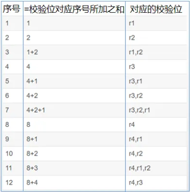                                                                                                               规则：第2列：校验码对应的序号之和等于第一列同行序号。第3列：第2列序号对应的校验位
      2. 其次由表得出：我们会发现r1在序号为1、3、5、7、9、11的行出现，然后又因为序号1对应的是校验位，所以最后统计出来r1所在的数据位有3、5、7、9、11。将所有校验位统计后得到下表：                                                                                                                 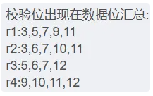          
      3. r1等校验位的计算要用到异或(⊕)，那么应有：r1=0⊕1⊕1⊕0⊕1=1；r2=0⊕0⊕1⊕0⊕1=0；r3=1⊕0⊕1⊕0=0；r4=0⊕0⊕1⊕1=0
      4. 明显r1出现错误，与题目所给的r1=0不符，所依通过计算比对（改变一个数据位的值，让r1=0，r2、r3、r4的值不变）我们可知，9的位置出现错误，应该为1（奇偶校验码，奇数个错误，一般数据传输有一位错误，所以可以确定9出现错误）    
      5. 最终我们可得正确的验证码:0000 0101 1011           


 

