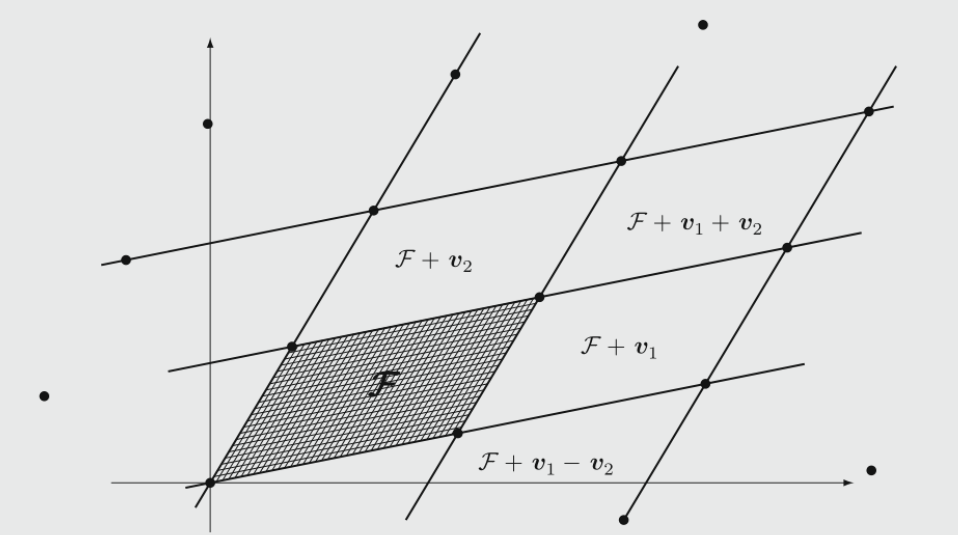
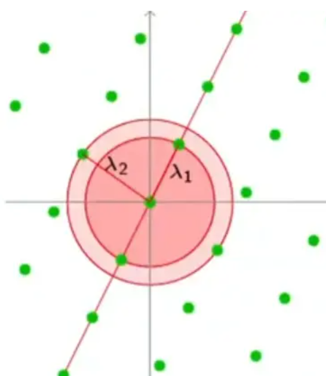
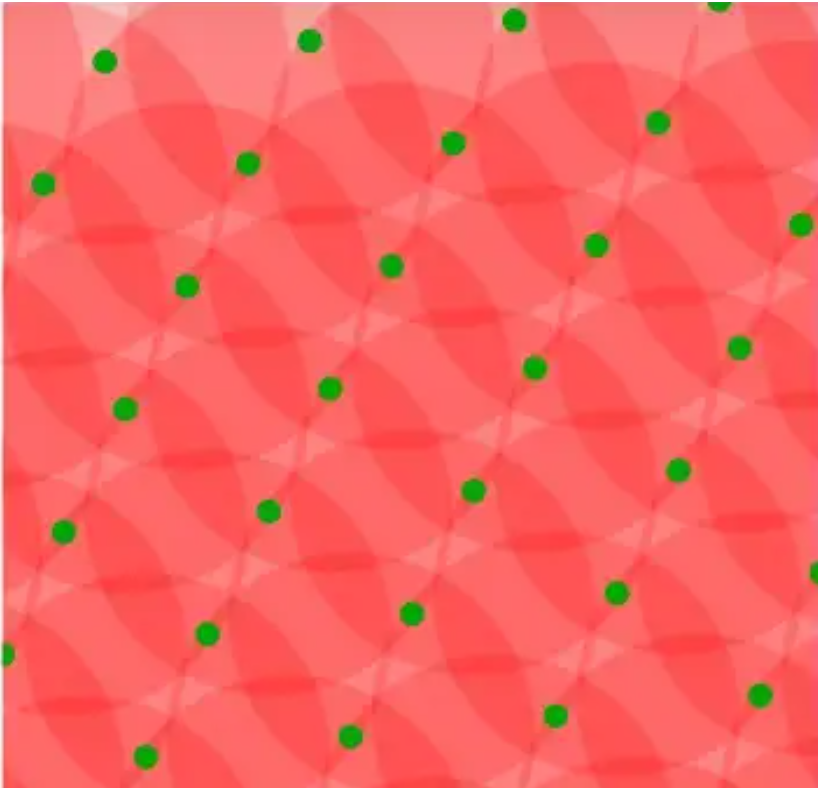
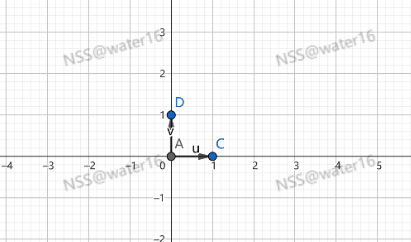
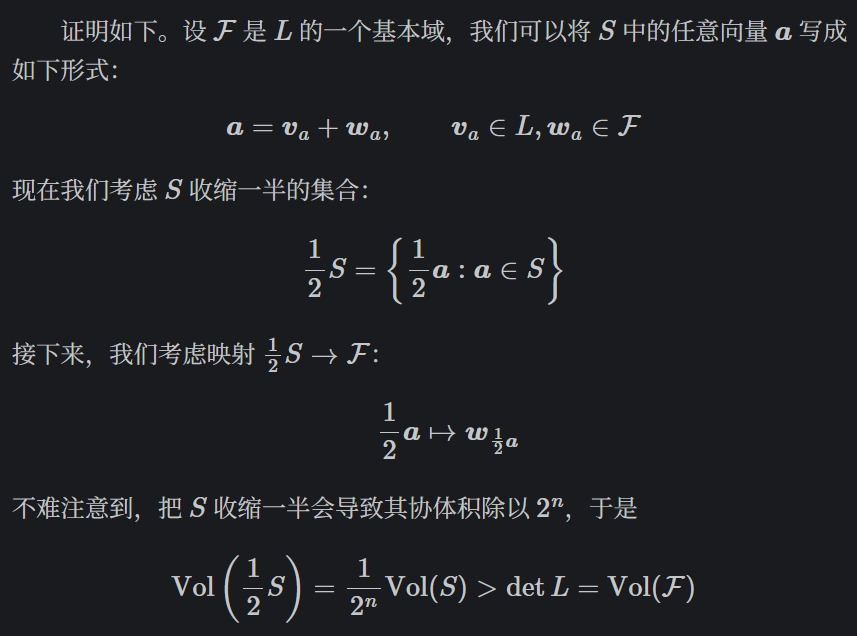
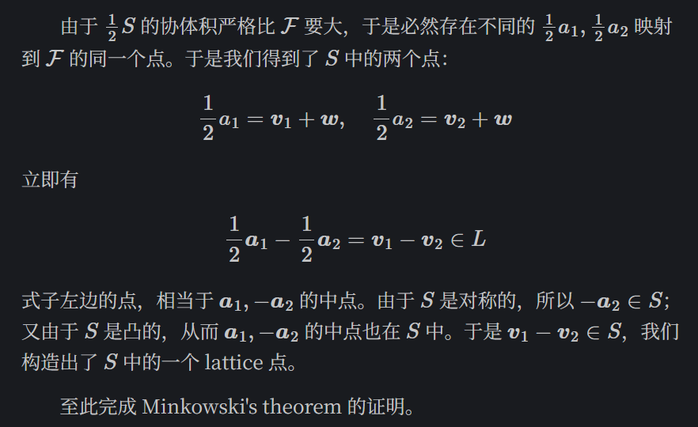
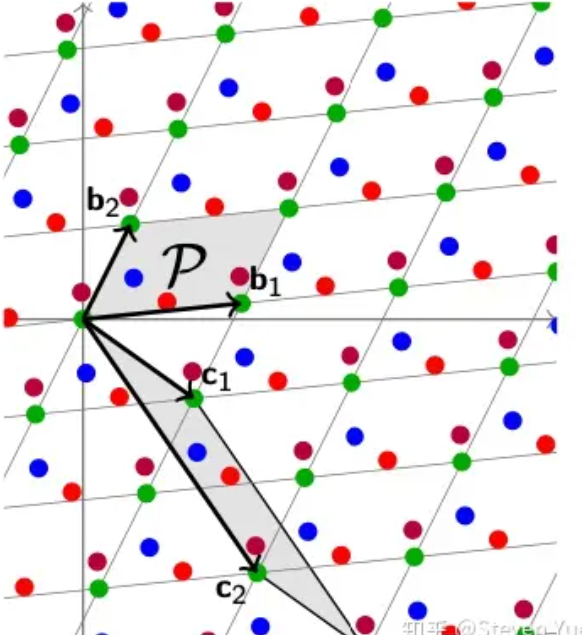

# 向量空间（向量的集合，运算的空间）：

1. $\vec{a} \in V,\vec{b} \in V$，则$\vec{a} + \vec{b} \in V$
2. $\vec{a} \in V,𝑘\in 𝑅$，则$k \vec{a} \in V$。

# 格的代数定义

1. 格是系数为整数的向量空间

2. 格的完整定义：*m*维欧式空间 $\R^m$ 的𝑛（m>=n）个线性无关向量$\vec{𝑣_𝑖}$的所有整系数的线性组合。
   $$
   𝐿(𝑉)={\sum_{i=1}^{n}𝑘_𝑖 \vec{𝑣_𝑖}:𝑘_𝑖∈𝑍,1≤𝑖≤𝑛}
   $$
   我们定义 $𝐿$ 的一个基(basis)是任何一个能生成$ 𝐿$ 的向量组。显然 lattice 的两个基会拥有相同的向量个数；基所包含的的向量个数称为 $𝐿 $的纬度(dimension).

3. 我们假设一个格拥有基向量$b_1,b_2,\cdots,b_n$。那么这个Lattice就是它的基向量的任意线性组合的集合，我们也可以把所有基向量组合成矩阵$B$来表示。

4. lattice $𝐿$ 的任意两个基，其基之间的变换矩阵中的元素均为整数，且行列式为 ±1。

5. 若 $𝐿⊂𝑅^𝑚 $是一个 𝑛 维的 lattice，那么它的一个基可以被写成 𝑛×𝑚 矩阵 𝐴。$𝐿 $的另一个基，可以通过 $𝐴$ 左乘一个 𝑛×𝑛 的基变换矩阵来得到，其中 $𝑈 $必须是整系数矩阵，且行列式为 ±1。满足这种条件的 $𝑈$，称为 $𝑍$ 上的一般线性群(general linear group)，记为 $GL_𝑛(𝑍).$ 它是满足“逆矩阵也为整系数矩阵”的整系数矩阵的群。

6. 整格(integral lattice)：一个 integral(or integer) lattice，是指所包含的向量都拥有整数坐标的 lattice. 或者说，一个 integral lattice，是 $𝑍^𝑚$ 加法群的一个子群。

# 格的几何定义

1. 加法子群(additive subgroup)：我们考虑$ 𝑅^𝑚$ 的一个子集 $𝐿$，它是加法子群当且仅当其在加法、减法运算上封闭。
2. 离散加法子群(discrete additive subgroup)：称一个加法子群$ 𝐿$ 为离散加法子群，当且仅当存在一个正的常数 $𝜖>0$，使得$∀𝑣∈𝐿,𝐿∩\{𝑤∈𝑅^𝑚:‖𝑣−𝑤‖<𝜖\}=\{𝑣\}$。这个式子的几何意义是：对于 𝐿 中的每一个点 𝑣，其附近 𝜖 的（欧几里得）距离范围内，不存在 𝐿 的其他点。也就是说 𝐿 是离散的，每两个点之间的距离都不小于某个（足够小的）𝜖.
3. 格(lattice) ：一个$ 𝑅^𝑚$ 的子集是 lattice，当且仅当它是离散加法子群。

## 基本域

> 基本域(fundamental domain, fundamental parallelepiped)：设 $ \mathcal{L} $是一个 𝑛 维 lattice，$𝑣_1,…,𝑣_𝑛$ 是一个基。则 $ \mathcal{L}$ 对应这一组基的基本域是$𝐹(𝑣_1,…,𝑣_𝑛)=\{𝑡_1𝑣_1+𝑡_2𝑣_2+⋯+𝑡_𝑛𝑣_𝑛:0≤𝑡_𝑖≤1\}$。几何上，基本域就是这组基围出的区域

1. 设$ 𝐿⊂𝑅^𝑛$ 是一个 𝑛 维 lattice，𝐹 是 𝐿 的一个基本域。那么对于**所有** $𝑤∈𝑅^𝑛$，它都可以写成如下形式：$𝑤=𝑡+𝑣 $ for a unique $𝑡∈𝐹$ and a unique $𝑣∈𝐿$。需要注意到这里的 𝑡,𝑣 都是**唯一**的。
2. translated fundamental domains：$𝐹+𝑣=\{𝑡+𝑣:𝑡∈𝐹\}$，在 $𝑣$取遍 $𝐿$ 中的每一个点时，恰好覆盖了**整个 $𝑅^𝑛$**                                                                                       

## 行列式或斜体积(determinant)

> **行列式(determinant)** 设 $L$ 是一个 𝑛 维 lattice，$𝐹$ 是其基本域。那么 $𝐹$ 的 𝑛 维度量（面积，体积，etc.）称为 $𝐿$ 的行列式(determinant，翻译成行列式显然是不恰当的，但由于英文里面的行列式也是 determinant，这个地方没法翻译成别的东西)，或称 𝐿 的**协体积**(covolume，这个地方也是不太恰当的，因为 $𝐿 $本身显然并没有协体积。实际上这是 $𝑅^𝑛$ 商掉 $𝐿$ 得到的集合，即一个基本域的协体积）。记为$ det(𝐿)$.
>
> 我们知道，**在一个线性空间里面，一个空间的Determinant（行列式）代表了这个空间所有的基向量所组成的几何体的体积**。在二维空间里，两个基向量组成的平行四边形的面积就是这个空间的Determinant。

1. **注意：无论我们怎么更换基向量，Determinant的大小，即基向量组成的多面体的体积是相同的。给定任意的一组基向量，我们都可以有效的找到这个Lattice空间的Determinant。**

2. (Hadamard 不等式) 设 $𝐿$ 是一个 lattice，取其任意一个基 $𝑣_1,…,𝑣_𝑛$，设 $𝐹$ 是 $𝐿$ 的一个基本域。那么有$det(𝐿)=Vol(𝐹)≤‖𝑣_1‖‖𝑣_2‖⋯‖𝑣_𝑛‖$，其中，basis 的各个向量越像正交的，则协体积越接近上限。当 basis 各个向量恰好正交时，上面的 Hadamard 不等式取到等号。

3. 斜体积在$𝐿⊂𝑅^𝑛 $的维度恰等于 𝑛 时（即lattice 的维度与空间的维度恰好相等，$n*n$）的计算方法（因为只有方阵才有行列式）。设 $𝐿⊂𝑅^𝑛 $是一个 𝑛 维 lattice，设 $𝑣_1,…,𝑣_𝑛$ 是基，𝐹 是对应的基本域。接下来我们写出各个基向量的坐标：$𝑣𝑖=(𝑟_{𝑖1},𝑟_{𝑖2},…,𝑟_{𝑖𝑛})$把这些坐标写进矩阵里面：$𝐹=𝐹(𝑣1,…,𝑣𝑛)=\begin{bmatrix}𝑟_{11}&𝑟_{12}&⋯&𝑟_{1𝑛}\\𝑟_{21}&𝑟_{22}&⋯&𝑟_{2𝑛}\\⋮&⋮&⋱&⋮\\𝑟_{𝑛1}&𝑟_{𝑛2}&⋯&𝑟_{𝑛𝑛}\end{bmatrix}$则可以如下计算 $𝐹$ 的协体积：$Vol(𝐹(𝑣_1,…,𝑣_𝑛))=|det𝐹|$。即当满足lattice 的维度与空间的维度恰好相等时，$L$的斜体积是$L$的基向量构成的矩阵的行列式的绝对值。

4. 


## 格的密度

1.  如果在这个空间中任意的画一个球体（多维空间即超球体），然后可以数数看这个球体中覆盖了多少Lattice里的点。点的数量平均于球体的体积，就是这个格的密度了。
   $$
   \text{for all sufficiently large as } S \subseteq R^n:\\
   |S \cap L| \approx vol(S)/det( L)
   $$
   球体中有多少个Lattice的点，其实大概和球体的体积中有多少个$det(L)$的多面体，这两个比例大致相同。

## 最短距离

1. 我们一般用$𝜆_1$来定义整个格中点与点之间最短的距离。一般为了方便理解，我们就把其中的一个点设置成坐标轴0点，然后$𝜆_1$就变成了距离0点距离最近的格点。同理可得，我们也可以定义距离第二近的点距离$λ_2$，第三近的$λ_3$，一直到第$n$近的$λ_n$。
2.  $λ_n(L) $的定义的第一种写法：对于格 $L⊂R^m$（假设是 *m* 维的），其第 *n* 个连续最小长度 $λ_n(L) $是：有一个最小的实数 *r*，使得在格 $L$ 中存在 *n* 个线性独立的向量 $v_1,v_2,…,v_n$，满足对于所有 *i*=1,2,…,*n*，都有 $∥v_i∥≤r$。这里$ ∥v_i∥$ 表示向量 $v_i$ 的欧几里得长度（或其他合适的范数，但在大多数情况下是欧几里得长度）。重要的是要注意以下几点：
   1. **线性独立性**：这些向量 $v_1,v_2,…,v_n$必须是线性独立的。这意味着不存在不全为零的标量 $a_1,a_2,…,a_n $使得 $a_1v_1+a_2v_2+⋯+a_nv_n=0$，即只有系数全为0时等式右边才会等于0。
   2. **最小性**：**$λ_n(L)$ 是满足上述条件的最小的 *r***。换句话说，不存在更小的 *r*′ 和 *n* 个线性独立的向量 $v_1′,v_2′,…,v_n′$ 使得对于所有 *i*，都有 $∥v_i′∥≤r′$。
   3. **顺序性**：$λ_1(L)≤λ_2(L)≤⋯≤λ_n(L)≤⋯$。这是因为随着 *n* 的增加，我们是在寻找更大的向量集合（仍然保持线性独立），因此所需的最小长度 *r* 也会增加或保持不变。
   4. **几何意义**：这些连续最小长度与格在欧几里得空间中的“形状”和“大小”有关。它们提供了关于格在不同方向上的“稀疏性”或“密度”的信息。
3.  $λ_n(L) $的定义的第二种写法：在格 𝐿 中第 𝑖 连续极小值 (𝑖=1,…,𝑛) 为 $𝜆_𝑖=min\{𝑟:dim span(𝐵(𝑟)∩𝐿)≥𝑖\} $。在定义中， $𝐵(𝑟) $表示半径为 𝑟 的超球体（Ball），该超球体与格 $𝐿$ 交集产生的向量张成（span）的空间的维度（dim）为 $𝑖$ 。换而言之，**第 $𝑖 $连续极小值即包含至少 𝑖 个线性无关格向量的最小球的半径。**
   1. 把球的中心放在原点，若球中有非零格向量，那么球中不止一个格向量。以图1为例，红色区域包含了一个非零格向量以及它的逆向量，但这二者在同一条直线上，仅张成一维空间，该超球体的半径是 $𝜆_1$ 。以图2为例，一个更大的超球体包含了4个非零格向量，可以张成二维空间，该超球体的半径是 $𝜆_2$ 。

4. 一个特殊的例子就是笛卡尔坐标系下的整数格$𝑍_𝑛$，因为所有的基向量全部都长度相等，并且相互垂直，所以$𝜆_1=𝜆_2=⋯=𝜆_𝑛=1$。

## 距离函数（Distance Function）与覆盖半径（Covering Radius）

1. 给定任意一个点$𝑡$（这个点不需要在Lattice上），我们可以定义距离函数$𝜇(𝑡,𝐿)$为这个点到附近的Lattice点的最短距离。
2. 同理可得，我们也可以左右移动$𝑡$的位置，然后就可以找到在这个Lattice中可以得到的最大的$𝜇$（即$t$与周围最近的格点的最短距离$\mu$的集合中最长的最短距离）。我们一般称这个最大值叫覆盖半径$\mu(L)$（Covering Radius）。$\mu(L) = \max_{\mathbf{t} \in \text{span}(L)} \mu(\mathbf{t}, L)$
3. 为什么称这个最远距离为覆盖半径呢，其实很简单。我们可以假设在这个Lattice中，以每个格点为圆心画很多个圆。如果逐渐把圆的半径扩大的话， 那么所有的圆就会逐渐开始覆盖整个$𝑅_𝑛$空间。直到所有的圆正好完美的覆盖了所有的空间的时候，这个时候的半径，就是我们之前得到的$𝜇$了。这就是覆盖半径这一名字的由来。

## Lattice的Smoothing

1. 如果我们把上面的覆盖圆的概念稍微转换一下，假设我们不是在每个格点上叠加一个圆形，而是叠加一个圆形范围内取值的随机噪音，那么当圆的半径达到覆盖半径之后，这个Lattice本身就和背后的连续空间$𝑅^𝑛$合二为一了。
2. 但是如果就只是在覆盖半径上的话，就会发现，噪音覆盖的分布非常的不平均（有的地方重叠面积多、重叠次数多，有的地方少），因为格点之间相互的位置的问题。这也就是说，叠加了噪音之后，最后得到在$𝑅^𝑛$上的取值分布也不平均。                                                                                                                                                                                                                                                                                                      
3. 如果想让取值分布更加平均的话，我们就需要更多的Smooth（平滑化）这个Lattice，即继续扩大圆的半径。理论上当半径接近于无限大的时候，我们得到的分布是最完美、最平均的。但是当圆无限大了之后，这个构造就没有太多实际操作的意义了。
4. 所以一般来说，我们都会给这个Smoothing的半径一个最大上限。这个最大上限是由这个Lattice中距离最大的最短向量$𝜆_𝑛$来决定的。因为当我们的半径大于了这个最短向量之后，那么这个圆就会覆盖太多的点（因为最短距离决定了点到点之间的距离），然后这个构造就失去了意义。$||𝑟||≤𝑙𝑜𝑔(𝑛)⋅\sqrt𝑛𝜆_𝑛$
5. 对于Lattice的Smoothing一直是一个比较火的研究领域。现在最常见的方法是在这个覆盖圆中叠加高斯分布的噪音𝑟（Gaussian Noise）。$|𝑟_𝑖|≈𝜂_𝜖≤𝑙𝑜𝑔(𝑛)𝜆_𝑛$等式中的$𝜂_𝜖$即这个Lattice的Smoothing参数。

# SVP问题

1. SVP问题是求格的最短向量问题：在格$L$中找到最短非零向量$\vec{v}$，满足$\vec{v} \in L$且$||\vec{v}||$最小

2. 问题的定义是这样的：给定一个基为$𝐵$的Lattice $𝐿(𝐵)$，找到一个这个基构成的格点$𝐵𝑥:𝑥$，使得这个点距离0坐标点的距离最近。
   $$
   𝐵𝑥:𝑥∈𝑍^𝑘\\
   ||𝐵𝑥||≤𝜆_1
   $$
   观察发现，因为$𝜆_1$已经是这个**格中点和点之间的最短距离**了，所以$𝐵𝑥$距离0点的距离其实也不会小于$𝜆_1$，最多是等于罢了。

3. SVP问题的变种

   1. SBP问题：找到最短的基向量 $𝑣_1,…,𝑣_𝑛$，使得它们（在指定的长度定义下）最短。例如要求最小化$\max_{1≤𝑖≤𝑛}|𝑣𝑖|\ or \ ∑_{𝑖=1}^𝑛|𝑣𝑖|^2$。不同的长度定义会给出不同的 SBP，故 SBP 有大量的版本。
   2. 似最短向量问题（apprSVP或$𝑆𝑉𝑃_𝛾$）：设 $𝜓(𝑛)$ 是 𝑛 的函数。对于维度为 𝑛 的 lattice $𝐿$，找到一个非零向量，其长度不能超过 $𝜓(𝑛)$ 倍的（真正的）最短非零向量。也就是说，若我们记 $𝐿$ 的最短非零向量$𝑣_{shortest}$，则要寻找向量 $𝑣∈𝐿$ 满足$‖𝑣‖≤𝜓(𝑛)‖𝑣_{shortest}‖$。不同的 $𝜓(𝑛)$ 给出不同版本的 apprSVP。举个例子，我们可能会要求$‖𝑣‖≤3\sqrt𝑛‖𝑣_{shortest}‖$。显然，不同版本的 apprSVP 的难度差异可能很大。例如，解决 $𝜓(𝑛)=3\sqrt𝑛$ 的 apprSVP 远比解决 $𝜓(𝑛)=2^{𝑛/2} $的 apprSVP 困难。

# CVP问题

1. CVP问题是求格的最近向量问题：给定一个不在格$L$中的向量$\vec{w} \in R^{m}$，找到一个向量$\vec{v} \in L$，满足$||\vec{v} - \vec{w}||$最小

2. 问题的定义是这样的：给定连续空间中任意的一个点$𝑡$，找到距离这个点最近的格点$𝐵𝑥$。
   $$
   𝐵𝑥:𝑥∈𝑍^𝑘\\
   ||𝐵𝑥−𝑡||≤𝜇
   $$
   这里我们的约束距离$𝜇$就是这个Lattice的覆盖半径（即所有可能的$𝑡$中距离格点最长的距离）。

3. CVP的宽松版，即$𝐶𝑉𝑃_𝛾$。
   $$
   𝐵𝑥:𝑥∈𝑍^𝑘\\
   ||𝐵𝑥−𝑡||≤𝛾𝜇
   $$
   加上一个宽松的参数$𝛾$之后，CVP问题就会变得简单一些，解的数量也变多了。

4. 我们再次系统性的定义一下CVP问题。给定一个Lattice $𝐿$，与一个随机点$𝑡$还有搜索距离$𝑑$，并且假设$𝜇(𝑡,𝐿)≤𝑑$，CVP问题是让我们找到一个合理的格点$𝐵𝑥∈𝐿$并且这个点到𝑡的距离小于等于$𝑑$。

# BDD

1. BDD：BDD问题规定了$𝑑<𝜆_1(𝐿)/2$，也就是说$𝑑$小于最短向量的一半。并且这个CVP问题最多只有一个唯一的解（at most 1 solution），并且这个解一定是距离$𝑡$最近的格点（假如有两个及以上的解，那么任意两个解(格点)之间的距离小于$𝜆_1(𝐿)/2+𝜆_1(𝐿)/2 = 𝜆_1(𝐿)$，此时这两个解之间的距离比最短向量还短，自相矛盾，所以最多只有一个解）。当$d\leq𝜆_1(𝐿)/2$时，可以有两个解：即最短向量的两个端点，当$t$在最短向量中间时。

# ADD

1. ADD：ADD问题则不同，规定了$𝑑≥𝜇(𝐿)$，也就是说$𝑑$大于整个格的覆盖半径了。这个时候，这个CVP问题至少会有一个解（at least 1 solution），但是我们找到的解并不一定是距离$𝑡$最近的格点。

# SIVP问题（Shortest Independent Vectors Problem）

1. Lattice中第三大重要的问题，就是最短独立向量问题。问题定义：给定一个Lattice $𝐿(𝐵)$，找到$𝑛$个线性独立的向量$𝐵𝑥_1,…,𝐵𝑥_𝑛$并且这些向量的长度都要小于等于第 *n* 个连续最小长度$𝜆_𝑛$。
   $$
   \max_𝑖||𝐵𝑥_𝑖||≤𝜆_𝑛
   $$
   在𝑛=2的情况下，我们找两个小于等于$𝜆_2$的点(线性独立向量)。

2. SIVP问题的宽松版定义，即𝑆𝐼𝑉𝑃𝛾。在宽松版本中，我们只需要找到𝛾𝜆𝑛范围内的就可以了。

# 相关知识

1. 一个最简单的格：$B = \begin{bmatrix} 0 & 1 \\ 1 & 0 \end{bmatrix}$，第一列是向量$\vec{D}=(0,1)$，第二列是向量$\vec{C}=(1,0)$，$B=[\vec{D} \ \ \vec{C}]$ 。(0, 1)，(0,-1)都是这个格里的最短向量。

   1. $(0,1) = (1,0)B = (1*0 + 0*1,1*1+0*0) = 1*(0,1) + 0*(1,0)=1*\vec{D}+0*\vec{C}$，所以$(0,1)$是$\vec{D}$和$\vec{C}$构成，所以$(0,1)$是格里的向量且最短。
2. 当我们定义一个格$L$时，实际是定义了有多个向量组成的一个向量空间。例如：$L = \begin{bmatrix} \vec{v_1} \\ \vec{v_2} \end{bmatrix}$，则表示每一个个点都能由$a_1\vec{v_1}+a_2\vec{v_2}$构成，其中$a_1,a_2 \in Z$且$\vec{v_1}, \vec{v_2}$是格$L$的一组基。显然一个格可以有很多基，而在密码学中我们则是要找到一组特殊的基
3. 若点$(x_1,x_2,\dots,x_n) = (k_1,k_2,\dots,k_n)L=𝑘_1  \vec{𝑣_1} + 𝑘_2  \vec{𝑣_2} + \dots + 𝑘_n  \vec{𝑣_n},k_i \in Z$，所以点$(x_1,x_2,\dots,x_n)$是格$L$的一个点
4. 点积：$\vec{v_1} = (x_1,\dots,x_n),\vec{w}=(y_1,\dots,y_n)$，则$\vec{v}·\vec{w} = x_1y_1+\dots+x_ny_n$。记$ 𝜃 $为向量$v、w$之间的角，则：$v·w=\Vert v\Vert \Vert w \Vert cos 𝜃 $。点积又可以写成：$⟨v,w⟩$
5. (Cauchy-Schwarz 不等式) 两向量的点积的绝对值，不大于向量长度的积。$|v·w|\leq\Vert v\Vert \Vert w \Vert$
6. 正交基：对于一组基$\vec{v_1},\dots,\vec{v_n}$满足：$\vec{v_i}·\vec{v_j}=0,i \neq j$，则称其为一组正交基。
7. 格密码就是将密码中的普通问题归约成找到格的最短向量
8. 格密码可以分为两大类问题：SVP问题和CVP问题

9. 每个问题是有很多种格的构造方式，一个问题用其构造出CVP问题的格换种构造方式可能可以构造出SVP问题的格，所以很多时候是将CVP问题转化成SVP问题

# 背包密码

1. 参数：

   1. 私钥是一个超递增序列$\{a_{n}\}$，即$a_{i+1} \geq 2a_i,\forall 1\leq i \leq n-1$，满足：$a_i>\sum_{k=1}^{i-1}{a_k}$
   2. 模数m，满足$m > \sum_{i=1}^{n}a_i$
   3. 乘数w，满足$gcd(m,w)=1$
   4. 公钥$\{b_i\}$满足：$b_i \equiv wa_i \pmod m$

2. 加密：

   1. 设明文为$\{v_i\}$，$v_i \in \{0,1\}$（可以将明文转2进制）
   2. $c \equiv  \sum_{i=1}^{n}b_iv_i \pmod m$

3. 解密：

   1. $v  = w^{-1}c \equiv \sum_{i=1}^{n}{v_ia_i} \pmod m$
   2. 因为$v_i \in \{0,1\}$且$m > \sum_{i=1}^{n}a_i$，所以$\sum_{i=1}^{n}{v_ia_i} < m$，所以$v = \sum_{i=1}^{n}{v_ia_i}$没有信息损失，再因为$\{a_i\}$是超递增序列，所以可以由$\{a_i\}$确定$\{v_i\}$

4. 如果从格的方向考虑攻击：

   1. 构造格
      $$
      L = \begin{bmatrix} 
      1 & 0 & 0 & \cdots & 0 & b_1\\ 
      0 & 1 & 0 & \cdots & 0 & b_2\\
      0 & 0 & 1 & \cdots & 0 & b_3\\
      \vdots & \vdots & \vdots & \ddots & \vdots & \vdots & \\
      0 & 0 & 0 & \cdots & 1 & b_n\\
      0 & 0 & 0 & \cdots & 0 & -c\\
      \end{bmatrix}
      $$

   2. 由此可以发现$v = (v_1, v_2,\cdots,v_n,0)$是一个格点，因为：$(v_1, v_2,\cdots,v_n,1)L=(v_1, v_2,\cdots,v_n,0)$

   3. 同样$||v||=\sum v_2^2 < \sqrt n$，如果此时$v$向量是格中最短向量，那么就将这个问题转化成了求格的最短向量问题

5. 例题：

   1. 题目

   ```python
   from Crypto.Util.number import *
   import random
   from gmpy2 import *
   
   flag = bytes_to_long(b'******')
   flag = bin(flag)[2:]
   n = len(flag)
   
   a = [random.randint(1, 4**n)]
   s = a[0]
   for i in range(1, n):
       a.append(random.randint(s+1, 4**(n+i)))
       s += a[i]
   
   m = random.randint(a[-1] + 1, 2*a[-1])
   w = random.randint(1, m)
   
   assert gcd(w, m) == 1
   b = [w*i % m for i in a]
   
   c = 0
   for i in range(len(b)):
       c = (c + b[i]*int(flag[i]))
   with open('output', 'w+') as f:
       print(f'b = {b}', file=f)
       print(f'c = {c}', file=f)
       
   '''
   b = [57784269807215443965628798883058630337281610436657935003955182881603464298832993287501269971984090068477457668905205552943179327622380728870275517647540530116318630204884506415644343683558796552661014969412141024744375023261508439868391354967410324524046414305260687629082772689575034234321651172805616019040052858013275628990646030093196494927, 2563176208544510378092334837821863608977792842672059020492548194324693134405507891231503949720398732537491765544390951208066158897127289201366769624124043549594655164434337358589981598426216893419304656019373113134084026840467294504985771527072522718737384620066634722866175313857421822142366897049083140829457346256608506165064418962230587269, 365923663112911068905435751126445624548773691312328035046464572287796713097293161059307541033181545783741994278349541273082586829531167291500533074812082727161564723332178000975100618516286544655857094920548455732053744947979027728990797291625645076933633732328268500061879911355084500414030828965444566964211532041020633048696526685318194796876, 459793646341292359775279455637321385068059779059235091658710974960977957434451398034673357451415554481722909328705247529838333203552993355047941341147652382352130162700640263350559013748998953230284605202594930155633311368730533401306754053941446279515337728199878959328004378301906609234842206264358250773421319838541325898728691502437853082167, 314107843025436458186136647169493817871314948486916283244923046209347145309769632424013079355434065827681663019631689075090981106650325843682481909606671433287983797881932976349640328692546891713616387360705284750065766249877702398674366902932344990675699049167679196024866606536318925407965054530171671850544123532983384931655553387823522137532, 317793164249649700636545698974292616753324453311065240490863453357272771836562412639002972044012152491457128751003379866068511824660181980340577226349397317934661562312420660044759147358919478684354116406178836083906207688101720554515091747424358041753211704997451350781171956193789720842726624880907050506527543891738076983237389937384142081227, 51983547085905121129551688610680742640873963765187643609643259053228855770090137223271213737202175115886849859653259606322496342788843770678662437760642989877514688952507645871753020047890456282906252716496429416505810932875866434410038401537651363351585557295589093942517940411744513101661562676168977822462637054060531637674795472344300726974, 763451558749643609971658419351082423812498987643995141653105802232870043846714471660847714475412525037805341657455195782915734000813584824506122066758765060438293884023035387982891881663843667444038304082465261049421860279699627069340178910647793992496522945135592239854190299679887518584526927015393969252666990026477911342111960957644641898536, 350976556696516622082343437462060829793966799204508622307254401903443513228350901619299588102615160622811751743472400613554088802284272766024923028269063070238505943311493320873204930315597405260541430600371039669789665123030435590337699925544039585531565563764576652973120917024702923508535187911693737090335177943573807710136113569036537036276, 181996302618539535784262913686465823375976463082806711948652958941453708773747271680186565231293007800727516626992865085922104393280224425499084080407559465083838871141612971550984338922625098305683464959760076327576238991499661175871954170749308445691693843216721191512386476527079601654618535078123541741866697209266170737808390605899676634681, 680729949479140722440255238637537690758348018938024393698630837836599404324809406416100667188408722024831010245172738540729985020274833312059947809413502074583569444533363767884136573189642298134939666736494629093726388108036776204464453467171991079057152652349781656999351356485267150437617417212797555678979178095457332271854466380413040020705, 410636803416294316856966133032268770221221290632616430049378930864126966693017330983776494062749578049433890139801658762498722383473962234264149003269057009592990089356158990910350155708025449076041798369410289728576512451263444497753827058232168102762276053576033843783440788685259919126636921484842525691242780864342549871579983224419404513041, 764810332166189775540641321688497778203544291378543607486320150041365339364262080937942726344699441833945222856382550558120748157533923448105056626948089298541953075400578043210849008721344933245774459493345509789671456232101568373310183368378217400306479629708138159462803278917575423236902887937247954723711108982101954157739717889659030086471, 286269363591432208782527075722454962359946663700026716899275844505225349880977744812605274641603476309315172388198013323454519413921852903521206975735281418368461884230170325328791896536421353748841729156650040652633843005800712527531924440530068743271003163803889022542670286511027621268399756560929625077782882260259182421174997916645104208719, 595955052929514122859705696830288429317332380518459544428319425459995457542522946938758860074709098500844155710580163026348656510069970933375480285759846332156064206562501848617973998985442435690463096078264620610385436548134480920012006575147928061971382198710007266421203594140713773633533284737432117180267226116327395537927961428441676391140, 158533620359893585467711656904896269344888397521228513498428094612645993159959260362718995679926075962046165426492477199609416758804089821981544635805720018054337106828370891624560288929125249229917823741968972661052373672598840255666918162062086207794347231606744290319889473396324078552998151566926073488637190373941024777381274309179998443197, 280857909132999933895380832650739094400924717066624937694720936222362832184471214360024858458971352891204818228894374388250056346803607309019113223578778210451567762459027409067732705297529539289979333886454627721010075156924562018786328548139682058015336230846291471873728676240268526243772892865434284963124348891922572648709025906181348981296, 127975208615055462054940021491289897522502770036983058004207729849565641193816087321522036594503703843622217766105621170351453380982006938181429842083913642600242841355088019565441144489568194661995765379602631206250171852438870208395704359587266250542758394016664021236850780542129627128186880946433585811147147301361043555337897913966253140253, 659311698488057071633082480499314565821103880396408477136213182548902108752491589901415042730811203148341041839755961858815287708037223599965525196348561364276893973554457320649877497476583774331016878951870749243793914428046170601521827702666046946207374207254828563222938087091632071339306868531584965688422619365868052195966677673333406580457, 117004928933322602165729064750967124283103806999199518249632743294853395605420817648928931647051895619733581140706294773235083019982114846594522994253722718892489333106206139976931087032288683194396145403386215770666447613813094283654310915052597214837320525190517555986656406626051316671911039365095354408769911982463682487892372426222197521752, 505395812096608402139924292799502890643267693139141029246997977831798374748921965289062529232894024086703340572396135754566593535367052090187303057122630106306512253566960239076323669311496886553122746268503468247123665843527959891742127440450725642732162780704932741105845710028924089031127760782847177004891798196027293815671866606340744350235, 499372356919260617346208298025732726324102620248956563257707058904700067464775619757808724933508666539095726310593284137555902525516700187298835432614264023688333834639054990419078113265399830785518863681873540853871435561722164365571032926154557559589867997844249585448759371022124378736125315646903528260128610323703505232156832616884565239133, 507034220958158661501035770995208460472407609006213418985832682250534939110625471209364925655291562962013086576890262839511889096778432400695627334756929039034458132234241624113905004102376460819001287283207838946071446379971639164241938891827309940826492433088510690756064900935001486947083418985944920018563756666157250703229261193604812594780, 70976738112048117790337904055639374523604836513256165099034229804740747266988113910131930554016220141543791469218295216321513066787362478605656463262276645868373286224766306076107666770608085133265986569757116997379833436759790144605871424206090481860608991918687992180201749750182118301561114482286353662661648173946270947327584627358310521383, 647480980130481321990432859685636470940564673147425736033702250227141158858570492989348513409975598775579079999889597017063077245913738601893233403077222262669585383586945325544038984530128263864360059474223887424191999708500675426723391835496773105816679408003974799739969531014437664198864765270774418460134281069709772110440787346420168161289, 757593569889675440084955970758278521137839238105406417198238835290724749074775116901371485434682795149636465523471841786332533562572831342620983070478597846281545505360233711891028858575742018577166736257117444046294383835741380606906219922367132012391640639642719742363062455673053008216516147841410378477226696927646737532469926848871964061827, 1002640660920309649261800646925923495791976550903108902201162582323479259763482446695778560808423641057082203448416409716388979719303150594502368972638727189296264384817347162786022476598777319300165232263752921222500035703740387268662303910076973072451817611554929036771126729408554657015235249513825150517579132128712085841938348250621095904699, 887738414413437011000324833350931560729581101017379931826632840843046600051419441502036253434502048723165447197813066163171782345756174941919479950435656686249774344284788389107566387201951425004983776596553645168468573654752039411781301802033675724028277365776721168882952189567349663534408550214890020848576650848264669094755697344743171787436, 1040731790175532990264397913660830316379489578399202247836458703639316208979090956377776784823254853159291256019091945639363518502999049601872432909232177034528864349982142365609774264981115060339543086557363264345487071653818566027583366963594034340931506375497653901803436556831865825051477879628053449233162271183098424359786799044142511652183, 919610699127039517836347737160312445954439478595332457405337275711829201594625917320287085600897974373662053348968595818804119140941442046374850443278944157231088785281987934560085737752271371306811963198431716145128687594100092329980447407220519497532541920903535950472922858672284928496716686383128560674058473348403378688371857290339119509924, 159810839893430952442557557870033077620867094291785373556575031085122489550930139454245180602874455578063274288676577717415679733249412533919020725858105702110814071870789289740316755291347646243963347181888821395164139132774182757098386506464942965545645795386730978885129773924250804958540564433441981735578299668692441941361168323304598037793, 992171655568805289572438885756963107395508622633467665601037789890183904878346384207183597759789142466012678756892461604023822856316560356527638670069911257115299241056991571282300668424366288096560001046384089836679574007795232462639396364669912210600172034452428809850886040011381641660791770887021277192545322798934448146833336026429544391826, 242361428111357329070259448743477096202893274305331423932546918801709131556964658752161110881752971882895983499139662318213428930102987169820770803768264774682453371484977722180453781435068010759558334860187408776944080234322355592120466897299299477202425043462012162041024376540832938865319033338455915518725057359578454961450899616125180274765, 1007526339235213497549599551020867277827859434588578552654968738826681729387321761783147852958060348232265007869129120462118659207051705176240417827147023490235795490778059996486145743626613984221601708542016338862719198471141398446581219127275880308215086370950964591109164024845118311021544454221182350383345561530857955936804620848025185717238, 602750777774327229166451117060722933094578444359943344236656670218654399516697304179113353164423228739976814357565572266453638363697267204136364637308676594070478647585819143805623537968867795105139961502775384522806976696812582184609678654373405467509728018857672908789941034530989434336809970715066125374499956662417098172238251960806422710510, 5928785758300170919556568334223630550877053429890925999871037795840005348075385159879849584296600625513762662604464983403886478900811712227484458499168237244844273723310405847845618706951316877095558817278060591586928917298631193065780733713212031979094690377182723535441539431420935493639439603871041535682786168190019075964702584658669907522, 789769982461054740309636104497654664319271515961507189697745470953461566932205211683523300249139984945631337736489939268773852558828369743473496450346156332005527364732813609578829505028881791040058787371433878561587660722667491831869366652425085585776389172760253206851082450679107063968050807945728515255396503598484249955378634860272602863360, 155637778327009685781665992506726751644303768984383492562189348039942231355700644673066278363901835722438618428989252889299700901953248124996243488586828371103564799126390706295343104104674430979803042103205316281821791180034976588919339081033518030170739843996107861560169900537782530425967840895661676915193898994368972606704292100118884917788, 783333827411783623412012941928643602857727206831438049394289375237466009479670127673961157601420871441410137729777212402614170204812172232643506971251235285479495601319550889525424210708960475520293820745289696334507179813501817567275288798020137528167532562430886121427369411056055076227564973962355035292061549173579417812980811320091585674874, 625138718913892409856513979937987176110891416789730586851216203448204870746069105752673459160058674313739453978616904043631327567411949554123339263659049331045735196978092914325299456255652608914168007839776513418400561224474931126912473230648644500466068279860696086824375994588042472690337692386173765134302042901178649593316369661974432941965, 552226681314434656136726703155848264975046045853116520176683122440065893746639721282140441045293409945320903952298947406449430213224034599361102365978525124529392707124258167878864931410227309123713782758616975905702716850598082975925368931639961484823502363710409757067974052319281279560998749264595926984979408899199630976750575858756467040097, 912878245252909088643813434282091463681958590511614984990435132505235042708433280855048368094945831002872248586644668591352123804365854483299986726125740361546136161097768846310216851500711110558715077854332537904286449215755786694120903498880862226151947962365475614988956599340516283053455618313034020302205632246246766108283023423018421985027, 428345097677540805344832444207956238856526879551136514012582476690051661793818103113728799539006729090380207036477150372086917454581522424564218690159485942533793469698501336543140100617157016066743698778847512745674984779756485791225161505084678275259859587719470325192812124463062952425096258735266012825168720075669733235030877248311423001271, 454699297453167560122725142845557591850586895936197145707426811003597997295303931072749072219635523255335080638316615828069580481389320053135204043685008367838423512278011830491613888536439891211712075990040731210158512104254692005134881025217508266118906077532529692672176278588238182029763443687906511513966299353512073364789478844750435702766, 487873520532052090261225849845143085500511138374071008374737989303910408784840779703111733406249405766740588112615854988427951762756104793832899572639207271007882756319932821827652710959594959819834032819805294967111137832618164730634776796788707799040830916986001307415435089983971287740003804095605678919279118311672160942729065432078786140357, 469519171634110975029520501799123403806043304291139961247958675154266596122420798030039506233336112733594392935915743024491326493640144001863732885870347758014100991197489668719752723729197576281907281219071634730211309926545759596410794118669650160849401222979324053835480997575525649784165052476465625239542117089144018661920447952357930762926, 637726053974902374879251052355656146719827422683826964971485012265347027769103652559957737118205809628597558971956369132847807634933080602337651843826838104880181860045865589962784687480403456142964370330521098966874981644706167813701664106391420448358118584896151864643883633204156653131140945353249424213626000458540301178968878959207357400355, 568005396207989194443781231413091224641791438379154156566481499964960904038352843354985570296599022291671946197361333126323392194762745708568030556266844195173872429574022291863110555839613916509561340375009778674871715486926493179876866200952787359866544155172598736671226923856734908035107949887875349358162799019983126849892492541757838495640, 501950919290364978075017328280136026085932148228667261012307274523382965244015296238099459717890843928986279122888349925952473524438709359190613556332939264296946221318954631610773201504167522718586849214589006311553569705076479153977983532438088598932581726611299402338904175705870341875675863139074751892365052209709430459238278116748478067079, 433849803326177959941020466429440435344563326041961369374652069700684563664880161342037645403377719385937103085199576336262158496561565487576911998755665101276404741734380744653260129252290930834260537980575431052315603673876886853378185426695077820027612932291415783995462810582300456006957740869223562200734514842772649384481905142904994477262, 840547821901995966207251803289373078672798033121896963881809376197214802629717424739417238023982321829777587673110933608930452849565241744815130753795023748424764385596684123066524691187109603712788133004892545854038760859571743760991561744951374651176496028493444740185406566193224379059687921116401434220344315743377272807114572906561728125757, 496836810534062996457250740418340046105678388951117123641756016287170623376395234216123677609234168781514456868299442258609926550520658999437002285208434030223108683126825915632693499287995674222891108705672141304784028700690577712033575853610940292345469116651365048654468196791949911808750565317472127777879264715262895889729680563932883101244, 623016263207106929499088177961589536046396020592983858691203473144505955853314110764569299162406385103005920275981504245673647326594122525608397984103124520240125966147413967682287099710539745133139587732781571020081866765517803693862738945988472643503731007826355848620433986129577716866345672208299554532707060695167141863484775996247411142697, 352976465874307280102007565592114928319874213942043562739435244488675547233571495712063062312120381001763982229701566052657894976725744297040648449659425229753271016958728694978639702018503679573930804129190926500082614868140901935834062713964688040072783941443199959674551454800568334390159172390357868999297534382197525158383116973683309095041, 983333877710091006968178775255245354157533640832440993545244253141429711072353191262149420868291973134207254494909810134089737338268302038817945002189160789589264311571634828199632496198290185258000698281217399369953490231220949970369431088833426589399760636045981780037996193514746952975787031929679726189596811880228961289236419965702561918344, 960966781771623171210788012344075619307594695735017498863469193240445044262216816258788150159450533711446338547735529735824567278137797738102974127010357050168696339463208468683706058053370508983722685657099791743217233305177619185229236524478712532299393102369290580286128457054168419700387567855175472665053329684641284286683557815424980942255, 974912426664830697656352811816522767974778480223379561074454567218772609685605168004403056045109414725131523970983894338776382531868926485528934023494558085408685258120544996661480354043142023816333203106310628733781310699120536796348911856706173376934961133506818113354361067474087728214302005495812097370663741353835011671573147031639410442814, 823863410050050353262458938969037177947165023009984994657824133056522370776609002447124874566351074158343151511408226979912244766056490177713158452966385705518820444183412824867554153189461044135969546118409778386923405181701283092195255431184168745663236739542679760063720959342911080591573937528455247187582958218313793453644600558938302707413, 866183630536328066687224142849505182010537712876452064736939064692329158406046688690481612714998754929576269139143500689418272573772434809727719831422981776094896127102911616545423110163722798069460973928749654945502824777216598548603490793942778500078745596421151833936591105538260193296694355259146024885411059323379824300469724029886691108313, 160579367853775328371572622575998911533143382629218403593471991168916449674075769346748189279768047771442937928587147600634392932166707596081481020541027135915473256246425523313859496442166615695579751326977647647669091577349838544944473926185656692973211957748346544533626226823268187575463567284643453413352634044087399256276131192006487275680, 964703228141340203144694908033069732202402410758265944731902089877956673434786913226758821071058027976089498873369541761805638937199831413807194319725662384316810911484761372383819612286451738228563438757542552484942731404489792212391682373881653739169087164767618798793114920107951858439167467350470473462178430366850163808193327318723425703251, 948308909012773980476660587777178450875619232504430983080161609931382858376459971892033045582716096425098106179938143678299102304552969900493662463049627856538251059208214173200694286776906982674861361525699491396259066268731068514334725409047740999976474809912631519544331079143948653018695811335507203890593904889149366354752307737991604488619, 353360193442382908790023467201735894657921596198466726277369258069838182610085295045552553810672760011567280601010105733821250271328885940038669693123051860638920161516028195777989634519044758060944726202179623880491657343206895999234491757511255904574198125880014052686526681672428219312268863320614656276285424325816719888301610699157511614025, 284391970048340692860685066084740189809682651800997316675731204818941301072187195230847141781721771310989404650091831875661448059700158323308054607068390019472741300295649566542086685141027679395737359198849296245292750449284499326263735811221243999221789237516335617696845116931064995233564653956286371303836050733655060318278731976857549665688, 656058658578607380745470016535422882412058752907063161099900782334716111118722751686607557398545844538569660537655196626333719081456080362993439543648791741110617080541218422381314799139249851417776559882777010075089132282308798130407257332320596576847830672767140253683265018506168713487858391967141154478488575166772399197843073944116775508071, 727338291871094903866788707091168382889947450622998177698327631340175459562925338170989440177800103900019931466736886081463959863187644814646942943340684449637491130082776916039420122153795565302528797918547783572214714158518738028136212747460759731922505672218203117265108590355385841234336360505407324540268271459731212837032133929678965751363, 445946806138145240835972191794503881489934806478643201091390013496714941193993789252661778685706741725857483357764512223315935177047748112080240843015158747855345006377732370976128802390232769894677914491848532100172025470372698099993025192710832706347006513262357049354471824407665539806829273366542455623834267725668485932394174312678241655557, 811836134688249615689780988497808208140635755064144844019273212857764220963618818884544715461051007126266154218284245097475078177396507020193959889317676286510346170703714356631818306918545578873358675639649348510227490823473985794794227737406525251194422544007149499862552955956623231324051821985025767861853684523091109309437843425504777983484, 844226769719029269220827279030502809459858563560045806169452674445160711514838317970906616795785041850247302369138020319645118174912022541477326290081173149333578707521871760092530473114793028721669816137860371559336378010522608423811064619189881082185114812086611112817453385684992387756913359593447669318724501245389482551061183266598054271740, 609050344268165642756726999174383490128367925011707666937402141139259786402634774298875276371624549422204870483608382316717509294596370766711834974816768431499459785771872092118798050955022867019454944407520240420337878365435947101373927170880739398581635467108924800053610022676970280951409256884186233606235282083621551700178390543921928288137, 240401465145072859974557257593309116098870673179032234428504375275446448408624302045398744093699075863141477039308990590538386032356245217672224937888600563815111028742944735041624095828874323662702817905086949723286139695226991987052799812413596918824289989586749381901356392305480630062114546289503281465973188754767250787500948900357683175182, 662245589861439571461786910910000325416518687068253779830204042625881482644947654048816136410160384739344266733964544514496598571633191034649681971955771958968770316254930910596279598999736685727899025604411982254298063264546088656073864098958785544649916281507979727025051209590935722361572255188328733624271600213938083799957918663352080341894, 801572200379410083554066912019854433953989583523411931978790096105758560584561449188857404146570306804898562444611266607231856130030702074511977996179942833317283276772472817878644246148775465115285868120125182179986029661556089920607029499113972404401420572957444189737627995558857910950267690357137971977227962435190485331520918894193633778020, 538732706044478420338017687398764069261219567305844330650261422790850437935843487969172562286104770890398583678880633061609398174548937083648541611693756651830202532176945698862111569471017457730915924118170643487491680848447352391800683276138360927726619833397203956239876227414615734005403752038063781962498691755054946487555073908109056399407, 936931037235280538829926523706958781188408957155196913309021735444413836806020503385549450539221572620764460072763892979926238506294864054263395491608998269497908978777207823055725209632960456954040205441069333197009276062777315533559618611349426186680807882455860189447667617184785946873258809943913697250488275236426924368108995445163115874784, 711425949504899842395899762757393496575071594258203201878433397105352917277875527900329170652406681295744749932721521805036014121762627894609413768949168048268153528852154943268216755537557966730771131348717201707004358591114700351250938101922371558047061309244734719913020297019245517207986642079968929790918799682972718040811698618678497048643, 173203023559182280559231376849835682604856224798985024614355034908446272105536417779267252400256700400049903273756277955516482231886425873035403852973692893000145138167166025341537993569097996321351302272886223138203004202499071072388133324840159958359914760423687002488970679329880660853466381532641684990944571945457897244506659365660444747472, 461046336757829461886967878928700643837032766160242323197958585507687316269708365176132718349592715080493013743095713613272488399342915136631528121861168042206723258971996994004994968199648138248528768412198880626297710060302958631342570565268848784874479918031057481374142183086809763330879715044847498705141741377797975965403822830518580712889, 329888475220870718979209809839023554883498029835251828704211294796528917785022696337514961194756514185052091921704713506976224683341644212314357261038601920163395244915026506288941420220460727177266408550027832796285778785815050676956381694120660013846239729387289932825811083363454466293023802149777372994921266838907954752300986140876039208088, 548601054600815525212953503195981925039711672367223375301073032257099913296642185910384029253282422870185953352429895635814907469231026489672871595818619146871123948239585976821855814153575640309099846041580782585538949505747387720931444763673171716337016068896163221685956517450541678827257704097295279516900496586427171626733846465386164955427, 984933341546377972996137212048278253789461701046692472690819316765857252183250197516204621874964912066354529157059503993255906776854824310339165830260773140370477289064909352036102162260950987309767602195952753416841964637417712041288677020125027698033741860112742598752586611528402241651198105507005640969918430902495309395651725314731899331622, 1031231915095540724357841472868494533478085651090287236792818815462402543293000627699477865423672634774571849359837642185659010154925764643564203388449573183089723501045297976076747773018255720971845050923148535967006792251989923649506378377762027460934864940777608202440482749303411895447590777683576188854215575292696514169656747773439233259814, 200307952782424274608419627007518603337460512280952575332775825268697051431208539631959874989274637882582778789598415989107880447711646660038875992290409415225367776600598849531845434352954293027729508266192127452427443316683651504888827294930650708038209911092483802348734113430405575785882440523907867629400916627121537963012628405594051148482, 64743895758873089535324983388441991710850776567475642585795228532747654650489363463843012756559920304721039687181684204532366757789411127623542619480132781224681630146289688128051717826194926034937906538553416604515776290090083409630267066348131094584763056124113960094820245456821065913516782513782325994824083852873401553067740316624860041956, 778551061153910657696549319199243222876418543468572699548312050523090934784630316545271122316461535592063466179817869953154557062177529756771852660057667600683641548578483549971332350728055742535239038987367414318556746080671695237142833838997176300043984231036505503103918552846234035180066025609534541643897239533492533677085284067138147803088, 984811223554397289380937694603043849560494620131904584124284689853182499509558290506497526459160781527218820501344085179562600571593257025401849544248406738095389242569734497995462906522851165673597661332517596807882511939288659185636272757042691677358732735820920133147738964863172700905969675501063590052685944615945560802735327825136775192159, 937993968113882774660120361188287750898882791970454019630649521637293896068226145627764881126764426966302471999941501272778910774076991886788155228812305281391552236088673934525681779006102828210788619580382066025945794261284411218582466454564082516298150209518728517885689607900458871703543515726149043072726408480035541784875759968491014235524, 816499681705585335531458042285116801390042960622472088873578189434613608943870245502918943444558373403606911283030521923151440289588082191617615051813231254870374712735020150592836629441440884156384257489760901369963912808172336953396953890851751977087822438688237191358131065288177684000133331089956833577518567720757448140158585323869009561330, 1007609466656912854957566706506311606875064636843718612144879942985212300452576743722489239178126506372647417060866503961155651674453405426198248673596686326265039295768246846068434515957445188888423105153862211096266463680774962058669298579372857383415725154702942963139234240440648774076112245963563681113569230093919764235003432781900744411268, 443881653445608205569591970773736694348508307810445629661794285295181907329973362284521634883940321369709766903332496347536875019516312111062328353456425594591281028490251718549569800120763412708530731787132463285396084572688188615732020876019680577854308716727593476223747573759091728611082770170420380517211635030999537246492160247684258399771, 889656404011909921193115289661007059421121275787572033844392758846672048988934474644540220480374853777914689310683426549788364760677344411950259070032187977821231745233262990467588311242280321726591258014030282424031814988480047587133942060045674970190259017336401092928271473355178726233935834363029040801770445097878059549390754081224887946532, 936840403342833203692091449581346414570830070929203458538188087574662057818689652673913184166886774134859428030244692134295707293558889165503440120375063303141039283970995903265424520438705967887080973250399960828207124499848158355699298871653311599214995291077733233582214592016985359582358382939785350901948981891071491209148795354387001588072, 587394996617783006536798404741321475749158034822095786771195192237515983198076670903667105521969368456278869078984014403092327557659561913154174815687059839437512965212390731395767661134796924975688314656980249499109825776788601136189093869496779123568968269941554546011053083241779724239697942712354467234886387644264324406045707127455657223958, 527068778441859775082632595331948286013722921777944135221568936248570265278824531196872707663814830599595212556554544861041600054329724688794901130672017454685258089111055768856654520967132000517971404484238925387114530432102857563619812524346968762066279608351516975559791238453224872440701474429896198831308414155054871705467130097402617147641, 902003495899072081970833284751005169497083086807549567881419855644629651368046304888075992291137251915249695405286549574261860424364866294776874642304230357670933896634033857660090094640913116978549161095948566626291257081067340098042734687704959827182400827176052791730308563033608650727132921503406874521991811247239177860265540332808705465961, 739395572309210562862362221365526139322919782937144544988284002642665357120222138195671722318353763996254659086734008193731624560136486317910839823532054755313535189876357597607718971348847983974766604043254532933786959887539099242500977791972924488554486490322161508950974708675886351141377918581134777479294273728062167833221304724904090456860, 425427232995445244299244250814481061409096291501845910812875384518226623027659637827429513993295361803615579377487509017628546109291212332782364120395008695037027067189497478706706853998292529913044109722977492118235944975264825761408711005343373697025295840283224904767821649098105014715593627454944731869583780626230286833548999264523946999373, 275113720012331911924789084605963614373143784861492130903419071166410267043616202260514464585036043080833261484919260497375221999691688443364809962498059487958556686474218859484047980968488314542659938134292395992833533313710085293563560509181041642321865789248513379196247242037250265691107087916927720189044199097620249147600606589784006653411, 510763991521993562710386590727299987376138241968400562274228533298811756075213707763475631947009170493363143880086901831184350677751533836911692322402710022294662113877349095458409893536870549182370954186549527237376701940736140368791847275301536277615024043309412473182122815944492702789969925425717749502599024528161410061469501350755623966552, 801750723128730472564702147368510477651649645614805198099896312065856229009066894963820521510254970852292665552125272633161329735223891077728343882900276988183851355424766969977297106894973875073811394879443372568761752551831562817958583611641438980067156205562436877830196763420351038578672733234000331226641389789670350876511142404916327826210, 483285794741637075259922996316727671806859649408889097109602879278521905423479628930956792032407695092624662654934359547754472736454198300344261910142056829034676768131091752702642005363370307161793704980374371511019883827821226300152295183802124255409020029561648776043058570486943311089233364800869823667000850439830154929610839484365137738588, 589068339963897415417305001889609018973955519399439530910955855983900139370970246284672819383520583193647876853494371393667138673723588382556830570368800072080301005459757856797399372465729431596533897317530896432468835508122519828818851018371786268027025386833246754508398324781313473991946072655575557825827094286811298380505905404399892650072, 451455116833651543250624417049249290411779227236470115901217885044582024392856425080266547175441299262881441457243980037657633039290832246291455856851169549255828996115158630906362806321195324438623817437699321097293065315739344715195760037377608416947292955980923655238226074730581270504347958903253776732697669882140483547631489514730004740188, 196844936235601420497450829571121064367804067667739354338832711042802804351358968885180707915136567646802381126393599581692039402945668282246962941718204113433398698247082016271469096256922469242738404011628117806314276410612968104163036280756586529652168454655052860952172022358152375771546914194895967316636247074923577638941854532313291457258, 622927241898246473114459402532957988035202118195923535425271402494224903334281179097373476675618529070644007154721721642889002731597184472681361798467710099538975594733358201144660825985878626729392717121617923444902669958267616805016909022151754491480949393011861237225656747726646061444780475346544190883134846930005840066246411122959003574882, 706860506601470488974301853418500309089019551538106008383102390680072089380731409206799091549706740435419369436578744295006811259073719699944349874394943609640415227972091609535897620113176964456819658030251531694237154098963988452579488327076151290149148534212589017034225984421127254931701014565091010759748062995587849642099157351215889999478, 924686676940131944217077585967122075390164559932581132620809724519376887011003552707214517764473686431138300758264971398483500017739470311600898397887875145115122847956926842487427861530076131600510768044989433558371394855277620498811499400064619397531044549289332017625681693849031254932502987616871652605315787798130172931124061114932510220713, 144671336855578425737554992761756632902672549289186963767826506014602125356677955220317688907748272318639927428795295293638506876840353233076803563578845776092093818908974772519637989103766624315182991345527483145388918196005137016494922020646627916216836979076083238132862001084245925018350374652074317233473821257682556093440029624747062539715, 706136785848667472520198672997310203835634353304050425802730495156143249923037130260799165455378893808981195202615046162745231276468439289337078700187595707768790697418146260379344616280777843780497713606909468411305594908706914428850123193499185045284998118091513881658154213420858514880570798674082234267011883347997345559320521615305154677171, 857204401987196799163986899060848170509447389304988940794056736301560629099198030480922150082972999441517049680124940975012184690276637711615025185638517292430315882973060347266916103396928446395084956616647264548419436822410814573726276027803747959432434824926449060400824592099846005632952516443479702091404518346769472757983839999783088712796, 291817207614749172255295840196248724705256592698065397463770682544316154385773118468833646276944806173771005551886223323504720115251971975567672306398757695214846555632112058901013350667837489396760879583474744126229899329577199418253791772731518409469559098623140720457385069025142701655268355825183490964738207850395838530634533781622209140892, 936360303606515264945673972576679353213432794972957613964278544060387286055814947935441550540878065955553744355127975668993806617663946930755395299704551076237981385086197378192026093932729324955116854519318603449555157981003197607067067859909030513444558248436307618363100982875686423071687900068238067812989868688047622085411017604918036365361, 113648998334984052233778263779513500968883977286295510820793371581317686541110095138673252899445998848720083121243376217854012814889048506330123609757577230829628047579138215666727482324461173680807771189850390064570246107656317068936352190662120371065716513226299761730059959878137779016215697007866591846299736472766260250357823003596044039781, 768286771016110788926556106295043850717172812988194048752674536943448952682097336928371879471638427768838929846055346539084602185483672987217684314103991869408708463708512371640261871976584283909055857146898681198881908938836635798692022754720639911441604139476420592047998494214640287202320293176143611361205279907032719024405676954078197112965, 1001239082413791180494149550485143511415368121047345692210651649506200937212849201510559677500799449917251229617791386638305717729370539142367172080370584568047198015320930164540426247136494552733632164731376069819590526175368133859073734334013974415522709735591156323855556660643076696266986853406791428714464958091674299660020721735279243725210, 331897175989911260834829750948917431198634178102959709711016099187065179525620751837911707553381607952985400409330521646532193527662064480713816546222589963654670201766055670043380943486604867407851151642996039613101355750013384880736572033195028270959617415132639850670142322787277016763817831722953280095411689139524668788116217977890689609782, 536770251687577423615632304465194230438941701849586817499046043278465638338600579106115853834029160592035859190998733924234129042350674041592359322933879539896965218367415839925584365513858894970569395995951392028170265164355908077475776144945915994765013743938933638402754560770288041827302794917764420865739344938995470398732768728615870568279, 522008212048597977966807933884757187875103166260116550679307323864537691960140108457881017878981997575653278162681440046123454729815157700562827953454507217078665108252774462415238325859453749949969083918222660647161019624510669081507822941232485322642333023597951883100925109082623391221997927121343853383057303189886319248001169034391487706351, 550211070070619703825347165475536091981242532329517667920498353375319624862238624827235292637320513621385395870023404428273272667052431370483982193346435187416254257697846660102135177477358858938428886055203997248788002004801351479010825514783291724511963003094566379073032364258319861015200665373619712033421594144793690422842125576840257667726, 858582514563173803583658097962007006014294506357241645995132468846549568352069438960609797172245687287453710543946830556999970652502124462837350920205066482484059012449263499729943492149802699583753033471744566967557336901845281037798901841863952923875904426759674833163466197441260684649475315213969579527635270363087982083582894612702328328517, 757211585608071498308793145699929198918155837969683061204941982778330523357749980318472545328967268538261261732975576245269876552339612162029514599752014630515073187494261593193886585176994081475214295854133994503306148608952747754565369994719890043382791799598265878873074919505510513585175500228611349044323817319093214429605916655387023512074, 155626730865203027207695019882987897739806491450384724083051865066607342907387596075142199004563697553843896020007868177298863319686630803298188528736730134306937598715145329569349350244631889337384457019684579838395062504395226647184068902595174218005986740863612695029724900250211083211472313152459586929576159769574899830459439919746411266154, 1021554442914192746695065799154583907306303373971173915644581669477041949974912720694632528752612056950309071185375676992875727618178302461645843348823552978886425037114805942239259953640618754679761655264374542345124044746477680338443154535135402925862945944024047158656643346467483462046488874505209484506303602265808710940004892015819377299507, 766033471480590928829125580042571463073359956406366420624890625146508015114928959319407680641513385519445877526114472983852728655684092002596595224856710767363226547508261193330653173548779736677442799981268003295861241576415975778270515433939711202870245516786536259936295161325713357175989806492774512846101249656941016966951465584755905594555, 58551546305069660504778339357586685750363644870254331205489145484694706822466515276672748818463663533421870319270898362992707579134818489436863803926426567619737882450251939264507779652632846508375903461465122823903888506854785342996340302055011420414377085939257312649007506318042388993232285525962672872133329400402518669923314268558165941399, 55370438897857159108996405951856161283988201140235691144295610433436052471010157592706710544834772345426419640265755941307133748057989393335919715574216277577369650276068914433512379939258506690770513198073946311417228778413163986532953629123320890280026797481786590272963631452888841737520899168721686285592500956935338161587490360218795780351, 532067247798038668055056901787969864145778817537411943917757416944072499278930147969287694568743833852150163655847136043470998079908448504087108796268837300492984103626857361829482485699998340047326226570830401519153002367569704386509409397636683311974242475093748978538315522002621284255929732483269594666138020002164875796584090213208043774537, 370806639356846668920810802988161533413202442942359331213260216120439535689583561222584668738447287374275420257034071335731035031312915104254779767827826421759978449950505777325475442672253277052849335126864468794244541687821430429595321221049514521797147226217394788928948719997178956141155166667387307211121121369162117140902352039212934131791, 812488395186473577945043221960984370643816891980152336444654571452657179873958141379414530098601944241266043017334122441747855276997025104334999482974713575022607279407343898287984130395694594908158545412316988680918072354455999242306342709662994221577837720773720448013413038508012815416945995738529022228974174299732118701198300238682874677892, 385845100943363924103595631639777733604169794092050255921297179946516498559692189565654133083160809381024617254759341750013654222780552314890255753172789833740096801399926224412891719038916722396359768888270450078018045725142025225852612295619200502848601358222670164887729431712624759277707320617355382142697719037192418838082150140911486033532, 501678235610764225566645365267454964067503377275371598194155710758421733377582344642785329274297894900398864498842359244357162657346065677279151500324735430354488064336638251381017766771498436212134902216952110975071261846345142784125237624998207273089173631313798556902088763001743407397944623824686157041723578141675497564577159630508452121501, 701930759239647880426372803676695620031795413888287205401386921762561498673181708101260039483556956577795688597056945379095907710495029430888707489705375278393308120436529798571374941871876652309424748287486824434760564027053170313895209884798138042939582461013661742086268644748933986840909920657014610701816365775790991749272454710310970133500, 627895361233238991893472240117701126827414046151444462736345074309741637879677840397807821357566627813264298930875862557294944754972809858761899234128576800955469668894056938086621227711626047425795390772651035644327622459373186812360289881114652300781216517221008164575246291712091045429685906164212666317061092959691536011825221531189079651705, 248339545171232348218854345316643078599359024532676346372187999768451057480628795455897615272078581004400549780263879569025106991493736413460433075017802510506024790754878808812774651334616871883193860114353189184279138571736066072463747416869608589276255252246841241755970543435785692912758537607739178212426355767248453951484837735981611489620, 279588470060003352867545539023160516211559034596097027295237006101063375308671058873772155939652945068203305159857677491695126022603932636606512039668392630135290190644791603035424858659989524232538930758237113452148843233398993717594560164983894419962363551457772918303090159799142487344930874829266259874815207600733178209161799963458295647920, 858119112412070169140236567843499675883102712572766941626173407926829263755276417670324848610248448757317655107281070180023341913137331180229820353068032932288700554683410007518757447106633729309159610361621989607492440881876853491260765388283627575860654028512707887333367318699320756099216257270361350360703042233244501974963366621421957336792, 346164390459810160365909293194172898477739874641487334166274507943725520107269448379864912188804299821313411957515480700706538170078703378259394708427307878994467590443577594340634617180790132015953914296040026248196527647589555872487762408990050402253516717238574731168587677727479009373163711655127930391096500629141820854706877252213931465728, 1027197017135741096256330231490537977260368099327855384524250497290133293889329633811723806529681811537094120416399584114656802204131068705287293503649481101782167220636040877667315259074252039451315063507659516945543893983961570293341179506952017070213531756443824423995007171322724267188677921390872672651338503580212643443159898523912594629009, 18861218011931617573750345609059111498666994742002636341730606334481357940906074115445612718297867132601610203643027790881421702207801957801957778196299283717509261001423319902023311705441770717546639204245223716643448706363986557744263438715384553951886339430416430726477303594266140874646524939118019253178170174421345207988508338037058367557, 669403070781723210101741814339068247656629655861565936530927771136470909788163542221376732418366208817760277584534662019042641384594498845192773727006764377530619746345430234950154740976996917370686216641792028813018148822667250783107698020854326034140300579583641458618170566441926249067723155452983595137707865259806946598116239811789208578286, 53598356748470367894178921299063294841865141254825477649419548222333390713273480278326426498978218203680452838797895257968222418751178102490110633829889339595089231613177594527046410984143883918193310382400997669091262419022439357452321696423084043602911788875178015771634469975387398939598367867228580542502257868276022876795367263364287365565, 689994466235831596552255584751006765607358421926839119144492484561274689397904516236807415881449007751101936803894553299567054657086649772508645299418513277279123330128238103064661253037684464523732938043882726208241420773980992213307004739603874689925991514371653342507135055760348085292337761508219702666007335556273965094588065317206243489886, 612776855027391808294489994338533295376821579406247783814689653706059285565926392697206222482483052440613066440290730698959745086524285517535374705778903490350606361615472798578044692883483656473028847232559990099761294753671440377048036188214852303826003778708149762896979130191922868219649983568142245698960038515949648983975865590178581779076, 672928805820439679174515070017228568293823228554017346665759090360697154073136076357187862828726404582894799311678376028112872721731580798120634779527869838367078484039565295056962497599151465693464639375419273842438824412890243073932051735643339287574699447713037186770997631658540051528502792447093753635805699504189931941846108599731399970390, 480121712035419721063137951624609502887294255865182189700563515293173707749106686351768052198732627709559688108992557568451929942438878376338391516805748632016316308568059656067410803342952770225397772102944500491364207815194785302593563794682594795556241111218071809495562683148658243419295188078697939270612799556346531012623996801498171451563, 234773991202151200313246197105314801857437032415627630594741416532832634583603009731480000638257481479241497638516877541624538354816133250581831792255734389571873377918156512716365059873190400101452689569877028086937244780803297764912743078568464929906212738104185607626759477486548375402910290661105998692990212779224656839854253694999442818040, 447960291392985138457981558911387499670194701915600532360652787231355961843015593931595045896771674113816607250747424836930095720493321100045404551917093353970253152560821457094161449232406812154946421469182787922185903836248778774929905356626848087411991295691645522424334868960496348533114501709332723978100657343843556766902219254493891313290, 612659951006244998174838816778809275101291155836666307078540506206258111705075796796510762443889986582481750425470806914744832407068514942797728324303432016755038969753113143989485138869196686495660680260826721607893673786250920683733344239193987717548228795071723057990584648406961035196860913196812086626619291526925110020460663473086956025023, 353189224643915330866015074963693413782336824162013250803276384148466329848413591258009538278323928003059198648998362721900293359274585924036899624510006077308969068724088528919570089540854042807569195673547567203669425162401310889063084980725896488579131708819912568469924018321046975037749252330468406902376906874434181436561140328611269673588, 11552166155912889097225191875688875674646000136585225331536136781639531441306330581851218675365441974125955483931583090580766468784326641529530483106516069594318729601431083380528091317602513771210785693512854962832595228296016132628339244883729519674921646244891276296692959522870858746037892181971236681608317172977654280101334918472275211259, 482482641122494046374469837959489523604697572933959221935962270865060973602175665800155553418037374448434642266523876854023958149393442047200799531246932111222568557399852577442969833173267751991831789537768277658329484908866855423809410095603853196689950574565542316452808886994360296835522573953357293673642378561491120056714833743356352818118, 639398265856564497963760226919707859791196186434393363291699627843358724303033057940638582957740978732478428960214323674972568451029341620572751412183349977931646493448024804842322386166026275608688833859593524382739515615285726675047336313927138982637904399419718162397627917480615116494555225462198452570256950365302893237165924664404681998902, 675362512914987100256766559023641380257088300350333155888132424460124796881720396894011633773786504129276225527859666847074728436461767841898146699669227170055426625413299366896645333360399460459212769162502316939261421549432241250524345128260380323250183343176020380352521228604059489512300060522857231873388592807716726131643480740859197422058, 77926533560871495445504830780828887462300973593988719715302421335140031597845014035870703332905952023777672242490969252208252734783144859340277862021037183029950164151467609866491775764614481794785442911029897489962217763031167624055609003700752686319479111841310590910740766113592531182271322554156339725637310266689561531285574347988791262695, 799215860980952484679124035296277466185759172196076778657427764703686584256063307902219386438699371808970600368339482041432160976007072205444832009448490243210678728501193449688127030156038929157579274705890341922433461415287606339827901951683631816484841393977842515720332068793313845211881063804007620411651957017620623373095405709443754477135, 74369545848669035498236164469951791499402522064896800118266602412421404326999272671118016251159302302763833669833166428477263556677767316449979914440634360749849984456493578171589941811707726968629045057053424074822066272207395499203359082611406614064170981639638206647516848184252786824364122601069115831469466245792904341427031416756940818794, 411745165391243251651702106833660252494905434743397396523553188272424669936985742231132266744825080685330674138252569262112541768968645289178540403252588195496766546224271866587515185790735390090267386578644831774258735558565611134650464990616759984470287252792981759935502817226851606940943446862504223305988572450381270878512766866045342003993, 172507039235753052054666074102217880585218423718024370456389749160185509185103483529862379809918156246115184519472302968382869659971568449265404873874644660331611043313097685179188201763038052706768605048891843104154227216699977118855130964925674482328843795385878504159788366278523142469221403006939202512117101099832451844845337392975437240605, 24410483614720084821616488239269398562913450364630694418349422845813334361988158249581091965836103549437432431326060935219642893308971672472236021635200943957032962764622525186819050177199614532188983714999460950513557719211817127452623960549976463685330130848296538357008810978195173525970314139637065253744901795212488181029583601417459045785, 416525313957083019450259551870241428059690481510367718722775043790504873994470801591786059579452377183872461306781004823779672332175231215224715554206685363740409781106617036980818459875606167357736628019892055746273472208642923355836355560769624023862036075856149678029597738651134069806664700980797268399426104983107194819437719798398154234463, 929940616458773115894412937911268713816954342108921790851170452809285196588335726783522555521819685484422058642059761488024234788996263980711349961189348551587135268359040011348972551776236672625290309135293263336085359283366791037568514538266767253910449802208268256367919375920170418267473577926659141266967099721045255652567553870596462689621, 799209611760733215963919868981701458409791509925876870643042255616755308234380797437424313734592148165232255940085995522336060285921843766017858608232035957893100639329549421797383761665051138920010839741364704119766197705269960591598651912296333368286398454095504527406214271444045970719472367469988463341759589847373535384201747600915738277816, 354735996188677522868544164251687735334223100994915513236163340014048104255943506341324712191195116080036781158259635758272798632180604200300240743890120798584070533836338051098628484250972709452747156056832404268393208848097025210144817429132037776236813171692847417480353610326642637678027455660889408726417086710850054892880088000519350924797, 247333666880776971684715547122226650444469552151460235180206575748717175905483140774331780047639777519202007533703002141386313888862082632181822164137949915715488605059127089416047769726961859878419067830599925561855272155948773684359297003345914021361397985289903164539614923996187434831984290328224797210642072227418032374066935300606747405869, 877643373692336001164511602809224445844170326854451394362619115608771201688741450020131736138985281602002463299984866156960700981479729817339873064474720429820899514419457848831645454959637351087786306630848736214545569930984139876837112599621071187868934840710044059235717629757752788304409336352589465393795338303708938122688791264864675553044, 1011847216263648808507549600983090052609375545106128574376104250743262671929923141959815916801737242147320100890547820539000014410405782318448007874950540065399875122578344198076677942373854385346444222377233101723227841755718830882836711098330159289149591511932268109314030454212455976964844933593124640802739653421364717827925876491905088896069, 973200212325100331438315095236507452544108517034961711512953210120609352010736237737223547246955742271678430084755375916256763960956622888295555426627865682494915574202220392967629245631517851050647738175915995684565181310851042582652738506639732123740251639506065794371050437900351837340958426867505509915310184100181734978246233030964657602526, 1007917300038820300489572069401583136738370579644799510710122313639694510688340418874588983354182853964486740759895275791227557615015080103204334073655176487704125976005897272945303012788802329007652900395508813655550835741518597048459494349237212536786311355690850039398727787691967854429464229249063396581489920059339376495690238563888020589982, 534457850754883463949717179625400871395808696593152747423832271398852706193555071765598193046157121590403330108023116369334569143380853200996461218835779292333287840135088374043302357503216699121379552791933435111404596133839930326954062496097463452191577548274418164212879287740808822928179818827155646861918304659461264033250671278956538894443, 1005945271426298996518520348769777568123856206905674750124119897659352737511087191708965273543337115288099504350240879246285899869926989083181270476506001873841260029499819021175712679933027207384745945073829404563018959218135148922465948171492629072699496834150225044464624855578895234871201058234835463592365317862687772494127987419907465103064, 261598053610758163026092627951927253631299808187875500454508293601091829675963585579984435043532669497976382013273493368377539214273264661956848576602485716416755584902618209767062672073150276281233267164916171580224791582674566891532915108997862680314362268427239745351380796412955478455542614142722670417818440557106908445453381464169464547446, 706251539266486409247832416689783511288324054426526306576711811549517397629824910227942632255546888755698289104927670854147369736070365915572175609691543301123451790205622915419288491194076389995489732374629047533962624051041454768258990854675915097521902409588596363951956246904363561736349408995711852712526812816290849983480691626055786631313, 864070139510636941531251797128675358360569974265151335408477674488316720373993600620146845245923881238316390629392600867173601263776927164124641246880856733217356871725496440335055098088092027773107884227341809537684061226222141150162110434730470190148724561070415302515441640924141155811698022201929245817984556781763053921043740755601809649295, 258280016595787368476369071349211572342434705673493600247458413267678910808144937538191654609623805193178444359749305294795113258769422035373047295986000423624630251433621620795556853463847322853824399285299307673961842660377847572543108912812373689041236945813827661346953548086894706837640693316844537489847844707956524243814998850604276722264, 919120638238049112783077687301133399782827713835824597359439799039602161662638891301229350768617121474079722824374158481999506071232002643913487023519727016386576982480978121669766648475037515810922093414532717520164564890263698257267474218799735666203416919729535315946478111173902106901385422847106243096399188657902651980699708900728095867076, 632074949102557618664727961607697025522707645884402020333666452637318071916383291560285364027309369585527293003135942013441088133684681939810809448088032859452730617427050044217688860383535232161047326794695332149625791755582847019322088859885057447245409959691106584243734462515301508733525298192366637275030427369998033529072129523763638653100, 453659500261716014031899172764964724398467914052777988110396206358288838752176688100062065658203609874946491082124522755145339007570630337789477127809086530252961538021911468319459542681599754461653997522383290878022330570754458641571912482543514428968722245503640471711841873501935858551426479618827653919790930735038859874470633716540411713928, 832835595549021485504953755439119005518056920539597279462574684826631008815921782384130817990307827972491336545415383758625974757132858472220607242247451956832205405528612802618055854452241580739751659852853577765606176812521127959783992962635752300824736699062176287220334119388248143970238256679628961082673580888959932536839088146053071879794, 222458902530926746615169629116482422255573378656441076984759281225537913736393484922665567421168398477197112209070157595471944074590142927658758774646953764385669091963183333612147252073288223222595599104447720177782576436057660044483081491116722424079304305883362557119642930524484729422741993139715775725840772779721292307023881892200402840372, 897364749847234254673805060316782743978943165300233176684445471289569361728457065483171369912925291088320378612767663319083125882270851415116124368271653807491261261540269934408759943938692654679587267515914182747380041811755952320284067898374053296670718635006069656811400415644547099255891274308579079947509126144228626986558413920366361206283, 796196330535391018144138409117890936439882449872578173898955539877412323585423351526060489892143973525990445584709873944874806537184259101605990812635148278515933832848717028914780372188686123502926721386056032191443383568083580348737027835438357017933785051852466390087019979483778771049925774730601108881637284388065903661351843217353974679027, 678387377102974952198430237426201325688551962401476671821021123285305289904123275946565928153987578405708798261547684565177159183577816434454869674482390893923339500687666223064334128271412062230484288743686555082872916816845084722817991980801392991651832087171877685189380469862691925910369392329663027479407946783170923227497319573115575542260, 362949342139721829154306860505331158707591153517208927441896845593735775796882155147218819952518032448335466363411200108431970492517146009125916407400336375007424998874778593927689290904675973235945107587283117170386569835115324561824350023091589846697669349162368814721903839464185688855125717191823818330131694766273445683596172273136718247843, 381926280891136126470799009235165231848762193652102848476497259563099662949196359341023108697663173468157958249108900370116797408564287159972878457290149491122614526004771658031535222198803897614323301521403060520296122172225240195701241369265345328088144019488260776620244846550562162096042435563075703444112284186371273310594457731428142499307, 500545021811700520348452667169272246695504178789024873881041112232993197904606037364768367960205025533453995095096782504515541738104502091365117152346144947222758619950712627600180007028417568080576582781972833123314906755261882516529964041718607664535964858958128968884277348764763182628773368637098609850026530224883493418784919262477875370681, 853909383134047194084281816954336319687364012268518166375215856468126936461662582256313125860299837819623502193820562450633868519273859003215388942336170182875846400714161073133629036457148167202665380323076490388268415826566674378404954333085279811471765025247263409776939449775343026112833744404768715226017178211522955640272502725164909691566, 1004346547990967281923876468961268658552571628882898787639495837824502735648246351965750773051288135238075607763444789204724904704965467161946138770962681655568578050796293595195994345443954474853259545521799175786813494382867228317985481695019384770614231534760917043823033998424029245689873176777512202977931532650983981093798389809480996063050, 445587016824249051387871624509327467049754365750152835418337112596476977379351784184496609870218927654692100641771495168532000148673510950107910782370967654167297988653480146878089314918368485902096269058830819013126624356464746386041609352497098863665402851391604494404270761340496367667595096145326507879489964728197186355524784766177530804377, 82609236891204748030301583383680839790586640367518429852998645767519384956368709597479014935830029206054970370175623469301923692705145742510478685251867928213871606960982341012613122827829786949892394876827986707892084489659806655983282249510630784216843230882905415961553439424325336152659784388094284418832379171589022312035276259287576932554, 490552632985112424794471626331691454326148293117901459302186747086619093649790533756828648609447104773113006741656847228106126466354424242574547838224515106409586092582218832521658606937909041318127405434769626474045428862739067425458900394534033606252670600145349203927837403124049976507736398131313882509423906474963276694561637367240446814492, 681810838977953348227019886696832440892301805979904150298115773488770627875224707235920285395825026401916736470898005831700261593828452875395688155182772692039063290804365875709806487289817266465082140157220903294330569526559483730541900956771233806933808173580999800837169372346804413545387290647460159415024094327751326739664049647003104315415, 358851881627295331489468401769712687596106195292958908577729813226609664866274713694819007537409030093621438033676583527646397664617254075916032506445496260385761801212683149732595204366030635387621305856418980516817254495094475442961564799452883944785136185032254581197165972874801636621686860836605355324747767098922819677607345598291047018704, 890857419529826872460556407888786220089367033965304245706052605367340186084043491922100537753972437001268299779488629871469181336330086092691577451654555450735953426009862200574957971406240944396982994145020177027966181962880225330398553934107893928781739742697435260383605582805544088391714141894196198055629613786744507729011884010161554606137, 470392356091493920545896020128521907523064878827383829826372686220170799244308324964091701440903333703903619086533290076307180858146055080843202987412923645850269239125309704915127515075051308820296134312464477026428487889067535895643372397819833208977607278539992030436460054575858826927225708216153187103757135532485301639792457854514844532911, 111726743938058323458324950396735915737711922040576939244677705890031227140635306789178337633029356883774276365165413245737776199370046329160497596472673133233949399919047737205715185689012037822666882403256972292590040793568781909040225808059693229766343798496158240314748795753424622945160702932646601266375843707392113141151665778812766617759, 698446781826629318735814374228274716633389801039324390145089688475057979023361136382270616610546913031845775969939643597928315370920603655713074078514263835474297241363711218474027204376344869129827192650663746527380823425138869513330623417295751877498681681815855586907284229821112195297025421371786759468559525768167124291092760068748632794422, 397335686921303275576918534855852404507043335192199443627950143520776424121524521514659604256309194720136490992243848003785845301485464237594385809621881991102943448874125041679691322173511687284776514376313352694052423452534668763436448721863004625141005598493792027724648268895105964172615999120202336828538667367870488617883580866800596397083, 759643173927506859283161172357093330595482834905653962152627927659800665074798296773555872043705548660340674937966567194787381753681758602025588554900155750455230035271106591408043343866230258379909573301602150176794944375315964146484786674194788085569313937732054859299451485731503198756563544693037558679789747264584888248668029223067976130114, 493316307793050563091455174226591244819102096180029866749220178835966792108391742834338388871914581848290861078476717341353579472570182894730474159575312996445143807215169041868124122883670117281513174072077404812862090346627055398652093093546436459781121028166215324917573253344903100702109266314553496669638996632542031528959374268605146754843, 139682586906042320096415214804576299153499830780767616947690654774416011554169813195096197921155777402931861690347618901750675039168450413763578184646980961669159128737697761990112702774592535837974096902697215145578201372683889732427777663672722751137099179000769038772081957185652139151168745948985782178927707087874050428523849546321060579540, 523600010613676732772006599803053763636265863449625922355926091018687303748219980507525446688231875650126622870585277776595144295820835386213033279372288869655838538120512473504682888009390662833134729017647779136361806213270613781531336548714432258887880457382155826816504534750054775092776985033252692367387042841961021801393225880195772383408, 568820990586249465247673920510232699168900825777921404533517254279409678145622321376951048880010847760138571329191938320083671343941942039780625304434542667423997229365740863110038856875553993817966502305388993877293562235097902369112982198381302803139488193971999056465138400565107469618205379203682690133022997928947313585678801120591794923546, 48698217474325015031091139025687042519336098111898315552165529632878659733194192372503833824968085302361685654944243470920248356526023404440649949713242377989043947645706520191221121333254225643049833089943371317684732633391840757792205942136506151697739301479031870040531704006633856713458889166834582760315580509910056172594617157744961021931, 575436009438344052897559084308980768137819256760779149798192048143918088504668424750941968663416583350464207943484169058909048028509431882488328820525860788917669843727602123810304387649946247761699196703377571040436806568195141964200059813724469287499708051937507467860999228487481786674560536158683053401742778660050822510737525794207510196630, 774123007381505282989092882401168504742979619565223640793342257921055822982659814331962780646642659148504308529766786655321977404145801586440946235977614900478884990953858102487722441640273716657839673792303931837867495228425393978738821399061004098529893093897136313925244260296169214740795106917951603792967316074166678736240080167282140798926, 273581782801710094554454681223313636686975870297318867402961077497952420017584058785883545857996350152199868382169931789103708022252164014516303562340874832767307857479199964857212009777612325534942922026425315688268545756750892950512542728680903043636562402792569344139931933662017415569270819081080689499010020695529482301856658505576427920322, 1006973772859595031790203440010706830180791164339413774489721877715689082551220065260309888198323282027327809791165057381057218283654928243501986603277086821434240083579531868103629112103943295771720051867262729944855006876131364575098144773905308045832067740693399670277582359719334606012366775537608356344697615426602521065899685973648751560828, 239104363896507459862535077468853108235060611344128777460092643377422634150237991894442792581500148708934400612195288098074747715474128443562077561734132098334779135551900168364846195870836811121171250336239642408625591172295780625297267580138147700731615740591069217969745781750166821023799218646888063083346843253319891020747697069976817085520, 986635768913733582679284625152667146908282502172215603185041718556589822079798837306221361627427184968743771767487700193002141040488375497757057007728755160643282602660091196422362516303146235899918015305161068929788877576563271899701192161412525689727453132046069750983730725580833578793000525656037319501558792877040802828521653516659812857724, 658784473073019261707412186120980114226926697903610334288094284225421411683754384179868436936231084848564002820367325938435600953627904875969693254590708202506873397781878963444939763203549302131560557505248219789464304311409270939379560634621002657189348312659081131204426947844361390166707666874301851799923312900738603873833831944940335853156, 955233730014887504094306308942041023168419287809384866489433625263926504270430227224128970540738383877032069742825796278212810470162969679698302299028811990250347822533287109221105878951383568357129434513951559353910218191297559969726312738913577942133313261440699162163985408369064646806850370230979999638279595271570571596420021537144111479747, 805779422084475455255077841837930557655850215814456924874613488946996324241256706208076901901961212253379254720493651583609115856647417620734851092862796745120552006941815221677157118210144207107429755181242095726080741614594831341229512486417717570872131370488973605543911776512848320077263400101903789475258202035576806873682588041066409590027, 914000493629692033148377481169033778643933562535507411213913042074994836806534562462219704939129562087930241418867591853408445301741022467381154060667162974906866473179816761415445523212382675294572681854186497380133585194427837029310577765968215500825932600164820080451578600193587760846419371862112256133240578958747740162364812226058803619920, 641049218171290624414978756822726990497741945785724778148030774108041043963304478331279582230348533018505747979149282369469342509159193928673502668421317390613413262406789171631727695351730408583975137247852685286998787388898588292630281679885833167085660526512799263184370966881947948245771779403625721665346953582751233566862639323476820751486, 37204963442691997498358350589926915360454522373807453074495766120819358825519816152715008136505137502427029074157942880554907267065678506595657468179052217636056062165784451428119772344441228784201398770645377018740657268289818948934912743501383087446280621605671626838156988201701286762444754242210582859556622554453479054127348532668382389742, 1022217175821257935099194751840051673863803316454528883781431103777481253223529635791750643890758328504581710432707037094371549184674901458592547389719627506722967621065935387680166709975569259230106790869994818625960796548926827470548566032532004227515013035706436101668663544118405469052558378581368032744150858867071480159445150842585781984806, 392875821784329099167353020365164626838622566700118456087498740399062174804337193709820439516683084005766728656237106315085126205270328938778509290018070627394855543989801986173836373009362957298202032519659343079138674587577948507274912735457347171308226200363064341169396223823180936015142630025275924048054054790512701382330295056833946309685, 110594154843716786606201730962097069420141887936215595562957491783486780806908532298159513929945326624722885355615253764313636108848109907931813207621697626421527248002808755364612764982463139507541836615036018529339797009132750620583879358649009334611676167827847374025929763922577750889845073225589489908787629617293374174537968510187559331629, 175153117592450771228203375056255704654439719547666009567938246535263314415736316794459920758536203052128245257359508146154413799925810148735633880055252740752270963235865336475870614075778151463418317843939735989982522720951960265989825512033871336818456246816266884691953410798507703999191361666856667539450502504703360506214136915826226395233, 327620454498470801446583231251014756004541633333353072837975391572637221417519545624520792343047283621117694030035230720910146354625724496585232359418954927692256385828247989776000196087321164061623789477892979255801723652812251447113053119023945677576491953428883732387107954042762922710839040253611764696027193764380174104877590498293450854996, 849818531888151410762551212301875987045091284496616211475973023798846749438236159567891511733296456358884536320881777860458548659696358568739470557164903369178388828141604801367090529885659176890454421158039176814472717492878460248705635710088680152715723144060595784871613190548562570284885332279154864882260295192776992823887318829532639685994, 846270414154598764659742365059782492272792387599590222039255676394086905063845774904132502807828896396183290223514999065526176730095949231037415144224941513993709541886512749834896383984845007540087028433026886713738278443379418271820702615150639949927804918485043615191294836412441691253747981004411690546132243151729191845601112514143893201816, 334782341745505533955744946067484958915188366009510406036121090119232070713630103580451616492783418843657674266586682782014444966835603695141894977775221839282605522412119237716732478790180007888882272754912958847971393655775521836325832927745547804782892988474118743813879176746352527961125947833390673148441412693443726438874099998605623339472, 607494248030552148329896254277829099574272348172907014068029901826759846543171594314981352296545263465673405023005402124261238095907103791620966431732601466180017971630056448263593345169908930508797582750292297005913174367671263801097351818061283968097407265735808532142955602784878392270124841134846926594539368116976955331796073238842086489558, 891821870889730029405991029934827982211234721381961770764541251557073982921979612613187921081297830840600213780509192177426246573522341820469486755136665320541537952587307223516494918445887810984431979250976344192141994216347062571791170819637692683674686244897866649662835318142466575938712392844585745694676665486568169705741133273054043086837, 886129886294796985856389311120077559419687705777830708681875710638097553632156730853803137348307238124753676687680499902998385686748960434784146973634880960512612481999725709866937416747849065582830965018169151162008951432630123708928101738024291116867179325979196285205242665635247370214003485444087831003623675910333098075689263321573318515909, 964755407267759677462577876958611390712655872038481718580396930322740189613750897587886084798326081527973719071305258929879221415674420187849764348657292511883890751531061244465981508910513285997880589623893537275102496706134160704135272692439201948182285674783480785069714890032546185789057420121319006316764581354748695812610960867401064862686, 200218826789385992652127621565967264671118405006499304021568488109450354254771301244837868609198991336601843093827128101132755760214273837637092567030701225885847238152377053083185761535713311987931020772815501777970917721663614160911218556670654510087268076116396881683083263799668239644051578689821303478552841398031099687206996816577301529200, 724097022499078026290598842906983793883805341265752808224375152332863129800167045860406878605810784086172915237290790818608284201853776148340749994784510283802561299252652972112913491009439975977158008304023100946248946998074080721995543306337086553550470025564628968916160041338816163634059849937229184785963110257687246785703031216063128840480, 1043333958708434901392238926954661177563180736120770950964514946416106140880675111361599654001337791408628325879327312710244514942705260168697677668718143080051641968408896228876349332496504864993167667727222761942048909205908663972201019167046780618448694772853480545308286103455086254793384607160613089052319299126494815327016786486668418636652, 225489677571073381336138461964346177284635903967907777129834977867591692793244304826136287980235624846921902132095263159984699194623130489394775596873168089678221090676637625055158781406254167692067385443940495693014867267408978260761148156897515271440319665177486417560598573706333797110670576224869261397634391634617716803985812720999480233351, 551146512429787540804526197201091851141326409353751792511154202901185605064496995062820213955402085024715752827717863331826609736874446944569036708119843866140517207850632986687442272427351575670291441260432890566102245015973315051372890340724617335374433025310047551587189794004397386619923393458682705364225094267328109547182605072227943362199, 516530855184767408160182304188314092019399101445342331583100133527095994511799777048299616722807331865607324695558275158181222353386720053713056717823645088448833164471266191646036701461672696824492954704979867042717006683029996089856898503992047405761834672441306656887092218097864257907329887022729022489574988523747200959283231459121977821293, 71834716495181094288584390997985423021902298721304908388891331941652900732965196158641910001346467247657041601006318020663580274720344278015858660064704593286810086676040318810493822599494822704767734811816187103441936114884981939653041663650438185871247458718449045670180817280646324480367751290344373023775619296405397510525770000881157938900, 237538894937386405259293089498030444044154738106903451166003443830944085610149059348117804167511464876101443663738686358832060492637825979260639853430530427353422710991302285178770046539499117318189271166474904226798652998837720213783013427723118233735142263426821922817821071880089968432247281439977332203335700757892513769354570623089410667572, 245000706978726220311782886975487583132065784028442835629941897436439230428049195590244713542239090783125925579699951188199007288171367162782979253676720700127624093997978922374254519347471588772474215628607221857346195906616556830454630756752613253127866301897124937428078171909050836035327765238980244653262024627566783730100651884837320927390, 525636844128912061582311503153348842718610459143262904422969242218997094642344015985062582901288637244579878820275398079655243284215825398111416357655244503736394428527875867789461193356968536321115716569981554019058031580254090459369828057404085624092875840395001123680494740701342030797234337475945050756007149652542361666025031212410282400393, 786393770192634924092282105592376430718307199349908837348346690057218771967406908906772436182677395777036720489683865769857149065733052320458957712572557736183690093500736633811262059124829671163913953373857455053887901348681927838985744170740719201276423515332795622755043936493768300641555673072434482430331091116825460458685911301640249894667, 1043298109697907860152256791967644081045866780451059785356226800057969766400885669355122580140239831830489011757923299973719450450311063459020763729581613348747232787589574139401549521003101043692420222599541996493505841581619305431219312232486101246414486798747495036000354641708689155106875309636260567463100811319334539692925793448847104191858, 479526904002450542124161838147308444299270872211121817879885562302753441431536114333945050458904125873191411401671419884126176916977563156925597575928672419900136924067516586314043570609047639785610095335120164683153499804468183040690440306778503364870621782302934472324190523439681486730578789190411567109565159365086292774388202509313019923388, 767153405764493770367489735282837377693533471229023462190158164634799529804013104399747739570942848064609077494288452356922073061170385991359904040262703525547938375499471462817292330121656629410003974858177597288212091620501167458760176384650930847830863542398611396490323104338079143553595137859065797646402544039873318054955538131409497702547, 447088600076393225131994446765093141016426446128604777017028605986124857785856620188709959611507779979345442172776492060997484422534305520058879521861050813911560529547359156273328369619373783264526379860274070922954559256522318168396259918329160472458351334883002731942871271793410493348817971239696126958945279920134401900161467049107345681645, 343626781782122793792820339783740573360795872023733390084372862439135774587631127863796838823604457120674847971258853802551751958627925339150536340711131089206828002202546516753140767835497729009948320207287622084365921066865150917447588057399300980950078302963706875612576815179540066711288425267346666499373258275974991348966693528889079573591, 441167618486932673166617682791826476778838204554160539086306620617532136968705254094147873800119073848036857298875530699847927655984019319210061845122202252205001056837097344049779171095483643111878216449170472815007686818518953927047615653101430022124181012087046379405216068659497142164064234290285062826171328771324655309696609081985797197103, 910663758255201333235488274022125015110595392649202769233077075670549628238269980464066587641386564885574423374002909824870192873281382607381781626895351713592372220228884531616699743265237277392385043720540928319332315890814428634128925718879216165526692474407796443932294163802706573291590861498143083877872743001401041028153019128612132590543, 294740370681976638144846507790450934984188877968464355734341230698221267764648381466580797454810591180335225382342790389902653854588887994883726819770369859746826973135363610075125373278092905910400252997841573893129198435270991812078004313353547546093238154091775201767377180041099191906249877108004170224093888121053878208989306794532722252000, 136934476739978874482120181526796000104497844923861857555246107508769207871110790642163265488320335029350288586537581676546820913569120385431122740187945073315725825638519479874809620225369978107174279632531933397662140917971794369683968810182082700473664269325300284552108277106347592478880120276262371308912429155741442588524206968865302534590, 858631256808208564276323554400988909415513847115220776259017098249168184888409034489885434038881915408726744616977258447032526421142567871157864814717094786786891032695097012025539379440799498046617099938661875419584660836053106969838940202033482734681860472459863934930247692169781343491161029865451492209812912240860887684580529770593416987989, 820700376959695615226915775149758677886738944953557636515609308874453142665600403225166665566214894751292734268019975758175419949936720349877974810844691222850438018830444854120979296731885486178216500509695767955212762022495259879829910374140051732341161897304111098397746030282517152817566628752889035545381846645420471332908968444057910383182, 555165041714257785033412390128657069158008284698317618721745141430342724264345147642255467259701896427934882834056579148919268022945251182245539378838610009912084794814867061525507744216675367499196357967992131038873207946790552810899310195729731896959451533119427948418551513563105881507720324616594659550594271680796686046263789541114630690935, 658120528784866057855535816473592722322169298000179779612012882313358423175649039080193638462832643733305319825615126939318011597571745161078002349049770598130580115865899839343415586079075440347787587511062111263934843436794855253861847153713339347334472866434244607004709981609245213357618753572246989625758916591937376893813802511070595248792, 923165870713742658604176441485371512725704171368190734093815112924737236834698256965081038400983272131993622216818771082580184329648259966949220187608103852014125863468940133921660870078263264692735488014749701978070083384952098412050091315352665469991029174814954869360791151573892351218672272162011360423119860076473904049412779148841857414952, 46679524274176608118770044852776345600583742226130828005923502297876413562879107806785061209787647846656681849917506266570277863669247751417346292547809207630897044039753998636225965608049650095525339205656722490651382161726502805139734354943231423831475614597757216042063968905958998214006179206249784506247813256860412147948395464320859422678, 841649127781864253971895938475185889229435052925101216399701219568840310811120657158345576407336048969543161838462294465486767294634023591853868458044819004460269187088712257852464750020899512115614605428080775088009952975739831978251526140066242337567389769912861093449733727377297221078944471106930294825940264368628887392384970201669445448247, 432666276070959604957255440160334742270474292180345149571990868756513229301157799899672116195996380080982179821477593638645293909141174680349323768321509533645021340843838126344841996857483122072465524834029114235557007336853951001010579215689313694893279922939379364666599131352427895235634068486716767600722759189401178893490598501579666572470, 202706922451946878091077195228185769743443456082725046511625635568905933572093772328302529286712750436467792389336815719247499548030188003834158143478561727237485704197436991106530359275484376488814227216781376201519119090515555892542781839600553981680658261260605132546229173697054652314581474398431095765518716122134297123450229786263132745802, 467399114517406836430065058317737323679209380751483565006214466214307867989685990903679008984612013604805300793643960994609679374712983504134462876065059977432980998618791553201105012398358454169656129408639396102558488533560502223394296295091149372387178701286323570188372381165466870556526911686107267099473610843203216210808851995092730246557, 693669798007474560639836946549879823249555291708909557534078589669257810449947611080811534519240768609221279022198150046925617192554964299088418221303075871975700612329641296093224048915194328618904650151386223555643601075306933265237427657335269303903859147351872265204036485134610655118673493793975435626909236842482996666640511682946373416622, 320760261928734528250973773982117794893270779219595366036035869762400887165778824559454124537715334183203335989201092297295215453249329904033497435838600276715910580360136617004070140259401870478831461311698063896356683245710231490976989606258300038166675904047471174792901145988917829306384319256120714778935358608606465337382580647935497839855, 716514726606473276006609020461506383149623399212849689303065301377066196204754712529975501561946827588652013350211837058556778395448209616180897427506916277339246562299308307449535477207299338921896614676443114475481128799675799543401031891757499868899442888870523905076579893960476827311724929298740905962687217989817314311607802047958326205250, 260836474073258979169586973851174064683468242789446195691451265985016799489655920821188833086430590927708056428466823406783075336825234406506828205467179081124514928921678799474903047595784119758612761475585621495738044200937693489006056561593231270327654603745208841990287720258042533153207806609174228399317256678705113628405715944572412998900, 382467800555203940400554062759061194251958240557360235288476483962772641413645543148946955166952765711315477882296911531020892728370708516474135360574432291317775132669473923812324532663852607274207943822401715155797074960639237600162836091827143207778800756489986231932778951156186399506600285437839557840357604228500485909300921979562919684729, 757621194098240282027907400593279125064722710855102740740239083531824455824002903189721629289710246515933671540288724509710647886205001317346048415486749105954338339203215621722242281387291269637052962536615891446107145265853786213468383658638997856784720798556998287117933260546025504883727063067493181271618212201051872509556604018012456501797, 1040839467637989566425293554746196983216662567192519852742386578230467186506793700775495423681042167873543584887991231360960357891668323321709673146291241224828337723227072614037770726842120038645895878062887702457744431560764341038693705153748688702867500078238904879270407033222274594581406620775377988325430129320399128995295549541400110003126, 612723292494780135967500428346787434735648527633058109977567964094441652968791956395078908011521589638593687384176540128557150947374199472125448959150311446775270183975669872831825074794937705918305091072751184362636879184311206224838221846907086098229741659447993337203295983240614912237392749332912822857460611208510192015694363886709375972520, 144223901521881785922758771779272642241752660833784713285199621103365423711564188694378372961022302305318778458012730574651677315376851760987502682804729872041412358822521413978921072472504877397317189285710462415143546596408285184366647899928397813368056685532845560031943648808504140455523336781533068567075674289934181055828188693554057544122, 447845417978470584581041832178038050302583610958644889070092234017855387942684189748336467353235254095172079732158391717727847926297902351731070655583803847635204213964213211061243356502569022002934484902515331909996769864458924968656368441608789107193925337105277104231397388325558195893070428008490316903866859053895618724276551737280217953936, 583007377468177144939585187335230316172951511481021809293378385664288339493793125865096702624036947340636878231663492192617914083699024239974559127015627233907007263917382167459144351034676624141445754732795422666015383626258266963690055267008309184076189246833163545918462810401181905191456951624559263983186421146023632181259963924477708424262, 800324454679933352106822591713103329162093964459108852663377657831774244371162876880489919367493598512425612161032800079107114950931718492391455255115080775852015299713892976612516480081006509642882353703422694844250776002115779694254134121548257053231314425443982676859392732147964856784623119350398358629954449451574405377804266709678411073655, 158271214956150152574594974433295691527064859712093104749179217533689150533917459899521085009967371740446150681987313223536485278087293973477965832841681909794974300681476405910587264034972960939581455855658254218567555112887002073145267094198730436870052211750340404409403663113007460575278946350981674773693660464495267032370104564634457893656, 713666122287083111128887852582233166850943071171771155115009028555966359858325149273694266065395499643557112440221877145508132137899934603974506451834423085343598929035860362035360572288576372613001219734798038660969402313220261051351874434394820831179420659545908259606202993211508262280733980848460093970135645975417501123315251061900878955819, 973165797461313015180297465051011097974737471537014588093649021787663918850886983814330391806082246214237760347802757290983313099153521833657601958837303849946706324068210101518219232689287255601596752558194439248080803487695984841314489208052910992850175231397889227233747549735194417245895411198018353477212380504012271314469933333803889110643, 596285861322380141670168481796181552366658715469228179646523265671523864133668675852918859251394557871814539801457028803341659940111809400664338440343616833138459280700950615188822328059287383386618683482261471846465037243319758249528066925698525653689526439719872609843025388392360017209878580276563345696268784216534792368708693676519889316542, 5517097174759582373180283529505392609370218237867329600967273270701424393845771537859694771089958216174222572684979287115451545085489457949154663746921721113753228245328328559402546616287069830696554731794596575399015764024380858610309920306815818729788596468703441068453820297871626548678021168842855993496792454439509533847317855594658819730, 345198043588636148232350800390247517493097327548966688617647578618301579016422653680256951513019744975069584737709623957269617409150655337410707811052287312048942932373035118008769727066079683994669033028275037005884558349281530713383278753161042618263926867235742661757842196755548650603330164633663134501729961873325743988921592499139171043726, 250109967039143054168259763775344330239146645196822423705331315667975277314985320349828101491247705091567451335218177638853787764502920164773019644887535073617457711110391953883034961438911037978376024923489764806773074940638320815535705226018262355682635210129542569156235101058431423871149232591650855514722350932975614263335621572781076104800, 235317092934531664756556784515500989058661356517743603572303350154379197492175925282351391713610015219064448632985231029805849482810062028499095235207050236048555984739288856240998949821422372467330468448993752151071473089720395670373450435475491785434152876035535202408724307162552183940744067061720455495165576100019762598987974189889769625920, 566380981022426624712121430602145583719672542216391428603874814702855143130588592317381914314613297205126425246477035711837542448329355928309058866091863808208599556531209712311828098381817342318440588824743046058969213528216777029744387498103950017222275878729106884112582115070083770635996312874805939400662546120023887017226076969876924331828, 850680139575041939721425955343157520599476599787618684008859058971905649162206411959087706961456689913464934489798278641587763847947491114575623444707105056772309703603350302078327821223277121888144108580906229040916937459361614669672523096364288763801319897305696738352380728250728371049294140008613221238917045661498184293353054265409526294883, 513340631700490731462730975966943167902736618822111370014808026778316513643463959920459812210321726359404848564466113425393072918834331716781885003699398359137000998225095919606033064393063585161112173298615508234725440486685204432900295209729798969584182120808594237271392126399658586679993244573657432668467918255665103990439516250365425521485, 233558163829196632328005860363299626289143441689686134813523415339428913253928396802393796598632624540082634960572090546887146393641045856512835100566291546569981375294802195466880891827802598641607357642373603897551698329045133976680352938067550918546209927242661007192584588148510622803875224197906442654183592300448706244094907931349924776602, 502426959547633094004891928999317040688159296264912537024417855958133926032629741677918991260480828267952053651598085399873092042302401291629421722536822969019242677547442283477197830651095218936802860003552898039013829005720761251780853376003502603534331668551615771772966651793027562568982617701422931444677052219095066054626221693786764798953, 576673554295414465210841111766426305797321178986878570644909746613688567968894012792351220144777120057434738190467260087776238915700933857936240521831504183390269951845506832585096341352665034772364158960611644245478291218153693947404811630265596255886310837464201707052306874515583105562865587050881261165540243319360069957961494145641974210080, 504135896383071300664165046486531313291049712809496521948491209494044511969599384935521111933604635289954812785120745073734437783715228879678915066624268193817875738082057586938905727949742494964258802143965751645105336769343831609269849837311247616686144509443398830300829712045868276715360364126253873059136083461450624430835288356767544977804, 922019925580986492646276168113733253537335705922386542452560980149684370417791879934025727119440761437443697106874800597158556540526919506827775073407113318587690728897796642212379858002985045632568125318337261923064998700484039276209238459064051294028216769377923456872623178242973223567220938358684775728614649513083930347054601150051734563579, 51870739281533135057815465693880574133882372699890081887653081590449428631887411766649949673943754707740670393476618348595275950380597194333475143660659001316208796062927270911409775635314284778571822470352406454613654562634100771049541555439538657744705542449007527522872250175599071850524741077391992491885772665105760436758849028240047784787, 581093144003344216063220440088780158010203286447170834048578036244802061063950755643665242371016902949288195254055179399697379780198923597326124258799014233490902496935477040346049678041375203186011379616899271686102175166404195736664519207628812127864235429659591027218466118506701806689792517427532418189033365973386608623118871681681275970580]
   c = 77376628019376673311531372348992445286793908614402191070546463231960965338625068420461932939579722257775290977616105002692887174722021983488949847381336050095777423958441982516041992872955033649666952328953257159369139125539634644867633316155815015993888621265583027756314957956170658163788675253859998755953779446426429307769521896999789665107673
   '''
   ```

   2. 脚本

   
   ```sage
   from Crypto.Util.number import *
   
   b = [...]
   c = ...
   
   n = len(b)
   print(n)
   L = Matrix(ZZ, n+1, n+1)
   
   for i in range(n):
       L[i,i] = 1
       L[i,-1] = b[i]
   L[-1,-1] = -c
   
   res = L.LLL()
   
   for i in range(n + 1):
       M = res.row(i).list()
       flag = True
       for m in M:
           if m != 0 and m != 1:
               flag = False
               break
       if flag:
           print(i, M)
   
   # flag =  [1, 0, 0, 1, 1, 1, 0, 0, 1, 0, 1, 0, 0, 1, 1, 0, 1, 0, 1, 0, 0, 1, 1, 0, 1, 0, 0, 0, 0, 1, 1, 0, 1, 0, 1, 0, 1, 0, 0, 0, 1, 0, 0, 0, 1, 1, 0, 0, 1, 1, 1, 1, 0, 1, 1, 0, 0, 1, 1, 0, 1, 0, 0, 0, 1, 1, 0, 0, 1, 1, 0, 0, 0, 1, 1, 0, 1, 1, 1, 0, 0, 1, 1, 0, 1, 1, 0, 0, 0, 1, 1, 1, 0, 0, 1, 0, 0, 1, 1, 0, 1, 0, 1, 0, 1, 1, 0, 0, 0, 1, 0, 0, 0, 1, 1, 1, 0, 0, 1, 0, 0, 1, 0, 1, 1, 0, 1, 0, 1, 1, 0, 0, 1, 0, 1, 0, 0, 1, 1, 0, 0, 0, 0, 0, 0, 1, 1, 0, 0, 1, 0, 0, 0, 1, 1, 0, 1, 1, 0, 0, 0, 1, 0, 1, 1, 0, 1, 0, 0, 1, 1, 0, 1, 0, 0, 0, 1, 1, 0, 0, 1, 0, 1, 0, 0, 1, 1, 1, 0, 0, 1, 0, 1, 1, 0, 0, 1, 0, 1, 0, 0, 1, 0, 1, 1, 0, 1, 0, 1, 1, 0, 0, 0, 1, 0, 0, 0, 1, 1, 0, 1, 0, 0, 0, 0, 1, 1, 0, 1, 0, 1, 0, 0, 1, 1, 0, 1, 1, 0, 0, 0, 1, 0, 1, 1, 0, 1, 0, 1, 1, 0, 0, 0, 1, 0, 0, 1, 1, 0, 0, 0, 1, 1, 0, 1, 1, 0, 0, 1, 1, 0, 0, 0, 1, 1, 0, 1, 0, 1, 0, 1, 1, 1, 1, 1, 0, 1]
   
   # flag = int(''.join(list(map(str, flag))), 2)
   
   # print(long_to_bytes(flag))
   ```

# Hermite定理

1. 用于求格中最短向量的上界，是由minkowski定理推出
2. LLL算法的使用前提条件
3. Hermite定理：对于n维的格$L$，都包含一个非零向量$\vec{v} \in L$满足：$||\vec{v}|| \leq \sqrt{n}\det{(L)}^{\frac{1}{n}}$，于是我们知道了一个关于最短向量的上界。
4. 实际上对于Hermite定理还有衍生的常数$\gamma_n$，有：$||\vec{v}||^2 \leq \gamma_n\det{(L)}^{\frac{2}{n}}$，其中$\frac{n}{2 \pi e} \leq \gamma_n \leq \frac{n}{\pi e}$
5. 可以通过这个定理来判断构造的格中找到的向量是不是最短向量。如果找到的向量大于这个上界，那么说明找到的向量不是最短向量。

# Hadamard

1. 对基有定理：$\Vert v_1 \Vert \Vert v_2 \Vert \dots \Vert v_n \Vert \leq n^{\frac{n}{2}} det(L)$，同时Hadamard不等式也给出了下界：$\Vert v_1 \Vert \Vert v_2 \Vert \dots \Vert v_n \Vert \geq det(L)$。此时引入Hadamard比率，定义为：$H(B) = (\frac{det(L)}{\Vert v_1 \Vert \Vert v_2 \Vert \dots \Vert v_n \Vert})^\frac{1}{n}$，当$H(B)$越接近1时，这组基向量越接近正交基；当$H(B)=1$时，这组基就是正交基

# Minkowski 定理

> **Minkowski's Theorem**
> 设 $𝐿⊂𝑅_𝑛$ 是一个 𝑛 维 lattice，$𝑆⊂𝑅_𝑛$ 是一个有界的、对称的、凸的点集，且满足$Vol(𝑆)>2^𝑛det(𝐿)$，则 𝑆 包含一个非零 lattice 向量。
> 如果 𝑆 还是闭的，则条件松弛到 $Vol(𝑆)≥2^𝑛det(𝐿)$
>
> 
>
> $vol(\frac{1}{2}S)=\frac{1}{2^n}vol(S)$的原因：$\frac{1}{2}S$是将S中所有向量（或点集）都缩小到原来的$\frac{1}{2}$。因为是n维空间，所以S的斜体积缩小到原来的$\frac{1}{2^n}$

1. 闭球（closed ball 对于任意 $𝑎∈𝑅_𝑛 $以及任意 $𝑅>0$，我们称半径为 𝑅、球心为 𝑎 的“闭球”为$𝐵_𝑅(𝑎)={𝑥∈𝑅_𝑛:‖𝑥−𝑎‖≤𝑅}$。现在给出一些定义。设 𝑆 是 $𝑅_𝑛$ 的子集，那么：
   1. 称 𝑆 是**有界（bounded）**的，当且仅当 𝑆 内向量的长度是有界的。等价描述：𝑆 是有界的，当且仅当 𝑆 包含在 𝐵𝑅(0) 中。
   2. 称 𝑆 是**对称（symmetric）**的，当且仅当对于 𝑆 中的每一个点 𝑎，其相反向量 −𝑎 也在 𝑆 中。
   3. 称 𝑆 是**凸（convex）**的，当且仅当对于 𝑆 中的任意两个点 𝑎,𝑏，连接它们的线段完全在 𝑆 内。
   4. 称 𝑆 是**闭（closed）**的，当且仅当如下性质成立：若 $𝑎∈𝑅_𝑛 $是一个点使得任意球 $𝐵_𝑅(𝑎)$ 都包含 𝑆 中的点，则 𝑎 在 𝑆 中。即：边界上的点也在 𝑆 中。

# 规约（reduction）                         

1. Lattice问题最有趣的一点就在于困难度的论证。因为我们知道格中的一些问题是难的，比如说之前讨论的SVP、CVP、SIVP等等，所以基于这些问题构造的新的问题也是难的。反之，如果我们能够解决基于这些难题构造的新问题，那么我们也就可以解决这些难题本身。这一推理的过程，我们称之为reduction（规约）。
2. 对于格基规约(LLL算法)来说，找到越接近正交基的基向量越好
3. 正交基和最短向量（SVP）的关系：SVP的解一定是最接近正交基的基向量

# 对偶格

## 线性空间

1. 一个集合是线性空间的条件：如果某集合**对加法和数乘封闭，**也就是说**：**
   1. 任意一个元素 **加上** 任意一个元素 结果仍然在集合里；
   2. 任意一个数 **乘以** 任意一个元素 结果仍然在集合里。
   3. **加法性质**：包括交换律、结合律和零元与负元的存在性。
   4. **数乘性质**：包括数乘的结合律、分配律以及单位元的存在性。
2. 线性泛函：设X为线性空间（或赋范空间），K为标量域（如实数域R或复数域C），线性泛函是从X到K的线性映射。即，对于X中的任意两个向量x和y，以及标量域K中的任意标量$α$和$β$，线性泛函f满足以下性质：
   1. **线性性**：$f(αx + βy) = αf(x) + βf(y)$。这一性质表明，线性泛函在向量空间上的作用保持向量的线性组合关系不变。
   2. **连续性**：在巴拿赫空间（一种特殊的赋范空间）上，线性泛函的连续性与其在原点处的连续性等价。即，如果线性泛函$f$在原点0处连续，则它在整个空间上都是连续的。
   3. **有界性**：对于有界线性泛函，存在正常数c，使得对于所有$x∈X$，都有$|f(x)|≤c||x||$。这里的$||x||$表示向量x的范数。
   4. **范数**：有界线性泛函的范数定义为$||f||=sup{|f(x)|: x∈X, ||x||=1}$。这个范数衡量了线性泛函$f$在X上的“大小”或“强度”。

## 对偶空间

1. 线性空间里面一个很重要的概念就是对偶空间（Dual Space）。一个线性空间𝑉∈𝑅的对偶空间就包括了所有从𝑉→𝑅的线性变换函数。或者：对于一个向量空间V，其上的线性泛函（即，将V中的向量映射到标量域上的线性映射）全体构成了一个新的向量空间，这个新的向量空间就是V的对偶空间，记作V*。

## 对偶格

1. 一个Lattice也有它对应的对偶空间，即这个空间中的每一个元素都是一个把这个格中的元素$𝑣∈𝐿→𝑍$映射到整数空间中的线性变换。一般来说我们可以用一个向量来表达线性变换，所以也就是说一个Lattice的对偶空间就是一组向量，而这些向量乘以格中的**任意**格点，**都**可以得到一个𝑍中的元素。再换句话来说，也就是说这些对偶的向量，乘以**任意**Lattice中的格点向量，都能得到一个**整数**。这些向量本身就组成了另一个Lattice，我们把这个新的Lattice成为对偶格（Dual Lattice）。表现形式：$Λ^∨$或$Λ^*$
2. 系统性的定义的话，一个Lattice $Λ$的对偶格$Λ^∨$就是一组向量$𝑥∈𝑠𝑝𝑎𝑛(Λ)$并且满足：$∀𝑣∈Λ:⟨𝑥,𝑣⟩∈𝑍$

## 对偶格的基本性质

1. 用最常见的笛卡尔整数格$𝑍^𝑛$举个例子。由于$𝑍^𝑛$中的每个格点对应的向量都是整数，所以任何整数向量和它的乘积也都是整数，即：$(𝑍^𝑛)^∨=𝑍^𝑛$，这个格与它的对偶格是一样的，所以格点都重合了。
2. 如果我们给原来的格叠加了一个线性变换𝑅（这里是旋转），那么新的Lattice $𝑅Λ$的对偶格可以通过旋转变换原本的对偶格来得到。$(𝑅Λ)^∨=𝑅(Λ^∨)$这个原因也很简单，假如我们拥有在$Λ$中的格点与对偶格点$𝑣,𝑥$，和一组在$𝑅Λ$中的$𝑣′,𝑥′$。已知了$𝑣′$是旋转了$𝑣$得到的。因为旋转一对向量并不会改变向量之间的乘积，所以我们只需要对应的旋转$𝑥$，即$𝑅𝑥$，就能保证乘积不变，也能得到整数。$𝑣′=𝑅𝑣，𝑥′=𝑅𝑥，⟨𝑣,𝑥⟩=⟨𝑣′,𝑥′⟩$，因为旋转后v和x向量之间的夹角不变，向量长度不变
3. 同理可得，如果我们缩放了一个Lattice $Λ$，使得它的格点扩大/缩小了𝑞倍的话，为了保证点乘的乘积相同，最后得到的对偶格的大小就要对应的变成$\frac{1}{q}$倍。$(𝑞⋅Λ)^∨=\frac{1}{𝑞}⋅Λ^∨$
4. 仔细观察可以发现，不管是什么样的Lattice，格和对偶格之间有一些基本的关系：$Λ_1⊆Λ⟺Λ_1^∨⊇Λ_2^∨，(Λ^∨)^∨=Λ$我们可以把对偶格理解成是一个格的“倒数”，因为很多时候它们之间的关系是反过来的。
5. 在笛卡尔整数格$𝑍^𝑛$中，对偶格看起来很好理解，因为和原本的格长得也差不多。但是实际上对偶格和格本身其实并没有太大的几何上的关联，我们最好把对偶格里面的每一个向量理解成一个“线性变换函数“，而不是一个几何上的格点。
6. **格与对偶格之间唯一需要满足的就是任意两个格点之间相乘，乘积一定是在$\mathbb{Z}$中的整数。并且只有相乘这个操作有意义，加法是没有几何意义的。**

## Lattice分层

1. 因为对偶格中的每一个格点都可以和原本的格中的任何格点相乘并且得到一个整数。我们可以选定一个对偶格中的点$𝑣∈Λ^∨$，然后让原本的格中的所有点都和这个点相乘。最后我们观察所有的乘积结果的大小，并且把所有得到相同结果的格点都分为“一层”$𝐿_𝑖$。$𝐿_𝑖=\{𝑥∈Λ:𝑥⋅𝑣=𝑖\}$接着，如果我们再选取另一个对偶格中的点$𝑣′$，然后又可以得到另一组不一样的分层。**不同格点会得到不同的分层结果**
2. 我们观察会发现，这个分层的密度和层与层之间的距离都不一样。这个距离，其实是与选取的对偶格中的向量𝑣的长度成反比的。$𝐷𝑖𝑠𝑡(𝐿_𝑖,𝐿_{𝑖+1})=\frac{1}{||𝑣||}$
3. 我们可以用对偶格向量的长度来逼近原本的$Λ$这个格的覆盖半径$𝜇(Λ)≥\frac1{2||𝑣||}$。所有的$Λ$中的格点都只能在每一层上面，所以层与层之间的缝隙里是不会有任何格点的。同理我们就可以塞一个圆进去，而这个圆的半径一定得小于等于整个格的覆盖半径。这是因为，覆盖半径是在$𝑅^𝑛$空间中任意选取一个点，这个点到附近的格点的最远距离。因为我们知道了对偶格点构成的分层之间的距离，所以覆盖半径肯定要大于等于这个距离。这也就是说，我们可以在这个对偶格中任意选择一个点，然后找到对应的分层距离，就可以逼近原本的格的最大半径了。因为选择的𝑣的长度越短，我们得到的分层距离越大，所以理论上这个对偶格$Λ^∨$的最短向量$𝜆_1(Λ^∨)$构成的分层距离，就是我们能逼近的最大上限了。这也就是说，如果$𝜆_1(Λ^∨)$比较短的话，那么$𝜇(Λ)$对应的也会比较大。反之也是如此。

## Banaszczyk定理

1. 我们之前观察到的Lattice的最短向量长度的大小与对偶格的覆盖半径的反比例关系，被Banaszczyk总结成了定理。首先，对于任何的Lattice$ 𝐿$：$1≤2𝜆_1(𝐿)⋅𝜇(𝐿^∨)≤𝑛$。这一点规定了最短向量与对偶格的覆盖半径这两个值之间的乘积一定会在一个$𝑛$上限的范围内。同时，我们不仅可以对应最短向量与覆盖半径，我们还可以对应其他的短向量：$1≤𝜆_𝑖(𝐿)⋅𝜆_{𝑛−𝑖+1}(𝐿∨)≤n$
2. 这也就是说，我们可以把一个格中的最短向量和它的对偶格中的最短向量一一对应起来，找到它们之间的关系。如果我们要找一个格$Λ$的最短向量$𝜆_1$，我们不妨先找到对偶格$Λ^∨$的覆盖半径$𝜇(Λ^∨)$，然后再根据上面的关系式来逼近我们想要的结果。

## BDD问题规约到SIVP

1. 首先，假设我们在一个格$Λ$中，给定一个$𝑅_𝑛$中的随机点$𝑡$，然后求解BDD。
2. 先找到这个格的对偶格$Λ^∨$，并且在这个对偶格中求解SIVP问题，得到对应的一组最短向量$𝑉=𝑆𝐼𝑉𝑃(Λ^∨)$。
3. 得到这一组最短向量$𝑉$之后，我们依次选择其中的每一个向量$𝑣_𝑖$，然后根据这个向量对于格$Λ$进行分层，然后找到距离$𝑡$最近的一层$𝐿_𝑖$。
4. 当我们重复这个操作𝑛次之后，就会得到𝑛个不同的分层。这个时候我们就可以把这些分层的交汇点拿到，这就是BDD问题的解了。$𝐵𝐷𝐷(Λ,𝑡)=𝐿_1∩𝐿_2∩⋯∩𝐿_𝑛$。这个依靠SIVP的算法基本上可以解决大部分BDD问题。但是为了确保我们输出的结果是BDD问题的正确解，我们还需要额外的加上一个约束：$𝜇(𝑡,Λ)≤\frac{𝜆_1}{2𝑛}≤\frac1{2𝜆_𝑛^∨}≤\frac1{2||𝑣_𝑖||}$。我们需要规定这个BDD问题给定的向量$𝑡$需要距离最近的格点在$\frac{𝜆_1}{2𝑛}$的范围之内的时候，这个方法就可以找到正确的解。这个不等式的后半部分可以根据上面的Banaszczyk定理得到。这一约束，对于BDD问题原本的定义$𝜇(𝑡,Λ)≤𝜆_1/2$要限制多了不少，但是已经是一个很强大的算法了。

## Lattice中的模运算（Modulo a Lattice）

1. 我们知道一个Lattice $𝐿$是一组在$𝑅^𝑛$中离散的格点。这些格点之间可以相加，并且最后还是会得到𝐿中的格点。因为拥有这一特性，$(𝐿,+)$被称为$(𝑅^𝑛,+)$的一个Additive Subgroup（加法子群）。因为这一特性，根据群理论，我们可以构成一个Quotient Group（商群），即$𝑅^𝑛/𝐿$。
2. 就像我们平时$\pmod 𝑛$一样，我们可以把整个多维空间用这个Lattice的Determinant组成的多面体平分成多份。如果我们仔细观察下面图中𝑃的阴影部分上覆盖的格点，会发现这上面的格点的分布规则和隔壁每一个一样的多面体上面的分布是一模一样的。这也就是说我们可以把任何一个空间中的点使用**格求模**的方法，压缩到𝑃这么大的范围中，并且这就足够表示这个点在空间中距离其他的格点的位置了。
3. 同理可得，如果我们观察上图下方$𝑐_1,𝑐_2$组成的基形成的阴影部分，即Determinant组成的空间，我们会发现这一部分也可以很好的切割整个$𝑅^𝑛$的空间，所以我们也可以基于这一组基进行求模。
4. 在这个Quotient Group中的一个向量，我们可以用$𝑡+𝐿$来表示。对于这个向量，我们其实还有另外一种表达方式：$(𝐵^∨)𝑡 \pmod 1$。这个向量可以用对偶格的基向量乘上$𝑡$得到的一个数字，然后取小数点部分来表示。注意这里因为$𝑡$并不在格点上，所以对偶空间基向量乘上它不会得到整数。这个小数点后面的部分，就可以独立的代表这个Quotient Group中的每一个元素。这算是一个把群元素映射到$𝑅$上的一种小技巧。[]()
