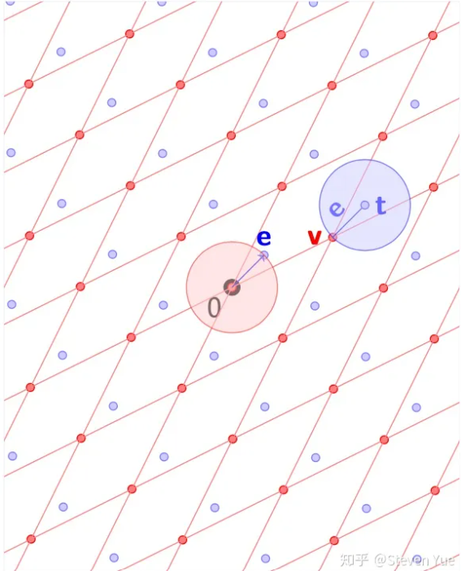
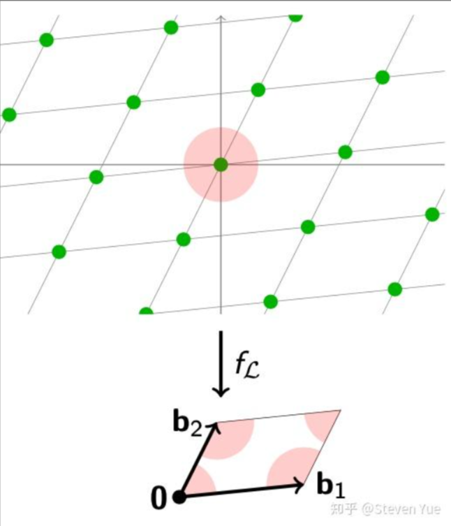
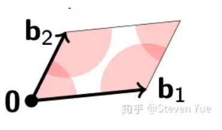
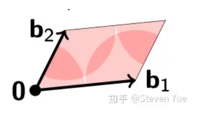
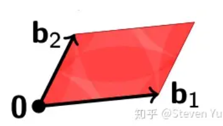
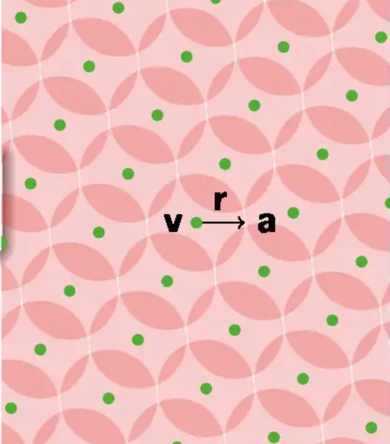
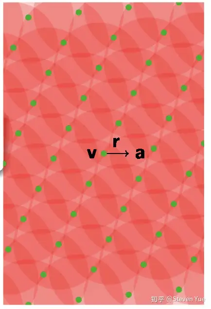

# q阶随机格（q-ary random lattices）

1. 一个$q$阶随机Lattice $Λ$需要满足如下的要求：$𝑞𝑍^𝑛⊆Λ^\perp⊆𝑍^𝑛$，其中$𝑞𝑍^𝑛$代表了包含了一个$mod\ q$的循环群。这样一来，所有和q阶Lattice有关的计算，都可以通过q模的数学运算来完成。我们一般在密码学算法中用到的格，都是q阶随机格（q-ary random lattice）。q-ary准确来讲，应该分为**q-ary垂直格**（$\Lambda^\perp$或$Λ_{\frac1q}$）和**q-ary格** （$\Lambda$或$Λ_𝑞$）
2. 最常见的生成随机格的方式主要为两种。首先，我们都需要随机的生成一个随机矩阵$𝐴∈𝑍_𝑞^{𝑛×𝑑}$。
   1. **q-ary格**：当我们获得了𝐴矩阵之后，把这个矩阵的**每一行**作为我们生成的**格的基向量**，得到第一个Lattice：$Λ(𝐴)=\{𝑥:𝑥\ mod\ 𝑞∈𝐴^𝑇𝑍_𝑞^𝑛\}⊆𝑍^𝑑$。也就是说，我们得到的格$Λ_𝑞$，$𝐴$与$𝑍_𝑞^𝑛$(模q下的n维空间)中的所有点的线性组合组成的集合。这个定义意味着，我们首先取A的转置（$A^T$）与模q空间$Z_q^n$中的某个向量z（**代表对基向量的线性组合**）进行线性组合，得到的结果是一个模q下的向量。然后，我们寻找一个整数向量$x$，使得$x \equiv A^Tz \pmod q$，这样的x的集合就构成了格$Λ_q(A)$。
   2. **q-ary垂直格**：找到所有的向量𝑥，使得$𝐴𝑥=0$。$Λ^\perp(𝐴)=\{𝑥\in Z^m:𝐴𝑥=0\ mod\ 𝑞\}⊆𝑍^𝑑$
   3. 随机矩阵$𝐴∈𝑍_𝑞^{𝑛×𝑑}$意味着矩阵*A*是一个*n*行*d*列的矩阵，其元素来自模*q*的整数集。换句话说，矩阵*A*的每个元素都是整数，并且在执行任何数学运算时（如加法或乘法），结果都会通过模*q*来取余数，以保持元素在集合$Z_q$中。
   4. 我们生成的这两个Lattice，即$Λ_𝑞,Λ_{\frac1q}$，都符合上一部分提到的这个约束，即$𝑞𝑍^𝑛⊆Λ^\perp⊆𝑍^𝑛$。并且值得注意的是，我们根据同一个𝐴生成的两个格是完全不一样的两个系统，几乎所有的格点都大相径庭，但是这两个Lattice之间却又有着很微妙的对偶关系。

## q-ary格的对偶关系

1. 首先，我们基于同一个随机矩阵$𝐴$，通过这两种方式生成的随机格，$Λ_𝑞$,$Λ_{\frac1q}$是完全不同的两个矩阵。

2. 但是比较有趣的是，如果我们基于$𝐴$得到了$Λ_𝑞$的话，那么一定存在另一个矩阵$𝐴^′$，使得：$Λ_𝑞(𝐴∈𝑍_𝑞^{𝑛×𝑑})=Λ_{\frac1q}(𝐴^′∈𝑍_𝑞^{𝑘×𝑑})$。

3. 同理可得，如果我们根据$𝐴$得到了$Λ_{\frac1q}$的话，那一定也存在一个矩阵$𝐴^′$，并且这个矩阵的$Λ_𝑞$与之前的$Λ_{\frac1q}$相等。这两个生成的q阶随机格之间相互是对偶的关系。具体的关系是这样的：
   
   $$
   Λ_𝑞(𝐴)^∨=\frac1𝑞Λ_{\frac1q}(𝐴)\\
Λ_{\frac1q}(𝐴)^∨=\frac1𝑞Λ_𝑞(𝐴)
   $$
   
   我们生成的这两个随机格之间，就是缩放了𝑞倍之后的对偶格。

## 陪集格（coset）

1. 如果我们将生成q-ary垂直格$Λ^\perp(𝐴)=\{𝑥\in Z^m:𝐴𝑥=0\ mod\ 𝑞\}$中的$Ax =0$中的0改为任意向量$u \in Z_q^n$：$Az_0=u \bmod q$。就会出现平移格或者叫陪集格(coset）：$\Lambda_{\frac1u}(A)=\{z \in Z^m:Az=u \bmod q \}$。陪集格与原始格的关系：$\Lambda_{\frac1u}(A)=\Lambda^\perp(A)+z_0$。
2. 即设q-ary垂直格的向量是$x$，那么陪集格中对应的向量是$z=x+z_0，Az\equiv Ax+Az_0 \equiv Az_0 \equiv u \pmod q$

## q-ary格的常用定理

1. 随机取一个$A \in Z_q^{n*m}$，假定q-ary垂直格$\Lambda^\perp(A)$的某个格基为$S\in Z^{m*m}$。
2. 注意：矩阵A的维度与格维度的关系。

### 定理1

1. 对任意幺模矩阵$T \in Z^{m*m}$，都有：$T*\Lambda^\perp(A)=\Lambda^\perp(A*T^{-1})$
2. 理解：该定理描述了幺模矩阵与q-ary垂直格的关系。左边$T*\Lambda^\perp(A)$代表对每个q-ary垂直格进行幺模矩阵变换，该新格的格基为$T*S$。右边代表对矩阵A的变换，看q-ary格的原始定理可直接列出。
3. 幺模矩阵（Unimodular Matrix）是一个整数矩阵，其行列式（determinant）的值为±1。
   1. 定义：设 *A* 是一个 *n*×*n* 的整数矩阵，如果 det(*A*)=±1，则称 *A* 为幺模矩阵。
   2. 性质：
      1. **逆矩阵也是整数矩阵**：如果 $A$ 是幺模矩阵，那么 $A$ 的逆矩阵 $A^{−1}$也是整数矩阵。这是因为 $det(A^{−1})=\frac1{det(A)}=±1$，且逆矩阵的元素可以通过行列式的公式（如Cramer's Rule）表示为整数矩阵元素的整数倍。
      2. **乘积也是幺模矩阵**：如果 $A$ 和 $B$ 都是幺模矩阵，那么它们的乘积 $AB$ 也是幺模矩阵。因为 $det(AB)=det(A)⋅det(B)=±1⋅±1=±1$。
      3. **行列变换**：幺模矩阵可以通过一系列的行（或列）初等变换（包括交换两行、将某一行乘以一个非零整数、将某一行加上另一行的整数倍）从一个单位矩阵变换而来。
      4. **与整数格的关系**：幺模矩阵在整数格（integer lattice）的线性变换中扮演重要角色。一个幺模矩阵可以将一个整数格映射到另一个整数格，且保持格点的相对位置（除了可能的翻转或平移）不变。

### 定理2

1. 对任意可逆的方阵$H \in Z_q^{n*n}$，q-ary垂直格都满足：$\Lambda^\perp(H*A)=\Lambda^\perp(A)$。理解：矩阵可逆的话，$HAx=0$同时左乘$H$的逆矩阵，可得到$Ax=0$。，与原来的q-ary垂直格等效。（**注意：矩阵H的顺序在左边**）
2. 如果$H$是右乘，那么得到$AHz \bmod q$，此时无法通过乘$H$的逆矩阵以消去$H$，得到$Az=0$

### 定理3

1. 设定矩阵$A \in Z_q^{n*m}$的列秩大于等于n（其实就是列秩等于n），也就是矩阵A中有m个列向量，每个向量的维度为n，换句话说也就是矩阵A的列向量可构成整个空间$Z_q^n$。接着随机取矩阵$A'\in Z_q^{n*m'}$以及矩阵$W \in Z^{m*m'}$，满足如下：$AW=-A' \bmod q$。接着我们可以借助此性质对q-ary垂直格的矩阵A进行扩展，形成新的q-ary垂直格$\Lambda^\perp([A'|A])$，该q-ary垂直格的格基为：$S' = \begin{bmatrix}I & 0 \\ W & S\end{bmatrix}$
2. 证明：
   1. 简单来看，将$[A'|A]$看成一行两列的矩阵，将$S'$看成两行两列的矩阵，运算：$[A'|A]*S'=[A'|A]*\begin{bmatrix}I & 0 \\ W & S\end{bmatrix}=[A'I+AW&AS]$
   2. 因为$AW=-A' \bmod q$，所以$AW+A'I=(-A')+A'=0$
   3. 所以$[A'|A]*S'=[0|AS]$
   4. 也就是新的q-ary垂直格$\Lambda^\perp([A'|A])$的格基为：$S' = \begin{bmatrix}I & 0 \\ W & S\end{bmatrix}$
   5. 另外，我们知道格基是可以进行正交化的。其实S'正交化后的矩阵如下：$\tilde{S'}=\begin{bmatrix}I & 0 \\ 0 & \tilde{S}\end{bmatrix}$。单位矩阵不改变长度，通过矩阵的表达形式不难看出，该矩阵的模长与原始格基S正交化的模长相等，也就是：$||\tilde{S'}||=||\tilde{S}||$

# CVP与对偶格

1. CVP问题就是给定一个任意的点$𝑡∈𝑅^𝑛$，和一个Lattice $Λ$，找到一个在$||𝑒||$范围内的格点$𝑣∈Λ$。我们也可以使用格点向量$𝑣$与误差向量$𝑒$的形式来表示我们的目标向量：$𝑡=𝑣+𝑒$

2. 假设我们找到了$Λ$的对偶格$Λ^∨$，并且用$𝐿(𝐷)$来表示。（即𝐷是对偶格$Λ^∨$的基向量组成的矩阵。）根据对偶格的定义，对偶格的基向量乘以任何一个$Λ$中的格点都会得到一个整数。所以我们可以观察一下$𝐷$与$𝑡$的乘积：
   
   $𝑠=⟨𝐷,𝑡⟩ \pmod 1=⟨𝐷,𝑣⟩+⟨𝐷,𝑒⟩ \pmod 1=⟨𝐷,𝑒⟩ \pmod 1$。因为我们知道$⟨𝐷,𝑣⟩$是一个整数，然而$𝑒$并不在格上，所以会得到一个$𝑅$中的任意小数。最后得到的$𝑠$就是表示这个误差特性的一个小数，而且不管$𝑡$在什么方位，其实真正决定了𝑠的值的是误差𝑒。在译码学中，我们一般把$𝑠$这个数值称作伴随式译码（syndrome encoding）。

3. 在有噪信道传输的应用场景中（前文有所提到），我们可以基于格把一个要发送的数据$𝑚$映射到格点$𝑣$上，然后发送过去。在接受的过程中，因为噪音的原因叠加了一个噪音向量$𝑒$，最后得到了$𝑡=𝑣+𝑒$。这个时候，我们只需要计算𝑡的syndrome 𝑠，就可以得到这个噪音对应的一个独特的数值。

4. 因为噪音本身与格点的方位没有关联，所以我们可以把噪音向量𝑒平移到所有其他的格点上。我们观察发现，这等于是在这个空间中，按照$Λ$的Determinant空间分成了很多份，然后每一份的parallelpiped中，都拥有这么一个点可以得到相同的syndrome！如果用集群的方法来表达的话，那么这个噪音向量𝑒属于一个coset（陪集）当中，这个coset为：$𝑡+Λ=\{𝑥:⟨𝐷,𝑥⟩=𝑠\ mod\ 1\}$（即将整个格$Λ$沿$t$向量平移，其中的$x$其实就是所有平移后的格点$x=v+e,𝑠=⟨𝐷,x⟩ \pmod 1$）。当我们知道了syndrome之后，我们知道在整个$𝑅^𝑛$的空间中，存在无限多个可以满足这个syndrome的点。这个时候我们只需要在原点附近，找到一个最短的向量$𝑒$，使得$⟨𝐷,𝑒⟩=𝑠 \pmod 1$。找到这个向量𝑒之后，我们只需要从$𝑡$中减去它，就可以解决CVP问题。通过这种方法解决的CVP问题，我们一般称为伴随式解码问题（syndrome decoding problem）。

# CVP构造的One-way Function

1. 知道了CVP问题可以被转化为在一个Lattice的基础空间（即Determinant构成的空间）中搜索一个短向量$𝑒$之后，我们可以根据短向量的和Lattice的基础空间（即Determinant组成的空间），尝试构造出如下的OWF：
   1. 首先，我们OWF的key就是随机选取一个困难的Lattice $Λ$。然后输入一个短向量$𝑥$，并且这个向量的长度我们使用$\beta$来约束：$||𝑥||≤\beta$
   2. 这个OWF的输出非常简单，就是这个短向量在这个Lattice中求模运算得出的结果：$𝑓_Λ(𝑥)=𝑥\ mod\ Λ$。下图很好的表述了这个OWF做的事情：我们其实就是把一个距离原点半径为𝛽范围内的一个球体中的任意一个向量，映射到了这个Lattice的Determinant组成的基础空间中。这个空间的映射，其实和我们上面说到的syndrome encoding有异曲同工之妙，都是把一个向量映射到了这么一块空间中，只是输出的格式不同而已。                                                                                                                
   3. 首先，如上图所示，如果$𝛽<𝜆_1(Λ)/2$，也就是说$𝛽$小于了这个格中最短向量的一半的话，我们可以发现，映射到基础空间之后，我们之前的一个球体会被拆分成各个小块散落在每个格点周围。因为格点之间的距离肯定不能短于Lattice的最短向量，而我们球体的半径比最短向量的一半还小，可想而知我们的映射结果不会有任何重合。这种情况下的OWF是单射（injective）的，即每一个映射空间（即基础空间）中的点，都对应了至多一个输入空间中的点。
   4. 当我们放大$𝛽$的值，使得$𝛽>𝜆_1/2$之后，我们发现很多球面的部分重合了。这说明这个OWF会有多个输入都映射到同一个输出上，即collision。这也就代表了我们构造的OWF $𝑓_Λ$不再是一个injective的函数。
   5. 如果我们继续扩大$𝛽$的值的话，当$𝛽$大于整个Lattice的覆盖半径之后，即$𝛽≥𝜇$，根据覆盖半径的定义，我们知道整个映射空间都被我们的球体给覆盖住了。这个时候，所有的映射空间中的点都有至少一个对应的输入空间中的点，这个OWF也就变成了一个满射（surjective）的函数了。                                   
   6. 当然，也可以继续扩大这个圆的半径，使得这个基础空间被基本上均匀覆盖。这样一来，我们就可以说OWF $𝑓_Λ(𝑥)$是一个均匀（uniform）覆盖输出空间的OWF了。这样一个OWF的构造似乎令人满意，并且看似也很难被找到对应的反函数（inverse）。

# SIS问题（Ajtai提出的One-way Function）

1. Ajtai在1996年提出了基于我们看到的q阶随机格的OWF（单项函数），并且给出了安全的论证。

## SIS问题的数学定义

1. 给定$m$个均匀随机的$n$维向量$a_i∈Z_q^n$，将他们作为矩阵的列，由此形成$𝐴∈𝑍_𝑞^{𝑛×𝑚}$。如何寻找一个非零的整数向量$𝑧∈𝑍^𝑚$，且范数满足$||z||≤β$，使其满足：$f_A(z):=Az=\sum_ia_iz_i=0\in Z_q^n$。理解：$f_A(z)$可以看成SIS函数，$A$为公开的下标。很明显该函数正向计算容易，逆向计算$z$困难。

## 基于SIS问题的OWF的构造。

1. 矩阵的维度和模组的大小：$𝑚,𝑛,𝑞∈𝑍$。
2. OWF的key：我们随机选取一个$𝑛×𝑚$阶的矩阵$𝐴∈𝑍_𝑞^{𝑛×𝑚}$，即一个随机的$𝑛×𝑚$阶模q的整数的矩阵。
3. OWF的输入就是一个二进制向量：$𝑥∈\{0,1\}^𝑚$（这里要求二进制的原因是为了确保这个向量的长度足够的短（符合短向量的条件）。理论上也可以使用$𝑂(1)$范围内任何区间。）。
4. OWF的输出则是：$𝑓_𝐴(𝑥)=𝐴𝑥\ mod\ 𝑞$。也就是说，我们任意选择一个二进制的短向量，这个向量和随机矩阵的乘积就是OWF的输出了。这个OWF输出的值，其实就是$Λ_𝑞(𝐴)$中的一个格点。
5. Ajtai在paper中提出，只要矩阵的维度符合$𝑚>𝑛*𝑙𝑜𝑔(𝑞)$这一标准，并且SIVP问题困难的话，那么此$𝑓_𝐴(𝑥)$就是一个合理的OWF。
6. 因为$𝑓_𝐴(𝑥)$其实就是和矩阵𝐴的乘积，根据定义，另一个Lattice $Λ_{\frac1q}$中的所有格点$𝑣∈Λ_{\frac1q}$在这个OWF中的输出都会是零：$𝑓_𝐴(𝑣∈Λ_{\frac1q})=0\ mod\ 𝑞$。这样的关系在线性代数中，我们一般称$Λ_{\frac1q}(𝐴)$为$𝑓_𝐴$的kernel（核）。
7. 只要能够找到一个短向量$𝑣∈Λ_{\frac1q}$，已知向量𝑥以及OWF的结果$𝑓_𝐴(𝑥)$，我们就可以找到这个OWF的一个collision：$𝑓_𝐴(𝑥+𝑣)=𝐴(𝑥+𝑣)\pmod q =𝐴𝑥+𝐴𝑣\pmod 𝑞=𝐴𝑥 \pmod 𝑞=𝑓_𝐴(𝑥)$
8. 当我们把OWF的输入格式reduce成一个向量𝑥加上对偶格中的某个格点𝑣之后，根据OWF的输出还原出𝑥就变成了一个CVP问题：问题给出的向量就是$𝑡=𝑥+Λ_{\frac1q}(𝐴)$，得到$f_A(t)=f_A(x)$。然后我们只要能够找到附近的格点𝑣，就可以相减算出𝑥了。不过呢，这里我们不一定要找到最近的那个解，因为这个OWF有collision的存在，所以任何一个合适的格点都可以。这也就是说我们这里变相的是在求解ADD版本的CVP问题啦。因为Ajtai的这个OWF基于的是未知的短向量作为输入，所以我们一般把这个体系描述为Short Integer Solution（SIS）问题。
9. 根据我们上面推理所得，SIS大致上就可以规约到approximate版的ADD问题上来，然后ADD问题又可以进一步reduce到SIVP问题上。这样SIS的困难度就可想而知了。

## 基于SIS问题的OWF的安全性证明：

### SIS的单向性证明

1. 即然要证明One-way，那么我们可以定义一下SIS的反问题：如果给定了矩阵$𝐴$与向量$𝑦$，能否找到一个短向量$𝑥∈\{0,1\}^𝑚$，并且可以满足$𝐴𝑥=𝑦 \bmod 𝑞$。我们可以经过一些转换，把这个反问题转换为一个Lattice中的问题。
2. 首先，因为这个等式$𝐴𝑥=𝑦 \bmod 𝑞$就是一个普通的线性组合等式，所以我们可以非常轻松的找到一个解$𝑡$，使得$𝐴𝑡=𝑦 \bmod 𝑞$。只需要使用高斯消除法，我们就可以很简单的找到一个合适的$𝑡$。
3. 虽然$𝑡$好找，但是事实是，通过高斯消除法得到的$𝑡$可能会是一个随机的很大的向量，几乎不可能能找到我们想要的短向量，即一个二进制向量，所以我们并没有解决这个问题。但是因为$𝑥,𝑡$都可以满足这个等式，所以我们可以把所有满足$𝐴𝑥=𝑦 \bmod q$的解向量，都描述为一个coset $𝑡+Λ^⊥$。这里的$Λ^⊥$即垂直于$Λ$的另一个Lattice：$Λ^⊥(𝐴)=\{𝑥∈𝑍^𝑚:𝐴𝑥=0 \bmod 𝑞\}$。经过如此转换，我们就可以把问题转换为：如何在coset $𝑡+Λ^⊥$中找到最短的一个向量$𝑥$。这个最短的向量就是满足我们这个OWF的二进制向量了。这就是一个syndrome decoding problem。

### SIS的Collision Resistance证明

1. 证明SIS是Collision Resistant的（即难以找到碰撞）。碰撞的意思就是说，可以找到两个不同的输入𝑥,𝑦，使得$𝑓_𝐴(𝑥)=𝑓_𝐴(𝑦)$。
2. 如果我们可以找到SIS的碰撞，即两个二进制向量𝑥,𝑦，并且$𝐴𝑥=𝐴𝑦 \bmod 𝑞$，我们可以观察这两个碰撞输入的差：$𝑧=𝑥−𝑦∈\{−1,0,1\}^𝑚$。因为𝑥,𝑦都是二进制向量，所以它们相减得到的向量，也是二进制的。（我们可以把-1和1看作是一样的，因为在距离上看是相等的。）这也就是说：$𝐴𝑧=𝐴𝑥−𝐴𝑦=0 \bmod 𝑞$。通过找到了一组碰撞，我们就可以找到$Λ^⊥$这个Lattice中的一个短向量！这个向量的无限范数$||𝑧||_∞=𝑚𝑎𝑥_𝑖|𝑧_𝑖|=1$。这样一来，我们就等于解决了$Λ^⊥$这个格中的SVP（或者SIVP）问题。同理，因为SVP/SIVP是困难的，所以我们不能找到SIS的碰撞啦。

# SIS问题的困难度论证

## Average Case Hardness（平均困难度）

1. RSA中Rabin给出的安全性证明为：在密码学定义上，只要**大部分**$𝑁=𝑝⋅𝑞$是难以被factor的，那么$𝑓_𝑁$这个函数也是难以被invert的。
2. 平均困难度通常定义为：在给定输入数据的概率分布下，算法运行时间、资源消耗或解决问题的难度（如密码学中的破解难度）的平均值。
3. Ajtai的OWF（SIS）的平均困难度：我们的OWF是$ 𝑓_𝐴(𝑥)=𝐴𝑥 \bmod 𝑞$。同时我们在之前也指出了想要逆向计算$𝑓_𝐴$的话，我们等于是需要求解Lattice $Λ(𝐴)$中的SVP问题。所以$Λ(𝐴)$的SVP难度与我们的OWF的安全性也是挂钩的。这也就是说，如果我们随机的抽取$𝐴$矩阵，并且给予它来构造OWF。只要保证大部分时候$Λ(𝐴)$中的SVP是困难的，那么我们得到的$𝑓_𝐴$就是单向（OWF）并且collision resistant的。

## Worst Case Hardness（最坏情况困难度）

1. 对于$𝑓_𝐴$，如果我们继续用平均困难度的方法，其实是很难得到一个很好的结果的。这个时候，我们可以换成另外一种思考角度，把这个平均问题进一步的规约成最坏情况问题。
2. 现在我们做一个新的假设：假如我们可以随机选择一个$𝐴$，然后构成一个Lattice $Λ$，但是有一种新的方法可以把这个Lattice映射到任意的$𝑓_𝐴$上去。这也就是说$Λ(𝐴)$和$𝑓_𝐴$的一一对应关系已经没有了，一个Lattice可以变换组成任意的$𝑓_𝐴$的实例。
3. 假设在所有的$𝑓_𝐴$中，大部分的实例（对应的SVP问题）都是难解的，但是如果我们有一个算法可以破解所有可能性中的一小部分实例，那么我们就可以用这个算法来破解所有其他的$Λ$实例中的SVP问题。原因也很简单，因为我们一个Lattice $Λ$可以任意对应任意的$𝑓_𝐴$实例，所以就算是这个空间中”最难“破解的Lattice $Λ$，也可以被映射到可以被破解的这一小部分$𝑓_𝐴$上，然后用已知的破解算法来破解出来。
4. 这种类型的困难度论证被称为最坏情况困难度论证。也就是说，只要在整个取值空间中只要有任何（any）一个实例可以被破解，那么整个取值空间都可以被破解。

## Lattice模糊化（blurring）

1. 当圆的半径等于这个Lattice的覆盖半径$𝜇$的时候，整个空间$𝑅^𝑛$都会被覆盖住。当整个空间都被圆形覆盖住的时候，这个覆盖半径就是任意一个点可以距离格点最远的距离。
2. 现在我们假设这些圆当作一个以格点为中心的随机误差的分布$𝑋$。这个时候，在$𝑅^𝑛$空间中的任意一个点$𝑎$都可以被拆分成如下的形式：$𝑎=𝑣+𝑟$。这里的$𝑣$就是Lattice $Λ$中的一个格点，$𝑟$则是误差分布中的一个随机误差向量。如果我们现在随机的选择一个格点，再从误差分布中随机的选择一个误差向量，把它们相加起来的话，就可以近似地得到一个$𝑅^𝑛$空间中的随机向量。我们观察可以发现，图上的圆的半径仅仅是覆盖半径，整个空间中有很多部分重合的地方。这个时候我们用这种方法生成的随机向量的分布其实并不是均匀的，而是会偏向这些重合的地方。                                                                                                                                           
3. 这个时候，我们需要继续增加半径的大小，使得这个分布变得越来越近似于平均分布。越近似于平均分布。$||𝑟||≤(log\ 𝑛)⋅\sqrt𝑛⋅𝜆_𝑛/2≈\sqrt𝑛⋅𝜆_𝑛$。当我们的误差分布半径达到如上所示的值的时候，如果我们只看这个格的基础空间（即Determinant组成的parallelpiped，或者$𝑅^𝑛/Λ$的模组空间），我们可以把这个空间中的错误分布看作平均分布。                                                                                                                                     
4. 这个时候，我们已经把这个格足够的模糊化了。当我们得到一个模糊化之后的Lattice之后，就可以来完成Ajtai OWF的安全性论证了。

## Ajtai OWF的安全性论证尝试

1. 我们来尝试使用最坏情况复杂度的规约来证明Ajtai OWF的安全性（即单向和collision resistant）。
2. 我们成功的得到了一个模糊化之后的Lattice$ Λ$，现在我们来看看这个格是否满足之前的假设（最坏情况困难度中的假设），即$Λ$可以映射到任意的$𝑓_𝐴$上。
3. 首先，我们可以用上面提到的方法，先随机的生成一个$Λ$中的格点$𝑣_𝑖$。然后我们从随机噪音分布中生成一个噪音向量$𝑟_𝑖$，并且根据我们模糊化的结果，$||𝑟||≤𝑛⋅𝜆_𝑛。𝑎_𝑖=𝑣_𝑖+𝑟_𝑖$。我们把这两个随机的向量组合起来，变成我们的目标向量$𝑎_𝑖$。根据模糊化的结果，我们知道$𝑎_𝑖$的随机分布是近似平均分布的。
4. 这个时候，我们连续的取得𝑚个类似的向量，这里$𝑞=𝑛^{𝑂(1)},𝑚=𝑂(𝑛\log⁡\ 𝑞)=𝑂(𝑛\log\ ⁡𝑛)：𝐴=[𝑎_1,…,𝑎_𝑚]∈𝑅_𝑞^{𝑛×𝑚}$。因为我们是拼接了𝑚个类似的随机向量得到矩阵𝐴的，所以这个矩阵也可以被看作是随机分布的。
5. 得到了$𝐴$之后，我们使用这个矩阵来构造一个Ajtai OWF的实例$𝑓_𝐴$。这个时候，因为从$𝐴$根本看不出来我们原本的Lattice是什么结构的，对于一个adversary来说，这个$𝑓_𝐴$就是一个平均情况的，可能是任何Lattice形成的一个Ajtai OWF实例。这个时候，就算我们一开始使用的是空间中“最难的”一个Lattice生成的随机向量，因为adversary并不知道这一回事，所以他只会觉得他在求解一个平均难度的问题。这就是**最坏情况到平均情况的规约**的精髓了！我们把一个最坏情况的Lattice“伪装”成了一个平均情况的实例。这个时候，如果adversary拥有一个算法可以破解一小部分的$𝑓_𝐴$的化，那么它就有一定的几率可以破解我们创造的这个实例。
6. 如果adversary可以成功的破解这个$𝑓_𝐴$实例的话，那么就代表我们找到了一个短向量$𝑧∈ \{ −1,0,1\}^𝑚$并且满足：$∑(𝑣_𝑖+𝑟_𝑖)𝑧_𝑖=∑𝑎_𝑖𝑧_𝑖=0$（SIS问题的collision resistance）。我们把这个等式变换一下，就可以得到如下的形式：$∑𝑣_𝑖𝑧_𝑖=−∑𝑟_𝑖𝑧_𝑖$，观察可以发现，等式的左侧我们可以得到一个格点，而右侧我们可以得到一个相对来说较短的向量（并不是格点）。因为$𝑟$向量长度的上限和$𝑧$向量是个短向量的原因，我们可以约束右侧的向量：$||∑𝑟_𝑖𝑧_𝑖||≈𝑚⋅max||𝑟_𝑖||≈𝑛⋅𝜆_𝑛$。虽然右侧的向量并不在格点上，但是我们发现这个向量相对来说还是比较短的。因为左侧的在$Λ$格中的向量的值等于右侧的向量的值，这就代表说左侧的格点向量也是很短的。这样一来，我们就等于间接的解决了$Λ$中的短向量了。
7. 回到我们一开始的定义，如果找到了短向量（近似SIVP）问题，那么我们就可以成功的破解SIS OWF。根据我们最坏情况困难度的规约，只要所有的随机格中有任何一部分（some）Lattice可以被破解，那么我们就可以破解任何平均情况的Lattice，找到它们的短向量。综上所述，因为我们知道SIVP是困难的问题，所以这些事情都不可能，所以SIS OWF也是安全的了。

# SIS问题的参数大小

1. 在MP13中，Micciancio与Peikert把$𝑞$的大小压到了更小。在paper中，他们指出只要$q \ge \sqrt{n}$，那么Ajtai OWF就是安全的。
2. 用反证法证明在$q \ge \sqrt{n}$的情况下，Ajtai OWF（即SIS）是安全的。
   1) 首先，为了让构造和证明变得简单，我们假设OWF$ 𝑓_𝐴(𝑥)$只接受二进制的短向量输入，即$𝑥∈\{0,1\}^𝑚$。然后我们假设我们拥有一个很强大的算法，可以轻易破解在固定参数的$𝑛,𝑚,𝑞$下- [q阶随机格（q-ary random lattices）](#q阶随机格q-ary-random-lattices)
- [q阶随机格（q-ary random lattices）](#q阶随机格q-ary-random-lattices)
  - [q-ary格的对偶关系](#q-ary格的对偶关系)
  - [陪集格（coset）](#陪集格coset)
  - [q-ary格的常用定理](#q-ary格的常用定理)
    - [定理1](#定理1)
    - [定理2](#定理2)
    - [定理3](#定理3)
- [CVP与对偶格](#cvp与对偶格)
- [CVP构造的One-way Function](#cvp构造的one-way-function)
- [SIS问题（Ajtai提出的One-way Function）](#sis问题ajtai提出的one-way-function)
  - [SIS问题的数学定义](#sis问题的数学定义)
  - [基于SIS问题的OWF的构造。](#基于sis问题的owf的构造)
  - [基于SIS问题的OWF的安全性证明：](#基于sis问题的owf的安全性证明)
    - [SIS的单向性证明](#sis的单向性证明)
    - [SIS的Collision Resistance证明](#sis的collision-resistance证明)
- [SIS问题的困难度论证](#sis问题的困难度论证)
  - [Average Case Hardness（平均困难度）](#average-case-hardness平均困难度)
  - [Worst Case Hardness（最坏情况困难度）](#worst-case-hardness最坏情况困难度)
  - [Lattice模糊化（blurring）](#lattice模糊化blurring)
  - [Ajtai OWF的安全性论证尝试](#ajtai-owf的安全性论证尝试)
- [SIS问题的参数大小](#sis问题的参数大小)
- [SIS OWF的运行效率](#sis-owf的运行效率)

# SIS OWF的运行效率
