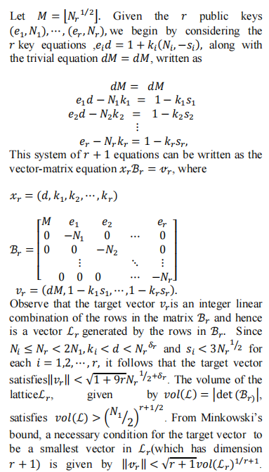

# 构造格的思想

1. 尽量构造出：已知量乘未知量的积相加的和的多项式且多项式的结果（未知量作为结果）一般是最短向量的坐标之一，将较小的值放在构造的最短向量里面（在此同时，尽量将好估算大小的值放在格的对角线上和最短向量里面）。
2. 一般将要计算的值放在最短向量中。少数时候也可以将要计算的值放在和格相乘的向量中，此时，将最短向量和格的逆矩阵相乘即可得到要计算的值
3. 尽量在构造格时，尽量构造出来的格的最短向量的表达式的每一位坐标之间的差尽量小，即$(x_1,x_2,\dots,x_n)L = (y_1,y_2,\dots,y_n)$中的$y_1,y_2,\dots,y_n$之间的差尽量小，此时最短向量的行列式和hermite定理求出来的上界相差最大，和上界得比率最小（如例2）
4. 有时为了得到坐标之差较小的最短向量，我们可以通过对格在已有的基础上进行修改以满足我们的需求，修改的方法：对已有的格再乘一个对角矩阵。对角矩阵$D$的构造方法：
   1. 最初时，构造出的最短向量$v=(v_1,v_2,\dots,v_n)$，想要得到的填补后的最短向量$v'=(v_12^{a_1},v_22^{a_2},\dots,v_n*2^{a_n})$
   2. 构造出来的对角矩阵$D=\begin{bmatrix}2^{a_1} & & & & \\ & 2^{a_2} & & & \\ & & \ddots & & \\ & & & & 2^{a_n}\end{bmatrix}$此时将我们原本的格乘对角矩阵$D$，即可得到新的满足需求的格，而新的格的最短向量$v'=v*D$
   3. 证明：原本的格$L$，$v = b*L$，此时：$L'=L * D，v' = b*L'=b * (L * D) = v * D$
5. 尽量将多项式中大的数放入格，小的数放入最短向量中
6. 因为构造的格需要是满秩的（基向量线性无关），所以最好构建成上三角矩阵且主对角线上的元素不为0（必定满秩）。所以一般将所有多项式系数放在格的最后一列进行构造。同时，为方便求hermite上界和对最短向量估值，最好将范围较为确定的值构造进最短向量中
7. 注意：有时求解出来的最短向量的坐标和推导的最短向量坐标的正负相反。因为我们此时求出来的最短向量可能是推导出的最短向量关于原点中心对称的向量而不是原本推导的向量。因为一个点属于格的点，其关于原点中心对称的点还是在格中，此时他们的长度相同而且都在格$L$里所以都是最短向量。推导：$(a,b)L=(c,d) => (-a,-b)L=-1(a,b)L=-1(c,d)=(-c,-d)$，所以$(-c,-d)$也在格L中

# 1

1. 题目：

   ```python
   from Crypto.Util.number import *
   import random
   
   flag = b'******'
   m = bytes_to_long(flag)
   
   a = getPrime(1024)
   b = getPrime(1536)
   
   p = getPrime(512)
   q = getPrime(512)
   r = random.randint(2**14, 2**15)
   assert ((p-r) * a + q) % b < 50
   
   c = pow(m, 65537, p*q)
   
   print(f'c = {c}')
   print(f'a = {a}')
   print(f'b = {b}')
   
   '''
   c = 78168998533427639204842155877581577797354503479929547596593341570371249960925614073689003464816147666662937166442652068942931518685068382940712171137636333670133426565340852055387100597883633466292241406019919037053324433086548680586265243208526469135810446004349904985765547633536396188822210185259239807712
   a = 134812492661960841508904741709490501744478747431860442812349873283670029478557996515894514952323891966807395438595833662645026902457124893765483848187664404810892289353889878515048084718565523356944401254704006179297186883488636493997227870769852726117603572452948662628907410024781493099700499334357552050587
   b = 1522865915656883867403482317171460381324798227298365523650851184567802496240011768078593938858595296724393891397782658816647243489780661999411811900439319821784266117539188498407648397194849631941074737391852399318951669593881907935220986282638388656503090963153968254244131928887025800088609341714974103921219202972691321661198135553928411002184780139571149772037283749086504201758438589417378336940732926352806256093865255824803202598635567105242590697162972609
   '''
   ```

2. 题解：

   1. 推导：
      $$
      假设 x =  ((p-r) * a + q)\% b，知道a、b且x和r的数值较小可以爆破\\
      => x + kb = (p-r)a + q ，k\in Z=> x-q = (p-r)a + (-kb) =(p-r)a + kb\\
      参考一维NTRU构造:格L = \begin{bmatrix}1 & a \\ 0 & b \end{bmatrix}，有(p-r,k)L=(p-r,x-q)=\vec{v}\\
      检验\vec{v}是否是最短向量：通过Hermite定理(||\vec{v}|| \leq \sqrt{n}\det{(L)}^{\frac{1}{n}})检验：\\
      由于p、q都是512位的数，所以：\Vert \vec{v} \Vert \approx \sqrt{p^2+q^2} \approx \sqrt{2p^2} = \sqrt{2}*p = \sqrt{2} * 2^{512} \\
      \sqrt{n}\det{(L)}^{\frac{1}{n}} = \sqrt{2} * b^{\frac{1}{2}} \approx \sqrt{2}* {(2^{1536})}^{\frac{1}{2}} = \sqrt{2} * 2^{768}\\
      所以满足：||\vec{v}|| \leq \sqrt{n}\det{(L)}^{\frac{1}{n}}\\
      所以\vec{v}很大概率是格L的最短向量。所以我们可以LLL算法求出格L的最短向量\vec{v}\\
      再通过爆破r和x，即可求出p和q
      $$

   2. 解密代码：

   ```sage
   from Crypto.Util.number import *
   import gmpy2
   c = ...
   a = ...
   b = ...
   L = Matrix(ZZ,[[1,a],
                  [0,b]])
   pp,qq = L.LLL()[0]
   '''
   pp=-11296178014269303494837745604378279247866909144617752153545368028888626096702713262852534563523632474606208277782361536096982136624743993713145172222722488
   qq=7624362591338746517094639431704851643734620831459014789016367356254899957320105688627749759067762076121643496058348997115185171145960008965900436924472153
   '''
   pp = -pp
   qq = -qq
   for r in range(2**14,2**15+1):
       for x in range(0,51):
           p = pp + r 
           q = x - qq
           phi = (p - 1)*(q - 1)
           if gmpy2.gcd(phi,65537) != 1:
               continue
           d = gmpy2.invert(65537,phi)
           m = gmpy2.powmod(c,d,p*q)
           m1 = long_to_bytes(m)
           if b"NSSCTF{" in m1:
               print(m1)
               break
   ```

   >有题目知$v=(p - r, x - q)$其中$pp = p - r > 0，qq =  x - q < 0$。而sage中LLL算法解出来的$pp<0，qq>0$，和推导出来值的符号的相反，由此我们可以猜测是因为求解出来的实际是$\vec{v}=(p - r, x - q)$关于原点对称的最短向量$\vec{v}^{'}=(-(p - r), -(x - q))$，因为一个点属于格的点，其关于原点中心对称的点还是在格中，此时他们的长度相同而且都在格$L$里所以都是最短向量。

# 2

1. 题目：

   ```python
   from Crypto.Util.number import *
   from gmpy2 import *
   
   flag = b'******'
   flag = bytes_to_long(flag)
   
   p = getPrime(1024)
   r = getPrime(175)
   a = inverse(r, p)
   a = (a*flag) % p
   
   print(f'a = {a}')
   print(f'p = {p}')
   '''
   a = 79047880584807269054505204752966875903807058486141783766561521134845058071995038638934174701175782152417081883728635655442964823110171015637136681101856684888576194849310180873104729087883030291173114003115983405311162152717385429179852150760696213217464522070759438318396222163013306629318041233934326478247
   p = 90596199661954314748094754376367411728681431234103196427120607507149461190520498120433570647077910673128371876546100672985278698226714483847201363857703757534255187784953078548908192496602029047268538065300238964884068500561488409356401505220814317044301436585177722826939067622852763442884505234084274439591
   '''
   ```

2. 题解：

   1. 推导：
      $$
      知a = (r^{-1} * flag) \% p，flag一般默认是2^{350}大小（uid格式） ，所以a +kp = r^{-1}*flag，k\in Z。
      \\令flag=m，因为知道a、p=>a = r^{-1}m + kp =>ar + kp = m。\\
      构造格L = \begin{bmatrix} 1 & a \\ 0 & p\end{bmatrix}，此时最短向量\vec{v}=(r,k)L=(r,m)。Hermite定理检验满足：\\
      \Vert v \Vert \approx \sqrt{2^{350}+2^{700}} \approx 2^{175}*\sqrt{1+2^{350}} \approx 2^{175}*2^{175} = 2^{350}\\
      \sqrt{n}det(L)^{\frac{1}{n}}\approx \sqrt{2}*{(2^{1024})}^{\frac{1}{2}} = \sqrt{2}*2^{512}，明显\Vert v \Vert \leq \sqrt{n}det(L)^{\frac{1}{n}}。\\
      虽然此时能够解出m，但因为r和m的差距较大,还可以找到差距更小得r、m，所以这个格并不算太好。\\
      此时我们可以通过小部分修改地格来满足这个需求，得到离Hermite上界更远的最短向量：\\
      r只有2^{175},m有2^{350},此时，我们对r乘2^{175}次方得：(r*2^{175},m)，由此得到格：\\
      L = \begin{bmatrix} 2^{175} & a \\ 0 & p\end{bmatrix},此时最短向量\vec{v}=(r,k)L=(r*2^{175},m)。Hermite定理检验满足：\\
      \Vert v \Vert \approx \sqrt{2^{700}+2^{700}} = \sqrt{2}*2^{350} ，\sqrt{n}det(L)^{\frac{1}{n}}\approx \sqrt{2}*{(2^{1199})}^{\frac{1}{2}} =2^{600}\\
      同样满足\Vert v \Vert \leq \sqrt{n}det(L)^{\frac{1}{n}}。最后我们用LLL算法求解最短向量\vec{v}，即可得到m。
      $$

   2. 解密代码：

      1. 第一种（不是很完美的格）

         ```
         from Crypto.Util.number import *
         a = ...
         p = ...
         L = Matrix(ZZ,[
             [1, a],
             [0, p]
         ])
         r, m = L.LLL()[0]
         m = abs(m) #取绝对值
         # print(m)
         print(long_to_bytes(m))
         ```

         >求出的m发现小于0，所以推测求出来的最短向量是$(r,m)$关于原点对称的最短向量$(-r,-m)$，所以对其求绝对值得到m

      2. 第二种（较完美的格）

         ```
         from Crypto.Util.number import *
         a = ...
         p = ...
         L = Matrix(ZZ,[
             [2**175, a],
             [0, p]
         ])
         r, m = L.LLL()[0]
         m = abs(m) 
         # print(m)
         print(long_to_bytes(m))
         ```

         >同样和第一种格一样，求解出来的m是负数，所以取绝对值

# 3

1. 题目：

   ```python
   from Crypto.Util.number import *
   from gmpy2 import *
   
   flag = b'******'
   m = bytes_to_long(flag)
   
   assert m.bit_length() == 351
   p = getPrime(1024)
   b = getPrime(1024)
   c = getPrime(400)
   
   a = (b*m + c) % p
   
   print(f'a = {a}')
   print(f'b = {b}')
   print(f'p = {p}')
   
   '''
   a = 92716521851427599147343828266552451834533034815416003395170301819889384044273026852184291232938197215198124164263722270347104189412921224361134013717269051168246275213624264313794650441268405062046423740836145678559969020294978939553573428334198212792931759368218132978344815862506799287082760307048309578592
   b = 155530728639099361922541063573602659584927544589739208888076194504495146661257751801481540924821292656785953391450218803112838556107960071792826902126414012831375547340056667753587086997958522683688746248661290255381342148052513971774612583235459904652002495564523557637169529882928308821019659377248151898663
   p = 100910862834849216140965884888425432690937357792742349763319405418823395997406883138893618605587754336982681610768197845792843123785451070312818388494074168909379627989079148880913190854232917854414913847526564520719350308494462584771237445179797367179905414074344416047541423116739621805238556845903951985783
   '''
   ```

2. 题解：

   1. 推导：
      $$
      由a = (bm + c) \% p，所以bm + c =a +kp，k\in Z,已知a、b、p =>c=a-bm+kp。\\
      构造格L=\begin{bmatrix}1 & 0 & a \\ 0 & 1 & -b\\ 0 & 0 & p\end{bmatrix}，由此构造出最短向量：(1,m,k)L=(1,m,c)。hermite定理检验：\\
      \Vert\vec{v}\Vert = \sqrt{1+2^{702}+2^{800}} \approx 2^{351}*\sqrt{1+2^{98}}\approx 2^{400}，\sqrt{n}det(L)^{\frac{1}{n}}\approx \sqrt{3}*p^{\frac{1}{3}} \approx \sqrt{3}*2^{341}。\\
      此时不满足hermite定理，因为构造的最短向量中坐标之间的差值太大，因此我们给最短向量的1乘2^{380}。\\
      此时构造格L=\begin{bmatrix}2^{380} & 0 & a \\ 0 & 1 & -b\\ 0 & 0 & p\end{bmatrix}，最短向量：(1,m,k)L=(2^{380},m,c)。hermite定理检验：\\
      \Vert\vec{v}\Vert = \sqrt{2^{760}+2^{702}+2^{800}} \approx 2^{351}*\sqrt{2^{58}+2^{98}}\approx 2^{400}，\\
      \sqrt{n}det(L)^{\frac{1}{n}}\approx \sqrt{3}*(2^{380}*p)^{\frac{1}{3}} \approx \sqrt{3}*2^{468}。明显满足hermite定理：\Vert v \Vert \leq \sqrt{n}det(L)^{\frac{1}{n}}。\\
      $$

   2. 代码：

      ```
      from Crypto.Util.number import *
      a = ...
      b = ...
      p = ...
      L = Matrix(ZZ,[
          [2**380, 0, a],
          [0, 1, -b],
          [0, 0, p]
      ])
      d,m,c = L.LLL()[0]
      # print(m)
      print(long_to_bytes(m))
      ```

# 4

1. 题目：

   ```python
   from Crypto.Util.number import *
   
   flag = b'******'
   flag = bytes_to_long(flag)
   d = getPrime(400)
   
   for i in range(4):
       p = getPrime(512)
       q = getPrime(512)
       n = p * q
       e = inverse(d, (p-1)*(q-1))
       c = pow(flag, e, n)
       print(f'e{i} =', e)
       print(f'n{i} =', n)
       print(f'c{i} =', c)
   
   '''
   e0 = 14663634286442041092028764808273515750847961898014201055608982250846018719684424125895815390624536073501623753618354026800118456911536861815261996929625814961086913500837475340797921236556312296934664701095834187857404704711288771338418177336783911864595983563560080719582434186801068157426993026446515265411
   n0 = 104543450623548393448505960506840545298706691237630183178416927557780858213264769135818447427794932329909731890957245926915280713988801182894888947956846369966245947852409172099018409057129584780443712258590591272371802134906914886744538889099861890573943377480028655951935894660286388060056770675084677768397
   c0 = 66400441793466385558399002350812383744096354576421495899465166492721568297592616443643465864544107914461044325088868615645524260480104397769130582397209585192620565774001015221725536884170662700337565613181799442382460047295553807602785067421981837709831158111951991854109179278733629950271657405211417740374
   e1 = 62005504700456859456675572895620453845623573672275890584145949847469951381521709553504593023003977393014834639251022203398533914340078480147377747715528821418445514563871411209895815634752533151145061594791024551625615960423026244560340983481137777162236719939420428613005457949228517914830194749293637917667
   n1 = 89410873947410184231222334229470195622685051370058935269198780539059522679122059486414591834635266301335656798768270022060656655274640699951736588085471509424575027153387518893978494158981314217195561629375189515702124478687925014362857206223379284909134299260355456357407022417434961226383007916607728238843
   c1 = 75133250536426006056029454024900058936095761927174304108454764308417889983571094946046507426319589437822458959089546795698076608690695326741772662156830944126301658579142020817338297043884836598263468494533324693019866746045910394812656639124276516075062088756043949581789436307373276242558429450971458945061
   e2 = 5365316217065391632204029784515519544882379449147835081003675696051077792179684123668298103660153980837519314114793091112163153158510344440829742753002176560016265852613076363394396640641504813912550948776926622696268531691467015580417575287779607009068332802842890478748171958455354463809356050553832863427
   n2 = 53325942266099921615667538877103327425435396909592382386684073177331528393295928518724880712900970020425481561110366696624090824641115147978830715508666547064446891727446073538022824237798568413003419382767587742032676311751819789672319289920011033523044026418650515529084031754775286163358926609712626506433
   c2 = 22289960513520782629306709529908652726794465066357062923684089176607114605563538085483920152508469429311012652149406853144200001391310165612163442404181970125704785325670969551080086517236489885046039799676581310781945432599048686184762485374030278657826206433571162451649808912276118945302558580745346371321
   e3 = 57257245945110486431680573908783487217316546039634811903637650579658516537372808464426294780698320301497615457264001148504941375058983426920721566040576604013497311914160175024860226623138659970105781812246471618831032554729317463745699993647224910498474869868186318188994237457335796911524629938029123055027
   n3 = 97233843381238063550322854422952777734101562842513647224354265328843953949189054347560960321126304504554067163501318212533606313039536188796999575130115659250566231010092273206623114900781284076452654791214088764465615154940874231056251107863895697778665275804663487113266180838319536762473697586368100928379
   c3 = 56606672064789484727896188434430896229911224588055894584797861263107870392831242138537980507537270618683458635389444257040355313948352917061971042629958646854593628522401074068536976581232979947149230764268377747754284783531803366391759725774562719884482404532619163798580872386794273190532863916038929461465
   '''
   ```

2. 题解：

   1. 推导                                                                                                                       

      > 证明来源于论文：**Lattice Based Attack on Common Private Exponent** **RSA** 
      >
      > 论文中假设的是$N_1<N_2<N_3<\dots<N_r$，其中$e_rd-N_rk_1=1-k_rs_r$是由$e_rd \equiv 1 \pmod {\varphi(N_r)}$，所以$e_rd = \varphi(N_r)k_r+1=(N_r-s_r)k_r+1$，所以$e_rd-N_rk_1=1-k_rs_r$

   2. 代码：

      ```sage
      from Crypto.Util.number import *
      import gmpy2
      e0 = ...
      n0 = ...
      c0 = ...
      e1 = ...
      n1 = ...
      c1 = ...
      e2 = ...
      n2 = ...
      c2 = ...
      e3 = ...
      n3 = ...
      c3 = ...
      M = isqrt(n3)
      L = Matrix(ZZ,[
          [M, e2, e1, e3, e0],
          [0, -n2, 0, 0, 0],
          [0, 0, -n1, 0, 0],
          [0, 0, 0, -n3, 0],
          [0, 0, 0, 0, -n0],
      ])
      dm,y1,y2,y3,y4 = L.LLL()[0]
      # print(dm)
      d = dm // M
      m = gmpy2.powmod(c0,d,n0)
      print(long_to_bytes(m))
      ```

      > 代码中构造的格的n是按从小到大的（论文中是这么假设的），但不按从小到大，顺序打乱也可以得到正解，其实影响不大

# 5

1. 题目

   ```python
   from Crypto.Util.number import *
   
   flag = b'******'
   flag = bytes_to_long(flag)
   
   p = getPrime(512)
   q = getPrime(512)
   n = p * q
   c = pow(flag, 65537, n)
   print(f'n =', n)
   print(f'c =', c)
   for i in range(2):
       d = getPrime(350)
       e = inverse(d, (p-1)*(q-1))
       print(f'e{i} =', e)
   
   '''
   n = 110697784133988071803253124431092603234028687101567047811203431433689306543322837414808117411806181193598553341878079973980865551938790090419082150555675782822484149943421418447579383449269148197087985041351210982545320569973241390962326458234562044133505940521052500278777242988196544039226173227204865907343
   c = 3281096209929505523196793672137624804022934270452947405454462490250571524417033484978613243658208567511735641542935158434165363547355697159503378251318054879687577130170122911449101189974762808655638497967674004219512386442280269940950792767174561412932638740423542930763914255112354969122157915514816022159
   e0 = 28562806554366667733480283991307446762365777397933141571728113235368201162305126722188842319240464207580134816039095093401651171977877327756351539588974913736802534970867173212883308325913939353140276201705478124488858328502643345172188729914731042179091733244225184522680724392375975935305371163502863968963
   e1 = 28572469216883232254074869113744730984165641173439644880182528671699871929340616919028955398474678696802739685594548793470261306125219888911330937557582939811068530294470712859439149735950996866732508004061234613146407591546995439312326450834903885979660916965052092661398640105827442036234500556755520316031
   '''
   ```

2. 题解

   1. 背景知识（[扩展维纳攻击 | CTF Wiki (stinger.team)](https://ctfwiki.stinger.team/crypto/asymmetric/rsa/d_attacks/rsa_extending_wiener)，原论文：**extending wiener's attack in the presence of many decrypting exponents**——（[论文链接)](https://dunkirkturbo.github.io/2020/05/04/WriteUp-De1CTF2020-Crypto/howgrave-graham1999.pdf)）

      1. 维纳方法：

         > - 维纳提出了一种关于私钥过小时对$N$进行分解的一种方式。并给出了证明当
         >
         >   $d<\frac{1}{3}N^{\frac{1}{4}}$满足时(还应满足$q < p < 2q$，因这里及后文主要是对私钥进行探讨，故忽略这类条件)一定能够分解$N$。
         >
         > - 以下为原论文中对于Wiener's Approach的部分描述，部分内容有删减，其实这里也就是维纳攻击的证明（有细微的改变），当$e、\lambda(N) \approx N，d<N^{\frac{1}{4}}$时，可以通过计算$\frac{e}{N}$的渐进分数来分解$N$。
         >
         > - 原理：$ed−kλ(N) = 1$，其中 $λ(N)=\varphi(N)/g,g=gcd(p-1,q-1)$。令$s = 1-p-q$，$ s \approx N^{1/2}$，则有$𝑒𝑑𝑔−𝑘𝑁=𝑔+𝑘𝑠$。将两边同时除以$dgN$，则有$\frac{𝑒}{𝑁}−\frac{𝑘}{𝑑𝑔}=\frac{𝑔+𝑘𝑠}{𝑑𝑔𝑁}=(\frac{𝑘}{𝑑𝑔})(\frac{𝑠}{𝑁})+\frac{1}{𝑑𝑁}$。所以有$\frac{k}{dg}\approx 1$（因为N很大，所以$\frac{1}{dN}和\frac{1}{N^{1/2}}$趋近于0）。此时我们可以知道等式右边约等于$N^{-1/2}$。我们都知道当$∣𝑥−\frac{a}{b}∣<\frac{1}{2𝑏^2}$时，则$\frac{a}{b}$是一个$x$连分数近似（连分数定理Continued Fractions）所以当$𝑑<\frac{\sqrt{2}}{2𝑔}𝑁^{\frac{1}{4}}$时，有$\frac{k}{dg}$是$\frac{e}{N}$的连分数近似，即能通过连分数展开覆盖。此时$g$会很小
         >
         > - 注意这里前面所说的范围和后面的范围并不矛盾这里对一些参数的值的近似并不严格，所以和维纳攻击的严格范围有出入，具体细节可参考维纳攻击的证明。

      2. 郭的方法：

         > - 郭针对不止一个$e$的情况进行研究，但是郭只研究了两个以及三个$e$的情况，对于两个$e$的情况，我们可以考虑$𝑒_1𝑑_1𝑔−𝑘_1(𝑝−1)(𝑞−1)=𝑔，𝑒_2𝑑_2𝑔−𝑘_2(𝑝−1)(𝑞−1)=𝑔$，简单化简可以得到下式子：$𝑘_2𝑑_1𝑒_1−𝑘_1𝑑_2𝑒_2=𝑘_2−𝑘_1$，两边同时除以$k_2d_1e_2$得到：$\frac{𝑒_1}{𝑒_2}−\frac{𝑘_1𝑑_2}{𝑘_2𝑑_1}=\frac{𝑘_2−𝑘_1}{𝑘_2𝑑_1𝑒_2}$。设$d_i < N^\alpha$，则等式右边约等于$N^{-(1+\alpha)}$，则当$2(𝑘_2𝑑_1)^2<𝑁^{1+𝛼}$时，$\frac{k_1d_2}{k_2d_1}$是$\frac{e_1}{e_2}$的连分数近似。当$k_2$和$d_1$最多为$N^\alpha$而且$g$很小时，得到
         >
         >   $𝛼<\frac 1 3 − 𝜖  (𝜖>0)$
         >
         > - 然而即使我们得到了$\frac{k_1d_2}{k_2d_1}$还是无法分解$N$，原文后面还讨论了郭的提议，尝试对$k_1d_2$进行分解，这里不再讲解。

      3. 扩展维纳攻击：

         > - 为了将分析扩展到$n$个加密指数$e_i$（解密指数$d_i$很小），我们同时使用维纳和郭的方法，我们将关系$𝑑_𝑖𝑔𝑒_𝑖−𝑘_𝑖𝑁=𝑔+𝑘_𝑖𝑠$记为维纳等式$W_i$，同样我们可以得到关系$𝑘_𝑖𝑑_𝑗𝑒_𝑗−𝑘_𝑗𝑑_𝑖𝑒_𝑖=𝑘_𝑖−𝑘_𝑗$，记为郭等式$G_{i,j}$。我们假设$d_i$和$k_i$都小于$N^{\alpha_n}$，且$g$很小，$s \approx N^{1/2}$。可以注意到$W_i$和$G_i$的右侧非常小，实际上分别最多为$N^{1/2 + \alpha}$和$N^\alpha$。
         >
         >   最后，我们考虑复合关系式比如$W_uG_{v,w}$，显然大小为$N^{1/2 + 2\alpha}$。
         >
         > - 原文中这里是定义了两个关系式以及指出了他们的大小范围，这个范围很重要也容容易分析处理，之后我们所做的其实就是使用这两个式子的不同复合关系去构造一个格，然后通过求其基向量得到$\frac{d_1g}{k_1}$，从而可以算得$\varphi(N)$并可以进一步的对$N$进行分解。
         >
         > - 其实到这里原理分析已经结束，关于格的构造其实也并不复杂，但是核心是这里的复合关系的选取，以及对于最后$\alpha$大小的分析。

   2. 推导（扩展维纳攻击）：

      > - 构造格（我们知道两个e，一个n）：我们选取关系$W_1, G_{1,2},W_1W_2$,这样便有
      >   $$
      >   𝑑_1𝑔𝑒_1−𝑘_1𝑁=𝑔+𝑘_1𝑠\\
      >   𝑘_1𝑑_2𝑒_2−𝑘_2𝑑_1𝑒_1=𝑘_1−𝑘_2\\
      >   𝑑_1𝑑_2𝑔^2𝑒_1𝑒_2−𝑑_1𝑔𝑘_2𝑒_1𝑁−𝑑_2𝑔𝑘_1𝑒_2𝑁+𝑘_1𝑘_2𝑁^2=(𝑔+𝑘_1𝑠)(𝑔+𝑘_2𝑠)\\
      >   其中有：
      >   \begin{cases}  
      >   e_i \approx N \\ 
      >   d_i \approx N^{\alpha}\\
      >   k_i \approx d_i \approx N^{\alpha} \\  
      >   g \approx 1 \\  
      >   s = 1 - p - q \approx N^{0.5}
      >   \end{cases}
      >   $$
      >   我们对第一个关系式乘上$k_2$，这样左边便全是由$d_1d_2g^2, d_1gk_2, d_2gk_1$和$k_1k_2$构成，这样我们便可以用已知内容构造格将上述式子转化为矩阵运算
      >   $$
      >   {\begin{bmatrix}𝑘_1𝑘_2 & 𝑑_1𝑔𝑘_2 & 𝑑_2𝑔𝑘_1 & 𝑑_1𝑑_2𝑔^2\end{bmatrix} \begin{bmatrix}1  & −𝑁 & 0 & 𝑁^2\\0 & 𝑒_1 & −𝑒_1 & −𝑒_1𝑁\\0 & 0 & 𝑒_2 & −𝑒_2𝑁\\0 & 0 & 0 & 𝑒_1𝑒_2\end{bmatrix}} \\
      >   ={\begin{bmatrix}𝑘_1𝑘_2 & 𝑘_2(𝑔+𝑘_1𝑠) & 𝑔(𝑘_1−𝑘_2) & (𝑔+𝑘_1𝑠)(𝑔+𝑘_2𝑠)\end{bmatrix}}\\
      >   $$
      >   等式右边向量的大小为$N^{2\alpha_2}, N^{1/2+2\alpha_2}, N^{\alpha_2}, N^{1+2\alpha_2}$，明显不满足hermite定理。为了让大小相等，我们可以考虑构造一个D矩阵：$𝐷=\begin{bmatrix}𝑁 & 0 & 0 & 0\\0&𝑁^{1/2}&0&0\\0&0&𝑁^{1+𝛼_2}\\0&0&0&1\end{bmatrix}$。最终我们构造出来的矩阵为$𝐿_2=\begin{bmatrix}1&−𝑁&0&𝑁^2\\0&𝑒_1&−𝑒_1&−𝑒_1𝑁\\0&0&𝑒_2&−𝑒_2𝑁\\0&0&0&𝑒_1𝑒_2\end{bmatrix}∗𝐷$这样向量$b = \begin{bmatrix}𝑘_1𝑘_2&𝑑_1𝑔𝑘_2&𝑑_2𝑔𝑘_1&𝑑_1𝑑_2𝑔^2\end{bmatrix}$便有最短向量$\Vert\vec{v}\Vert=∥𝑏𝐿_2∥<2𝑁^{1+2𝛼_2}，其中\sqrt{n}det(L)^{\frac{1}{n}}=2*N^{(13/2 + \alpha_2)*\frac{1}{4}}$，要使hermite定理成立，所以$2𝑁^{1+2𝛼_2} \leq 2*N^{(13/2 + \alpha_2)*\frac{1}{4}}$，解得$\alpha \leq \frac{5}{14}$。这也就是为什么前面需要构造$D$矩阵的原因，给定$D$矩阵后，我们可以得到一个上界，这样问题可以转化为类SVP问题。那么这里的b向量其实我们使用格基规约算法例如`LLL`便可以得到基向量$b$。（论文中最后一部分的证法：设这些格中最短向量长度为$\Delta^{1/4-\epsilon}$，其中$\Delta = det(L_2) = N^{13/2 + \alpha_2}$。如果这些格是随机的，我们甚至几乎可以肯定没有格点明显短于闵可夫斯基界（Minkowski's bound）$2\Delta^{1/4}$，所以当$𝑁^{1+2𝛼_2}<(1/𝑐2)(𝑁^{13/2+𝛼_2})^{1/4}$时$bL_2$是最短向量。对于一些小的$c_2$，如果有**$𝛼_2<\frac{5}{14}−𝜖′$**，则我们可以通过格基规约找到向量$b$。）
      >
      > - 注意这里只是$𝛼_2$的上界，并没有写出它的下界，所以我们在取值的时候尽量靠近上界取（在解题的代码中我尝试了一下：$\frac{5}{14}、\frac{4}{14}$都可以）
      >
      > - 解密：用求出来的最短向量$\Vert\vec{v}\Vert$乘上$L_2$的逆矩阵，得到向量$b$，再用$\vec{b}$中的$\vec{b}[1] / \vec{b}[0]=d_1gk_2 / k_1k_2=\frac{d_1g}{k_1}$，由维纳方法中知道$ed−kλ(N) = 1$，其中 $λ(N)=\varphi(N)/g$，所以
      >   $$
      >   ed-\frac{k\varphi(N)}{g}=1\\
      >   =>edg-k\varphi(N)=g\\
      >   =>\frac{edg}{k} - \varphi(N) = \frac{g}{k}\\
      >   => \varphi(N) = \frac{edg}{k} - \frac{g}{k}，因为g<<k所以\frac{g}{k}是远小于1的小数\\
      >   因为\varphi(N)是整数，所以\frac{g}{k}应该是\frac{edg}{k}的小数部分\\
      >   =>\varphi(N) = \lfloor \frac{edg}{k} \rfloor，所以\varphi(N) = \lfloor \vec{b}[1] / \vec{b}[0] * e_1 \rfloor
      >   $$
      >
      > - 上述内容是原文中给出的当两个小解密指数时进行的攻击细节，并且分析了$\alpha$的大小关系。

   3. 代码：

      ```sage
      from Crypto.Util.number import *
      n = ...
      c = ...
      e0 = ...
      e1 = ...
      a = 5/14
      D = diagonal_matrix(ZZ, [n, int(n^(1/2)), int(n^(1+a)), 1])
      M = Matrix(ZZ, [[1, -n, 0, n^2],
                      [0, e0, -e0, -e0*n],
                      [0,  0, e1,  -e1*n],
                      [0,  0,  0,  e0*e1]])*D
      L = M.LLL()
      t = vector(ZZ, L[0])
      x = t * M^(-1)
      
      phi = int(x[1]/x[0]*e0)
      
      d = inverse_mod(65537, phi)
      m = power_mod(c, d, n)
      print(long_to_bytes(m))
      ```

      > 注意：解密代码中求d是求的$65537^{-1} \pmod {\varphi(N)}$，因为在题目代码中加密是用的$e=65537$。而后面给出的$e$是不同$d$在同一个$\varphi(N)$下的逆元：$e_id_i \equiv 1 \pmod {\varphi(N)}$，这是我们用来求出$\varphi(N)$的条件

# 6

1. 题目：

   ```python
   from Crypto.Util.number import *
   
   flag = b'******'
   m = bytes_to_long(flag)
   
   p = getPrime(512)
   s = [getPrime(32) for i in range(3)]
   a = [getPrime(512) for i in range(3)]
   
   c = (a[0]*s[0]**2*s[1]**2 + a[1]*s[0]*s[2]**2 + a[2]*s[1]*s[2]) % p
   
   flag = m*s[0]*s[1]*s[2]
   print(f'c = {c}')
   print(f'flag = {flag}')
   print(f'a = {a}')
   print(f'p = {p}')
   
   
   '''
   c = 740925064346371394698186587854547113606276228956443989781507592148712696471120454242180757282913190509143771235457885619359315384722931529795071829165028
   flag = 68803130911709451943985629442913968356735244797651554293510331427148284907075221530061581131130283569506280604032687824733336171953927
   a = [8205051800134728054685810600921116779466017139080528864745521629232854690213051609775306424843961090482436503418278207286549634492623172279113808752825877, 7656695314164580223033364292542508972053206838456547579023164583502640699225283686572923544677077467571265812610524520719197913305928971777756847148151453, 12016313094941119621096276870216129960285946825332008187797823075795491053640261786033376211694851951499688886358239835607622191418940486434225440651886891]
   p = 9725369974716521164256395525866212215114818770667579116304398350357785690930260317036889742178436308598088096925530431498664796728861093872628194022265573
   ''
   ```

2. 题解：

   1. 推导：
      $$
      因为flag=m*s_0*s_1*s_2已知flag，所要求m应当先求出s_0*s_1*s_2。\\
      c+pk=a_0s_0^{2}s_1^{2}+a_1s_0s_2^{2}+a_2s_1s_2,k\in Z，已知a_0、a_1、a_2、c、p。\\
      因为a的值远大于s，所以我们消去任意一项的系数a，将之作为多项式的结果构造进入最短向量中。\\
      同时乘a_2^{-1} \pmod p，因为a_2^{-1}*a_2 = 1 + k_0p\\
      所以等式变为：c*a_2^{-1} + pk - a_0a_2^{-1}s_0^{2}s_1^{2}-a_1a_2^{-1}s_0s_2^{2}=(1+k_0p)s_1s_2=s_1s_2 + k_0p \\
      =>c*a_2^{-1} + pk - a_0a_2^{-1}s_0^{2}s_1^{2}-a_1a_2^{-1}s_0s_2^{2}=s_1s_2\\
      构造格：L=\begin{bmatrix} 1 & 0 & 0 & -a_0a_2^{-1} \\ 0 & 1 & 0 & -a_1a_2^{-1} \\ 0&0&1&-ca_2^{-1} \\ 0&0&0&p\end{bmatrix}，最短向量：(s_0^{2}s_1^{2},s_0s_2^{2},1,k)L=(s_0^{2}s_1^{2},s_0s_2^{2},1,s_1s_2)\\
      观察可知此时构造出的最短向量中坐标之差较大，有1还有2^{128},所以要对L进行修改，有两种修改方法\\
      原本的最短向量坐标的大小范围：(2^{128},2^{96},1,2^{64})\\ \\
      
      第一种方法：配平为：(2^{128},2^{96},2^{64},2^{64}),即：v = (s_0^{2}s_1^{2},s_0s_2^{2},2^{64},s_1s_2)。\\
      此时格L_1 = L*D =\begin{bmatrix} 1 & 0 & 0 & -a_0a_2^{-1} \\ 0 & 1 & 0 & -a_1a_2^{-1} \\ 0&0&2^{64}&-ca_2^{-1} \\ 0&0&0&p\end{bmatrix},D=\begin{bmatrix} 1 & & &  \\ & 1 & &  \\ &&2^{64}& \\ &&&1\end{bmatrix}\\
      hermite定理检验：\Vert v \Vert \approx \sqrt {2^{256} + 2^{192} + 2*2^{128}} \approx 2^{128},\sqrt{n}det(L_1)^{\frac{1}{n}} \approx 2*(2^{64+512})^{\frac{1}{4}} = 2^{145}\\
      明显满足hermite定理：\Vert v \Vert \leq \sqrt{n}det(L)^{\frac{1}{n}}。\\
      然后将三个坐标相乘：v[0]*v[1]*v[3] = s_1^{3}s_2^{3}s_3^{3},再将其开三次方根即可得到s_0*s_1*s_2\\ \\
      
      第二种方法：配平为：(2^{128},2^{128},2^{128},2^{128})即：v = (s_0^{2}s_1^{2},s_0s_2^{2}*2^{32},2^{128},s_1s_2*2^{64})。\\
      此时格L_2 = L*D=\begin{bmatrix} 1 & 0 & 0 & -a_0a_2^{-1}*2^{64} \\ 0 & 2^{32} & 0 & -a_1a_2^{-1}*2^{64} \\ 0&0&2^{128}&-ca_2^{-1}*2^{64} \\ 0&0&0&p*2^{64}\end{bmatrix},D=\begin{bmatrix} 1 & & &  \\ & 2^{32} & &  \\ &&2^{128}& \\ &&&2^{64}\end{bmatrix}\\
      hermite定理检验：\Vert v \Vert \approx \sqrt {2^{256}*4} = 2^{129},\sqrt{n}det(L_2)^{\frac{1}{n}} \approx 2*(2^{32+128+64+512})^{\frac{1}{4}} = 2^{185}\\
      明显满足hermite定理：\Vert v \Vert \leq \sqrt{n}det(L)^{\frac{1}{n}}。\\
      然后s_0s_1 = \sqrt{v[0]},s_1s_2 = v[3] / 2^{64},s_1 = gcd(s_0s_1,s_1s_2),s_0 = s_0s_1 / s_1,s_2 = s_2s_1 / s_1。
      $$

   2. 代码：

      1. 第一种

      ```
      from Crypto.Util.number import *
      import gmpy2
      c = ...
      flag = ...
      a = [...,...,...]
      p = ...
      a2_1 = gmpy2.invert(a[2],p)
      B = Matrix(ZZ, [[1, 0, 0, -a[0]*a2_1],
                      [0, 1, 0, -a[1]*a2_1],
                      [0,  0, 2**64,  c*a2_1],
                      [0,  0,  0,  p]])
      L = B.LLL()[0]
      # print(L[1])
      s = abs(L[0])*abs(L[1])*abs(L[3])
      s = int(s**(1/3))
      # s0 = gcd(abs(L[0]),abs(L[1]))
      # s = s0 * abs(L[3])
      print(long_to_bytes(flag//s))
      ```

      > - 取绝对值是因为求出来的是构造的最短向量的中心对称向量，坐标值为负
      > - 开根后转int是因为有计算误差，会出现小数，所以转int去掉误差

      2. 第二种

      ```sage
      from Crypto.Util.number import *
      
      c = 
      flag = 
      a = []
      p = 
      
      ia = inverse_mod(a[2], p)
      
      L = Matrix(ZZ, [[1, 0, 0, a[0]*ia%p],
                      [0, 1, 0, a[1]*ia%p],
                      [0, 0, 1,   -c*ia%p],
                      [0, 0, 0,         p]]) * diagonal_matrix(ZZ, [1, 2^32, 2^128, 2^64])
      
      v = L.LLL()[0]
      s0s1 = isqrt(abs(v[0]))
      s1s2 = abs(v[3]) >> 64
      s1 = gcd(s0s1, s1s2)
      s0 = s0s1 // s1
      s2 = s1s2 // s1
      
      flag = flag // s0 // s1 // s2
      print(long_to_bytes(flag))
      ```

      

      