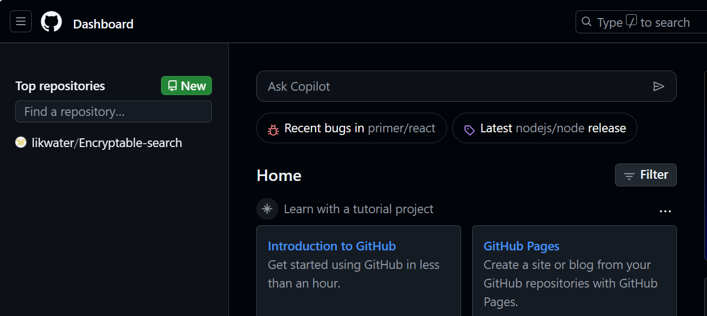
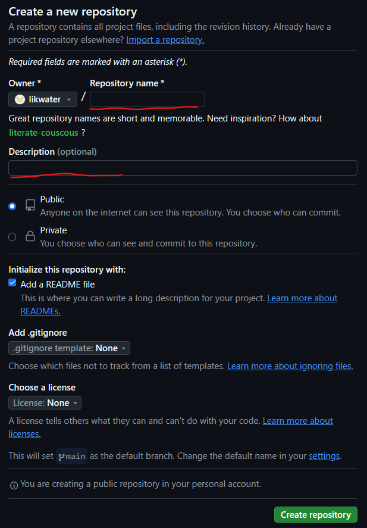
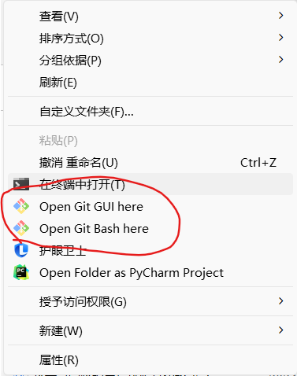
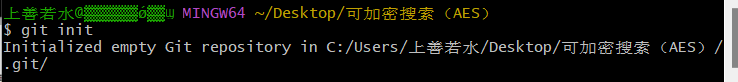
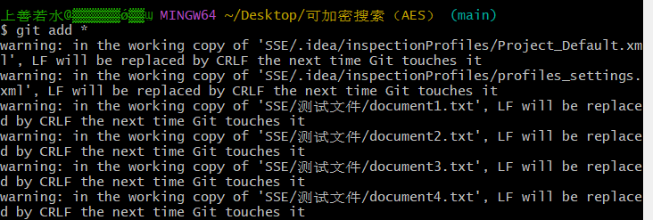
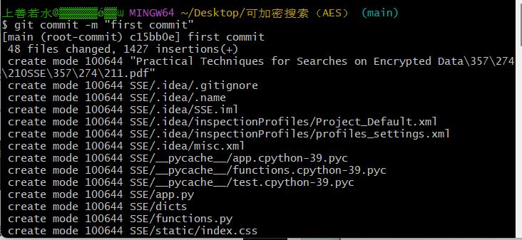
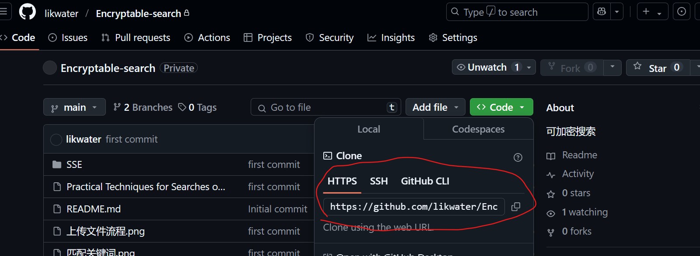
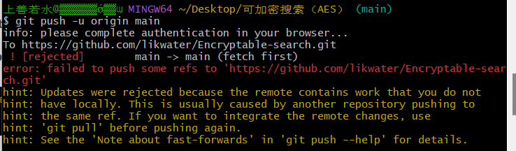

# 创建repository

1. 点击new后即可创建一个新的仓库
2. 填入仓库信息，Repository name是存储库的名字， Description是项目描述，下面记得勾选上，然后就可以点击Create repository  **（如果选择add README，那么一定要在自己上传的项目里面加一个相同内容的README文件，不然在上传项目输入命令：git push -u origin main的时候会报错，说rejected）**                                                                                

# 初次上传文件

## Open Git Bash here 

然后先打开你要上传的文件的路径，在文件内右击鼠标点击更多看到有红色方框的两个就说明安装成功，此时点击第二个Open Git Bash here                                                                                                                                      

## git init

然后输入如下指令`git init`创建一个初始文件夹来存放，成功后项目文件夹中会多一个**.git**的文件夹

## git add *

然后输入`git add *`，会将文件添加进去，这里会出现两种情况，一种像我这样有一大堆信息，但都是警告，没出错就行，另外一种是很顺利的什么也没有，但只要不报错就可以了

## 修改config

此时先回到刚刚生成的.git文件夹，然后点击进去找到config文件，用记事本打开，应该只有[core]那一块内容，[user]那一块是要我们自己添加进去的，email对应的就是GitHub的邮箱，name就是GitHub的账号。

```
[core]
	repositoryformatversion = 0
	filemode = false
	bare = false
	logallrefupdates = true
	symlinks = false
	ignorecase = true

[user]
email=1013188233@qq.com
name=likwater
```

## git commit -m "first commit"

然后接着输入`git commit -m "first commit"`，文件不断地加载

>1. **含义**   - 在`git commit -m "first commit"`命令中，`-m`是一个选项，用于指定提交的注释信息，`"first commit"`就是提交注释。
>2. **作用**
>   1. **记录变更内容**     提交注释用于描述这次提交做了什么。例如，`"first commit"`可能表示这是项目的第一次提交，它可能包含了项目的初始结构、基础配置文件等内容的添加。通过这个注释，你和其他协作者可以在查看版本历史时快速了解这次提交的主要目的。
>   2. **版本历史可读性**      在一个项目的版本控制历史中，会有很多次提交。有意义的提交注释可以让版本历史更具可读性。如果没有提交注释或者注释不明确，当你回顾版本历史时，就很难弄清楚每次提交都做了些什么，尤其是在大型项目中，这会给开发和维护带来很大的困难。
>   3. **协作沟通**     -在团队协作开发中，提交注释是一种重要的沟通方式。当你的队友查看版本库时，他们可以通过你的提交注释了解你的工作内容和进展情况，有助于团队成员之间更好地协调和合作。

## git remote add origin

然后输入`git remote add origin 对应的网址`，需要将对应的存储库中将网址复制过来。

最终输入命令：`git remote add origin https://github.com/likwater/Encryptable-search.git`

## git remote set-url origin git@github.com:likwater/your-repository.git(可选)

当输入push命令报错：fatal: unable to access 'https://github.com/likwater/Note.git/': OpenSSL SSL_read: SSL_ERROR_SYSCALL, errno 0

可以选择使用SSH链接来解决，输入命令`git remote set-url origin git@github.com:likwater/your-repository.git`，用仓库名替换 `your-repository`即可

## git push -u origin main

### 成功

输入`git push -u origin main`，此时如果你幸运的话就会不断的加载，就成功了。

### 出错

1. 这个错误提示表明，远程仓库包含一些本地没有的工作内容，在推送本地更改之前，远程仓库中的分支包含了一些本地没有的更改。                                                   
2. 如果在创建仓库的时候创建了readme，上传的项目里没有readme时容易出现这个问题。此时相当于远程仓库里有新的更改（创建了readme，这个是本地没有的更改），所以就会报错，无法直接上传

# 后续上传文件

## git add .

## git commit -m "Update project"

## git remote set-url origin git@github.com:likwater/your-repository.git(可选)

当输入push命令报错：fatal: unable to access 'https://github.com/likwater/Note.git/': OpenSSL SSL_read: SSL_ERROR_SYSCALL, errno 0

可以选择使用SSH链接来解决，输入命令`git remote set-url origin git@github.com:likwater/your-repository.git`，用仓库名替换 `your-repository`即可

## 推送到远程仓库

### git push origin main

正常将本地项目更新到github上。这个命令会将本地 `main` 分支的更改推送到远程仓库的 `main` 分支。这个操作通常是安全的，它会在不覆盖远程分支内容的情况下进行合并。如果远程分支有新的更改（即远程分支比本地分支领先），这个命令可能会被拒绝，要求您先拉取远程更改。

### git push --force origin main

如果需要覆盖远程仓库内容，可以使用 `--force` 标志（注意：这将丢失远程仓库中的所有更改，谨慎操作）。这个命令会强制将本地 `main` 分支的内容推送到远程仓库的 `main` 分支，无论远程分支的状态如何。它会覆盖远程分支的内容，使其与本地分支完全一致。由于这个命令会丢失远程分支中的任何新更改，因此必须非常谨慎使用强制推送。
