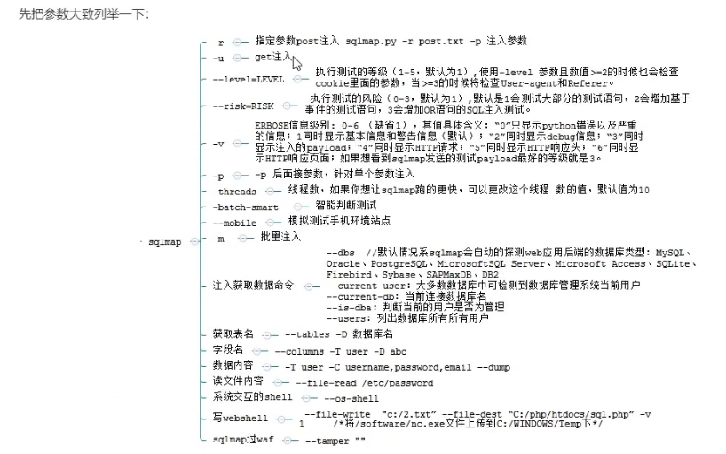

1. [网络安全-sqlmap学习笔记_sqlmap --no-cast-CSDN博客](https://blog.csdn.net/lady_killer9/article/details/106598738)
2. 除了sqlmap，还有一些其他好用的工具：
   1. Pangolin(穿山甲)（[SQL注入测试工具：Pangolin（穿山甲）_pangolin穿山甲渗透工具安装-CSDN博客](https://blog.csdn.net/yefan2222/article/details/7086833)）
   2. havij 胡萝卜注入工具（[胡萝卜 Havij 1.17 Pro 最新特别版 sql注入检查工具 下载-脚本之家 (jb51.net)](https://www.jb51.net/softs/63589.html)）

# 安装使用

1. [[ 渗透工具篇 ] sqlmap 详解(一) sqlmap 安装详解-阿里云开发者社区](https://developer.aliyun.com/article/1046052#:~:text=%E4%B8%89%E3%80%81%E5%AE%89%E8%A3%85%20sqlmap%201%201.%20%E4%B8%8B%E8%BD%BD%E5%AE%89%E8%A3%85%20sqlmap%202,2.%20%E6%8A%8A%E5%8E%8B%E7%BC%A9%E5%8C%85%E8%A7%A3%E5%8E%8B%EF%BC%88%E9%87%8D%E5%91%BD%E5%90%8D%EF%BC%89%EF%BC%8C%E6%94%BE%E5%9C%A8%E5%AE%89%E8%A3%85%E7%9A%84Python%E6%A0%B9%E7%9B%AE%E5%BD%95%E4%B8%8B%203%203.%20cmd%E5%91%BD%E4%BB%A4%E8%A1%8C%E8%BF%9B%E5%85%A5sqlmap%E5%B0%B1%E5%8F%AF%E4%BB%A5%E4%BD%BF%E7%94%A8%E4%BA%86%204%204.%20%E9%AA%8C%E8%AF%81%E5%AE%89%E8%A3%85%E6%88%90%E5%8A%9F)
2. 点击桌面快捷 方式，输入`python sqlmap.py -命令`

3. 网络安全-sqlmap学习笔记_sqlmap --no-cast-CSDN博客](https://blog.csdn.net/lady_killer9/article/details/106598738) 

4. kali上也自带了sqlmap，直接输入sqlmap命令即可（默认使用最新版，python3的），不用输入python，也不用输入.py。后面讲解的命令默认是kali中sqlmap的

   

# 使用方法

1. 在命令提示符中输

1. 入命令、配置参数：`sqlmap -命令 配置参数`即可

# `-r`参数

1. `sqlmap -r 存放http请求头的文件的地址 --配置参数`(通过burp将注入页面的请求头文件拦截下来并保存在本地。)

# `-batch-smart`参数

1. `-batch-smart`智能判断测试参数。功能齐全，能自动扫描注入点并抓取信息，但是耗时较长。这个指令会将所有数据库扒一遍，并且会将每一步的信息和数据全部给我们保存下来，在sqlmap>output>扫描端口地址>dump文件夹中

# `-u`参数

1. `sqlmap -u "url地址" --配置参数`
1. `sqlmap -u "url地址" --threads 5`指定使用的线程数为5（默认为1）。sqlmap默认最大线程数是10，可以通过调配置文件来修改最大线程数（配置文件地址："C:\anaconda\sqlmap\lib\core\settings.py"，参数名：MAX_NUMBER_OF_THREADS）

# `-m`参数

1. `sqlmap -m 存放多个网址的文件的地址`，可以对多个网址批量注入

# getshell（`--os-shell`参数）

1. 使用条件和手工注入的条件一样

   >1. mysql开启了`secure_file_priv=""`的配置，即允许sql语句进行文件读写的操作
   >2. 知道网站代码的真实物理路径
   >3. 物理路径具备写入权限
   >4. 最好是mysql的root用户，这个条件非必须，但是有最好

2. 命令语句：`sqlmap -r 存放http请求头的文件的地址 --os-shell `
3. sqlmap获取getshell原理：
   1. 上传一个文件，用于后续上传木马文件时使用
   2. 上传木马文件 
4. 还有一个可以通过`--file-write`和`--file-dest`木马文件写入到目标主机里，这种手法更类似手工注入

# --technique参数

1. sqlmap支持以下注入技术
   1. B：Boolean-based blind（基于布尔的盲注）
   2. E：Error-based（报错注入）
   3. U：Union query-based（联合查询注入）
   4. S：Stacked queries（堆叠查询注入）
   5. T：Time-based blind（基于时间的盲注）
   6. Q：Inline queries（内联查询注入）
   7. 使用多个技术时连着写即可
   8. eg：`--technique=BU`
2. 

