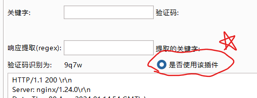
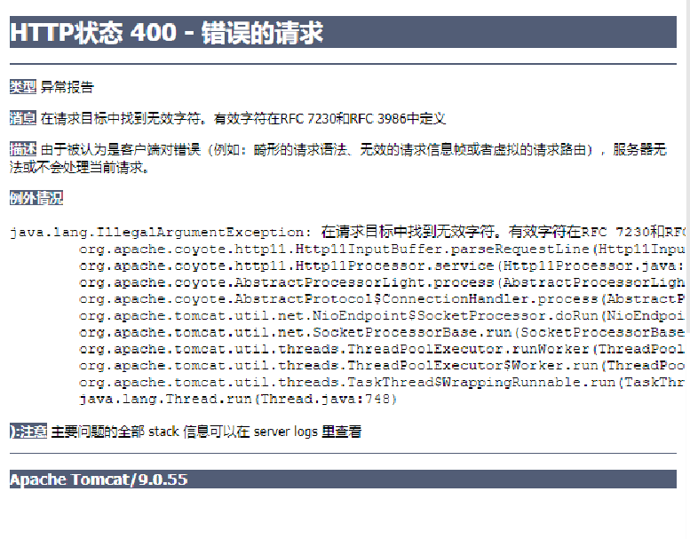

信息收集

工具：

1. fofa:收集资产：title="资产名"（收集资产），domain="域名"（收集子域名）ip="ip地址"(有3389或13389可能是rdp，可以远程控制)
2. 爬取脚本：fofa-hack_win_amd64.exe（爬fofa信息收集的）

cip.cc网址查询ip地址的基本信息

navicat

nexus：admin/admin123

# 资产

1. 海口美兰机场：
   1. https://hk.airport-media.cn/index.php（海口美兰机场广告网）
2. 三亚机场：
   1. http://www.syairporthotel.com/#p3（三亚凤凰机场酒店）
   2. https://pms.sanyaairport.com/login（三亚凤凰国际机场通行证申办管理系统）
3. 海南电网：
   1. 海南电力通信自动化有限公司（没找到官网）

# 三亚凤凰国际机场

## 搜索子域名

1. 通过https://dnsdumpster.com/搜索子域名，找到：
   1. 三亚凤凰国际机场智慧机坪监管系统：https://gms.sanyaairport.com/login
   2. 三亚凤凰国际机场通行证申办管理系统：https://pms.sanyaairport.com/login

## 抓包，判断数据的传输

1. 密码是进行了加密才传输的：
   1. 通过查看后台源码，发现密码的加密流程：
      1. 在密码的后面拼接`jwzl`
      2. 然后32位md5加密，输出格式是hex（**注意：输出的hex格式中字母全是大写**）
      3. 然后是SM4加密：
         1. key: "JeF8U9wHFOMfs2Y9",
         2. mode: "cbc",
         3. iv: "UISwD9fW6cFh9SNA",
         4. cipherType: "base64"
      4. 最后对加密结果的特殊字符进行url编码
2. 账户或密码错误，返回的响应中：msg_error返回乱码；验证码错误：msg_error返回空
3. 流程：
   1. 输入账户密码、验证码
   2. 错误后，响应
   3. 然后自动发送验证码的请求头
   4. 获取验证码响应
4. 通过尝试：返现验证码应该是几分钟内都有效（可能是3分钟）。因为我通过burp和网页不断发送请求得到多个验证码，然后连续使用这些验证码，这些验证码都可以通过网页验证

## 验证码识别

1. 将获取验证码识别的请求文件通过：右键 -> 扩展 -> captcher-killer -> captcher-killer -> captcher-killer panel发送到captcher-killer中
2. 运行codereg.py文件（我放在python文件夹中）
3. 转到captcher-killer中
   1. 在url验证码那儿先点击获取，获取验证码
   2. 在url接口那儿，先右键，选择模板库：ddddocr，再点击识别，如果顺利，即可在response raw和右边侧边栏和coderg的运行结果中获取识别结果

## 爆破登录页面

[常用爆破用户名弱口令字典-CSDN博客](https://blog.csdn.net/qq_48550824/article/details/132575720)

1. 将登录页面的请求转到intruder

2. 选择两个参数（password和code(验证码)）作为payload，其中code在位置中是payload2

3. 用户名loginname选择官网投诉邮箱：syjcts@sanyaairport.com。payload1选择简单列表或指定文件，注意password要经过加密才能作为payload参与爆破。payload2选择扩展生成payload，选择captcher（**注意，此时扩展captcher中要将"验证码识别为"旁边的是否使用该插件勾选，不然只能直接使用该插件，在爆破时无法调用该插件**）                                                                                                                            

4. 爆破时，响应长度是300时，是验证码错误；响应长度是308时，是账户或密码错误；

5. 当验证码是乱码时，页面会响应400，还会包含一些其他信息：

   1. Web服务器和Servlet容器是：Apache Tomcat/9.0.55

      

# 海南银行

1. 资产：
   1. 海南银行：
      1. www.hnbankchina.com.cn.huaernc.com（海南银行_欢迎访问海南银行官方网站）
      2. https://154.91.83.122（海南银行_欢迎访问海南银行官方网站）
      3. https://154.91.83.122（海南银行交易所）
      4. https://202.100.231.26（海南银行外网邮件系统）
   2. 海南农商银行
      1. https://hainanbank.com.cn（海南农商银行）
      2. https://153.0.128.180（海南农商银行邮件系统）
   3. 海南中石化
      1. www.sinopecselas.com（中国石化加油卡网上充值营业厅_中石化加）
      2. 123.235.10.74:8082（中石化物流管理平台）
      3. 116.62.145.51（中石化智能作业管理系统）
         1. 用户：admin
         2. 密码：admin123