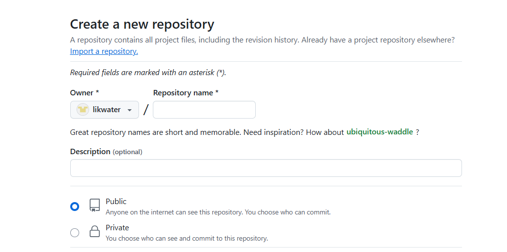

[使用 Hexo+GitHub 搭建个人免费博客教程（小白向） - 知乎 (zhihu.com)](https://zhuanlan.zhihu.com/p/60578464)

# 下载并配置hexo

## 下载

`npm install -g hexo-cli`

## Hexo初始化和本地预览

1. 创建博客的本地文件夹
2. 在文件夹中运行命令

```
初始化并安装所需组件：
hexo init      # 初始化
npm install    # 安装组件

完成后依次输入下面命令，启动本地服务器进行预览：
hexo g   # 生成页面
hexo s   # 启动预览
```

## Hexo博客文件夹目录结构

>.
>
>├── .deploy
>├── public
>├── source
>│   ├── _posts      // 存放文章的文件夹
>│   ├── about       // 存放关于页面的文件夹
>│   ├── categories  // 存放分类页面的文件夹
>│   ├── tags        // 存放标签页面的文件夹
>│   └── themes      // 存放主题的文件夹
>├── themes          // 主题文件夹
>│   ├── landscape    // 默认主题文件夹
>│   │   ├── layout
>│   │   ├── scripts
>│   │   ├── source
>│   │   └── ...
>│   └── your_theme    // 自定义主题文件夹
>├── _config.yml     // Hexo 配置文件
>├── package.json    // 包管理文件
>└── scaffolds       // 模板文件夹

# 创建GitHub仓库

Repository name 中输入 `likwater.github.io`。选择public

# 部署 Hexo 到 GitHub Pages

## 安装 hexo-deployer-git

在博客的本地文件夹中打开git bash，输入命令`npm install hexo-deployer-git --save`

## 修改 _config.yml

然后修改 _config.yml文件末尾的 Deployment 部分，修改成如下：

```
deploy:
  type: git
  repository: git@github.com:likwater/likwater.github.io.git
  branch: master
```

## 将网站上传部署到 GitHub Pages

输入命令`hexo d`

# 访问博客

https://likwater.github.io/

# 开始使用

## 发布文章

### 命令行创建

1. 在博客本地文件夹目录打开git bash，输入命令`hexo new "文件名"`，然后 source 文件夹中会出现一个 对应文件名的.md 文件，就可以使用 Markdown 编辑器在该文件中撰写文章了。命令行生成会有部分文章信息

### 手动创建

也可以不使用命令自己创建 .md 文件，只需在文件开头手动加入如下格式 Front-matter 即可，写完后运行 `hexo g` 和 `hexo d` 发布。

```
---
title: Hello World # 标题
date: 2019/3/26 hh:mm:ss # 时间
categories: # 分类
- Diary
tags: # 标签
- PS3
- Games
---

摘要
<!--more-->
正文
```

### 文章信息模板

```
---
title: 
author: catsky
cover: '' #封面
categories:
  - 
tags:
  - 
date: YYYY-MM-DD HH:MM:SS
---
```

### 上传文章

1. 写完后运行下面代码将文章渲染并部署到 GitHub Pages 上完成发布。

```
以后每次发布文章都是这几条命令。
# 清除缓存（可选）
# 重新生成
# 部署

hexo clean  
hexo g      
hexo d     
```

### 正确上传文章中的图片

1. 安装hexo-asset-image插件`npm install hexo-asset-image --save`
2. 修改插件的代码：将 /node_modules/hexo-asset-image/index.js 代码修改为

```
'use strict';
var cheerio = require('cheerio');

// http://stackoverflow.com/questions/14480345/how-to-get-the-nth-occurrence-in-a-string
function getPosition(str, m, i) {
  return str.split(m, i).join(m).length;
}

var version = String(hexo.version).split('.');
hexo.extend.filter.register('after_post_render', function(data){
  var config = hexo.config;
  if(config.post_asset_folder){
    var link = data.permalink;
    if(version.length > 0 && Number(version[0]) == 3)
      var beginPos = getPosition(link, '/', 1) + 1;
    else
      var beginPos = getPosition(link, '/', 3) + 1;
    // In hexo 3.1.1, the permalink of "about" page is like ".../about/index.html".
    var endPos = link.lastIndexOf('/') + 1;
    link = link.substring(beginPos, endPos);

    var toprocess = ['excerpt', 'more', 'content'];
    for(var i = 0; i < toprocess.length; i++){
      var key = toprocess[i];

      var $ = cheerio.load(data[key], {
        ignoreWhitespace: false,
        xmlMode: false,
        lowerCaseTags: false,
        decodeEntities: false
      });

      $('img').each(function(){
        if ($(this).attr('src')){
          // 将 Windows 下的 '\' 替换为 '/'
          var src = $(this).attr('src').replace('\\', '/');
          if(!/http[s]*.*|\/\/.*/.test(src) &&
             !/^\s*\//.test(src)) {
            // 对于 "about" 页面，src 的第一部分不能被移除，同时支持多级目录。
            // 修改处：注释掉下面这几行（删除 srcArray.shift()），保留完整的目录结构
            var srcArray = src.split('/').filter(function(elem){
              return elem != '' && elem != '.';
            });
            // if(srcArray.length > 1)
            //   srcArray.shift();
            src = srcArray.join('/');
            $(this).attr('src', config.root + link + src);
            console.info && console.info("update link as:-->" + config.root + link + src);
          }
        } else{
          console.info && console.info("no src attr, skipped...");
          console.info && console.info($(this));
        }
      });
      data[key] = $.html();
    }
  }
});

```

## 网站设置

包括网站名称、描述、作者、链接样式等，全部在网站目录下的 _config.yml 文件中，参考[配置 | Hexo](https://hexo.io/zh-cn/docs/configuration)按需要编辑。

**注意：冒号后要加一个空格！**

## 更换主题配置博客

在[Themes | Hexo](https://hexo.io/themes/)选择一个喜欢的主题，比如[Butterfly 文檔(一) 快速開始 | Butterfly](https://butterfly.js.org/posts/21cfbf15/)，[【Hexo】Hexo搭建Butterfly主题并快速美化_hexo butterfly-CSDN博客](https://blog.csdn.net/mjh1667002013/article/details/129290903)，[Hexo博客之Butterfly主题配置及美化 | Yime's Blog (r1ce.cn)](https://blog.r1ce.cn/aa98fabcce67/)

```
hexo new page tags
hexo new page categories
hexo new page link
hexo new page about
```

**注意：在设置分类和标签页面时，在通过命令：`hexo new page categories`和`hexo new page tags`生成页面后，要打开对应的index.md文件，在文件中添加：type: "categories"和type: "tags"**

## 配置文章链接

打开_config.yml文件，将url修改为网站的url即可.assets/image-20250304101050040.png)

修改完后结果如图所示.assets/image-20250304100948569.png)

## 常用命令

```
hexo new "name"       # 新建文章
hexo new page "name"  # 新建页面
hexo g                # 生成页面
hexo d                # 部署
hexo g -d             # 生成页面并部署
hexo s                # 本地预览
hexo clean            # 清除缓存和已生成的静态文件
hexo help             # 帮助
```

