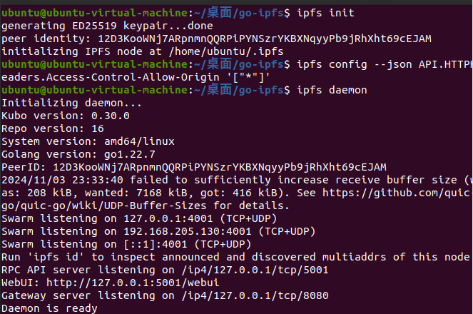
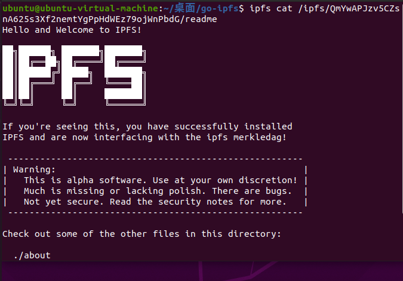
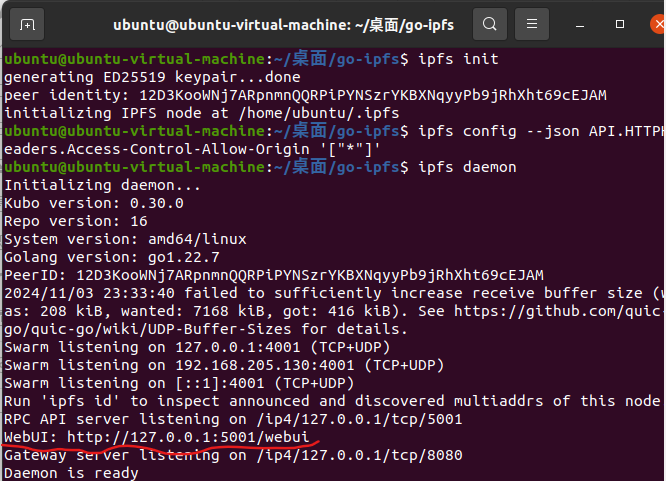
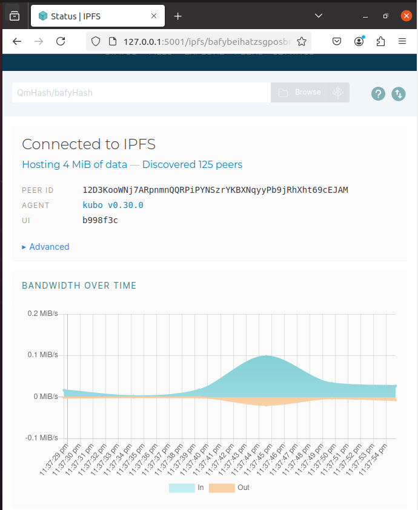

# 下载

[/ipns/dist.ipfs.tech/go-ipfs/v0.30.0/](https://dist.ipfs.tech/go-ipfs/v0.30.0/)

# 解压、安装（ubuntu）

1. 解压命令 : `tar xvfz go-ipfs_v0.30.0_linux-amd64.tar.gz `
2. 在解压的文件夹中的根目录下输入命令：`./install.sh`
3. 输入`ipfs`，运行成功则说明安装成功

# 检验

1. 检验：如果你的安装和设置成功，当运行 `ipfs daemon` 后，IPFS 服务器应该会启动并在 5001 端口监听

   ```
   ipfs init
   ipfs config --json API.HTTPHeaders.Access-Control-Allow-Origin '["*"]'
   ipfs daemon
   ```



2. 打开另一个终端输入`ipfs cat /ipfs/QmYwAPJzv5CZsnA625s3Xf2nemtYgPpHdWEz79ojWnPbdG/readme`会出现下面这个页面                                                                                                       

3. 浏览器进入`http://localhost:5001/webui`，IPFS 也有一个漂亮的 UI 前端                       