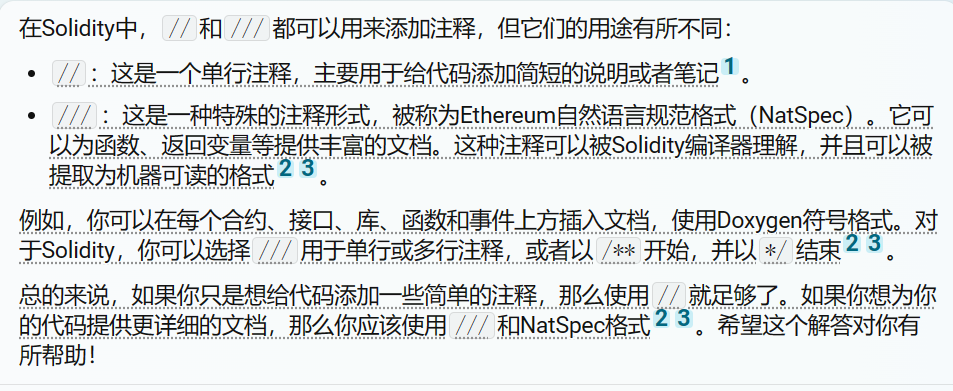
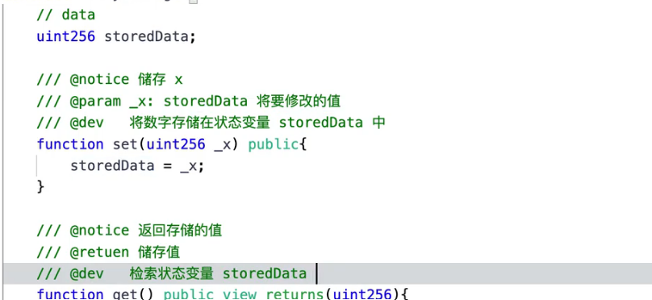
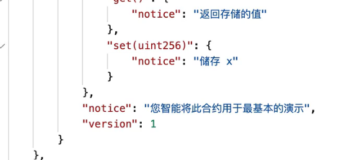
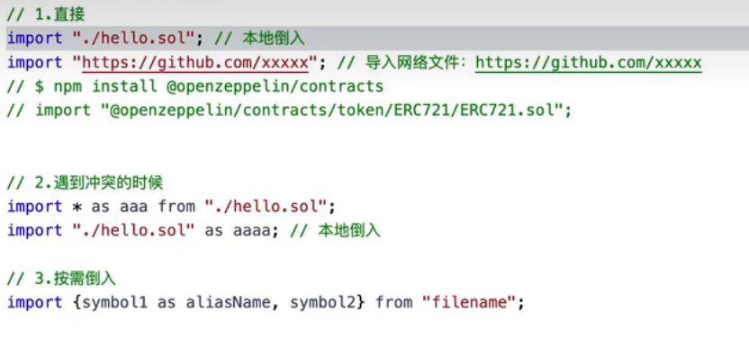
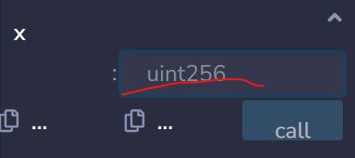
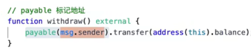
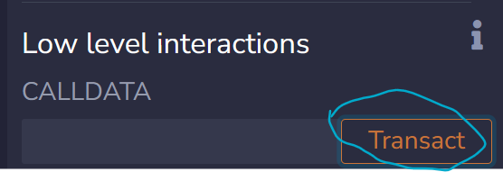
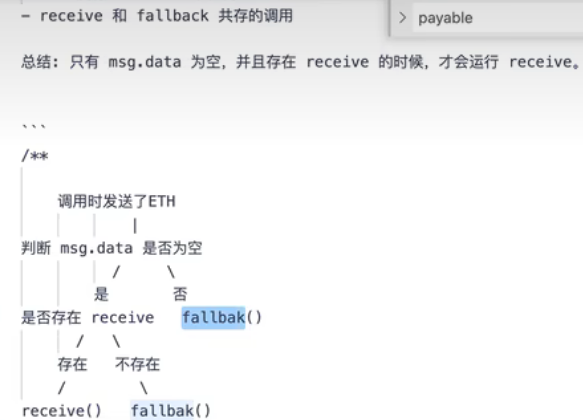
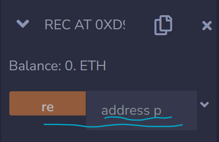
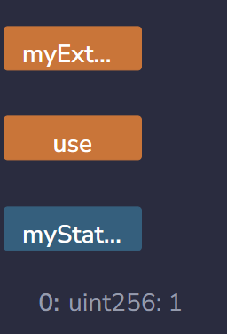

[solidity极简入门 | WTF Academy](https://www.wtf.academy/solidity-start/HelloWeb3/)

### 注释：
1. 单行注释：‘//’（和c++一样）
2. 多行注释：‘/* */ ’（和c++一样）
3. natspec注释：
    1. 使用：单行注释：‘ /// ’；多行注释：‘/**  */’
    2. 标签形式：
        1. /// @title ： 注释合约作用
        2. /// @notice ：注释作者
        3. /// @return ：注释返回值
        4. ……
4. 区别：                                                                                最终会单独生成一个文件，类似网页控制台中每个值的表示方法。eg：                                                                             此文件在artifacts文件夹中的build-info文件中

### 代码运行顺序
1. 代码的执行顺序主要由函数调用的顺序决定。当一个函数被调用时，它的代码会被执行。如果这个函数调用了其他的函数，那么这些被调用的函数的代码也会被执行。                                                                                                                                             其中红色的deposit1代表可接受以太坊的函数，左边图片中四个彩色图标即代表合约中的函数，点击即代表调用。右边图片中account代表调用地址（和当前合约地址不同），value代表转递的以太币的值（需要payable关键字）

### 合约结构
#### 版权声明
1. 代码第一行：// SPDX-License-Identifier: MIT（MIT代表版权开源）
2. 不开源：unlicense
3. 这只是一个申明，一个君子协定

#### 版本限制
1. pragma solidity ^0.8.21;  ：solidity的版本只能在0.8.21到0.9.00之间
2. pragma solidity 0.8.21; : 指定版本

#### 合约（contract）关键字
1. contract Name{ ……}。其中name是合约的名字，任意取，一般首字母大写。

##### 状态变量
1. uint256等状态变量

##### function（函数）
##### this关键字
1. this本身代表当前合约
2. adress（this）：代表当前合约的地址

##### type关键字
1. name
2. creationCode
3. runtimeCode

#### import（导入申明）
1. 全局导入（和python类似）
2. 导入方法：                                                                                                            使用时，直接使用导入文件中的合约即可

#### library（库合约）
### 全局的以太币单位
1. 最小单位：1wei
2. 1 ETH = 10^18 wei
3. 变量使用的以太币单位

### 查看合约中变量的值
#### 合约中的状态变量
1. 定义变量时加上public属性（最简单的方法）。如果是数组话，在查询时                                                                                                                              空格处要输入查询数组中特定元素的索引。如查第一个元素，则输入0。然后点击call即可
2. 也可以通过创建一个函数来查询（在查询数组时，returns中类型要加上memory。<font style="color:rgb(17, 17, 17);">数组作为函数返回值时，需要指定数据位置为 </font>**<font style="color:rgb(17, 17, 17);">memory</font>**<font style="color:rgb(17, 17, 17);">。</font>）：

```plain
// SPDX-License-Identifier: MIT
pragma solidity ^0.8.17;

contract MyContract {
    uint[] x = [1,2,3]; // 状态变量：数组 x

    function getX() public view returns (uint[] memory) {
        return x;
    }
}

```

> 在Solidity中，如果一个函数没有view或pure关键字，那么它会被视为一个可以改变合约状态的函数。这意味着，当你调用这样的函数时，你实际上是在发送一个交易。因为交易需要被挖矿并添加到区块链上，所以它们不会立即返回结果。这就是为什么你在删除view关键字后无法立即看到x的值的原因。相反，view函数是只读的，它们不会改变合约的状态。当你调用一个view函数时，你实际上是在进行一个调用（call），而不是一个交易（transaction）。调用会立即返回结果，而不需要等待挖矿或确认。因此，如果你想要立即看到x的值，你应该保留view关键字，
>

#### 函数中的局部变量
1. 在Solidity中，函数内部的局部变量（包括memory和storage类型的变量）只在函数执行期间存在，函数执行完毕后，这些变量就会被销毁。因此，我们无法直接在函数外部访问或查询这些变量的值。然而，你可以通过在函数内部将这些变量的值赋给状态变量，然后在函数外部查询状态变量的值，从而间接地“查询”这些局部变量的值。例如：

```plain
// SPDX-License-Identifier: MIT
pragma solidity ^0.8.17;

contract MyContract {
    uint public a; // 状态变量：a

    function f() public {
        uint b = 123; // 局部变量：b
        a = b; // 将b的值赋给a
    }
}
```

### 接受ETH
#### payable关键字
1. payable标记函数：可以使函数能够接受以太坊（以太币）
2. payable标记地址：                                                                                               使当前地址的以太币转到payable标记的地址中
3. 使用代码示例：

```plain
// SPDX-License-Identifier: MIT
pragma solidity ^0.8.17;

contract Payable{
    //标记函数
    function deposit1() external payable {}

    function deposit2() external {}

    //标记地址
    function withdraw() external {
        payable(msg.sender).transfer(address(this).balance);
    }

    //通过balance属性查看余额
    function getbalance() external view returns (uint256) {
        return address(this).balance;
    }
} 
```

    1. 在Solidity中，<font style="background-color:#FCE75A;">.balance</font>是一个属性，可以用来获取一个地址（包括合约地址）当前的以太币余额。例如，address(this).balance会返回当前合约地址的以太币余额
    2. address(this)指的是当前合约的地址
    3. msg.sender指的是当前<font style="background-color:#FCE75A;">调用</font>合约的地址
    4. <font style="color:rgb(17, 17, 17);">调用合约的地址和当前合约的地址通常是不同的。在Solidity中，msg.sender是</font><font style="color:rgb(17, 17, 17);background-color:#CEF5F7;">调用</font><font style="color:rgb(17, 17, 17);">当前函数的地址，而address(this)是当前合约的地址。例如，如果一个外部账户（比如一个用户或者另一个合约）调用了一个函数，那么在那个函数内部，msg.sender就会是那个账户的地址。而address(this)始终指的是当前合约的地址。</font>
    5. <font style="color:rgb(17, 17, 17);">编译后的结果：                                                                                           </font><font style="color:rgb(17, 17, 17);">其中红色的deposit1代表可接受以太坊的函数，左边图片中四个彩色图标即代表合约中的函数，点击即代表调用。右边图片中account代表调用地址（和当前合约地址不同），value代表转递的以太币的值（需要payable关键字），在此代码中即调用deposit1，转递给该合约的以太币的值</font>

#### fallback关键字<font style="background-color:#1DC0C9;"></font>
1. 语法：
    1. 不带参数：<font style="background-color:#FCE75A;">fallback()  external  [payable] {}</font>（可加payable，也可以不加，此时没有function关键字，只有fallback）
    2. 带参数：<font style="background-color:#FCE75A;">fallback(bytes calldata input)  external  [payable]  returns(bytes  memory output) {{}</font>
    3. msg.data 可以通过abi.decode( [4: ] )来解码
    4. 绕过deposit的payable，直接通过fallback传输以太坊（）                      

```plain
event Log(string funName, address from, uint256 value, bytes data);
fallback() external payable {
        emit Log("fallback",msg.sender, msg.value, msg.data);
    }
```

> 1. **<font style="color:rgb(17, 17, 17);">event Log(string funName, address from, uint256 value, bytes data);</font>**<font style="color:rgb(17, 17, 17);">：这是一个事件的定义。在以太坊智能合约中，事件是一种在合约中存储日志信息的方式。当这个事件被调用时，它会把参数</font>**<font style="color:rgb(17, 17, 17);">funName</font>**<font style="color:rgb(17, 17, 17);">（函数名），</font>**<font style="color:rgb(17, 17, 17);">from</font>**<font style="color:rgb(17, 17, 17);">（发送者地址），</font>**<font style="color:rgb(17, 17, 17);">value</font>**<font style="color:rgb(17, 17, 17);">（发送的以太币数量）和</font>**<font style="color:rgb(17, 17, 17);">data</font>**<font style="color:rgb(17, 17, 17);">（附加数据）记录到区块链上。</font>
> 2. **<font style="color:rgb(17, 17, 17);">fallback() external payable { emit Log("fallback",msg.sender, msg.value, msg.data); }</font>**<font style="color:rgb(17, 17, 17);">：这是一个fallback函数的定义。fallback函数是合约中的一个特殊函数，当合约接收到以太币，或者调用了合约中不存在的函数时，就会触发fallback函数。在这个函数中，它触发了前面定义的Log事件，并传入了"fallback"作为函数名，</font>**<font style="color:rgb(17, 17, 17);">msg.sender</font>**<font style="color:rgb(17, 17, 17);">作为发送者地址，</font>**<font style="color:rgb(17, 17, 17);">msg.value</font>**<font style="color:rgb(17, 17, 17);">作为发送的以太币数量，</font>**<font style="color:rgb(17, 17, 17);">msg.data</font>**<font style="color:rgb(17, 17, 17);">作为附加数据。</font>
>
> <font style="color:rgb(17, 17, 17);">总的来说，这段代码的主要作用是，当合约接收到以太币，或者调用了不存在的函数时，记录一些相关信息到区块链上。</font>
>

<font style="color:rgb(17, 17, 17);">remix中transact的用法</font>

> 在Solidity中，fallback函数和receive函数是两种特殊的函数。它们都没有function关键字，并且必须具有external可见性，即允许被外部合约调用<font style="color:rgb(17, 17, 17);">。</font>
>
> <font style="color:rgb(17, 17, 17);">receive函数只在合约转账时调用</font><font style="color:rgb(17, 17, 17);">，而fallback函数除了可以在合约转账时调用外，在合约没有函数匹配或需要向合约发送附加数据时，也调用fallback函数</font><font style="color:rgb(17, 17, 17);">。</font>
>
> <font style="color:rgb(17, 17, 17);">在Remix IDE中，transact按钮用来发送交易</font><font style="color:rgb(17, 17, 17);">。当你点击transact按钮时，如果没有指定调用任何函数（即calldata为空），则会执行receive函数（如果存在）或fallback函数</font><font style="color:rgb(17, 17, 17);">。</font>
>
> <font style="color:rgb(17, 17, 17);">因此，如果你的合约中没有定义receive函数或fallback函数，那么在Remix IDE中，你将无法使用transact按钮来发送不包含函数调用的交易</font><font style="color:rgb(17, 17, 17);">。这就是为什么加了</font>**<font style="color:rgb(17, 17, 17);">fallback</font>**<font style="color:rgb(17, 17, 17);">关键字的函数后才能使用</font>**<font style="color:rgb(17, 17, 17);">transact</font>**<font style="color:rgb(17, 17, 17);">，而</font>**<font style="color:rgb(17, 17, 17);">function</font>**<font style="color:rgb(17, 17, 17);">下的函数不能使用的原因。</font>
>

<font style="color:rgb(17, 17, 17);">fallback() external {}和fallback() external payable{}的区别，以及fallback() external {}的作用</font>

> <font style="color:rgb(17, 17, 17);">在Solidity中，fallback()函数会在调用合约不存在的函数时被触发。它可以用于接收ETH，也可以用于代理合约proxy contract</font>
>
> + <font style="color:rgb(17, 17, 17);">fallback() external {}：这种形式的fallback函数不能接收ETH，因为它没有payable修饰符</font><font style="color:rgb(17, 17, 17);">。</font>
> + <font style="color:rgb(17, 17, 17);">fallback() external payable {}：这种形式的fallback函数可以接收ETH，因为它有payable修饰符</font><font style="color:rgb(17, 17, 17);">。</font>
>
> <font style="color:#000000;">如果在一个合约的调用中，没有其他函数与给定的函数标识符匹配时（或没有提供调用数据），fallback()函数会被执行</font><font style="color:#000000;">。</font><font style="color:#000000;">因此，fallback() external {}函数可以用于处理合约中未定义的函数调用，或者作为一个默认的函数来处理一些预期之外的情况</font>[<font style="color:#000000;">1</font>](https://blog.csdn.net/ling1998/article/details/125488149)<font style="color:#000000;">。然而，由于它没有payable修饰符，所以它不能接收以太币</font>
>

#### receive关键字
1. 只负责接受主币
2. <font style="background-color:#FCE75A;">receive() external payable {}</font> ( payable是必须的，没有function关键字）
3. receive被调用时不存在msg.data，所以用空字符串代替

```plain
event Log(string funName, address from, uint256 value, bytes data);
receive() external payable {
        emit Log("receive",msg.sender, msg.value, "");
    }
```

#### receive和fallback的共存调用
1.                                                           
2. msg.data对应remix中的calldata输入的值

> msg.data在Solidity中是一个全局变量，它的值为完整的calldata（调用函数时传入的数据）。在Remix IDE中，当你发起一笔合约交易后，展开交易内容，看到的input值就是CALLDATA。所以，msg.data对应的就是Remix中的calldata<font style="color:rgb(17, 17, 17);">。</font>
>

### selfdestruct合约自毁
1. 销毁合约
2. 把合约的所有资金强制发送到目标地址
3. 调用函数后，合约销毁，且把合约的所有资金强制发送到目标地址

```plain
function kill() external {
        selfdestruct(payable(msg.sender));
}
```

4. 除非必要，不建议销毁合约。销毁合约后，向该合约赚钱后，钱就永远在其中了，无法取出。
5. 从其他合约调用该合约中的kill函数，并销毁该合约将以太币转入另一合约
    1. 代码

```plain
// SPDX-License-Identifier: MIT
pragma solidity ^0.8.17;

contract Pay{

    receive() external payable {}

    function kill() external {
        selfdestruct(payable(msg.sender));
    }
}

contract Rec{
    function re(Pay p) external {
        p.kill();
    }
}

```

6. 原理，解释：

> <font style="color:#000000;">Solidity中，函数参数前的下划线_没有特殊含义。一些程序员选择在所有函数参数前使用下划线，作为一种约定，以表示它们是函数参数</font><font style="color:#000000;">。这也常常用于避免命名冲突</font><font style="color:#000000;">。</font>
>
> **<font style="color:#000000;">Rec</font>**<font style="color:#000000;">合约中的</font>**<font style="color:#000000;">re</font>**<font style="color:#000000;">函数，</font>**<font style="color:#000000;">p</font>**<font style="color:#000000;">是一个参数，类型为</font>**<font style="color:#000000;">Pay</font>**<font style="color:#000000;">。</font>**<font style="color:#000000;">Pay</font>**<font style="color:#000000;">是你定义的另一个合约，所以这里</font>**<font style="color:#000000;">p</font>**<font style="color:#000000;">是</font>**<font style="color:#000000;">Pay</font>**<font style="color:#000000;">合约的一个实例。你可以通过这个实例来调用</font>**<font style="color:#000000;">Pay</font>**<font style="color:#000000;">合约中的函数。</font><font style="color:#000000;">在Remix中，当你调用Rec合约的re函数时，需要提供一个Pay合约的地址。这个地址应该是已经部署的Pay合约的地址。你可以在Remix的部署和运行交易模块中找到已部署合约的地址。在调用re函数时，将</font>**<font style="color:#000000;">Pay</font>**<font style="color:#000000;">合约的地址复制到address p的输入框中，然后点击re按钮，就可以调用这个函数了</font><font style="color:#000000;">。这样，</font>**<font style="color:#000000;">re</font>**<font style="color:#000000;">函数就会在给定的</font>**<font style="color:#000000;">Pay</font>**<font style="color:#000000;">合约上调用</font>**<font style="color:#000000;">kill</font>**<font style="color:#000000;">函数。这就是</font>**<font style="color:#000000;">re</font>**<font style="color:#000000;">函数中的</font>**<font style="color:#000000;">p.kill()</font>**<font style="color:#000000;">的含义。这里的</font>**<font style="color:#000000;">p</font>**<font style="color:#000000;">是</font>**<font style="color:#000000;">Pay</font>**<font style="color:#000000;">合约的一个实例，</font>**<font style="color:#000000;">kill</font>**<font style="color:#000000;">是</font>**<font style="color:#000000;">Pay</font>**<font style="color:#000000;">合约中的一个函数。所以</font>**<font style="color:#000000;">p.kill()</font>**<font style="color:#000000;">就是在</font>**<font style="color:#000000;">p</font>**<font style="color:#000000;">所代表的</font>**<font style="color:#000000;">Pay</font>**<font style="color:#000000;">合约上调用</font>**<font style="color:#000000;">kill</font>**<font style="color:#000000;">函数。</font><font style="color:#000000;">       </font>                                                          

### 常用关键词
#### view：
在Solidity中，view关键词用于函数，表示该函数不会修改状态。这意味着你不会发送以太币，修改状态变量，或发出事件。当你只是想让函数显示一些东西，而不干扰/改变代码中的其他任何东西时，你可以使用view关键词

#### return：
1. returns：标记方法（function），位置在方法的最后。当我们需要在方法中引用返回值时：returns（类型 变量名，类型 变量名，……），这样在函数中引用返回值不需要定义；如果不需要，直接返回，则可以returns(类型，类型，……）。
2. <font style="color:rgb(17, 17, 17);">在Solidity中，</font>**<font style="color:rgb(17, 17, 17);">return</font>**<font style="color:rgb(17, 17, 17);">语句用于从函数返回一个值。这个返回的值不会被存储在区块链上，而是会被发送回调用该函数的代码。</font>
3. <font style="color:rgb(17, 17, 17);">solidity中同样以return作为函数的结尾，后面的代码不在执行。</font>
4. <font style="color:rgb(17, 17, 17);">在 Solidity 中，数组作为函数返回值时，需要指定数据位置为 </font>**<font style="color:rgb(17, 17, 17);">memory</font>**<font style="color:rgb(17, 17, 17);">。</font>

```plain
// SPDX-License-Identifier: MIT
pragma solidity ^0.8.17;

contract MyContract {
    uint[] x = [1,2,3]; // 状态变量：数组 x

    function fStorage() public returns(uint[] memory){
        //声明一个storage的变量 xStorage，指向x。修改xStorage也会影响x
        uint[] storage xStorage = x;
        xStorage[0] = 100;
        return xStorage;
    }
}
```

### 变量
1. 使用变量前都必须定义，才能使用，和c++类似。
2. 状态变量是合约级变量，在函数外，合约内。

#### 地址类型
1. 地址类型(address)存储一个 20 字节的值（以太坊地址的大小）。地址类型也有成员变量，并作为所有合约的基础。有普通的地址和可以转账ETH的地址（payable）。其中，payable修饰的地址相对普通地址多了transfer和send两个成员。在payable修饰的地址中，send执行失败不会影响当前合约的执行（但是返回false值，需要开发人员检查send返回值）。balance和transfer()，可以用来查询ETH余额以及安全转账（内置执行失败的处理）。

```plain
    // 地址
    address public _address = 0x7A58c0Be72BE218B41C608b7Fe7C5bB630736C71;
    address payable public _address1 = payable(_address); // payable address，可以转账、查余额
    // 地址类型的成员
    uint256 public balance = _address1.balance; // balance of address
```

> 1. **<font style="color:rgb(17, 17, 17);">address public _address = 0x7A58c0Be72BE218B41C608b7Fe7C5bB630736C71;</font>**<font style="color:rgb(17, 17, 17);">：这行代码定义了一个公开的地址变量</font>**<font style="color:rgb(17, 17, 17);">_address</font>**<font style="color:rgb(17, 17, 17);">，并将其初始化为</font>**<font style="color:rgb(17, 17, 17);">0x7A58c0Be72BE218B41C608b7Fe7C5bB630736C71</font>**<font style="color:rgb(17, 17, 17);">。在以太坊中，地址通常用于标识账户，包括外部账户（由私钥控制）和合约账户（由合约代码控制）。</font>
> 2. **<font style="color:rgb(17, 17, 17);">address payable public _address1 = payable(_address);</font>**<font style="color:rgb(17, 17, 17);">：这行代码定义了一个公开的可支付地址变量</font>**<font style="color:rgb(17, 17, 17);">_address1</font>**<font style="color:rgb(17, 17, 17);">，并将其初始化为</font>**<font style="color:rgb(17, 17, 17);">_address</font>**<font style="color:rgb(17, 17, 17);">。可支付地址与普通地址的区别在于，它们可以接收Ether（以太坊的原生加密货币）。</font>**<font style="color:rgb(17, 17, 17);">payable</font>**<font style="color:rgb(17, 17, 17);">关键字用于将普通地址转换为可支付地址。</font>
> 3. **<font style="color:rgb(17, 17, 17);">uint256 public balance = _address1.balance;</font>**<font style="color:rgb(17, 17, 17);">：这行代码定义了一个公开的无符号整数变量</font>**<font style="color:rgb(17, 17, 17);">balance</font>**<font style="color:rgb(17, 17, 17);">，并将其初始化为</font>**<font style="color:rgb(17, 17, 17);">_address1</font>**<font style="color:rgb(17, 17, 17);">的余额。在以太坊中，你可以通过</font>**<font style="color:rgb(17, 17, 17);">.balance</font>**<font style="color:rgb(17, 17, 17);">成员访问任何地址的Ether余额。</font>
>

2. 0地址（地址为空）：address(0)
3. _address1和_address的区别（下面两段代码等价）：

> function hellow() public {
>
> <font style="color:#DF2A3F;">  _address1 = payable(_address); // payable address，可以转账、查余额</font>
>
> <font style="color:#DF2A3F;">  _address1.transfer(address(this).balance);</font>
>
>   
>
>   <font style="color:#1DC0C9;">payable(msg.sender).transfer(address(this).balance);</font>
>
> }
>

#### 整型变量
1. 整型是solidity中的整数，最常用的包括

```plain
// 整型
int public _int = -1; // 整数，包括负数
uint public _uint = 1; // 正整数
uint256 public _number = 20220330; // 256位正整数
```

> <font style="color:rgb(17, 17, 17);">在Solidity中，</font>**<font style="color:rgb(17, 17, 17);">int</font>**<font style="color:rgb(17, 17, 17);">、</font>**<font style="color:rgb(17, 17, 17);">uint</font>**<font style="color:rgb(17, 17, 17);">和</font>**<font style="color:rgb(17, 17, 17);">uint256</font>**<font style="color:rgb(17, 17, 17);">这三种类型都是整数类型，但它们之间存在一些区别：</font>
>
> 1. int：这是有符号整数，可以表示正数和负数。其大小和取值范围根据其后缀（如int8、int16、int256等）而变化。如果没有指定后缀，则默认为int256<font style="color:rgb(17, 17, 17);">。</font>
> 2. uint：这是无符号整数，只能表示非负整数。其大小和取值范围也根据其后缀（如uint8、uint16、uint256等）而变化。如果没有指定后缀，则默认为uint256<font style="color:rgb(17, 17, 17);">。</font>
> 3. uint256：这是一种特殊的uint类型，其大小为256位，取值范围为0到2^256 - 1。uint和uint256在Solidity中是等价的<font style="color:rgb(17, 17, 17);">。</font>
>
> 使用更小的uint类型（如uint8）而不是uint256，可以为具有较窄范围的变量节省gas和存储空间。例如，如果一个变量只需要表示0到255的数字，那么使用uint8而不是uint256会节省gas和存储<font style="color:rgb(17, 17, 17);">。</font>
>
> 对于整形 X，可以使用 type(X).min 和 type(X).max 去获取这个类型的最小值与最大值。
>

2. 常用的整型运算符包括：
    1. 比较运算符（返回布尔值）： <=， <， ==， !=， >=， >
    2. 算数运算符： +， -， 一元运算 -， +， *， /， %（取余），**（幂）

```plain
// 整数运算
uint256 public _number1 = _number + 1; // +，-，*，/
uint256 public _number2 = 2**2; // 指数
uint256 public _number3 = 7 % 2; // 取余数
bool public _numberbool = _number2 > _number3; // 比大小
```

#### 布尔型
1. 逻辑运算符和c++一样

#### 定长字节数组
1. 字节数组bytes分两种，一种定长（byte, bytes8, bytes32，可以是byte，bytes2 ……bytes32。bytes32一般可以储存32个字符），另一种不定长。定长的属于数值类型，定长bytes可以存一些数据，消耗gas比较少。

```plain
// 固定长度的字节数组
bytes32 public _byte32 = "MiniSolidity"; 
bytes1 public _byte = _byte32[0]; 
```

> MiniSolidity变量以字节的方式存储进变量_byte32，转换成16进制为：0x4d696e69536f6c69646974790000000000000000000000000000000000000000
>
> _byte变量存储_byte32的第一个字节，为0x4d。
>

### 函数
#### 函数形式(含各种修饰词的定义)：
> function <function name>(<parameter types>) {internal|external|public|private} [pure|view|payable] [returns (<return types>)] {}
>

1. function：声明函数时的固定用法，想写函数，就要以function关键字开头。
2. <function name>：函数名。
3. (<parameter types>)：圆括号里写函数的参数，也就是要输入到函数的变量类型和名字。
4. {internal|external|public|private}：函数可见性说明符，一共4种。没标明<font style="color:#1DC0C9;">函数类型</font>的，默认public。合约之外的函数，即"自由函数"，始终具有隐含internal可见性。
    - public: 内部外部均可见。public是一种可见性修饰符，用于标记函数或状态变量可以从合约内部和外部进行访问。这意味着其他合约和外部地址都可以调用公共函数或读取公共状态变量。public修饰符生成了一个函数的外部接口，使其可以被其他合约或外部地址调用。如果有returns，则必须标明函数类型，包括public。
    - private: 只能从本合约内部访问，继承的合约也不能用。只能由该合约内部的其他函数调用访问，脚本是无法直接调用的
    - external: 只能从合约外部访问（但是可以用this.f()来调用，f是函数名）。
    - internal: 只能从合约内部访问，继承的合约可以用。
    1.  没有标明可见性类型的函数，默认为public。
    2. public|private|internal 也可用于修饰状态变量。 public变量会自动生成同名的getter函数，用于查询数值。
    3.  没有标明可见性类型的<font style="color:#1DC0C9;">状态变量，</font>默认为internal。
5. [pure|view|payable]：决定函数权限/功能的关键字。payable（可支付的）很好理解，带着它的函数，运行的时候可以给合约转入ETH。pure和view的介绍见下一节。
6. [returns ()]：函数返回的变量类型和名称。

#### pure和view的区别和作用
> solidity加入这两个关键字，我认为是因为gas fee。合约的状态变量存储在链上，gas fee很贵，如果不改变链上状态，就不用付gas。包含pure跟view关键字的函数是不改写链上状态的，因此用户直接调用他们是不需要付gas的（合约中非pure/view函数调用它们则会改写链上状态，需要付gas）。
>

在以太坊中，以下语句被视为修改链上状态：

1. 写入状态变量。
2. 释放事件。
3. 创建其他合约。
4. 使用selfdestruct.
5. 通过调用发送以太币。
6. 调用任何未标记view或pure的函数。
7. 使用低级调用（low-level calls）。
8. 使用包含某些操作码的内联汇编。
+ pure，中文意思是“纯”。包含pure关键字的函数，不能读取也不能写入或修改存储在链上的状态变量。只能通过函数将之作为参数转递进去
+ view，“看”，在solidity里理解为“看客”。包含view关键字的函数，能读取但也不能写入状态变量。
+ 不写pure也不写view，函数既可以读取也可以写入状态变量。

代码

> uint public _number=2;
>
> function addPure(<font style="color:#1DC0C9;">uint _number</font>) external pure returns(uint256 new_number){
>
>     new_number = _number + 1;
>
>     return new_number;
>
> }
>
> //如果没有参数<font style="color:#1DC0C9;">uint _number，</font>会报错，因为pure不能读取也不能写入或修改状态变量uint 
>
> //如果删掉参数，将pure改成view也是对的，如下：
>
> 
>
> public _number=2;
>
> function addPure() external <font style="color:#1DC0C9;">view</font> returns(uint256 new_number){
>
>     new_number = _number + 1;
>
>     return new_number;
>
> }
>

1. external和internal的区别

> <font style="color:rgb(17, 17, 17);">在Solidity中，</font>**<font style="color:rgb(17, 17, 17);">internal</font>**<font style="color:rgb(17, 17, 17);">和</font>**<font style="color:rgb(17, 17, 17);">external</font>**<font style="color:rgb(17, 17, 17);">是两种函数可见性关键字，它们决定了函数可以在哪里被调用。</font>
>
> + **<font style="color:rgb(17, 17, 17);">internal</font>**<font style="color:rgb(17, 17, 17);">：这是默认的可见性。</font>**<font style="color:rgb(17, 17, 17);">internal</font>**<font style="color:rgb(17, 17, 17);">函数只能在当前合约或继承自当前合约的合约中被调用。它们不能通过合约的公共接口被外部调用。然而，如果一个合约继承自另一个合约，那么子合约可以调用父合约的</font>**<font style="color:rgb(17, 17, 17);">internal</font>**<font style="color:rgb(17, 17, 17);">函数。</font>
> + **<font style="color:rgb(17, 17, 17);">external</font>**<font style="color:rgb(17, 17, 17);">：</font>**<font style="color:rgb(17, 17, 17);">external</font>**<font style="color:rgb(17, 17, 17);">函数只能从合约外部调用。它们不能被合约内部的其他函数调用（除非使用</font>**<font style="color:rgb(17, 17, 17);">this.f()</font>**<font style="color:rgb(17, 17, 17);">的形式）。这意味着，如果你有一个函数只会从外部调用，那么你应该将其声明为</font>**<font style="color:rgb(17, 17, 17);">external</font>**<font style="color:rgb(17, 17, 17);">。</font>
>

eg：

```plain
// SPDX-License-Identifier: MIT
pragma solidity ^0.8.17;

contract MyContract {
    uint256 public myStateVariable;

    function myInternalFunction() internal {
        myStateVariable = 1;
    }

    function myExternalFunction() external {
        myStateVariable = 2;
    }

    function use() external {
        myInternalFunction();
    }
}
```

                                                                                                                                                                                         没有函数myInternalFunction，点击use，myStateVariable = 1；点击myExternalFunction，myStateVariable = 2.

