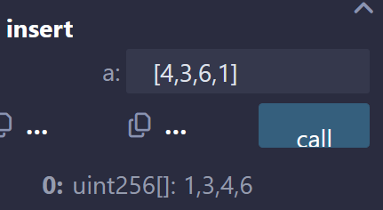
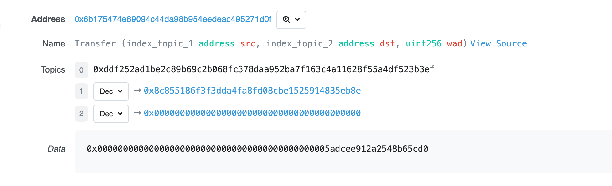
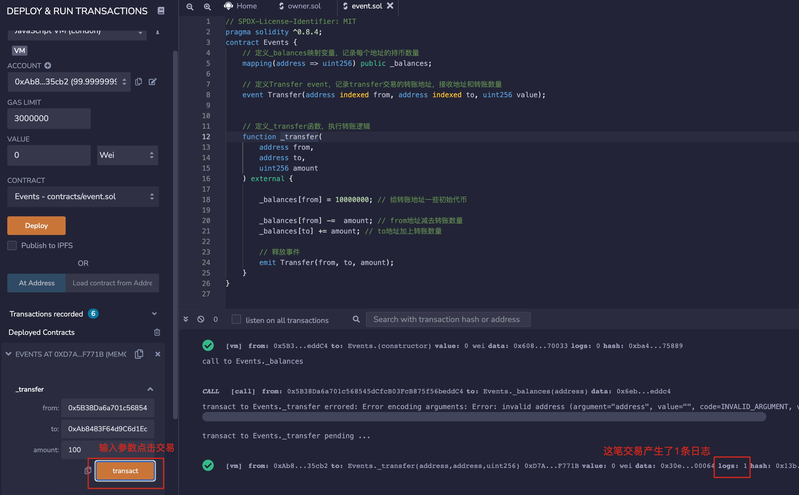
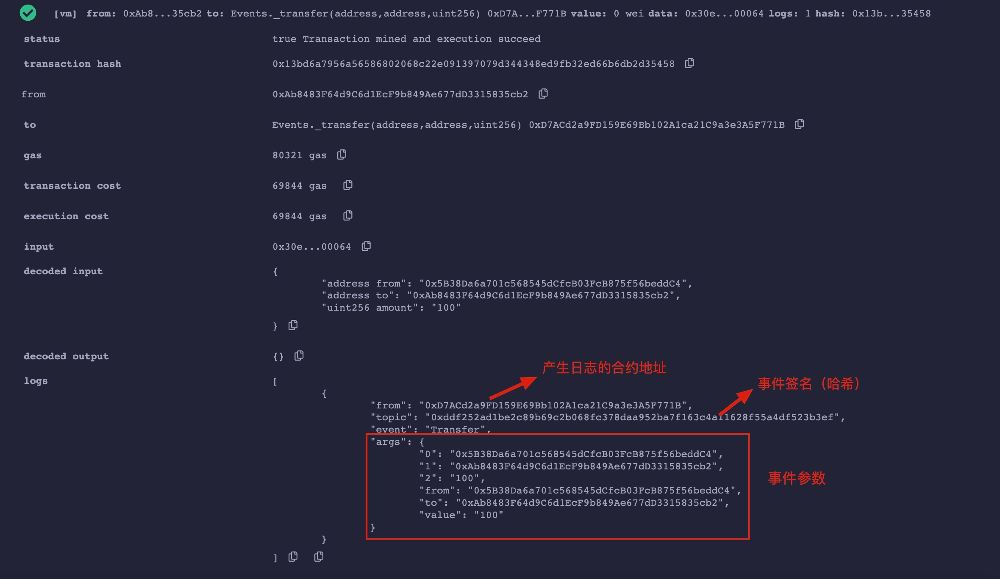

# <font style="color:rgb(17, 24, 39);">变量数据存储和作用域</font>
## 引用类型（array、struct、mapping）
> 引用类型(Reference Type)：包括数组（array），结构体（struct）和映射（mapping），这类变量占空间大，赋值时候直接传递地址（类似指针）。由于这类变量比较复杂，占用存储空间大，我们在使用时必须要声明数据存储的位置。
>

## 数据位置(storage、memory、calldata)
> solidity数据存储位置有三类：storage，memory和calldata。不同存储位置的gas成本不同。storage类型的数据存在链上，类似计算机的硬盘，消耗gas多；memory和calldata类型的临时存在内存里，消耗gas少。大致用法：
>

1. storage：合约里的状态变量默认都是storage，存储在链上。
2. memory：函数里的参数和临时变量一般用memory，存储在内存中，不上链。
3. calldata：和memory类似，存储在内存中，不上链。与memory的不同点在于calldata变量不能修改（immutable），一般用于函数的参数。
4. storage，memory和calldata只能用于数组（array），结构体（struct）和映射（mapping）。

## 赋值规则
> 在不同存储类型相互赋值时候，有时会产生独立的副本（修改新变量不会影响原变量），有时会产生引用（修改新变量会影响原变量）。规则如下：
>

1. <font style="color:rgb(17, 17, 17);">在Solidity中，</font>**<font style="color:rgb(17, 17, 17);">storage</font>**<font style="color:rgb(17, 17, 17);">关键字用于指定数据位置。</font>storage（合约的状态变量）赋值给本地storage（函数里的）时候，会创建引用，改变新变量会影响原变量。例子：

```plain
uint[] x = [1,2,3]; // 状态变量：数组 x

function fStorage() public{
    //声明一个storage的变量 xStorage，指向x。修改xStorage也会影响x
    uint[] storage xStorage = x;
    xStorage[0] = 100;
}
```

运行完函数fStorage后，x[0]=100。状态变量x的值会随着xStorage的改变而改变

2. storage赋值给memory，会创建独立的副本，修改其中一个不会影响另一个；反之亦然。例子：

```plain
uint[] x = [1,2,3]; // 状态变量：数组 x

function fMemory() public view{
    //声明一个Memory的变量xMemory，复制x。修改xMemory不会影响x
    uint[] memory xMemory = x;
    xMemory[0] = 100;
    xMemory[1] = 200;
    uint[] memory xMemory2 = x;
    xMemory2[0] = 300;
}
```

3. memory赋值给memory，会创建引用，改变新变量会影响原变量。
4. 其他情况，变量赋值给storage，会创建独立的副本，修改其中一个不会影响另一个。

## 变量的作用域
> Solidity中变量按作用域划分有三种，分别是状态变量（state variable），局部变量（local variable）和全局变量(global variable)
>

## 状态变量
1. 状态变量是数据存储在链上的变量，所有合约内函数都可以访问 ，gas消耗高。状态变量在合约内、函数外声明：

```plain
contract Variables {
    uint public x = 1;
    uint public y;
    string public z;
```

2. 我们可以在函数里更改状态变量的值：

```plain
    function foo() external{
        // 可以在函数里更改状态变量的值
        x = 5;
        y = 2;
        z = "0xAA";
    }
```

## 局部变量
1. 局部变量是仅在函数执行过程中有效的变量，函数退出后，变量无效。局部变量的数据存储在内存里，不上链，gas低。局部变量在函数内声明：

```plain
    function bar() external pure returns(uint){
        uint xx = 1;
        uint yy = 3;
        uint zz = xx + yy;
        return(zz);
    }
```

## 全局变量
1. 全局变量是全局范围工作的变量，都是solidity预留关键字。他们可以在函数内不声明直接使用：

```plain
    function global() external view returns(address, uint, bytes memory){
        address sender = msg.sender;
        uint blockNum = block.number;
        bytes memory data = msg.data;
        return(sender, blockNum, data);
    }
```

在上面例子里，我们使用了3个常用的全局变量：msg.sender, block.number和msg.data，他们分别代表请求发起地址，当前区块高度，和请求数据。

2. 下面是一些常用的全局变量，更完整的列表请看这个[单位和全局变量 — Solidity中文文档 — 登链社区](https://learnblockchain.cn/docs/solidity/units-and-global-variables.html#special-variables-and-functions)：

> + blockhash(uint blockNumber): (bytes32)给定区块的哈希值 – 只适用于256最近区块, 不包含当前区块。
> + block.coinbase: (address payable) 当前区块矿工的地址
> + block.gaslimit: (uint) 当前区块的gaslimit
> + block.number: (uint) 当前区块的number
> + block.timestamp: (uint) 当前区块的时间戳，为unix纪元以来的秒
> + gasleft(): (uint256) 剩余 gas
> + msg.data: (bytes calldata) 完整call data
> + msg.sender: (address payable) 消息发送者 (当前 caller)
> + msg.sig: (bytes4) calldata的前四个字节 (function identifier)
> + msg.value: (uint) 当前交易发送的wei值
>

# 引用类型
## <font style="color:rgb(17, 24, 39);">数组 array</font>
1. 数组（Array）是solidity常用的一种变量类型，用来存储一组数据（整数，字节，地址等等）。数组分为固定长度数组和可变长度数组两种：
2. 固定长数组：在声明时指定数组的长度。用T[k]的格式声明，其中T是元素的类型，k是长度，例如：

```plain
    // 固定长度 Array
    uint[8] array1;
    bytes1[5] array2;
    address[100] array3;
```

3. 可变长度数组（动态数组）：在声明时不指定数组的长度。用T[]的格式声明，其中T是元素的类型，例如：

```plain
    // 可变长度 Array
    uint[] array4;
    bytes1[] array5;
    address[] array6;
    bytes array7;
```

4. 注意：bytes比较特殊，是数组，但是不用加[]。另外，不能用byte[]声明单字节数组，可以使用bytes或bytes1[]。在gas上，bytes比bytes1[]便宜。因为bytes1[]在memory中要增加31个字节进行填充，会产生额外的gas。但是在storage中，由于内存紧密打包，不存在字节填充。
5. 创建数组的规则：对于memory修饰的动态数组，可以用new操作符来创建，但是必须声明长度，并且声明后长度不能改变。例子：

```plain
// memory动态数组
uint[] memory array8 = new uint;
bytes memory array9 = new bytes(9);
```

6. 数组字面常数(Array Literals)是写作表达式形式的数组，用方括号包着来初始化array的一种方式，并且里面每一个元素的type是以第一个元素为准的，例如[1,2,3]里面所有的元素都是uint8类型，因为在solidity中如果一个值没有指定type的话，默认就是最小单位的该type，这里int的默认最小单位类型就是uint8。而[uint(1),2,3]里面的元素都是uint类型，因为第一个元素指定了是uint类型了，我们都以第一个元素为准。 下面的合约中，对于f函数里面的调用，如果我们没有显式对第一个元素进行uint强转的话，是会报错的，因为如上所述我们其实是传入了uint8类型的array，可是g函数需要的却是uint类型的array，就会报错了。

```plain
// SPDX-License-Identifier: GPL-3.0
pragma solidity >=0.4.16 <0.9.0;

contract C {
function f() public pure {
g([uint(1), 2, 3]);
}
function g(uint[3] memory) public pure {
// ...
}
}
```

7. 如果创建的是动态数组，你需要一个一个元素的赋值（初始的动态数组是为元素个数为0）。

```plain
uint[] memory x = new uint;
x[0] = 1;
x[1] = 3;
x[2] = 4;
```

8. 数组成员：
    1. length: 数组有一个包含元素数量的length成员，memory数组的长度在创建后是固定的。
    2. push(): 动态数组和bytes拥有push()成员，可以在数组最后添加一个0元素。
    3. push(x): 动态数组和bytes拥有push(x)成员，可以在数组最后添加一个x元素。
    4. pop(): 动态数组和bytes拥有pop()成员，可以移除数组最后一个元素。

## <font style="color:rgb(17, 24, 39);">结构体 struct</font>
1. Solidity支持通过构造结构体的形式定义新的类型。创建结构体的方法：

```solidity
// 结构体
    struct Student{
        uint256 id;
        uint256 score; 
    }
```

```solidity
Student student; // 初始一个student结构体
```

2. 给结构体赋值的两种方法：

```solidity
//  给结构体赋值
    // 方法1:在函数中创建一个storage的struct引用
    function initStudent1() external{
        Student storage _student = student; // assign a copy of student
        _student.id = 11;
        _student.score = 100;
    }
```

```plain
 // 方法2:直接引用状态变量的struct
function initStudent2() external{
    student.id = 1;
    student.score = 80;
}
```

## 字符串 string
1. 定义string

```python
string mystring
```

2. 在使用时，需要用memory标注。**<font style="color:rgb(17, 17, 17);">memory</font>**<font style="color:rgb(17, 17, 17);"> 关键字表示返回值将存储在内存中，而不是存储在合约的状态变量中。这是因为字符串类型是动态类型，需要在运行时分配内存。如果需要在函数中使用字符串变量，请使用 </font>**<font style="color:rgb(17, 17, 17);">memory</font>**<font style="color:rgb(17, 17, 17);"> 关键字来标注变量类型。</font>

```solidity
function myFunction(string memory myString) public returns (string memory) {
  return(myString);
}

```

3. solidity中<font style="color:#DF2A3F;">''</font>单引号用于字符，<font style="color:#DF2A3F;">""</font>双引号用于字符串.eg：'h'，"hellow"。

# 映射类型mapping
## <font style="color:rgb(17, 24, 39);">声明映射</font>
1. <font style="color:rgb(17, 24, 39);">格式为mapping(_KeyType => _ValueType)，其中_KeyType和_ValueType分别是Key和Value的变量类型。</font>

```plain
mapping(uint => address) public idToAddress; // id映射到地址
mapping(address => address) public swapPair; // 币对的映射，地址到地址
```

## 映射规则
1. <font style="color:rgb(17, 24, 39);">映射的_KeyType只能选择solidity默认的类型，比如uint，address等，不能用自定义的结构体。而_ValueType可以使用自定义的类型。下面这个例子会报错，因为_KeyType使用了我们自定义的结构体：</font>

```plain
    // 我们定义一个结构体 Struct
    struct Student{
        uint256 id;
        uint256 score; 
    }
     mapping(Student => uint) public testVar;
```

2. <font style="color:rgb(17, 24, 39);">映射的存储位置必须是storage，因此可以用于合约的状态变量，函数中的storage变量，和library函数的参数（见</font>[<font style="color:rgb(17, 24, 39);">例子</font>](https://github.com/ethereum/solidity/issues/4635)<font style="color:rgb(17, 24, 39);">）。不能用于public函数的参数或返回结果中，因为mapping记录的是一种关系 (key - value pair)。</font>
3. <font style="color:rgb(17, 24, 39);">如果映射声明为public，那么solidity会自动给你创建一个getter函数，可以通过Key来查询对应的Value。</font>
4. <font style="color:rgb(17, 24, 39);">给映射新增的键值对的语法为_Var[_Key] = _Value，其中_Var是映射变量名，_Key和_Value对应新增的键值对。例子：</font>

```plain
function writeMap (uint _Key, address _Value) public{
    idToAddress[_Key] = _Value;
}
```

## <font style="color:rgb(17, 24, 39);">映射的原理</font>
1. <font style="color:rgb(17, 24, 39);">映射不储存任何键（Key）的资讯，也没有length的资讯。</font>
2. <font style="color:rgb(17, 24, 39);">映射使用keccak256(key)当成offset存取value。（</font>[<font style="color:rgb(17, 24, 39);">在映射类型中，使用keccak256(key)作为offset来存储和访问value。offset是一个整数，它表示value在存储器中的位置。</font>](https://blog.csdn.net/hina90/article/details/129795368)<font style="color:rgb(17, 24, 39);">）</font>
3. <font style="color:rgb(17, 24, 39);">因为Ethereum会定义所有未使用的空间为0，所以未赋值（Value）的键（Key）初始值都是各个type的默认值，如uint的默认值是0。</font>

# <font style="color:rgb(17, 24, 39);">变量初始值</font>
## 值类型初始值
1. <font style="color:rgb(17, 24, 39);">boolean: false</font>
2. <font style="color:rgb(17, 24, 39);">string</font><font style="color:rgb(17, 24, 39);">:</font><font style="color:rgb(17, 24, 39);"> </font><font style="color:rgb(17, 24, 39);">""</font>
3. <font style="color:rgb(17, 24, 39);">int</font><font style="color:rgb(17, 24, 39);">:</font><font style="color:rgb(17, 24, 39);"> </font><font style="color:rgb(17, 24, 39);">0</font>
4. <font style="color:rgb(17, 24, 39);">uint</font><font style="color:rgb(17, 24, 39);">:</font><font style="color:rgb(17, 24, 39);"> </font><font style="color:rgb(17, 24, 39);">0</font>
5. <font style="color:rgb(17, 24, 39);">enum</font><font style="color:rgb(17, 24, 39);">: 枚举中的第一个元素</font>
6. <font style="color:rgb(17, 24, 39);">address</font><font style="color:rgb(17, 24, 39);">:</font><font style="color:rgb(17, 24, 39);"> </font><font style="color:rgb(17, 24, 39);">0x0000000000000000000000000000000000000000</font><font style="color:rgb(17, 24, 39);"> </font><font style="color:rgb(17, 24, 39);">(或</font><font style="color:rgb(17, 24, 39);"> </font><font style="color:rgb(17, 24, 39);">address(0)</font><font style="color:rgb(17, 24, 39);">)</font>
7. <font style="color:rgb(17, 24, 39);">function</font>
    1. <font style="color:rgb(17, 24, 39);">internal</font><font style="color:rgb(17, 24, 39);">: 空白方程</font>
    2. <font style="color:rgb(17, 24, 39);">external: 空白方程</font>

## <font style="color:rgb(17, 24, 39);">引用类型初始值</font>
1. <font style="color:rgb(17, 24, 39);">映射mapping: 所有元素都为其默认值的mapping</font>
2. <font style="color:rgb(17, 24, 39);">结构体</font><font style="color:rgb(17, 24, 39);">struct</font><font style="color:rgb(17, 24, 39);">: 所有成员设为其默认值的结构体</font>
3. <font style="color:rgb(17, 24, 39);">数组</font><font style="color:rgb(17, 24, 39);">array</font>
    1. <font style="color:rgb(17, 24, 39);">动态数组:</font><font style="color:rgb(17, 24, 39);"> </font><font style="color:rgb(17, 24, 39);">[]</font>
    2. <font style="color:rgb(17, 24, 39);">静态数组（定长）: 所有成员设为其默认值的静态数组</font>

## delete<font style="color:rgb(17, 24, 39);">操作符</font>
1. <font style="color:rgb(17, 24, 39);">delete a会让变量a的值变为初始值。</font>

# <font style="color:rgb(17, 24, 39);">常数变量</font>
<font style="color:rgb(17, 24, 39);">我们介绍solidity中两个关键字，constant（常量）和immutable（不变量）。状态变量声明这个两个关键字之后，不能在合约后更改数值；并且还可以节省gas。另外，只有数值变量可以声明constant和immutable；string和bytes可以声明为constant，但不能为immutable。</font>

## <font style="color:rgb(17, 24, 39);">constant</font>
<font style="color:rgb(17, 24, 39);">constant变量必须在声明的时候初始化，之后再也不能改变。尝试改变的话，编译不通过。</font>

## <font style="color:rgb(17, 24, 39);">immutable</font>
<font style="color:rgb(17, 24, 39);">immutable变量可以在声明时或构造函数中初始化，因此更加灵活。</font>

# <font style="color:rgb(17, 24, 39);">控制流</font>
1. 和c++类似：又if-else，for, while,  break,  continue ,  do while 等，都和c++是用方式一样
2. 排序代码：

```plain
// SPDX-License-Identifier: MIT
pragma solidity ^0.8.17;

contract Try {
    function insert(uint[] memory a) public pure returns(uint[] memory){
        for(uint q = 0; q<a.length-1; q++)
        {
            for(uint w = q+1; w<a.length; w++)
            {
                uint s;
                if(a[q]>a[w])
                {
                    s=a[q];
                    a[q]=a[w];
                    a[w]=s;
                }
            }
        }
        return(a);
    }
}
```



# 构造函数和修饰器
## 构造函数（constructor）
1. <font style="color:rgb(17, 24, 39);">构造函数（constructor）是一种特殊的函数，每个合约可以定义一个，并在部署合约的时候自动运行一次。它可以用来初始化合约的一些参数，例如初始化合约的owner地址。</font>
2. <font style="color:rgb(17, 24, 39);">在 Solidity 中，构造函数constructor会在每次创建类的新对象时执行，用于为某些成员变量设置初始值</font><font style="color:rgb(17, 17, 17);">. 这些成员变量的初始值是存储在合约的状态变量中，而不是链上。</font>
3. <font style="color:rgb(17, 17, 17);">构造函数不需要可见性修饰符。</font>
4. <font style="color:rgb(17, 24, 39);">注意：构造函数在不同的solidity版本中的语法并不一致，在Solidity 0.4.22之前，构造函数不使用 co</font>nstructor 而是使用与合约名同名的函数作为构造函数而使用，由于这种旧写法容易使开发者在书写时发生疏漏（例如合约名叫 Parents，构造函数名写成 parents），使得构造函数变成普<font style="color:rgb(17, 24, 39);">通函数，引发漏洞，所以0.4.22版本及之后，采用了全新的 constructor 写法。</font>


```solidity
string brand;
uint price;
constructor(string memory initbrand, uint initprice) {
    brand = initbrand;
    price = initprice;
}
```

## <font style="color:rgb(17, 24, 39);">修饰器（modifier）</font>
1. modifier的是用方法

> modifier modifierName (parameterList) {
>
>  // modifier logic
>
>  _; // execute the function
>
> }
>
> 其中，modifierName是modifier的名称，parameterList是modifier的参数列表，modifier logic是modifier的逻辑代码，_ 是标记被修饰函数的执行位置的占位符
>
> require是Solidity中的一个函数，用于检查函数的输入参数或合约状态变量是否满足某些条件。如果条件不满足，则函数会抛出异常并回滚交易
>

2. <font style="color:rgb(17, 24, 39);">_是Solidity中的一个占位符，用于标记被修饰函数的执行位置。在modifier中，_的作用是告诉编译器将被修饰函数的执行位置替换到这里。在modifier中，_的位置决定了被修饰函数的执行位置。例如，如果将_放在modifier的最后一行，则被修饰函数的执行位置将在modifier的最后一行</font>
3. 实例

```plain
contract Ownable {
  address public owner;

  event OwnershipTransferred(address indexed previousOwner, address indexed newOwner);

  function Ownable() public {
    owner = msg.sender;
  }

  modifier onlyOwner() {
    require(msg.sender == owner);
    _;
  }

//被修饰函数
  function transferOwnership(address newOwner) public onlyOwner {
    require(newOwner != address(0));
    OwnershipTransferred(owner, newOwner);
    owner = newOwner;
  }
}

```

# 事件（event）
## 事件
1. 事件的特点：Solidity中的事件（event）是EVM上日志的抽象，它具有两个特点：
    1. 响应：应用程序（ethers.js）可以通过RPC接口订阅和监听这些事件，并在前端做响应。
    2. 经济：事件是EVM上比较经济的存储数据的方式，每个大概消耗2,000 gas；相比之下，链上存储一个新变量至少需要20,000 gas。
2. 声明事件：事件的声明由event关键字开头，接着是事件名称，括号里面写好事件需要记录的变量类型和变量名。

> eg：event Transfer(address indexed from, address indexed to, uint256 value);
>
> 我们可以看到，Transfer事件共记录了3个变量from，to和value，分别对应代币的转账地址，接收地址和转账数量，其中from和to前面带有indexed关键字，他们会保存在以太坊虚拟机日志的topics中，方便之后检索<font style="color:rgb(17, 24, 39);">。</font>
>

3. 释放事件：我们可以在函数里释放事件。在下面的例子中，每次用_transfer()函数进行转账操作的时候，都会释放Transfer事件，并记录相应的变量<font style="color:rgb(17, 24, 39);">。</font>

```plain
    // 定义_transfer函数，执行转账逻辑
    function _transfer(
        address from,
        address to,
        uint256 amount
    ) external {

        _balances[from] = 10000000; // 给转账地址一些初始代币

        _balances[from] -=  amount; // from地址减去转账数量
        _balances[to] += amount; // to地址加上转账数量

        // 释放事件
        emit Transfer(from, to, amount);
    }
```

## EVM日志（log）
以太坊虚拟机（EVM）用日志**Log**<font style="color:rgb(17, 24, 39);">来存储</font>**Solidity**<font style="color:rgb(17, 24, 39);">事件，每条日志记录都包含主题</font>**topics**<font style="color:rgb(17, 24, 39);">和数据</font>**data**两部分。

### <font style="color:rgb(17, 24, 39);">主题 </font>Topics
日志的第一部分是主题数组，用于描述事件，长度不能超过</font>**4**<font style="color:rgb(17, 24, 39);">。它的第一个元素是事件的签名（哈希）。对于上面的</font>**Transfer**<font style="color:rgb(17, 24, 39);">事件，它的签名就是：</font>

```solidity
keccak256("Transfer(addrses,address,uint256)")

//0xddf252ad1be2c89b69c2b068fc378daa952ba7f163c4a11628f55a4df523b3ef
```

<font style="color:rgb(17, 24, 39);">除了事件签名，主题还可以包含至多</font>**3**<font style="color:rgb(17, 24, 39);">个</font>**indexed**<font style="color:rgb(17, 24, 39);">参数，也就是</font>**Transfer**<font style="color:rgb(17, 24, 39);">事件中的</font>**from**<font style="color:rgb(17, 24, 39);">和</font>**to**<font style="color:rgb(17, 24, 39);">。</font>

**indexed**<font style="color:rgb(17, 24, 39);">标记的参数可以理解为检索事件的索引“键”，方便之后搜索。每个 </font>**indexed** 参数的大小为固定的256比特，如果参数太大了（比如字符串），就会自动计算哈希存储在主题中。

### <font style="color:rgb(17, 24, 39);">数据</font><font style="color:rgb(17, 24, 39);"> </font>**Data**
<font style="color:rgb(17, 24, 39);">事件中不带 </font>**indexed**<font style="color:rgb(17, 24, 39);">的参数会被存储在 </font>**data**<font style="color:rgb(17, 24, 39);"> 部分中，可以理解为事件的“值”。</font>**data**<font style="color:rgb(17, 24, 39);"> 部分的变量不能被直接检索，但可以存储任意大小的数据。因此一般 </font>**data**<font style="color:rgb(17, 24, 39);"> 部分可以用来存储复杂的数据结构，例如数组和字符串等等，因为这些数据超过了256比特，即使存储在事件的 </font>**topic**<font style="color:rgb(17, 24, 39);"> 部分中，也是以哈希的方式存储。另外，</font>**data**<font style="color:rgb(17, 24, 39);"> 部分的变量在存储上消耗的gas相比于 </font>**topic** 更少。





# 继承
## 规则
1. **virtual**<font style="color:rgb(17, 24, 39);">: 父合约中的函数，如果希望子合约重写，需要加上</font>**virtual**<font style="color:rgb(17, 24, 39);">关键字。</font>
2. **override**<font style="color:rgb(17, 24, 39);">：子合约重写了父合约中的函数，需要加上</font>**override**<font style="color:rgb(17, 24, 39);">关键字。</font>
3. **注意**<font style="color:rgb(17, 24, 39);">：用</font>**override**<font style="color:rgb(17, 24, 39);">修饰</font>**public**<font style="color:rgb(17, 24, 39);">变量，会重写与变量同名的</font>**getter**<font style="color:rgb(17, 24, 39);">函数，</font>

## 简单继承
1. <font style="color:rgb(17, 24, 39);">我们先写一个简单的爷爷合约</font>**Yeye**<font style="color:rgb(17, 24, 39);">，里面包含1个</font>**Log**<font style="color:rgb(17, 24, 39);">事件和3个</font>**function**<font style="color:rgb(17, 24, 39);">: </font>**hip()**<font style="color:rgb(17, 24, 39);">, </font>**pop()**<font style="color:rgb(17, 24, 39);">, </font>**yeye()**<font style="color:rgb(17, 24, 39);">，输出都是”Yeye”。</font>

```solidity
contract Yeye {
    event Log(string msg);

    // 定义3个function: hip(), pop(), man()，Log值为Yeye。
    function hip() public virtual{
        emit Log("Yeye");
    }

    function pop() public virtual{
        emit Log("Yeye");
    }

    function yeye() public virtual {
        emit Log("Yeye");
    }
}
```

<font style="color:rgb(17, 24, 39);">我们再定义一个爸爸合约</font>**Baba**<font style="color:rgb(17, 24, 39);">，让他继承</font>**Yeye**<font style="color:rgb(17, 24, 39);">合约，语法就是</font>**contract Baba is Yeye**<font style="color:rgb(17, 24, 39);">，非常直观。在</font>**Baba**<font style="color:rgb(17, 24, 39);">合约里，我们重写一下</font>**hip()**<font style="color:rgb(17, 24, 39);">和</font>**pop()**<font style="color:rgb(17, 24, 39);">这两个函数，加上</font>**override**<font style="color:rgb(17, 24, 39);">关键字，并将他们的输出改为</font>**”Baba”**<font style="color:rgb(17, 24, 39);">；并且加一个新的函数</font>**baba**<font style="color:rgb(17, 24, 39);">，输出也是</font>**”Baba”**<font style="color:rgb(17, 24, 39);">。</font>

```solidity
contract Baba is Yeye{
    // 继承两个function: hip()和pop()，输出改为Baba。
    function hip() public override{
        emit Log("Baba");
    }

    function pop() public override{
        emit Log("Baba");
    }

    function baba() public {
        emit Log("Baba");
    }
}
```

<font style="color:rgb(17, 24, 39);">我们部署合约，可以看到</font>**Baba**<font style="color:rgb(17, 24, 39);">合约里有4个函数，其中</font>**hip()**<font style="color:rgb(17, 24, 39);">和</font>**pop()**<font style="color:rgb(17, 24, 39);">的输出被成功改写成</font>**”Baba”**<font style="color:rgb(17, 24, 39);">，而继承来的</font>**yeye()**<font style="color:rgb(17, 24, 39);">的输出仍然是</font>**”Yeye”**<font style="color:rgb(17, 24, 39);">。</font>

## <font style="color:rgb(17, 24, 39);">多重继承</font>
1. **solidity**<font style="color:rgb(17, 24, 39);">的合约可以继承多个合约。规则：</font>
    1. <font style="color:rgb(17, 24, 39);">继承时要按</font>**<font style="color:rgb(17, 24, 39);">辈分最高到最低的顺序排</font>**<font style="color:rgb(17, 24, 39);">。比如我们写一个</font>**Erzi**<font style="color:rgb(17, 24, 39);">合约，继承</font>**Yeye**<font style="color:rgb(17, 24, 39);">合约和</font>**Baba**<font style="color:rgb(17, 24, 39);">合约，那么就要写成</font>**contract Erzi is Yeye, Baba**<font style="color:rgb(17, 24, 39);">，而不能写成</font>**contract Erzi is Baba, Yeye**<font style="color:rgb(17, 24, 39);">，不然就会报错。</font>
    2. <font style="color:rgb(17, 24, 39);">如果某一个函数在多个继承的合约里都存在，比如例子中的</font>**hip()**<font style="color:rgb(17, 24, 39);">和</font>**pop()**<font style="color:rgb(17, 24, 39);">，在子合约里必须重写，不然会报错。</font>
    3. <font style="color:rgb(17, 24, 39);">重写在多个父合约中都重名的函数时，</font>**override**<font style="color:rgb(17, 24, 39);">关键字后面要加上所有父合约名字，例如</font>**override(Yeye, Baba)**<font style="color:rgb(17, 24, 39);">。</font>
2. 实例：

```plain
contract Erzi is Yeye, Baba{
    // 继承两个function: hip()和pop()，输出值为Erzi。
    function hip() public virtual override(Yeye, Baba){
        emit Log("Erzi");
    }

    function pop() public virtual override(Yeye, Baba) {
        emit Log("Erzi");
    }
```

<font style="color:rgb(17, 24, 39);">我们可以看到，Erzi合约里面重写了hip()和pop()两个函数，将输出改为”Erzi”，并且还分别从Yeye和Baba合约继承了yeye()和baba()两个函数。</font>

## <font style="color:rgb(17, 24, 39);">修饰器的继承</font>
<font style="color:rgb(17, 24, 39);">Solidity中的修饰器（Modifier）同样可以继承，用法与函数继承类似，在相应的地方加virtual和override关键字即可。</font>

## <font style="color:rgb(17, 24, 39);">调用父合约的函数</font>
1. <font style="color:rgb(17, 24, 39);">直接调用：子合约可以直接用</font>**父合约名.函数名()**<font style="color:rgb(17, 24, 39);">的方式来调用父合约函数，例如</font>**Yeye.pop()**<font style="color:rgb(17, 24, 39);">。</font>

```solidity
function callParent() public{
    Yeye.pop();
}
```

2. **super**<font style="color:rgb(17, 24, 39);">关键字：子合约可以利用</font>**super.函数名()**<font style="color:rgb(17, 24, 39);">来调用最近的父合约函数。</font>**solidity**<font style="color:rgb(17, 24, 39);">继承关系按声明时从右到左的顺序是：</font>**contract Erzi is Yeye, Baba**<font style="color:rgb(17, 24, 39);">，那么</font>**Baba**<font style="color:rgb(17, 24, 39);">是最近的父合约，</font>**super.pop()**<font style="color:rgb(17, 24, 39);">将调用</font>**Baba.pop()**<font style="color:rgb(17, 24, 39);">而不是</font>**Yeye.pop()**<font style="color:rgb(17, 24, 39);">：</font>

# <font style="color:rgb(17, 24, 39);">异常</font>
## <font style="color:rgb(17, 24, 39);">Error</font>
<font style="color:rgb(17, 24, 39);">error是solidity 0.8.4版本新加的内容，方便且高效（省gas）地向用户解释操作失败的原因，同时还可以在抛出异常的同时携带参数，帮助开发者更好地调试。人们可以在contract之外定义异常。下面，我们定义一个TransferNotOwner异常，当用户不是代币owner的时候尝试转账，会抛出错误：</font>

## require
<font style="color:rgb(17, 24, 39);">require</font><font style="color:rgb(17, 24, 39);">命令是</font><font style="color:rgb(17, 24, 39);">solidity 0.8版本</font><font style="color:rgb(17, 24, 39);">之前抛出异常的常用方法，目前很多主流合约仍然还在使用它。它很好用，唯一的缺点就是</font><font style="color:rgb(17, 24, 39);">gas</font><font style="color:rgb(17, 24, 39);">随着描述异常的字符串长度增加，比</font><font style="color:rgb(17, 24, 39);">error</font><font style="color:rgb(17, 24, 39);">命令要高。使用方法：</font><font style="color:rgb(17, 24, 39);">require(检查条件，"异常的描述")</font><font style="color:rgb(17, 24, 39);">，当检查条件不成立的时候，就会抛出异常。</font>

## <font style="color:rgb(17, 24, 39);">Assert</font>
<font style="color:rgb(17, 24, 39);">assert命令一般用于程序员写程序debug，因为它不能解释抛出异常的原因（比require少个字符串）。它的用法很简单，assert(检查条件），当检查条件不成立的时候，就会抛出异常。</font>

