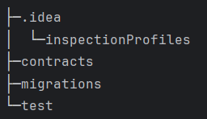

# ganache

图形化界面从[Releases · trufflesuite/ganache-ui (github.com)](https://github.com/trufflesuite/ganache-ui/releases)下载，

在 Ganache 中，账户的公私钥对是基于椭圆曲线数字签名算法（ECDSA）生成的。这与以太坊主网中账户的密钥生成方式相同，因为 Ganache 是用于模拟以太坊环境的工具。

# truffle

1. 在下载truffle以前，先要下载nodejs
2. 下载好后用npm命令下载（用淘宝的镜像或者直接挂加速器都下不了，最后用华为云的镜像成功下载。华为云镜像设置：npm config set registry https://mirrors.huaweicloud.com/repository/npm/）
3. npm下载命令：npm install -g truffle

## 创建项目

1. 可以通过cmd命令在文件目录中创建项目

   ```
   # 例如切换到桌面的论文目录（假设你的项目要初始化在这个目录下）
   cd C:\Users\上善若水\Desktop\test
   # 执行truffle init命令
   truffle init
   ```

2. 也可以通过pycharm的终端输入命令truffle init创建项目（相当于在一个python项目里面创建一个truffle项目）

3. 项目结构： 

   1. contracts：用于存放智能合约
   2. migrations：部署脚本文件
   3. test：测试脚本目录
   4. truffle-config.js：truffle配置文件                                                                                                                                         


# brownie

[Installing Brownie — Brownie 1.19.3 documentation](https://eth-brownie.readthedocs.io/en/latest/install.html)

[https://github.com/trufflesuite/ganache](https://github.com/trufflesuite/ganache)


<font style="color:#DF2A3F;">brownie在运行脚本时，不要启动ganache（brownie会自己连接ganache。若运行时启动了ganache，则会出现一直卡在Awaiting transaction in the mempool...）</font>

##  新建项目
1. 新建文件夹
2. 在文件夹中打开终端，输入命令

```python
brownie init
```

## 编译智能合约
1. 将写好的智能合约文件（后缀名.sol）放入contracts文件夹中
2. solc编译兼容智能合约

```solidity
如果您已经安装了 solc，但仍然遇到与 Solidity 合约版本不兼容的问题，
您可以使用 solc-select 工具来管理多个 solc 版本。solc-select 
可以让您轻松地在不同的 Solidity 合约之间切换 solc 版本。
以下是使用 solc-select 的步骤：

安装 solc-select 工具。您可以使用以下命令在 Ubuntu 上安装 solc-select：

#这个命令的作用是将 Ethereum 的 PPA (Personal Package Archives) 存储库
添加到 Ubuntu 系统中。PPA 存储库包含了 Ethereum 的稳定和开发版本，可以让
您轻松地安装和更新 Ethereum 软件。
sudo add-apt-repository ppa:ethereum/ethereum 

pip3 install solc-select

安装您需要的 solc 版本。例如，要安装 Solidity 0.8.17，请使用以下命令：
solc-select install 0.8.17

切换到所需的 solc 版本。例如，要切换到 Solidity 0.8.17，请使用以下命令：
solc-select use 0.8.17

确认您已经切换到正确的 solc 版本。您可以使用以下命令检查当前使用的 solc 版本：
solc --version

要自动安装和使用版本，请运行
solc-select use <version> --always-install
```

3. 打开contracts文件夹中的终端，输入命令

```python
brownie compile
```


## 编写、运行脚本（或使用控制台）
### 编写脚本
1. 导入brownie中的对象
2. 脚本有函数构成（def 函数名（）），必须有main函数。<font style="color:rgb(17, 17, 17);">脚本中的执行顺序：先执行main函数，再根据main函数中的调用函数执行，相当于main函数就是普通python代码的主体部分，其他函数就是正常的函数。</font>
3. deploy函数：<font style="color:rgb(56, 58, 66);background-color:rgb(250, 250, 250);">storage = Storage.deploy({</font><font style="background-color:rgb(250, 250, 250);">"from"</font><font style="color:rgb(56, 58, 66);background-color:rgb(250, 250, 250);">: account})：</font>它的作用是在Brownie中部署一个名为Storage的合约。该合约将使用account变量中指定的账户进行部署。如果部署成功，该函数将返回一个Storage合约实例，您可以使用该实例与合约进行交互。同时在部署合约时，要传递构造函数（constructor）中的初始赋值以及调用合约的地址（<font style="color:rgb(56, 58, 66);background-color:rgb(250, 250, 250);">{</font><font style="background-color:rgb(250, 250, 250);">"from"</font><font style="color:rgb(56, 58, 66);background-color:rgb(250, 250, 250);">: account}</font>）
4. 调用函数时，storage.函数名（传递的参数，<font style="color:rgb(56, 58, 66);background-color:rgb(250, 250, 250);">{</font><font style="background-color:rgb(250, 250, 250);">"from"</font><font style="color:rgb(56, 58, 66);background-color:rgb(250, 250, 250);">: account}</font>），调用该函数的账户地址。
5. <font style="color:rgb(56, 58, 66);background-color:rgb(250, 250, 250);">accounts：</font>**<font style="color:rgb(17, 17, 17);">accounts</font>**<font style="color:rgb(17, 17, 17);"> 是 </font>**<font style="color:rgb(17, 17, 17);">Brownie</font>**<font style="color:rgb(17, 17, 17);"> 中的一个内置对象，它允许您访问本地账户。您可以使用 </font>**<font style="color:rgb(17, 17, 17);">accounts</font>**<font style="color:rgb(17, 17, 17);">对象来创建新账户、列出现有账户、获取默认账户等</font>
6. <font style="color:rgb(17, 17, 17);">在部署脚本中，可以在函数外直接写的内容包括（都必须在要调用合约、库···的函数前面）：</font>
    1. <font style="color:rgb(17, 17, 17);">导入模块和库</font>
    2. <font style="color:rgb(17, 17, 17);">定义变量和常量</font>
    3. <font style="color:rgb(17, 17, 17);">定义函数和类</font>
    4. <font style="color:rgb(17, 17, 17);">定义合约实例</font>
7. 每一次deploy都会部署一个新的合约实例，即使是同一个合约
8. <font style="color:#DF2A3F;">注意：“from”</font>中不能有任何多余字符，空格也不行<u><font style="color:#DF2A3F;">“from ”</font></u>多了一个空格也是错的

### 运行脚本
1. 将脚本（deploy.py）放入scripts文件夹中，在项目总文件夹中打开终端，输入命令

```python
brownie run scripts/deploy.py 
```

## 删除项目
1. 在该项目总的文件夹所在目录打开终端，输入以下命令

```python
rm -rf <project_name>
//<project_name>：文件夹的名称
```

## 单元测试
1. 测试时，脚本名字和脚本中函数的名字都应该以<font style="color:#1DC0C9;">test_</font>为开头，脚本放在tests文件夹内
2. 在tests文件夹内打开终端，输入命令

```solidity
brownie test
```

## 调用控制台
1. 在项目中打开终端输入：

```solidity
brownie console
```

2. <font style="color:rgb(17, 17, 17);">要结束 Brownie 控制台，使用以下命令：</font>

```python
exit()
```

<font style="color:rgb(17, 17, 17);">这将退出控制台并返回到终端。</font>

