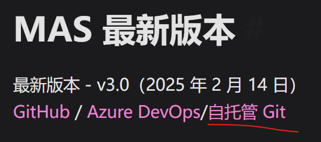

# 安装office2024专业增强版

右键office文件夹中的setup64，以管理员权限安装

# 激活

**安装好后不要立即点开office**

1. 两种方法
   1. 激活软件
      1. [Releases · zbezj/HEU_KMS_Activator (github.com)](https://github.com/zbezj/HEU_KMS_Activator/releases)
      2. 现在激活软件，点击开始即可
   2. cmd激活文件
      1. [massgravel/Microsoft-Activation-Scripts: Open-source Windows and Office activator featuring HWID, Ohook, TSforge, KMS38, and Online KMS activation methods, along with advanced troubleshooting. (github.com)](https://github.com/massgravel/Microsoft-Activation-Scripts)
      2. 通过（[Microsoft 激活脚本 （MAS） |马斯 (massgrave.dev)](https://massgrave.dev/)）转到git下载cmd文件，然后选择右键以管理员身份运行                                                                                          
      3. 选择：2（Ohook|Office|permanent）
      4. 选择：2（install Ohook Office activation）

 